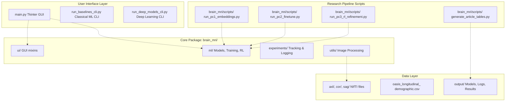
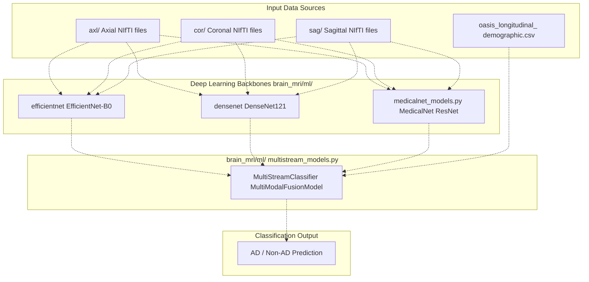
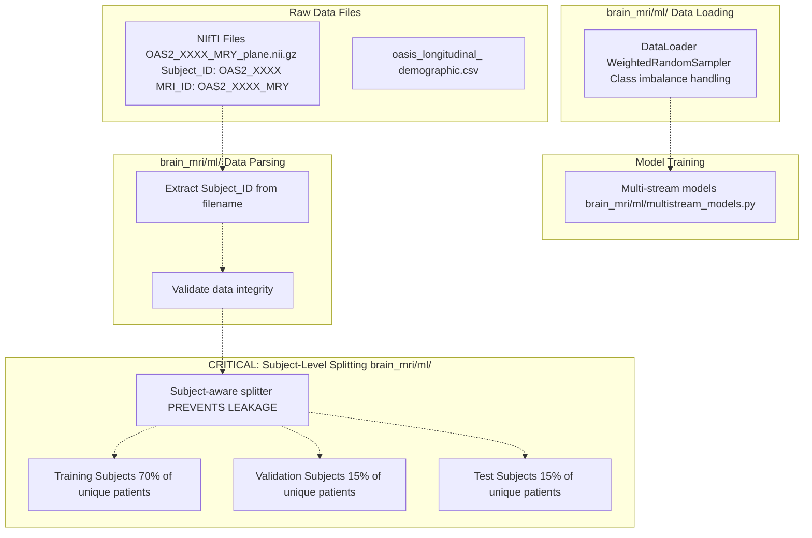

# Overview

> **Relevant source files**
> * [LICENSE](https://github.com/ThalesMMS/brain-mri-pipelines-py/blob/cd9d51a5/LICENSE)
> * [README.md](https://github.com/ThalesMMS/brain-mri-pipelines-py/blob/cd9d51a5/README.md)

**Purpose**: This document introduces the `brain-mri-pipelines-py` repository, a Python framework for Alzheimer's disease (AD) detection using multi-stream, multimodal deep learning on the OASIS-2 neuroimaging dataset. It provides an overview of the system architecture, key technical components, usage modes, and the research pipeline implemented in the codebase.

**Scope**: This page covers the high-level purpose, architecture, and entry points of the system. For detailed information about specific subsystems, refer to:

* Project methodology and research goals: [Project Goals & Methodology](#1.1)
* Installation instructions: [Installation & Dependencies](#2.1)
* Data organization: [Data Preparation](#2.2)
* Model architectures: [Models & Training](#5)
* Three-stage experimental workflow: [Three-Stage Research Pipeline](#6)

---

## Problem Domain & Research Context

The `brain-mri-pipelines-py` repository addresses Alzheimer's disease detection from structural brain MRI scans. Alzheimer's disease is a progressive neurodegenerative condition that requires early and accurate detection for effective intervention. Traditional diagnostic methods rely on clinical assessments (e.g., MMSE, CDR scores), but these are often subjective and available only after significant cognitive decline.

This framework leverages the **OASIS-2** (Open Access Series of Imaging Studies) longitudinal neuroimaging dataset to train and evaluate machine learning models for automated AD classification. The system processes multi-view MRI data (axial, coronal, sagittal anatomical planes) and integrates clinical tabular features to improve diagnostic accuracy.

**Key Challenge**: Medical imaging datasets exhibit severe class imbalance and risk data leakage when the same patient appears across multiple time points. This system implements rigorous subject-level splitting to prevent leakage and employs balanced accuracy as the primary metric.

**Sources**: [README.md L1-L3](https://github.com/ThalesMMS/brain-mri-pipelines-py/blob/cd9d51a5/README.md#L1-L3)

---

## System Architecture Overview

The repository implements a three-layer architecture separating user interfaces, core ML logic, and data management. The following diagram illustrates the high-level system organization and how components interact:

### System Component Architecture



The architecture enforces separation of concerns:

* **User Interface Layer**: Provides multiple access patterns for different workflows (interactive exploration via GUI, reproducible training via CLI)
* **Research Pipeline Scripts**: Implements the three-stage experimental methodology (embedding analysis, transfer learning, RL refinement)
* **Core Package (`brain_mri/`)**: Contains reusable ML logic, UI components, experiment tracking, and utilities
* **Data Layer**: Separates input data (MRI scans and clinical metadata) from output artifacts (trained models, logs, visualizations)

**Sources**: [README.md L177-L196](https://github.com/ThalesMMS/brain-mri-pipelines-py/blob/cd9d51a5/README.md#L177-L196)

---

## Core Technical Approach

The system implements a **multi-stream, multimodal deep learning architecture** that processes brain MRI data from three orthogonal anatomical planes (axial, coronal, sagittal) through separate convolutional streams, then fuses the visual embeddings with clinical features before classification.

### Multi-Stream Multimodal Architecture



**Key Technical Components**:

| Component | Location | Purpose |
| --- | --- | --- |
| **Deep Learning Backbones** | `brain_mri/ml/` | Extract visual features from MRI slices |
| **MedicalNet Integration** | `brain_mri/ml/medicalnet_models.py` | Med3D pretrained weights with 3D→2D kernel conversion |
| **Multi-Stream Fusion** | `brain_mri/ml/multistream_models.py` | Combines embeddings from three anatomical planes |
| **Multimodal Integration** | `brain_mri/ml/multistream_models.py` | Fuses visual embeddings with clinical tabular data |
| **Classical Baselines** | `brain_mri/ml/` | SVM and XGBoost for comparison |

**Sources**: [README.md L7-L15](https://github.com/ThalesMMS/brain-mri-pipelines-py/blob/cd9d51a5/README.md#L7-L15)

 [README.md L171-L173](https://github.com/ThalesMMS/brain-mri-pipelines-py/blob/cd9d51a5/README.md#L171-L173)

---

## Entry Points & Usage Modes

The system provides multiple entry points optimized for different workflows:

### Primary Entry Points

| Entry Point | File | Use Case | Key Features |
| --- | --- | --- | --- |
| **Interactive GUI** | `main.py` | Data exploration, visualization, single experiments | Tkinter-based, slice navigation, region-growing segmentation |
| **Baselines CLI** | `run_baselines_cli.py` | Training classical ML models (SVM, XGBoost) | Generates subject-aware split, handles class imbalance |
| **Deep Models CLI** | `run_deep_models_cli.py` | Training deep learning models | Multi-backbone support, multimodal fusion, configurable hyperparameters |

### Research Pipeline Scripts

The repository includes specialized scripts for the three-stage experimental workflow:

| Stage | Script | Purpose |
| --- | --- | --- |
| **Stage 1** | `brain_mri/scripts/run_pc1_embeddings.py` | Embedding quality assessment vs handcrafted features |
| **Stage 2** | `brain_mri/scripts/run_pc2_finetune.py` | Transfer learning with two-phase warmup/fine-tuning |
| **Stage 3** | `brain_mri/scripts/run_pc3_rl_refinement.py` | PPO-based hyperparameter optimization |
| **Publication** | `brain_mri/scripts/generate_article_tables.py` | Generate LaTeX tables from experiment results |

**Usage Examples**:

```
# Interactive GUIpython main.py# Classical baselines (subject-aware split + SVM + XGBoost)python run_baselines_cli.py# Deep learning with multiple backbonespython run_deep_models_cli.py --seed 42 --epochs 40 \  --backbones efficientnet,medicalnet,densenet# Multimodal fusion (images + clinical features)python run_deep_models_cli.py --seed 42 --epochs 40 \  --backbones efficientnet --multimodal# Stage 1: Embedding analysispython brain_mri/scripts/run_pc1_embeddings.py --dl-backbone efficientnet# Stage 2: Fine-tuning with warmuppython brain_mri/scripts/run_pc2_finetune.py --backbone efficientnet \  --seed 42 --epochs 6 --warmup-epochs 2# Stage 3: RL refinementpython brain_mri/scripts/run_pc3_rl_refinement.py --backbone efficientnet \  --seed 42 --episodes 4 --horizon 4
```

**Sources**: [README.md L83-L156](https://github.com/ThalesMMS/brain-mri-pipelines-py/blob/cd9d51a5/README.md#L83-L156)

---

## Data Flow & Leakage Prevention

A critical architectural feature is the **subject-level splitting mechanism** that prevents data leakage. The OASIS-2 dataset contains longitudinal scans (multiple MRI sessions per patient over time). Without proper splitting, scans from the same patient could appear in both training and test sets, artificially inflating performance.

### Subject-Level Data Partitioning



**File Naming Convention**:

* Format: `OAS2_XXXX_MRY_plane.nii.gz`
* `XXXX`: Subject identifier (e.g., `0001`)
* `MR Y`: MRI session number (e.g., `MR1`, `MR2` for longitudinal scans)
* `plane`: Anatomical orientation (`axl`, `cor`, `sag`)

**Example**: Patient `OAS2_0001` has two MRI sessions:

* `OAS2_0001_MR1_axl.nii.gz`
* `OAS2_0001_MR2_axl.nii.gz`

Both files are assigned to the **same split** (either Train, Validation, or Test) to prevent leakage.

**Sources**: [README.md L23](https://github.com/ThalesMMS/brain-mri-pipelines-py/blob/cd9d51a5/README.md#L23-L23)

 [README.md L40-L49](https://github.com/ThalesMMS/brain-mri-pipelines-py/blob/cd9d51a5/README.md#L40-L49)

---

## Key Technical Innovations

The system implements several novel contributions to medical imaging analysis:

### 1. MedicalNet 3D→2D Kernel Conversion

The `medicalnet_models.py` module implements a mathematical conversion process that transforms 3D convolutional weights from the Med3D project (pretrained on 23 medical imaging datasets) into 2D equivalents suitable for slice-based analysis. This enables transfer learning from volumetric medical data while maintaining computational efficiency of 2D processing.

**Implementation**: `brain_mri/ml/medicalnet_models.py`

### 2. PPO-Based Hyperparameter Optimization

The RL refinement stage (`run_pc3_rl_refinement.py`) uses a Proximal Policy Optimization (PPO) agent to automatically adjust hyperparameters (learning rate, weight decay) per micro-epoch. The agent receives validation balanced accuracy as the reward signal, creating an adaptive training loop that goes beyond traditional grid search or random search.

**Implementation**: `brain_mri/ml/rl_refinement.py`, `brain_mri/scripts/run_pc3_rl_refinement.py`

### 3. Multi-View Fusion Architecture

Rather than processing a single anatomical plane, the system processes all three orthogonal planes (axial, coronal, sagittal) simultaneously through separate streams, then concatenates their embeddings. This leverages complementary information from different viewing angles.

**Implementation**: `brain_mri/ml/multistream_models.py`

### 4. Class Imbalance Mitigation Suite

Medical datasets typically exhibit severe class imbalance (more non-AD than AD cases). The system employs multiple anti-collapse mechanisms:

* `WeightedRandomSampler` for balanced batch sampling
* Class-weighted loss functions
* Focal Loss to emphasize hard examples
* **Balanced Accuracy** as primary metric (arithmetic mean of sensitivity and specificity)

**Sources**: [README.md L162-L168](https://github.com/ThalesMMS/brain-mri-pipelines-py/blob/cd9d51a5/README.md#L162-L168)

 [README.md L171-L173](https://github.com/ThalesMMS/brain-mri-pipelines-py/blob/cd9d51a5/README.md#L171-L173)

---

## Output & Artifact Management

Training runs produce structured outputs in the `output/` directory:

| Artifact Type | Location | Contents |
| --- | --- | --- |
| **Trained Models** | `output/models/` | PyTorch `.pth` checkpoint files |
| **Training Logs** | `output/logs/` | Experiment tracking, metrics per epoch |
| **Visualizations** | `output/plots/` | Loss curves, accuracy plots, confusion matrices |
| **LaTeX Tables** | `output/` | Publication-ready tables for research articles |

The experiment tracking system (located in `brain_mri/experiments/`) logs all hyperparameters, metrics, and training configurations to enable reproducibility.

**Sources**: [README.md L177-L196](https://github.com/ThalesMMS/brain-mri-pipelines-py/blob/cd9d51a5/README.md#L177-L196)

---

## Methodological Safeguards

The codebase implements several methodological safeguards to ensure research validity:

### Target Proxy Leakage Warning

The clinical metadata includes **MMSE** (Mini-Mental State Examination) and **CDR** (Clinical Dementia Rating) scores. These are strong proxies for dementia diagnosis and can lead to artificially inflated performance if used as input features for AD classification.

**Recommendation**: The system supports two SVM training scenarios:

* `svm_with_mmse_cdr`: Includes MMSE/CDR scores (for leakage analysis)
* `svm_without_mmse_cdr`: **Recommended** imaging-based analysis without proxy leakage

This dual approach allows researchers to quantify the impact of target proxy leakage.

### Balanced Accuracy as Primary Metric

Traditional accuracy is misleading for imbalanced datasets. If 90% of samples are non-AD, a naive model that always predicts non-AD achieves 90% accuracy but 0% sensitivity. **Balanced Accuracy** (arithmetic mean of sensitivity and specificity) provides a fairer evaluation:

```
Balanced Accuracy = (Sensitivity + Specificity) / 2
```

**Sources**: [README.md L162-L168](https://github.com/ThalesMMS/brain-mri-pipelines-py/blob/cd9d51a5/README.md#L162-L168)

---

## License & Authors

The repository is released under the **MIT License**, permitting unrestricted use, modification, and distribution. The full license text is available in [LICENSE L1-L21](https://github.com/ThalesMMS/brain-mri-pipelines-py/blob/cd9d51a5/LICENSE#L1-L21)

**Authors**:

* Antônio Soares Couto Neto
* Giovanna Naves Ribeiro
* Julia Rodrigues Vasconcellos Melo
* Thales Matheus Mendonça Santos

**Citation**: When using the MedicalNet weights integration, cite Chen et al. (2019), "Med3D: Transfer Learning for 3D Medical Image Analysis," arXiv:1904.00625.

**Sources**: [LICENSE L1-L21](https://github.com/ThalesMMS/brain-mri-pipelines-py/blob/cd9d51a5/LICENSE#L1-L21)

 [README.md L198-L217](https://github.com/ThalesMMS/brain-mri-pipelines-py/blob/cd9d51a5/README.md#L198-L217)

---

## Next Steps

* For installation and environment setup: [Installation & Dependencies](#2.1)
* For data organization and OASIS-2 dataset preparation: [Data Preparation](#2.2)
* For running your first experiment: [Quick Start Guide](#2.3)
* For understanding the multi-stream architecture: [Multi-Stream Multimodal Network](#3.1)
* For details on the three-stage pipeline: [Three-Stage Research Pipeline](#6)

Refresh this wiki

Last indexed: 5 January 2026 ([cd9d51](https://github.com/ThalesMMS/brain-mri-pipelines-py/commit/cd9d51a5))

### On this page

* [Overview](#1-overview)
* [Problem Domain & Research Context](#1-problem-domain-research-context)
* [System Architecture Overview](#1-system-architecture-overview)
* [System Component Architecture](#1-system-component-architecture)
* [Core Technical Approach](#1-core-technical-approach)
* [Multi-Stream Multimodal Architecture](#1-multi-stream-multimodal-architecture)
* [Entry Points & Usage Modes](#1-entry-points-usage-modes)
* [Primary Entry Points](#1-primary-entry-points)
* [Research Pipeline Scripts](#1-research-pipeline-scripts)
* [Data Flow & Leakage Prevention](#1-data-flow-leakage-prevention)
* [Subject-Level Data Partitioning](#1-subject-level-data-partitioning)
* [Key Technical Innovations](#1-key-technical-innovations)
* [1. MedicalNet 3D→2D Kernel Conversion](#1-1-medicalnet-3d2d-kernel-conversion)
* [2. PPO-Based Hyperparameter Optimization](#1-2-ppo-based-hyperparameter-optimization)
* [3. Multi-View Fusion Architecture](#1-3-multi-view-fusion-architecture)
* [4. Class Imbalance Mitigation Suite](#1-4-class-imbalance-mitigation-suite)
* [Output & Artifact Management](#1-output-artifact-management)
* [Methodological Safeguards](#1-methodological-safeguards)
* [Target Proxy Leakage Warning](#1-target-proxy-leakage-warning)
* [Balanced Accuracy as Primary Metric](#1-balanced-accuracy-as-primary-metric)
* [License & Authors](#1-license-authors)
* [Next Steps](#1-next-steps)

Ask Devin about brain-mri-pipelines-py