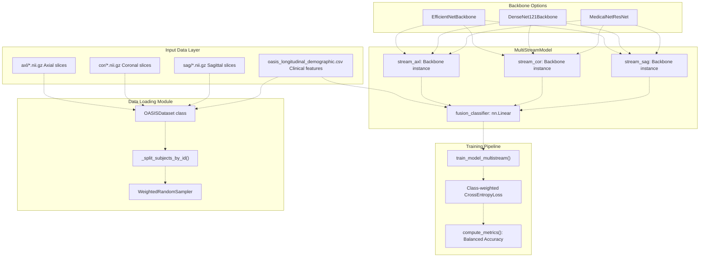
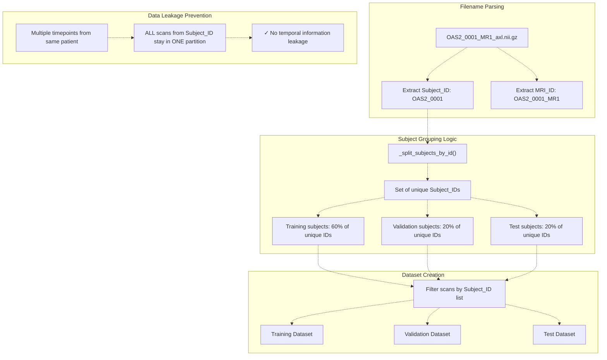
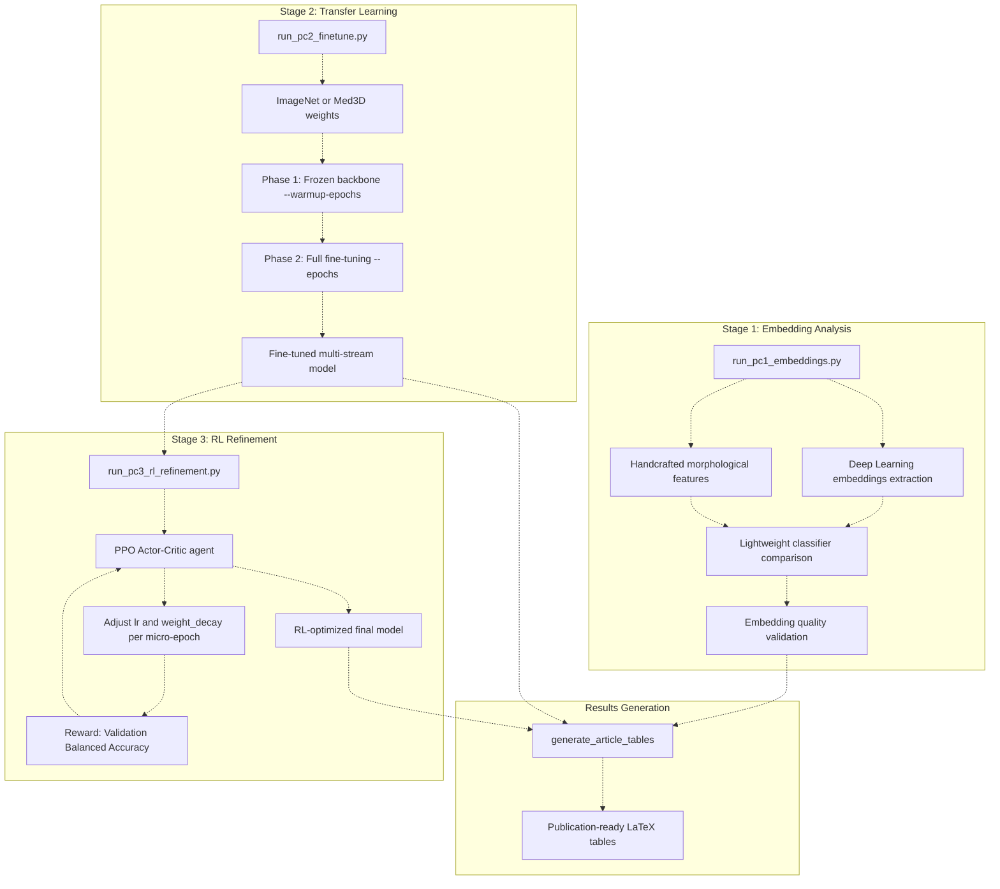
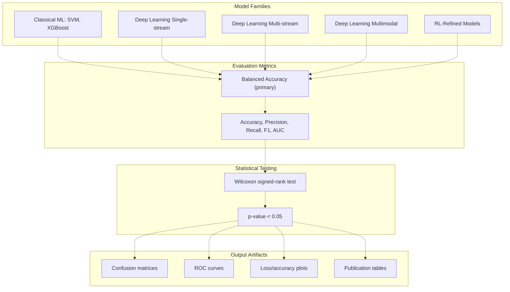

# Project Goals & Methodology

> **Relevant source files**
> * [README.md](https://github.com/ThalesMMS/brain-mri-pipelines-py/blob/cd9d51a5/README.md)

## Purpose & Scope

This document describes the research objectives and methodological framework of the brain-mri-pipelines-py repository. It covers the project's goal of Alzheimer's disease (AD) detection using multi-stream, multimodal deep learning on the OASIS-2 dataset, and explains the critical design decisions that ensure methodologically sound research outcomes.

For details on specific model architectures, see [Deep Learning Backbones](5a%20Deep-Learning-Backbones.md). For implementation details of data splitting, see [Subject-Level Splitting & Leakage Prevention](3d%20Subject-Level-Splitting-%26-Leakage-Prevention.md). For the complete experimental workflow, see [Three-Stage Research Pipeline](5%20Three-Stage-Research-Pipeline.md).

---

## Research Objectives

The project pursues three primary research objectives:

| Objective | Description | Implementation |
| --- | --- | --- |
| **Multi-View Learning** | Evaluate whether combining multiple anatomical planes (axial, coronal, sagittal) improves AD detection over single-plane approaches | Multi-stream architecture in `multistream_models.py` |
| **Multimodal Fusion** | Assess the benefit of integrating visual MRI embeddings with clinical tabular features | Clinical feature concatenation in fusion layers |
| **Progressive Refinement** | Demonstrate a three-stage methodology from embedding validation through transfer learning to RL-based hyperparameter optimization | Standalone scripts in `brain_mri/scripts/` directory |

The overarching goal is to develop a methodologically rigorous framework that prevents common pitfalls in medical imaging research (particularly data leakage) while providing comprehensive model comparison capabilities spanning classical ML, deep learning, and reinforcement learning approaches.

**Sources:** [README.md L1-L25](https://github.com/ThalesMMS/brain-mri-pipelines-py/blob/cd9d51a5/README.md#L1-L25)

---

## Multi-Stream Multimodal Architecture

The core architectural innovation is the **multi-stream multimodal network** that processes up to three anatomical planes simultaneously before fusing visual embeddings with clinical covariates.



### Architecture Components

The multi-stream architecture is implemented in `brain_mri/ml/multistream_models.py` with the following key classes:

| Component | Class/Function | Responsibility |
| --- | --- | --- |
| **Base Stream** | `MultiStreamModel.__init__()` | Initializes independent streams for each anatomical plane |
| **Backbone Selection** | `_create_backbone()` | Factory method supporting `'efficientnet'`, `'densenet'`, `'medicalnet'` |
| **Feature Extraction** | `MultiStreamModel.forward()` | Extracts embeddings from each active stream |
| **Multimodal Fusion** | `fusion_classifier` attribute | Concatenates visual embeddings with clinical features before classification |

Each stream processes its respective anatomical plane through an identical backbone architecture. The fusion layer receives:

* Visual embeddings: Concatenated outputs from all active streams (e.g., 1280-dim from EfficientNet × 3 planes = 3840-dim)
* Clinical features: `age`, `education`, `nwbv`, `etiv`, `asf` (5-dim)
* Total fusion input: Visual + Clinical dimensions

The final classification layer maps this fused representation to binary AD/Non-AD predictions.

**Sources:** [README.md L10-L12](https://github.com/ThalesMMS/brain-mri-pipelines-py/blob/cd9d51a5/README.md#L10-L12)

 [brain_mri/ml/multistream_models.py](https://github.com/ThalesMMS/brain-mri-pipelines-py/blob/cd9d51a5/brain_mri/ml/multistream_models.py)

---

## Subject-Level Splitting Methodology

The **most critical methodological safeguard** is the subject-level data splitting strategy that prevents data leakage in longitudinal datasets.



### Implementation Details

The subject-aware splitting is implemented through these key functions:

**Filename Pattern Recognition:**

* Pattern: `OAS2_{SubjectID}_MR{TimePoint}_{Plane}.nii.gz`
* Example: `OAS2_0001_MR1_axl.nii.gz` → Subject ID: `OAS2_0001`, MRI ID: `OAS2_0001_MR1`

**Splitting Strategy:**
The `_split_subjects_by_id()` function ensures:

1. Extract all unique `Subject_ID` values from filenames
2. Randomly assign subjects (not individual scans) to partitions
3. Filter all scans based on subject membership

**Why This Matters:**
The OASIS-2 dataset contains longitudinal MRI scans where the same patient may have scans at multiple timepoints (MR1, MR2, etc.). Without subject-level splitting, scans from the same patient could appear in both training and test sets, causing the model to memorize patient-specific patterns rather than learning generalizable AD biomarkers. This would result in artificially inflated performance metrics that do not reflect real-world diagnostic capability.

**Sources:** [README.md L23](https://github.com/ThalesMMS/brain-mri-pipelines-py/blob/cd9d51a5/README.md#L23-L23)

 README.md

---

## Progressive Three-Stage Research Pipeline

The project implements a **progressive model refinement strategy** where each stage builds upon the previous stage's results, enabling systematic comparison of different learning paradigms.



### Stage Descriptions

| Stage | Script | Primary Goal | Key Configuration |
| --- | --- | --- | --- |
| **Stage 1** | `run_pc1_embeddings.py` | Validate that learned embeddings capture relevant features compared to handcrafted morphological descriptors | `--dl-backbone`: Choose embedding source |
| **Stage 2** | `run_pc2_finetune.py` | Implement proper transfer learning with explicit frozen warmup phase | `--warmup-epochs`: Frozen backbone duration`--epochs`: Total training duration |
| **Stage 3** | `run_pc3_rl_refinement.py` | Apply PPO-based hyperparameter optimization as final refinement | `--episodes`: Number of RL episodes`--horizon`: Steps per episode |

### Stage 1: Embedding Analysis

Extracts deep learning embeddings from pretrained backbones and compares their discriminative power against handcrafted features (ventricle geometry, brain volume ratios) using a simple classifier. This validates whether the learned representations capture medically relevant patterns.

### Stage 2: Transfer Learning & Fine-Tuning

Implements the two-phase transfer learning approach recommended for medical imaging:

1. **Warmup Phase:** Train only the classification head while keeping backbone frozen (prevents catastrophic forgetting of pretrained features)
2. **Fine-tuning Phase:** Unfreeze all layers and train end-to-end with lower learning rate

### Stage 3: RL-Based Hyperparameter Refinement

Uses a Proximal Policy Optimization (PPO) agent to dynamically adjust hyperparameters during training. The agent observes validation metrics and adjusts learning rate and weight decay per micro-epoch, creating an adaptive optimization strategy beyond traditional grid/random search.

**Sources:** [Project overview and setup](https://github.com/ThalesMMS/brain-mri-pipelines-py/blob/cd9d51a5/README.md#L122-L157)

 [brain_mri/scripts/run_pc1_embeddings.py](https://github.com/ThalesMMS/brain-mri-pipelines-py/blob/cd9d51a5/brain_mri/scripts/run_pc1_embeddings.py)

 [brain_mri/scripts/run_pc2_finetune.py](https://github.com/ThalesMMS/brain-mri-pipelines-py/blob/cd9d51a5/brain_mri/scripts/run_pc2_finetune.py)

 [brain_mri/scripts/run_pc3_rl_refinement.py](https://github.com/ThalesMMS/brain-mri-pipelines-py/blob/cd9d51a5/brain_mri/scripts/run_pc3_rl_refinement.py)

---

## Key Methodological Principles

The project adheres to several methodological principles designed to ensure research validity:

### 1. Balanced Accuracy as Primary Metric

**Rationale:** Medical imaging datasets exhibit severe class imbalance (fewer AD cases than controls). Standard accuracy is misleading because a model predicting only the majority class achieves high accuracy while being clinically useless.

**Implementation:** Balanced Accuracy is computed as the arithmetic mean of sensitivity and specificity:

```
Balanced Accuracy = (Sensitivity + Specificity) / 2
                  = (TPR + TNR) / 2
```

This metric equally weights performance on both classes, preventing majority-class bias.

**Sources:** [Project overview and setup](https://github.com/ThalesMMS/brain-mri-pipelines-py/blob/cd9d51a5/README.md#L162-L166)

### 2. Anti-Collapse Mechanisms

To prevent models from collapsing to majority-class prediction, the pipeline implements three complementary strategies:

| Mechanism | Implementation | Purpose |
| --- | --- | --- |
| **Weighted Sampling** | `WeightedRandomSampler` in data loader | Ensures balanced class representation per batch |
| **Class-Weighted Loss** | Loss weights inversely proportional to class frequency | Penalizes errors on minority class more heavily |
| **Focal Loss** | Optional alternative to cross-entropy | Down-weights easy examples, focuses on hard cases |

**Sources:** [Project overview and setup](https://github.com/ThalesMMS/brain-mri-pipelines-py/blob/cd9d51a5/README.md#L162-L169)

### 3. Target Proxy Leakage Awareness

The codebase explicitly handles the **MMSE/CDR leakage scenario**:

* **MMSE (Mini-Mental State Examination)** and **CDR (Clinical Dementia Rating)** are cognitive assessment scores
* These scores are strong proxies for dementia diagnosis—using them as features creates **target leakage**
* The system supports two SVM training scenarios: 1. `svm_with_mmse_cdr`: Includes cognitive scores (high performance but methodologically questionable) 2. `svm_without_mmse_cdr`: Imaging-only features (recommended for clean analysis)

This dual-scenario approach enables researchers to quantify the information content of proxy variables versus pure imaging biomarkers.

**Sources:** [Project overview and setup](https://github.com/ThalesMMS/brain-mri-pipelines-py/blob/cd9d51a5/README.md#L166-L169)

### 4. Reproducible Research Infrastructure

The project provides multiple execution modalities optimized for different use cases:

| Interface | Use Case | Key Feature |
| --- | --- | --- |
| **GUI (`main.py`)** | Interactive exploration, visualization, single experiments | Tkinter-based, slice navigation, real-time segmentation |
| **Baselines CLI (`run_baselines_cli.py`)** | Classical ML experiments | Subject-aware split generation, SVM/XGBoost training |
| **Deep Models CLI (`run_deep_models_cli.py`)** | Deep learning experiments | Multi-backbone support, multimodal flag, seed control |
| **Stage Scripts (`brain_mri/scripts/*.py`)** | Publication pipeline | Three-stage workflow, LaTeX table generation |

All CLI scripts support `--seed` arguments for deterministic reproducibility.

**Sources:** README.md

---

## Evaluation Strategy

The comprehensive evaluation framework enables fair comparison across diverse model families:



### Evaluation Workflow

1. **Metric Computation:** All models are evaluated using `compute_metrics()` function which calculates balanced accuracy, standard accuracy, precision, recall, F1-score, and AUC-ROC
2. **Cross-Model Comparison:** Statistical significance testing using Wilcoxon signed-rank test to compare model variants
3. **Artifact Generation:** Automated generation of confusion matrices, ROC curves, and training history plots in `output/` directory
4. **Publication Pipeline:** `generate_article_tables` script aggregates results across all experiments and formats them as LaTeX tables for scientific publication

The evaluation strategy prioritizes **Balanced Accuracy** to ensure fair comparison in the presence of class imbalance, while providing comprehensive secondary metrics for detailed performance analysis.

**Sources:** [Project overview and setup](https://github.com/ThalesMMS/brain-mri-pipelines-py/blob/cd9d51a5/README.md#L162-L169)

 [brain_mri/scripts/generate_article_tables](https://github.com/ThalesMMS/brain-mri-pipelines-py/blob/cd9d51a5/brain_mri/scripts/generate_article_tables)

---

## Summary

The brain-mri-pipelines-py project implements a methodologically rigorous framework for Alzheimer's disease detection with three key differentiators:

1. **Architectural Innovation:** Multi-stream multimodal architecture combining multiple anatomical planes with clinical features
2. **Methodological Rigor:** Subject-level splitting prevents data leakage; balanced accuracy and anti-collapse mechanisms ensure valid evaluation
3. **Progressive Refinement:** Three-stage pipeline from embedding validation through transfer learning to RL optimization

This methodology enables fair comparison across classical ML, deep learning, and RL approaches while maintaining research validity through careful handling of longitudinal data, class imbalance, and target proxy leakage.

**Sources:** README.md


### On this page

* [Project Goals & Methodology](#1.1-project-goals-methodology)
* [Purpose & Scope](#1.1-purpose-scope)
* [Research Objectives](#1.1-research-objectives)
* [Multi-Stream Multimodal Architecture](#1.1-multi-stream-multimodal-architecture)
* [Architecture Components](#1.1-architecture-components)
* [Subject-Level Splitting Methodology](#1.1-subject-level-splitting-methodology)
* [Implementation Details](#1.1-implementation-details)
* [Progressive Three-Stage Research Pipeline](#1.1-progressive-three-stage-research-pipeline)
* [Stage Descriptions](#1.1-stage-descriptions)
* [Stage 1: Embedding Analysis](#1.1-stage-1-embedding-analysis)
* [Stage 2: Transfer Learning & Fine-Tuning](#1.1-stage-2-transfer-learning-fine-tuning)
* [Stage 3: RL-Based Hyperparameter Refinement](#1.1-stage-3-rl-based-hyperparameter-refinement)
* [Key Methodological Principles](#1.1-key-methodological-principles)
* [1. Balanced Accuracy as Primary Metric](#1.1-1-balanced-accuracy-as-primary-metric)
* [2. Anti-Collapse Mechanisms](#1.1-2-anti-collapse-mechanisms)
* [3. Target Proxy Leakage Awareness](#1.1-3-target-proxy-leakage-awareness)
* [4. Reproducible Research Infrastructure](#1.1-4-reproducible-research-infrastructure)
* [Evaluation Strategy](#1.1-evaluation-strategy)
* [Evaluation Workflow](#1.1-evaluation-workflow)
* [Summary](#1.1-summary)

Ask Devin about brain-mri-pipelines-py