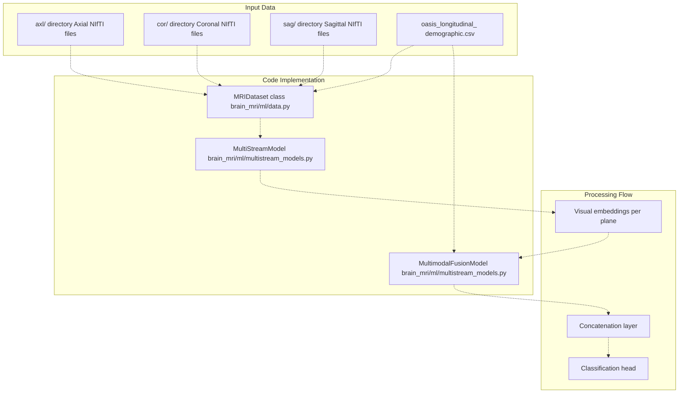
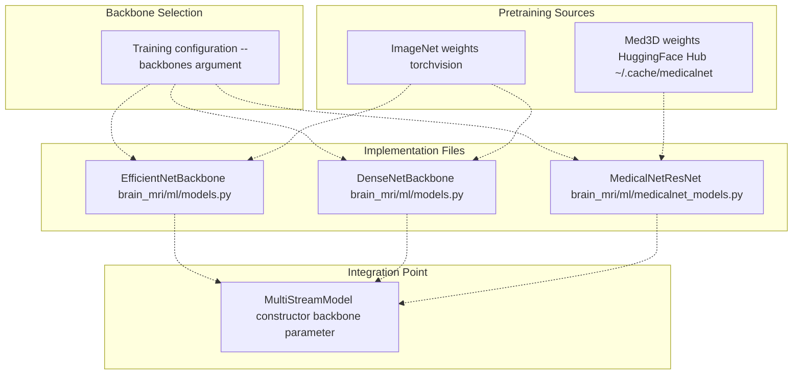
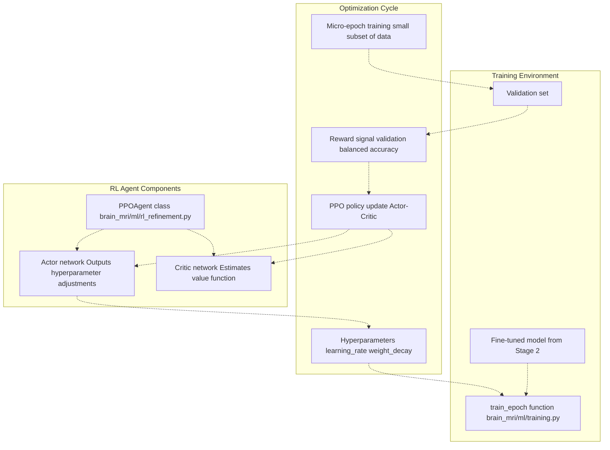
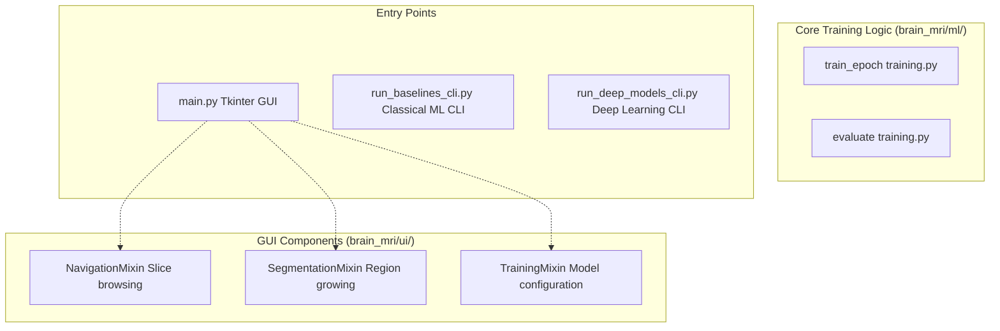
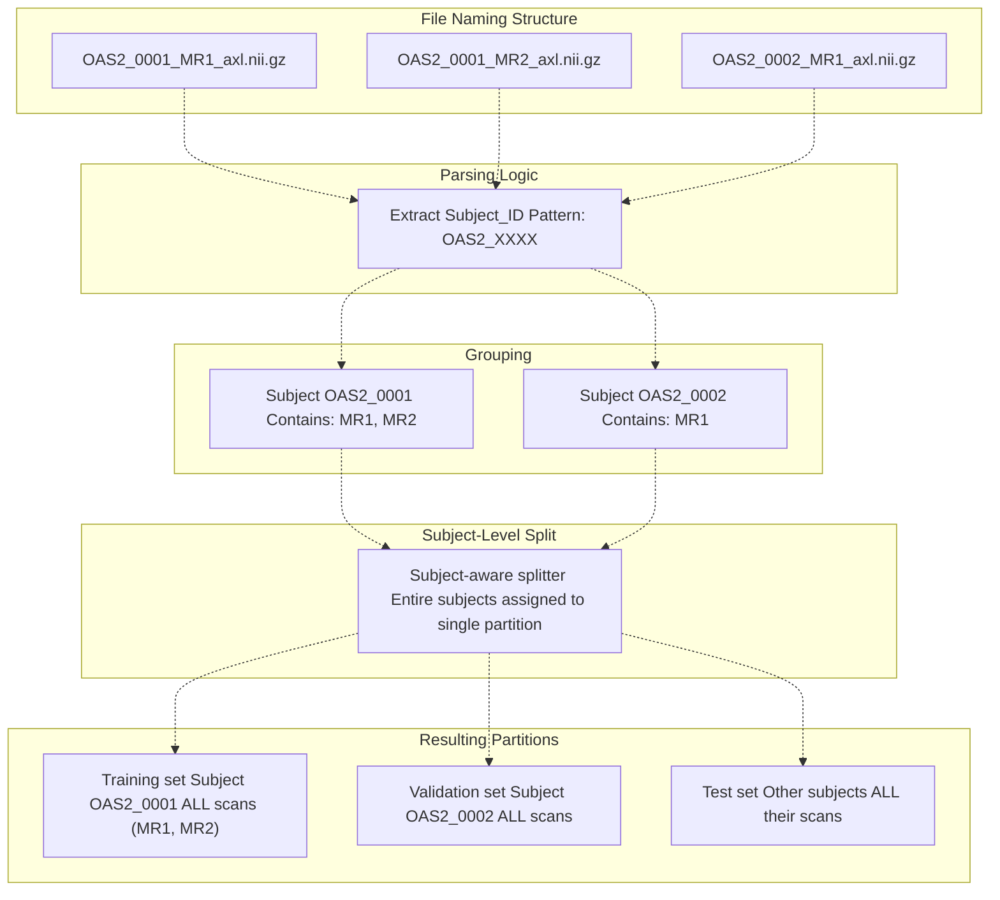
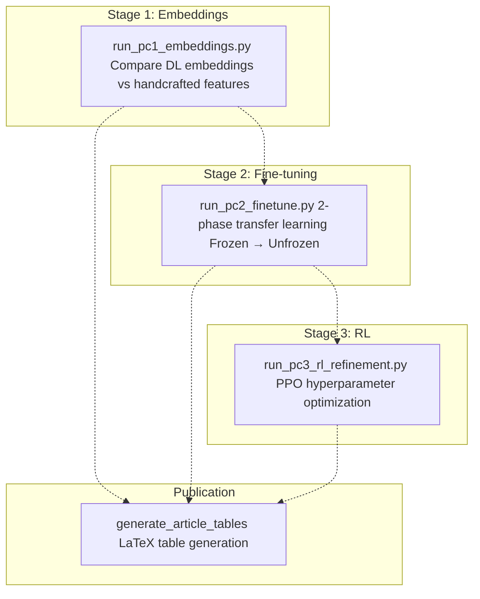

# Key Features

> **Relevant source files**
> * [README.md](https://github.com/ThalesMMS/brain-mri-pipelines-py/blob/cd9d51a5/README.md)

## Purpose & Scope

This page documents the primary features of the brain-mri-pipelines-py framework, organized by functional capability. Each feature is mapped to its implementing code entities to facilitate navigation of the codebase. For detailed architectural explanations, see [System Architecture](#3). For specific model implementations, see [Models & Training](#5). For the research workflow, see [Three-Stage Research Pipeline](#6).

---

## Feature Overview

The framework provides seven major feature categories that span data processing, model training, optimization, and result generation:

| Feature Category | Key Capabilities | Entry Points |
| --- | --- | --- |
| **Multi-Stream Architecture** | Processes 3 anatomical planes simultaneously | `brain_mri/ml/multistream_models.py` |
| **Multiple Backbones** | EfficientNet, DenseNet, MedicalNet ResNet | `brain_mri/ml/` model files |
| **Classical Baselines** | SVM, XGBoost for comparison | `run_baselines_cli.py` |
| **RL Optimization** | PPO-based hyperparameter tuning | `brain_mri/ml/rl_refinement.py` |
| **User Interfaces** | GUI and CLI access patterns | `main.py`, CLI scripts |
| **Leakage Prevention** | Subject-level data splitting | Data loading utilities |
| **Research Pipeline** | 3-stage progressive refinement | `brain_mri/scripts/run_pc*.py` |

---

## 1. Multi-Stream Multimodal Deep Learning

### Architecture Components

The system implements a multi-stream architecture that processes three anatomical planes (axial, coronal, sagittal) through independent deep learning backbones, then fuses the resulting embeddings with clinical tabular features.



**Code Entities**:

* **`MultiStreamModel`** [brain_mri/ml/multistream_models.py](https://github.com/ThalesMMS/brain-mri-pipelines-py/blob/cd9d51a5/brain_mri/ml/multistream_models.py) : Processes 1-3 anatomical planes through the same backbone architecture, producing per-plane embeddings
* **`MultimodalFusionModel`** [brain_mri/ml/multistream_models.py](https://github.com/ThalesMMS/brain-mri-pipelines-py/blob/cd9d51a5/brain_mri/ml/multistream_models.py) : Extends `MultiStreamModel` by concatenating visual embeddings with clinical features (`age`, `education`, `nwbv`, `etiv`, `asf`) before classification
* **`MRIDataset`** [brain_mri/ml/data.py](https://github.com/ThalesMMS/brain-mri-pipelines-py/blob/cd9d51a5/brain_mri/ml/data.py) : Loads NIfTI files from configured plane directories and merges with demographic CSV

**Configuration Parameters**:

* `planes`: List of enabled anatomical planes (e.g., `["axl", "cor", "sag"]`)
* `use_clinical_features`: Boolean flag to enable/disable multimodal fusion
* `backbone_name`: Identifier for the deep learning backbone (see Section 2)

**Sources**: [README.md L9-L12](https://github.com/ThalesMMS/brain-mri-pipelines-py/blob/cd9d51a5/README.md#L9-L12)

---

## 2. Deep Learning Backbone Options

The framework supports three pretrained backbone architectures, each with different pretraining strategies:



### Backbone Comparison

| Backbone | Class Name | Source File | Pretraining | Special Features |
| --- | --- | --- | --- | --- |
| **EfficientNet-B0** | `EfficientNetBackbone` | `brain_mri/ml/models.py` | ImageNet | Compound scaling, mobile-friendly |
| **DenseNet121** | `DenseNetBackbone` | `brain_mri/ml/models.py` | ImageNet | Dense connections, feature reuse |
| **MedicalNet ResNet** | `MedicalNetResNet` | `brain_mri/ml/medicalnet_models.py` | Med3D (23 medical datasets) | 3D→2D kernel conversion |

### MedicalNet 3D→2D Conversion

The MedicalNet backbone implements a unique conversion process:

1. **Download**: Weights retrieved via `huggingface_hub` to `~/.cache/medicalnet`
2. **Conversion**: 3D convolutional kernels mathematically converted to 2D equivalents in [brain_mri/ml/medicalnet_models.py](https://github.com/ThalesMMS/brain-mri-pipelines-py/blob/cd9d51a5/brain_mri/ml/medicalnet_models.py)
3. **Integration**: Converted 2D ResNet integrated into `MultiStreamModel` architecture

**Command-Line Usage**:

```
# Single backbonepython run_deep_models_cli.py --backbones efficientnet# Multiple backbones (trains separately)python run_deep_models_cli.py --backbones efficientnet,densenet,medicalnet
```

**Sources**: [README.md L10-L12](https://github.com/ThalesMMS/brain-mri-pipelines-py/blob/cd9d51a5/README.md#L10-L12)

 [README.md L171-L173](https://github.com/ThalesMMS/brain-mri-pipelines-py/blob/cd9d51a5/README.md#L171-L173)

---

## 3. Classical Machine Learning Baselines

Classical models provide performance benchmarks and enable comparison of learned representations against handcrafted features.

### SVM Classification

Two scenarios are implemented to study target proxy leakage:

| Scenario | Feature Set | Recommended Use | Class Name |
| --- | --- | --- | --- |
| **With MMSE/CDR** | Morphology + Clinical + MMSE/CDR | Leakage analysis only | SVM trained in baselines script |
| **Without MMSE/CDR** | Morphology + Clinical only | Clean imaging-based analysis | SVM trained in baselines script |

**Feature Components**:

* **Morphological descriptors**: Ventricle geometry extracted via region-growing segmentation
* **Clinical covariates**: Age, education, nWBV, eTIV, ASF from demographic CSV
* **MMSE/CDR scores**: Cognitive test scores (strong dementia proxies)

**Entry Point**: [run_baselines_cli.py](https://github.com/ThalesMMS/brain-mri-pipelines-py/blob/cd9d51a5/run_baselines_cli.py)

### XGBoost Regression

Used for age estimation as a regression baseline task.

**Features**: Clinical covariates from demographic CSV

**Entry Point**: [run_baselines_cli.py](https://github.com/ThalesMMS/brain-mri-pipelines-py/blob/cd9d51a5/run_baselines_cli.py)

**Warning Note**: The README explicitly states that MMSE and CDR scores are strong proxies for dementia diagnosis. Including them creates target leakage. The `svm_without_mmse_cdr` scenario is recommended for methodologically sound research.

**Sources**: [README.md L13-L15](https://github.com/ThalesMMS/brain-mri-pipelines-py/blob/cd9d51a5/README.md#L13-L15)

 [README.md L106-L108](https://github.com/ThalesMMS/brain-mri-pipelines-py/blob/cd9d51a5/README.md#L106-L108)

 [README.md L162-L168](https://github.com/ThalesMMS/brain-mri-pipelines-py/blob/cd9d51a5/README.md#L162-L168)

---

## 4. Reinforcement Learning Hyperparameter Optimization

A PPO (Proximal Policy Optimization) agent dynamically adjusts training hyperparameters to maximize validation balanced accuracy.



### RL Configuration Parameters

| Parameter | CLI Argument | Description | Typical Range |
| --- | --- | --- | --- |
| **Episodes** | `--episodes` | Number of RL optimization episodes | 4-10 |
| **Horizon** | `--horizon` | Micro-epochs per episode | 4-8 |
| **Learning Rate** | Agent-controlled | Dynamically adjusted by PPO | 1e-5 to 1e-3 |
| **Weight Decay** | Agent-controlled | Dynamically adjusted by PPO | 0 to 1e-3 |

### Execution Flow

1. Load fine-tuned model from Stage 2 (see [Stage 2: Transfer Learning & Fine-Tuning](#6.2))
2. PPO agent proposes hyperparameter values
3. Train model for a micro-epoch (small data subset)
4. Evaluate on validation set, compute balanced accuracy
5. Use balanced accuracy as reward signal
6. Update Actor-Critic networks via PPO algorithm
7. Repeat for configured episodes × horizon iterations

**Entry Point**: [brain_mri/scripts/run_pc3_rl_refinement.py](https://github.com/ThalesMMS/brain-mri-pipelines-py/blob/cd9d51a5/brain_mri/scripts/run_pc3_rl_refinement.py)

**Core Implementation**: [brain_mri/ml/rl_refinement.py](https://github.com/ThalesMMS/brain-mri-pipelines-py/blob/cd9d51a5/brain_mri/ml/rl_refinement.py)

**Command Example**:

```
python brain_mri/scripts/run_pc3_rl_refinement.py \    --backbone efficientnet \    --seed 42 \    --episodes 4 \    --horizon 4
```

**Sources**: [README.md L17-L18](https://github.com/ThalesMMS/brain-mri-pipelines-py/blob/cd9d51a5/README.md#L17-L18)

 [README.md L142-L148](https://github.com/ThalesMMS/brain-mri-pipelines-py/blob/cd9d51a5/README.md#L142-L148)

---

## 5. User Interface Options

The framework provides three distinct access patterns, each optimized for different workflows:



### Graphical User Interface (main.py)

**Primary Use Cases**:

* Interactive data exploration and slice navigation
* Visual quality assessment of MRI scans
* Semi-automatic ventricle segmentation via region growing
* Single-run model training with immediate visualization

**Key Features**:

* Browse through MRI volumes slice-by-slice
* Mark non-viable studies
* Extract morphological descriptors from segmented regions
* Configure and launch training jobs via sidebar

**Implementation**: Tkinter-based interface composed of mixin classes in `brain_mri/ui/` directory

**Launch Command**:

```
python main.py
```

### Baselines CLI (run_baselines_cli.py)

**Primary Use Cases**:

* Automated classical ML baseline generation
* Subject-level dataset split creation
* SVM leakage scenario comparison

**Workflow**:

1. Generates subject-aware split CSV
2. Trains SVM with MMSE/CDR (leakage scenario)
3. Trains SVM without MMSE/CDR (clean scenario)
4. Trains XGBoost age estimation model

**Launch Command**:

```
python run_baselines_cli.py
```

### Deep Models CLI (run_deep_models_cli.py)

**Primary Use Cases**:

* Reproducible headless training for long experiments
* Batch training of multiple backbones
* Multimodal fusion experiments

**Key Arguments**:

* `--seed`: Random seed for reproducibility
* `--epochs`: Total training epochs
* `--backbones`: Comma-separated backbone list
* `--multimodal`: Enable clinical feature fusion

**Launch Examples**:

```
# Standard trainingpython run_deep_models_cli.py --seed 42 --epochs 40 --backbones efficientnet# Multimodal fusionpython run_deep_models_cli.py --seed 42 --epochs 40 --backbones efficientnet --multimodal# Multiple backbonespython run_deep_models_cli.py --seed 42 --epochs 40 --backbones efficientnet,densenet,medicalnet
```

**Sources**: [README.md L20-L23](https://github.com/ThalesMMS/brain-mri-pipelines-py/blob/cd9d51a5/README.md#L20-L23)

 [README.md L83-L118](https://github.com/ThalesMMS/brain-mri-pipelines-py/blob/cd9d51a5/README.md#L83-L118)

---

## 6. Subject-Level Data Splitting & Leakage Prevention

This feature ensures methodological soundness by preventing data leakage during train/validation/test splitting.

### The Leakage Problem

OASIS-2 contains longitudinal data where the same patient has multiple MRI scans across different time points. Naive random splitting would place different scans of the same patient in different partitions, causing:

* Artificially inflated performance metrics
* Invalid generalization claims
* Non-reproducible results

### The Solution: Subject-Aware Splitting



### Implementation Details

The subject-level split is enforced through the following mechanism:

1. **Filename Parsing**: Extract `Subject_ID` from filenames matching pattern `OAS2_XXXX_MRY_plane.nii.gz`
2. **Subject Grouping**: All MRI scans (different `MRY` values) for a subject are grouped together
3. **Subject-Level Assignment**: Each subject (with all their scans) is assigned to exactly one partition
4. **CSV Generation**: Split information written to `output/subject_split.csv`

**Key Code Entities**:

* Data loading utilities in `brain_mri/ml/data.py` enforce this split during dataset construction
* The split CSV is generated by [run_baselines_cli.py](https://github.com/ThalesMMS/brain-mri-pipelines-py/blob/cd9d51a5/run_baselines_cli.py)  and used by all subsequent training scripts

**Verification**: Users can inspect `output/subject_split.csv` to confirm no subject appears in multiple partitions.

**Sources**: [README.md L23](https://github.com/ThalesMMS/brain-mri-pipelines-py/blob/cd9d51a5/README.md#L23-L23)

 [README.md L40-L50](https://github.com/ThalesMMS/brain-mri-pipelines-py/blob/cd9d51a5/README.md#L40-L50)

 [README.md L101-L105](https://github.com/ThalesMMS/brain-mri-pipelines-py/blob/cd9d51a5/README.md#L101-L105)

---

## 7. Three-Stage Research Pipeline

The framework implements a progressive model refinement methodology through three sequential stages, each building on the previous results.

### Pipeline Overview



### Stage Scripts Location

All stage scripts are located in `brain_mri/scripts/`:

| Stage | Script | Primary Function |
| --- | --- | --- |
| **Stage 1** | `run_pc1_embeddings.py` | Embedding quality assessment |
| **Stage 2** | `run_pc2_finetune.py` | Transfer learning with warmup |
| **Stage 3** | `run_pc3_rl_refinement.py` | RL-based refinement |
| **Results** | `generate_article_tables.py` | Publication artifact generation |

### Stage 1: Embedding Analysis

**Purpose**: Validate that deep learning embeddings capture useful information compared to handcrafted morphological descriptors.

**Method**: Train lightweight classifiers (e.g., logistic regression) on:

* Deep learning embeddings from pretrained backbones
* Handcrafted morphological features from segmentation

**Command**:

```
python brain_mri/scripts/run_pc1_embeddings.py --dl-backbone efficientnet
```

### Stage 2: Transfer Learning & Fine-tuning

**Purpose**: Adapt pretrained backbones to the AD detection task through two-phase training.

**Method**:

1. **Phase 1 (Warmup)**: Train classification head with frozen backbone weights
2. **Phase 2 (Fine-tuning)**: Unfreeze backbone and train end-to-end

**Command**:

```
python brain_mri/scripts/run_pc2_finetune.py \    --backbone efficientnet \    --seed 42 \    --epochs 6 \    --warmup-epochs 2
```

### Stage 3: RL Refinement

**Purpose**: Optimize hyperparameters dynamically using reinforcement learning.

**Method**: PPO agent adjusts learning rate and weight decay based on validation performance feedback (see Section 4 for details).

**Command**:

```
python brain_mri/scripts/run_pc3_rl_refinement.py \    --backbone efficientnet \    --seed 42 \    --episodes 4 \    --horizon 4
```

### Results Generation

**Purpose**: Generate publication-ready LaTeX tables from experiment logs.

**Command**:

```
python -m brain_mri.scripts.generate_article_tables --write
```

**Output**: LaTeX-formatted tables comparing performance across all model variants and stages.

**Sources**: [README.md L122-L156](https://github.com/ThalesMMS/brain-mri-pipelines-py/blob/cd9d51a5/README.md#L122-L156)

---

## 8. Comprehensive Evaluation Framework

The system provides multiple safeguards and metrics to ensure robust evaluation despite class imbalance.

### Primary Metric: Balanced Accuracy

**Definition**: Average of recall obtained on each class, giving equal weight to each class regardless of sample size.

**Formula**: `(Sensitivity + Specificity) / 2`

**Rationale**: Standard accuracy is misleading for imbalanced datasets. A model predicting only the majority class can achieve high accuracy while being clinically useless.

### Anti-Collapse Mechanisms

| Mechanism | Implementation | Purpose |
| --- | --- | --- |
| **WeightedRandomSampler** | PyTorch DataLoader | Oversamples minority class during training |
| **Class-Weighted Loss** | Loss function weighting | Penalizes minority class errors more heavily |
| **Focal Loss** | Optional loss function | Focuses learning on hard examples |
| **Balanced Accuracy** | Primary evaluation metric | Ensures both classes are learned |

### Statistical Significance Testing

The framework performs Wilcoxon signed-rank tests to compare model variants across multiple random seeds.

**Implementation**: `generate_article_tables` script computes statistical comparisons.

### Experiment Tracking

All training runs log metrics to `output/` directory:

* **Training curves**: Loss and accuracy per epoch
* **Confusion matrices**: Per-class performance breakdown
* **Model checkpoints**: Best validation performance models saved
* **Configuration files**: Hyperparameters and settings recorded

**Tracking Module**: `brain_mri/experiments/` contains visualization and logging utilities.

**Sources**: [README.md L162-L168](https://github.com/ThalesMMS/brain-mri-pipelines-py/blob/cd9d51a5/README.md#L162-L168)

---

## Summary: Feature-to-Code Mapping

This table provides a quick reference for locating the implementation of each major feature:

| Feature | Primary Code Location | Entry Point |
| --- | --- | --- |
| Multi-stream architecture | `brain_mri/ml/multistream_models.py` | All training scripts |
| EfficientNet backbone | `brain_mri/ml/models.py` | `--backbones efficientnet` |
| DenseNet backbone | `brain_mri/ml/models.py` | `--backbones densenet` |
| MedicalNet backbone | `brain_mri/ml/medicalnet_models.py` | `--backbones medicalnet` |
| Classical baselines | `run_baselines_cli.py` | `run_baselines_cli.py` |
| RL optimization | `brain_mri/ml/rl_refinement.py` | `run_pc3_rl_refinement.py` |
| GUI interface | `brain_mri/ui/`, `main.py` | `python main.py` |
| Subject-level splitting | `brain_mri/ml/data.py` | Automatic in all scripts |
| 3-stage pipeline | `brain_mri/scripts/run_pc*.py` | Individual stage scripts |
| Evaluation metrics | `brain_mri/ml/training.py` | All training scripts |

**Sources**: [README.md L7-L23](https://github.com/ThalesMMS/brain-mri-pipelines-py/blob/cd9d51a5/README.md#L7-L23)

 [README.md L179-L196](https://github.com/ThalesMMS/brain-mri-pipelines-py/blob/cd9d51a5/README.md#L179-L196)

Refresh this wiki

Last indexed: 5 January 2026 ([cd9d51](https://github.com/ThalesMMS/brain-mri-pipelines-py/commit/cd9d51a5))

### On this page

* [Key Features](#1.2-key-features)
* [Purpose & Scope](#1.2-purpose-scope)
* [Feature Overview](#1.2-feature-overview)
* [1. Multi-Stream Multimodal Deep Learning](#1.2-1-multi-stream-multimodal-deep-learning)
* [Architecture Components](#1.2-architecture-components)
* [2. Deep Learning Backbone Options](#1.2-2-deep-learning-backbone-options)
* [Backbone Comparison](#1.2-backbone-comparison)
* [MedicalNet 3D→2D Conversion](#1.2-medicalnet-3d2d-conversion)
* [3. Classical Machine Learning Baselines](#1.2-3-classical-machine-learning-baselines)
* [SVM Classification](#1.2-svm-classification)
* [XGBoost Regression](#1.2-xgboost-regression)
* [4. Reinforcement Learning Hyperparameter Optimization](#1.2-4-reinforcement-learning-hyperparameter-optimization)
* [RL Configuration Parameters](#1.2-rl-configuration-parameters)
* [Execution Flow](#1.2-execution-flow)
* [5. User Interface Options](#1.2-5-user-interface-options)
* [Graphical User Interface (main.py)](#1.2-graphical-user-interface-mainpy)
* [Baselines CLI (run_baselines_cli.py)](#1.2-baselines-cli-run_baselines_clipy)
* [Deep Models CLI (run_deep_models_cli.py)](#1.2-deep-models-cli-run_deep_models_clipy)
* [6. Subject-Level Data Splitting & Leakage Prevention](#1.2-6-subject-level-data-splitting-leakage-prevention)
* [The Leakage Problem](#1.2-the-leakage-problem)
* [The Solution: Subject-Aware Splitting](#1.2-the-solution-subject-aware-splitting)
* [Implementation Details](#1.2-implementation-details)
* [7. Three-Stage Research Pipeline](#1.2-7-three-stage-research-pipeline)
* [Pipeline Overview](#1.2-pipeline-overview)
* [Stage Scripts Location](#1.2-stage-scripts-location)
* [Stage 1: Embedding Analysis](#1.2-stage-1-embedding-analysis)
* [Stage 2: Transfer Learning & Fine-tuning](#1.2-stage-2-transfer-learning-fine-tuning)
* [Stage 3: RL Refinement](#1.2-stage-3-rl-refinement)
* [Results Generation](#1.2-results-generation)
* [8. Comprehensive Evaluation Framework](#1.2-8-comprehensive-evaluation-framework)
* [Primary Metric: Balanced Accuracy](#1.2-primary-metric-balanced-accuracy)
* [Anti-Collapse Mechanisms](#1.2-anti-collapse-mechanisms)
* [Statistical Significance Testing](#1.2-statistical-significance-testing)
* [Experiment Tracking](#1.2-experiment-tracking)
* [Summary: Feature-to-Code Mapping](#1.2-summary-feature-to-code-mapping)

Ask Devin about brain-mri-pipelines-py