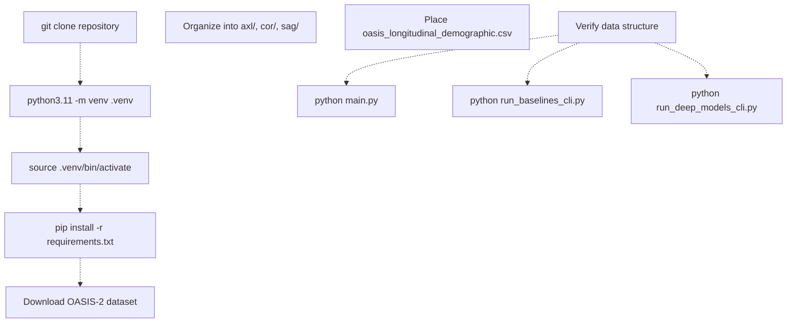
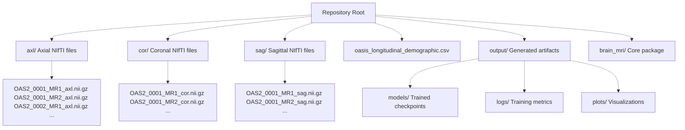
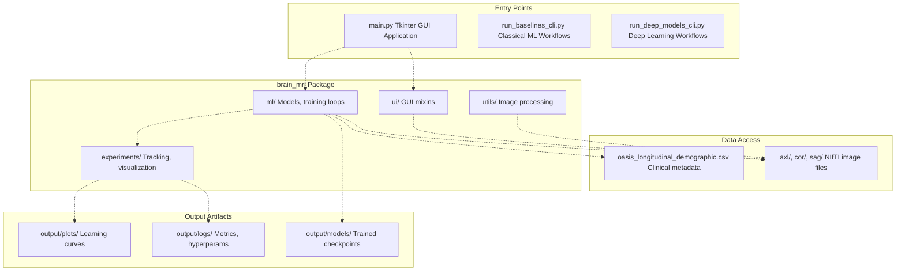
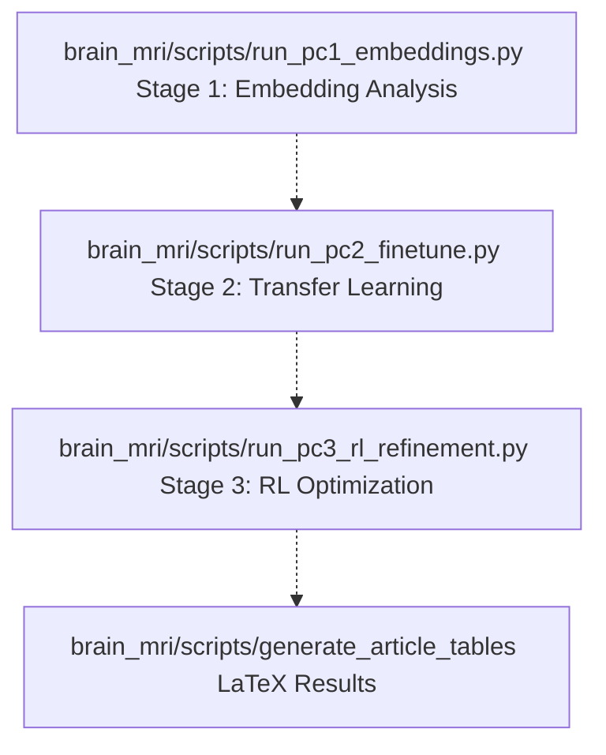

# Getting Started

> **Relevant source files**
> * [.gitattributes](https://github.com/ThalesMMS/brain-mri-pipelines-py/blob/cd9d51a5/.gitattributes)
> * [.gitignore](https://github.com/ThalesMMS/brain-mri-pipelines-py/blob/cd9d51a5/.gitignore)
> * [README.md](https://github.com/ThalesMMS/brain-mri-pipelines-py/blob/cd9d51a5/README.md)

This document provides an overview of how to set up and run your first experiments with the brain-mri-pipelines-py framework. It covers the essential steps to install dependencies, prepare the OASIS-2 dataset, and execute initial experiments using either the GUI or CLI interfaces.

For detailed installation instructions and dependency management, see [Installation & Dependencies](#2.1). For comprehensive data preparation guidelines, see [Data Preparation](#2.2). For step-by-step walkthroughs of different experiment types, see [Quick Start Guide](#2.3).

---

## System Requirements

The framework requires Python 3.11 or higher and supports both CPU and GPU execution. GPU acceleration is strongly recommended for deep learning experiments due to the computational demands of multi-stream architectures processing three anatomical planes simultaneously.

**Essential Components:**

| Component | Purpose | Installation Notes |
| --- | --- | --- |
| Python 3.11+ | Runtime environment | System-level installation required |
| `pip` | Package manager | Bundled with Python |
| Tkinter | GUI framework | Linux: `sudo apt-get install python3-tk`macOS: `brew install python-tk@3.11`Windows: Included with Python |
| CUDA-compatible GPU | Deep learning acceleration | Optional but recommended |

Sources: [README.md L55-L61](https://github.com/ThalesMMS/brain-mri-pipelines-py/blob/cd9d51a5/README.md#L55-L61)

---

## Installation Workflow

The following diagram illustrates the complete setup process from cloning the repository to running experiments:



**Installation Steps:**

```sql
# Clone repositorygit clone https://github.com/ThalesMMS/brain-mri-pipelines-py.gitcd brain-mri-pipelines-py# Create and activate virtual environmentpython3.11 -m venv .venvsource .venv/bin/activate  # macOS/Linux# .venv\Scripts\activate   # Windows# Install dependenciespip install -r requirements.txt
```

The `requirements.txt` file contains all necessary packages including PyTorch, torchvision, nibabel (for NIfTI file handling), scikit-learn, xgboost, huggingface_hub (for MedicalNet weights), and Tkinter dependencies.

Sources: [README.md L66-L77](https://github.com/ThalesMMS/brain-mri-pipelines-py/blob/cd9d51a5/README.md#L66-L77)

---

## Required Directory Structure

The framework expects a specific directory layout in the repository root. The OASIS-2 dataset must be manually obtained and organized according to this structure:



**Critical Requirements:**

1. **Anatomical Plane Directories**: At minimum, the `axl/` directory containing axial slices is required for GUI functionality. The `cor/` and `sag/` directories are optional but enable multi-stream deep learning models to leverage all three anatomical views.
2. **File Naming Convention**: All NIfTI files must follow the pattern `OAS2_XXXX_MRY_plane.nii.gz` where: * `XXXX` = Subject ID (e.g., `0001`, `0002`) * `Y` = MRI session number (e.g., `1`, `2`) * `plane` = Anatomical orientation (`axl`, `cor`, or `sag`)
3. **Clinical Metadata**: The `oasis_longitudinal_demographic.csv` file must be present in the root directory and contain demographic and clinical variables for each MRI scan.
4. **Output Directory**: The `output/` directory is auto-generated but excluded from version control via `.gitignore`. It stores trained models, training logs, and experimental results.

Sources: [README.md L29-L50](https://github.com/ThalesMMS/brain-mri-pipelines-py/blob/cd9d51a5/README.md#L29-L50)

 [.gitignore L7-L8](https://github.com/ThalesMMS/brain-mri-pipelines-py/blob/cd9d51a5/.gitignore#L7-L8)

---

## Entry Points & Interfaces

The framework provides three primary entry points for different use cases:



### Main Entry Points

| Entry Point | Purpose | Typical Use Case |
| --- | --- | --- |
| `main.py` | Interactive GUI with slice visualization, segmentation tools, and single-run training | Data exploration, visual quality control, quick experiments |
| `run_baselines_cli.py` | Automated training of classical ML baselines (SVM, XGBoost) | Establishing baseline performance, reproducible experiments |
| `run_deep_models_cli.py` | Configurable deep learning training with multiple backbones | Full-scale deep learning experiments, hyperparameter sweeps |

Sources: [README.md L83-L118](https://github.com/ThalesMMS/brain-mri-pipelines-py/blob/cd9d51a5/README.md#L83-L118)

 [README.md L179-L196](https://github.com/ThalesMMS/brain-mri-pipelines-py/blob/cd9d51a5/README.md#L179-L196)

---

## Execution Modes

### GUI Mode (Interactive Exploration)

The GUI provides an integrated environment for data visualization and experimentation:

```
python main.py
```

**Key Features:**

* **Navigation Panel**: Browse through MRI volumes, mark non-viable studies
* **Segmentation Tools**: Region-growing algorithm for ventricle segmentation
* **Training Controls**: Configure and launch single training runs
* **Real-time Visualization**: View slices, segmentation masks, and extracted morphological descriptors

The GUI is implemented using Tkinter with a mixin-based architecture located in [brain_mri/ui/](https://github.com/ThalesMMS/brain-mri-pipelines-py/blob/cd9d51a5/brain_mri/ui/)

 separating concerns between navigation, segmentation, and training controls.

Sources: [README.md L83-L96](https://github.com/ThalesMMS/brain-mri-pipelines-py/blob/cd9d51a5/README.md#L83-L96)

### CLI Mode (Reproducible Workflows)

CLI scripts are recommended for long-running experiments and reproducibility:

**Classical Baselines:**

```
python run_baselines_cli.py
```

This executes the complete baseline workflow:

1. Generates subject-aware train/validation/test splits
2. Trains SVM classifiers with and without MMSE/CDR scores
3. Trains XGBoost regressor for age estimation
4. Saves results to `output/` directory

**Deep Learning Models:**

```
# Single backbonepython run_deep_models_cli.py --seed 42 --epochs 40 --backbones efficientnet# Multiple backbonespython run_deep_models_cli.py --seed 42 --epochs 40 --backbones efficientnet,medicalnet,densenet# With multimodal fusion (images + clinical features)python run_deep_models_cli.py --seed 42 --epochs 40 --backbones efficientnet --multimodal
```

The `--backbones` argument accepts comma-separated values from: `efficientnet` (EfficientNet-B0), `densenet` (DenseNet121), `medicalnet` (Med3D ResNet with 3D→2D conversion).

Sources: [README.md L98-L118](https://github.com/ThalesMMS/brain-mri-pipelines-py/blob/cd9d51a5/README.md#L98-L118)

---

## Research Pipeline Entry Points

For advanced users implementing the three-stage experimental methodology, specialized scripts are located in [brain_mri/scripts/](https://github.com/ThalesMMS/brain-mri-pipelines-py/blob/cd9d51a5/brain_mri/scripts/)

:



**Stage-Specific Commands:**

| Stage | Script | Example Command |
| --- | --- | --- |
| 1: Embedding Analysis | `run_pc1_embeddings.py` | `python brain_mri/scripts/run_pc1_embeddings.py --dl-backbone efficientnet` |
| 2: Fine-Tuning | `run_pc2_finetune.py` | `python brain_mri/scripts/run_pc2_finetune.py --backbone efficientnet --epochs 6 --warmup-epochs 2` |
| 3: RL Refinement | `run_pc3_rl_refinement.py` | `python brain_mri/scripts/run_pc3_rl_refinement.py --backbone efficientnet --episodes 4` |
| Table Generation | `generate_article_tables` | `python -m brain_mri.scripts.generate_article_tables --write` |

For comprehensive documentation of the three-stage methodology, see [Three-Stage Research Pipeline](#6).

Sources: [README.md L122-L156](https://github.com/ThalesMMS/brain-mri-pipelines-py/blob/cd9d51a5/README.md#L122-L156)

---

## Verification Checklist

Before running experiments, verify your setup using this checklist:

**Data Preparation:**

* OASIS-2 NIfTI files are organized in `axl/`, `cor/`, `sag/` directories
* Filenames follow the pattern `OAS2_XXXX_MRY_plane.nii.gz`
* `oasis_longitudinal_demographic.csv` is present in repository root
* CSV file contains required columns: `Subject_ID`, `MRI_ID`, `CDR`, `age`, `education`, `nWBV`, `eTIV`, `ASF`

**Environment Setup:**

* Python version is 3.11 or higher (`python --version`)
* Virtual environment is activated (shell prompt shows `.venv`)
* All packages installed successfully (`pip list` shows torch, torchvision, nibabel, etc.)
* Tkinter is available (`python -c "import tkinter"` runs without error)

**GPU Availability (Optional):**

* CUDA is installed and configured (`nvidia-smi` shows GPU info)
* PyTorch detects GPU (`python -c "import torch; print(torch.cuda.is_available())"` returns `True`)

**Permissions:**

* Write access to `output/` directory
* Read access to all NIfTI files and CSV

Sources: [README.md L27-L77](https://github.com/ThalesMMS/brain-mri-pipelines-py/blob/cd9d51a5/README.md#L27-L77)

---

## Next Steps

After completing the setup, proceed to:

* **[Installation & Dependencies](#2.1)** for detailed dependency management, GPU configuration, and troubleshooting
* **[Data Preparation](#2.2)** for comprehensive dataset organization, file format specifications, and validation procedures
* **[Quick Start Guide](#2.3)** for step-by-step walkthroughs of running your first experiments with both GUI and CLI interfaces

For understanding the overall system design before diving into experiments, see [System Architecture](#3). For details on the data layer, see [Data Layer](#4). For model architecture documentation, see [Models & Training](#5).

Sources: [README.md L1-L218](https://github.com/ThalesMMS/brain-mri-pipelines-py/blob/cd9d51a5/README.md#L1-L218)

Refresh this wiki

Last indexed: 5 January 2026 ([cd9d51](https://github.com/ThalesMMS/brain-mri-pipelines-py/commit/cd9d51a5))

### On this page

* [Getting Started](#2-getting-started)
* [System Requirements](#2-system-requirements)
* [Installation Workflow](#2-installation-workflow)
* [Required Directory Structure](#2-required-directory-structure)
* [Entry Points & Interfaces](#2-entry-points-interfaces)
* [Main Entry Points](#2-main-entry-points)
* [Execution Modes](#2-execution-modes)
* [GUI Mode (Interactive Exploration)](#2-gui-mode-interactive-exploration)
* [CLI Mode (Reproducible Workflows)](#2-cli-mode-reproducible-workflows)
* [Research Pipeline Entry Points](#2-research-pipeline-entry-points)
* [Verification Checklist](#2-verification-checklist)
* [Next Steps](#2-next-steps)

Ask Devin about brain-mri-pipelines-py