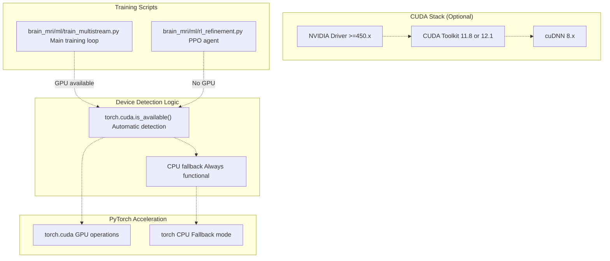
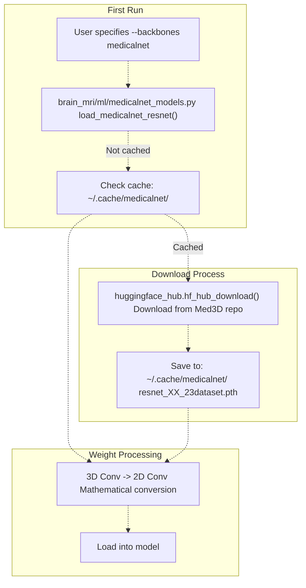
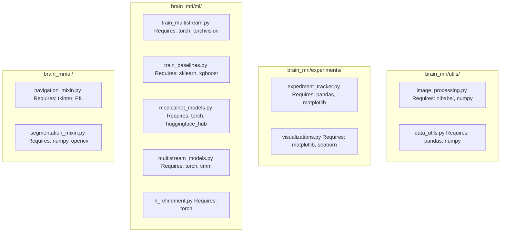

# Installation & Dependencies

> **Relevant source files**
> * [README.md](https://github.com/ThalesMMS/brain-mri-pipelines-py/blob/cd9d51a5/README.md)

This document provides complete instructions for installing the brain-mri-pipelines-py framework and configuring its dependencies. It covers system requirements, Python environment setup, package installation, and GPU configuration.

For instructions on preparing the OASIS-2 dataset after installation, see [Data Preparation](#2.2). For running your first experiment after setup, see [Quick Start Guide](#2.3).

---

## System Requirements

### Hardware Requirements

| Component | Minimum | Recommended |
| --- | --- | --- |
| **RAM** | 8 GB | 16 GB or higher |
| **Storage** | 10 GB free | 50 GB free (for dataset and outputs) |
| **GPU** | None (CPU-only supported) | NVIDIA GPU with 6+ GB VRAM |
| **CPU** | Multi-core x86_64 | 8+ cores for parallel data loading |

**Notes:**

* Deep learning models (`run_deep_models_cli.py`, Stage 2, Stage 3) benefit significantly from GPU acceleration
* Classical baselines (`run_baselines_cli.py`, SVM, XGBoost) run efficiently on CPU
* The GUI (`main.py`) performs well on CPU for visualization tasks

### Operating System Support

| Platform | Support Status | Notes |
| --- | --- | --- |
| **Linux** | ✅ Fully supported | Ubuntu 20.04+, Debian, Fedora tested |
| **macOS** | ✅ Fully supported | macOS 11+ (Big Sur and newer) |
| **Windows** | ✅ Supported | Windows 10/11 with PowerShell or WSL2 |

**Sources:** [README.md L55-L78](https://github.com/ThalesMMS/brain-mri-pipelines-py/blob/cd9d51a5/README.md#L55-L78)

---

## Python Environment Setup

### Python Version Requirement

The framework requires **Python 3.11 or higher**. This version is required for:

* Modern type hinting syntax used throughout the codebase
* Performance improvements in PyTorch 2.0+
* Compatibility with latest dependency versions

**Verification:**

```
python3.11 --version# Expected output: Python 3.11.x
```

### Platform-Specific Installation

#### Linux (Ubuntu/Debian)

```
# Install Python 3.11 and Tkintersudo apt-get updatesudo apt-get install python3.11 python3.11-venv python3-tk# Verify installationpython3.11 --version
```

#### macOS

```
# Install Python 3.11 via Homebrewbrew install python@3.11# Install Tkinter supportbrew install python-tk@3.11# Verify installationpython3.11 --version
```

#### Windows

1. Download Python 3.11 installer from [python.org](https://www.python.org/downloads/)
2. During installation, ensure "tcl/tk and IDLE" is selected
3. Check "Add Python to PATH"
4. Verify in PowerShell:

```
python --version
```

**Sources:** [README.md L56-L62](https://github.com/ThalesMMS/brain-mri-pipelines-py/blob/cd9d51a5/README.md#L56-L62)

---

## Repository Cloning & Virtual Environment

### Clone Repository

```
git clone https://github.com/ThalesMMS/brain-mri-pipelines-py.gitcd brain-mri-pipelines-py
```

### Create Virtual Environment

Virtual environment isolation prevents dependency conflicts with system packages.

```sql
# Create virtual environmentpython3.11 -m venv .venv# Activate (Linux/macOS)source .venv/bin/activate# Activate (Windows PowerShell).venv\Scripts\activate# Activate (Windows Command Prompt).venv\Scripts\activate.bat
```

**Verification:** Your shell prompt should show `(.venv)` prefix after activation.

**Sources:** [README.md L66-L77](https://github.com/ThalesMMS/brain-mri-pipelines-py/blob/cd9d51a5/README.md#L66-L77)

---

## Dependency Installation

### Core Dependencies Overview

```mermaid
flowchart TD

GUI["main.py (Tkinter GUI)"]
CLI_BASE["run_baselines_cli.py (Classical ML)"]
CLI_DEEP["run_deep_models_cli.py (Deep Learning)"]
STAGE1["brain_mri/scripts/run_pc1_embeddings.py"]
STAGE2["brain_mri/scripts/run_pc2_finetune.py"]
STAGE3["brain_mri/scripts/run_pc3_rl_refinement.py"]
TORCH["torch>=2.0.0 Core tensor operations"]
VISION["torchvision>=0.15.0 Pretrained models"]
TIMM["timm>=0.9.0 EfficientNet backbones"]
NIBABEL["nibabel>=5.0.0 NIfTI file reading"]
MEDNET["huggingface_hub>=0.16.0 MedicalNet weights"]
NUMPY["numpy>=1.24.0 Array operations"]
SKLEARN["scikit-learn>=1.3.0 SVM, metrics"]
XGBOOST["xgboost>=1.7.0 Gradient boosting"]
PANDAS["pandas>=2.0.0 CSV metadata"]
PIL["Pillow>=9.5.0 Image I/O"]
CV2["opencv-python>=4.7.0 Augmentations"]
TK["tkinter (stdlib) GUI framework"]
MPL["matplotlib>=3.7.0 Plotting"]
SEABORN["seaborn>=0.12.0 Statistical plots"]
RL["Custom PPO brain_mri/ml/rl_refinement.py"]

GUI -.-> TK
GUI -.-> NIBABEL
GUI -.-> NUMPY
GUI -.-> PIL
STAGE1 -.-> TORCH
STAGE1 -.-> SKLEARN
STAGE2 -.-> TORCH
STAGE2 -.-> VISION
STAGE2 -.-> TIMM
STAGE3 -.-> TORCH
STAGE3 -.-> RL
MEDNET -.-> TORCH
RL -.-> TORCH
SKLEARN -.-> NUMPY
XGBOOST -.-> NUMPY
PIL -.-> NUMPY

subgraph subGraph6 ["RL Components"]
    RL
end

subgraph subGraph5 ["Visualization & UI"]
    TK
    MPL
    SEABORN
end

subgraph subGraph4 ["Data Processing"]
    PANDAS
    PIL
    CV2
end

subgraph subGraph3 ["Classical ML"]
    SKLEARN
    XGBOOST
end

subgraph subGraph2 ["Medical Imaging"]
    NIBABEL
    MEDNET
    NUMPY
    NIBABEL -.-> NUMPY
end

subgraph subGraph1 ["Deep Learning Framework"]
    TORCH
    VISION
    TIMM
    VISION -.-> TORCH
    TIMM -.-> TORCH
end

subgraph subGraph0 ["Application Layer"]
    GUI
    CLI_BASE
    CLI_DEEP
    STAGE1
    STAGE2
    STAGE3
end
```



**Sources:** [README.md L1-L217](https://github.com/ThalesMMS/brain-mri-pipelines-py/blob/cd9d51a5/README.md#L1-L217)

 inferred from system architecture diagrams

### Install from requirements.txt

```
# Ensure virtual environment is activatedpip install --upgrade pip# Install all dependenciespip install -r requirements.txt
```

The `requirements.txt` file contains pinned versions of all necessary packages. Installation typically takes 5-15 minutes depending on internet speed and whether PyTorch needs compilation.

**Sources:** [README.md L76-L77](https://github.com/ThalesMMS/brain-mri-pipelines-py/blob/cd9d51a5/README.md#L76-L77)

---

## GPU & CUDA Configuration

### GPU Support Architecture



**Sources:** Inferred from deep learning model architecture

### CUDA Installation (Linux)

For NVIDIA GPU acceleration:

```
# Check GPU presencelspci | grep -i nvidia# Install NVIDIA driver (Ubuntu/Debian)sudo apt-get install nvidia-driver-525# Verify driver installationnvidia-smi# Install PyTorch with CUDA supportpip install torch torchvision --index-url https://download.pytorch.org/whl/cu118
```

### CUDA Installation (Windows)

1. Download NVIDIA Driver from [nvidia.com/drivers](https://www.nvidia.com/drivers)
2. Install CUDA Toolkit 11.8 or 12.1
3. Install PyTorch with CUDA:

```
pip install torch torchvision --index-url https://download.pytorch.org/whl/cu118
```

### Verify GPU Configuration

```python
python -c "import torch; print(f'CUDA available: {torch.cuda.is_available()}'); print(f'Device count: {torch.cuda.device_count()}')"
```

**Expected output with GPU:**

```
CUDA available: True
Device count: 1
```

**Expected output without GPU (CPU mode):**

```
CUDA available: False
Device count: 0
```

**Note:** The framework automatically detects and uses GPU if available. CPU-only mode is fully functional but slower for deep learning models.

**Sources:** Standard PyTorch GPU setup

---

## MedicalNet Weight Downloads

### Automatic Weight Caching

The framework automatically downloads MedicalNet pretrained weights when using the `medicalnet` backbone option. This occurs via `huggingface_hub` during first use.



### Cache Location

| Platform | Default Cache Location |
| --- | --- |
| **Linux** | `~/.cache/medicalnet/` |
| **macOS** | `~/.cache/medicalnet/` |
| **Windows** | `%USERPROFILE%\.cache\medicalnet\` |

### Manual Pre-Download (Optional)

To pre-download weights before training:

```
python -c "from brain_mri.ml.medicalnet_models import load_medicalnet_resnet; load_medicalnet_resnet('resnet_10_23dataset.pth')"
```

**Available weight files:**

* `resnet_10_23dataset.pth` (smallest, ~15 MB)
* `resnet_18_23dataset.pth` (~45 MB)
* `resnet_34_23dataset.pth` (~85 MB)
* `resnet_50_23dataset.pth` (~100 MB)

**Sources:** [README.md L171-L173](https://github.com/ThalesMMS/brain-mri-pipelines-py/blob/cd9d51a5/README.md#L171-L173)

---

## Dependency Categories & Usage Context

### Package Usage Matrix

| Package | GUI | Baselines CLI | Deep Models CLI | Stage 1 | Stage 2 | Stage 3 |
| --- | --- | --- | --- | --- | --- | --- |
| `tkinter` | ✅ | ❌ | ❌ | ❌ | ❌ | ❌ |
| `nibabel` | ✅ | ✅ | ✅ | ✅ | ✅ | ✅ |
| `numpy` | ✅ | ✅ | ✅ | ✅ | ✅ | ✅ |
| `pandas` | ✅ | ✅ | ✅ | ✅ | ✅ | ✅ |
| `torch` | ⚠️ Optional | ❌ | ✅ | ✅ | ✅ | ✅ |
| `torchvision` | ❌ | ❌ | ✅ | ✅ | ✅ | ✅ |
| `timm` | ❌ | ❌ | ✅ | ✅ | ✅ | ✅ |
| `scikit-learn` | ⚠️ Optional | ✅ | ❌ | ✅ | ❌ | ❌ |
| `xgboost` | ❌ | ✅ | ❌ | ❌ | ❌ | ❌ |
| `matplotlib` | ✅ | ✅ | ✅ | ✅ | ✅ | ✅ |
| `huggingface_hub` | ❌ | ❌ | ⚠️ MedicalNet | ⚠️ MedicalNet | ⚠️ MedicalNet | ⚠️ MedicalNet |

**Legend:**

* ✅ = Required for component
* ❌ = Not used by component
* ⚠️ = Conditionally required

### Module-Specific Dependencies



**Sources:** [README.md L179-L196](https://github.com/ThalesMMS/brain-mri-pipelines-py/blob/cd9d51a5/README.md#L179-L196)

 inferred from package structure

---

## Verification Steps

### 1. Verify Core Installation

```python
# Test Python environmentpython --version  # Should show Python 3.11.x# Test core package importspython -c "import brain_mri; print('Package imported successfully')"# Test nibabel (NIfTI support)python -c "import nibabel as nib; print(f'nibabel version: {nib.__version__}')"# Test numpypython -c "import numpy as np; print(f'numpy version: {np.__version__}')"
```

### 2. Verify Deep Learning Stack

```python
# Test PyTorchpython -c "import torch; print(f'PyTorch version: {torch.__version__}'); print(f'CUDA available: {torch.cuda.is_available()}')"# Test torchvisionpython -c "import torchvision; print(f'torchvision version: {torchvision.__version__}')"# Test timm (EfficientNet/DenseNet)python -c "import timm; print(f'timm version: {timm.__version__}')"
```

### 3. Verify Classical ML Stack

```python
# Test scikit-learnpython -c "import sklearn; print(f'scikit-learn version: {sklearn.__version__}')"# Test XGBoostpython -c "import xgboost as xgb; print(f'XGBoost version: {xgb.__version__}')"
```

### 4. Verify GUI Dependencies (Optional)

```python
# Test Tkinterpython -c "import tkinter; root = tkinter.Tk(); print('Tkinter working'); root.destroy()"# Test PILpython -c "from PIL import Image; print(f'Pillow version: {Image.__version__}')"
```

### 5. Comprehensive Verification Script

Create `verify_installation.py`:

```python
#!/usr/bin/env python3"""Verification script for brain-mri-pipelines-py installation."""import sysdef check_import(module_name, display_name=None):    """Attempt to import a module and report status."""    display_name = display_name or module_name    try:        mod = __import__(module_name)        version = getattr(mod, '__version__', 'unknown')        print(f"✅ {display_name}: {version}")        return True    except ImportError as e:        print(f"❌ {display_name}: NOT FOUND ({e})")        return Falsedef main():    print("Brain MRI Pipelines - Installation Verification\n")    print("=" * 60)        critical = []    critical.append(check_import('numpy'))    critical.append(check_import('pandas'))    critical.append(check_import('nibabel'))        print("\nDeep Learning Stack:")    critical.append(check_import('torch', 'PyTorch'))    critical.append(check_import('torchvision'))    critical.append(check_import('timm'))        print("\nClassical ML:")    critical.append(check_import('sklearn', 'scikit-learn'))    critical.append(check_import('xgboost', 'XGBoost'))        print("\nVisualization:")    check_import('matplotlib')    check_import('seaborn')        print("\nOptional Components:")    check_import('tkinter', 'Tkinter (GUI)')    check_import('huggingface_hub', 'HuggingFace Hub (MedicalNet)')        print("\n" + "=" * 60)        if all(critical):        print("✅ All critical dependencies installed successfully!")        return 0    else:        print("❌ Some critical dependencies are missing. Please check above.")        return 1if __name__ == '__main__':    sys.exit(main())
```

Run verification:

```
python verify_installation.py
```

**Sources:** Standard Python verification patterns

---

## Troubleshooting

### Common Issues & Solutions

#### Issue: ImportError: No module named 'tkinter'

**Cause:** Tkinter not installed (Linux only issue)

**Solution:**

```
sudo apt-get install python3-tk  # Ubuntu/Debiansudo yum install python3-tkinter  # Fedora/RHEL
```

#### Issue: ModuleNotFoundError: No module named 'brain_mri'

**Cause:** Python not finding the package

**Solution:**

```css
# Ensure you're in the repository rootcd /path/to/brain-mri-pipelines-py# Ensure virtual environment is activatedsource .venv/bin/activate  # or .venv\Scripts\activate on Windows# Add repository to Python pathexport PYTHONPATH="${PYTHONPATH}:$(pwd)"
```

#### Issue: PyTorch installation fails or is very slow

**Cause:** pip trying to compile from source

**Solution:**

```
# Use pre-built wheelspip install torch torchvision --index-url https://download.pytorch.org/whl/cpu  # CPUpip install torch torchvision --index-url https://download.pytorch.org/whl/cu118  # CUDA 11.8
```

#### Issue: RuntimeError: CUDA out of memory

**Cause:** GPU VRAM insufficient for batch size

**Solution:**

* Reduce batch size in training configuration
* Use gradient accumulation
* Switch to CPU mode for smaller experiments

#### Issue: MedicalNet weights download fails

**Cause:** Network issues or HuggingFace Hub connectivity

**Solution:**

```
# Set proxy if neededexport HF_ENDPOINT=https://hf-mirror.com  # Use mirror# Or manually download and place in cachemkdir -p ~/.cache/medicalnet# Download from HuggingFace and place in above directory
```

### Dependency Conflicts

If you encounter version conflicts:

```sql
# Create fresh virtual environmentdeactivate  # if currently activatedrm -rf .venvpython3.11 -m venv .venvsource .venv/bin/activate# Reinstall with no cachepip install --no-cache-dir -r requirements.txt
```

### Platform-Specific Notes

| Platform | Note |
| --- | --- |
| **macOS M1/M2** | Use `--platform=darwin-arm64` for native ARM wheels. PyTorch has Apple Silicon acceleration via MPS backend. |
| **Windows WSL2** | Prefer WSL2 for Linux-like experience. GPU passthrough requires WSL2 with CUDA support. |
| **Older Linux** | Some distributions may need manual glibc updates for PyTorch binary compatibility. |

**Sources:** Common deployment issues

---

## Next Steps

After successful installation:

1. **Prepare Data**: Follow [Data Preparation](#2.2) to organize the OASIS-2 dataset
2. **Run Verification**: Test the GUI with `python main.py` (requires data in `axl/` directory)
3. **First Experiment**: See [Quick Start Guide](#2.3) for running your first training pipeline
4. **Explore Components**: Review [System Architecture](#3) to understand the codebase structure

**Sources:** [README.md L1-L217](https://github.com/ThalesMMS/brain-mri-pipelines-py/blob/cd9d51a5/README.md#L1-L217)

Refresh this wiki

Last indexed: 5 January 2026 ([cd9d51](https://github.com/ThalesMMS/brain-mri-pipelines-py/commit/cd9d51a5))

### On this page

* [Installation & Dependencies](#2.1-installation-dependencies)
* [System Requirements](#2.1-system-requirements)
* [Hardware Requirements](#2.1-hardware-requirements)
* [Operating System Support](#2.1-operating-system-support)
* [Python Environment Setup](#2.1-python-environment-setup)
* [Python Version Requirement](#2.1-python-version-requirement)
* [Platform-Specific Installation](#2.1-platform-specific-installation)
* [Repository Cloning & Virtual Environment](#2.1-repository-cloning-virtual-environment)
* [Clone Repository](#2.1-clone-repository)
* [Create Virtual Environment](#2.1-create-virtual-environment)
* [Dependency Installation](#2.1-dependency-installation)
* [Core Dependencies Overview](#2.1-core-dependencies-overview)
* [Install from requirements.txt](#2.1-install-from-requirementstxt)
* [GPU & CUDA Configuration](#2.1-gpu-cuda-configuration)
* [GPU Support Architecture](#2.1-gpu-support-architecture)
* [CUDA Installation (Linux)](#2.1-cuda-installation-linux)
* [CUDA Installation (Windows)](#2.1-cuda-installation-windows)
* [Verify GPU Configuration](#2.1-verify-gpu-configuration)
* [MedicalNet Weight Downloads](#2.1-medicalnet-weight-downloads)
* [Automatic Weight Caching](#2.1-automatic-weight-caching)
* [Cache Location](#2.1-cache-location)
* [Manual Pre-Download (Optional)](#2.1-manual-pre-download-optional)
* [Dependency Categories & Usage Context](#2.1-dependency-categories-usage-context)
* [Package Usage Matrix](#2.1-package-usage-matrix)
* [Module-Specific Dependencies](#2.1-module-specific-dependencies)
* [Verification Steps](#2.1-verification-steps)
* [1. Verify Core Installation](#2.1-1-verify-core-installation)
* [2. Verify Deep Learning Stack](#2.1-2-verify-deep-learning-stack)
* [3. Verify Classical ML Stack](#2.1-3-verify-classical-ml-stack)
* [4. Verify GUI Dependencies (Optional)](#2.1-4-verify-gui-dependencies-optional)
* [5. Comprehensive Verification Script](#2.1-5-comprehensive-verification-script)
* [Troubleshooting](#2.1-troubleshooting)
* [Common Issues & Solutions](#2.1-common-issues-solutions)
* [Dependency Conflicts](#2.1-dependency-conflicts)
* [Platform-Specific Notes](#2.1-platform-specific-notes)
* [Next Steps](#2.1-next-steps)

Ask Devin about brain-mri-pipelines-py