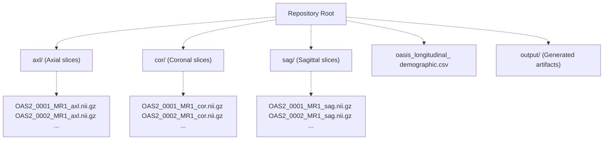
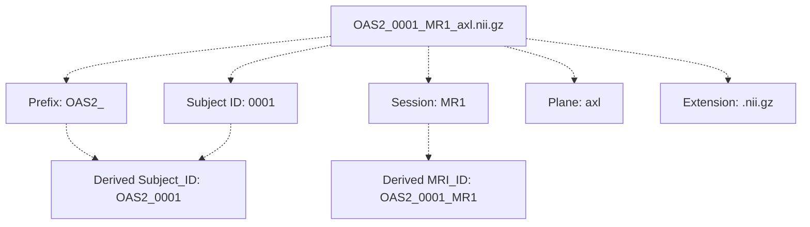

# Data Preparation

> **Relevant source files**
> * [README.md](https://github.com/ThalesMMS/brain-mri-pipelines-py/blob/cd9d51a5/README.md)
> * [axl/OAS2_0001_MR1_axl.nii.gz](https://github.com/ThalesMMS/brain-mri-pipelines-py/blob/cd9d51a5/axl/OAS2_0001_MR1_axl.nii.gz)
> * [axl/OAS2_0002_MR1_axl.nii.gz](https://github.com/ThalesMMS/brain-mri-pipelines-py/blob/cd9d51a5/axl/OAS2_0002_MR1_axl.nii.gz)

This document explains how to obtain and organize the OASIS-2 dataset for use with the brain-mri-pipelines-py framework. This page covers the physical data layout, file naming conventions, and metadata requirements. For information about how the system prevents data leakage during training, see [Subject-Level Splitting & Leakage Prevention](3d%20Subject-Level-Splitting-&-Leakage-Prevention.md). For the actual data loading and augmentation pipeline used during training, see [Data Loading & Augmentation](4e%20Loss-Functions-&-Class-Imbalance.md).

---

## Purpose and Scope

The brain-mri-pipelines-py repository is designed around an **OASIS-2-style directory layout**. Some revisions may already contain MRI/CSV files arranged in that layout, while other users may prepare the data independently. In either case, this page documents:

* The required directory layout in the repository root
* File naming conventions that the system parses
* Clinical metadata CSV format
* Validation steps to ensure correct setup

**Sources:** README.md

---

## OASIS-2 Dataset

The system is designed to work with the **Open Access Series of Imaging Studies - Longitudinal (OASIS-2)** dataset, which contains neuroimaging data for Alzheimer's disease research. If you are preparing your own copy instead of using files already present in a checkout, obtain the dataset from the official OASIS project website or another authorized source.

**Key characteristics:**

* **Modality:** T1-weighted MRI scans
* **Format:** NIfTI (`.nii.gz` or `.nii`)
* **Views:** Axial, Coronal, and Sagittal slices extracted from volumetric scans
* **Subjects:** Longitudinal data with multiple MRI sessions per subject
* **Clinical data:** Demographics, cognitive scores, and morphometric measurements

For detailed information about the OASIS-2 dataset structure and clinical features, see [OASIS-2 Dataset Overview](4a%20OASIS-2-Dataset-Overview.md).

**Sources:** [README.md L3](https://github.com/ThalesMMS/brain-mri-pipelines-py/blob/cd9d51a5/README.md#L3-L3)

 [README.md L29-L38](https://github.com/ThalesMMS/brain-mri-pipelines-py/blob/cd9d51a5/README.md#L29-L38)

---

## Directory Structure

The system expects a specific directory layout in the repository root. The imaging data is organized into three anatomical plane directories, with clinical metadata stored in a CSV file at the root level:



### Directory Requirements

| Directory | Status | Purpose |
| --- | --- | --- |
| `axl/` | **Required** | Axial view MRI slices (mandatory for GUI and all experiments) |
| `cor/` | Optional | Coronal view slices (used in multi-stream deep models) |
| `sag/` | Optional | Sagittal view slices (used in multi-stream deep models) |
| `oasis_longitudinal_demographic.csv` | **Required** | Clinical metadata for subject demographics and morphometry |
| `output/` | Auto-generated | Created automatically to store models, logs, and results |

**Note:** While `cor/` and `sag/` are optional, the multi-stream deep learning models require all three views for optimal performance. The system can operate with only `axl/` but will be limited to single-stream or classical baseline models.

**Sources:** [README.md L31-L38](https://github.com/ThalesMMS/brain-mri-pipelines-py/blob/cd9d51a5/README.md#L31-L38)

 [README.md L10-L11](https://github.com/ThalesMMS/brain-mri-pipelines-py/blob/cd9d51a5/README.md#L10-L11)

---

## File Naming Convention

The system relies on a strict filename pattern to extract subject identifiers and match imaging data with clinical metadata. All MRI files must follow this convention:

### Pattern

```
OAS2_<SUBJECT_ID>_MR<SESSION_NUM>_<PLANE>.nii.gz
```

### Component Breakdown



### Parsing Logic

The system extracts two key identifiers from filenames:

1. **Subject_ID:** `OAS2_<SUBJECT_ID>` (e.g., `OAS2_0001`) * Used for subject-level train/val/test splitting * Ensures all scans from the same patient remain in one partition
2. **MRI_ID:** `OAS2_<SUBJECT_ID>_MR<SESSION_NUM>` (e.g., `OAS2_0001_MR1`) * Unique identifier for each MRI session * Used to link imaging data with clinical metadata rows

### Supported File Extensions

* `.nii.gz` (compressed NIfTI, recommended)
* `.nii` (uncompressed NIfTI)
* `.png` (for visualization, limited support)
* `.jpg` (for visualization, limited support)

### Plane Identifiers

| Plane | Code | Description |
| --- | --- | --- |
| Axial | `axl` | Horizontal slices (top-down view) |
| Coronal | `cor` | Frontal slices (front-back view) |
| Sagittal | `sag` | Lateral slices (side view) |

### Examples

**Valid filenames:**

* `OAS2_0001_MR1_axl.nii.gz` → Subject: `OAS2_0001`, MRI: `OAS2_0001_MR1`
* `OAS2_0123_MR2_cor.nii` → Subject: `OAS2_0123`, MRI: `OAS2_0123_MR2`
* `OAS2_0456_MR3_sag.nii.gz` → Subject: `OAS2_0456`, MRI: `OAS2_0456_MR3`

**Invalid filenames:**

* `subject001_MR1_axl.nii.gz` (missing `OAS2_` prefix)
* `OAS2_0001_axl.nii.gz` (missing `MR` session identifier)
* `OAS2_0001_MR1.nii.gz` (missing plane identifier)

**Sources:** README.md

 [axl/OAS2_0001_MR1_axl.nii.gz L1](https://github.com/ThalesMMS/brain-mri-pipelines-py/blob/cd9d51a5/axl/OAS2_0001_MR1_axl.nii.gz#L1-L1)

 [axl/OAS2_0002_MR1_axl.nii.gz L1](https://github.com/ThalesMMS/brain-mri-pipelines-py/blob/cd9d51a5/axl/OAS2_0002_MR1_axl.nii.gz#L1-L1)

---

## Clinical Metadata CSV

The `oasis_longitudinal_demographic.csv` file contains clinical and demographic information for each MRI session. This data is used for:

* **Multimodal fusion:** Clinical features concatenated with visual embeddings
* **Target labels:** Alzheimer's diagnosis (derived from CDR scores)
* **Subject stratification:** Ensuring balanced splits across demographic groups

### Required Columns

The CSV must include the following columns:

| Column Name | Type | Description | Usage |
| --- | --- | --- | --- |
| `MRI_ID` | String | Matches `OAS2_<XXXX>_MR<Y>` from filenames | Primary key for linking |
| `Subject_ID` | String | Matches `OAS2_<XXXX>` from filenames | Used for subject-level splitting |
| `Group` | String | `Demented`, `Nondemented`, or `Converted` | Diagnosis label (simplified to binary) |
| `Age` | Float | Age at MRI session in years | Clinical feature |
| `Educ` | Integer | Years of education | Clinical feature |
| `nWBV` | Float | Normalized Whole Brain Volume | Morphometric feature |
| `eTIV` | Float | Estimated Total Intracranial Volume | Morphometric feature |
| `ASF` | Float | Atlas Scaling Factor | Morphometric feature |

### Optional Columns (Leakage Warning)

| Column Name | Type | Description | Warning |
| --- | --- | --- | --- |
| `MMSE` | Integer | Mini-Mental State Examination score | ⚠️ Strong proxy for dementia diagnosis |
| `CDR` | Float | Clinical Dementia Rating | ⚠️ Direct indicator of cognitive status |

**Important:** The system supports including `MMSE` and `CDR` in the feature set for baseline comparison purposes, but this creates **target leakage** since these scores are directly correlated with Alzheimer's diagnosis. The documentation explicitly recommends excluding these features for methodologically sound imaging-based analysis.

### CSV Format Example

```
Subject_ID,MRI_ID,Group,Visit,MR_Delay,M/F,Hand,Age,Educ,SES,MMSE,CDR,eTIV,nWBV,ASFOAS2_0001,OAS2_0001_MR1,Nondemented,1,0,M,R,87,14,2,27,0,1987,0.696,0.883OAS2_0001,OAS2_0001_MR2,Nondemented,2,457,M,R,88,14,2,30,0,2004,0.681,0.876OAS2_0002,OAS2_0002_MR1,Demented,1,0,M,R,75,12,,,0.5,1678,0.736,1.046OAS2_0002,OAS2_0002_MR2,Demented,2,560,M,R,76,12,,,0.5,1738,0.713,1.010
```

### Label Derivation

The system converts the `Group` column to binary labels:

* `Nondemented` → **0** (Non-AD)
* `Demented` → **1** (AD)
* `Converted` → **1** (AD) — subjects who converted during the longitudinal study

For detailed information about clinical features and their usage, see [Clinical Metadata](4d%20Clinical-Metadata.md).

**Sources:** [README.md L36](https://github.com/ThalesMMS/brain-mri-pipelines-py/blob/cd9d51a5/README.md#L36-L36)

 [README.md L12](https://github.com/ThalesMMS/brain-mri-pipelines-py/blob/cd9d51a5/README.md#L12-L12)

 **Sources**: [Project overview and setup](https://github.com/ThalesMMS/brain-mri-pipelines-py/blob/cd9d51a5/README.md#L166-L168)

---

## Data Validation Checklist

Before running experiments, verify the data preparation is correct:

### 1. Directory Structure

```
# Check that required directories existls -ld axl/ cor/ sag/ oasis_longitudinal_demographic.csv# Count files in each directoryecho "Axial files: $(ls axl/*.nii* 2>/dev/null | wc -l)"echo "Coronal files: $(ls cor/*.nii* 2>/dev/null | wc -l)"echo "Sagittal files: $(ls sag/*.nii* 2>/dev/null | wc -l)"
```

### 2. File Naming Convention

```
# Verify all axial files follow the naming patternls axl/ | grep -v -E '^OAS2_[0-9]{4}_MR[0-9]+_axl\.nii(\.gz)?$'# (Empty output means all files are valid)# Extract unique subjectsls axl/*.nii* | sed 's/.*OAS2_/OAS2_/' | sed 's/_MR.*//' | sort -u
```

### 3. CSV Integrity

```
# Check CSV headerhead -n 1 oasis_longitudinal_demographic.csv# Count rows (should match or exceed number of MRI sessions)wc -l oasis_longitudinal_demographic.csv# Verify no missing MRI_ID valuesawk -F',' 'NR>1 && $2=="" {print "Missing MRI_ID on line " NR}' \    oasis_longitudinal_demographic.csv
```

### 4. Filename-CSV Alignment

The system includes functionality to validate that all filenames have corresponding CSV entries. This validation occurs during dataset construction but can be checked manually:

```python
# Example validation logic (for reference, not to execute)# The actual implementation is in the data loading pipelineimport osimport pandas as pd# Load CSVcsv_path = "oasis_longitudinal_demographic.csv"df = pd.read_csv(csv_path)csv_mri_ids = set(df['MRI_ID'].values)# Extract MRI_IDs from filenamesaxl_files = os.listdir("axl/")file_mri_ids = set()for fname in axl_files:    if fname.endswith(('.nii', '.nii.gz')):        # Parse: OAS2_0001_MR1_axl.nii.gz -> OAS2_0001_MR1        parts = fname.replace('.nii.gz', '').replace('.nii', '').split('_')        mri_id = '_'.join(parts[:-1])  # Exclude the plane identifier        file_mri_ids.add(mri_id)# Check for mismatchesmissing_in_csv = file_mri_ids - csv_mri_idsmissing_files = csv_mri_ids - file_mri_idsprint(f"Files without CSV entries: {len(missing_in_csv)}")print(f"CSV entries without files: {len(missing_files)}")
```

### 5. Subject-Level Consistency

Verify that MRI sessions for the same subject have consistent Subject_ID:

```
# Group by Subject_ID and list all MRI sessionsawk -F',' 'NR>1 {print $1, $2}' oasis_longitudinal_demographic.csv | \    sort | \    awk '{if ($1 != prev) {if (prev) print ""; prev=$1} print $2}' | \    head -20
```

Expected output format (multiple sessions per subject):

```
OAS2_0001_MR1 OAS2_0001_MR2
OAS2_0002_MR1 OAS2_0002_MR2 OAS2_0002_MR3
...
```

### Common Issues

| Issue | Symptom | Solution |
| --- | --- | --- |
| Missing plane directory | `FileNotFoundError: [Errno 2] No such file or directory: 'axl/'` | Create the directory and populate with `.nii.gz` files |
| Malformed filename | `KeyError` or `IndexError` during parsing | Rename files to match `OAS2_XXXX_MRY_plane.nii.gz` pattern |
| CSV-file mismatch | Warning: "X files have no corresponding CSV entry" | Ensure all MRI_IDs in filenames exist in CSV |
| Missing clinical features | `KeyError: 'Age'` or similar | Verify CSV contains all required columns |

**Sources:** [README.md L29-L38](https://github.com/ThalesMMS/brain-mri-pipelines-py/blob/cd9d51a5/README.md#L29-L38)

 README.md

---

## Relationship to Training Pipeline

Once the data is properly organized, the system's data loading pipeline will:

1. **Parse filenames** to extract `Subject_ID` and `MRI_ID`
2. **Perform subject-level splitting** to create Train/Val/Test partitions (see [Subject-Level Splitting & Leakage Prevention](3d%20Subject-Level-Splitting-&-Leakage-Prevention.md))
3. **Load NIfTI volumes** using `nibabel` or similar libraries
4. **Match clinical metadata** from CSV using `MRI_ID` as the join key
5. **Apply augmentations** during training (see [Data Loading & Augmentation](4e%20Loss-Functions-&-Class-Imbalance.md))

The data preparation steps documented here are prerequisites for all training workflows:

* GUI-based training via `main.py` (see [Graphical User Interface](7a%20Git-Configuration.md))
* Classical baselines via `run_baselines_cli.py` (see [Baselines CLI](7b%20Output-Directory-Structure.md))
* Deep learning via `run_deep_models_cli.py` (see [Deep Models CLI](7c%20License-&-Usage-Terms.md))
* Research pipeline stages (see [Three-Stage Research Pipeline](6%20User-Interfaces.md))

**Sources:** README.md

---

## Summary

Data preparation involves:

1. **Obtaining OASIS-2 dataset** from official sources
2. **Creating directory structure:** `axl/`, `cor/`, `sag/` in repository root
3. **Organizing files** according to `OAS2_XXXX_MRY_plane.nii.gz` naming convention
4. **Preparing CSV** with required clinical metadata columns
5. **Validating** filename-CSV alignment and subject consistency

Correct data preparation is essential for the system's subject-level splitting mechanism, which prevents data leakage by ensuring all MRI sessions from a single patient remain in one partition during training.

**Sources:** README.md


### On this page

* [Data Preparation](#2.2-data-preparation)
* [Purpose and Scope](#2.2-purpose-and-scope)
* [OASIS-2 Dataset](#2.2-oasis-2-dataset)
* [Directory Structure](#2.2-directory-structure)
* [Directory Requirements](#2.2-directory-requirements)
* [File Naming Convention](#2.2-file-naming-convention)
* [Pattern](#2.2-pattern)
* [Component Breakdown](#2.2-component-breakdown)
* [Parsing Logic](#2.2-parsing-logic)
* [Supported File Extensions](#2.2-supported-file-extensions)
* [Plane Identifiers](#2.2-plane-identifiers)
* [Examples](#2.2-examples)
* [Clinical Metadata CSV](#2.2-clinical-metadata-csv)
* [Required Columns](#2.2-required-columns)
* [Optional Columns (Leakage Warning)](#2.2-optional-columns-leakage-warning)
* [CSV Format Example](#2.2-csv-format-example)
* [Label Derivation](#2.2-label-derivation)
* [Data Validation Checklist](#2.2-data-validation-checklist)
* [1. Directory Structure](#2.2-1-directory-structure)
* [2. File Naming Convention](#2.2-2-file-naming-convention)
* [3. CSV Integrity](#2.2-3-csv-integrity)
* [4. Filename-CSV Alignment](#2.2-4-filename-csv-alignment)
* [5. Subject-Level Consistency](#2.2-5-subject-level-consistency)
* [Common Issues](#2.2-common-issues)
* [Relationship to Training Pipeline](#2.2-relationship-to-training-pipeline)
* [Summary](#2.2-summary)

Ask Devin about brain-mri-pipelines-py
