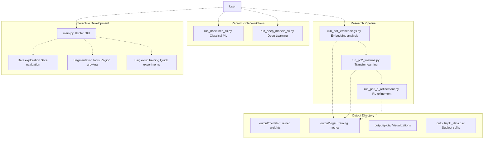
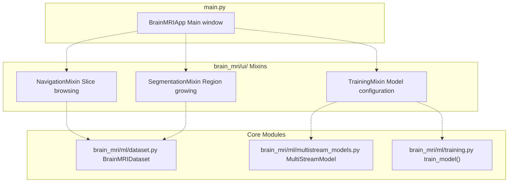
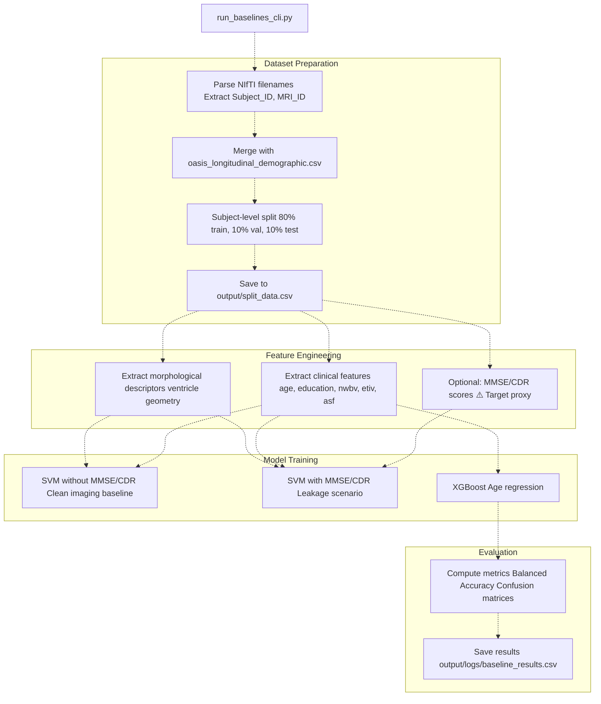
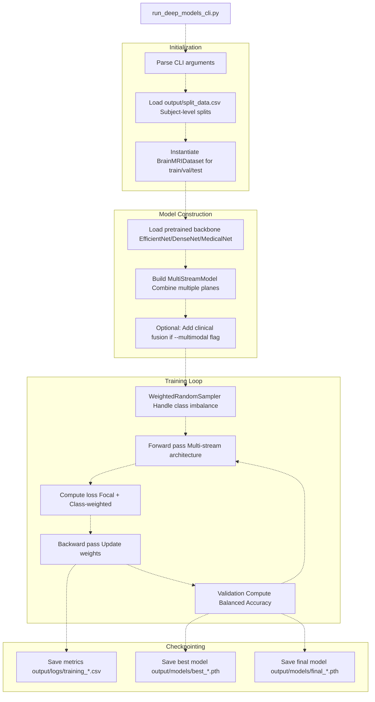

# Quick Start Guide

> **Relevant source files**
> * [README.md](https://github.com/ThalesMMS/brain-mri-pipelines-py/blob/cd9d51a5/README.md)

This page provides step-by-step instructions for running your first experiments with the brain-mri-pipelines-py system. It demonstrates both interactive (GUI) and headless (CLI) workflows for training models and analyzing results.

**Prerequisites**: This guide assumes you have already completed [Installation & Dependencies](#2.1) and [Data Preparation](#2.2). For detailed information about the three-stage research pipeline, see [Three-Stage Research Pipeline](#6). For comprehensive training configuration options, see [Training Configuration](#5.4).

---

## Prerequisites Verification

Before proceeding, verify that your environment is correctly configured:

| Requirement | Verification Command | Expected Result |
| --- | --- | --- |
| Python version | `python --version` | Python 3.11+ |
| Virtual environment | `which python` | Path contains `.venv` |
| Dependencies installed | `pip show torch` | Package information displayed |
| Data directories exist | `ls axl/ cor/ sag/` | NIfTI files listed |
| Clinical metadata exists | `ls oasis_longitudinal_demographic.csv` | File found |

If any verification fails, return to the relevant setup page before continuing.

**Sources**: [README.md L54-L76](https://github.com/ThalesMMS/brain-mri-pipelines-py/blob/cd9d51a5/README.md#L54-L76)

---

## Entry Point Overview

The system provides multiple entry points for different use cases:



**Diagram Title**: System Entry Points and Output Flow

**Sources**: [README.md L81-L157](https://github.com/ThalesMMS/brain-mri-pipelines-py/blob/cd9d51a5/README.md#L81-L157)

---

## Method 1: Interactive GUI Workflow

The GUI provides immediate visual feedback and is ideal for initial data exploration and prototyping.

### Launching the GUI

```
python main.py
```

This executes the Tkinter application defined in [main.py L1-L1000](https://github.com/ThalesMMS/brain-mri-pipelines-py/blob/cd9d51a5/main.py#L1-L1000)

 (exact range depends on implementation). The GUI instantiates the `BrainMRIApp` class which inherits from multiple UI mixins located in `brain_mri/ui/`.

### GUI Interface Components



**Diagram Title**: GUI Component Architecture Mapping

### Typical GUI Workflow

1. **Data Exploration** (first-time users): * Browse through MRI volumes using navigation controls * Inspect image quality and mark non-viable studies * Visualize clinical metadata from `oasis_longitudinal_demographic.csv`
2. **Segmentation** (optional): * Select seed points for region-growing algorithms * Extract morphological descriptors from segmented regions * Save descriptors for later use in classical ML baselines
3. **Model Training** (sidebar configuration): * Select backbone architecture (`efficientnet`, `densenet`, or `medicalnet`) * Choose anatomical planes (`axl`, `cor`, `sag` or combinations) * Enable multimodal fusion to include clinical features * Set hyperparameters (learning rate, batch size, epochs) * Click "Train" to begin single-run experiment

### GUI Output

Training initiated from the GUI generates:

* Model checkpoint: `output/models/<timestamp>_<backbone>_<config>.pth`
* Training log: `output/logs/<timestamp>_training.csv`
* Loss curves: `output/plots/<timestamp>_loss.png`

The GUI displays real-time training progress and validation metrics in the interface.

**Sources**: [README.md L83-L96](https://github.com/ThalesMMS/brain-mri-pipelines-py/blob/cd9d51a5/README.md#L83-L96)

---

## Method 2: Classical Baselines CLI

The baselines CLI is the recommended starting point for reproducible research workflows. It establishes performance benchmarks using traditional machine learning.

### Running Baseline Models

```
python run_baselines_cli.py
```

### What This Command Does

The script [run_baselines_cli.py L1-L500](https://github.com/ThalesMMS/brain-mri-pipelines-py/blob/cd9d51a5/run_baselines_cli.py#L1-L500)

 executes the following sequence:



**Diagram Title**: Baseline CLI Execution Flow

### Critical Output: Subject-Level Split

The most important artifact from this command is `output/split_data.csv`, which enforces subject-level splitting to prevent data leakage. This file structure:

| Column | Description | Example |
| --- | --- | --- |
| `Subject_ID` | Patient identifier | `OAS2_0001` |
| `MRI_ID` | Scan identifier | `OAS2_0001_MR1` |
| `split` | Partition assignment | `train`, `val`, `test` |
| `label` | AD diagnosis | `0` (non-AD) or `1` (AD) |
| `age`, `education`, etc. | Clinical features | Numeric values |

**Important**: All subsequent experiments must use this split file to ensure consistency. See [Subject-Level Splitting & Leakage Prevention](#3.4) for details.

### Baseline Performance Interpretation

The script outputs two SVM scenarios:

| Scenario | Feature Set | Purpose | Methodological Validity |
| --- | --- | --- | --- |
| `svm_without_mmse_cdr` | Morphology + Clinical | Imaging-based analysis | ✅ **Recommended** for publication |
| `svm_with_mmse_cdr` | Morphology + Clinical + MMSE/CDR | Performance upper bound | ⚠️ Contains target proxy leakage |

The second scenario demonstrates how cognitive test scores (MMSE/CDR) can artificially inflate performance, as they are strong proxies for dementia diagnosis.

**Sources**: [README.md L101-L108](https://github.com/ThalesMMS/brain-mri-pipelines-py/blob/cd9d51a5/README.md#L101-L108)

 [README.md L163-L169](https://github.com/ThalesMMS/brain-mri-pipelines-py/blob/cd9d51a5/README.md#L163-L169)

---

## Method 3: Deep Learning CLI

After establishing baselines, train deep learning models for comparison.

### Basic Deep Learning Training

```
python run_deep_models_cli.py --seed 42 --epochs 40 --backbones efficientnet,medicalnet,densenet
```

### Command-Line Arguments

| Argument | Description | Default | Options |
| --- | --- | --- | --- |
| `--seed` | Random seed for reproducibility | `42` | Any integer |
| `--epochs` | Total training epochs | `40` | Positive integer |
| `--backbones` | Comma-separated backbone list | `efficientnet` | `efficientnet`, `densenet`, `medicalnet` |
| `--planes` | Anatomical planes to use | `axl,cor,sag` | Any combination |
| `--batch-size` | Training batch size | `16` | Powers of 2 recommended |
| `--learning-rate` | Initial learning rate | `1e-4` | Scientific notation |
| `--multimodal` | Enable clinical feature fusion | `False` | Flag (no value) |

### Multimodal Training Example

```
python run_deep_models_cli.py \    --seed 42 \    --epochs 40 \    --backbones efficientnet \    --multimodal \    --planes axl,cor,sag
```

The `--multimodal` flag concatenates visual embeddings with clinical features (`age`, `education`, `nwbv`, `etiv`, `asf`) before the classification layer, as implemented in [brain_mri/ml/multistream_models.py L1-L500](https://github.com/ThalesMMS/brain-mri-pipelines-py/blob/cd9d51a5/brain_mri/ml/multistream_models.py#L1-L500)

### Script Execution Flow



**Diagram Title**: Deep Learning CLI Training Pipeline

### Expected Training Duration

Approximate training times (single RTX 3090 GPU):

| Configuration | Epochs | Approximate Duration |
| --- | --- | --- |
| Single backbone, single plane | 40 | 45-60 minutes |
| Single backbone, three planes | 40 | 90-120 minutes |
| Three backbones, three planes | 40 | 4-6 hours |
| With multimodal fusion | 40 | +10% overhead |

**Sources**: [README.md L110-L119](https://github.com/ThalesMMS/brain-mri-pipelines-py/blob/cd9d51a5/README.md#L110-L119)

---

## Method 4: Research Pipeline Scripts

For replicating the three-stage experimental methodology, use the dedicated scripts in `brain_mri/scripts/`.

### Stage 1: Embedding Quality Assessment

```
python brain_mri/scripts/run_pc1_embeddings.py --dl-backbone efficientnet
```

This script extracts embeddings from the pretrained backbone and evaluates them using lightweight classifiers. It compares deep learning representations against handcrafted morphological descriptors.

**Output**: `output/logs/pc1_embedding_comparison.csv`

**See**: [Stage 1: Embedding Analysis](#6.1) for methodology details.

### Stage 2: Transfer Learning with Warmup

```
python brain_mri/scripts/run_pc2_finetune.py \    --backbone efficientnet \    --seed 42 \    --epochs 6 \    --warmup-epochs 2
```

Key parameter: `--warmup-epochs` specifies how many epochs to train with frozen backbone before unfreezing for full fine-tuning.

**Output**:

* `output/models/pc2_warmup_*.pth` (after warmup phase)
* `output/models/pc2_finetuned_*.pth` (final model)

**See**: [Stage 2: Transfer Learning & Fine-Tuning](#6.2) for the two-phase approach.

### Stage 3: RL Hyperparameter Refinement

```
python brain_mri/scripts/run_pc3_rl_refinement.py \    --backbone efficientnet \    --seed 42 \    --episodes 4 \    --horizon 4
```

Parameters:

* `--episodes`: Number of PPO training episodes
* `--horizon`: Micro-epochs per episode (defines action granularity)

The PPO agent in [brain_mri/ml/rl_refinement.py L1-L500](https://github.com/ThalesMMS/brain-mri-pipelines-py/blob/cd9d51a5/brain_mri/ml/rl_refinement.py#L1-L500)

 adjusts `learning_rate` and `weight_decay` to maximize validation balanced accuracy.

**Output**:

* `output/models/pc3_rl_refined_*.pth`
* `output/logs/pc3_rl_trajectory.csv` (hyperparameter adjustments over time)

**See**: [Stage 3: RL Hyperparameter Refinement](#6.3) for PPO implementation details.

**Sources**: [README.md L122-L156](https://github.com/ThalesMMS/brain-mri-pipelines-py/blob/cd9d51a5/README.md#L122-L156)

---

## Understanding Output Structure

After running experiments, the `output/` directory contains:

```markdown
output/
├── split_data.csv                    # Subject-level train/val/test splits (CRITICAL)
├── models/
│   ├── best_efficientnet_axl.pth    # Best validation checkpoint
│   ├── final_efficientnet_axl.pth   # Last epoch checkpoint
│   └── pc2_finetuned_*.pth          # Stage 2 outputs
├── logs/
│   ├── baseline_results.csv          # Classical ML metrics
│   ├── training_20240115_143022.csv  # Deep learning training curves
│   ├── pc1_embedding_comparison.csv  # Stage 1 results
│   └── pc3_rl_trajectory.csv         # RL hyperparameter trajectory
└── plots/
    ├── loss_curves.png               # Training/validation loss
    ├── balanced_acc_curves.png       # Balanced accuracy over epochs
    └── confusion_matrix.png          # Final test set confusion matrix
```

### Key Files to Monitor

| File | Purpose | When to Check |
| --- | --- | --- |
| `split_data.csv` | Data partitioning | **Before** any training to verify splits |
| `logs/training_*.csv` | Real-time metrics | **During** training to monitor progress |
| `models/best_*.pth` | Best checkpoint | **After** training for evaluation |
| `plots/balanced_acc_curves.png` | Learning curves | **After** training to diagnose issues |

**Sources**: [README.md L177-L196](https://github.com/ThalesMMS/brain-mri-pipelines-py/blob/cd9d51a5/README.md#L177-L196)

---

## Verification: Your First Successful Run

To confirm your setup is working correctly, run this minimal test:

```
# 1. Generate dataset split (30 seconds)python run_baselines_cli.py# 2. Train single model for 2 epochs (5 minutes)python run_deep_models_cli.py --seed 42 --epochs 2 --backbones efficientnet --planes axl# 3. Verify outputs existls output/split_data.csvls output/models/final_efficientnet_axl*.pthls output/logs/training_*.csv
```

If all three files exist, your environment is correctly configured. You can now proceed to longer training runs or explore the GUI.

---

## Next Steps

After completing your first successful run:

1. **Explore Architecture Options**: See [Deep Learning Backbones](#5.1) for backbone selection guidance
2. **Configure Training**: See [Training Configuration](#5.4) for hyperparameter tuning strategies
3. **Run Full Pipeline**: See [Three-Stage Research Pipeline](#6) for the complete experimental methodology
4. **Generate Results Tables**: See [Results Generation](#6.4) for publication-ready LaTeX tables
5. **Understand Metrics**: See [Evaluation Metrics](#5.6) for interpretation of Balanced Accuracy and other metrics

For troubleshooting common issues, check the relevant module documentation or examine the experiment tracking logs in `output/logs/`.

**Sources**: [README.md L1-L218](https://github.com/ThalesMMS/brain-mri-pipelines-py/blob/cd9d51a5/README.md#L1-L218)

Refresh this wiki

Last indexed: 5 January 2026 ([cd9d51](https://github.com/ThalesMMS/brain-mri-pipelines-py/commit/cd9d51a5))

### On this page

* [Quick Start Guide](#2.3-quick-start-guide)
* [Prerequisites Verification](#2.3-prerequisites-verification)
* [Entry Point Overview](#2.3-entry-point-overview)
* [Method 1: Interactive GUI Workflow](#2.3-method-1-interactive-gui-workflow)
* [Launching the GUI](#2.3-launching-the-gui)
* [GUI Interface Components](#2.3-gui-interface-components)
* [Typical GUI Workflow](#2.3-typical-gui-workflow)
* [GUI Output](#2.3-gui-output)
* [Method 2: Classical Baselines CLI](#2.3-method-2-classical-baselines-cli)
* [Running Baseline Models](#2.3-running-baseline-models)
* [What This Command Does](#2.3-what-this-command-does)
* [Critical Output: Subject-Level Split](#2.3-critical-output-subject-level-split)
* [Baseline Performance Interpretation](#2.3-baseline-performance-interpretation)
* [Method 3: Deep Learning CLI](#2.3-method-3-deep-learning-cli)
* [Basic Deep Learning Training](#2.3-basic-deep-learning-training)
* [Command-Line Arguments](#2.3-command-line-arguments)
* [Multimodal Training Example](#2.3-multimodal-training-example)
* [Script Execution Flow](#2.3-script-execution-flow)
* [Expected Training Duration](#2.3-expected-training-duration)
* [Method 4: Research Pipeline Scripts](#2.3-method-4-research-pipeline-scripts)
* [Stage 1: Embedding Quality Assessment](#2.3-stage-1-embedding-quality-assessment)
* [Stage 2: Transfer Learning with Warmup](#2.3-stage-2-transfer-learning-with-warmup)
* [Stage 3: RL Hyperparameter Refinement](#2.3-stage-3-rl-hyperparameter-refinement)
* [Understanding Output Structure](#2.3-understanding-output-structure)
* [Key Files to Monitor](#2.3-key-files-to-monitor)
* [Verification: Your First Successful Run](#2.3-verification-your-first-successful-run)
* [Next Steps](#2.3-next-steps)

Ask Devin about brain-mri-pipelines-py