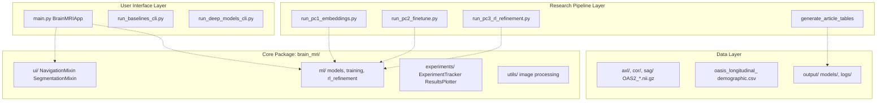
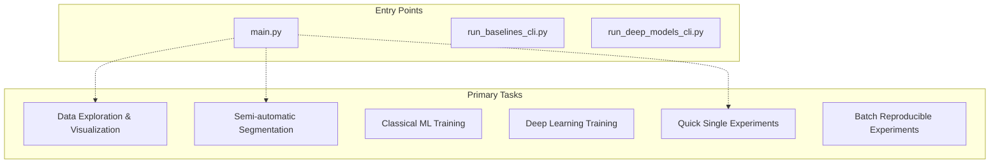
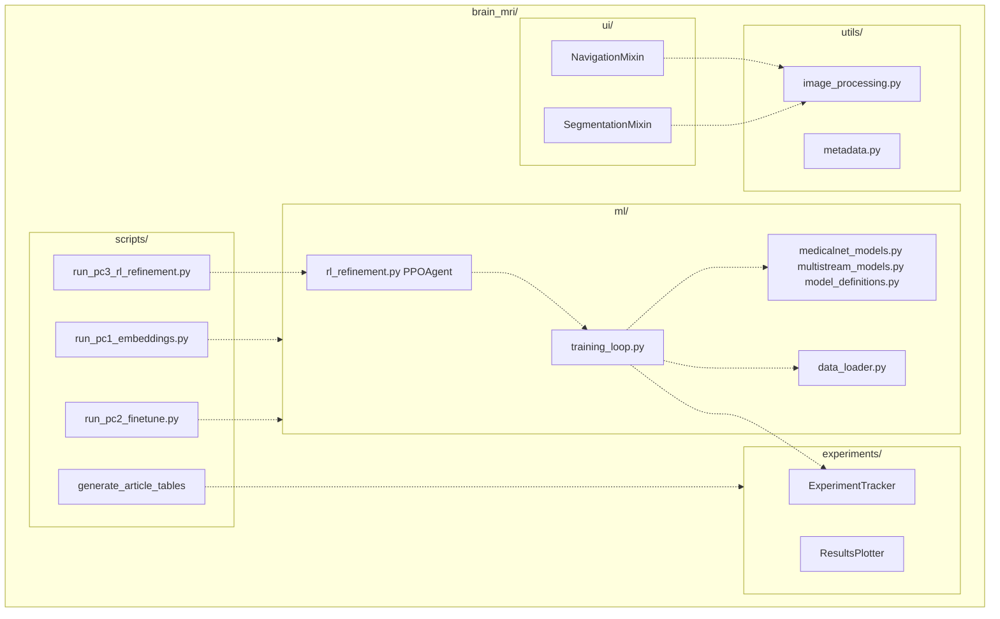
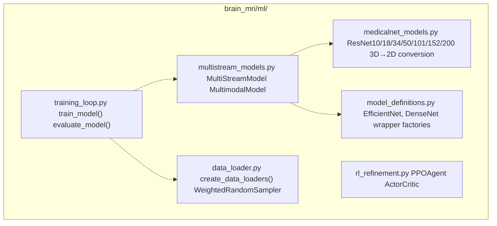
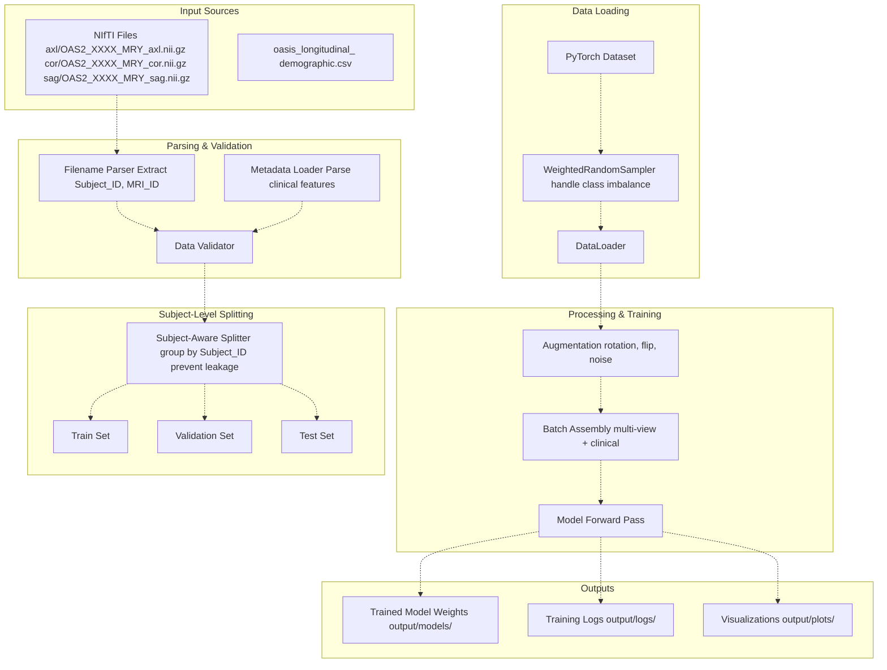
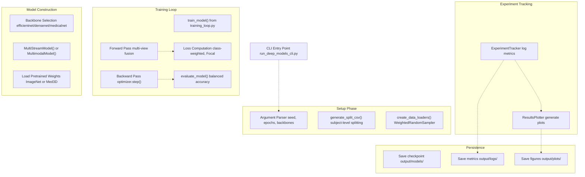
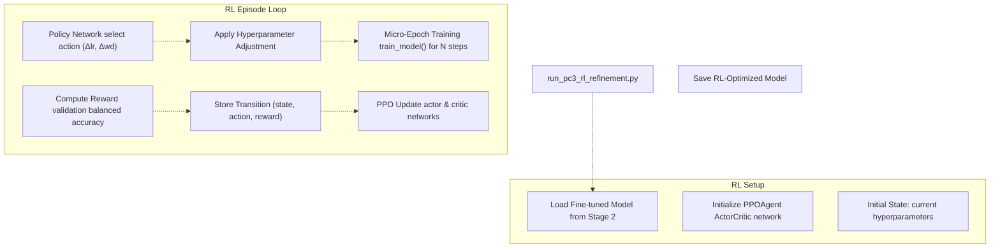

# System Architecture

> **Relevant source files**
> * [README.md](https://github.com/ThalesMMS/brain-mri-pipelines-py/blob/cd9d51a5/README.md)

## Purpose & Scope

This document presents the high-level architecture of the brain-mri-pipelines-py system, describing the organization of major components, their interactions, and the flow of data through the pipeline. It covers the system's layered design, entry points, core package structure, and integration patterns.

For detailed information about specific architectural patterns, see:

* Multi-stream multimodal network design: [#3.1](#3.1)
* Data processing and transformation pipeline: [#3.2](#3.2)
* Package organization and module responsibilities: [#3.3](#3.3)
* Subject-level data splitting implementation: [#3.4](#3.4)

For model-specific details, training procedures, and the three-stage research workflow, see [Models & Training](#5) and [Three-Stage Research Pipeline](#6).

## System Layers

The system is organized into four distinct layers that separate concerns and enable modular development:



**Sources:** [README.md L1-L218](https://github.com/ThalesMMS/brain-mri-pipelines-py/blob/cd9d51a5/README.md#L1-L218)

### Layer Responsibilities

| Layer | Purpose | Key Components |
| --- | --- | --- |
| **User Interface** | Provides multiple access patterns for users | `main.py`, `run_baselines_cli.py`, `run_deep_models_cli.py` |
| **Research Pipeline** | Implements three-stage experimental workflow | `run_pc1_embeddings.py`, `run_pc2_finetune.py`, `run_pc3_rl_refinement.py` |
| **Core Package** | Reusable modules for ML, UI, and utilities | `brain_mri/ml/`, `brain_mri/ui/`, `brain_mri/experiments/`, `brain_mri/utils/` |
| **Data** | Input datasets and output artifacts | `axl/`, `cor/`, `sag/`, CSV files, `output/` directory |

**Sources:** [README.md L177-L196](https://github.com/ThalesMMS/brain-mri-pipelines-py/blob/cd9d51a5/README.md#L177-L196)

## Entry Points

The system provides three main entry points, each designed for different use cases:



**Sources:** [README.md L83-L118](https://github.com/ThalesMMS/brain-mri-pipelines-py/blob/cd9d51a5/README.md#L83-L118)

### main.py - Interactive GUI

The graphical user interface is implemented in `main.py` using Tkinter. It instantiates the `BrainMRIApp` class which inherits from multiple mixins for modular functionality:

* **Navigation:** Browse MRI volumes, select subjects, mark non-viable studies
* **Segmentation:** Region-growing ventricle segmentation, descriptor extraction
* **Training:** Configure and execute single training runs
* **Visualization:** Slice viewing, overlay rendering, plot display

**Primary Use Cases:**

* Initial dataset exploration
* Visual quality assessment
* Manual segmentation tasks
* Rapid prototyping of model configurations

**Sources:** [README.md L83-L96](https://github.com/ThalesMMS/brain-mri-pipelines-py/blob/cd9d51a5/README.md#L83-L96)

### run_baselines_cli.py - Classical ML

Command-line interface for training classical machine learning models. This script:

1. Generates subject-aware train/validation/test split CSV
2. Trains SVM models with morphological descriptors
3. Trains XGBoost for age estimation
4. Tests two scenarios: with and without MMSE/CDR scores (to analyze target proxy leakage)

**Primary Use Cases:**

* Baseline performance benchmarking
* Reproducible headless execution
* Target leakage analysis

**Sources:** [README.md L98-L109](https://github.com/ThalesMMS/brain-mri-pipelines-py/blob/cd9d51a5/README.md#L98-L109)

### run_deep_models_cli.py - Deep Learning

Command-line interface for training deep learning models. Supports:

* Multiple backbones: `efficientnet`, `densenet`, `medicalnet`
* Multi-stream configuration (axial, coronal, sagittal planes)
* Multimodal fusion with clinical features
* Configurable hyperparameters via command-line arguments

Example invocations:

```
python run_deep_models_cli.py --seed 42 --epochs 40 --backbones efficientnet,medicalnet,densenetpython run_deep_models_cli.py --seed 42 --epochs 40 --backbones efficientnet --multimodal
```

**Sources:** [README.md L110-L118](https://github.com/ThalesMMS/brain-mri-pipelines-py/blob/cd9d51a5/README.md#L110-L118)

## Core Package Structure

The `brain_mri/` package contains the reusable modules that implement core functionality:



**Sources:** [README.md L177-L196](https://github.com/ThalesMMS/brain-mri-pipelines-py/blob/cd9d51a5/README.md#L177-L196)

### Module Responsibilities

| Module | Key Components | Purpose |
| --- | --- | --- |
| `ui/` | `NavigationMixin`, `SegmentationMixin` | Tkinter GUI functionality split into mixins |
| `ml/` | Model definitions, training loops, RL agent | Core machine learning implementations |
| `experiments/` | `ExperimentTracker`, `ResultsPlotter` | Experiment logging, metrics tracking, visualization |
| `utils/` | Image processing, metadata parsing | Utility functions for data handling |
| `scripts/` | Stage-specific runners | Three-stage research pipeline implementations |

**Sources:** [README.md L177-L196](https://github.com/ThalesMMS/brain-mri-pipelines-py/blob/cd9d51a5/README.md#L177-L196)

### Key Files in brain_mri/ml/



**Sources:** [README.md L184-L188](https://github.com/ThalesMMS/brain-mri-pipelines-py/blob/cd9d51a5/README.md#L184-L188)

The `ml/` directory centralizes all machine learning logic:

* **medicalnet_models.py:** Implements ResNet architectures with Med3D weight loading and mathematical 3D→2D kernel conversion
* **multistream_models.py:** Implements multi-view fusion logic, combining embeddings from multiple anatomical planes
* **model_definitions.py:** Factory functions for creating EfficientNet and DenseNet backbone instances
* **training_loop.py:** Core training and evaluation functions with class imbalance handling
* **rl_refinement.py:** PPO-based reinforcement learning agent for hyperparameter optimization
* **data_loader.py:** PyTorch DataLoader creation with subject-aware splitting

**Sources:** [README.md L184-L188](https://github.com/ThalesMMS/brain-mri-pipelines-py/blob/cd9d51a5/README.md#L184-L188)

## Data Flow Architecture

The following diagram illustrates how data flows from raw files through processing stages to final outputs:



**Sources:** [README.md L27-L50](https://github.com/ThalesMMS/brain-mri-pipelines-py/blob/cd9d51a5/README.md#L27-L50)

### Critical: Subject-Level Splitting

The system enforces **subject-level splitting** to prevent data leakage. The filename pattern `OAS2_XXXX_MRY_plane.nii.gz` is parsed to extract:

* **Subject_ID:** `OAS2_XXXX` (e.g., `OAS2_0001`)
* **MRI_ID:** `OAS2_XXXX_MRY` (e.g., `OAS2_0001_MR1`)

All scans from a single `Subject_ID` (which may include multiple `MRI_ID` values representing different timepoints) remain strictly within one partition (Train, Validation, or Test). This prevents the common pitfall where different timepoint scans from the same patient leak across splits.

**Sources:** [README.md L40-L49](https://github.com/ThalesMMS/brain-mri-pipelines-py/blob/cd9d51a5/README.md#L40-L49)

 [README.md L160-L174](https://github.com/ThalesMMS/brain-mri-pipelines-py/blob/cd9d51a5/README.md#L160-L174)

## Component Interaction Patterns

### Training Pipeline Integration

The following diagram shows how components interact during a typical training workflow:



**Sources:** [README.md L110-L118](https://github.com/ThalesMMS/brain-mri-pipelines-py/blob/cd9d51a5/README.md#L110-L118)

### RL Refinement Integration

The reinforcement learning refinement stage introduces a PPO agent that wraps the training process:



**Sources:** [README.md L142-L148](https://github.com/ThalesMMS/brain-mri-pipelines-py/blob/cd9d51a5/README.md#L142-L148)

 [README.md L17-L18](https://github.com/ThalesMMS/brain-mri-pipelines-py/blob/cd9d51a5/README.md#L17-L18)

The PPO agent treats hyperparameters (learning rate, weight decay) as actions that can be adjusted per micro-epoch. The validation balanced accuracy serves as the reward signal, creating an iterative optimization loop that refines the model beyond traditional hyperparameter tuning.

## Output Artifacts

The `output/` directory stores all generated artifacts:

| Subdirectory | Contents | Generated By |
| --- | --- | --- |
| `output/models/` | Trained model weights (`.pth` files) | `training_loop.py`, `rl_refinement.py` |
| `output/logs/` | Training metrics, experiment configs | `ExperimentTracker` |
| `output/plots/` | Loss curves, confusion matrices, ROC curves | `ResultsPlotter` |
| `output/tables/` | LaTeX tables for publication | `generate_article_tables` |

**Sources:** [README.md L37](https://github.com/ThalesMMS/brain-mri-pipelines-py/blob/cd9d51a5/README.md#L37-L37)

## System Extensibility

The architecture supports extension through several mechanisms:

1. **New Backbones:** Add model definitions to `brain_mri/ml/model_definitions.py` and register in `multistream_models.py`
2. **New Augmentations:** Extend augmentation pipeline in `data_loader.py`
3. **New Metrics:** Add metric computation to `evaluate_model()` in `training_loop.py`
4. **New RL Algorithms:** Replace `PPOAgent` in `rl_refinement.py` with alternative RL implementations
5. **New CLI Tools:** Create new scripts in `brain_mri/scripts/` following the PC1/PC2/PC3 pattern

**Sources:** [README.md L177-L196](https://github.com/ThalesMMS/brain-mri-pipelines-py/blob/cd9d51a5/README.md#L177-L196)

Refresh this wiki

Last indexed: 5 January 2026 ([cd9d51](https://github.com/ThalesMMS/brain-mri-pipelines-py/commit/cd9d51a5))

### On this page

* [System Architecture](#3-system-architecture)
* [Purpose & Scope](#3-purpose-scope)
* [System Layers](#3-system-layers)
* [Layer Responsibilities](#3-layer-responsibilities)
* [Entry Points](#3-entry-points)
* [main.py - Interactive GUI](#3-mainpy---interactive-gui)
* [run_baselines_cli.py - Classical ML](#3-run_baselines_clipy---classical-ml)
* [run_deep_models_cli.py - Deep Learning](#3-run_deep_models_clipy---deep-learning)
* [Core Package Structure](#3-core-package-structure)
* [Module Responsibilities](#3-module-responsibilities)
* [Key Files in brain_mri/ml/](#3-key-files-in-brain_mriml)
* [Data Flow Architecture](#3-data-flow-architecture)
* [Critical: Subject-Level Splitting](#3-critical-subject-level-splitting)
* [Component Interaction Patterns](#3-component-interaction-patterns)
* [Training Pipeline Integration](#3-training-pipeline-integration)
* [RL Refinement Integration](#3-rl-refinement-integration)
* [Output Artifacts](#3-output-artifacts)
* [System Extensibility](#3-system-extensibility)

Ask Devin about brain-mri-pipelines-py