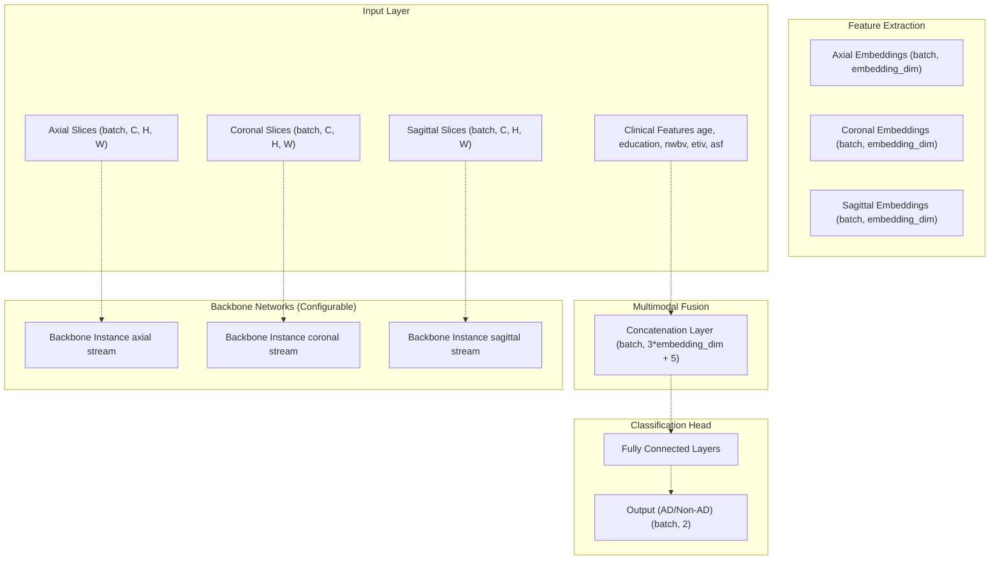
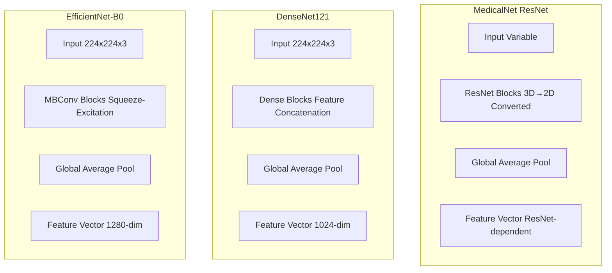
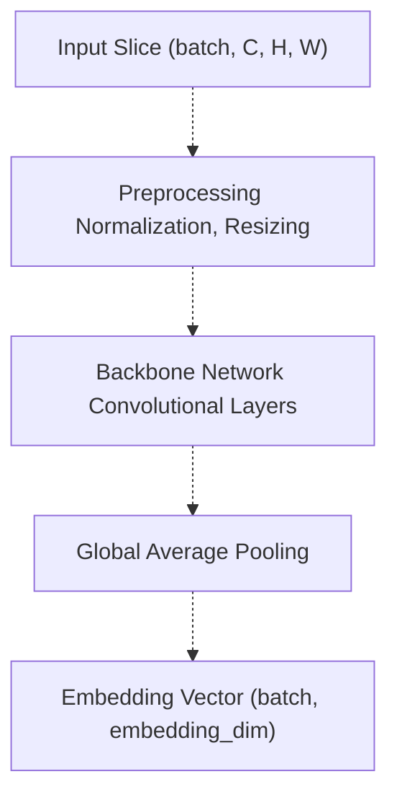
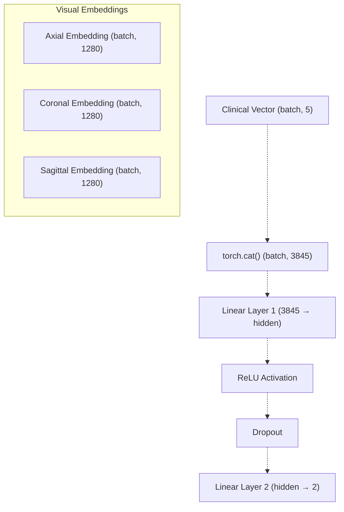
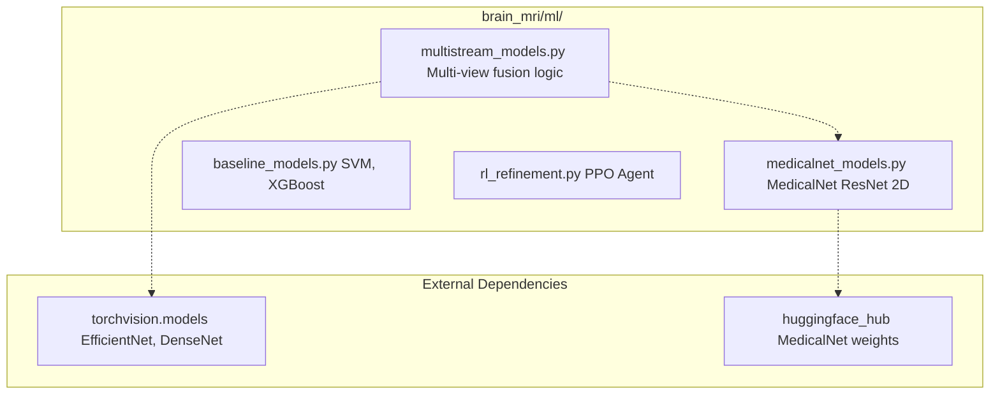
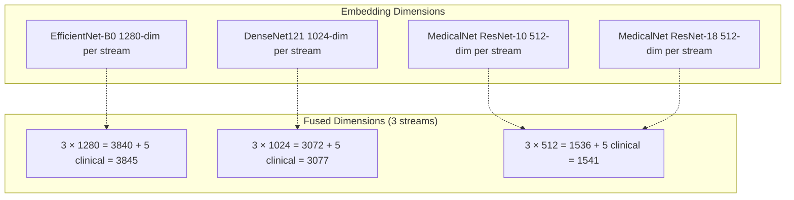
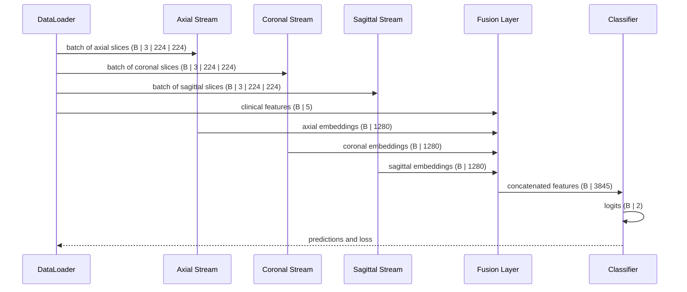

# Multi-Stream Multimodal Network

> **Relevant source files**
> * [README.md](https://github.com/ThalesMMS/brain-mri-pipelines-py/blob/cd9d51a5/README.md)
> * [axl/OAS2_0001_MR1_axl.nii.gz](https://github.com/ThalesMMS/brain-mri-pipelines-py/blob/cd9d51a5/axl/OAS2_0001_MR1_axl.nii.gz)

## Purpose and Scope

This document describes the core deep learning architecture used for Alzheimer's disease classification in the brain-mri-pipelines-py system. The Multi-Stream Multimodal Network processes MRI scans from three anatomical planes simultaneously and fuses the resulting visual embeddings with clinical tabular features to produce a binary AD/Non-AD classification.

For information about the training procedures and hyperparameters used with this architecture, see [Training Configuration](5d%20Training-Configuration.md). For details on classical machine learning baselines that do not use this architecture, see [Classical Machine Learning Baselines](5c%20Stage-3-RL-Hyperparameter-Refinement-%28run_pc3_rl_refinement.py%29.md). For the specific MedicalNet backbone integration, see [MedicalNet Integration & 3D→2D Conversion](5b%20MedicalNet-Integration-&-3D→2D-Conversion.md).

---

## Architecture Overview

The Multi-Stream Multimodal Network implements a parallel processing strategy where each anatomical view (axial, coronal, sagittal) is processed through an independent deep learning backbone. The system supports flexible configuration of backbones and can operate in single-stream, multi-stream, or multimodal modes.



**Sources:** [README.md L3-L15](https://github.com/ThalesMMS/brain-mri-pipelines-py/blob/cd9d51a5/README.md#L3-L15)

 **Sources**: [Project overview and setup](https://github.com/ThalesMMS/brain-mri-pipelines-py/blob/cd9d51a5/README.md#L185-L188)

---

## Input Streams

### Anatomical Plane Organization

The network accepts three independent input streams corresponding to standard MRI anatomical views:

| Stream | Plane | Directory | Purpose |
| --- | --- | --- | --- |
| Stream 1 | Axial | `axl/` | Horizontal slices (required for GUI) |
| Stream 2 | Coronal | `cor/` | Vertical slices (front-to-back) |
| Stream 3 | Sagittal | `sag/` | Vertical slices (left-to-right) |

Each stream processes 2D slices independently. The system is designed to handle flexible stream configurations:

* **Single-stream mode:** Only one anatomical plane (e.g., axial only)
* **Multi-stream mode:** Two or three anatomical planes without clinical features
* **Multimodal mode:** All three planes plus clinical tabular data

### Input Tensor Specifications

Each input stream expects tensors with shape `(batch_size, channels, height, width)`:

* **Channels:** Typically 1 for grayscale MRI, can be 3 if converted to RGB for ImageNet-pretrained backbones
* **Height/Width:** Determined by data loading pipeline, typically resized to backbone input requirements (e.g., 224×224 for EfficientNet/DenseNet)

**Sources:** [README.md L32-L38](https://github.com/ThalesMMS/brain-mri-pipelines-py/blob/cd9d51a5/README.md#L32-L38)

 [README.md L10-L12](https://github.com/ThalesMMS/brain-mri-pipelines-py/blob/cd9d51a5/README.md#L10-L12)

---

## Backbone Network Options

The system supports three interchangeable backbone architectures, each instantiated per stream. The backbone choice is specified via command-line arguments or GUI configuration.

### Supported Backbones



| Backbone | Pretraining Source | Embedding Dimension | Key Characteristics |
| --- | --- | --- | --- |
| `efficientnet` | ImageNet | 1280 | Efficient scaling, compound scaling method |
| `densenet` | ImageNet | 1024 | Dense connections, feature reuse |
| `medicalnet` | Med3D (23 medical datasets) | Varies by ResNet depth | Medical domain knowledge, 3D→2D kernel conversion |

### Backbone Selection

Command-line example:

```
python run_deep_models_cli.py --backbones efficientnet,medicalnet,densenet
```

Each specified backbone is trained separately with identical data splits and hyperparameters.

**Sources:** [README.md L11](https://github.com/ThalesMMS/brain-mri-pipelines-py/blob/cd9d51a5/README.md#L11-L11)

 **Sources**: [Project overview and setup](https://github.com/ThalesMMS/brain-mri-pipelines-py/blob/cd9d51a5/README.md#L113-L117)

 **Sources**: [Project overview and setup](https://github.com/ThalesMMS/brain-mri-pipelines-py/blob/cd9d51a5/README.md#L171-L173)

---

## Feature Extraction Pipeline

### Per-Stream Processing

Each stream processes its input through the following pipeline:



### Embedding Extraction

The backbone networks are typically used as feature extractors by:

1. Removing the original classification head
2. Extracting features before the final fully connected layer
3. Applying global average pooling if not already present
4. Producing fixed-size embedding vectors

For transfer learning scenarios, backbones can be frozen or unfrozen:

* **Frozen mode:** Backbone weights are fixed, only classification head is trained (warmup phase)
* **Unfrozen mode:** All layers are fine-tuned end-to-end

**Sources:** [Project overview and setup](https://github.com/ThalesMMS/brain-mri-pipelines-py/blob/cd9d51a5/README.md#L135-L140)

 [brain_mri/ml/multistream_models.py](https://github.com/ThalesMMS/brain-mri-pipelines-py/blob/cd9d51a5/brain_mri/ml/multistream_models.py)

---

## Multimodal Fusion Layer

### Clinical Feature Integration

The multimodal variant of the network concatenates visual embeddings with clinical tabular features before classification.

**Clinical Features (5 features):**

| Feature | Description | Type | Example Range |
| --- | --- | --- | --- |
| `age` | Patient age at scan | Continuous | 60-96 years |
| `education` | Years of education | Continuous | 6-23 years |
| `nwbv` | Normalized whole brain volume | Continuous | 0.6-0.8 |
| `etiv` | Estimated total intracranial volume | Continuous | 1100-2000 cm³ |
| `asf` | Atlas scaling factor | Continuous | 0.8-1.3 |

### Fusion Architecture



**Concatenation Details:**

* All three stream embeddings are concatenated along the feature dimension
* Clinical features are appended as a 5-dimensional vector
* Total fused feature dimension: `3 × embedding_dim + 5`
* For EfficientNet: `3 × 1280 + 5 = 3845` features

**Sources:** [README.md L12](https://github.com/ThalesMMS/brain-mri-pipelines-py/blob/cd9d51a5/README.md#L12-L12)

 **Sources**: [Project overview and setup](https://github.com/ThalesMMS/brain-mri-pipelines-py/blob/cd9d51a5/README.md#L117-L117)

 [oasis_longitudinal_demographic.csv header](https://github.com/ThalesMMS/brain-mri-pipelines-py/blob/cd9d51a5/oasis_longitudinal_demographic.csv header)

---

## Classification Head

### Final Layer Architecture

The classification head consists of fully connected layers that map the fused feature vector to binary class probabilities.

**Standard Configuration:**

* Input: Fused feature vector `(batch_size, fused_dim)`
* Hidden layer: Typically `fused_dim // 2` with ReLU activation
* Dropout: Applied for regularization (commonly 0.5)
* Output layer: 2 units (AD class, Non-AD class)
* Final activation: Softmax (applied implicitly in loss function)

### Output Interpretation

The network produces logits for two classes:

* **Class 0:** Non-demented / Cognitively normal
* **Class 1:** Demented / Alzheimer's disease

During training, class-weighted Cross Entropy Loss or Focal Loss is applied to handle class imbalance. During inference, `argmax` is applied to produce the final prediction.

**Sources:** [Project overview and setup](https://github.com/ThalesMMS/brain-mri-pipelines-py/blob/cd9d51a5/README.md#L164-L167)

---

## Implementation Code Structure

### Key Modules and Classes



### Module Responsibilities

| Module | File Path | Key Classes/Functions | Purpose |
| --- | --- | --- | --- |
| Multi-stream models | `brain_mri/ml/multistream_models.py` | Multi-view architecture | Implements parallel stream processing and fusion |
| MedicalNet models | `brain_mri/ml/medicalnet_models.py` | 2D ResNet variants | Provides Med3D-pretrained backbones with 3D→2D conversion |
| Training loop | `brain_mri/ml/` (training modules) | Training functions | Handles forward/backward passes, optimization |
| Data loading | `brain_mri/utils/` | Dataset classes | Loads and preprocesses multi-view MRI data |

**Sources:** [Project overview and setup](https://github.com/ThalesMMS/brain-mri-pipelines-py/blob/cd9d51a5/README.md#L181-L196)

 [brain_mri/ml/multistream_models.py](https://github.com/ThalesMMS/brain-mri-pipelines-py/blob/cd9d51a5/brain_mri/ml/multistream_models.py)

 [brain_mri/ml/medicalnet_models.py](https://github.com/ThalesMMS/brain-mri-pipelines-py/blob/cd9d51a5/brain_mri/ml/medicalnet_models.py)

---

## Training Configuration Modes

### Stream Configuration Options

The network supports flexible stream configurations specified at runtime:

**Single-Stream:**

```
# Axial onlypython run_deep_models_cli.py --planes axl
```

**Multi-Stream:**

```
# All three planes, no clinical datapython run_deep_models_cli.py --planes axl,cor,sag
```

**Multimodal:**

```
# All three planes + clinical featurespython run_deep_models_cli.py --planes axl,cor,sag --multimodal
```

### Backbone Per-Stream Independence

Each stream uses an independent instance of the chosen backbone network:

* **No weight sharing:** Axial, coronal, and sagittal streams have separate trainable parameters
* **Independent initialization:** Each stream is initialized from the same pretrained weights but diverges during training
* **Rationale:** Different anatomical planes contain distinct spatial patterns that benefit from specialized feature extractors

**Sources:** [Project overview and setup](https://github.com/ThalesMMS/brain-mri-pipelines-py/blob/cd9d51a5/README.md#L113-L117)

 [run_deep_models_cli.py](https://github.com/ThalesMMS/brain-mri-pipelines-py/blob/cd9d51a5/run_deep_models_cli.py)

---

## Feature Embedding Dimensionality

### Backbone-Specific Dimensions

The embedding dimension depends on the backbone architecture:



**Design Consideration:** Smaller embedding dimensions (MedicalNet) result in more compact fused representations, which can improve training efficiency and reduce overfitting risk on small medical datasets.

**Sources:** [README.md L11](https://github.com/ThalesMMS/brain-mri-pipelines-py/blob/cd9d51a5/README.md#L11-L11)

 [brain_mri/ml/medicalnet_models.py](https://github.com/ThalesMMS/brain-mri-pipelines-py/blob/cd9d51a5/brain_mri/ml/medicalnet_models.py)

---

## Integration with Training Pipeline

### Two-Phase Transfer Learning

The Multi-Stream Multimodal Network is typically trained using a two-phase approach:

**Phase 1: Warmup (Frozen Backbone)**

* Backbone weights are frozen
* Only classification head is trained
* Duration: 2-5 epochs
* Purpose: Initialize classification layers with stable features

**Phase 2: Fine-tuning (Unfrozen Backbone)**

* All layers are trainable
* End-to-end optimization
* Duration: Remaining epochs
* Purpose: Adapt backbone to medical imaging domain

### RL-Based Hyperparameter Optimization

The network can be further refined using PPO-based reinforcement learning that adjusts learning rate and weight decay dynamically per micro-epoch.

**Sources:** [Project overview and setup](https://github.com/ThalesMMS/brain-mri-pipelines-py/blob/cd9d51a5/README.md#L135-L140)

 **Sources**: [Project overview and setup](https://github.com/ThalesMMS/brain-mri-pipelines-py/blob/cd9d51a5/README.md#L142-L148)

 [brain_mri/scripts/run_pc2_finetune.py](https://github.com/ThalesMMS/brain-mri-pipelines-py/blob/cd9d51a5/brain_mri/scripts/run_pc2_finetune.py)

---

## Model Comparison Framework

### Architecture Variants Evaluated

The system enables systematic comparison of different architectural configurations:

| Variant | Streams | Clinical Data | Example Command |
| --- | --- | --- | --- |
| Single-stream | 1 (axial) | No | `--planes axl` |
| Multi-stream | 3 (all) | No | `--planes axl,cor,sag` |
| Multimodal | 3 (all) | Yes | `--planes axl,cor,sag --multimodal` |

### Performance Metrics

All variants are evaluated using:

* **Primary:** Balanced Accuracy (handles class imbalance)
* **Secondary:** Precision, Recall, F1-Score, AUC-ROC
* **Statistical significance:** Wilcoxon signed-rank tests across random seeds

**Sources:** [Project overview and setup](https://github.com/ThalesMMS/brain-mri-pipelines-py/blob/cd9d51a5/README.md#L163-L169)

 [brain_mri/scripts/generate_article_tables.py](https://github.com/ThalesMMS/brain-mri-pipelines-py/blob/cd9d51a5/brain_mri/scripts/generate_article_tables.py)

---

## Data Flow Example

### Complete Forward Pass



**Batch Processing:**

* **B:** Batch size (typically 16-32)
* **Parallel processing:** All three streams execute concurrently (GPU-accelerated)
* **Memory efficiency:** Gradients are checkpointed for large batches

**Sources:** [brain_mri/ml/multistream_models.py](https://github.com/ThalesMMS/brain-mri-pipelines-py/blob/cd9d51a5/brain_mri/ml/multistream_models.py)

 [run_deep_models_cli.py](https://github.com/ThalesMMS/brain-mri-pipelines-py/blob/cd9d51a5/run_deep_models_cli.py)


### On this page

* [Multi-Stream Multimodal Network](#3.1-multi-stream-multimodal-network)
* [Purpose and Scope](#3.1-purpose-and-scope)
* [Architecture Overview](#3.1-architecture-overview)
* [Input Streams](#3.1-input-streams)
* [Anatomical Plane Organization](#3.1-anatomical-plane-organization)
* [Input Tensor Specifications](#3.1-input-tensor-specifications)
* [Backbone Network Options](#3.1-backbone-network-options)
* [Supported Backbones](#3.1-supported-backbones)
* [Backbone Selection](#3.1-backbone-selection)
* [Feature Extraction Pipeline](#3.1-feature-extraction-pipeline)
* [Per-Stream Processing](#3.1-per-stream-processing)
* [Embedding Extraction](#3.1-embedding-extraction)
* [Multimodal Fusion Layer](#3.1-multimodal-fusion-layer)
* [Clinical Feature Integration](#3.1-clinical-feature-integration)
* [Fusion Architecture](#3.1-fusion-architecture)
* [Classification Head](#3.1-classification-head)
* [Final Layer Architecture](#3.1-final-layer-architecture)
* [Output Interpretation](#3.1-output-interpretation)
* [Implementation Code Structure](#3.1-implementation-code-structure)
* [Key Modules and Classes](#3.1-key-modules-and-classes)
* [Module Responsibilities](#3.1-module-responsibilities)
* [Training Configuration Modes](#3.1-training-configuration-modes)
* [Stream Configuration Options](#3.1-stream-configuration-options)
* [Backbone Per-Stream Independence](#3.1-backbone-per-stream-independence)
* [Feature Embedding Dimensionality](#3.1-feature-embedding-dimensionality)
* [Backbone-Specific Dimensions](#3.1-backbone-specific-dimensions)
* [Integration with Training Pipeline](#3.1-integration-with-training-pipeline)
* [Two-Phase Transfer Learning](#3.1-two-phase-transfer-learning)
* [RL-Based Hyperparameter Optimization](#3.1-rl-based-hyperparameter-optimization)
* [Model Comparison Framework](#3.1-model-comparison-framework)
* [Architecture Variants Evaluated](#3.1-architecture-variants-evaluated)
* [Performance Metrics](#3.1-performance-metrics)
* [Data Flow Example](#3.1-data-flow-example)
* [Complete Forward Pass](#3.1-complete-forward-pass)

Ask Devin about brain-mri-pipelines-py