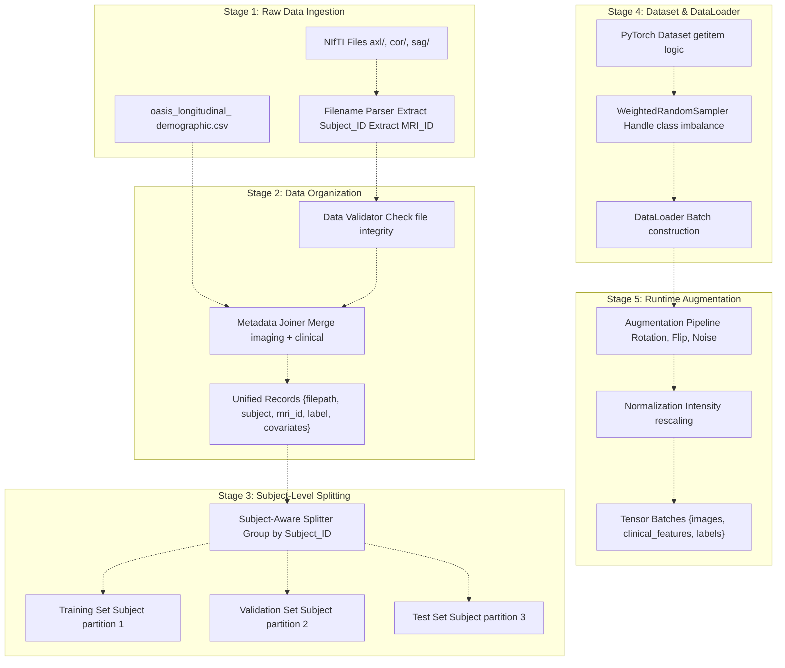
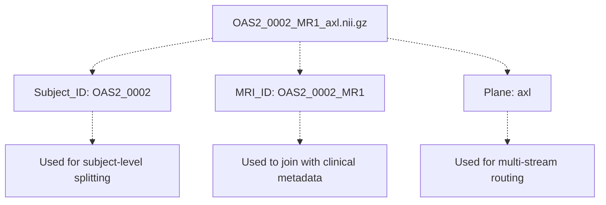
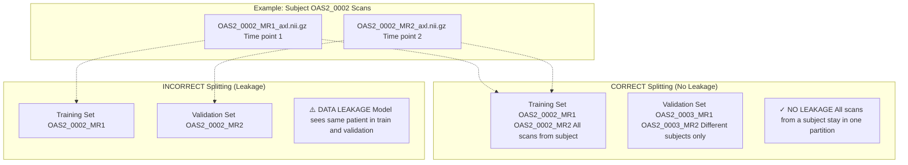
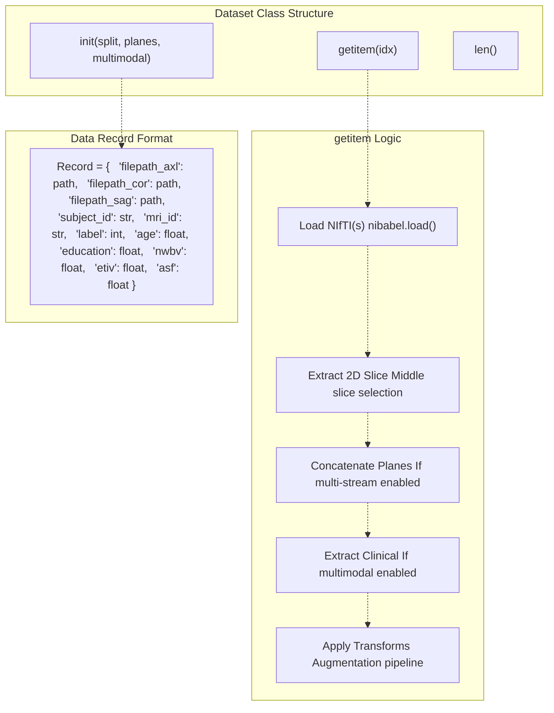
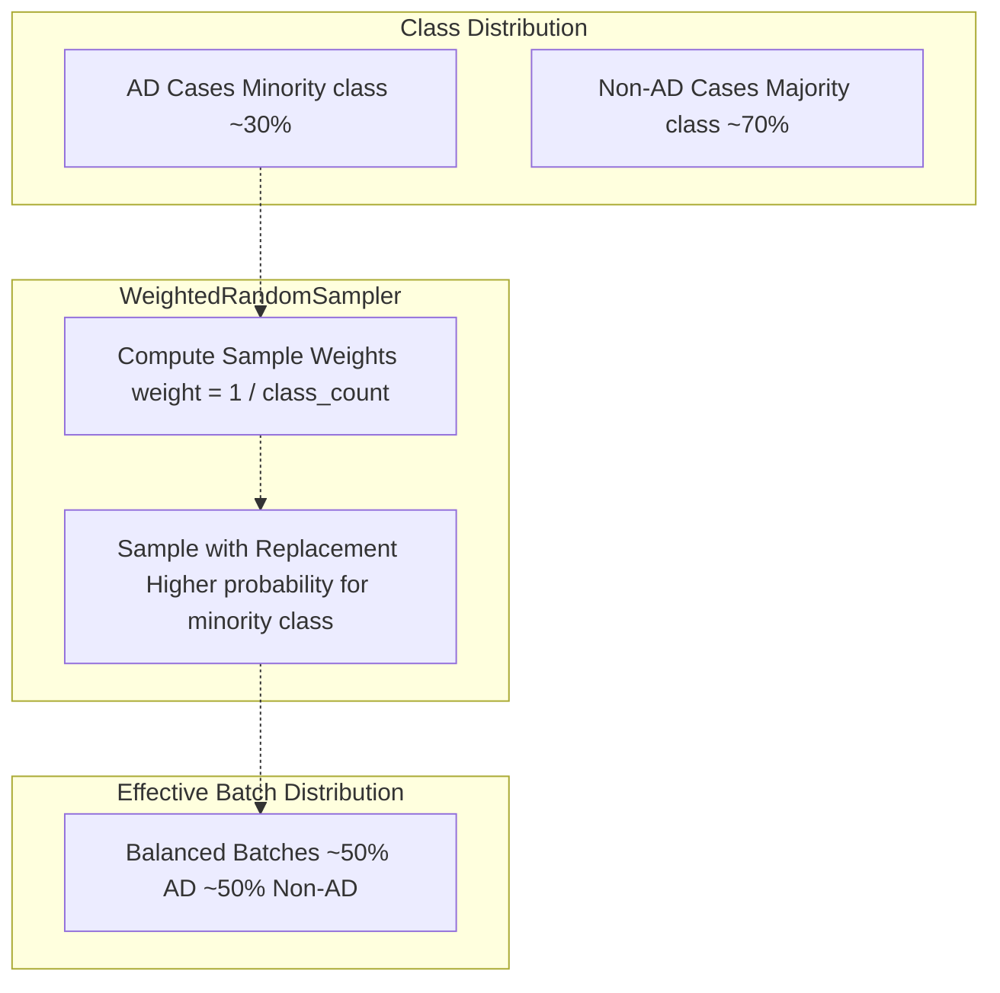
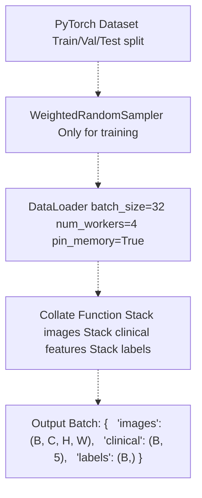
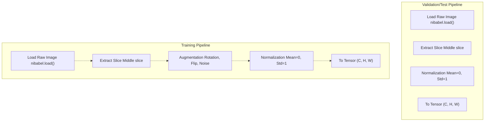
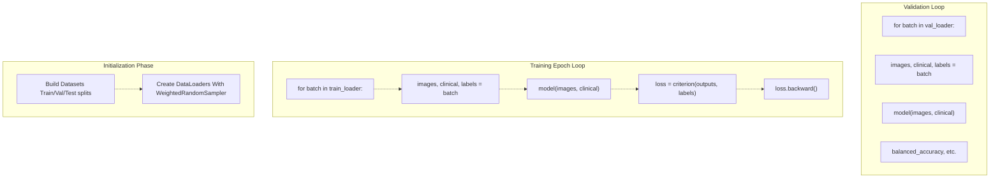
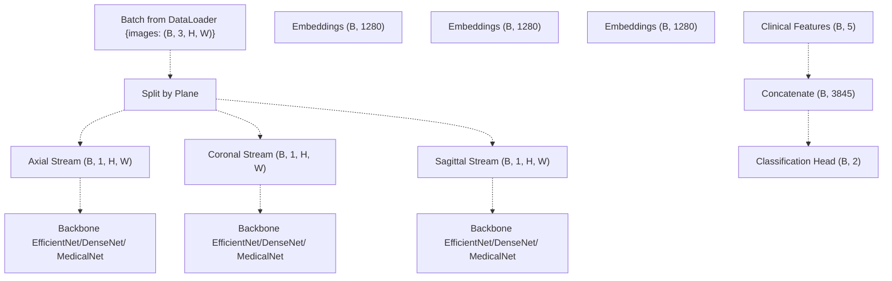
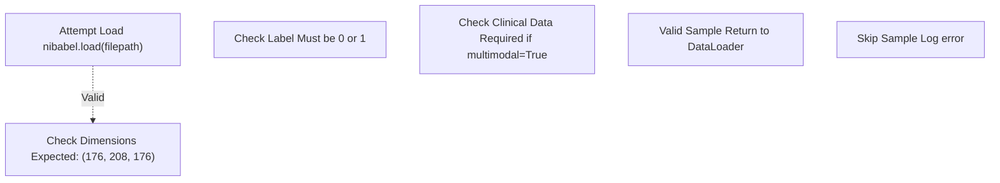

# Data Processing Pipeline

> **Relevant source files**
> * [README.md](https://github.com/ThalesMMS/brain-mri-pipelines-py/blob/cd9d51a5/README.md)
> * [axl/OAS2_0002_MR1_axl.nii.gz](https://github.com/ThalesMMS/brain-mri-pipelines-py/blob/cd9d51a5/axl/OAS2_0002_MR1_axl.nii.gz)
> * [axl/OAS2_0002_MR2_axl.nii.gz](https://github.com/ThalesMMS/brain-mri-pipelines-py/blob/cd9d51a5/axl/OAS2_0002_MR2_axl.nii.gz)

This document describes the end-to-end data processing pipeline that transforms raw NIfTI neuroimaging files into training-ready batches. The pipeline encompasses file parsing, clinical metadata integration, subject-aware splitting, dataset construction, data loading, and augmentation.

For architectural details about the multi-stream network that consumes this data, see [Multi-Stream Multimodal Network](3a%20Multi-Stream-Multimodal-Network.md). For the critical subject-level splitting mechanism that prevents data leakage, see [Subject-Level Splitting & Leakage Prevention](3d%20Subject-Level-Splitting-&-Leakage-Prevention.md). For comprehensive dataset documentation, see [Data Layer](4%20Data-Layer.md).

**Sources:** README.md

---

## Pipeline Overview

The data processing pipeline operates in distinct stages, each with specific responsibilities for transforming raw medical imaging data into model-ready tensors.

**Sources:** README.md

 **Sources**: [Project overview and setup](https://github.com/ThalesMMS/brain-mri-pipelines-py/blob/cd9d51a5/README.md#L160-L169)

---

## Data Ingestion & File Parsing

### Filename Convention

The pipeline relies on a strict naming convention to extract metadata from filenames:

| Component | Pattern | Example | Description |
| --- | --- | --- | --- |
| **Subject ID** | `OAS2_XXXX` | `OAS2_0001` | Unique patient identifier |
| **MRI ID** | `OAS2_XXXX_MRY` | `OAS2_0001_MR1` | Specific scan identifier (Y = time point) |
| **Plane** | `{axl,cor,sag}` | `axl` | Anatomical plane |
| **Extension** | `.nii.gz` or `.nii` | `.nii.gz` | Compressed NIfTI format |

**Full Pattern:** `OAS2_XXXX_MRY_{axl,cor,sag}.nii.gz`

**Sources:** README.md

### Clinical Metadata Integration

The pipeline joins imaging files with tabular clinical data from `oasis_longitudinal_demographic.csv`:

| Clinical Feature | Type | Description |
| --- | --- | --- |
| **Subject ID** | String | Join key to imaging data |
| **MRI ID** | String | Specific scan identifier |
| **Age** | Numeric | Patient age at scan time |
| **Education** | Numeric | Years of education |
| **nWBV** | Numeric | Normalized whole-brain volume |
| **eTIV** | Numeric | Estimated total intracranial volume |
| **ASF** | Numeric | Atlas scaling factor |
| **CDR** | Numeric | Clinical Dementia Rating (target proxy) |
| **MMSE** | Numeric | Mini-Mental State Examination (target proxy) |

**Sources:** [README.md L36](https://github.com/ThalesMMS/brain-mri-pipelines-py/blob/cd9d51a5/README.md#L36-L36)

 **Sources**: [Project overview and setup](https://github.com/ThalesMMS/brain-mri-pipelines-py/blob/cd9d51a5/README.md#L106-L108)

---

## Subject-Level Splitting Strategy

The pipeline implements **strict subject-level partitioning** to prevent data leakage. This is critical because the OASIS-2 dataset contains longitudinal scans (multiple MRI sessions per patient over time).

### Splitting Algorithm

1. **Group by Subject_ID**: All scans are grouped by `OAS2_XXXX`
2. **Partition subjects**: Subjects (not scans) are split into Train/Val/Test
3. **Assign scans**: All MRI sessions from a subject go to the same partition

**Sources:** [README.md L23](https://github.com/ThalesMMS/brain-mri-pipelines-py/blob/cd9d51a5/README.md#L23-L23)

 **Sources**: [Project overview and setup](https://github.com/ThalesMMS/brain-mri-pipelines-py/blob/cd9d51a5/README.md#L160-L169)

---

## Dataset Construction

The pipeline constructs PyTorch `Dataset` objects that handle lazy loading and multi-view data assembly.

### Multi-Stream Data Loading

When multiple anatomical planes are enabled, the dataset loads and stacks images from `axl/`, `cor/`, and `sag/` directories:

| Configuration | Planes Loaded | Output Shape |
| --- | --- | --- |
| **Single-stream** | Axial only | `(1, H, W)` |
| **Multi-stream** | Axial + Coronal + Sagittal | `(3, H, W)` |
| **Multimodal** | Multi-stream + Clinical features | Images: `(3, H, W)`Clinical: `(5,)` |

**Sources:** [README.md L10-L15](https://github.com/ThalesMMS/brain-mri-pipelines-py/blob/cd9d51a5/README.md#L10-L15)

 **Sources**: [Project overview and setup](https://github.com/ThalesMMS/brain-mri-pipelines-py/blob/cd9d51a5/README.md#L112-L118)

---

## Data Loading & Class Imbalance Handling

### WeightedRandomSampler

The pipeline uses PyTorch's `WeightedRandomSampler` to address severe class imbalance in Alzheimer's detection (more non-AD than AD cases):

### DataLoader Configuration

**Sources:** [Project overview and setup](https://github.com/ThalesMMS/brain-mri-pipelines-py/blob/cd9d51a5/README.md#L164-L166)

---

## Augmentation Pipeline

Data augmentation is applied **during training only** (not validation/test) to increase dataset diversity and prevent overfitting.

### Augmentation Operations

| Transform | Parameters | Purpose |
| --- | --- | --- |
| **Random Rotation** | `±15°` | Simulate patient positioning variance |
| **Random Horizontal Flip** | `p=0.5` | Exploit left-right symmetry |
| **Random Vertical Flip** | `p=0.5` | Increase spatial diversity |
| **Gaussian Noise** | `σ=0.01` | Simulate scanner noise |
| **Intensity Scaling** | `[0.9, 1.1]` | Simulate scanner calibration variance |

**Sources:** [Project overview and setup](https://github.com/ThalesMMS/brain-mri-pipelines-py/blob/cd9d51a5/README.md#L164-L166)

---

## Pipeline Integration Points

### Training Loop Integration

The data processing pipeline integrates with the training loop through the following interfaces:

### Multi-Stream Model Input

For multi-stream architectures, the pipeline prepares separate data paths for each anatomical plane:

**Sources:** [README.md L10-L15](https://github.com/ThalesMMS/brain-mri-pipelines-py/blob/cd9d51a5/README.md#L10-L15)

---

## Data Validation & Error Handling

The pipeline includes validation steps to ensure data integrity:

| Validation Check | Action on Failure |
| --- | --- |
| **NIfTI file exists** | Skip sample, log warning |
| **File can be loaded** | Skip sample, log error |
| **Expected dimensions** | Skip sample, log error |
| **Subject_ID matches** | Skip sample, log error |
| **Clinical data available** | Use default values or skip |
| **Label is valid** | Skip sample, log error |

**Sources:** README.md

---

## Performance Optimizations

### Caching Strategy

The pipeline does not implement explicit caching of loaded images due to memory constraints. Each `__getitem__` call loads data from disk. For faster experimentation, users can:

1. Store data on SSD rather than HDD
2. Use `pin_memory=True` in DataLoader
3. Increase `num_workers` for parallel loading
4. Pre-process data to a faster format (not implemented)

### Memory Management

| Configuration | Memory Usage | Speed |
| --- | --- | --- |
| `num_workers=0` | Low (sequential) | Slowest |
| `num_workers=4` | Medium (parallel) | Faster |
| `pin_memory=True` | Higher (CUDA pinned) | Fastest for GPU |
| `prefetch_factor=2` | Higher (pre-fetch) | Reduced waiting |

**Sources:** README.md

 **Sources**: [Project overview and setup](https://github.com/ThalesMMS/brain-mri-pipelines-py/blob/cd9d51a5/README.md#L160-L169)

---

## Summary: Pipeline Stages

The complete data processing pipeline can be summarized in these stages:

1. **Ingestion**: Parse NIfTI filenames → Extract Subject_ID, MRI_ID, Plane
2. **Integration**: Join imaging paths with clinical metadata from CSV
3. **Validation**: Check file integrity, label validity, dimension correctness
4. **Splitting**: Group by Subject_ID → Partition subjects into Train/Val/Test
5. **Dataset**: Construct PyTorch `Dataset` with `__getitem__` for lazy loading
6. **Sampling**: Apply `WeightedRandomSampler` to training set (class balance)
7. **Loading**: Create `DataLoader` with batching and multi-worker parallelism
8. **Augmentation**: Apply transforms during training (rotation, flip, noise)
9. **Normalization**: Standardize intensity values (mean=0, std=1)
10. **Delivery**: Yield batches to training loop as `{images, clinical, labels}`

This pipeline ensures rigorous data handling with emphasis on preventing leakage through subject-level splitting, addressing class imbalance through weighted sampling, and supporting flexible multi-stream, multimodal architectures.

**Sources:** README.md

### On this page

* [Data Processing Pipeline](#3.2-data-processing-pipeline)
* [Pipeline Overview](#3.2-pipeline-overview)
* [Data Ingestion & File Parsing](#3.2-data-ingestion-file-parsing)
* [Filename Convention](#3.2-filename-convention)
* [Clinical Metadata Integration](#3.2-clinical-metadata-integration)
* [Subject-Level Splitting Strategy](#3.2-subject-level-splitting-strategy)
* [Splitting Algorithm](#3.2-splitting-algorithm)
* [Dataset Construction](#3.2-dataset-construction)
* [Multi-Stream Data Loading](#3.2-multi-stream-data-loading)
* [Data Loading & Class Imbalance Handling](#3.2-data-loading-class-imbalance-handling)
* [WeightedRandomSampler](#3.2-weightedrandomsampler)
* [DataLoader Configuration](#3.2-dataloader-configuration)
* [Augmentation Pipeline](#3.2-augmentation-pipeline)
* [Augmentation Operations](#3.2-augmentation-operations)
* [Pipeline Integration Points](#3.2-pipeline-integration-points)
* [Training Loop Integration](#3.2-training-loop-integration)
* [Multi-Stream Model Input](#3.2-multi-stream-model-input)
* [Data Validation & Error Handling](#3.2-data-validation-error-handling)
* [Performance Optimizations](#3.2-performance-optimizations)
* [Caching Strategy](#3.2-caching-strategy)
* [Memory Management](#3.2-memory-management)
* [Summary: Pipeline Stages](#3.2-summary-pipeline-stages)

Ask Devin about brain-mri-pipelines-py