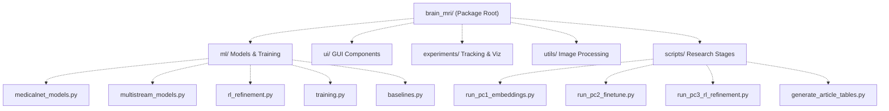
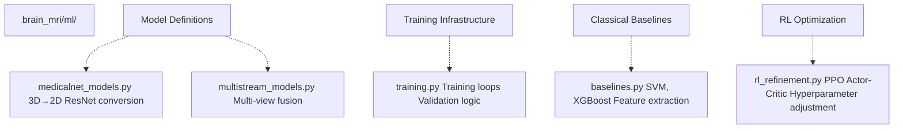
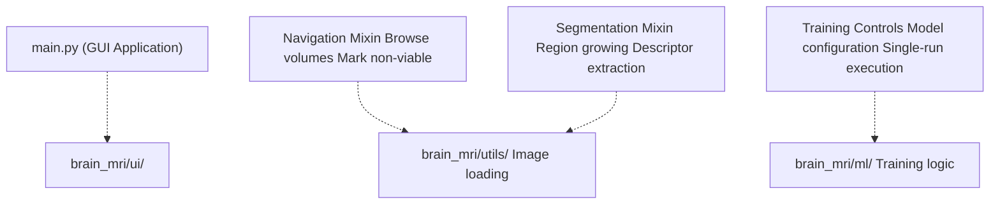
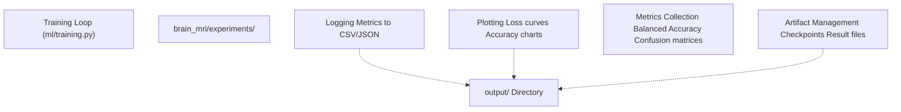
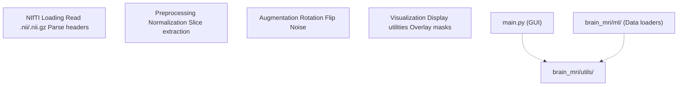
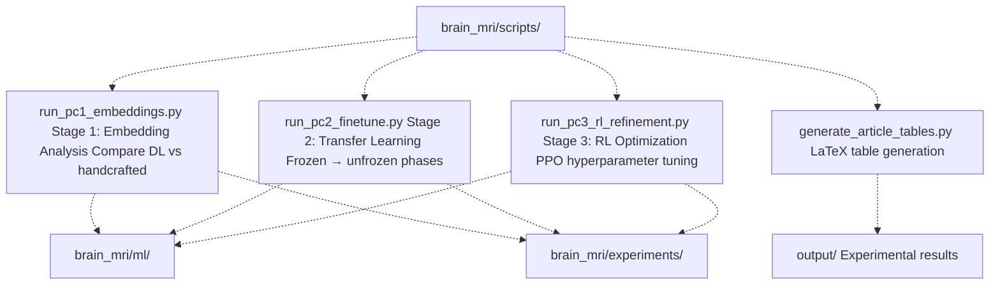
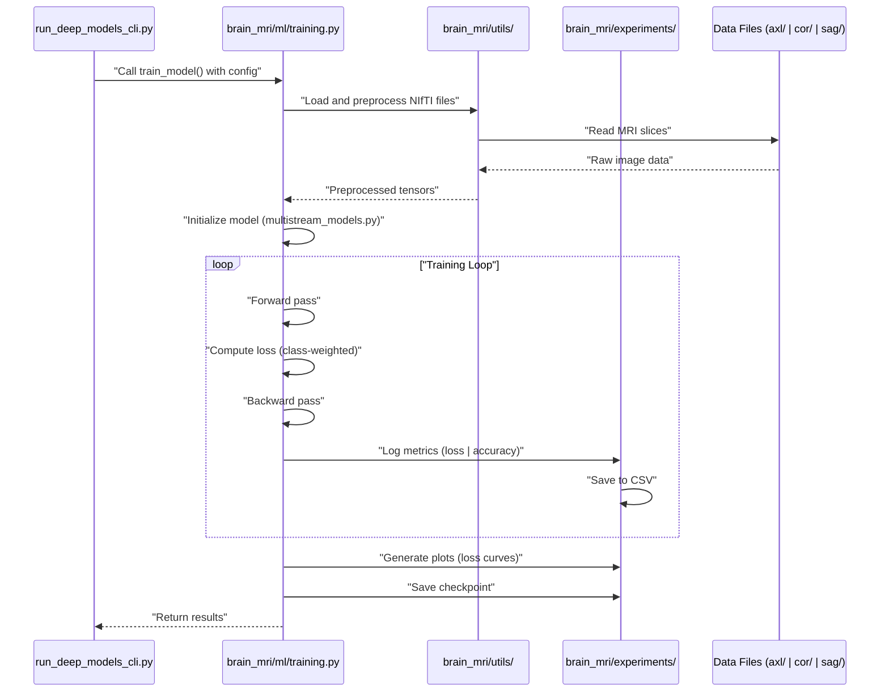
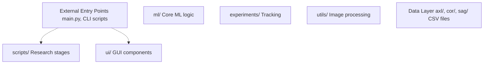

# Core Package Structure (brain_mri/)

> **Relevant source files**
> * [README.md](https://github.com/ThalesMMS/brain-mri-pipelines-py/blob/cd9d51a5/README.md)

## Purpose and Scope

This document describes the internal organization of the `brain_mri/` Python package, detailing the responsibilities of each module directory and how they interact. The package is structured into five primary modules: `ml/` (machine learning models and training logic), `ui/` (GUI components), `experiments/` (tracking and visualization), `utils/` (image processing utilities), and `scripts/` (reproducible research pipeline stages).

For information about the multi-stream architectural design, see [Multi-Stream Multimodal Network](#3.1). For the end-to-end data flow through preprocessing and batch creation, see [Data Processing Pipeline](#3.2). For details on the three research stages, see [Three-Stage Research Pipeline](#6).

---

## Package Directory Structure

The `brain_mri/` package follows a modular design where each subdirectory has a well-defined responsibility:



**Sources:** [README.md L179-L196](https://github.com/ThalesMMS/brain-mri-pipelines-py/blob/cd9d51a5/README.md#L179-L196)

---

## Module Responsibilities Overview

| Module | Primary Responsibility | Key Components | Entry Points |
| --- | --- | --- | --- |
| `ml/` | Machine learning models, training loops, baselines | `medicalnet_models.py`, `multistream_models.py`, `rl_refinement.py`, `training.py`, `baselines.py` | Imported by all CLI scripts and GUI |
| `ui/` | Tkinter GUI mixins | Navigation mixins, Segmentation mixins | `main.py` GUI application |
| `experiments/` | Experiment tracking and visualization | Logging, plotting, metrics collection | Called by training loops in `ml/` |
| `utils/` | Image processing utilities | NIfTI loading, preprocessing, augmentation | Used by data loaders and GUI |
| `scripts/` | Reproducible research stages | Stage 1-3 runners, table generation | Direct CLI execution |

**Sources:** [README.md L179-L196](https://github.com/ThalesMMS/brain-mri-pipelines-py/blob/cd9d51a5/README.md#L179-L196)

---

## ml/ Module: Core Machine Learning Logic

The `ml/` module serves as the **central hub** of the system, containing all model architectures, training procedures, and classical baselines. This is where the high-level diagrams converge—all user interfaces (GUI and CLI) ultimately invoke functions from this module.

### Module Contents



### Key Files

#### medicalnet_models.py

Implements 2D ResNet architectures adapted from the Med3D project. This file contains the **mathematical conversion logic** that transforms pre-trained 3D convolutional kernels into 2D equivalents suitable for slice-based inference. The conversion enables leveraging volumetric medical imaging knowledge for 2D slice analysis.

Key responsibilities:

* Download Med3D pre-trained weights via `huggingface_hub`
* Convert 3D Conv kernels to 2D Conv kernels
* Define ResNet-10/18/34/50/101/152/200 architectures
* Integrate with the multi-stream framework

#### multistream_models.py

Defines the multi-stream multimodal architecture that processes three anatomical planes (axial, coronal, sagittal) through separate backbone streams. This file implements:

* Multi-view fusion logic
* Clinical feature concatenation
* Backbone selection (EfficientNet-B0, DenseNet121, MedicalNet)
* Final classification head

#### rl_refinement.py

Implements the PPO (Proximal Policy Optimization) agent for automated hyperparameter adjustment. The agent operates at the micro-epoch level, adjusting learning rate and weight decay based on validation balanced accuracy as the reward signal.

Key components:

* Actor-Critic network architecture
* PPO training loop
* Hyperparameter state representation
* Reward computation from validation metrics

#### training.py

Contains the core training infrastructure including:

* Training loop with warmup and fine-tuning phases
* Validation logic
* Checkpoint management
* Loss computation (class-weighted, Focal Loss)
* Integration with `experiments/` module for logging

#### baselines.py

Implements classical machine learning baselines:

* SVM with morphological descriptors
* XGBoost for age estimation regression
* Feature extraction from clinical metadata
* Handling of MMSE/CDR leakage scenarios

**Sources:** [README.md L184-L188](https://github.com/ThalesMMS/brain-mri-pipelines-py/blob/cd9d51a5/README.md#L184-L188)

---

## ui/ Module: GUI Components

The `ui/` module contains **Tkinter mixins** that compose the interactive graphical interface. The design uses the mixin pattern to separate concerns: navigation, segmentation, training controls, etc.



### Responsibilities

* **Slice Navigation:** Browse through MRI volumes, visualize different anatomical planes
* **Semi-Automatic Segmentation:** Region-growing ventricle segmentation with interactive seed point selection
* **Training Interface:** Configure model parameters, select backbones, initiate training runs
* **Visualization:** Display images, segmentation masks, and training progress

**Sources:** [README.md L182](https://github.com/ThalesMMS/brain-mri-pipelines-py/blob/cd9d51a5/README.md#L182-L182)

 [README.md L83-L96](https://github.com/ThalesMMS/brain-mri-pipelines-py/blob/cd9d51a5/README.md#L83-L96)

---

## experiments/ Module: Tracking and Visualization

The `experiments/` module provides infrastructure for **experiment tracking, metrics logging, and result visualization**. This module is called by training loops to record performance metrics, save plots, and manage experiment artifacts.



### Key Features

* **Metric Logging:** Records training/validation loss, accuracy, balanced accuracy per epoch
* **Visualization:** Generates plots for loss curves, ROC curves, confusion matrices
* **Experiment Organization:** Creates timestamped subdirectories in `output/` for each run
* **Result Export:** Saves metrics in formats suitable for statistical analysis and publication

**Sources:** [README.md L183](https://github.com/ThalesMMS/brain-mri-pipelines-py/blob/cd9d51a5/README.md#L183-L183)

---

## utils/ Module: Image Processing Utilities

The `utils/` module contains **low-level image processing functions** for working with NIfTI files, preprocessing, and augmentation. These utilities are used throughout the codebase wherever MRI image data needs to be loaded or transformed.



### Core Functionality

* **NIfTI I/O:** Loading and parsing NIfTI-1 format files, extracting metadata
* **Preprocessing:** Intensity normalization, slice selection, resizing
* **Augmentation:** Training-time transformations (rotation, flipping, noise injection)
* **Coordinate Systems:** Handling affine transformations for proper spatial alignment
* **Visualization Helpers:** Utilities for displaying images with overlays

**Sources:** [README.md L189](https://github.com/ThalesMMS/brain-mri-pipelines-py/blob/cd9d51a5/README.md#L189-L189)

---

## scripts/ Module: Reproducible Research Stages

The `scripts/` module contains **executable Python scripts** that implement the three-stage research pipeline. These scripts are designed for **headless execution** and reproducibility, orchestrating the `ml/` module to perform specific experimental workflows.



### Stage Scripts

#### run_pc1_embeddings.py

Implements Stage 1 of the research pipeline: **Embedding Quality Assessment**. Compares deep learning embeddings from EfficientNet/DenseNet/MedicalNet against handcrafted morphological descriptors using lightweight classifiers.

Command-line interface:

```
python brain_mri/scripts/run_pc1_embeddings.py --dl-backbone efficientnet
```

#### run_pc2_finetune.py

Implements Stage 2: **Transfer Learning and Fine-Tuning**. Executes a two-phase training approach: first warming up the classification head with frozen backbone, then unfreezing all layers for end-to-end fine-tuning.

Command-line interface:

```
python brain_mri/scripts/run_pc2_finetune.py --backbone efficientnet --seed 42 --epochs 6 --warmup-epochs 2
```

#### run_pc3_rl_refinement.py

Implements Stage 3: **RL Hyperparameter Refinement**. Uses the PPO agent from `ml/rl_refinement.py` to automatically adjust learning rate and weight decay, optimizing validation balanced accuracy.

Command-line interface:

```
python brain_mri/scripts/run_pc3_rl_refinement.py --backbone efficientnet --seed 42 --episodes 4 --horizon 4
```

#### generate_article_tables.py

Processes experimental results from `output/` directory and generates **LaTeX-formatted tables** for publication, including statistical significance tests (Wilcoxon) across model variants.

Command-line interface:

```
python -m brain_mri.scripts.generate_article_tables --write
```

**Sources:** [README.md L122-L156](https://github.com/ThalesMMS/brain-mri-pipelines-py/blob/cd9d51a5/README.md#L122-L156)

 [README.md L185-L188](https://github.com/ThalesMMS/brain-mri-pipelines-py/blob/cd9d51a5/README.md#L185-L188)

---

## Module Interaction Patterns

The following diagram illustrates how modules interact during a typical training workflow initiated from the CLI:



### Key Interaction Patterns

1. **CLI → ml/**: All entry points (GUI, CLI scripts) import and invoke functions from `ml/` module
2. **ml/ → utils/**: Training loops call utilities for data loading and preprocessing
3. **ml/ → experiments/**: Training loops log metrics and save artifacts through experiment tracking
4. **scripts/ → ml/**: Research stage scripts orchestrate multiple training runs with specific configurations
5. **ui/ → ml/ & utils/**: GUI components use both utilities (for visualization) and ML (for training)

**Sources:** [README.md L179-L196](https://github.com/ThalesMMS/brain-mri-pipelines-py/blob/cd9d51a5/README.md#L179-L196)

---

## Cross-Module Dependencies

The dependency structure ensures separation of concerns while allowing necessary communication:



### Dependency Rules

* **No Circular Dependencies:** Modules have a clear hierarchy with no circular imports
* **ML as Hub:** The `ml/` module is the central point that other modules depend on
* **Data Isolation:** Only `utils/` and `ml/` directly access the data layer
* **Experiment Tracking:** Only `ml/` calls into `experiments/` (unidirectional logging)
* **UI Independence:** GUI components are isolated in `ui/` and only imported when GUI is launched

**Sources:** [README.md L179-L196](https://github.com/ThalesMMS/brain-mri-pipelines-py/blob/cd9d51a5/README.md#L179-L196)

---

## Package-Level Design Principles

### 1. Modularity

Each subdirectory has a single, well-defined responsibility. This allows:

* Independent development and testing
* Easy extension (e.g., adding new backbones to `ml/medicalnet_models.py`)
* Clear documentation boundaries

### 2. Separation of Concerns

* **Presentation** (ui/) is separate from **logic** (ml/)
* **Infrastructure** (experiments/, utils/) is separate from **algorithms** (ml/)
* **Research workflows** (scripts/) are separate from **reusable components** (ml/)

### 3. Entry Point Flexibility

The package supports multiple usage patterns:

* Interactive GUI via `main.py`
* Headless training via `run_baselines_cli.py` and `run_deep_models_cli.py`
* Research pipeline via `scripts/run_pc*.py`
* Programmatic usage by importing `brain_mri.ml` directly

### 4. Extensibility Points

Key files designed for extension:

* `ml/multistream_models.py`: Add new backbone architectures
* `ml/baselines.py`: Add new classical ML algorithms
* `experiments/`: Add new metrics or visualization types
* `utils/`: Add new preprocessing or augmentation techniques

**Sources:** [README.md L179-L196](https://github.com/ThalesMMS/brain-mri-pipelines-py/blob/cd9d51a5/README.md#L179-L196)

---

This modular structure enables the system to handle complex research workflows while maintaining code organization and reusability. The `ml/` module serves as the central hub, with supporting modules handling specialized concerns like GUI presentation, experiment tracking, and image processing.

Refresh this wiki

Last indexed: 5 January 2026 ([cd9d51](https://github.com/ThalesMMS/brain-mri-pipelines-py/commit/cd9d51a5))

### On this page

* [Core Package Structure (brain_mri/)](#3.3-core-package-structure-brain_mri)
* [Purpose and Scope](#3.3-purpose-and-scope)
* [Package Directory Structure](#3.3-package-directory-structure)
* [Module Responsibilities Overview](#3.3-module-responsibilities-overview)
* [ml/ Module: Core Machine Learning Logic](#3.3-ml-module-core-machine-learning-logic)
* [Module Contents](#3.3-module-contents)
* [Key Files](#3.3-key-files)
* [ui/ Module: GUI Components](#3.3-ui-module-gui-components)
* [Responsibilities](#3.3-responsibilities)
* [experiments/ Module: Tracking and Visualization](#3.3-experiments-module-tracking-and-visualization)
* [Key Features](#3.3-key-features)
* [utils/ Module: Image Processing Utilities](#3.3-utils-module-image-processing-utilities)
* [Core Functionality](#3.3-core-functionality)
* [scripts/ Module: Reproducible Research Stages](#3.3-scripts-module-reproducible-research-stages)
* [Stage Scripts](#3.3-stage-scripts)
* [Module Interaction Patterns](#3.3-module-interaction-patterns)
* [Key Interaction Patterns](#3.3-key-interaction-patterns)
* [Cross-Module Dependencies](#3.3-cross-module-dependencies)
* [Dependency Rules](#3.3-dependency-rules)
* [Package-Level Design Principles](#3.3-package-level-design-principles)
* [1. Modularity](#3.3-1-modularity)
* [2. Separation of Concerns](#3.3-2-separation-of-concerns)
* [3. Entry Point Flexibility](#3.3-3-entry-point-flexibility)
* [4. Extensibility Points](#3.3-4-extensibility-points)

Ask Devin about brain-mri-pipelines-py