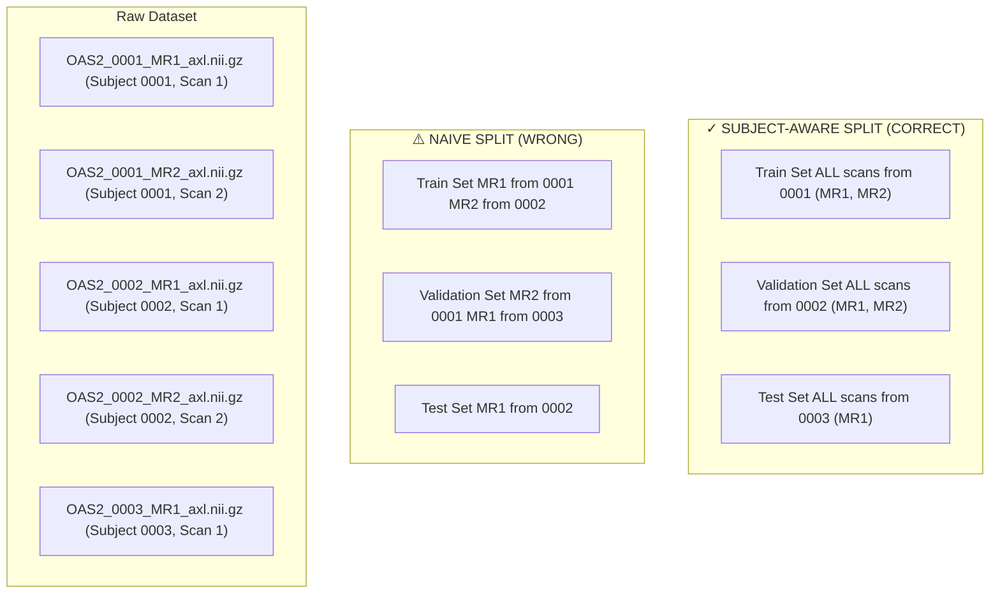
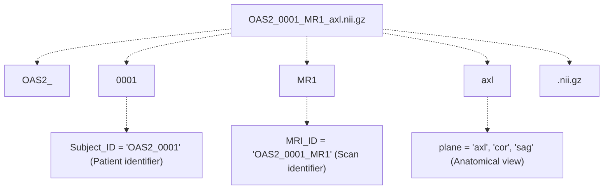
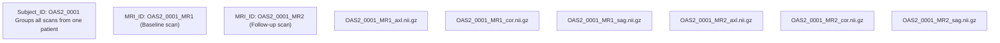
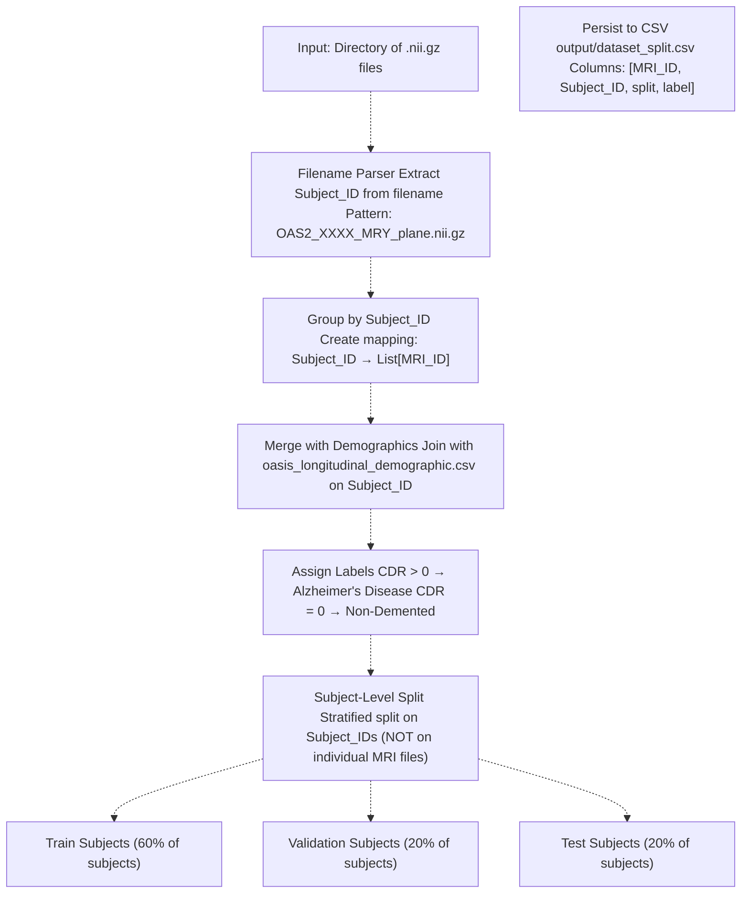
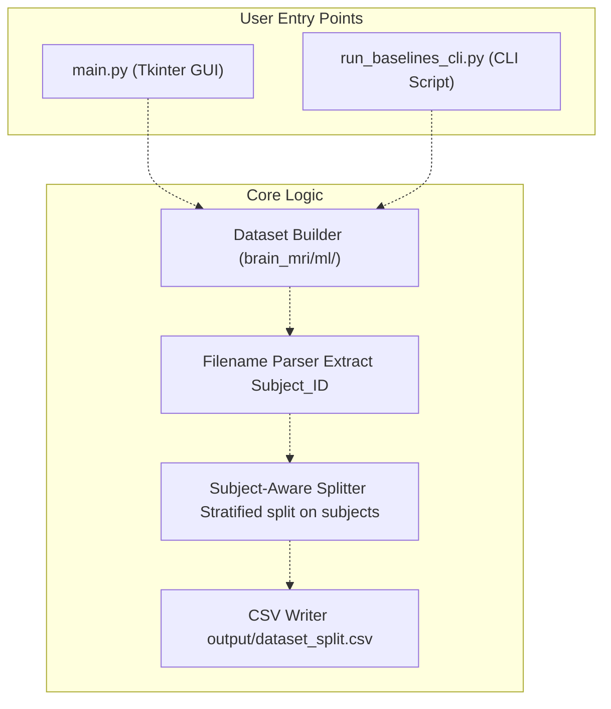
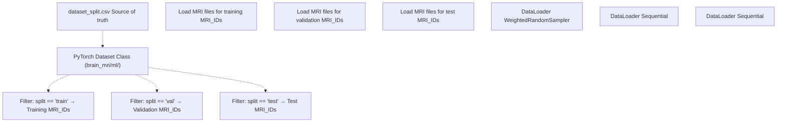
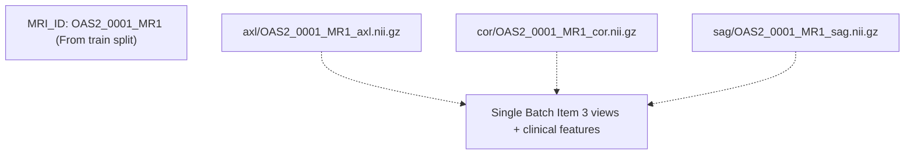

# Subject-Level Splitting & Leakage Prevention

> **Relevant source files**
> * [README.md](https://github.com/ThalesMMS/brain-mri-pipelines-py/blob/cd9d51a5/README.md)
> * [axl/OAS2_0001_MR1_axl.nii.gz](https://github.com/ThalesMMS/brain-mri-pipelines-py/blob/cd9d51a5/axl/OAS2_0001_MR1_axl.nii.gz)
> * [axl/OAS2_0001_MR2_axl.nii.gz](https://github.com/ThalesMMS/brain-mri-pipelines-py/blob/cd9d51a5/axl/OAS2_0001_MR2_axl.nii.gz)

This page documents the critical mechanism that prevents data leakage in the brain-mri-pipelines-py system by ensuring that all MRI scans from a single patient remain strictly within one partition (Train, Validation, or Test). This is a fundamental safeguard for obtaining valid, generalizable performance metrics.

For information about the overall data processing pipeline, see [Data Processing Pipeline](3b%20Data-Processing-Pipeline.md). For details on how the splits are used during training, see [Data Loading & Augmentation](4e%20Data-Loading-&-Augmentation.md).

---

## Purpose & Scope

The OASIS-2 dataset contains **longitudinal MRI data**, where the same patient may have multiple scans taken at different time points (e.g., baseline, 1-year follow-up, 2-year follow-up). A naive random split of MRI files would distribute these temporally-related scans across Train/Validation/Test partitions, allowing the model to indirectly learn patient-specific features and artificially inflate performance metrics. **Subject-level splitting** addresses this by grouping all scans from the same patient and assigning the entire group to a single partition.

This page covers:

* The data leakage risk in longitudinal medical imaging datasets
* Filename structure and Subject ID extraction
* The splitting algorithm and implementation
* CSV-based split persistence
* Integration with PyTorch DataLoaders

---

## The Data Leakage Problem

### Naive Split vs. Subject-Aware Split



**Sources:** [README.md L23](https://github.com/ThalesMMS/brain-mri-pipelines-py/blob/cd9d51a5/README.md#L23-L23)

 [axl/OAS2_0001_MR1_axl.nii.gz L1](https://github.com/ThalesMMS/brain-mri-pipelines-py/blob/cd9d51a5/axl/OAS2_0001_MR1_axl.nii.gz#L1-L1)

 [axl/OAS2_0001_MR2_axl.nii.gz L1](https://github.com/ThalesMMS/brain-mri-pipelines-py/blob/cd9d51a5/axl/OAS2_0001_MR2_axl.nii.gz#L1-L1)

### Impact of Leakage

When scans from the same patient appear in both training and validation sets, the model can exploit patient-specific anatomical features (brain shape, ventricle size, tissue characteristics) that remain consistent across timepoints. This leads to:

| Metric | With Leakage | Without Leakage | Impact |
| --- | --- | --- | --- |
| **Validation Accuracy** | Artificially inflated (90%+) | True generalization (70-80%) | Overoptimistic |
| **Test Performance** | Catastrophic drop | Matches validation | Model actually works |
| **Scientific Validity** | Invalid conclusions | Publishable results | Critical for research |

The system enforces subject-level splitting as a **mandatory safeguard** documented prominently in the README.

**Sources:** [README.md L23](https://github.com/ThalesMMS/brain-mri-pipelines-py/blob/cd9d51a5/README.md#L23-L23)

---

## Filename Structure & Subject Identification

### Naming Convention

All MRI files in the OASIS-2 dataset follow a strict naming convention:

```html
OAS2_<Subject_ID>_<MRI_ID>_<plane>.nii.gz
```

**Example Breakdown:**



**Sources:** README.md

### ID Hierarchy



**Key Insight:** The `Subject_ID` (e.g., `OAS2_0001`) is the grouping key. All files containing this prefix must remain in the same partition.

**Sources:** README.md

 [axl/OAS2_0001_MR1_axl.nii.gz L1](https://github.com/ThalesMMS/brain-mri-pipelines-py/blob/cd9d51a5/axl/OAS2_0001_MR1_axl.nii.gz#L1-L1)

 [axl/OAS2_0001_MR2_axl.nii.gz L1](https://github.com/ThalesMMS/brain-mri-pipelines-py/blob/cd9d51a5/axl/OAS2_0001_MR2_axl.nii.gz#L1-L1)

---

## Subject-Level Splitting Mechanism

### Parsing & Grouping Algorithm



**Sources:** [Project overview and setup](https://github.com/ThalesMMS/brain-mri-pipelines-py/blob/cd9d51a5/README.md#L101-L101)

 [README.md L23](https://github.com/ThalesMMS/brain-mri-pipelines-py/blob/cd9d51a5/README.md#L23-L23)

### Key Implementation Details

The splitting process operates at the **Subject_ID level**, not the MRI_ID level:

```
# Conceptual pseudocode (not actual code)# Step 1: Parse filenamesfilenames = ["OAS2_0001_MR1_axl.nii.gz", "OAS2_0001_MR2_axl.nii.gz", ...]subject_to_mris = defaultdict(list)for filename in filenames:    # Extract: "OAS2_0001" from "OAS2_0001_MR1_axl.nii.gz"    subject_id = extract_subject_id(filename)  # e.g., "OAS2_0001"    mri_id = extract_mri_id(filename)          # e.g., "OAS2_0001_MR1"    subject_to_mris[subject_id].append(mri_id)# Step 2: Split SUBJECTS (not MRIs)all_subjects = list(subject_to_mris.keys())  # ['OAS2_0001', 'OAS2_0002', ...]train_subjects, val_test_subjects = train_test_split(all_subjects, test_size=0.4)val_subjects, test_subjects = train_test_split(val_test_subjects, test_size=0.5)# Step 3: Expand to MRI_IDstrain_mri_ids = [mri for subj in train_subjects for mri in subject_to_mris[subj]]val_mri_ids = [mri for subj in val_subjects for mri in subject_to_mris[subj]]test_mri_ids = [mri for subj in test_subjects for mri in subject_to_mris[subj]]
```

**Critical:** The split happens on `all_subjects` (line 13-15 in pseudocode), ensuring all MRIs from `OAS2_0001` go to the same partition.

**Sources:** [Project overview and setup](https://github.com/ThalesMMS/brain-mri-pipelines-py/blob/cd9d51a5/README.md#L101-L101)

 [README.md L23](https://github.com/ThalesMMS/brain-mri-pipelines-py/blob/cd9d51a5/README.md#L23-L23)

---

## Split Generation & Persistence

### CSV Schema

The subject-aware split is persisted to a CSV file for reproducibility:

**File:** `output/dataset_split.csv`

| Column | Type | Description | Example |
| --- | --- | --- | --- |
| `MRI_ID` | str | Unique scan identifier | `OAS2_0001_MR1` |
| `Subject_ID` | str | Patient identifier (grouping key) | `OAS2_0001` |
| `split` | str | Partition assignment | `train`, `val`, `test` |
| `label` | int | Diagnosis (0=Non-Demented, 1=AD) | `1` |
| `age` | float | Age at scan (optional) | `74.0` |
| `CDR` | float | Clinical Dementia Rating | `0.5` |

**Example Rows:**

```
MRI_ID,Subject_ID,split,label,age,CDROAS2_0001_MR1,OAS2_0001,train,1,74.0,0.5OAS2_0001_MR2,OAS2_0001,train,1,76.0,1.0OAS2_0002_MR1,OAS2_0002,val,0,55.0,0.0OAS2_0002_MR2,OAS2_0002,val,0,57.0,0.0OAS2_0003_MR1,OAS2_0003,test,0,62.0,0.0
```

**Key Property:** Notice that `OAS2_0001_MR1` and `OAS2_0001_MR2` both have `split=train`. This CSV is the **source of truth** for all downstream training loops.

**Sources:** [Project overview and setup](https://github.com/ThalesMMS/brain-mri-pipelines-py/blob/cd9d51a5/README.md#L101-L101)

### Generation Entry Points



**Sources:** README.md

 **Sources**: [Project overview and setup](https://github.com/ThalesMMS/brain-mri-pipelines-py/blob/cd9d51a5/README.md#L177-L196)

---

## Integration with Data Loading

### PyTorch Dataset Class

The split-aware dataset class respects the CSV assignments:



**Sources:** [Project overview and setup](https://github.com/ThalesMMS/brain-mri-pipelines-py/blob/cd9d51a5/README.md#L101-L101)

### Multi-View Data Loading

For the multi-stream architecture (axial, coronal, sagittal), the subject-level constraint is preserved across all planes:



The system loads all three planes for a given `MRI_ID`, and since `MRI_ID` is assigned to a single split, **all views remain in the same partition**.

**Sources:** [README.md L10-L15](https://github.com/ThalesMMS/brain-mri-pipelines-py/blob/cd9d51a5/README.md#L10-L15)

 **Sources**: [Project overview and setup](https://github.com/ThalesMMS/brain-mri-pipelines-py/blob/cd9d51a5/README.md#L177-L196)

---

## Validation & Verification

### Automated Checks

The system should implement (or users should manually verify) the following invariants:

| Check | Description | Failure Consequence |
| --- | --- | --- |
| **No Subject Overlap** | `set(train_subjects) ∩ set(val_subjects) = ∅` | Data leakage |
| **Complete Coverage** | All MRI files mapped to exactly one split | Missing data or duplicates |
| **Consistent MRI Grouping** | All MRI_IDs with same Subject_ID in same split | Partial leakage |
| **Stratification** | Label distribution similar across splits | Class imbalance bias |

### Example Verification Code

```python
# Conceptual verification (not actual code from repo)import pandas as pd# Load split CSVdf = pd.read_csv('output/dataset_split.csv')# Check 1: No subject appears in multiple splitssubject_splits = df.groupby('Subject_ID')['split'].nunique()assert (subject_splits == 1).all(), "Subject appears in multiple splits!"# Check 2: All MRIs from same subject in same splitfor subject_id in df['Subject_ID'].unique():    subject_df = df[df['Subject_ID'] == subject_id]    assert subject_df['split'].nunique() == 1, f"Subject {subject_id} split inconsistency"# Check 3: Print split statisticsprint(df.groupby(['split', 'label']).size())
```

**Sources:** [Project overview and setup](https://github.com/ThalesMMS/brain-mri-pipelines-py/blob/cd9d51a5/README.md#L101-L101)

 [README.md L23](https://github.com/ThalesMMS/brain-mri-pipelines-py/blob/cd9d51a5/README.md#L23-L23)

---

## Methodological Recommendations

### Best Practices

1. **Always use subject-level splits** for longitudinal or multi-scan datasets
2. **Stratify on labels** during split to maintain class balance
3. **Fix random seed** for reproducibility across experiments
4. **Document split in papers** by reporting number of unique subjects (not MRI scans) per partition
5. **Verify split integrity** before training (run automated checks)

### Common Pitfalls

| Pitfall | Why It's Wrong | Correct Approach |
| --- | --- | --- |
| Splitting MRI files randomly | Temporal leakage within subjects | Split by Subject_ID |
| Using `train_test_split(mri_ids)` | Ignores subject grouping | `train_test_split(subject_ids)` then expand |
| Mixing planes inconsistently | Axial in train, coronal in val for same MRI | Keep all planes of same MRI_ID together |
| Ignoring follow-up scans | Only using baseline (MR1) | Include all timepoints but group by subject |

**Sources:** [Project overview and setup](https://github.com/ThalesMMS/brain-mri-pipelines-py/blob/cd9d51a5/README.md#L160-L169)

 [README.md L23](https://github.com/ThalesMMS/brain-mri-pipelines-py/blob/cd9d51a5/README.md#L23-L23)

---

## Relationship to MMSE/CDR Leakage

This page focuses on **temporal data leakage** (subject-level splitting). The system also addresses **target proxy leakage** by offering two SVM scenarios:

* `svm_with_mmse_cdr`: Includes MMSE/CDR scores (strong dementia proxies) → Leakage
* `svm_without_mmse_cdr`: Excludes MMSE/CDR scores → Clean imaging-only analysis

For details on this orthogonal leakage concern, see [Classical Machine Learning Baselines](5c%20Classical-Machine-Learning-Baselines.md) and [Model Comparison Framework](5d%20Results-Generation-%28generate_article_tables%29.md).

**Sources:** [Project overview and setup](https://github.com/ThalesMMS/brain-mri-pipelines-py/blob/cd9d51a5/README.md#L160-L169)

---

## Summary

Subject-level splitting is a **mandatory safeguard** in the brain-mri-pipelines-py system that prevents temporal data leakage by ensuring all MRI scans from a single patient remain in a single partition. The implementation:

1. Parses filenames to extract `Subject_ID` (e.g., `OAS2_0001`)
2. Groups all `MRI_ID` entries by `Subject_ID`
3. Splits at the **subject level** (not MRI level)
4. Persists assignments to `output/dataset_split.csv`
5. Enforces splits in PyTorch Dataset classes

This mechanism is critical for obtaining valid, generalizable performance metrics in medical imaging research and is prominently documented in the project README as a key feature.

**Sources:** [README.md L23](https://github.com/ThalesMMS/brain-mri-pipelines-py/blob/cd9d51a5/README.md#L23-L23)

 README.md

 **Sources**: [Project overview and setup](https://github.com/ThalesMMS/brain-mri-pipelines-py/blob/cd9d51a5/README.md#L101-L101)

 **Sources**: [Project overview and setup](https://github.com/ThalesMMS/brain-mri-pipelines-py/blob/cd9d51a5/README.md#L160-L169)


### On this page

* [Subject-Level Splitting & Leakage Prevention](#3.4-subject-level-splitting-leakage-prevention)
* [Purpose & Scope](#3.4-purpose-scope)
* [The Data Leakage Problem](#3.4-the-data-leakage-problem)
* [Naive Split vs. Subject-Aware Split](#3.4-naive-split-vs-subject-aware-split)
* [Impact of Leakage](#3.4-impact-of-leakage)
* [Filename Structure & Subject Identification](#3.4-filename-structure-subject-identification)
* [Naming Convention](#3.4-naming-convention)
* [ID Hierarchy](#3.4-id-hierarchy)
* [Subject-Level Splitting Mechanism](#3.4-subject-level-splitting-mechanism)
* [Parsing & Grouping Algorithm](#3.4-parsing-grouping-algorithm)
* [Key Implementation Details](#3.4-key-implementation-details)
* [Split Generation & Persistence](#3.4-split-generation-persistence)
* [CSV Schema](#3.4-csv-schema)
* [Generation Entry Points](#3.4-generation-entry-points)
* [Integration with Data Loading](#3.4-integration-with-data-loading)
* [PyTorch Dataset Class](#3.4-pytorch-dataset-class)
* [Multi-View Data Loading](#3.4-multi-view-data-loading)
* [Validation & Verification](#3.4-validation-verification)
* [Automated Checks](#3.4-automated-checks)
* [Example Verification Code](#3.4-example-verification-code)
* [Methodological Recommendations](#3.4-methodological-recommendations)
* [Best Practices](#3.4-best-practices)
* [Common Pitfalls](#3.4-common-pitfalls)
* [Relationship to MMSE/CDR Leakage](#3.4-relationship-to-mmsecdr-leakage)
* [Summary](#3.4-summary)

Ask Devin about brain-mri-pipelines-py