# Data Layer

> **Relevant source files**
> * [README.md](https://github.com/ThalesMMS/brain-mri-pipelines-py/blob/cd9d51a5/README.md)
> * [axl/OAS2_0001_MR1_axl.nii.gz](https://github.com/ThalesMMS/brain-mri-pipelines-py/blob/cd9d51a5/axl/OAS2_0001_MR1_axl.nii.gz)

This document provides comprehensive technical documentation of the data layer in the brain-mri-pipelines-py framework. The data layer encompasses all aspects of data storage, organization, loading, and preprocessing for the OASIS-2 neuroimaging dataset.

**Scope**: This page covers the physical organization of MRI images and clinical metadata, file formats, naming conventions, and the data loading pipeline. For information about the subject-level splitting mechanism that prevents data leakage, see [Subject-Level Splitting & Leakage Prevention](#3.4). For model training configurations, see [Training Configuration](#5.4).

**Child Pages**: This section has several specialized sub-pages:

* [OASIS-2 Dataset Overview](#4.1) - Dataset structure and demographics
* [NIfTI File Format](#4.2) - Neuroimaging file format specifications
* [Directory Organization & File Naming](#4.3) - Physical layout and naming patterns
* [Clinical Metadata](#4.4) - Tabular clinical features
* [Data Loading & Augmentation](#4.5) - Loading pipeline and transformations

---

## Dataset Organization

The framework expects a specific directory structure in the repository root, with clear separation between input data and generated outputs.

### Directory Structure

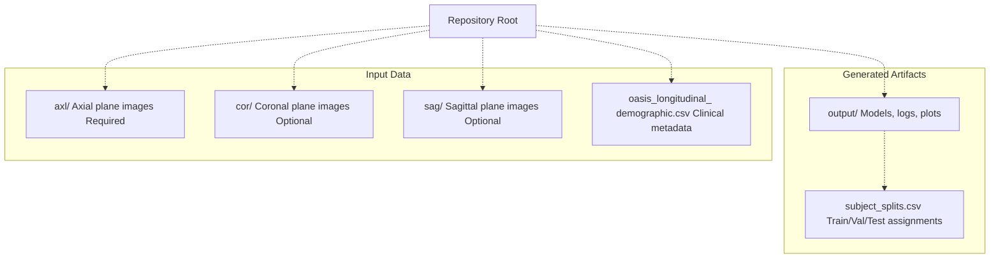

**Sources**: [README.md L27-L38](https://github.com/ThalesMMS/brain-mri-pipelines-py/blob/cd9d51a5/README.md#L27-L38)

| Directory | Purpose | Required | Content Type |
| --- | --- | --- | --- |
| `axl/` | Axial plane MRI scans | Yes (for GUI) | NIfTI files (`.nii`, `.nii.gz`) |
| `cor/` | Coronal plane MRI scans | No | NIfTI files (`.nii`, `.nii.gz`) |
| `sag/` | Sagittal plane MRI scans | No | NIfTI files (`.nii`, `.nii.gz`) |
| `oasis_longitudinal_demographic.csv` | Clinical and demographic data | Yes | CSV with subject-level records |
| `output/` | Training artifacts and results | Auto-generated | Models, logs, plots, tables |

---

## File Naming Convention

The system uses a strict naming convention to extract subject identifiers and MRI session information from filenames.

### Naming Pattern

Files follow the pattern: `OAS2_XXXX_MRY_plane.nii.gz`

**Components**:

* `OAS2`: Dataset identifier (OASIS-2)
* `XXXX`: 4-digit subject number (e.g., `0001`, `0002`)
* `MR`: Literal string indicating MRI scan
* `Y`: Session/timepoint number (e.g., `1`, `2`)
* `plane`: Anatomical plane (`axl`, `cor`, or `sag`)
* Extension: `.nii.gz` (compressed) or `.nii` (uncompressed)

### Identifier Extraction Diagram

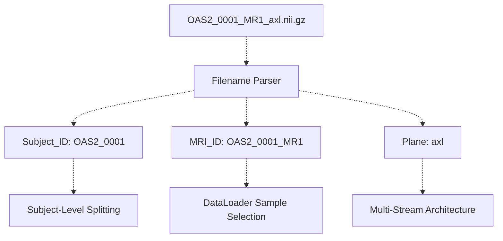

**Sources**: [README.md L40-L49](https://github.com/ThalesMMS/brain-mri-pipelines-py/blob/cd9d51a5/README.md#L40-L49)

### Examples

| Filename | Subject_ID | MRI_ID | Plane | Session |
| --- | --- | --- | --- | --- |
| `OAS2_0001_MR1_axl.nii.gz` | `OAS2_0001` | `OAS2_0001_MR1` | axl | 1 |
| `OAS2_0001_MR2_axl.nii.gz` | `OAS2_0001` | `OAS2_0001_MR2` | axl | 2 |
| `OAS2_0002_MR1_cor.nii.gz` | `OAS2_0002` | `OAS2_0002_MR1` | cor | 1 |
| `OAS2_0002_MR1_sag.nii.gz` | `OAS2_0002` | `OAS2_0002_MR1` | sag | 1 |

**Critical Note**: The `Subject_ID` (e.g., `OAS2_0001`) is used for train/validation/test splitting to prevent data leakage. Multiple scans from the same subject (`OAS2_0001_MR1`, `OAS2_0001_MR2`) must remain in the same partition.

**Sources**: [README.md L40-L49](https://github.com/ThalesMMS/brain-mri-pipelines-py/blob/cd9d51a5/README.md#L40-L49)

 High-level Diagram 4

---

## NIfTI File Format

### Format Overview

The framework processes neuroimaging data stored in the NIfTI-1 format (Neuroimaging Informatics Technology Initiative). NIfTI files contain both image data and metadata in a single file.

**File Extensions**:

* `.nii` - Uncompressed NIfTI
* `.nii.gz` - Gzip-compressed NIfTI (preferred for storage efficiency)

### NIfTI Structure

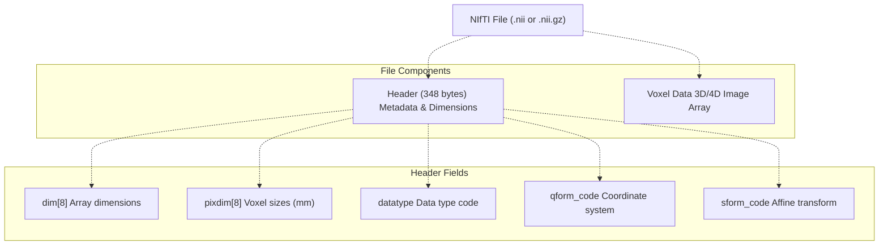

**Sources**: [axl/OAS2_0001_MR1_axl.nii.gz L1-L100](https://github.com/ThalesMMS/brain-mri-pipelines-py/blob/cd9d51a5/axl/OAS2_0001_MR1_axl.nii.gz#L1-L100)

 (binary file structure inferred)

### Coordinate Systems

NIfTI files store affine transformations that map voxel indices to physical coordinates (typically in mm). The framework relies on these transformations for spatial consistency across scans.

**Key Coordinate Spaces**:

* **Voxel Space**: Integer indices (i, j, k) into the 3D array
* **Scanner Space**: Physical coordinates (x, y, z) in millimeters relative to the scanner isocenter
* **Anatomical Space**: Standard orientation (e.g., RAS: Right-Anterior-Superior)

---

## Clinical Metadata

The clinical metadata file `oasis_longitudinal_demographic.csv` contains per-subject demographic and morphometric features.

### Metadata Schema

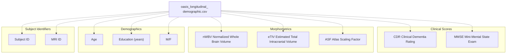

**Sources**: [README.md L12](https://github.com/ThalesMMS/brain-mri-pipelines-py/blob/cd9d51a5/README.md#L12-L12)

 [README.md L168](https://github.com/ThalesMMS/brain-mri-pipelines-py/blob/cd9d51a5/README.md#L168-L168)

### Clinical Features for Multimodal Fusion

The framework extracts five features for multimodal deep learning models:

| Feature | Description | Usage in Model | Range/Units |
| --- | --- | --- | --- |
| `age` | Subject age at scan | Continuous covariate | Years |
| `education` | Years of education | Continuous covariate | Years |
| `nwbv` | Normalized whole brain volume | Structural biomarker | [0, 1] normalized |
| `etiv` | Estimated total intracranial volume | Structural biomarker | cm³ |
| `asf` | Atlas scaling factor | Normalization factor | Scaling ratio |

**Sources**: [README.md L12](https://github.com/ThalesMMS/brain-mri-pipelines-py/blob/cd9d51a5/README.md#L12-L12)

### MMSE and CDR: Target Proxy Warning

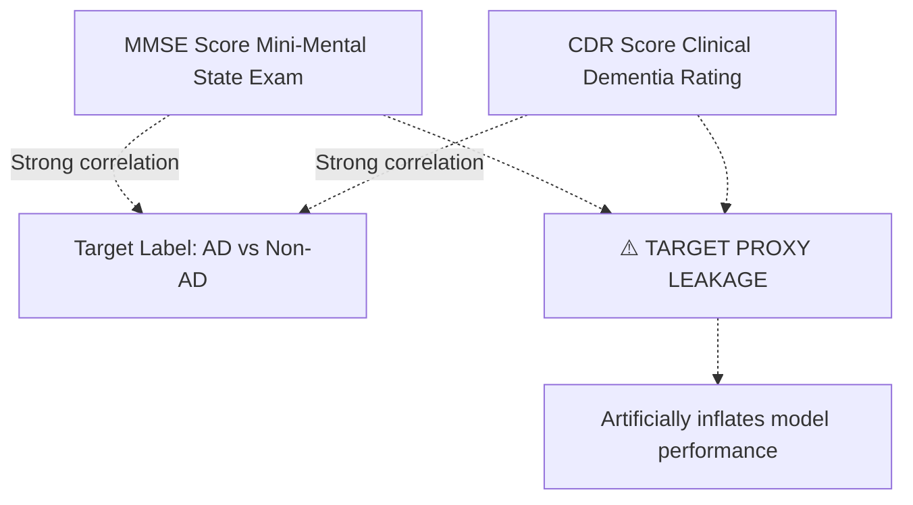

**Important**: The framework includes two SVM baseline scenarios:

1. **`svm_with_mmse_cdr`**: Includes MMSE/CDR scores (demonstrates leakage)
2. **`svm_without_mmse_cdr`**: Clean imaging-based approach (recommended)

MMSE and CDR are diagnostic tools that directly measure cognitive impairment, making them strong proxies for the AD diagnosis target. Including them creates methodologically unsound "shortcuts" that bypass the actual imaging analysis.

**Sources**: [README.md L107-L108](https://github.com/ThalesMMS/brain-mri-pipelines-py/blob/cd9d51a5/README.md#L107-L108)

 [README.md L168](https://github.com/ThalesMMS/brain-mri-pipelines-py/blob/cd9d51a5/README.md#L168-L168)

 High-level Diagram 5

---

## Subject-Level Splitting

### Critical Leakage Prevention Mechanism

The most critical aspect of the data layer is **subject-level splitting**, which prevents data leakage by ensuring all scans from a single patient remain in one partition.

### The Data Leakage Problem

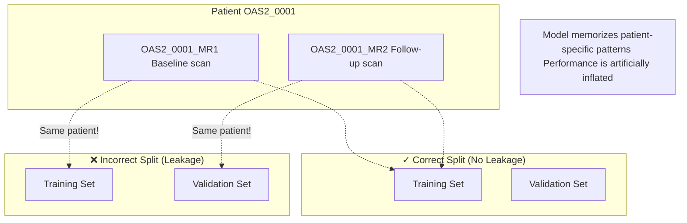

**Why This Matters**: MRI scans from the same patient at different timepoints share patient-specific anatomical features (skull shape, brain structure, ventricular geometry). If one timepoint is in training and another in validation, the model can "recognize" the patient and achieve unrealistically high performance.

**Sources**: [README.md L23](https://github.com/ThalesMMS/brain-mri-pipelines-py/blob/cd9d51a5/README.md#L23-L23)

 High-level Diagram 4

### Subject-Aware Splitting Pipeline

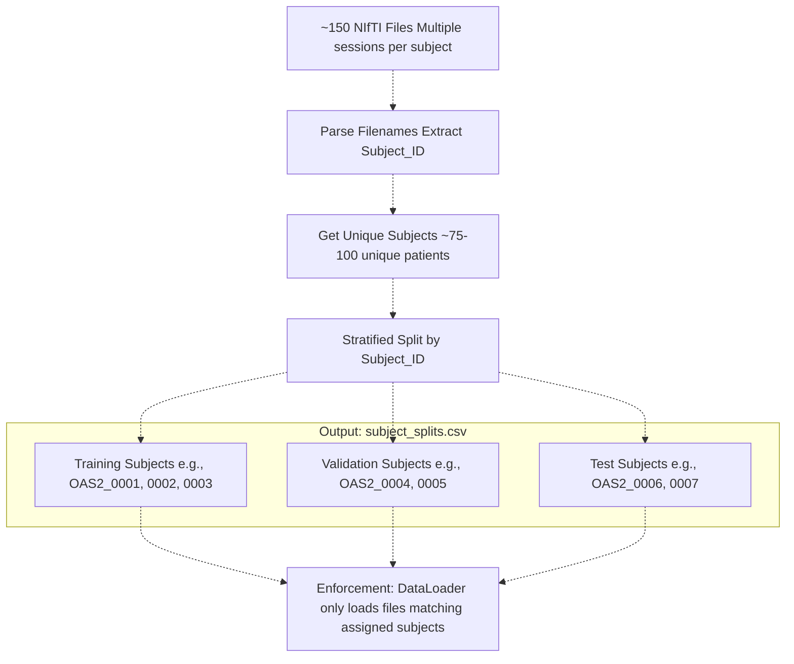

**Sources**: [README.md L23](https://github.com/ThalesMMS/brain-mri-pipelines-py/blob/cd9d51a5/README.md#L23-L23)

 High-level Diagram 4

### Split Generation

The `run_baselines_cli.py` script generates the `output/subject_splits.csv` file that records the subject-to-partition assignment.

**Expected CSV Structure**:

```
Subject_ID,Split
OAS2_0001,train
OAS2_0002,train
OAS2_0003,train
OAS2_0004,val
OAS2_0005,val
OAS2_0006,test
OAS2_0007,test
```

**Sources**: [README.md L101-L108](https://github.com/ThalesMMS/brain-mri-pipelines-py/blob/cd9d51a5/README.md#L101-L108)

---

## Data Loading Pipeline

### DataLoader Architecture

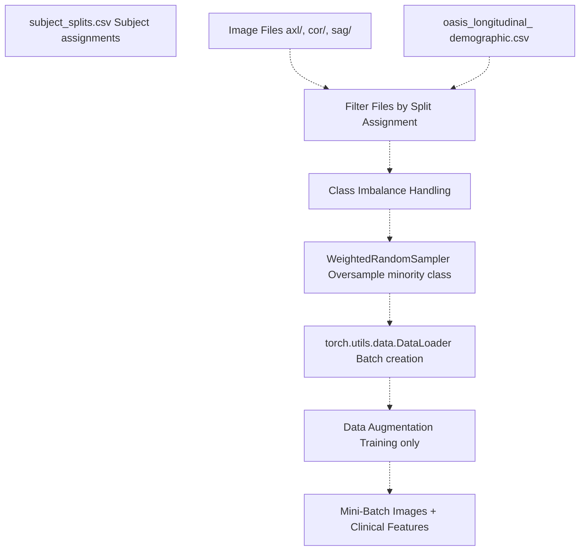

**Sources**: [README.md L163-L167](https://github.com/ThalesMMS/brain-mri-pipelines-py/blob/cd9d51a5/README.md#L163-L167)

 High-level Diagram 4

### Class Imbalance Handling

The OASIS-2 dataset exhibits class imbalance (more non-AD than AD cases). The framework employs multiple mechanisms to prevent model collapse:

| Mechanism | Purpose | Implementation |
| --- | --- | --- |
| `WeightedRandomSampler` | Oversample minority class during training | PyTorch DataLoader |
| Class-weighted loss | Penalize misclassification of minority class | Loss function weights |
| Focal Loss | Down-weight easy examples, focus on hard cases | Alternative loss option |
| Balanced Accuracy | Primary metric that accounts for imbalance | Evaluation metric |

**Sources**: [README.md L163-L167](https://github.com/ThalesMMS/brain-mri-pipelines-py/blob/cd9d51a5/README.md#L163-L167)

 High-level Diagram 4

### WeightedRandomSampler Configuration

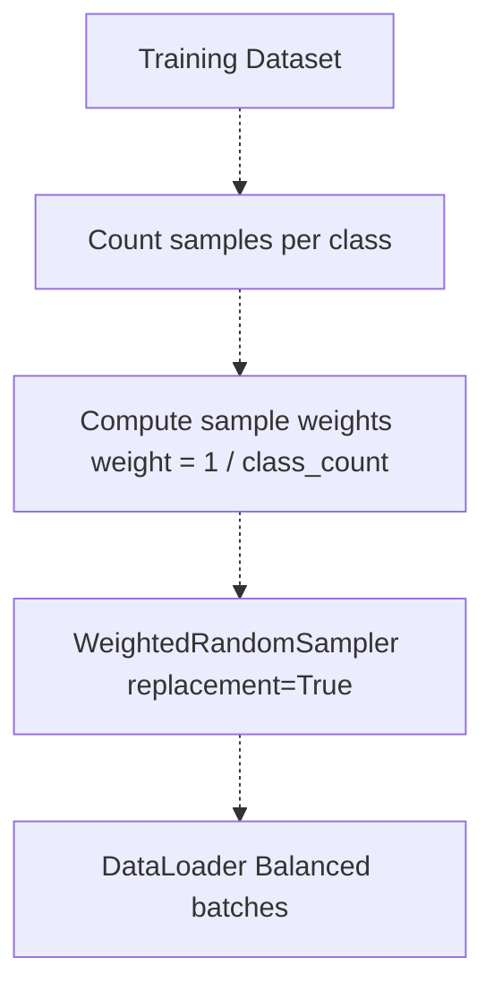

**Example**: If training set has 70 non-AD and 30 AD samples:

* Non-AD weight: 1/70 ≈ 0.014
* AD weight: 1/30 ≈ 0.033

The sampler draws samples proportionally to these weights, effectively oversampling the minority class.

**Sources**: [README.md L163-L167](https://github.com/ThalesMMS/brain-mri-pipelines-py/blob/cd9d51a5/README.md#L163-L167)

---

## Data Augmentation

Data augmentation is applied during training to increase dataset diversity and improve model generalization. Augmentations are **only applied to the training set**, not validation or test sets.

### Augmentation Pipeline

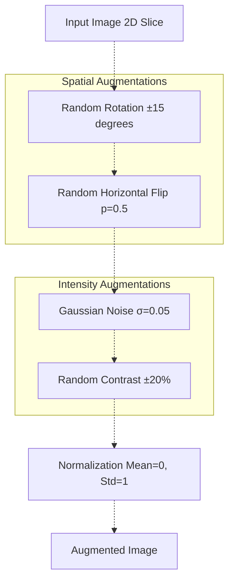

### Typical Augmentation Parameters

| Augmentation | Parameter | Rationale |
| --- | --- | --- |
| Rotation | ±15° | Accounts for head position variation |
| Horizontal Flip | p=0.5 | Brain has approximate bilateral symmetry |
| Gaussian Noise | σ=0.05 | Models scanner noise |
| Contrast Adjustment | ±20% | Accounts for scanner calibration differences |
| Normalization | z-score | Standardizes intensity ranges |

**Important**: Augmentations are implemented as part of the PyTorch Dataset transform pipeline. The random seed controls reproducibility of augmentation sequences.

**Sources**: High-level Diagram 4, [README.md L163-L167](https://github.com/ThalesMMS/brain-mri-pipelines-py/blob/cd9d51a5/README.md#L163-L167)

---

## Multi-Plane Data Loading

### Three-Stream Architecture Data Requirements

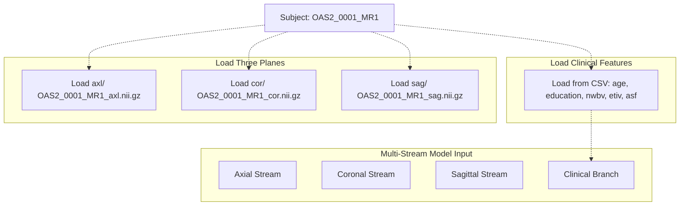

**Note**: The framework supports flexible plane configurations:

* Single-stream: Only one plane (e.g., axial only)
* Multi-stream: Two or three planes simultaneously
* Multimodal: Multi-stream + clinical features

**Sources**: [README.md L10-L15](https://github.com/ThalesMMS/brain-mri-pipelines-py/blob/cd9d51a5/README.md#L10-L15)

 [README.md L110-L118](https://github.com/ThalesMMS/brain-mri-pipelines-py/blob/cd9d51a5/README.md#L110-L118)

 High-level Diagram 2

---

## Data Validation

### File Integrity Checks

The data layer includes validation logic to ensure data integrity before training:

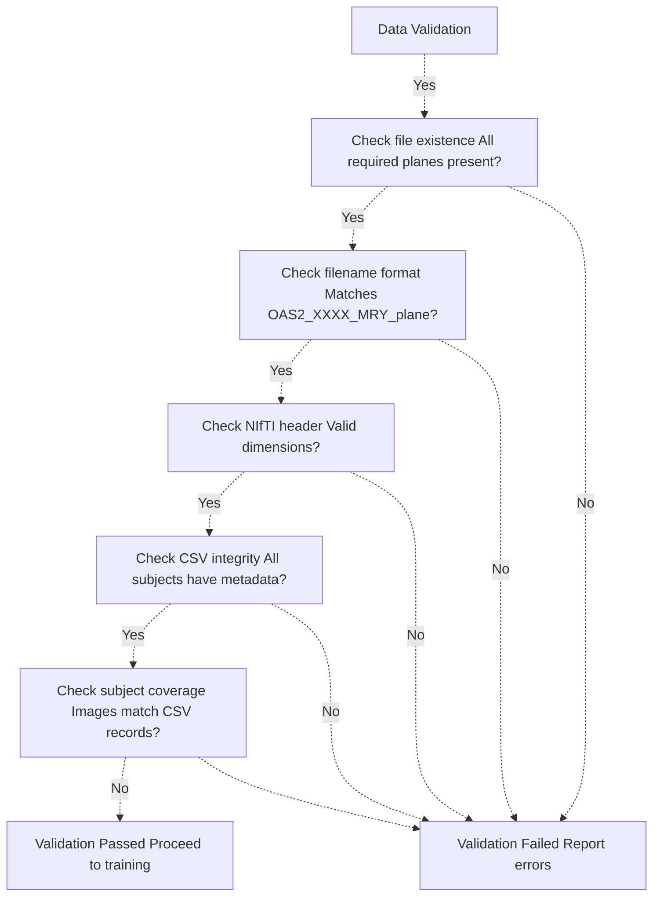

**Sources**: High-level Diagram 4 (Data Parsing & Validation box)

---

## Output Directory Structure

Generated artifacts are stored in the `output/` directory, maintaining separation from input data.

### Output Organization

```markdown
output/
├── subject_splits.csv              # Train/Val/Test assignments
├── models/                         # Saved model checkpoints
│   ├── efficientnet_best.pth
│   ├── densenet_best.pth
│   └── medicalnet_best.pth
├── logs/                          # Training logs
│   ├── training_log.csv
│   └── tensorboard/
├── plots/                         # Visualization outputs
│   ├── confusion_matrix.png
│   ├── roc_curve.png
│   └── training_curves.png
└── tables/                        # LaTeX tables for publication
    └── results_table.tex
```

**Sources**: [README.md L37](https://github.com/ThalesMMS/brain-mri-pipelines-py/blob/cd9d51a5/README.md#L37-L37)

 [README.md L177-L195](https://github.com/ThalesMMS/brain-mri-pipelines-py/blob/cd9d51a5/README.md#L177-L195)

---

## Data Layer Code Map

### Key Code Entities

| Code Entity | Location | Purpose |
| --- | --- | --- |
| Dataset classes | `brain_mri/ml/` | PyTorch Dataset implementations |
| Filename parser | `brain_mri/utils/` | Extract Subject_ID and MRI_ID |
| Data validator | `brain_mri/ml/` | Integrity checks |
| Subject splitter | `run_baselines_cli.py` | Generate subject_splits.csv |
| Image preprocessing | `brain_mri/utils/` | NIfTI loading and normalization |
| Augmentation transforms | `brain_mri/ml/` | Training-time augmentations |
| WeightedRandomSampler | PyTorch | Class imbalance handling |

**Sources**: [README.md L177-L195](https://github.com/ThalesMMS/brain-mri-pipelines-py/blob/cd9d51a5/README.md#L177-L195)

---

## Summary

The data layer implements a rigorous structure for medical imaging data management with emphasis on:

1. **Subject-level splitting** to prevent data leakage
2. **Flexible multi-plane architecture** supporting axial, coronal, and sagittal views
3. **Multimodal fusion** combining imaging and clinical features
4. **Class imbalance handling** via weighted sampling and appropriate metrics
5. **Data augmentation** for improved generalization
6. **Strict validation** ensuring data integrity

The combination of NIfTI medical imaging format, subject-aware splitting, and the WeightedRandomSampler creates a methodologically sound foundation for training AD classification models.

**Sources**: [README.md L1-L218](https://github.com/ThalesMMS/brain-mri-pipelines-py/blob/cd9d51a5/README.md#L1-L218)

 High-level Diagrams 1-6

Refresh this wiki

Last indexed: 5 January 2026 ([cd9d51](https://github.com/ThalesMMS/brain-mri-pipelines-py/commit/cd9d51a5))

### On this page

* [Data Layer](#4-data-layer)
* [Dataset Organization](#4-dataset-organization)
* [Directory Structure](#4-directory-structure)
* [File Naming Convention](#4-file-naming-convention)
* [Naming Pattern](#4-naming-pattern)
* [Identifier Extraction Diagram](#4-identifier-extraction-diagram)
* [Examples](#4-examples)
* [NIfTI File Format](#4-nifti-file-format)
* [Format Overview](#4-format-overview)
* [NIfTI Structure](#4-nifti-structure)
* [Coordinate Systems](#4-coordinate-systems)
* [Clinical Metadata](#4-clinical-metadata)
* [Metadata Schema](#4-metadata-schema)
* [Clinical Features for Multimodal Fusion](#4-clinical-features-for-multimodal-fusion)
* [MMSE and CDR: Target Proxy Warning](#4-mmse-and-cdr-target-proxy-warning)
* [Subject-Level Splitting](#4-subject-level-splitting)
* [Critical Leakage Prevention Mechanism](#4-critical-leakage-prevention-mechanism)
* [The Data Leakage Problem](#4-the-data-leakage-problem)
* [Subject-Aware Splitting Pipeline](#4-subject-aware-splitting-pipeline)
* [Split Generation](#4-split-generation)
* [Data Loading Pipeline](#4-data-loading-pipeline)
* [DataLoader Architecture](#4-dataloader-architecture)
* [Class Imbalance Handling](#4-class-imbalance-handling)
* [WeightedRandomSampler Configuration](#4-weightedrandomsampler-configuration)
* [Data Augmentation](#4-data-augmentation)
* [Augmentation Pipeline](#4-augmentation-pipeline)
* [Typical Augmentation Parameters](#4-typical-augmentation-parameters)
* [Multi-Plane Data Loading](#4-multi-plane-data-loading)
* [Three-Stream Architecture Data Requirements](#4-three-stream-architecture-data-requirements)
* [Data Validation](#4-data-validation)
* [File Integrity Checks](#4-file-integrity-checks)
* [Output Directory Structure](#4-output-directory-structure)
* [Output Organization](#4-output-organization)
* [Data Layer Code Map](#4-data-layer-code-map)
* [Key Code Entities](#4-key-code-entities)
* [Summary](#4-summary)

Ask Devin about brain-mri-pipelines-py