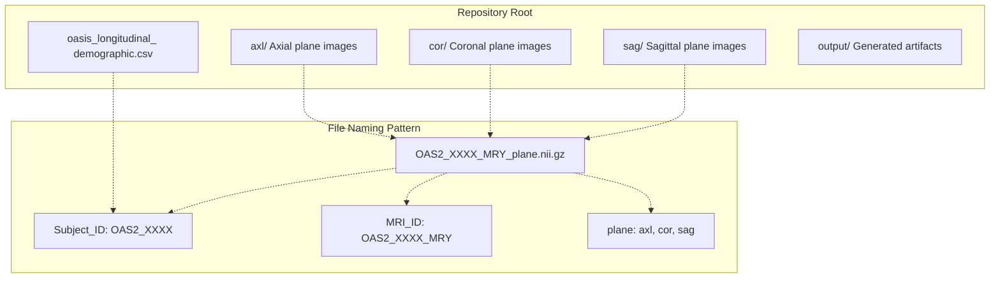
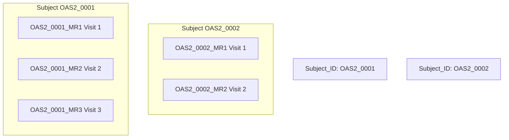
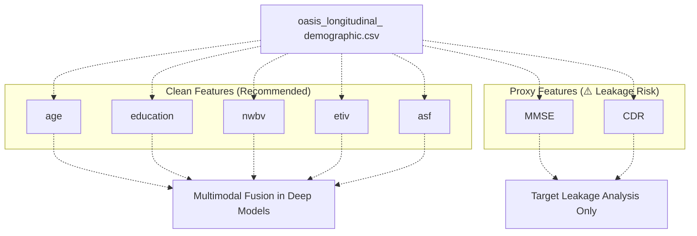
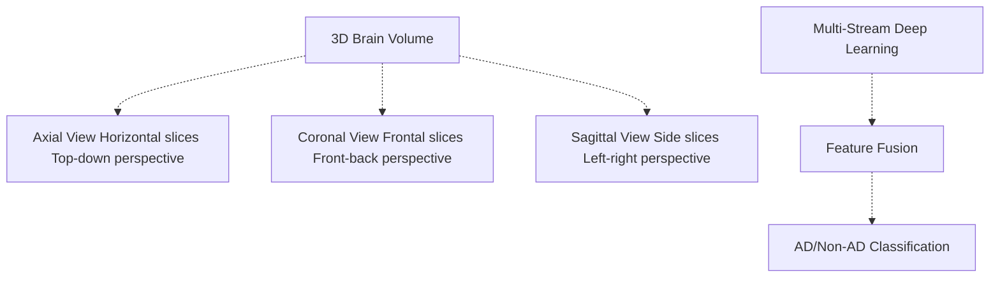
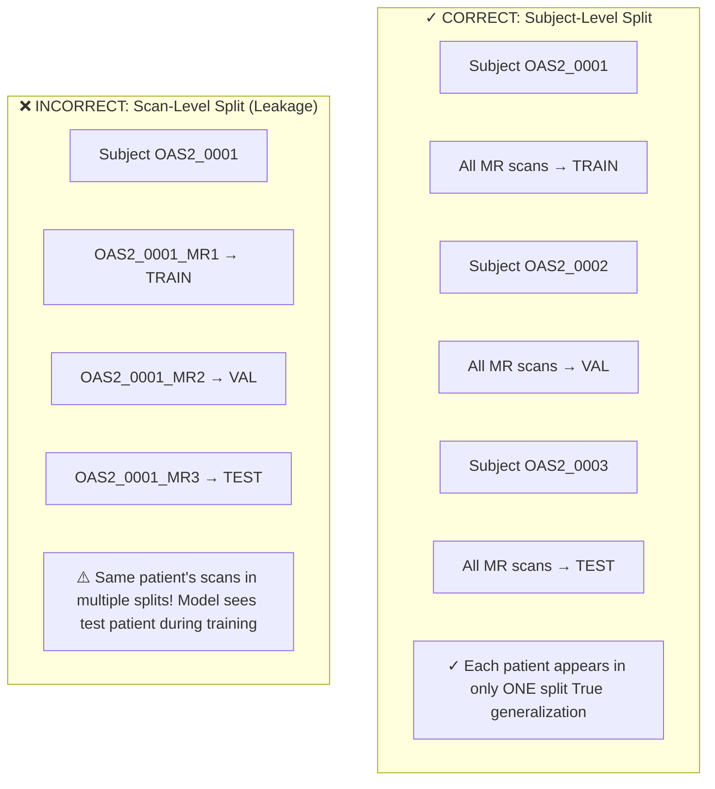
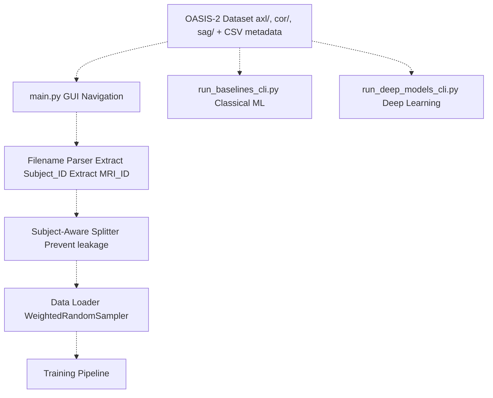

# OASIS-2 Dataset Overview

> **Relevant source files**
> * [README.md](https://github.com/ThalesMMS/brain-mri-pipelines-py/blob/cd9d51a5/README.md)
> * [axl/OAS2_0001_MR1_axl.nii.gz](https://github.com/ThalesMMS/brain-mri-pipelines-py/blob/cd9d51a5/axl/OAS2_0001_MR1_axl.nii.gz)
> * [axl/OAS2_0002_MR1_axl.nii.gz](https://github.com/ThalesMMS/brain-mri-pipelines-py/blob/cd9d51a5/axl/OAS2_0002_MR1_axl.nii.gz)
> * [axl/OAS2_0004_MR1_axl.nii.gz](https://github.com/ThalesMMS/brain-mri-pipelines-py/blob/cd9d51a5/axl/OAS2_0004_MR1_axl.nii.gz)

## Purpose and Scope

This page introduces the **Open Access Series of Imaging Studies (OASIS-2)** dataset, the primary data source for this framework. It covers the dataset's structure, longitudinal design, clinical metadata, and relevance to Alzheimer's disease (AD) classification research.

For details on the NIfTI file format used to store MRI images, see [NIfTI File Format](4b%20NIfTI-File-Format.md). For information on directory organization and file naming conventions, see [Directory Organization & File Naming](4c%20Directory-Organization-&-File-Naming.md). For specifics on clinical feature extraction and usage, see [Clinical Metadata](4d%20Clinical-Metadata.md).

---

## What is OASIS-2?

**OASIS-2** (Open Access Series of Imaging Studies, Version 2) is a longitudinal neuroimaging dataset designed for research on normal aging and Alzheimer's disease. The dataset contains:

* **MRI scans** from multiple subjects over time
* **Clinical and demographic data** including cognitive assessments
* **Anatomical planes** captured in three orientations: axial, coronal, and sagittal
* **Binary classification labels** for Alzheimer's disease (AD) vs Non-AD based on clinical assessments

The dataset is publicly available but not bundled with this repository. Users must organize it according to the structure described in [Directory Organization & File Naming](4c%20Directory-Organization-&-File-Naming.md).

**Sources:** [README.md L1-L29](https://github.com/ThalesMMS/brain-mri-pipelines-py/blob/cd9d51a5/README.md#L1-L29)

---

## Dataset Structure and Organization

The OASIS-2 dataset is organized into plane-specific directories at the repository root. Each directory contains NIfTI files representing MRI slices from different subjects and time points.

### File Organization Diagram

**Sources:** README.md

### Directory Contents

| Directory | Purpose | Required | Example File |
| --- | --- | --- | --- |
| `axl/` | Axial plane MRI slices | Yes (for GUI) | `OAS2_0001_MR1_axl.nii.gz` |
| `cor/` | Coronal plane MRI slices | Optional | `OAS2_0001_MR1_cor.nii.gz` |
| `sag/` | Sagittal plane MRI slices | Optional | `OAS2_0001_MR1_sag.nii.gz` |
| Root | Clinical metadata CSV | Yes | `oasis_longitudinal_demographic.csv` |

The axial directory is **required** for the GUI functionality, while coronal and sagittal directories are optional but enable multi-stream deep learning models to leverage multiple anatomical views simultaneously.

**Sources:** [README.md L29-L38](https://github.com/ThalesMMS/brain-mri-pipelines-py/blob/cd9d51a5/README.md#L29-L38)

---

## Longitudinal Nature: Subject IDs vs MRI IDs

A critical aspect of OASIS-2 is its **longitudinal design**: the same patient may have multiple MRI scans taken at different time points. This creates a hierarchical relationship between subjects and scans.

### Subject-Level vs Scan-Level Identity

### File Naming Components

From the pattern `OAS2_XXXX_MRY_plane.nii.gz`:

* **`OAS2_XXXX`** = **Subject_ID**: Unique identifier for the patient
* **`OAS2_XXXX_MRY`** = **MRI_ID**: Unique identifier for a specific scan session
* **`Y`** = Visit number (1, 2, 3, etc.)
* **`plane`** = Anatomical orientation (`axl`, `cor`, `sag`)

**Examples:**

* `OAS2_0001_MR1_axl.nii.gz` → Subject 0001, Visit 1, Axial plane
* `OAS2_0001_MR2_axl.nii.gz` → Subject 0001, Visit 2, Axial plane (same patient, different time)
* `OAS2_0002_MR1_axl.nii.gz` → Subject 0002, Visit 1, Axial plane (different patient)

**Sources:** README.md

 [axl/OAS2_0001_MR1_axl.nii.gz L1](https://github.com/ThalesMMS/brain-mri-pipelines-py/blob/cd9d51a5/axl/OAS2_0001_MR1_axl.nii.gz#L1-L1)

 [axl/OAS2_0002_MR1_axl.nii.gz L1](https://github.com/ThalesMMS/brain-mri-pipelines-py/blob/cd9d51a5/axl/OAS2_0002_MR1_axl.nii.gz#L1-L1)

---

## Clinical Metadata and Features

The `oasis_longitudinal_demographic.csv` file contains clinical and demographic information for each MRI scan. This data is used for **multimodal fusion** in deep learning models.

### Clinical Feature Set

| Feature | Description | Type | Usage |
| --- | --- | --- | --- |
| `age` | Patient age at scan time | Continuous | Demographic covariate |
| `education` | Years of education | Continuous | Demographic covariate |
| `nwbv` | Normalized Whole Brain Volume | Continuous | Volumetric measure |
| `etiv` | Estimated Total Intracranial Volume | Continuous | Volumetric measure |
| `asf` | Atlas Scaling Factor | Continuous | Normalization factor |
| `MMSE` | Mini-Mental State Examination | Discrete | ⚠️ **Proxy for diagnosis** |
| `CDR` | Clinical Dementia Rating | Discrete | ⚠️ **Proxy for diagnosis** |

### Feature Usage Diagram

### ⚠️ MMSE and CDR Leakage Warning

**MMSE** (Mini-Mental State Examination) and **CDR** (Clinical Dementia Rating) scores are strong proxies for dementia diagnosis. Using these features for AD classification creates **target leakage** and artificially inflates model performance.

The codebase supports both scenarios:

* **Clean scenario** (recommended): Uses imaging data + demographic covariates (age, education, nwbv, etiv, asf)
* **Leakage scenario** (for analysis): Includes MMSE/CDR to demonstrate the extent of proxy leakage

**Sources:** [README.md L11-L12](https://github.com/ThalesMMS/brain-mri-pipelines-py/blob/cd9d51a5/README.md#L11-L12)

 **Sources**: [Project overview and setup](https://github.com/ThalesMMS/brain-mri-pipelines-py/blob/cd9d51a5/README.md#L160-L169)

---

## Relevance to Alzheimer's Disease Detection

OASIS-2 is specifically designed for studying Alzheimer's disease progression and normal aging. The dataset enables:

### Research Applications

1. **Binary Classification**: AD vs Non-AD diagnosis
2. **Longitudinal Analysis**: Disease progression tracking over time
3. **Multi-view Learning**: Leveraging three anatomical planes (axial, coronal, sagittal)
4. **Multimodal Integration**: Combining imaging and clinical data
5. **Transfer Learning**: Pretraining on medical imaging datasets

### Why Three Anatomical Planes?

Each anatomical plane captures different structural information:

* **Axial**: Hippocampal atrophy, ventricular enlargement (horizontal cross-sections)
* **Coronal**: Frontal lobe changes, cortical thinning (frontal cross-sections)
* **Sagittal**: Medial temporal lobe atrophy, corpus callosum changes (side cross-sections)

The **multi-stream architecture** processes all three planes independently through deep learning backbones, then fuses their embeddings for improved classification accuracy.

**Sources:** [README.md L1-L12](https://github.com/ThalesMMS/brain-mri-pipelines-py/blob/cd9d51a5/README.md#L1-L12)

 [README.md L9-L11](https://github.com/ThalesMMS/brain-mri-pipelines-py/blob/cd9d51a5/README.md#L9-L11)

---

## Data Integrity and Subject-Level Splitting

The longitudinal nature of OASIS-2 introduces a critical data integrity requirement: **subject-level splitting** to prevent data leakage.

### The Leakage Problem

### Implementation in Codebase

The framework enforces subject-level splitting through:

1. **Filename Parsing**: Extracts `Subject_ID` from `OAS2_XXXX_MRY_plane.nii.gz` pattern
2. **Subject-Aware Splitter**: Groups all scans by `Subject_ID` before splitting
3. **Validation**: Ensures no subject appears in multiple partitions

This mechanism is described in detail in [Subject-Level Splitting & Leakage Prevention](3d%20Subject-Level-Splitting-&-Leakage-Prevention.md).

**Key Quote from Documentation:**

> "The pipeline relies on this naming structure to map images to subjects... Enforces **subject-level splits** to ensure all MRI scans from a single patient remain strictly within one partition (Train, Validation, or Test)."

**Sources:** README.md

 [README.md L23](https://github.com/ThalesMMS/brain-mri-pipelines-py/blob/cd9d51a5/README.md#L23-L23)

---

## Dataset Statistics and Characteristics

### Typical Dataset Composition

| Metric | Approximate Value |
| --- | --- |
| Total NIfTI files | ~150 per plane |
| Unique subjects | ~150 patients |
| Scans per subject | 1-4 visits (longitudinal) |
| Anatomical planes | 3 (axial, coronal, sagittal) |
| Image format | NIfTI-1 (.nii.gz) |
| Class distribution | Imbalanced (more Non-AD than AD) |

### Class Imbalance Handling

OASIS-2 exhibits class imbalance typical of medical datasets. The framework addresses this through:

* **WeightedRandomSampler**: Oversamples minority class during training
* **Class-Weighted Loss**: Penalizes misclassification of minority class more heavily
* **Focal Loss**: Focuses training on hard-to-classify examples
* **Balanced Accuracy**: Primary evaluation metric robust to imbalance

These mechanisms are detailed in [Loss Functions & Class Imbalance](#5.5) and [Evaluation Metrics](#5.6).

**Sources:** [Project overview and setup](https://github.com/ThalesMMS/brain-mri-pipelines-py/blob/cd9d51a5/README.md#L162-L167)

---

## Integration with Codebase

### Data Access Points

The OASIS-2 dataset is accessed through multiple entry points in the codebase:

### File Path References

The dataset structure is hardcoded in the repository organization:

* MRI images must reside in `axl/`, `cor/`, `sag/` directories relative to repository root
* Clinical metadata must be named `oasis_longitudinal_demographic.csv` at repository root
* Output artifacts are generated in `output/` directory

**Sources:** [README.md L29-L38](https://github.com/ThalesMMS/brain-mri-pipelines-py/blob/cd9d51a5/README.md#L29-L38)

 **Sources**: [Project overview and setup](https://github.com/ThalesMMS/brain-mri-pipelines-py/blob/cd9d51a5/README.md#L177-L196)

---

## Summary

The OASIS-2 dataset provides the foundation for all experiments in this framework:

1. **Longitudinal Design**: Multiple scans per subject enable disease progression studies
2. **Multi-View Data**: Three anatomical planes support multi-stream architectures
3. **Clinical Integration**: Rich metadata enables multimodal deep learning
4. **Subject-Level Structure**: Hierarchical organization requires careful splitting to prevent leakage
5. **Class Imbalance**: Typical medical dataset characteristics necessitate specialized handling

For implementation details on how this data flows through the system, see [Data Processing Pipeline](3b%20Data-Processing-Pipeline.md) and [Data Loading & Augmentation](4e%20Loss-Functions-&-Class-Imbalance.md).

**Sources:** README.md

 **Sources**: [Project overview and setup](https://github.com/ThalesMMS/brain-mri-pipelines-py/blob/cd9d51a5/README.md#L160-L169)

### On this page

* [OASIS-2 Dataset Overview](#4.1-oasis-2-dataset-overview)
* [Purpose and Scope](#4.1-purpose-and-scope)
* [What is OASIS-2?](#4.1-what-is-oasis-2)
* [Dataset Structure and Organization](#4.1-dataset-structure-and-organization)
* [File Organization Diagram](#4.1-file-organization-diagram)
* [Directory Contents](#4.1-directory-contents)
* [Longitudinal Nature: Subject IDs vs MRI IDs](#4.1-longitudinal-nature-subject-ids-vs-mri-ids)
* [Subject-Level vs Scan-Level Identity](#4.1-subject-level-vs-scan-level-identity)
* [File Naming Components](#4.1-file-naming-components)
* [Clinical Metadata and Features](#4.1-clinical-metadata-and-features)
* [Clinical Feature Set](#4.1-clinical-feature-set)
* [Feature Usage Diagram](#4.1-feature-usage-diagram)
* [⚠️ MMSE and CDR Leakage Warning](#4.1--mmse-and-cdr-leakage-warning)
* [Relevance to Alzheimer's Disease Detection](#4.1-relevance-to-alzheimers-disease-detection)
* [Research Applications](#4.1-research-applications)
* [Why Three Anatomical Planes?](#4.1-why-three-anatomical-planes)
* [Data Integrity and Subject-Level Splitting](#4.1-data-integrity-and-subject-level-splitting)
* [The Leakage Problem](#4.1-the-leakage-problem)
* [Implementation in Codebase](#4.1-implementation-in-codebase)
* [Dataset Statistics and Characteristics](#4.1-dataset-statistics-and-characteristics)
* [Typical Dataset Composition](#4.1-typical-dataset-composition)
* [Class Imbalance Handling](#4.1-class-imbalance-handling)
* [Integration with Codebase](#4.1-integration-with-codebase)
* [Data Access Points](#4.1-data-access-points)
* [File Path References](#4.1-file-path-references)
* [Summary](#4.1-summary)

Ask Devin about brain-mri-pipelines-py