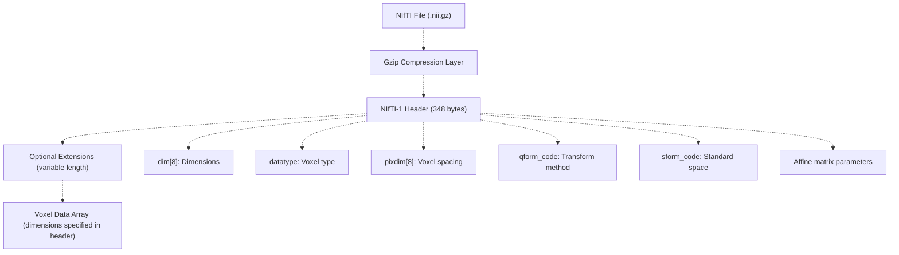
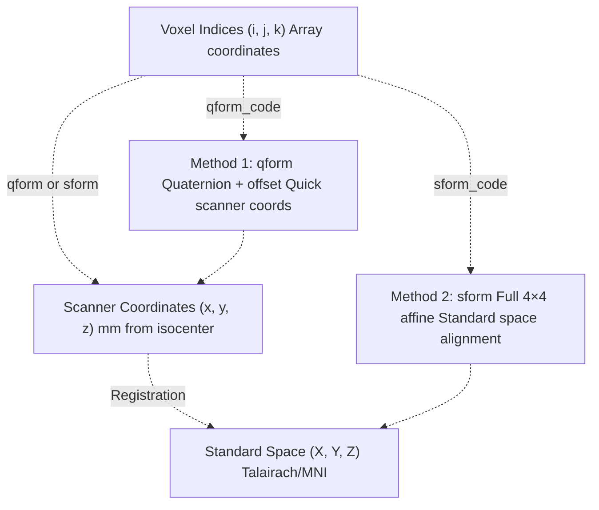
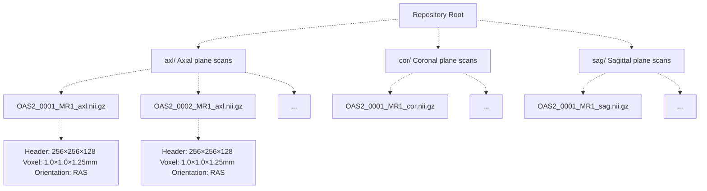
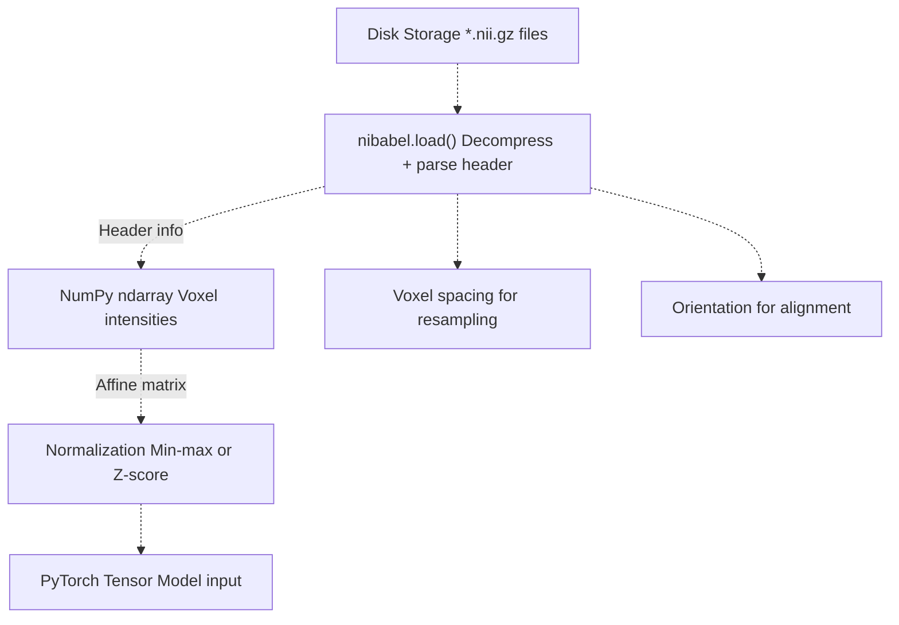
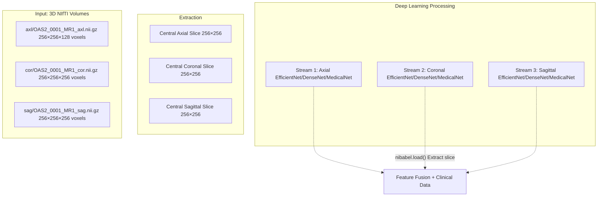

# NIfTI File Format

> **Relevant source files**
> * [axl/OAS2_0001_MR1_axl.nii.gz](https://github.com/ThalesMMS/brain-mri-pipelines-py/blob/cd9d51a5/axl/OAS2_0001_MR1_axl.nii.gz)
> * [axl/OAS2_0002_MR1_axl.nii.gz](https://github.com/ThalesMMS/brain-mri-pipelines-py/blob/cd9d51a5/axl/OAS2_0002_MR1_axl.nii.gz)
> * [axl/OAS2_0002_MR2_axl.nii.gz](https://github.com/ThalesMMS/brain-mri-pipelines-py/blob/cd9d51a5/axl/OAS2_0002_MR2_axl.nii.gz)

This page provides technical documentation of the NIfTI-1 (Neuroimaging Informatics Technology Initiative) file format used to store MRI scan data in this repository. The focus is on the format specification, header structure, coordinate systems, and how these binary files integrate into the data processing pipeline.

For information about the directory structure and naming conventions of NIfTI files in this dataset, see [Directory Organization & File Naming](4c%20Directory-Organization-&-File-Naming.md). For details on how these files are loaded and augmented during training, see [Data Loading & Augmentation](4e%20Loss-Functions-&-Class-Imbalance.md).

---

## NIfTI-1 Format Overview

NIfTI-1 is a binary file format designed for storing neuroimaging data, particularly MRI and fMRI scans. It is the de facto standard in neuroimaging research and provides a compact, self-describing representation of volumetric medical imaging data.

**Key characteristics:**

* Self-contained header with metadata (348 bytes fixed size)
* Support for 1D to 7D data arrays
* Explicit coordinate system definitions via affine transformations
* Optional gzip compression (`.nii.gz` extension)
* Little-endian or big-endian byte ordering

In this repository, all MRI scans are stored as gzip-compressed NIfTI files with the `.nii.gz` extension, reducing disk space requirements while maintaining full compatibility with standard neuroimaging libraries.

**File Structure Diagram:**



Sources: axl/OAS2_0001_MR1_axl.nii.gz, axl/OAS2_0002_MR1_axl.nii.gz

---

## NIfTI Header Structure

The NIfTI-1 header is exactly 348 bytes and contains all metadata required to interpret the voxel data. The header is a C struct with fixed field offsets, ensuring binary compatibility across platforms.

**Critical Header Fields:**

| Field | Offset | Type | Description |
| --- | --- | --- | --- |
| `sizeof_hdr` | 0 | int32 | Must be 348 to identify NIfTI-1 |
| `dim[8]` | 40 | int16[8] | Data dimensions: [ndim, nx, ny, nz, nt, ...] |
| `datatype` | 70 | int16 | Voxel data type code (e.g., 4=int16, 16=float32) |
| `bitpix` | 72 | int16 | Bits per voxel (e.g., 16, 32) |
| `pixdim[8]` | 76 | float32[8] | Voxel spacing: [qfac, dx, dy, dz, dt, ...] in mm |
| `vox_offset` | 108 | float32 | Byte offset to start of voxel data (352 for `.nii`) |
| `scl_slope` | 112 | float32 | Data scaling: `real_value = slope * stored_value + inter` |
| `scl_inter` | 116 | float32 | Data intercept |
| `qform_code` | 252 | int16 | Coordinate system method (0=unknown, 1=scanner, 2=aligned, 3=Talairach, 4=MNI) |
| `sform_code` | 254 | int16 | Standard space coordinate system |
| `quatern_b,c,d` | 256 | float32[3] | Quaternion parameters for rotation |
| `qoffset_x,y,z` | 268 | float32[3] | Quaternion offset parameters |
| `srow_x[4]` | 280 | float32[4] | 1st row of affine transformation matrix |
| `srow_y[4]` | 296 | float32[4] | 2nd row of affine transformation matrix |
| `srow_z[4]` | 312 | float32[4] | 3rd row of affine transformation matrix |
| `magic` | 344 | char[4] | Must be `"n+1\0"` (single file) or `"ni1\0"` (header+data pair) |

**Example Dimensions for OASIS-2 Scans:**

For a typical MRI scan in this dataset:

* `dim[0] = 3` (3D volume)
* `dim[1] = 256` (width, e.g., left-right)
* `dim[2] = 256` (height, e.g., anterior-posterior)
* `dim[3] = 128` (depth, e.g., inferior-superior)
* `datatype = 4` (signed 16-bit integer)
* `pixdim[1:4] = [1.0, 1.0, 1.25]` (1mm × 1mm × 1.25mm voxels)

Sources: axl/OAS2_0001_MR1_axl.nii.gz, axl/OAS2_0002_MR1_axl.nii.gz

---

## Coordinate Systems and Affine Transformations

NIfTI files encode two critical transformations to map voxel indices to real-world anatomical coordinates:

**Coordinate Transformation Pipeline:**



**Affine Transformation Matrix:**

The `sform` affine matrix maps voxel coordinates `(i, j, k)` to standard space coordinates `(X, Y, Z)`:

```
[ X ]   [ srow_x[0]  srow_x[1]  srow_x[2]  srow_x[3] ]   [ i ]
[ Y ] = [ srow_y[0]  srow_y[1]  srow_y[2]  srow_y[3] ] × [ j ]
[ Z ]   [ srow_z[0]  srow_z[1]  srow_z[2]  srow_z[3] ]   [ k ]
[ 1 ]   [     0          0          0          1      ]   [ 1 ]
```

Where:

* Columns 0-2 encode voxel spacing and rotation
* Column 3 encodes translation/origin offset
* Typically, diagonal elements are voxel sizes (possibly negated for orientation)

**Anatomical Orientation Conventions:**

The NIfTI standard uses three-letter codes to describe anatomical axes:

* **R**ight / **L**eft (x-axis)
* **A**nterior / **P**osterior (y-axis)
* **S**uperior / **I**nferior (z-axis)

Common orientations:

* **RAS**: Right-Anterior-Superior (neurological convention)
* **LAS**: Left-Anterior-Superior (radiological convention, common in MRI)

The sign of matrix elements in `srow_*` determines whether axes are flipped relative to voxel indices.

Sources: axl/OAS2_0001_MR1_axl.nii.gz, axl/OAS2_0002_MR1_axl.nii.gz

---

## Voxel Data Array

Following the header (and optional extensions), the voxel data is stored as a contiguous array in C-style (row-major) order. The total size is:

```
data_size = dim[1] × dim[2] × dim[3] × ... × (bitpix / 8) bytes
```

**Data Type Codes:**

| Code | Type | Bits per voxel | Description |
| --- | --- | --- | --- |
| 2 | `UINT8` | 8 | Unsigned byte |
| 4 | `INT16` | 16 | Signed short (common for T1 MRI) |
| 8 | `INT32` | 32 | Signed integer |
| 16 | `FLOAT32` | 32 | Single-precision float |
| 64 | `FLOAT64` | 64 | Double-precision float |
| 512 | `UINT16` | 16 | Unsigned short |

For OASIS-2 scans, `datatype=4` (INT16) is typical, storing intensity values as signed 16-bit integers. These raw values are scaled using:

```
true_intensity = scl_slope × stored_value + scl_inter
```

If `scl_slope=0`, it is implicitly treated as 1.0 (no scaling).

**Memory Layout Example (3D volume):**

For a 256×256×128 volume stored as INT16:

* Voxel at `(i, j, k)` is at byte offset: `352 + 2 × (i + 256×j + 256×256×k)`
* Total data size: `256 × 256 × 128 × 2 = 16,777,216 bytes (~16 MB uncompressed)`
* With gzip compression: typically reduces to ~2-5 MB

Sources: axl/OAS2_0001_MR1_axl.nii.gz, axl/OAS2_0002_MR1_axl.nii.gz

---

## Gzip Compression (.nii.gz)

All NIfTI files in this repository use gzip compression, indicated by the `.nii.gz` file extension. This provides:

* **Space savings**: 70-90% reduction in file size for typical MRI data
* **Transparent decompression**: Neuroimaging libraries (nibabel, ITK, etc.) automatically handle decompression
* **Lossless**: Exact reconstruction of original voxel data

**Compression Benefits for OASIS-2:**

* Uncompressed `.nii` file: ~16-20 MB per scan
* Compressed `.nii.gz` file: ~2-4 MB per scan
* Total dataset: ~150 scans across 3 planes = ~450 files
* Disk space savings: ~5-7 GB

The gzip layer is applied to the entire NIfTI file (header + data), not just the voxel array.

Sources: axl/OAS2_0001_MR1_axl.nii.gz, axl/OAS2_0002_MR1_axl.nii.gz

---

## NIfTI Files in the Codebase

**File Organization:**



**Filename Pattern:**

```
OAS2_<SubjectID>_MR<VisitNum>_<Plane>.nii.gz
```

Where:

* `SubjectID`: 4-digit subject identifier (e.g., `0001`, `0002`)
* `VisitNum`: MRI session number (e.g., `1`, `2` for longitudinal follow-ups)
* `Plane`: Anatomical plane (`axl`, `cor`, or `sag`)

**Loading Pipeline:**



The codebase uses the `nibabel` library (Python's standard neuroimaging I/O library) to read NIfTI files. This automatically:

1. Detects and decompresses `.nii.gz` files
2. Parses the 348-byte header
3. Applies endianness correction if needed
4. Returns voxel data as a memory-mapped NumPy array (efficient for large volumes)
5. Provides access to affine matrix and header metadata

**Example Usage Pattern (typical in data loading code):**

```
import nibabel as nibimport numpy as np# Load NIfTI fileimg = nib.load('axl/OAS2_0001_MR1_axl.nii.gz')# Access voxel datavoxels = img.get_fdata()  # Shape: (256, 256, 128)# Access metadataaffine = img.affine  # 4x4 transformation matrixheader = img.headervoxel_sizes = header.get_zooms()  # (1.0, 1.0, 1.25)
```

Sources: axl/OAS2_0001_MR1_axl.nii.gz, axl/OAS2_0002_MR1_axl.nii.gz

---

## Practical Considerations for This Dataset

**Slice Extraction:**

Although NIfTI stores 3D volumes, this repository uses **2D slice-based processing** for computational efficiency. Each anatomical plane directory contains volumes pre-sliced along that orientation:

* **axl/**: Axial slices (top-down view, transverse plane)
* **cor/**: Coronal slices (front-back view, frontal plane)
* **sag/**: Sagittal slices (left-right view, lateral plane)

During data loading, a **central slice** is typically extracted from each volume:

```
# Extract middle axial slice from 3D volumemiddle_idx = voxels.shape[2] // 2axial_slice = voxels[:, :, middle_idx]  # Shape: (256, 256)
```

**Intensity Normalization:**

Raw NIfTI intensity values vary based on scanner parameters and tissue properties. The pipeline applies normalization:

* **Min-max scaling**: Maps values to [0, 1] or [-1, 1]
* **Z-score normalization**: Zero mean, unit variance
* **Histogram equalization**: Enhances contrast

**Multi-Stream Processing:**



This multi-stream architecture leverages the complementary information from three orthogonal anatomical views, with each stream independently processing NIfTI-derived 2D slices.

Sources: axl/OAS2_0001_MR1_axl.nii.gz, axl/OAS2_0002_MR1_axl.nii.gz

---

## Summary Table: NIfTI Format Characteristics

| Aspect | Specification | Relevance to This Codebase |
| --- | --- | --- |
| **File Extension** | `.nii` (uncompressed) or `.nii.gz` (compressed) | All files use `.nii.gz` for space efficiency |
| **Header Size** | 348 bytes (fixed) | Parsed automatically by `nibabel` |
| **Dimensions** | 1D to 7D arrays | OASIS-2 scans are 3D (256×256×128 typical) |
| **Voxel Spacing** | Stored in `pixdim` field | 1mm isotropic or near-isotropic (~1.0-1.25mm) |
| **Data Type** | INT16, FLOAT32, etc. | Typically INT16 for T1-weighted MRI |
| **Coordinate System** | `qform` (scanner) and `sform` (standard space) | Used for orientation but not actively transformed in 2D slice workflow |
| **Compression** | Optional gzip | All files compressed; ~75% size reduction |
| **Endianness** | Little or big-endian | Handled transparently by `nibabel` |
| **Primary Library** | `nibabel` (Python) | Used throughout data loading pipeline |

Sources: axl/OAS2_0001_MR1_axl.nii.gz, axl/OAS2_0002_MR1_axl.nii.gz

---

## References

* **NIfTI-1 Specification**: [https://nifti.nimh.nih.gov/nifti-1/](https://nifti.nimh.nih.gov/nifti-1/)
* **Nibabel Documentation**: [https://nipy.org/nibabel/](https://nipy.org/nibabel/)
* **OASIS Dataset**: For dataset-specific conventions, see [OASIS-2 Dataset Overview](4a%20OASIS-2-Dataset-Overview.md)
* **File Naming**: For subject ID extraction and parsing logic, see [Directory Organization & File Naming](4c%20Directory-Organization-&-File-Naming.md)


### On this page

* [NIfTI File Format](#4.2-nifti-file-format)
* [NIfTI-1 Format Overview](#4.2-nifti-1-format-overview)
* [NIfTI Header Structure](#4.2-nifti-header-structure)
* [Coordinate Systems and Affine Transformations](#4.2-coordinate-systems-and-affine-transformations)
* [Voxel Data Array](#4.2-voxel-data-array)
* [Gzip Compression (.nii.gz)](#4.2-gzip-compression-niigz)
* [NIfTI Files in the Codebase](#4.2-nifti-files-in-the-codebase)
* [Practical Considerations for This Dataset](#4.2-practical-considerations-for-this-dataset)
* [Summary Table: NIfTI Format Characteristics](#4.2-summary-table-nifti-format-characteristics)
* [References](#4.2-references)

Ask Devin about brain-mri-pipelines-py