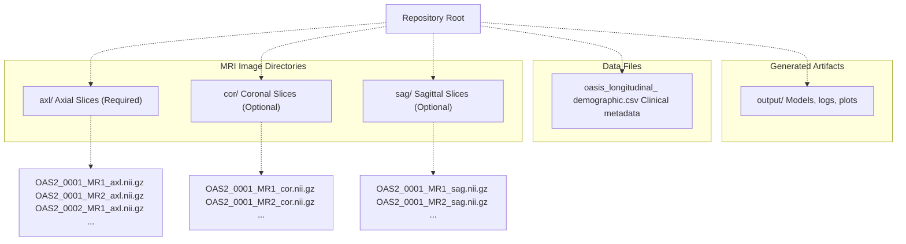
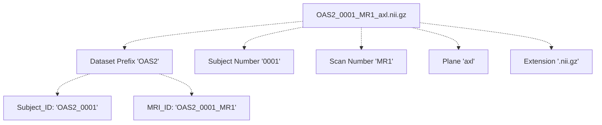
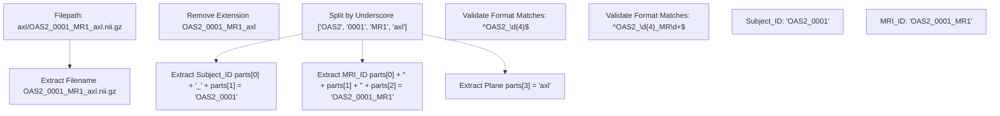
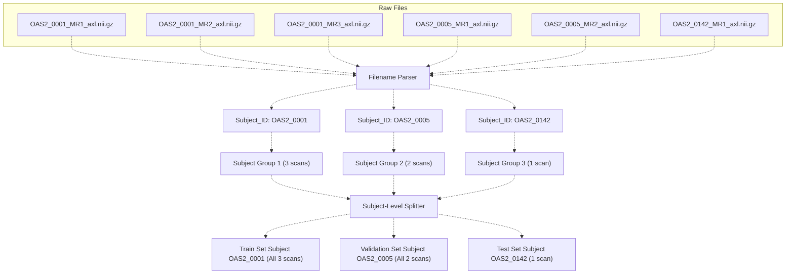
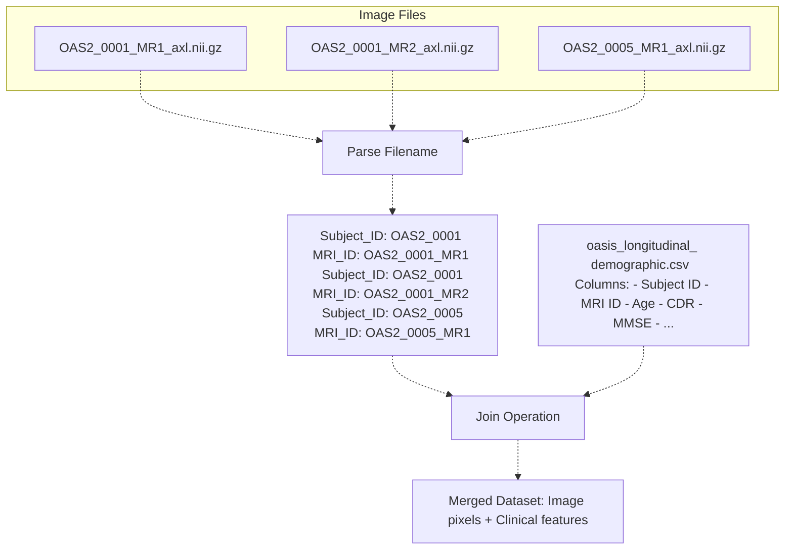

# Directory Organization & File Naming

> **Relevant source files**
> * [README.md](https://github.com/ThalesMMS/brain-mri-pipelines-py/blob/cd9d51a5/README.md)
> * [axl/OAS2_0001_MR1_axl.nii.gz](https://github.com/ThalesMMS/brain-mri-pipelines-py/blob/cd9d51a5/axl/OAS2_0001_MR1_axl.nii.gz)
> * [axl/OAS2_0005_MR1_axl.nii.gz](https://github.com/ThalesMMS/brain-mri-pipelines-py/blob/cd9d51a5/axl/OAS2_0005_MR1_axl.nii.gz)
> * [axl/OAS2_0007_MR1_axl.nii.gz](https://github.com/ThalesMMS/brain-mri-pipelines-py/blob/cd9d51a5/axl/OAS2_0007_MR1_axl.nii.gz)

This page documents the directory structure and file naming conventions used for organizing MRI scan data in the OASIS-2 dataset. These conventions are critical for the system's ability to parse subject identifiers, associate scans with clinical metadata, and enforce subject-level splitting to prevent data leakage.

For information about the clinical metadata CSV structure, see [Clinical Metadata](#4.4). For details on how subject-level splitting prevents leakage, see [Subject-Level Splitting & Leakage Prevention](#3.4).

---

## Directory Structure Overview

The repository expects MRI scan data to be organized in three directories corresponding to the three anatomical planes:

```markdown
<repo-root>/
├── axl/                        # Axial plane images
├── cor/                        # Coronal plane images (optional)
├── sag/                        # Sagittal plane images (optional)
├── oasis_longitudinal_demographic.csv
└── output/                     # Generated artifacts
```

**Directory Diagram: Data Organization**



Sources: [README.md L29-L38](https://github.com/ThalesMMS/brain-mri-pipelines-py/blob/cd9d51a5/README.md#L29-L38)

### Directory Requirements

| Directory | Status | Purpose | Deep Learning Support | GUI Support |
| --- | --- | --- | --- | --- |
| `axl/` | **Required** | Axial plane slices | Yes | Yes (Required) |
| `cor/` | Optional | Coronal plane slices | Yes | No |
| `sag/` | Optional | Sagittal plane slices | Yes | No |

* **GUI (main.py)**: Requires `axl/` directory for visualization and navigation
* **Deep Learning Models**: Support single-stream (one plane) or multi-stream (up to three planes)
* **Baselines**: Use extracted features; directory structure not directly accessed

Sources: [README.md L10-L11](https://github.com/ThalesMMS/brain-mri-pipelines-py/blob/cd9d51a5/README.md#L10-L11)

 [README.md L33-L35](https://github.com/ThalesMMS/brain-mri-pipelines-py/blob/cd9d51a5/README.md#L33-L35)

---

## File Naming Convention

All MRI scan files follow a strict naming pattern that encodes patient and scan identifiers:

### Pattern Structure

```
OAS2_XXXX_MRY_plane.extension
└──┬──┘ └┬─┘ └┬┘ └─┬─┘ └───┬───┘
   │     │    │    │       │
   │     │    │    │       └─ File extension (.nii.gz, .nii, .png, .jpg)
   │     │    │    └───────── Anatomical plane (axl, cor, sag)
   │     │    └────────────── MRI scan number (MR1, MR2, ...)
   │     └─────────────────── Subject number (4 digits, zero-padded)
   └───────────────────────── Dataset prefix (OASIS-2)
```

**Filename Component Breakdown**



Sources: [README.md L40-L49](https://github.com/ThalesMMS/brain-mri-pipelines-py/blob/cd9d51a5/README.md#L40-L49)

### Component Definitions

| Component | Format | Example | Description |
| --- | --- | --- | --- |
| Dataset Prefix | `OAS2` | `OAS2` | Fixed identifier for OASIS-2 dataset |
| Subject Number | `XXXX` (4 digits) | `0001`, `0005`, `0142` | Zero-padded subject identifier |
| Scan Number | `MRY` | `MR1`, `MR2`, `MR3` | Sequential scan identifier for longitudinal visits |
| Plane | `plane` | `axl`, `cor`, `sag` | Anatomical plane abbreviation |
| Extension | Various | `.nii.gz`, `.nii`, `.png`, `.jpg` | File format |

### Derived Identifiers

The system extracts two critical identifiers from filenames:

**Subject_ID**: `OAS2_XXXX`

* Uniquely identifies a patient across all scans
* Example: `OAS2_0001`, `OAS2_0005`
* Used for subject-level splitting (critical for leakage prevention)
* Links to `Subject ID` column in clinical CSV

**MRI_ID**: `OAS2_XXXX_MRY`

* Uniquely identifies a specific scan session
* Example: `OAS2_0001_MR1`, `OAS2_0001_MR2`
* Links to `MRI ID` column in clinical CSV
* Represents a single time point in longitudinal data

Sources: [README.md L44-L48](https://github.com/ThalesMMS/brain-mri-pipelines-py/blob/cd9d51a5/README.md#L44-L48)

---

## Filename Examples

**Example 1: Single Subject, Multiple Time Points**

```markdown
axl/OAS2_0001_MR1_axl.nii.gz    # Subject OAS2_0001, first visit
axl/OAS2_0001_MR2_axl.nii.gz    # Subject OAS2_0001, second visit
axl/OAS2_0001_MR3_axl.nii.gz    # Subject OAS2_0001, third visit
```

These three files represent **longitudinal scans** from the same patient. The subject-level splitting mechanism ensures all three remain in the same data partition (Train/Val/Test) to prevent leakage.

**Example 2: Multiple Subjects, Same Plane**

```markdown
axl/OAS2_0001_MR1_axl.nii.gz    # Subject OAS2_0001
axl/OAS2_0005_MR1_axl.nii.gz    # Subject OAS2_0005
axl/OAS2_0142_MR1_axl.nii.gz    # Subject OAS2_0142
```

**Example 3: Same Scan, Multiple Planes**

```markdown
axl/OAS2_0001_MR1_axl.nii.gz    # Axial plane
cor/OAS2_0001_MR1_cor.nii.gz    # Coronal plane
sag/OAS2_0001_MR1_sag.nii.gz    # Sagittal plane
```

These three files represent the **same scan session** (`OAS2_0001_MR1`) viewed from different anatomical planes. Multi-stream models process all three simultaneously.

Sources: [README.md L40-L49](https://github.com/ThalesMMS/brain-mri-pipelines-py/blob/cd9d51a5/README.md#L40-L49)

 [axl/OAS2_0001_MR1_axl.nii.gz L1](https://github.com/ThalesMMS/brain-mri-pipelines-py/blob/cd9d51a5/axl/OAS2_0001_MR1_axl.nii.gz#L1-L1)

 [axl/OAS2_0005_MR1_axl.nii.gz L1](https://github.com/ThalesMMS/brain-mri-pipelines-py/blob/cd9d51a5/axl/OAS2_0005_MR1_axl.nii.gz#L1-L1)

---

## Supported File Extensions

The pipeline supports multiple image formats for maximum flexibility:

| Extension | Format | Typical Use | Notes |
| --- | --- | --- | --- |
| `.nii.gz` | Compressed NIfTI-1 | Primary format | Standard neuroimaging format with metadata |
| `.nii` | Uncompressed NIfTI-1 | Alternative | Larger file size, faster loading |
| `.png` | PNG Image | Converted/processed data | Loses 3D metadata |
| `.jpg` | JPEG Image | Converted/processed data | Lossy compression, loses metadata |

**Recommendation**: Use `.nii.gz` format as it preserves:

* 3D voxel dimensions and orientation
* Affine transformation matrices
* Scanner parameters and acquisition metadata

Sources: [README.md L44](https://github.com/ThalesMMS/brain-mri-pipelines-py/blob/cd9d51a5/README.md#L44-L44)

---

## Filename Parsing Logic

The system must extract `Subject_ID` and `MRI_ID` from filenames to:

1. Associate scans with clinical metadata from the CSV
2. Group scans by subject for subject-level splitting
3. Link longitudinal scans from the same patient

**Parsing Flow Diagram**



Sources: [README.md L44-L48](https://github.com/ThalesMMS/brain-mri-pipelines-py/blob/cd9d51a5/README.md#L44-L48)

### Parsing Algorithm Pseudocode

```javascript
function parse_filename(filepath):
    # Extract base filename
    filename = basename(filepath)  # "OAS2_0001_MR1_axl.nii.gz"
    
    # Remove all known extensions
    base = remove_extensions(filename)  # "OAS2_0001_MR1_axl"
    
    # Split by underscore
    parts = base.split('_')  # ["OAS2", "0001", "MR1", "axl"]
    
    # Extract identifiers
    subject_id = f"{parts[0]}_{parts[1]}"  # "OAS2_0001"
    mri_id = f"{parts[0]}_{parts[1]}_{parts[2]}"  # "OAS2_0001_MR1"
    plane = parts[3]  # "axl"
    
    return subject_id, mri_id, plane
```

Sources: [README.md L44-L48](https://github.com/ThalesMMS/brain-mri-pipelines-py/blob/cd9d51a5/README.md#L44-L48)

---

## Critical Role in Subject-Level Splitting

The filename-based identifier extraction is **essential for preventing data leakage**. The system uses `Subject_ID` to enforce that all scans from a single patient remain in one partition:

**Leakage Prevention Through Subject Grouping**



**Why This Matters**:

* **Without subject grouping**: Scans from the same patient could be split across Train/Val/Test, allowing the model to memorize patient-specific features and artificially inflate performance
* **With subject grouping**: All scans from a patient stay together, ensuring the model never sees the same patient in multiple partitions
* The system achieves this by parsing `Subject_ID` from filenames and grouping before splitting

Sources: [README.md L23](https://github.com/ThalesMMS/brain-mri-pipelines-py/blob/cd9d51a5/README.md#L23-L23)

 [README.md L44-L48](https://github.com/ThalesMMS/brain-mri-pipelines-py/blob/cd9d51a5/README.md#L44-L48)

---

## Linking to Clinical Metadata

The extracted identifiers serve as foreign keys to join imaging data with the clinical CSV:

**Data Linkage Diagram**



**Join Keys**:

* **Primary Join**: On `MRI_ID` to get scan-specific metadata (age at scan, CDR at that visit)
* **Secondary Join**: On `Subject_ID` to get subject-level features (e.g., education level, baseline measurements)

Sources: [README.md L36](https://github.com/ThalesMMS/brain-mri-pipelines-py/blob/cd9d51a5/README.md#L36-L36)

 [README.md L44-L48](https://github.com/ThalesMMS/brain-mri-pipelines-py/blob/cd9d51a5/README.md#L44-L48)

---

## Validation and Error Handling

The system should validate filenames to ensure they conform to the expected pattern:

**Validation Checklist**:

| Check | Expected Pattern | Example Valid | Example Invalid |
| --- | --- | --- | --- |
| Dataset prefix | `OAS2` | `OAS2_0001_MR1_axl.nii.gz` | `OASIS_0001_MR1_axl.nii.gz` |
| Subject number | 4 digits | `OAS2_0001_...` | `OAS2_1_...` |
| Scan number | `MR` + digits | `OAS2_0001_MR1_...` | `OAS2_0001_SCAN1_...` |
| Plane | `axl`, `cor`, or `sag` | `..._axl.nii.gz` | `..._axial.nii.gz` |
| Underscore count | Exactly 3 | `OAS2_0001_MR1_axl` | `OAS2-0001-MR1-axl` |

**Common Error Scenarios**:

1. **Missing files**: Referenced `MRI_ID` in CSV but no corresponding image file
2. **Malformed names**: Files not following the `OAS2_XXXX_MRY_plane` pattern
3. **Inconsistent planes**: Subject has axial scans but missing coronal/sagittal
4. **Duplicate scans**: Multiple files with identical `MRI_ID` and `plane`

Sources: [README.md L40-L49](https://github.com/ThalesMMS/brain-mri-pipelines-py/blob/cd9d51a5/README.md#L40-L49)

---

## Summary Table

| Aspect | Details |
| --- | --- |
| **Directory Count** | 3 (axl, cor, sag) |
| **Required Directory** | `axl/` for GUI; at least one for deep learning |
| **Filename Pattern** | `OAS2_XXXX_MRY_plane.extension` |
| **Subject_ID Format** | `OAS2_XXXX` (e.g., `OAS2_0001`) |
| **MRI_ID Format** | `OAS2_XXXX_MRY` (e.g., `OAS2_0001_MR1`) |
| **Supported Extensions** | `.nii.gz`, `.nii`, `.png`, `.jpg` |
| **Recommended Format** | `.nii.gz` (preserves metadata) |
| **Primary Use of Subject_ID** | Subject-level splitting for leakage prevention |
| **Primary Use of MRI_ID** | Join with clinical CSV metadata |
| **Plane Identifiers** | `axl` (axial), `cor` (coronal), `sag` (sagittal) |

Sources: [README.md L29-L49](https://github.com/ThalesMMS/brain-mri-pipelines-py/blob/cd9d51a5/README.md#L29-L49)

Refresh this wiki

Last indexed: 5 January 2026 ([cd9d51](https://github.com/ThalesMMS/brain-mri-pipelines-py/commit/cd9d51a5))

### On this page

* [Directory Organization & File Naming](#4.3-directory-organization-file-naming)
* [Directory Structure Overview](#4.3-directory-structure-overview)
* [Directory Requirements](#4.3-directory-requirements)
* [File Naming Convention](#4.3-file-naming-convention)
* [Pattern Structure](#4.3-pattern-structure)
* [Component Definitions](#4.3-component-definitions)
* [Derived Identifiers](#4.3-derived-identifiers)
* [Filename Examples](#4.3-filename-examples)
* [Supported File Extensions](#4.3-supported-file-extensions)
* [Filename Parsing Logic](#4.3-filename-parsing-logic)
* [Parsing Algorithm Pseudocode](#4.3-parsing-algorithm-pseudocode)
* [Critical Role in Subject-Level Splitting](#4.3-critical-role-in-subject-level-splitting)
* [Linking to Clinical Metadata](#4.3-linking-to-clinical-metadata)
* [Validation and Error Handling](#4.3-validation-and-error-handling)
* [Summary Table](#4.3-summary-table)

Ask Devin about brain-mri-pipelines-py