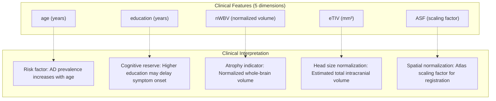
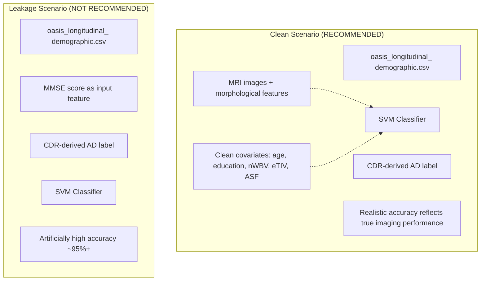
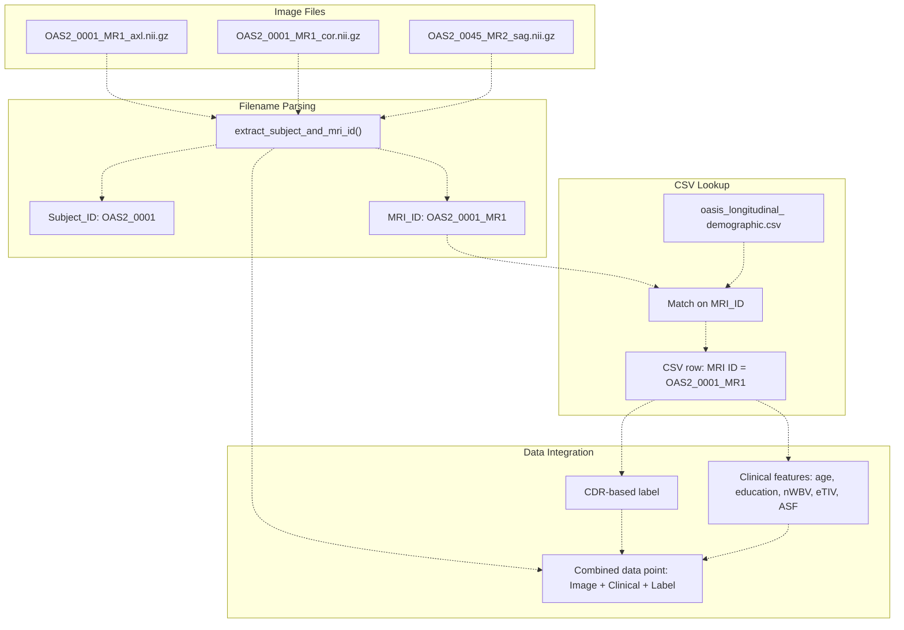
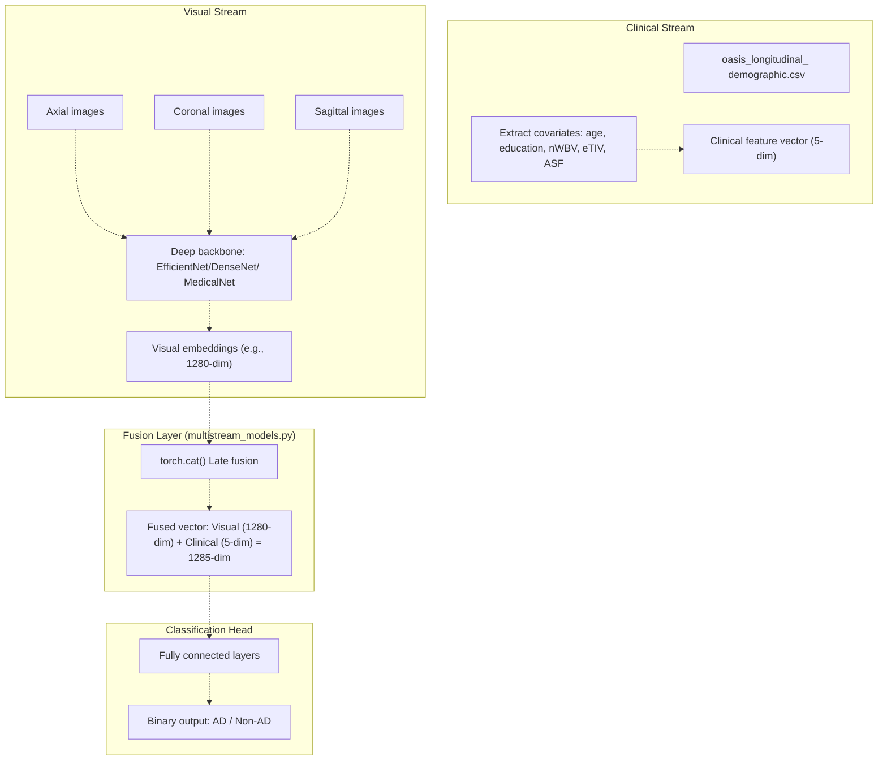
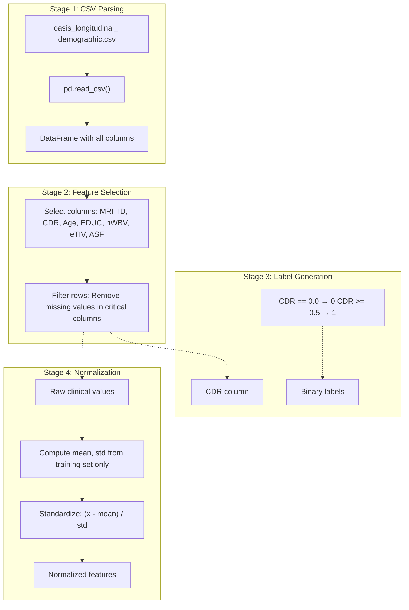

# Clinical Metadata

> **Relevant source files**
> * [README.md](https://github.com/ThalesMMS/brain-mri-pipelines-py/blob/cd9d51a5/README.md)

This document describes the clinical metadata component of the brain MRI pipelines system, specifically the `oasis_longitudinal_demographic.csv` file and how tabular clinical features integrate with imaging data for multimodal Alzheimer's disease classification.

**Scope**: This page covers the structure of clinical metadata, individual feature descriptions, the target leakage issue with MMSE/CDR scores, and the integration mechanism for multimodal fusion. For information about imaging data organization, see [Directory Organization & File Naming](#4.3). For details on how clinical features are combined with visual embeddings in the model architecture, see [Multi-Stream Multimodal Network](#3.1).

---

## Overview

The OASIS-2 longitudinal dataset includes a CSV file containing demographic, anatomical, and clinical assessment data for each MRI scan. This tabular metadata serves two primary purposes in the system:

1. **Subject identification and CDR-based labeling**: Mapping MRI scans to subjects and determining Alzheimer's disease diagnosis based on Clinical Dementia Rating (CDR) scores
2. **Multimodal feature fusion**: Providing clinical covariates that can be concatenated with visual embeddings to enhance classification performance

The clinical metadata is stored in `oasis_longitudinal_demographic.csv` at the repository root and contains one row per MRI session.

**Sources**: [README.md L36](https://github.com/ThalesMMS/brain-mri-pipelines-py/blob/cd9d51a5/README.md#L36-L36)

 [README.md L12](https://github.com/ThalesMMS/brain-mri-pipelines-py/blob/cd9d51a5/README.md#L12-L12)

---

## CSV File Structure

The `oasis_longitudinal_demographic.csv` file follows this structure:

| Column Name | Data Type | Description | Usage in System |
| --- | --- | --- | --- |
| `Subject ID` | String | Unique subject identifier (e.g., `OAS2_0001`) | Subject-level split grouping |
| `MRI ID` | String | Unique MRI session identifier (e.g., `OAS2_0001_MR1`) | Primary key for matching image files |
| `Group` | Categorical | Diagnosis group: `Nondemented`, `Demented`, `Converted` | Initial filtering (not primary label) |
| `Visit` | Integer | Visit number (1, 2, 3, ...) | Longitudinal tracking |
| `MR Delay` | Integer | Days between visits | Temporal analysis (not currently used) |
| `M/F` | Categorical | Sex: `M` or `F` | Demographic covariate (not currently used) |
| `Hand` | Categorical | Handedness: `R` (right) | Demographic covariate (not currently used) |
| `Age` | Integer | Age at MRI session in years | **Core multimodal feature** |
| `EDUC` | Integer | Years of education | **Core multimodal feature** |
| `SES` | Integer | Socioeconomic status (1-5 scale) | Available but not used |
| `MMSE` | Integer | Mini-Mental State Examination score (0-30) | **⚠️ Target proxy - leakage risk** |
| `CDR` | Float | Clinical Dementia Rating (0, 0.5, 1, 2) | **Primary label source** |
| `eTIV` | Float | Estimated total intracranial volume (mm³) | **Core multimodal feature** |
| `nWBV` | Float | Normalized whole-brain volume | **Core multimodal feature** |
| `ASF` | Float | Atlas scaling factor | **Core multimodal feature** |

### Label Definition

The system uses the `CDR` field to define binary Alzheimer's disease labels:

* **Non-AD (label=0)**: `CDR == 0.0` (no dementia)
* **AD (label=1)**: `CDR >= 0.5` (very mild to severe dementia)

**Sources**: [README.md L36](https://github.com/ThalesMMS/brain-mri-pipelines-py/blob/cd9d51a5/README.md#L36-L36)

 [README.md L12](https://github.com/ThalesMMS/brain-mri-pipelines-py/blob/cd9d51a5/README.md#L12-L12)

 [README.md L168](https://github.com/ThalesMMS/brain-mri-pipelines-py/blob/cd9d51a5/README.md#L168-L168)

---

## Clinical Features for Multimodal Fusion

When multimodal mode is enabled, the system extracts five clinical features that are concatenated with visual embeddings before classification:

### Core Clinical Covariates

**Diagram: Clinical Feature Set and Clinical Significance**

#### Feature Descriptions

1. **`age`**: Patient age at time of MRI acquisition. Age is a primary risk factor for Alzheimer's disease, with exponential prevalence increase after 65 years.
2. **`education` (EDUC)**: Years of formal education. Research suggests higher education levels are associated with cognitive reserve, potentially delaying clinical symptom manifestation despite neuropathological burden.
3. **`nWBV`** (normalized Whole-Brain Volume): The ratio of brain tissue volume to total intracranial volume. Lower nWBV values indicate brain atrophy, a hallmark of Alzheimer's progression. This value is automatically normalized by the OASIS pipeline to account for head size variability.
4. **`eTIV`** (estimated Total Intracranial Volume): An estimate of the maximum brain volume before any atrophy occurred, measured in cubic millimeters. This serves as a normalization factor for cross-subject comparisons and is derived from structural MRI using validated algorithms.
5. **`ASF`** (Atlas Scaling Factor): A spatial normalization parameter derived during atlas registration. It represents the volumetric scaling required to match the subject's brain to a standard template space.

**Sources**: [README.md L12](https://github.com/ThalesMMS/brain-mri-pipelines-py/blob/cd9d51a5/README.md#L12-L12)

 [README.md L117](https://github.com/ThalesMMS/brain-mri-pipelines-py/blob/cd9d51a5/README.md#L117-L117)

---

## MMSE/CDR Scores and Target Leakage

The CSV file contains two cognitive assessment scores that require careful handling:

### MMSE (Mini-Mental State Examination)

* **Range**: 0-30 (higher scores = better cognitive function)
* **Purpose**: Screening tool for cognitive impairment
* **Issue**: MMSE scores are **strong proxies for dementia diagnosis** and create severe target leakage when used as input features

### CDR (Clinical Dementia Rating)

* **Scale**: 0 (no dementia), 0.5 (very mild), 1 (mild), 2 (moderate), 3 (severe)
* **Purpose**: Clinical assessment of dementia severity
* **Usage**: CDR is used to **derive the target label** (CDR=0 → Non-AD, CDR≥0.5 → AD)

### Leakage Problem

**Diagram: Target Leakage Scenarios - MMSE as Feature vs Imaging-Only**

The system implements both scenarios in classical baseline training to demonstrate the leakage effect. The baseline CLI trains:

* `svm_with_mmse_cdr`: Uses MMSE and CDR as features (exhibits leakage)
* `svm_without_mmse_cdr`: Uses only imaging-derived features and clean covariates (methodologically sound)

**Warning from codebase**: "MMSE and CDR scores are strong proxies for dementia. While the codebase supports using them, we recommend the `svm_without_mmse_cdr` scenario for methodologically cleaner imaging-based analysis."

**Sources**: [README.md L168](https://github.com/ThalesMMS/brain-mri-pipelines-py/blob/cd9d51a5/README.md#L168-L168)

 [README.md L107](https://github.com/ThalesMMS/brain-mri-pipelines-py/blob/cd9d51a5/README.md#L107-L107)

---

## Integration with Imaging Data

Clinical metadata integrates with imaging data through a two-step matching process:

### Matching Process

**Diagram: MRI Image to Clinical Metadata Matching Pipeline**

### File Naming Pattern

The system relies on the standardized naming convention `OAS2_XXXX_MRY_plane.nii.gz` where:

* `OAS2_XXXX`: 4-digit subject identifier
* `MRY`: MRI session number
* `plane`: Anatomical orientation (`axl`, `cor`, or `sag`)

This pattern enables extraction of `MRI_ID = OAS2_XXXX_MRY`, which serves as the foreign key to lookup the corresponding row in the CSV file.

**Sources**: [README.md L44-L48](https://github.com/ThalesMMS/brain-mri-pipelines-py/blob/cd9d51a5/README.md#L44-L48)

---

## Multimodal Fusion Architecture

When the `--multimodal` flag is enabled, clinical features are integrated into the deep learning pipeline through late fusion:

**Diagram: Multimodal Fusion Architecture with Code Entity Mapping**

### Implementation Details

The multimodal fusion is implemented in `brain_mri/ml/multistream_models.py` where:

1. **Visual embeddings** are extracted from frozen or fine-tuned backbone networks
2. **Clinical features** are loaded from the CSV and normalized
3. **Concatenation** occurs via `torch.cat([visual_embeddings, clinical_features], dim=1)`
4. **Classification head** processes the fused vector to produce final predictions

The system supports both **imaging-only** mode (visual embeddings alone) and **multimodal** mode (visual + clinical). This design enables ablation studies to measure the contribution of clinical metadata to classification performance.

**Sources**: [README.md L117](https://github.com/ThalesMMS/brain-mri-pipelines-py/blob/cd9d51a5/README.md#L117-L117)

 [README.md L12](https://github.com/ThalesMMS/brain-mri-pipelines-py/blob/cd9d51a5/README.md#L12-L12)

 [README.md L185-L186](https://github.com/ThalesMMS/brain-mri-pipelines-py/blob/cd9d51a5/README.md#L185-L186)

---

## Data Loading and Preprocessing

Clinical metadata is loaded and preprocessed through the following stages:

### Loading Pipeline

**Diagram: Clinical Metadata Loading and Preprocessing Pipeline**

### Normalization Strategy

Clinical features undergo standardization (z-score normalization) to ensure all features are on comparable scales:

* **Mean and standard deviation** are computed **only from the training set**
* **Validation and test sets** are normalized using training set statistics
* This prevents information leakage from validation/test distributions into the training process

### Missing Data Handling

The system handles missing values through:

1. **Explicit filtering**: Rows with missing values in critical columns (`CDR`, `Age`, `EDUC`, `nWBV`, `eTIV`, `ASF`) are excluded
2. **Subject-level awareness**: If an MRI scan has incomplete clinical metadata, all scans from that subject remain in the same split partition to prevent leakage

**Sources**: [README.md L36](https://github.com/ThalesMMS/brain-mri-pipelines-py/blob/cd9d51a5/README.md#L36-L36)

 [README.md L23](https://github.com/ThalesMMS/brain-mri-pipelines-py/blob/cd9d51a5/README.md#L23-L23)

---

## Summary Table: Clinical Metadata Usage

| Feature | Used in Multimodal Fusion | Used for Labeling | Leakage Risk | Recommended Usage |
| --- | --- | --- | --- | --- |
| `Age` | ✅ Yes | ❌ No | 🟢 None | Core covariate |
| `EDUC` | ✅ Yes | ❌ No | 🟢 None | Core covariate |
| `nWBV` | ✅ Yes | ❌ No | 🟢 None | Core covariate |
| `eTIV` | ✅ Yes | ❌ No | 🟢 None | Core covariate |
| `ASF` | ✅ Yes | ❌ No | 🟢 None | Core covariate |
| `CDR` | ❌ No | ✅ Yes (label source) | 🔴 High (if used as feature) | Label only |
| `MMSE` | ⚠️ Optional (not recommended) | ❌ No | 🔴 Very High | Avoid as feature |
| `M/F` | ❌ No | ❌ No | 🟢 None | Available, not used |
| `Hand` | ❌ No | ❌ No | 🟢 None | Available, not used |
| `SES` | ❌ No | ❌ No | 🟢 None | Available, not used |

**Sources**: [README.md L12](https://github.com/ThalesMMS/brain-mri-pipelines-py/blob/cd9d51a5/README.md#L12-L12)

 [README.md L168](https://github.com/ThalesMMS/brain-mri-pipelines-py/blob/cd9d51a5/README.md#L168-L168)

Refresh this wiki

Last indexed: 5 January 2026 ([cd9d51](https://github.com/ThalesMMS/brain-mri-pipelines-py/commit/cd9d51a5))

### On this page

* [Clinical Metadata](#4.4-clinical-metadata)
* [Overview](#4.4-overview)
* [CSV File Structure](#4.4-csv-file-structure)
* [Label Definition](#4.4-label-definition)
* [Clinical Features for Multimodal Fusion](#4.4-clinical-features-for-multimodal-fusion)
* [Core Clinical Covariates](#4.4-core-clinical-covariates)
* [MMSE/CDR Scores and Target Leakage](#4.4-mmsecdr-scores-and-target-leakage)
* [MMSE (Mini-Mental State Examination)](#4.4-mmse-mini-mental-state-examination)
* [CDR (Clinical Dementia Rating)](#4.4-cdr-clinical-dementia-rating)
* [Leakage Problem](#4.4-leakage-problem)
* [Integration with Imaging Data](#4.4-integration-with-imaging-data)
* [Matching Process](#4.4-matching-process)
* [File Naming Pattern](#4.4-file-naming-pattern)
* [Multimodal Fusion Architecture](#4.4-multimodal-fusion-architecture)
* [Implementation Details](#4.4-implementation-details)
* [Data Loading and Preprocessing](#4.4-data-loading-and-preprocessing)
* [Loading Pipeline](#4.4-loading-pipeline)
* [Normalization Strategy](#4.4-normalization-strategy)
* [Missing Data Handling](#4.4-missing-data-handling)
* [Summary Table: Clinical Metadata Usage](#4.4-summary-table-clinical-metadata-usage)

Ask Devin about brain-mri-pipelines-py