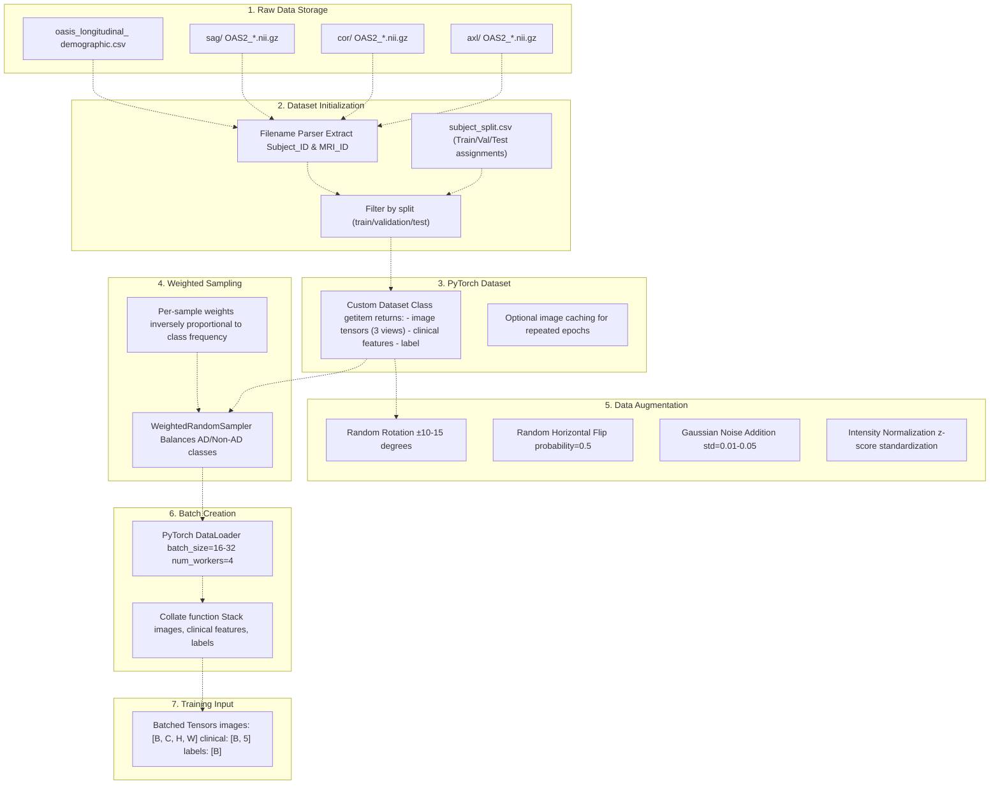
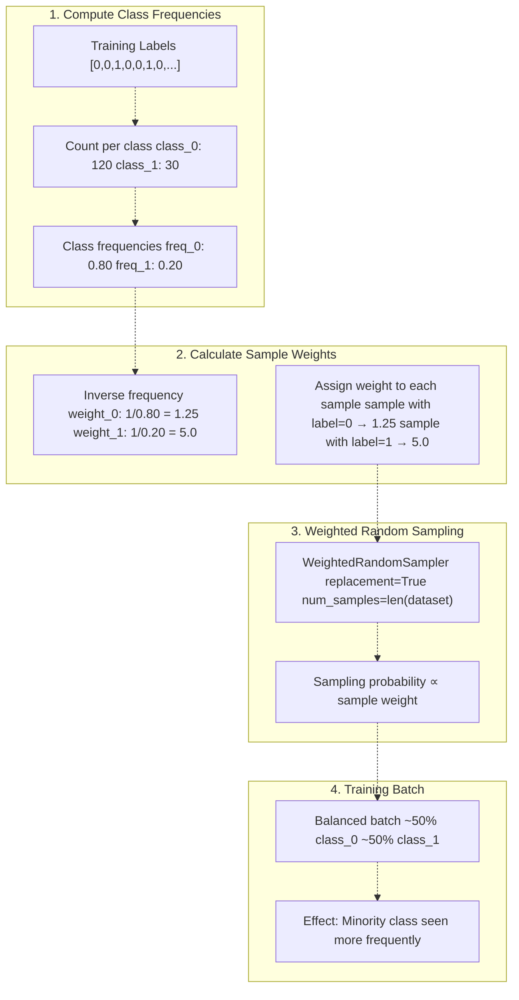
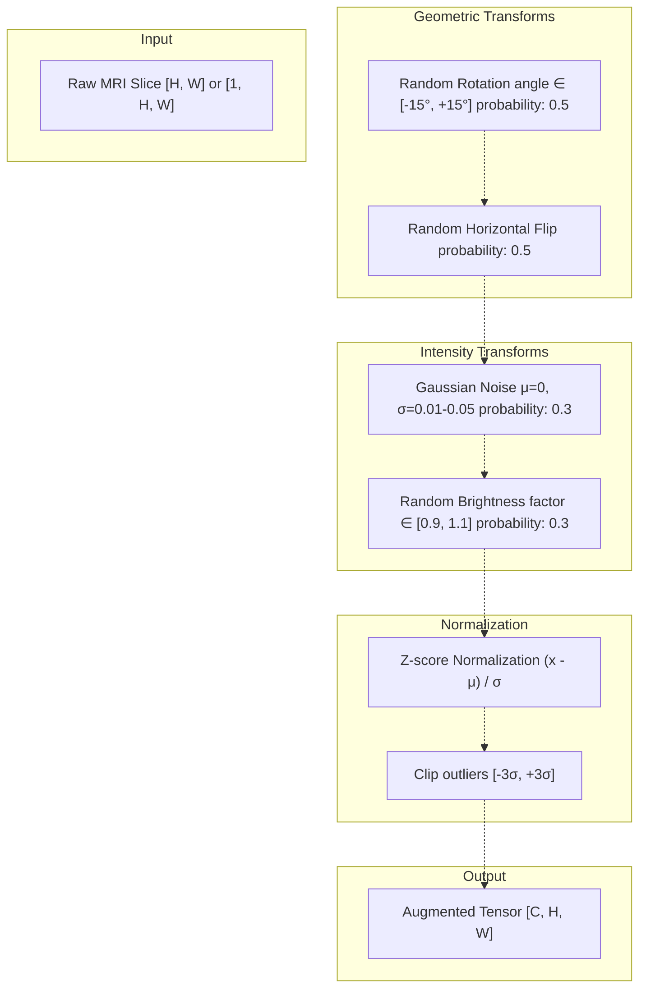
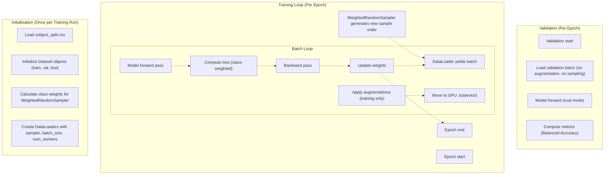
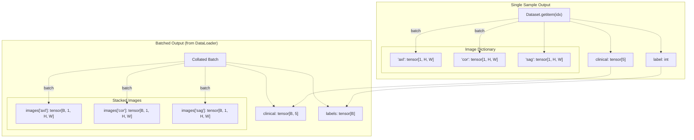
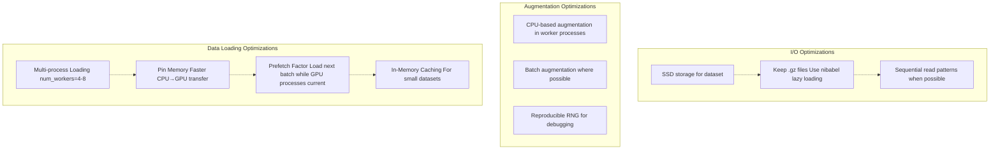

# Data Loading & Augmentation

> **Relevant source files**
> * [README.md](https://github.com/ThalesMMS/brain-mri-pipelines-py/blob/cd9d51a5/README.md)
> * [axl/OAS2_0008_MR1_axl.nii.gz](https://github.com/ThalesMMS/brain-mri-pipelines-py/blob/cd9d51a5/axl/OAS2_0008_MR1_axl.nii.gz)
> * [axl/OAS2_0009_MR1_axl.nii.gz](https://github.com/ThalesMMS/brain-mri-pipelines-py/blob/cd9d51a5/axl/OAS2_0009_MR1_axl.nii.gz)

## Purpose and Scope

This page documents the data loading pipeline and augmentation techniques used during model training. It covers how MRI images are loaded from disk, transformed into training batches, and augmented to improve model generalization. For information about the dataset structure and file organization, see [Directory Organization & File Naming](#4.3). For details on subject-level splitting to prevent data leakage, see [Subject-Level Splitting & Leakage Prevention](#3.4).

---

## Data Loading Pipeline Overview

The data loading pipeline transforms raw NIfTI files into batched tensors suitable for training deep learning models. The pipeline handles multi-view data (axial, coronal, sagittal), applies augmentation, and manages class imbalance through weighted sampling.

### End-to-End Data Flow



**Sources:** [README.md L27-L51](https://github.com/ThalesMMS/brain-mri-pipelines-py/blob/cd9d51a5/README.md#L27-L51)

 [README.md L162-L168](https://github.com/ThalesMMS/brain-mri-pipelines-py/blob/cd9d51a5/README.md#L162-L168)

 High-level Diagram 4 from context

---

## Dataset Class Implementation

The custom dataset class is responsible for loading individual samples and returning them in a format suitable for model training. It handles multi-view loading and integrates clinical metadata.

### Dataset Structure

```mermaid
flowchart TD

IMG_DICT["images: dict {'axl': tensor, 'cor': tensor, 'sag': tensor}"]
IDX["Input: index"]
LOAD_AXL["Load axl/_axl.nii.gz"]
LOAD_COR["Load cor/_cor.nii.gz"]
LOAD_SAG["Load sag/_sag.nii.gz"]
CLIN_LOOKUP["Lookup in demographic CSV"]
CDR_LOOKUP["Lookup CDR score"]
SLICE["Extract middle slice or aggregate volume"]
CLIN_FEAT["Extract: age, education, nwbv, etiv, asf"]
CLIN_NORM["Normalize features (pre-computed stats)"]
CLIN_TENSOR["clinical: tensor[5]"]
LABEL["Binary label: 0=Non-AD 1=AD (CDR > 0)"]
LABEL_TENSOR["label: int"]

subgraph Dataset.__getitem__(idx) ["Dataset.getitem(idx)"]
    IDX
    IDX -.-> LOAD_AXL
    IDX -.-> LOAD_COR
    IDX -.-> LOAD_SAG
    IDX -.-> CLIN_LOOKUP
    IDX -.-> CDR_LOOKUP
    SLICE -.-> IMG_DICT
    LABEL -.-> LABEL_TENSOR

subgraph Output ["Output"]
    IMG_DICT
    CLIN_TENSOR
    LABEL_TENSOR
end

subgraph subGraph2 ["Label Assignment"]
    CDR_LOOKUP
    LABEL
end

subgraph subGraph1 ["Clinical Features"]
    CLIN_LOOKUP
    CLIN_FEAT
    CLIN_NORM
end

subgraph subGraph0 ["Image Loading"]
    LOAD_AXL
    LOAD_COR
    LOAD_SAG
    SLICE
end
end
```

**Sources:** [README.md L36-L50](https://github.com/ThalesMMS/brain-mri-pipelines-py/blob/cd9d51a5/README.md#L36-L50)

 High-level Diagram 2 from context

### Key Implementation Details

| Component | Description | Configuration |
| --- | --- | --- |
| **Image Format** | NIfTI-1 format (`.nii.gz`) | 3D volumes, middle slice extracted |
| **Preprocessing** | Intensity normalization | Z-score standardization per image |
| **Clinical Features** | 5 demographic variables | `age, education, nwbv, etiv, asf` |
| **Label Derivation** | CDR score from demographic CSV | Binary: CDR > 0 indicates AD |
| **Caching Strategy** | Optional in-memory cache | Enabled for repeated epoch training |

**Sources:** [README.md L36-L50](https://github.com/ThalesMMS/brain-mri-pipelines-py/blob/cd9d51a5/README.md#L36-L50)

 [README.md L23-L24](https://github.com/ThalesMMS/brain-mri-pipelines-py/blob/cd9d51a5/README.md#L23-L24)

---

## WeightedRandomSampler for Class Imbalance

Medical datasets typically exhibit severe class imbalance (fewer AD cases than healthy controls). The `WeightedRandomSampler` ensures balanced representation during training by oversampling the minority class.

### Sampling Mechanism



**Sources:** [README.md L165-L168](https://github.com/ThalesMMS/brain-mri-pipelines-py/blob/cd9d51a5/README.md#L165-L168)

 High-level Diagram 4 from context

### WeightedRandomSampler Configuration

The sampler is configured as follows:

```
# Pseudo-code representation of implementationweights = compute_sample_weights(train_labels)  # inverse class frequencysampler = WeightedRandomSampler(    weights=weights,    num_samples=len(train_dataset),    replacement=True  # Allow same sample multiple times per epoch)train_loader = DataLoader(    train_dataset,    batch_size=32,    sampler=sampler,  # Replaces shuffle=True    num_workers=4)
```

**Key Parameters:**

| Parameter | Value | Rationale |
| --- | --- | --- |
| `replacement` | `True` | Allows oversampling minority class |
| `num_samples` | `len(dataset)` | Maintains consistent epoch length |
| `weights` | Inverse class frequency | Balances class representation |

**Sources:** [README.md L165-L168](https://github.com/ThalesMMS/brain-mri-pipelines-py/blob/cd9d51a5/README.md#L165-L168)

 High-level Diagram 4 from context

---

## Image Augmentation Techniques

Data augmentation artificially increases training set diversity, improving model generalization and reducing overfitting. The pipeline applies geometric and intensity-based transformations.

### Augmentation Pipeline



**Sources:** High-level Diagram 4 from context, [README.md L20-L22](https://github.com/ThalesMMS/brain-mri-pipelines-py/blob/cd9d51a5/README.md#L20-L22)

### Augmentation Techniques Summary

| Technique | Parameters | Applied To | Justification |
| --- | --- | --- | --- |
| **Random Rotation** | ±10-15° | All views | Brain orientation varies across scans |
| **Horizontal Flip** | p=0.5 | Axial, coronal | Left-right symmetry in brain structure |
| **Gaussian Noise** | σ=0.01-0.05 | All views | Simulates scanner noise variability |
| **Brightness Adjustment** | factor ∈ [0.9, 1.1] | All views | Models intensity variations |
| **Z-score Normalization** | Always applied | All views | Standardizes intensity distributions |

**Important Notes:**

* **Training Only:** Augmentation is applied only to training data, not validation/test sets
* **Per-View Augmentation:** Each anatomical view (axial/coronal/sagittal) is augmented independently
* **Random Seed Control:** Reproducible augmentation via seeded random number generators

**Sources:** High-level Diagram 4 from context, [README.md L20-L22](https://github.com/ThalesMMS/brain-mri-pipelines-py/blob/cd9d51a5/README.md#L20-L22)

---

## Integration with Training Pipeline

The data loading and augmentation components integrate seamlessly with the training loop, providing batched, balanced, and augmented data to the model.

### Training Loop Data Flow



**Sources:** [README.md L162-L168](https://github.com/ThalesMMS/brain-mri-pipelines-py/blob/cd9d51a5/README.md#L162-L168)

 High-level Diagram 4 from context

### DataLoader Configuration

Typical DataLoader configuration used across training scripts:

| Parameter | Training | Validation/Test | Notes |
| --- | --- | --- | --- |
| `batch_size` | 16-32 | 32-64 | Larger batches for eval (no gradients) |
| `shuffle` | `False` | `False` | Sampler handles training order |
| `sampler` | `WeightedRandomSampler` | `None` | Balancing only for training |
| `num_workers` | 4-8 | 2-4 | Parallel data loading |
| `pin_memory` | `True` | `True` | Faster GPU transfer |
| `drop_last` | `True` | `False` | Consistent batch sizes in training |

**Sources:** [README.md L162-L168](https://github.com/ThalesMMS/brain-mri-pipelines-py/blob/cd9d51a5/README.md#L162-L168)

 [README.md L112-L118](https://github.com/ThalesMMS/brain-mri-pipelines-py/blob/cd9d51a5/README.md#L112-L118)

---

## Multi-View Data Loading

For multi-stream models, the data loader must provide synchronized views from all three anatomical planes. Each sample returns a dictionary of image tensors.

### Multi-View Batch Structure



**Sources:** High-level Diagram 2 from context, [README.md L10-L15](https://github.com/ThalesMMS/brain-mri-pipelines-py/blob/cd9d51a5/README.md#L10-L15)

### Custom Collate Function

A custom collate function is required to handle the dictionary structure:

```css
# Pseudo-code for custom collate functiondef multiview_collate_fn(batch):    """    Collates multi-view samples into batched tensors.        Args:        batch: List of tuples (images_dict, clinical, label)        Returns:        images: Dict of batched tensors {'axl': [B,1,H,W], ...}        clinical: Batched tensor [B, 5]        labels: Batched tensor [B]    """    images_dict = {}    clinical_list = []    labels_list = []        for sample in batch:        images, clinical, label = sample        for view in ['axl', 'cor', 'sag']:            if view not in images_dict:                images_dict[view] = []            images_dict[view].append(images[view])        clinical_list.append(clinical)        labels_list.append(label)        # Stack into batched tensors    batched_images = {        view: torch.stack(tensors)         for view, tensors in images_dict.items()    }    batched_clinical = torch.stack(clinical_list)    batched_labels = torch.tensor(labels_list)        return batched_images, batched_clinical, batched_labels
```

**Sources:** High-level Diagram 2 from context, [README.md L10-L15](https://github.com/ThalesMMS/brain-mri-pipelines-py/blob/cd9d51a5/README.md#L10-L15)

---

## Anti-Collapse Mechanisms

The data loading pipeline implements multiple safeguards to prevent model collapse (predicting only majority class):

### Anti-Collapse Strategy Layers

| Layer | Mechanism | Location | Purpose |
| --- | --- | --- | --- |
| **1. Sampling** | `WeightedRandomSampler` | DataLoader | Balance batch composition |
| **2. Loss Weighting** | Class-weighted cross-entropy | Training loop | Penalize majority class errors |
| **3. Focal Loss** | Focus on hard examples | Loss function | Reduce easy negative contribution |
| **4. Metric** | Balanced Accuracy | Evaluation | Detect imbalance-induced collapse |

**Combined Effect:** These mechanisms work together to ensure the model learns discriminative features for both classes despite severe imbalance (typical ratio: 3:1 or 4:1 Non-AD:AD).

**Sources:** [README.md L162-L168](https://github.com/ThalesMMS/brain-mri-pipelines-py/blob/cd9d51a5/README.md#L162-L168)

 High-level Diagram 4 from context

---

## Performance Considerations

Efficient data loading is critical for GPU utilization and overall training speed.

### Optimization Techniques



**Sources:** [README.md L55-L77](https://github.com/ThalesMMS/brain-mri-pipelines-py/blob/cd9d51a5/README.md#L55-L77)

 High-level Diagram 4 from context

### Bottleneck Analysis

Common bottlenecks and solutions:

| Bottleneck | Symptom | Solution |
| --- | --- | --- |
| **Disk I/O** | Low GPU utilization (<80%) | Increase `num_workers`, use SSD |
| **CPU Augmentation** | Slow batch loading | Simplify augmentation, use GPU-based transforms |
| **Memory Copying** | Delays before training step | Enable `pin_memory=True` |
| **Small Batch Size** | Underutilized GPU | Increase batch size if memory allows |

**Sources:** [README.md L55-L77](https://github.com/ThalesMMS/brain-mri-pipelines-py/blob/cd9d51a5/README.md#L55-L77)

---

## Reproducibility and Debugging

Ensuring reproducible data loading and augmentation is critical for scientific validity.

### Seed Management

```sql
# Pseudo-code for reproducible data loadingdef set_seeds(seed=42):    """Set all random seeds for reproducibility."""    random.seed(seed)    np.random.seed(seed)    torch.manual_seed(seed)    torch.cuda.manual_seed_all(seed)    def get_reproducible_loader(dataset, seed=42):    """Create DataLoader with reproducible sampling."""    g = torch.Generator()    g.manual_seed(seed)        sampler = WeightedRandomSampler(        weights=compute_weights(dataset),        num_samples=len(dataset),        replacement=True,        generator=g  # Reproducible sampling order    )        return DataLoader(        dataset,        batch_size=32,        sampler=sampler,        num_workers=4,        worker_init_fn=seed_worker,  # Seed each worker        generator=g    )def seed_worker(worker_id):    """Seed each DataLoader worker process."""    worker_seed = torch.initial_seed() % 2**32    np.random.seed(worker_seed)    random.seed(worker_seed)
```

**Key Points:**

* **Generator Object:** Pass `torch.Generator` to `WeightedRandomSampler` and `DataLoader`
* **Worker Seeding:** Use `worker_init_fn` to seed each data loading worker
* **Augmentation Seeding:** Control random transforms with explicit seeds
* **Documentation:** Record seeds in experiment logs for reproducibility

**Sources:** [README.md L112-L118](https://github.com/ThalesMMS/brain-mri-pipelines-py/blob/cd9d51a5/README.md#L112-L118)

 [README.md L126-L148](https://github.com/ThalesMMS/brain-mri-pipelines-py/blob/cd9d51a5/README.md#L126-L148)

---

## Summary

The data loading and augmentation pipeline implements a robust system for preparing MRI data for training:

1. **Multi-View Loading:** Supports axial, coronal, and sagittal planes simultaneously
2. **Class Balancing:** `WeightedRandomSampler` ensures balanced training despite severe imbalance
3. **Augmentation:** Geometric and intensity transforms improve generalization
4. **Integration:** Seamless connection with training loop via PyTorch `DataLoader`
5. **Performance:** Multi-process loading and optimizations for efficient GPU utilization
6. **Reproducibility:** Comprehensive seed management for scientific validity

This pipeline forms the foundation for training the multi-stream, multimodal deep learning models described in [Deep Learning Backbones](#5.1) and [Multi-Stream Multimodal Network](#3.1).

**Sources:** All sections above, [README.md L1-L218](https://github.com/ThalesMMS/brain-mri-pipelines-py/blob/cd9d51a5/README.md#L1-L218)

 High-level Diagrams 1-6 from context

Refresh this wiki

Last indexed: 5 January 2026 ([cd9d51](https://github.com/ThalesMMS/brain-mri-pipelines-py/commit/cd9d51a5))

### On this page

* [Data Loading & Augmentation](#4.5-data-loading-augmentation)
* [Purpose and Scope](#4.5-purpose-and-scope)
* [Data Loading Pipeline Overview](#4.5-data-loading-pipeline-overview)
* [End-to-End Data Flow](#4.5-end-to-end-data-flow)
* [Dataset Class Implementation](#4.5-dataset-class-implementation)
* [Dataset Structure](#4.5-dataset-structure)
* [Key Implementation Details](#4.5-key-implementation-details)
* [WeightedRandomSampler for Class Imbalance](#4.5-weightedrandomsampler-for-class-imbalance)
* [Sampling Mechanism](#4.5-sampling-mechanism)
* [WeightedRandomSampler Configuration](#4.5-weightedrandomsampler-configuration)
* [Image Augmentation Techniques](#4.5-image-augmentation-techniques)
* [Augmentation Pipeline](#4.5-augmentation-pipeline)
* [Augmentation Techniques Summary](#4.5-augmentation-techniques-summary)
* [Integration with Training Pipeline](#4.5-integration-with-training-pipeline)
* [Training Loop Data Flow](#4.5-training-loop-data-flow)
* [DataLoader Configuration](#4.5-dataloader-configuration)
* [Multi-View Data Loading](#4.5-multi-view-data-loading)
* [Multi-View Batch Structure](#4.5-multi-view-batch-structure)
* [Custom Collate Function](#4.5-custom-collate-function)
* [Anti-Collapse Mechanisms](#4.5-anti-collapse-mechanisms)
* [Anti-Collapse Strategy Layers](#4.5-anti-collapse-strategy-layers)
* [Performance Considerations](#4.5-performance-considerations)
* [Optimization Techniques](#4.5-optimization-techniques)
* [Bottleneck Analysis](#4.5-bottleneck-analysis)
* [Reproducibility and Debugging](#4.5-reproducibility-and-debugging)
* [Seed Management](#4.5-seed-management)
* [Summary](#4.5-summary)

Ask Devin about brain-mri-pipelines-py