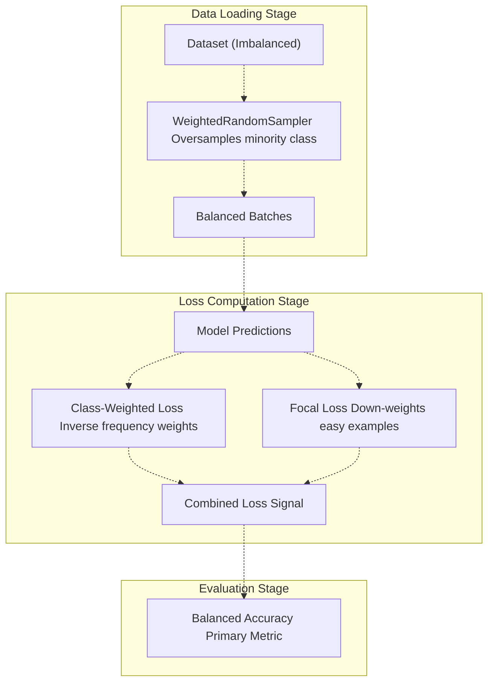
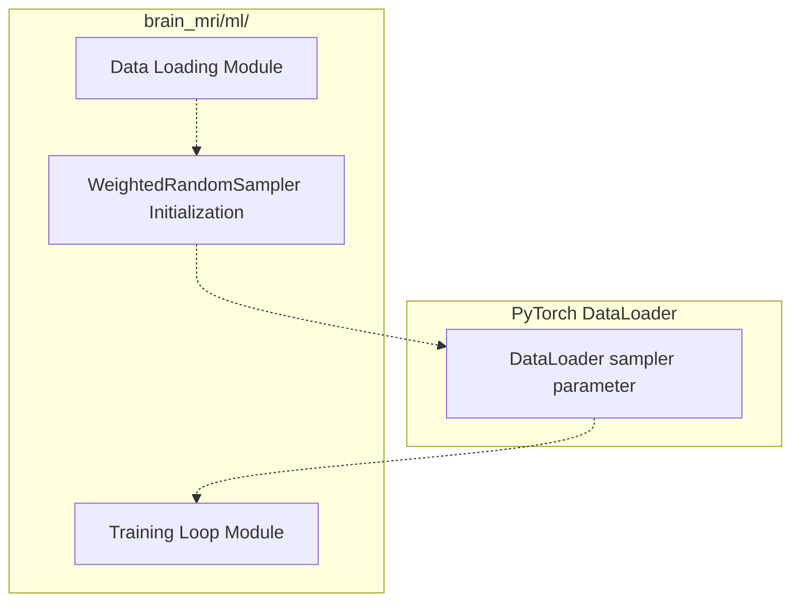
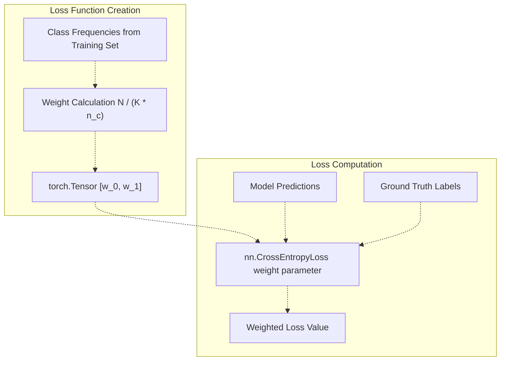
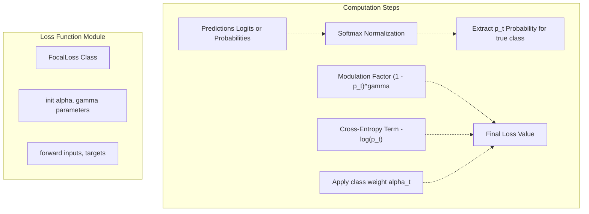
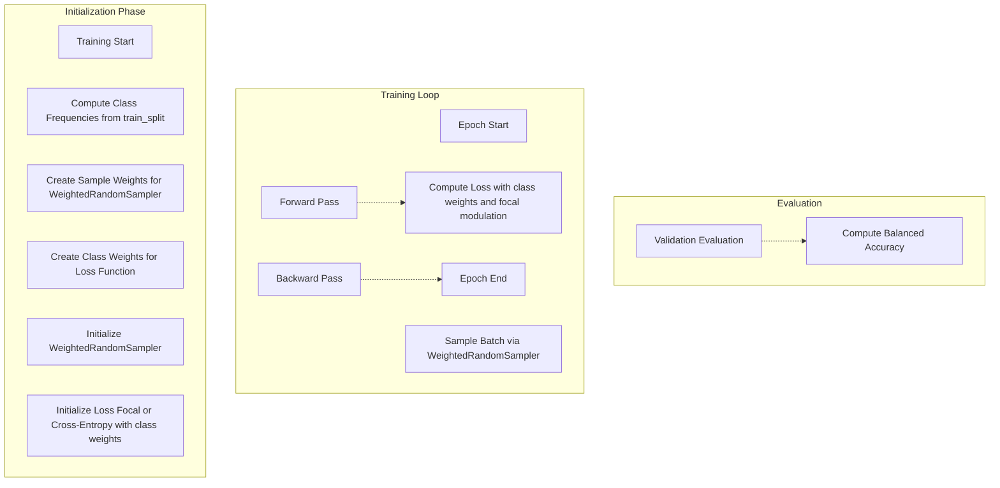
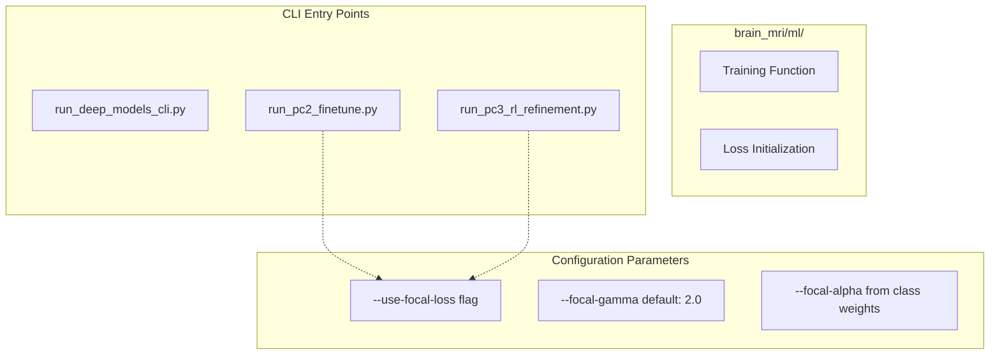

# Loss Functions & Class Imbalance

> **Relevant source files**
> * [README.md](https://github.com/ThalesMMS/brain-mri-pipelines-py/blob/cd9d51a5/README.md)

## Purpose & Scope

This page documents the mechanisms used to handle class imbalance in medical imaging datasets, specifically the strategies employed to prevent model collapse when training on the imbalanced OASIS-2 Alzheimer's disease detection task. The system implements a three-pronged approach: **WeightedRandomSampler** for data loading, **class-weighted loss functions**, and **Focal Loss** for training.

For information about the evaluation metrics used to measure performance on imbalanced data (particularly Balanced Accuracy), see [Evaluation Metrics](#5.6). For details on the overall training configuration, see [Training Configuration](5d%20Training-Configuration.md).

---

## The Class Imbalance Problem in Medical Imaging

Medical imaging datasets frequently exhibit severe class imbalance, where pathological cases (e.g., Alzheimer's disease) are underrepresented compared to healthy controls. In the OASIS-2 dataset used by this system, non-demented subjects significantly outnumber demented subjects, creating an imbalanced binary classification problem.

### Consequences of Imbalance

Without intervention, neural networks trained on imbalanced data tend to exhibit **model collapse**:

| Problem | Description | Impact |
| --- | --- | --- |
| **Majority Class Bias** | Model learns to always predict the majority class | High overall accuracy but zero sensitivity for minority class |
| **Poor Generalization** | Model fails to learn discriminative features for rare cases | Clinically useless for disease detection |
| **Gradient Dominance** | Majority class examples dominate the loss gradient | Minority class receives insufficient learning signal |

This is particularly problematic in medical applications where detecting the minority class (disease-positive cases) is the primary clinical objective.

**Sources:** [Project overview and setup](https://github.com/ThalesMMS/brain-mri-pipelines-py/blob/cd9d51a5/README.md#L164-L166)

---

## Three-Pronged Anti-Collapse Strategy

The system employs three complementary mechanisms operating at different stages of the training pipeline to combat class imbalance:



**Diagram: Three-Pronged Anti-Collapse Architecture**

This architecture ensures that:

1. **Data-level balance:** Minority class samples appear more frequently in training batches
2. **Loss-level balance:** Misclassifications of minority class receive higher penalty
3. **Metric-level balance:** Evaluation accounts for per-class performance equally

**Sources:** [Project overview and setup](https://github.com/ThalesMMS/brain-mri-pipelines-py/blob/cd9d51a5/README.md#L164-L166)

---

## WeightedRandomSampler: Data-Level Balancing

### Mechanism

The `WeightedRandomSampler` is a PyTorch data loading utility that oversamples the minority class by assigning sampling weights inversely proportional to class frequencies. This ensures that each training batch contains a more balanced representation of both classes.

### Weight Calculation

For a dataset with class frequencies `n_0` (non-demented) and `n_1` (demented):

1. Compute class weights: `w_0 = 1/n_0`, `w_1 = 1/n_1`
2. Assign per-sample weights: each sample receives the weight of its class
3. Sample with replacement according to these weights

**Example:** If the dataset contains 80 non-demented and 20 demented subjects:

* Non-demented weight: `1/80 = 0.0125`
* Demented weight: `1/20 = 0.05` (4× higher sampling probability)

### Implementation Location



**Diagram: WeightedRandomSampler Integration in Data Pipeline**

The sampler is instantiated during data loader creation and passed as the `sampler` argument to `torch.utils.data.DataLoader`. This occurs in the training initialization phase before the main training loop begins.

### Benefits and Tradeoffs

| Benefit | Tradeoff |
| --- | --- |
| Ensures minority class representation in every epoch | May lead to overfitting on limited minority samples |
| Simple to implement with PyTorch utilities | Increases training time (more iterations per epoch) |
| Works seamlessly with other anti-collapse mechanisms | Samples with replacement (same example may appear multiple times per epoch) |

**Sources:** [Project overview and setup](https://github.com/ThalesMMS/brain-mri-pipelines-py/blob/cd9d51a5/README.md#L164-L166)

---

## Class-Weighted Cross-Entropy Loss

### Mathematical Formulation

Standard cross-entropy loss treats all misclassifications equally:

```
L = -Σ y_i * log(p_i)
```

Class-weighted cross-entropy scales the loss for each class by an inverse frequency weight:

```
L_weighted = -Σ w_c * y_i * log(p_i)
```

Where `w_c` is the weight for class `c`, typically computed as:

```
w_c = N / (K * n_c)
```

* `N`: Total number of samples
* `K`: Number of classes (2 for binary AD detection)
* `n_c`: Number of samples in class `c`

### Effect on Gradient Signal

When the minority class is misclassified, the gradient magnitude is amplified by the weight factor `w_c`. This ensures that the optimizer receives a strong learning signal even when minority class examples are rare in the training batch.

### Implementation Pattern



**Diagram: Class-Weighted Loss Computation Flow**

The weights are computed once during training initialization and passed to the loss function constructor. PyTorch's `nn.CrossEntropyLoss` natively supports the `weight` parameter for this purpose.

**Sources:** [Project overview and setup](https://github.com/ThalesMMS/brain-mri-pipelines-py/blob/cd9d51a5/README.md#L164-L166)

---

## Focal Loss: Hard Example Mining

### Motivation

Focal Loss was introduced to address a different aspect of imbalance: the dominance of **easy negative examples** that contribute small but numerous loss values, overwhelming the gradient from hard examples. This is particularly relevant in medical imaging where many healthy subjects are trivially easy to classify.

### Mathematical Formulation

Focal Loss modifies cross-entropy by adding a modulating factor `(1 - p_t)^γ`:

```
FL(p_t) = -α_t * (1 - p_t)^γ * log(p_t)
```

Where:

* `p_t`: Predicted probability for the correct class
* `α_t`: Class weight (same as class-weighted loss)
* `γ`: Focusing parameter (typically 2.0)

### Behavior Analysis

| Scenario | `p_t` Value | `(1 - p_t)^γ` | Effect |
| --- | --- | --- | --- |
| **Easy example** (high confidence, correct) | 0.9 | 0.01 | Loss reduced by 100× |
| **Hard example** (low confidence, correct) | 0.5 | 0.25 | Loss reduced by 4× |
| **Misclassified** | 0.1 | 0.81 | Loss reduced minimally |

The focusing parameter `γ` controls the degree of down-weighting:

* `γ = 0`: Equivalent to standard cross-entropy
* `γ = 2`: Recommended default (down-weights easy examples by up to 100×)
* `γ = 5`: Aggressive focusing (down-weights easy examples by up to 100,000×)

### Implementation in Training Loop



**Diagram: Focal Loss Computation Implementation**

The Focal Loss implementation would typically be defined as a custom loss class in the training module, inheriting from `nn.Module` and implementing the `forward` method to compute the modulated loss.

### Why Focal Loss Complements WeightedRandomSampler

| Mechanism | Addresses | Operates On |
| --- | --- | --- |
| **WeightedRandomSampler** | Class-level imbalance | Batch composition |
| **Class-Weighted Loss** | Class-level misclassification | Loss magnitude per class |
| **Focal Loss** | Example-level difficulty | Loss magnitude per sample |

Focal Loss is particularly effective when combined with WeightedRandomSampler because:

1. Sampler ensures sufficient minority class samples in training
2. Focal Loss ensures the model focuses on hard minority examples rather than memorizing easy ones
3. Together, they promote learning of robust discriminative features

**Sources:** [Project overview and setup](https://github.com/ThalesMMS/brain-mri-pipelines-py/blob/cd9d51a5/README.md#L164-L166)

---

## Combined Strategy in Training Pipeline

### Integration Architecture

The three mechanisms are integrated at different points in the training pipeline:



**Diagram: End-to-End Integration of Anti-Collapse Mechanisms**

### Execution Flow

1. **Pre-Training Setup:** * Analyze training split to determine class frequencies * Compute sample weights for `WeightedRandomSampler` * Compute class weights for loss function * Initialize loss function with weights and focal parameters
2. **Per-Epoch Training:** * `WeightedRandomSampler` provides balanced batch composition * Model processes batch through forward pass * Loss function applies both class weights and focal modulation * Optimizer updates parameters based on balanced gradient signal
3. **Validation:** * Evaluate on validation set (no sampling bias) * Compute Balanced Accuracy to assess per-class performance

### Configuration in CLI Scripts



**Diagram: Loss Function Configuration in CLI Scripts**

The CLI scripts expose command-line arguments for controlling loss function behavior, allowing researchers to experiment with different configurations (e.g., standard cross-entropy vs. focal loss, different gamma values).

**Sources:** [Project overview and setup](https://github.com/ThalesMMS/brain-mri-pipelines-py/blob/cd9d51a5/README.md#L112-L118)

 **Sources**: [Project overview and setup](https://github.com/ThalesMMS/brain-mri-pipelines-py/blob/cd9d51a5/README.md#L134-L148)

 **Sources**: [Project overview and setup](https://github.com/ThalesMMS/brain-mri-pipelines-py/blob/cd9d51a5/README.md#L164-L166)

---

## Practical Considerations

### When Each Mechanism is Most Effective

| Dataset Characteristic | Recommended Strategy |
| --- | --- |
| **Moderate imbalance** (1:3 to 1:5 ratio) | Class-weighted loss alone may suffice |
| **Severe imbalance** (>1:10 ratio) | WeightedRandomSampler + class-weighted loss |
| **Many easy examples** | Add Focal Loss with γ=2.0 |
| **Small minority class** (<50 samples) | Be cautious with oversampling to avoid overfitting |

### Hyperparameter Tuning

The focusing parameter `γ` in Focal Loss is the primary hyperparameter to tune:

* **Start with γ=2.0** (recommended default from original paper)
* **Increase γ** if model still converges to majority class prediction
* **Decrease γ** if training becomes unstable or validation performance degrades
* **Monitor training curves** for signs of overfitting on minority class

### Monitoring Training Health

Key indicators that anti-collapse mechanisms are working:

| Metric | Healthy Behavior | Warning Sign |
| --- | --- | --- |
| **Training loss** | Decreases steadily | Spikes or plateaus early |
| **Per-class accuracy** | Both classes >50% | One class near 0% |
| **Confusion matrix** | Diagonal dominance | Single row dominance |
| **Balanced accuracy** | >0.5 and increasing | Stuck at 0.5 |

---

## Connection to Evaluation Metrics

The anti-collapse mechanisms documented here are specifically designed to optimize **Balanced Accuracy**, which is the primary evaluation metric used throughout the system (see [Evaluation Metrics](#5.6)). Balanced Accuracy is computed as:

```
Balanced Accuracy = (Sensitivity + Specificity) / 2
```

This metric is invariant to class distribution, making it the appropriate choice for validating that the model has learned discriminative features for both classes rather than exploiting class imbalance.

The synergy between training mechanisms and evaluation metric:

* **WeightedRandomSampler** ensures both classes contribute equally to gradient updates
* **Class-weighted loss** penalizes misclassifications proportionally to class rarity
* **Focal Loss** focuses learning on hard examples
* **Balanced Accuracy** validates that both classes are predicted well independently

**Sources:** [Project overview and setup](https://github.com/ThalesMMS/brain-mri-pipelines-py/blob/cd9d51a5/README.md#L164-L166)

---

## Summary

The class imbalance handling strategy implements a comprehensive three-pronged approach:

1. **Data-level balancing** via `WeightedRandomSampler` ensures minority class representation
2. **Loss-level balancing** via class-weighted cross-entropy penalizes minority class errors more heavily
3. **Example-level balancing** via Focal Loss focuses learning on hard examples

These mechanisms work synergistically to prevent model collapse and enable effective learning on the imbalanced OASIS-2 Alzheimer's disease detection task. The strategy is validated using Balanced Accuracy as the primary metric, ensuring fair evaluation across both classes.

**Sources:** [Project overview and setup](https://github.com/ThalesMMS/brain-mri-pipelines-py/blob/cd9d51a5/README.md#L164-L166)


### On this page

* [Loss Functions & Class Imbalance](#5.5-loss-functions-class-imbalance)
* [Purpose & Scope](#5.5-purpose-scope)
* [The Class Imbalance Problem in Medical Imaging](#5.5-the-class-imbalance-problem-in-medical-imaging)
* [Consequences of Imbalance](#5.5-consequences-of-imbalance)
* [Three-Pronged Anti-Collapse Strategy](#5.5-three-pronged-anti-collapse-strategy)
* [WeightedRandomSampler: Data-Level Balancing](#5.5-weightedrandomsampler-data-level-balancing)
* [Mechanism](#5.5-mechanism)
* [Weight Calculation](#5.5-weight-calculation)
* [Implementation Location](#5.5-implementation-location)
* [Benefits and Tradeoffs](#5.5-benefits-and-tradeoffs)
* [Class-Weighted Cross-Entropy Loss](#5.5-class-weighted-cross-entropy-loss)
* [Mathematical Formulation](#5.5-mathematical-formulation)
* [Effect on Gradient Signal](#5.5-effect-on-gradient-signal)
* [Implementation Pattern](#5.5-implementation-pattern)
* [Focal Loss: Hard Example Mining](#5.5-focal-loss-hard-example-mining)
* [Motivation](#5.5-motivation)
* [Mathematical Formulation](#5.5-mathematical-formulation-1)
* [Behavior Analysis](#5.5-behavior-analysis)
* [Implementation in Training Loop](#5.5-implementation-in-training-loop)
* [Why Focal Loss Complements WeightedRandomSampler](#5.5-why-focal-loss-complements-weightedrandomsampler)
* [Combined Strategy in Training Pipeline](#5.5-combined-strategy-in-training-pipeline)
* [Integration Architecture](#5.5-integration-architecture)
* [Execution Flow](#5.5-execution-flow)
* [Configuration in CLI Scripts](#5.5-configuration-in-cli-scripts)
* [Practical Considerations](#5.5-practical-considerations)
* [When Each Mechanism is Most Effective](#5.5-when-each-mechanism-is-most-effective)
* [Hyperparameter Tuning](#5.5-hyperparameter-tuning)
* [Monitoring Training Health](#5.5-monitoring-training-health)
* [Connection to Evaluation Metrics](#5.5-connection-to-evaluation-metrics)
* [Summary](#5.5-summary)

Ask Devin about brain-mri-pipelines-py