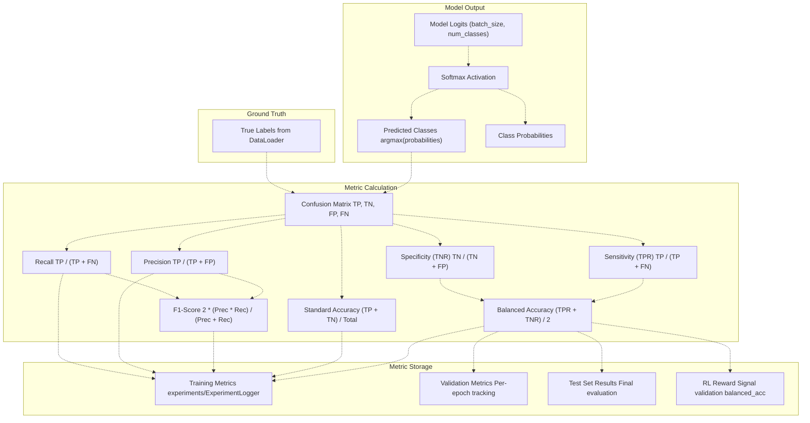
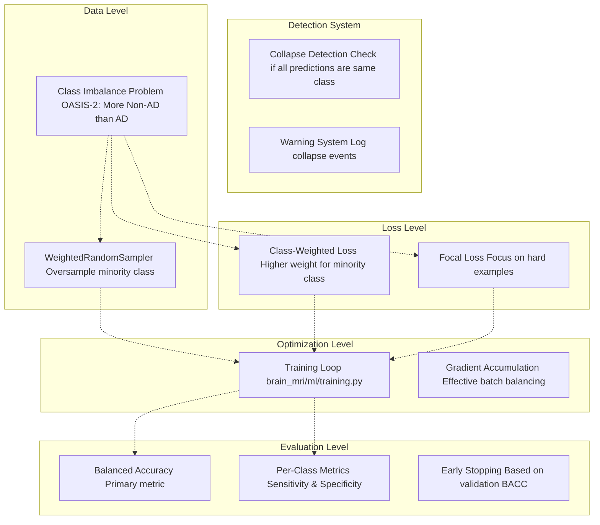
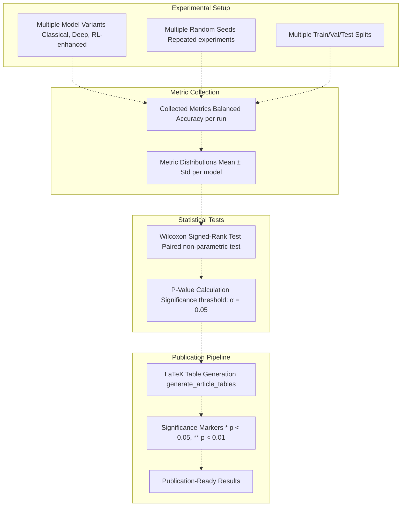
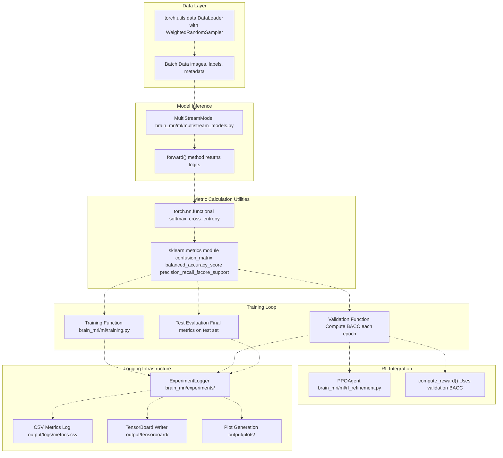

# Evaluation Metrics

> **Relevant source files**
> * [README.md](https://github.com/ThalesMMS/brain-mri-pipelines-py/blob/cd9d51a5/README.md)

## Purpose and Scope

This document details the evaluation metrics used throughout the brain-mri-pipelines-py framework for assessing model performance on Alzheimer's disease classification tasks. The primary focus is on **Balanced Accuracy** as the central metric for model evaluation, selected specifically to address class imbalance inherent in medical imaging datasets. This page also covers secondary metrics, anti-collapse mechanisms that ensure meaningful evaluation, and statistical significance testing for model comparison.

For information about loss functions used during training, see [Loss Functions & Class Imbalance](#5.5). For details on training configuration and hyperparameters, see [Training Configuration](5d%20Training-Configuration.md).

**Sources:** [Project overview and setup](https://github.com/ThalesMMS/brain-mri-pipelines-py/blob/cd9d51a5/README.md#L162-L169)

---

## Primary Metric: Balanced Accuracy

### Definition and Rationale

**Balanced Accuracy** is the arithmetic mean of sensitivity (recall for the positive class) and specificity (recall for the negative class):

```
Balanced Accuracy = (Sensitivity + Specificity) / 2
                  = (TPR + TNR) / 2
```

Where:

* **TPR (True Positive Rate)** = TP / (TP + FN)  — Sensitivity
* **TNR (True Negative Rate)** = TN / (TN + FP)  — Specificity

This metric is chosen as the primary evaluation criterion for several critical reasons specific to medical imaging:

| Reason | Explanation |
| --- | --- |
| **Class Imbalance Robustness** | OASIS-2 dataset has significantly more non-AD subjects than AD subjects. Standard accuracy would be biased toward the majority class. |
| **Equal Weight to Both Classes** | In medical diagnosis, both false negatives (missing AD cases) and false positives (unnecessary treatment) are equally important. |
| **Avoids Majority Class Bias** | Prevents models from achieving artificially high accuracy by simply predicting the majority class. |
| **Medical Standard** | Commonly used in clinical machine learning research for imbalanced diagnostic tasks. |

### Calculation in Context

For binary AD classification:

* **Positive Class (1):** Alzheimer's Disease diagnosed
* **Negative Class (0):** Non-demented / Normal cognitive function

Balanced Accuracy ensures that a model achieving 95% accuracy by predicting only the majority class would receive a low score (~50%), while a model correctly identifying both classes would be appropriately rewarded.

**Sources:** [Project overview and setup](https://github.com/ThalesMMS/brain-mri-pipelines-py/blob/cd9d51a5/README.md#L164-L164)

 High-Level Diagram 4 (Data Processing Pipeline), High-Level Diagram 5 (Model Comparison Framework)

---

## Metric Calculation Architecture

The following diagram shows how evaluation metrics flow from model predictions through calculation to logging and comparison:



**Sources:** High-Level Diagram 4 (Data Processing Pipeline & Evaluation Metrics), High-Level Diagram 3 (Stage 3 RL Reward Signal)

---

## Secondary Metrics

While Balanced Accuracy serves as the primary metric for model selection and comparison, the system tracks several additional metrics to provide comprehensive performance assessment:

### Standard Accuracy

```
Accuracy = (TP + TN) / (TP + TN + FP + FN)
```

Standard accuracy is tracked for completeness but **not used** for model selection due to class imbalance. In imbalanced datasets, a model predicting only the majority class can achieve misleadingly high accuracy.

### Precision, Recall, and F1-Score

These metrics provide additional insight into model behavior:

| Metric | Formula | Interpretation |
| --- | --- | --- |
| **Precision** | TP / (TP + FP) | Of all positive predictions, what fraction were correct? |
| **Recall (Sensitivity)** | TP / (TP + FN) | Of all actual positives, what fraction were detected? |
| **F1-Score** | 2 × (Precision × Recall) / (Precision + Recall) | Harmonic mean of precision and recall |

### Confusion Matrix

The full confusion matrix is logged for detailed error analysis:

```
Predicted
                0       1
Actual  0      TN      FP
        1      FN      TP
```

This enables analysis of specific error patterns:

* **False Negatives (FN):** AD cases incorrectly classified as normal — clinically critical
* **False Positives (FP):** Normal cases incorrectly classified as AD — causes unnecessary concern

### ROC-AUC (Receiver Operating Characteristic - Area Under Curve)

When class probabilities are available, ROC-AUC provides a threshold-independent measure of classifier performance, useful for comparing models across different operating points.

**Sources:** High-Level Diagram 5 (Model Comparison Framework)

---

## Anti-Collapse Mechanisms Integration

The framework implements multiple safeguards to prevent model collapse to the majority class, ensuring that evaluation metrics reflect genuine model capability rather than trivial solutions:



### Mechanism Details

| Mechanism | Implementation | Purpose |
| --- | --- | --- |
| **WeightedRandomSampler** | `torch.utils.data.WeightedRandomSampler` in data loading | Ensures balanced class representation in each batch despite dataset imbalance |
| **Class-Weighted Loss** | Loss function weights inversely proportional to class frequency | Penalizes errors on minority class more heavily |
| **Focal Loss** | Modulated cross-entropy focusing on hard-to-classify examples | Prevents easy majority-class examples from dominating gradient |
| **Balanced Accuracy Monitoring** | Primary validation metric | Immediately reveals if model predicts only one class (score ≈ 50%) |

**Sources:** [Project overview and setup](https://github.com/ThalesMMS/brain-mri-pipelines-py/blob/cd9d51a5/README.md#L166-L167)

 High-Level Diagram 4 (Anti-Collapse mechanisms)

---

## Statistical Significance Testing

### Model Comparison Framework

The system implements rigorous statistical testing to determine whether differences in model performance are statistically significant rather than due to random variation:



### Wilcoxon Signed-Rank Test

The **Wilcoxon signed-rank test** is used for pairwise model comparison because:

1. **Non-parametric:** Makes no assumptions about metric distribution
2. **Paired data:** Compares same data splits across different models
3. **Robust:** Less sensitive to outliers than t-tests
4. **Medical research standard:** Commonly accepted in clinical ML publications

### Hypothesis Testing Protocol

For comparing two models A and B:

* **Null Hypothesis (H₀):** Median(BACC_A) = Median(BACC_B)
* **Alternative Hypothesis (H₁):** Median(BACC_A) ≠ Median(BACC_B)
* **Significance Levels:** * α = 0.05: Statistically significant (*) * α = 0.01: Highly significant (**)

### Implementation Reference

The statistical testing pipeline is executed through:

* **Script:** `brain_mri/scripts/generate_article_tables.py`
* **Functionality:** Aggregates results from `output/` directory, performs Wilcoxon tests, generates LaTeX tables

**Sources:** [Project overview and setup](https://github.com/ThalesMMS/brain-mri-pipelines-py/blob/cd9d51a5/README.md#L153-L156)

 High-Level Diagram 5 (Model Comparison Framework with statistical significance testing)

---

## Metrics in Different Contexts

The system uses evaluation metrics in multiple contexts throughout the pipeline:

### 1. Training Monitoring

During model training, metrics are calculated after each epoch:

| Phase | Metric Usage | Purpose |
| --- | --- | --- |
| **Training Set** | Balanced Accuracy, Loss | Track learning progress and detect overfitting |
| **Validation Set** | Balanced Accuracy (primary) | Model checkpoint selection |
| **Per-Epoch Logging** | All metrics | Visualization in TensorBoard/plots |

### 2. Early Stopping

Early stopping uses validation **Balanced Accuracy** with patience mechanism:

* Monitor validation BACC after each epoch
* Save checkpoint if BACC improves
* Stop training if no improvement for N epochs

### 3. RL Reward Signal

In Stage 3 (RL Refinement), validation Balanced Accuracy serves as the **reward signal** for the PPO agent:

```
Reward(t) = ValidationBalancedAccuracy(t) - ValidationBalancedAccuracy(t-1)
```

This allows the RL agent to learn hyperparameter adjustment policies that maximize model performance.

**Implementation:** `brain_mri/ml/rl_refinement.py` — PPO agent receives validation BACC as reward

### 4. Final Test Evaluation

After training completion, the best checkpoint (selected by validation BACC) is evaluated on the held-out test set:

* All metrics computed on test set
* Results logged to `output/` directory
* Confusion matrix visualized
* Per-class performance analyzed

### 5. Model Comparison

Aggregated test set Balanced Accuracy scores across multiple runs are used for:

* Statistical significance testing
* Model ranking
* Publication table generation

**Sources:** High-Level Diagram 3 (Stage 3: RL Optimization with BACC reward), High-Level Diagram 5 (Model Comparison Framework)

---

## Code Architecture: Metrics Computation

The following diagram bridges natural language concepts to actual code entities in the repository:



### Key Code Entities

| Code Entity | File Path | Responsibility |
| --- | --- | --- |
| `MultiStreamModel` | `brain_mri/ml/multistream_models.py` | Multi-view model architecture outputting classification logits |
| `ExperimentLogger` | `brain_mri/experiments/` | Centralized logging for all metrics and artifacts |
| `PPOAgent` | `brain_mri/ml/rl_refinement.py` | RL agent using validation BACC as reward |
| Training functions | `brain_mri/ml/training.py` | Main training loop with metric computation |
| `sklearn.metrics` | External library | Balanced accuracy, precision, recall, F1 calculation |

**Sources:** High-Level Diagram 1 (Core Package Structure), High-Level Diagram 2 (Multi-Stream Architecture), High-Level Diagram 3 (RL Refinement)

---

## Metric Comparison Across Model Types

Different model architectures in the system are evaluated using consistent metrics:

| Model Type | Primary Metric | Secondary Metrics | Special Considerations |
| --- | --- | --- | --- |
| **SVM (with MMSE/CDR)** | Balanced Accuracy | Accuracy, Precision, Recall | ⚠️ Contains target leakage — high BACC expected |
| **SVM (without MMSE/CDR)** | Balanced Accuracy | Accuracy, Precision, Recall | ✓ Clean imaging-only scenario |
| **XGBoost (Age Regression)** | MAE, RMSE | R² score | Different task (regression not classification) |
| **EfficientNet-B0** | Balanced Accuracy | Accuracy, F1, ROC-AUC | ImageNet pretrained |
| **DenseNet121** | Balanced Accuracy | Accuracy, F1, ROC-AUC | ImageNet pretrained |
| **MedicalNet ResNet** | Balanced Accuracy | Accuracy, F1, ROC-AUC | Med3D pretrained (medical domain) |
| **Multi-Stream (3 planes)** | Balanced Accuracy | Accuracy, F1, ROC-AUC | Aggregates axial + coronal + sagittal |
| **Multimodal (Images+Clinical)** | Balanced Accuracy | Accuracy, F1, ROC-AUC | Includes age, education, nWBV, eTIV, ASF |
| **RL-Refined Models** | Balanced Accuracy | Accuracy, F1, ROC-AUC | PPO-optimized hyperparameters |

### MMSE/CDR Leakage Warning

The README explicitly warns about using MMSE (Mini-Mental State Examination) and CDR (Clinical Dementia Rating) scores:

> "MMSE and CDR scores are strong proxies for dementia. While the codebase supports using them, we recommend the `svm_without_mmse_cdr` scenario for methodologically cleaner imaging-based analysis."

Models trained with these scores will achieve artificially high Balanced Accuracy but represent **target leakage** rather than genuine imaging-based prediction capability.

**Sources:** [Project overview and setup](https://github.com/ThalesMMS/brain-mri-pipelines-py/blob/cd9d51a5/README.md#L168-L169)

 High-Level Diagram 5 (Model Comparison Framework showing SVM_LEAK vs SVM_CLEAN)

---

## Summary Table: Metric Selection Rationale

| Metric | Primary Use | Advantages | Limitations |
| --- | --- | --- | --- |
| **Balanced Accuracy** | Model selection, RL reward, final comparison | Handles class imbalance, equal class weight, medical standard | Less interpretable than accuracy |
| **Standard Accuracy** | Supplementary tracking | Simple interpretation | Misleading for imbalanced data |
| **Precision** | Error analysis | Quantifies false positive rate | Doesn't capture false negatives |
| **Recall (Sensitivity)** | Clinical relevance | Quantifies ability to detect AD cases | Doesn't capture false positives |
| **F1-Score** | Harmonic balance | Balances precision and recall | Not symmetric like BACC |
| **Confusion Matrix** | Detailed error analysis | Complete error breakdown | Not a single number |
| **ROC-AUC** | Threshold-independent comparison | Robust to threshold choice | Requires probability outputs |

**Sources:** [Project overview and setup](https://github.com/ThalesMMS/brain-mri-pipelines-py/blob/cd9d51a5/README.md#L162-L169)

 High-Level Diagrams 4 & 5


### On this page

* [Evaluation Metrics](#5.6-evaluation-metrics)
* [Purpose and Scope](#5.6-purpose-and-scope)
* [Primary Metric: Balanced Accuracy](#5.6-primary-metric-balanced-accuracy)
* [Definition and Rationale](#5.6-definition-and-rationale)
* [Calculation in Context](#5.6-calculation-in-context)
* [Metric Calculation Architecture](#5.6-metric-calculation-architecture)
* [Secondary Metrics](#5.6-secondary-metrics)
* [Standard Accuracy](#5.6-standard-accuracy)
* [Precision, Recall, and F1-Score](#5.6-precision-recall-and-f1-score)
* [Confusion Matrix](#5.6-confusion-matrix)
* [ROC-AUC (Receiver Operating Characteristic - Area Under Curve)](#5.6-roc-auc-receiver-operating-characteristic---area-under-curve)
* [Anti-Collapse Mechanisms Integration](#5.6-anti-collapse-mechanisms-integration)
* [Mechanism Details](#5.6-mechanism-details)
* [Statistical Significance Testing](#5.6-statistical-significance-testing)
* [Model Comparison Framework](#5.6-model-comparison-framework)
* [Wilcoxon Signed-Rank Test](#5.6-wilcoxon-signed-rank-test)
* [Hypothesis Testing Protocol](#5.6-hypothesis-testing-protocol)
* [Implementation Reference](#5.6-implementation-reference)
* [Metrics in Different Contexts](#5.6-metrics-in-different-contexts)
* [1. Training Monitoring](#5.6-1-training-monitoring)
* [2. Early Stopping](#5.6-2-early-stopping)
* [3. RL Reward Signal](#5.6-3-rl-reward-signal)
* [4. Final Test Evaluation](#5.6-4-final-test-evaluation)
* [5. Model Comparison](#5.6-5-model-comparison)
* [Code Architecture: Metrics Computation](#5.6-code-architecture-metrics-computation)
* [Key Code Entities](#5.6-key-code-entities)
* [Metric Comparison Across Model Types](#5.6-metric-comparison-across-model-types)
* [MMSE/CDR Leakage Warning](#5.6-mmsecdr-leakage-warning)
* [Summary Table: Metric Selection Rationale](#5.6-summary-table-metric-selection-rationale)

Ask Devin about brain-mri-pipelines-py