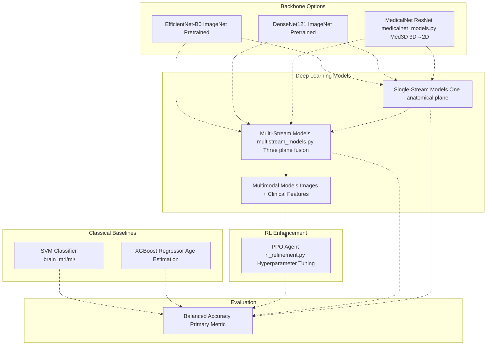
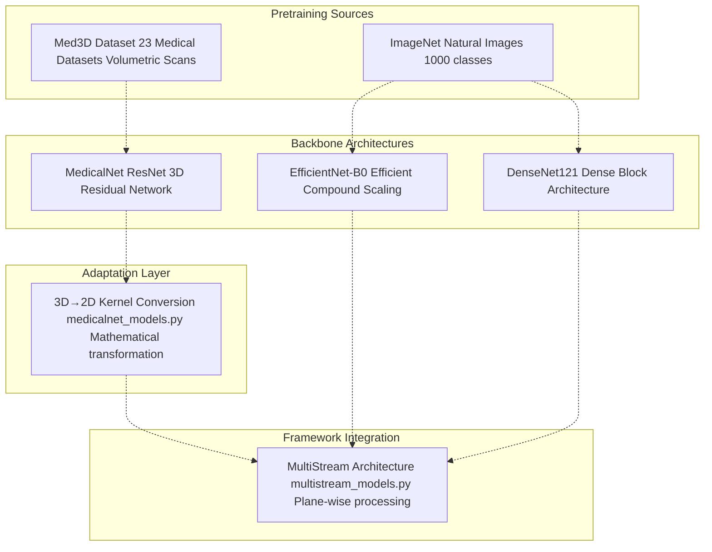
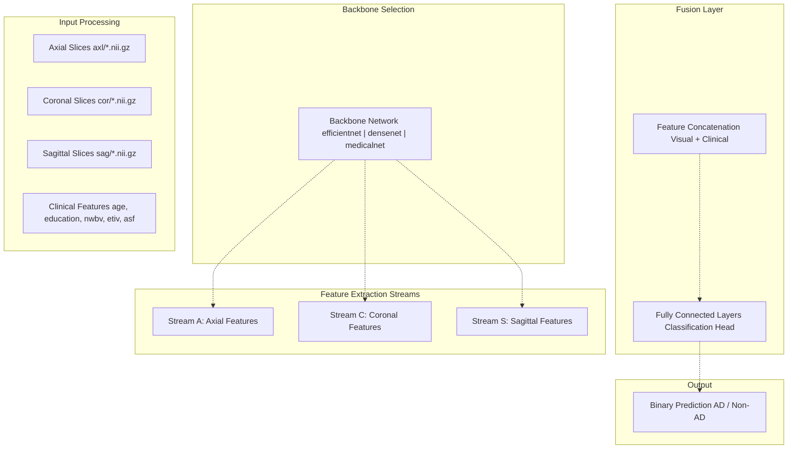
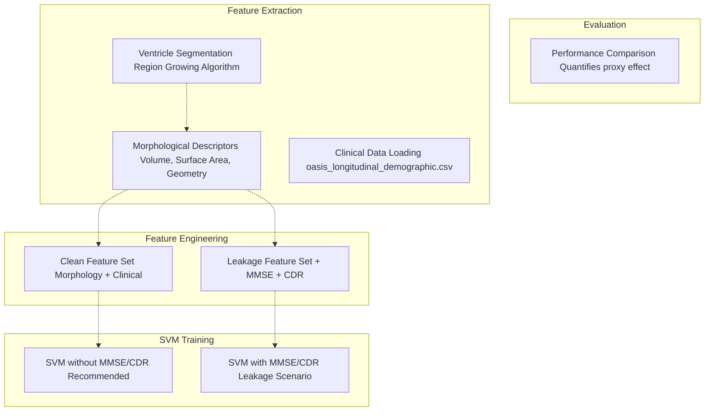
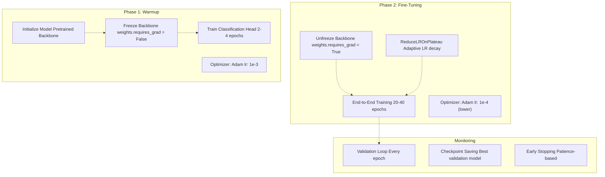
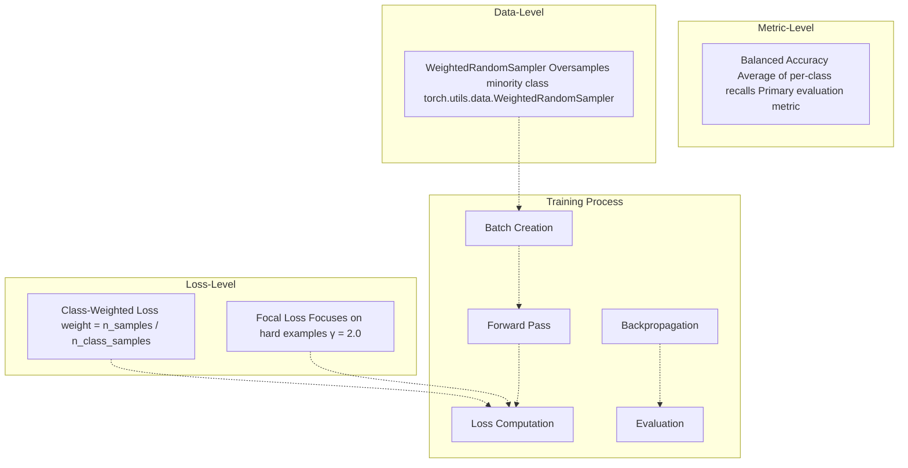
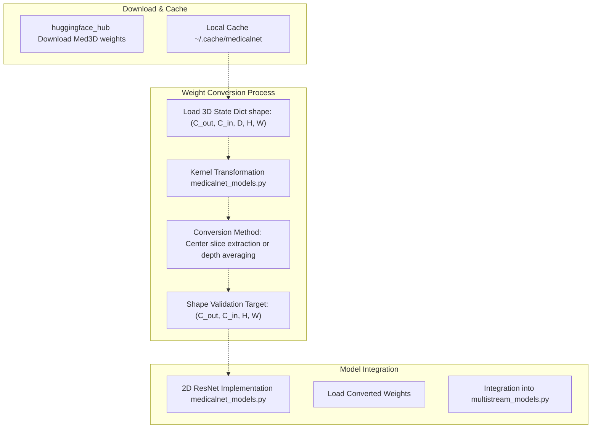
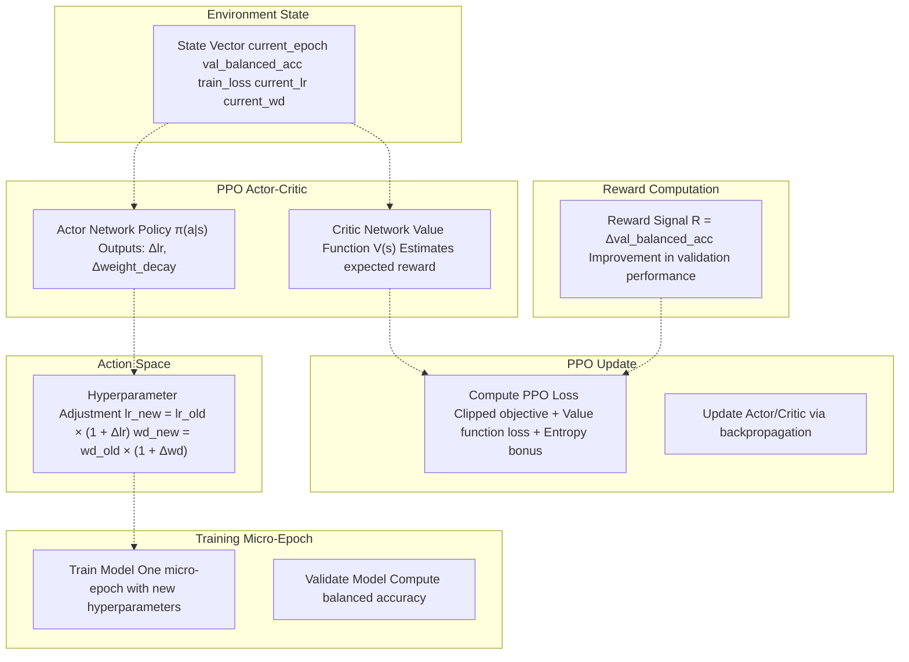

# Models & Training

> **Relevant source files**
> * [README.md](https://github.com/ThalesMMS/brain-mri-pipelines-py/blob/cd9d51a5/README.md)

## Purpose and Scope

This document provides comprehensive technical documentation of all model architectures, training procedures, loss functions, and evaluation metrics used in the brain-mri-pipelines-py framework. It covers three primary modeling approaches: (1) deep learning multi-stream architectures with multiple backbone options, (2) classical machine learning baselines for comparison, and (3) reinforcement learning-based hyperparameter refinement. The document focuses on model definitions, training configurations, and the mechanisms employed to handle class imbalance in medical imaging datasets.

For information about the three-stage research pipeline that utilizes these models, see [Three-Stage Research Pipeline](6%20User-Interfaces.md). For details on data processing and subject-level splitting, see [Data Processing Pipeline](3b%20Data-Processing-Pipeline.md) and [Subject-Level Splitting & Leakage Prevention](3d%20Subject-Level-Splitting-&-Leakage-Prevention.md). For interface usage, see [User Interfaces](7%20Development-&-Configuration.md).

**Sources:** README.md

---

## Model Architecture Overview

The framework implements a hierarchical model ecosystem spanning three architectural tiers: classical machine learning baselines, deep learning models with increasing complexity, and RL-enhanced variants. All models converge on a common evaluation framework using balanced accuracy as the primary metric.



**Diagram: Model Architecture Hierarchy and Code Entity Mapping**

**Sources:** [README.md L9-L18](https://github.com/ThalesMMS/brain-mri-pipelines-py/blob/cd9d51a5/README.md#L9-L18)

 **Sources**: [Project overview and setup](https://github.com/ThalesMMS/brain-mri-pipelines-py/blob/cd9d51a5/README.md#L184-L189)

---

## Model Type Comparison

| Model Category | Complexity | Input Modalities | Primary Use Case | Code Location |
| --- | --- | --- | --- | --- |
| SVM | Low | Morphological + Clinical | Classical baseline, leakage analysis | `brain_mri/ml/` |
| XGBoost | Low | Clinical covariates | Regression baseline | `brain_mri/ml/` |
| Single-Stream DL | Medium | 1 anatomical plane | Single-view learning | `brain_mri/ml/multistream_models.py` |
| Multi-Stream DL | High | 3 anatomical planes | Multi-view fusion | `brain_mri/ml/multistream_models.py` |
| Multimodal DL | High | 3 planes + Clinical | Full integration | `brain_mri/ml/multistream_models.py` |
| RL-Enhanced | Very High | Multimodal + Adaptive HP | Automated optimization | `brain_mri/ml/rl_refinement.py` |

**Sources:** [README.md L9-L18](https://github.com/ThalesMMS/brain-mri-pipelines-py/blob/cd9d51a5/README.md#L9-L18)

---

## Deep Learning Backbones

The framework supports three interchangeable backbone architectures for feature extraction from MRI slices. Each backbone can be used in single-stream, multi-stream, or multimodal configurations.

### Backbone Characteristics

| Backbone | Pretraining Source | Parameters | Key Characteristics | Implementation |
| --- | --- | --- | --- | --- |
| EfficientNet-B0 | ImageNet (1.2M natural images) | ~5M | Compound scaling, efficient architecture | torchvision/timm |
| DenseNet121 | ImageNet | ~8M | Dense connectivity, feature reuse | torchvision |
| MedicalNet ResNet | Med3D (23 medical datasets) | Varies | Medical domain knowledge, 3D→2D converted | `brain_mri/ml/medicalnet_models.py` |



**Diagram: Backbone Pretraining and Integration Pipeline**

### Backbone Selection Strategy

The choice of backbone depends on the specific research question:

* **EfficientNet-B0**: Recommended for resource-constrained scenarios. Provides excellent performance-to-parameter ratio. Suitable when training speed is a priority.
* **DenseNet121**: Ideal for investigating feature reuse across network layers. Dense connections facilitate gradient flow, beneficial for smaller medical imaging datasets.
* **MedicalNet ResNet**: Preferred for leveraging medical domain knowledge. The Med3D pretraining on 23 medical imaging datasets provides representations specifically tuned for anatomical structures. Requires the 3D→2D conversion process described in [MedicalNet Integration & 3D→2D Conversion](5b%20MedicalNet-Integration-&-3D→2D-Conversion.md).

**Sources:** [README.md L11-L12](https://github.com/ThalesMMS/brain-mri-pipelines-py/blob/cd9d51a5/README.md#L11-L12)

 **Sources**: [Project overview and setup](https://github.com/ThalesMMS/brain-mri-pipelines-py/blob/cd9d51a5/README.md#L171-L173)

---

## Multi-Stream Architecture

The core architectural innovation is the multi-stream design implemented in `brain_mri/ml/multistream_models.py`. This architecture processes three anatomical planes (axial, coronal, sagittal) through independent feature extraction streams before fusion.



**Diagram: Multi-Stream Multimodal Architecture Data Flow**

### Stream Configuration

The architecture supports flexible stream configuration:

* **Single-Stream Mode**: Uses only one anatomical plane (e.g., axial only). Useful for ablation studies or when only one plane is available.
* **Dual-Stream Mode**: Combines two planes. Not explicitly recommended but supported for experimentation.
* **Tri-Stream Mode**: Full multi-view processing with all three planes. Recommended configuration for maximum performance.
* **Multimodal Mode**: Adds clinical feature integration. Enabled via `--multimodal` flag in CLI scripts. Clinical features include: `age`, `education`, `nwbv` (normalized whole brain volume), `etiv` (estimated total intracranial volume), and `asf` (atlas scaling factor).

**Sources:** [README.md L10-L12](https://github.com/ThalesMMS/brain-mri-pipelines-py/blob/cd9d51a5/README.md#L10-L12)

 **Sources**: [Project overview and setup](https://github.com/ThalesMMS/brain-mri-pipelines-py/blob/cd9d51a5/README.md#L115-L118)

---

## Classical Machine Learning Baselines

The framework includes classical ML baselines for performance comparison and methodological validation. These models operate on handcrafted features rather than learned representations.

### SVM Classifier

**Purpose**: Binary classification (AD vs. Non-AD) using morphological descriptors and clinical covariates.

**Feature Types**:

1. **Morphological Descriptors**: Ventricle geometry features extracted from segmentation masks
2. **Clinical Covariates**: Age, education, nWBV, eTIV, ASF
3. **Proxy Features** (Optional, creates leakage): MMSE (Mini-Mental State Examination), CDR (Clinical Dementia Rating)

**Training Scenarios**:

| Scenario | Features Used | Methodological Status | Use Case |
| --- | --- | --- | --- |
| `svm_with_mmse_cdr` | Morphological + Clinical + MMSE/CDR | ⚠️ Target Leakage | Demonstrates proxy variable danger |
| `svm_without_mmse_cdr` | Morphological + Clinical only | ✓ Clean | Recommended imaging-based analysis |

The framework explicitly warns about MMSE/CDR inclusion. These cognitive assessment scores are strong proxies for dementia diagnosis and create target leakage when used as predictive features. The `svm_without_mmse_cdr` scenario provides methodologically sound imaging-based classification.



**Diagram: SVM Training Scenarios and Feature Engineering Pipeline**

**Sources:** [README.md L13-L15](https://github.com/ThalesMMS/brain-mri-pipelines-py/blob/cd9d51a5/README.md#L13-L15)

 **Sources**: [Project overview and setup](https://github.com/ThalesMMS/brain-mri-pipelines-py/blob/cd9d51a5/README.md#L167-L169)

### XGBoost Regressor

**Purpose**: Age estimation from clinical covariates. Serves as a regression baseline to validate the data processing pipeline and feature quality.

**Features**: Clinical covariates only (age used as target, other features as predictors in cross-validation setup).

**Execution**: Automatically run as part of `run_baselines_cli.py`.

**Sources:** [README.md L15](https://github.com/ThalesMMS/brain-mri-pipelines-py/blob/cd9d51a5/README.md#L15-L15)

 **Sources**: [Project overview and setup](https://github.com/ThalesMMS/brain-mri-pipelines-py/blob/cd9d51a5/README.md#L103-L108)

---

## Training Configuration

The framework implements a sophisticated two-phase training strategy designed for transfer learning scenarios. This approach is critical for adapting pretrained backbones to the specific characteristics of brain MRI data.

### Two-Phase Training Strategy



**Diagram: Two-Phase Training Workflow**

### Training Hyperparameters

| Parameter | Warmup Phase | Fine-Tuning Phase | Notes |
| --- | --- | --- | --- |
| Learning Rate | 1e-3 | 1e-4 | Lower LR prevents catastrophic forgetting |
| Weight Decay | 1e-4 | 1e-4 | L2 regularization |
| Batch Size | 16-32 | 16-32 | Depends on GPU memory |
| Epochs | 2-4 | 20-40 | Configurable via `--warmup-epochs`, `--epochs` |
| Optimizer | Adam | Adam | β₁=0.9, β₂=0.999 |
| LR Scheduler | None | ReduceLROnPlateau | Factor=0.5, patience=5 |

### CLI Training Execution

**Standard Deep Learning Training**:

```
python run_deep_models_cli.py --seed 42 --epochs 40 --backbones efficientnet,medicalnet,densenet
```

**Multimodal Training with Clinical Features**:

```
python run_deep_models_cli.py --seed 42 --epochs 40 --backbones efficientnet --multimodal
```

**Stage 2 Pipeline (Explicit Warmup/Fine-Tuning)**:

```
python brain_mri/scripts/run_pc2_finetune.py --backbone efficientnet --seed 42 --epochs 6 --warmup-epochs 2
```

**Sources:** [Project overview and setup](https://github.com/ThalesMMS/brain-mri-pipelines-py/blob/cd9d51a5/README.md#L112-L118)

 **Sources**: [Project overview and setup](https://github.com/ThalesMMS/brain-mri-pipelines-py/blob/cd9d51a5/README.md#L135-L141)

### Training Loop Structure

The training loop implements the following key components:

1. **Weighted Random Sampling**: Addresses class imbalance by oversampling minority class during batch creation.
2. **Mixed Precision Training**: Uses `torch.cuda.amp.autocast()` for memory efficiency (when available).
3. **Gradient Accumulation**: Simulates larger batch sizes when GPU memory is limited.
4. **Validation Monitoring**: Computes balanced accuracy on validation set every epoch.
5. **Checkpoint Management**: Saves best model based on validation balanced accuracy.
6. **Early Stopping**: Terminates training if validation performance plateaus.

**Sources:** [Project overview and setup](https://github.com/ThalesMMS/brain-mri-pipelines-py/blob/cd9d51a5/README.md#L164-L169)

---

## Loss Functions & Class Imbalance Handling

Medical imaging datasets typically exhibit severe class imbalance (fewer AD cases than healthy controls). The framework implements multiple complementary mechanisms to prevent model collapse to majority-class prediction.

### Anti-Collapse Mechanism Stack



**Diagram: Anti-Collapse Mechanism Integration**

### Weighted Random Sampler

**Purpose**: Ensures balanced representation of both classes during training by adjusting sampling probabilities.

**Implementation**: The sampler assigns sampling weights inversely proportional to class frequency. For a dataset with 80% non-AD and 20% AD cases, AD samples are 4× more likely to be selected per epoch.

**Formula**:

```
weight[i] = total_samples / (num_classes × class_count[class[i]])
```

### Class-Weighted Loss

**Purpose**: Penalizes misclassification of minority class more heavily during loss computation.

**Implementation**: The loss function multiplies each sample's loss by its class weight before aggregation.

**Weight Calculation**:

```
class_weight[c] = total_samples / (num_classes × class_samples[c])
```

### Focal Loss

**Purpose**: Addresses hard example mining by down-weighting well-classified examples and focusing on challenging cases.

**Formula**:

```
FL(p_t) = -α_t × (1 - p_t)^γ × log(p_t)
```

Where:

* `p_t` is the model's estimated probability for the true class
* `γ = 2.0` is the focusing parameter (higher γ increases focus on hard examples)
* `α_t` is the class weight

**Effect**: When a sample is confidently correct (`p_t` → 1), the `(1 - p_t)^γ` term approaches 0, down-weighting the loss. When a sample is misclassified or uncertain, the loss remains high.

**Sources:** [Project overview and setup](https://github.com/ThalesMMS/brain-mri-pipelines-py/blob/cd9d51a5/README.md#L164-L167)

---

## Evaluation Metrics

The framework prioritizes **Balanced Accuracy** as the primary metric due to the inherent class imbalance in medical imaging datasets. This section details the metric calculation and interpretation.

### Primary Metric: Balanced Accuracy

**Definition**: The arithmetic mean of sensitivity (recall for positive class) and specificity (recall for negative class).

**Formula**:

```
Balanced Accuracy = (Sensitivity + Specificity) / 2
                  = (TPR + TNR) / 2
                  = 0.5 × (TP/(TP+FN) + TN/(TN+FP))
```

**Advantages for Imbalanced Datasets**:

1. **Class-agnostic**: Treats both classes equally regardless of their prevalence
2. **Interpretable**: Ranges from 0.0 (worst) to 1.0 (perfect), with 0.5 representing random guessing
3. **Robust**: Prevents inflated accuracy from majority-class prediction

**Example Scenario**:

| Metric | Majority Predictor | Balanced Classifier |
| --- | --- | --- |
| Standard Accuracy | 0.85 (85/100) | 0.80 (80/100) |
| Balanced Accuracy | 0.50 | 0.80 |
| Sensitivity | 0.00 | 0.75 |
| Specificity | 1.00 | 0.85 |

In this example, a naive majority-class predictor achieves 85% standard accuracy but 50% balanced accuracy (random guessing). The balanced classifier achieves lower standard accuracy but demonstrates true discriminative ability.

### Secondary Metrics

The framework also computes and logs the following metrics for comprehensive evaluation:

| Metric | Definition | Use Case |
| --- | --- | --- |
| Accuracy | (TP + TN) / Total | Overall correctness (biased by imbalance) |
| Sensitivity | TP / (TP + FN) | AD detection rate (recall for positive class) |
| Specificity | TN / (TN + FP) | Healthy control identification rate |
| Precision | TP / (TP + FP) | Positive predictive value |
| F1 Score | 2 × (Precision × Recall) / (Precision + Recall) | Harmonic mean of precision/recall |
| AUC-ROC | Area under ROC curve | Threshold-independent performance |

### Statistical Significance Testing

When comparing models, the framework supports Wilcoxon signed-rank tests for paired comparisons across cross-validation folds. This ensures that performance differences are statistically significant rather than due to random variation.

**Execution**:

```
python -m brain_mri.scripts.generate_article_tables --write
```

This generates LaTeX-formatted tables with statistical comparison results.

**Sources:** [Project overview and setup](https://github.com/ThalesMMS/brain-mri-pipelines-py/blob/cd9d51a5/README.md#L164-L164)

 **Sources**: [Project overview and setup](https://github.com/ThalesMMS/brain-mri-pipelines-py/blob/cd9d51a5/README.md#L153-L156)

---

## Model Serialization & Checkpointing

The framework implements comprehensive model persistence for reproducibility and staged training workflows.

### Checkpoint Structure

Models are saved to `output/` directory with the following information:

```markdown
Checkpoint Contents:
├── model_state_dict          # Model weights
├── optimizer_state_dict      # Optimizer state (for training resumption)
├── epoch                      # Current epoch number
├── best_val_balanced_acc     # Best validation balanced accuracy
├── config                     # Hyperparameters and architecture config
└── training_history          # Loss and metric curves
```

### File Naming Convention

Checkpoints follow this pattern:

```
{backbone}_{stream_config}_{multimodal_flag}_seed{seed}_best.pth
```

Examples:

* `efficientnet_tristream_multimodal_seed42_best.pth`
* `medicalnet_singlestream_seed123_best.pth`
* `densenet_tristream_seed42_best.pth`

### Loading Pretrained Models

Models from earlier pipeline stages can be loaded for continued training:

```
# Stage 2 saves fine-tuned model# Stage 3 RL refinement loads it as starting pointcheckpoint = torch.load('path/to/checkpoint.pth')model.load_state_dict(checkpoint['model_state_dict'])
```

**Sources:** [README.md L37](https://github.com/ThalesMMS/brain-mri-pipelines-py/blob/cd9d51a5/README.md#L37-L37)

 **Sources**: [Project overview and setup](https://github.com/ThalesMMS/brain-mri-pipelines-py/blob/cd9d51a5/README.md#L143-L148)

---

## MedicalNet Integration

The integration of MedicalNet pretrained weights represents a unique contribution of this framework. This section details the technical process of adapting 3D volumetric models to 2D slice-based inference.

### Med3D Pretraining Background

**Med3D Project**: A transfer learning initiative that pretrained 3D ResNet architectures on 23 medical imaging datasets including CT scans, MRI sequences, and other volumetric modalities.

**Available Architectures**: ResNet-10, ResNet-18, ResNet-34, ResNet-50, ResNet-101, ResNet-152, ResNet-200

**Weight Source**: Downloaded from HuggingFace Hub via `huggingface_hub` library, cached in `~/.cache/medicalnet`.

### 3D → 2D Kernel Conversion

The conversion process mathematically transforms 3D convolutional kernels `(C_out, C_in, D, H, W)` into 2D equivalents `(C_out, C_in, H, W)`.



**Diagram: MedicalNet 3D→2D Conversion Pipeline**

### Conversion Methods

Two primary strategies are implemented in `medicalnet_models.py`:

**1. Center Slice Extraction**

```
2D_kernel[c_out, c_in, h, w] = 3D_kernel[c_out, c_in, D//2, h, w]
```

Extracts the central slice along the depth dimension. Assumes the middle slice captures representative features.

**2. Depth Averaging**

```
2D_kernel[c_out, c_in, h, w] = mean(3D_kernel[c_out, c_in, :, h, w], dim=0)
```

Averages across the depth dimension. Aggregates information from all depth slices.

### Implementation Details

**File**: `brain_mri/ml/medicalnet_models.py`

The module provides:

* `MedicalNetResNet2D` class: 2D ResNet architecture matching Med3D structure
* `load_medicalnet_weights()` function: Downloads and converts 3D weights
* `verify_conversion()` function: Validates converted weight shapes

**Usage in Training**:

```
python run_deep_models_cli.py --backbones medicalnet --epochs 40
```

The framework automatically handles weight download, conversion, and loading during model initialization.

**Citation Requirement**: When using MedicalNet integration, cite:

> Chen, S., Ma, K., & Zheng, Y. (2019). Med3D: Transfer Learning for 3D Medical Image Analysis. *arXiv preprint* arXiv:1904.00625.

**Sources:** [Project overview and setup](https://github.com/ThalesMMS/brain-mri-pipelines-py/blob/cd9d51a5/README.md#L171-L173)

 **Sources**: [Project overview and setup](https://github.com/ThalesMMS/brain-mri-pipelines-py/blob/cd9d51a5/README.md#L186-L187)

 **Sources**: [Project overview and setup](https://github.com/ThalesMMS/brain-mri-pipelines-py/blob/cd9d51a5/README.md#L211-L213)

---

## RL-Based Hyperparameter Refinement

The framework includes an optional reinforcement learning component that automatically adjusts hyperparameters during training to maximize validation performance. This system is implemented in `brain_mri/ml/rl_refinement.py`.

### PPO Agent Architecture

The PPO (Proximal Policy Optimization) agent treats hyperparameter selection as a sequential decision-making problem.



**Diagram: RL Hyperparameter Refinement Workflow**

### State Representation

The agent observes the following state features at each decision point:

| Feature | Description | Range |
| --- | --- | --- |
| `epoch` | Current training epoch | [0, max_epochs] |
| `val_balanced_acc` | Validation balanced accuracy | [0.0, 1.0] |
| `train_loss` | Training loss | [0.0, ∞) |
| `lr` | Current learning rate | (0, 1e-2] |
| `weight_decay` | Current L2 regularization | [0, 1e-2] |

### Action Space

The agent outputs continuous adjustments to hyperparameters:

```
lr_new = lr_old × (1 + tanh(Δlr))
wd_new = wd_old × (1 + tanh(Δwd))
```

The `tanh` activation bounds adjustments to [-1, 1], preventing catastrophic changes.

### Reward Function

The reward signal is the change in validation balanced accuracy:

```
R_t = val_balanced_acc_t - val_balanced_acc_(t-1)
```

Positive rewards encourage actions that improve validation performance, while negative rewards penalize degradation.

### PPO Training Objective

The PPO algorithm optimizes the following clipped objective:

```
L^CLIP(θ) = E[min(r_t(θ) × A_t, clip(r_t(θ), 1-ε, 1+ε) × A_t)]
```

Where:

* `r_t(θ) = π_θ(a_t|s_t) / π_θ_old(a_t|s_t)` is the probability ratio
* `A_t` is the advantage estimate
* `ε = 0.2` is the clipping threshold

### Stage 3 Pipeline Execution

**Command**:

```
python brain_mri/scripts/run_pc3_rl_refinement.py --backbone efficientnet --seed 42 --episodes 4 --horizon 4
```

**Parameters**:

* `--episodes`: Number of RL training episodes (outer loop)
* `--horizon`: Number of micro-epochs per episode (inner loop)
* `--backbone`: Which pretrained model to refine (loads from Stage 2 checkpoint)

**Sources:** [README.md L17-L18](https://github.com/ThalesMMS/brain-mri-pipelines-py/blob/cd9d51a5/README.md#L17-L18)

 **Sources**: [Project overview and setup](https://github.com/ThalesMMS/brain-mri-pipelines-py/blob/cd9d51a5/README.md#L143-L148)

 **Sources**: [Project overview and setup](https://github.com/ThalesMMS/brain-mri-pipelines-py/blob/cd9d51a5/README.md#L187-L187)

---

## Training Execution Summary

The following table summarizes the primary entry points for model training:

| Entry Point | Purpose | Key Arguments | Output Location |
| --- | --- | --- | --- |
| `main.py` | GUI-based single experiment | Interactive configuration | `output/gui_runs/` |
| `run_baselines_cli.py` | Classical ML baselines | None (uses default config) | `output/baselines/` |
| `run_deep_models_cli.py` | Standard deep learning training | `--backbones`, `--epochs`, `--seed`, `--multimodal` | `output/deep_models/` |
| `run_pc1_embeddings.py` | Stage 1: Embedding analysis | `--dl-backbone` | `output/stage1/` |
| `run_pc2_finetune.py` | Stage 2: Transfer learning | `--backbone`, `--epochs`, `--warmup-epochs` | `output/stage2/` |
| `run_pc3_rl_refinement.py` | Stage 3: RL refinement | `--backbone`, `--episodes`, `--horizon` | `output/stage3/` |

**Sources:** README.md

 **Sources**: [Project overview and setup](https://github.com/ThalesMMS/brain-mri-pipelines-py/blob/cd9d51a5/README.md#L184-L195)

---

This document provides the comprehensive technical foundation for understanding and utilizing all model architectures and training procedures in the brain-mri-pipelines-py framework. For practical usage examples, consult [Quick Start Guide](2c%20Quick-Start-Guide.md). For implementation details of the three-stage research pipeline, see [Three-Stage Research Pipeline](6%20User-Interfaces.md).


### On this page

* [Models & Training](#5-models-training)
* [Purpose and Scope](#5-purpose-and-scope)
* [Model Architecture Overview](#5-model-architecture-overview)
* [Model Type Comparison](#5-model-type-comparison)
* [Deep Learning Backbones](#5-deep-learning-backbones)
* [Backbone Characteristics](#5-backbone-characteristics)
* [Backbone Selection Strategy](#5-backbone-selection-strategy)
* [Multi-Stream Architecture](#5-multi-stream-architecture)
* [Stream Configuration](#5-stream-configuration)
* [Classical Machine Learning Baselines](#5-classical-machine-learning-baselines)
* [SVM Classifier](#5-svm-classifier)
* [XGBoost Regressor](#5-xgboost-regressor)
* [Training Configuration](#5-training-configuration)
* [Two-Phase Training Strategy](#5-two-phase-training-strategy)
* [Training Hyperparameters](#5-training-hyperparameters)
* [CLI Training Execution](#5-cli-training-execution)
* [Training Loop Structure](#5-training-loop-structure)
* [Loss Functions & Class Imbalance Handling](#5-loss-functions-class-imbalance-handling)
* [Anti-Collapse Mechanism Stack](#5-anti-collapse-mechanism-stack)
* [Weighted Random Sampler](#5-weighted-random-sampler)
* [Class-Weighted Loss](#5-class-weighted-loss)
* [Focal Loss](#5-focal-loss)
* [Evaluation Metrics](#5-evaluation-metrics)
* [Primary Metric: Balanced Accuracy](#5-primary-metric-balanced-accuracy)
* [Secondary Metrics](#5-secondary-metrics)
* [Statistical Significance Testing](#5-statistical-significance-testing)
* [Model Serialization & Checkpointing](#5-model-serialization-checkpointing)
* [Checkpoint Structure](#5-checkpoint-structure)
* [File Naming Convention](#5-file-naming-convention)
* [Loading Pretrained Models](#5-loading-pretrained-models)
* [MedicalNet Integration](#5-medicalnet-integration)
* [Med3D Pretraining Background](#5-med3d-pretraining-background)
* [3D → 2D Kernel Conversion](#5-3d-2d-kernel-conversion)
* [Conversion Methods](#5-conversion-methods)
* [Implementation Details](#5-implementation-details)
* [RL-Based Hyperparameter Refinement](#5-rl-based-hyperparameter-refinement)
* [PPO Agent Architecture](#5-ppo-agent-architecture)
* [State Representation](#5-state-representation)
* [Action Space](#5-action-space)
* [Reward Function](#5-reward-function)
* [PPO Training Objective](#5-ppo-training-objective)
* [Stage 3 Pipeline Execution](#5-stage-3-pipeline-execution)
* [Training Execution Summary](#5-training-execution-summary)

Ask Devin about brain-mri-pipelines-py