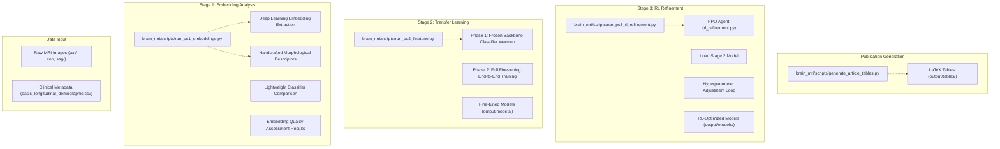
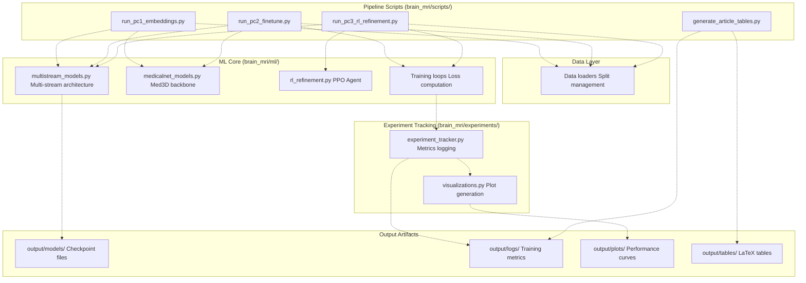
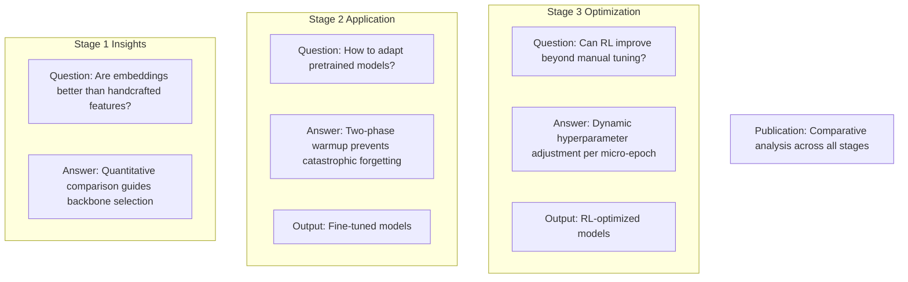

# Three-Stage Research Pipeline

> **Relevant source files**
> * [README.md](https://github.com/ThalesMMS/brain-mri-pipelines-py/blob/cd9d51a5/README.md)

## Purpose and Scope

This document describes the three-stage experimental methodology implemented in the `brain_mri/scripts/` directory. The pipeline provides a progressive model refinement strategy that:

1. **Stage 1**: Validates the quality of learned embeddings against handcrafted features
2. **Stage 2**: Implements transfer learning with two-phase fine-tuning
3. **Stage 3**: Applies reinforcement learning to optimize hyperparameters

Each stage builds upon the previous one, culminating in publication-ready results. For detailed implementation of individual stages, see sections [6.1](#6.1), [6.2](#6.2), [6.3](#6.3), and [6.4](#6.4). For information about the underlying model architectures, see [System Architecture](#3) and [Models & Training](#5).

**Sources:** [README.md L122-L158](https://github.com/ThalesMMS/brain-mri-pipelines-py/blob/cd9d51a5/README.md#L122-L158)

---

## Pipeline Overview

The three-stage pipeline implements a methodologically rigorous approach to Alzheimer's disease detection. Each stage addresses a specific research question and produces artifacts that inform subsequent stages.

### Research Questions

| Stage | Research Question | Output Artifact |
| --- | --- | --- |
| **Stage 1** | Do deep learning embeddings capture more diagnostic information than handcrafted morphological descriptors? | Performance comparison tables |
| **Stage 2** | How should pretrained models be adapted to domain-specific medical imaging data? | Fine-tuned multi-stream models |
| **Stage 3** | Can reinforcement learning improve model performance through dynamic hyperparameter adjustment? | RL-optimized final models |

The pipeline emphasizes **progressive refinement**: Stage 2 builds on insights from Stage 1, and Stage 3 optimizes models produced by Stage 2. All stages output results to the `output/` directory for reproducibility and publication.

**Sources:** [README.md L122-L158](https://github.com/ThalesMMS/brain-mri-pipelines-py/blob/cd9d51a5/README.md#L122-L158)

---

## Pipeline Architecture

The following diagram illustrates the complete pipeline flow from raw data to publication artifacts, showing specific script names and their relationships:



**Key Characteristics:**

* **Sequential Dependency**: Stage 3 requires Stage 2 models as input
* **Parallel Execution**: Stages 1 and 2 can run independently
* **Unified Output**: All stages write to `output/` with structured subdirectories
* **Publication Ready**: `generate_article_tables` consolidates results

**Sources:** [README.md L122-L158](https://github.com/ThalesMMS/brain-mri-pipelines-py/blob/cd9d51a5/README.md#L122-L158)

---

## Script Execution Interface

Each stage is implemented as a standalone CLI script with specific command-line arguments. The following table summarizes the execution interface:

### Stage 1: Embedding Analysis

```
python brain_mri/scripts/run_pc1_embeddings.py --dl-backbone efficientnet
```

| Argument | Description | Default |
| --- | --- | --- |
| `--dl-backbone` | Deep learning backbone for embedding extraction (`efficientnet`, `densenet`, `medicalnet`) | Required |
| `--seed` | Random seed for reproducibility | 42 |

**Purpose**: Extracts embeddings from the specified backbone and compares them against handcrafted morphological descriptors using a lightweight classifier. Results are written to `output/pc1_embeddings/`.

**Sources:** [README.md L126-L132](https://github.com/ThalesMMS/brain-mri-pipelines-py/blob/cd9d51a5/README.md#L126-L132)

---

### Stage 2: Transfer Learning & Fine-Tuning

```
python brain_mri/scripts/run_pc2_finetune.py --backbone efficientnet --seed 42 --epochs 6 --warmup-epochs 2
```

| Argument | Description | Default |
| --- | --- | --- |
| `--backbone` | Backbone architecture (`efficientnet`, `densenet`, `medicalnet`) | Required |
| `--seed` | Random seed for reproducibility | Required |
| `--epochs` | Total training epochs | Required |
| `--warmup-epochs` | Number of epochs with frozen backbone | Required |

**Purpose**: Implements two-phase transfer learning. First, trains only the classification head while keeping the backbone frozen (`warmup-epochs`). Then, unfreezes all layers and fine-tunes end-to-end for the remaining epochs. Models are saved to `output/models/`.

**Sources:** [README.md L134-L140](https://github.com/ThalesMMS/brain-mri-pipelines-py/blob/cd9d51a5/README.md#L134-L140)

---

### Stage 3: RL Hyperparameter Refinement

```
python brain_mri/scripts/run_pc3_rl_refinement.py --backbone efficientnet --seed 42 --episodes 4 --horizon 4
```

| Argument | Description | Default |
| --- | --- | --- |
| `--backbone` | Backbone architecture (must match Stage 2) | Required |
| `--seed` | Random seed (must match Stage 2) | Required |
| `--episodes` | Number of RL training episodes | Required |
| `--horizon` | Micro-epochs per episode | Required |

**Purpose**: Loads the fine-tuned model from Stage 2 and applies PPO-based hyperparameter optimization. The agent adjusts learning rate and weight decay based on validation balanced accuracy. Final models are saved to `output/models/rl_refined/`.

**Sources:** [README.md L142-L148](https://github.com/ThalesMMS/brain-mri-pipelines-py/blob/cd9d51a5/README.md#L142-L148)

---

### Results Generation

```
python -m brain_mri.scripts.generate_article_tables --write
```

| Argument | Description | Default |
| --- | --- | --- |
| `--write` | Write LaTeX tables to disk | Flag (optional) |

**Purpose**: Parses experiment logs from all three stages and generates publication-ready LaTeX tables. Tables include statistical comparisons (Wilcoxon tests) and are saved to `output/tables/`.

**Sources:** [README.md L150-L156](https://github.com/ThalesMMS/brain-mri-pipelines-py/blob/cd9d51a5/README.md#L150-L156)

---

## Core Module Integration

The pipeline scripts orchestrate calls to core modules in the `brain_mri/` package. The following diagram shows how scripts map to package components:



**Module Responsibilities:**

* **multistream_models.py**: Defines multi-stream architectures that process axial, coronal, and sagittal views
* **medicalnet_models.py**: Implements Med3D-pretrained backbones with 3D→2D kernel conversion
* **rl_refinement.py**: Implements the PPO agent with actor-critic architecture for hyperparameter optimization
* **experiment_tracker.py**: Logs metrics, hyperparameters, and model configurations
* **visualizations.py**: Generates performance plots (loss curves, accuracy curves, confusion matrices)

**Sources:** [README.md L177-L196](https://github.com/ThalesMMS/brain-mri-pipelines-py/blob/cd9d51a5/README.md#L177-L196)

---

## Progressive Refinement Strategy

The three-stage design implements a **progressive refinement** philosophy where each stage builds upon the previous one's outputs:



### Design Rationale

1. **Stage 1 Validation**: Before investing in expensive deep learning training, Stage 1 validates that learned embeddings outperform traditional feature engineering. This justifies the computational cost of Stages 2 and 3.
2. **Stage 2 Baseline**: Provides a strong baseline using established transfer learning practices (frozen warmup + fine-tuning). This serves as the comparison point for Stage 3's RL optimization.
3. **Stage 3 Innovation**: Demonstrates that RL-based hyperparameter adjustment can improve upon manual hyperparameter tuning. The PPO agent learns to adjust learning rate and weight decay based on validation performance.

**Sources:** [README.md L122-L158](https://github.com/ThalesMMS/brain-mri-pipelines-py/blob/cd9d51a5/README.md#L122-L158)

---

## Output Directory Structure

The pipeline produces artifacts organized by stage:

```python
output/
├── pc1_embeddings/           # Stage 1 results
│   ├── embeddings_*.pkl      # Extracted embedding vectors
│   ├── comparison_*.csv      # Performance comparisons
│   └── plots/                # Visualization of embedding quality
├── models/                   # Stage 2 checkpoints
│   ├── efficientnet_seed42_epoch*.pth
│   ├── densenet_seed42_epoch*.pth
│   └── medicalnet_seed42_epoch*.pth
├── models/rl_refined/        # Stage 3 checkpoints
│   ├── efficientnet_rl_seed42_episode*.pth
│   └── ppo_agent_*.pth       # RL agent checkpoints
├── logs/                     # Training logs from all stages
│   ├── pc1_*.log
│   ├── pc2_*.log
│   └── pc3_*.log
├── plots/                    # Performance visualizations
│   ├── loss_curves/
│   ├── accuracy_curves/
│   └── confusion_matrices/
└── tables/                   # LaTeX tables for publication
    ├── stage1_comparison.tex
    ├── stage2_results.tex
    └── stage3_results.tex
```

**Naming Conventions:**

* Model checkpoints include backbone name, seed, and epoch/episode number
* Logs are timestamped for reproducibility
* Tables follow consistent LaTeX formatting for direct inclusion in manuscripts

**Sources:** [README.md L36-L38](https://github.com/ThalesMMS/brain-mri-pipelines-py/blob/cd9d51a5/README.md#L36-L38)

 [README.md L177-L196](https://github.com/ThalesMMS/brain-mri-pipelines-py/blob/cd9d51a5/README.md#L177-L196)

---

## Execution Workflow

To execute the complete three-stage pipeline:

### Step 1: Prepare Data

Ensure OASIS-2 data is organized in `axl/`, `cor/`, `sag/` directories and `oasis_longitudinal_demographic.csv` is present in the repository root. See [Data Preparation](#2.2) for details.

### Step 2: Run Stage 1 (Embedding Analysis)

```
# Compare embeddings from all three backbonespython brain_mri/scripts/run_pc1_embeddings.py --dl-backbone efficientnetpython brain_mri/scripts/run_pc1_embeddings.py --dl-backbone densenetpython brain_mri/scripts/run_pc1_embeddings.py --dl-backbone medicalnet
```

### Step 3: Run Stage 2 (Transfer Learning)

```
# Fine-tune each backbone with 2 warmup epochs + 4 fine-tuning epochspython brain_mri/scripts/run_pc2_finetune.py --backbone efficientnet --seed 42 --epochs 6 --warmup-epochs 2python brain_mri/scripts/run_pc2_finetune.py --backbone densenet --seed 42 --epochs 6 --warmup-epochs 2python brain_mri/scripts/run_pc2_finetune.py --backbone medicalnet --seed 42 --epochs 6 --warmup-epochs 2
```

### Step 4: Run Stage 3 (RL Refinement)

```
# Apply RL optimization to Stage 2 modelspython brain_mri/scripts/run_pc3_rl_refinement.py --backbone efficientnet --seed 42 --episodes 4 --horizon 4python brain_mri/scripts/run_pc3_rl_refinement.py --backbone densenet --seed 42 --episodes 4 --horizon 4python brain_mri/scripts/run_pc3_rl_refinement.py --backbone medicalnet --seed 42 --episodes 4 --horizon 4
```

### Step 5: Generate Publication Tables

```
python -m brain_mri.scripts.generate_article_tables --write
```

**Parallelization**: Stages 1 and 2 can run in parallel. Stage 3 requires Stage 2 completion. Different backbone experiments within the same stage can also run in parallel.

**Sources:** [README.md L122-L158](https://github.com/ThalesMMS/brain-mri-pipelines-py/blob/cd9d51a5/README.md#L122-L158)

---

## Reproducibility Considerations

The pipeline enforces reproducibility through:

1. **Explicit Seed Management**: All scripts accept a `--seed` argument that controls random number generation across PyTorch, NumPy, and Python's `random` module.
2. **Subject-Level Splitting**: Data splits are generated once and cached in `output/dataset_split.csv`. All stages use the same split to ensure fair comparison. See [Subject-Level Splitting & Leakage Prevention](#3.4) for implementation details.
3. **Deterministic Operations**: Training uses `torch.backends.cudnn.deterministic = True` and `torch.backends.cudnn.benchmark = False` to ensure reproducible results on GPU.
4. **Checkpoint Preservation**: All stages save model checkpoints with descriptive names including seed and epoch numbers, enabling result reconstruction.
5. **Comprehensive Logging**: Experiment tracker logs all hyperparameters, data splits, and metrics for full audit trails.

**Sources:** [README.md L160-L175](https://github.com/ThalesMMS/brain-mri-pipelines-py/blob/cd9d51a5/README.md#L160-L175)

---

## Relationship to Other System Components

The three-stage pipeline integrates with other system components as follows:

* **[Multi-Stream Multimodal Network](#3.1)**: Pipeline scripts instantiate multi-stream architectures from `multistream_models.py`
* **[MedicalNet Integration](#5.2)**: Stage 2 uses pretrained Med3D weights via `medicalnet_models.py`
* **[Training Configuration](#5.4)**: Pipeline scripts configure training hyperparameters (learning rate, weight decay, batch size)
* **[Evaluation Metrics](#5.6)**: All stages use balanced accuracy as the primary metric for consistency
* **[Data Processing Pipeline](#3.2)**: Scripts leverage the data loading infrastructure to maintain subject-level splits

The pipeline serves as the **recommended workflow for research experiments**, while [Graphical User Interface](#7.1) and [Deep Models CLI](#7.3) provide more flexible ad-hoc experimentation interfaces.

**Sources:** [README.md L1-L218](https://github.com/ThalesMMS/brain-mri-pipelines-py/blob/cd9d51a5/README.md#L1-L218)

Refresh this wiki

Last indexed: 5 January 2026 ([cd9d51](https://github.com/ThalesMMS/brain-mri-pipelines-py/commit/cd9d51a5))

### On this page

* [Three-Stage Research Pipeline](#6-three-stage-research-pipeline)
* [Purpose and Scope](#6-purpose-and-scope)
* [Pipeline Overview](#6-pipeline-overview)
* [Research Questions](#6-research-questions)
* [Pipeline Architecture](#6-pipeline-architecture)
* [Script Execution Interface](#6-script-execution-interface)
* [Stage 1: Embedding Analysis](#6-stage-1-embedding-analysis)
* [Stage 2: Transfer Learning & Fine-Tuning](#6-stage-2-transfer-learning-fine-tuning)
* [Stage 3: RL Hyperparameter Refinement](#6-stage-3-rl-hyperparameter-refinement)
* [Results Generation](#6-results-generation)
* [Core Module Integration](#6-core-module-integration)
* [Progressive Refinement Strategy](#6-progressive-refinement-strategy)
* [Design Rationale](#6-design-rationale)
* [Output Directory Structure](#6-output-directory-structure)
* [Execution Workflow](#6-execution-workflow)
* [Step 1: Prepare Data](#6-step-1-prepare-data)
* [Step 2: Run Stage 1 (Embedding Analysis)](#6-step-2-run-stage-1-embedding-analysis)
* [Step 3: Run Stage 2 (Transfer Learning)](#6-step-3-run-stage-2-transfer-learning)
* [Step 4: Run Stage 3 (RL Refinement)](#6-step-4-run-stage-3-rl-refinement)
* [Step 5: Generate Publication Tables](#6-step-5-generate-publication-tables)
* [Reproducibility Considerations](#6-reproducibility-considerations)
* [Relationship to Other System Components](#6-relationship-to-other-system-components)

Ask Devin about brain-mri-pipelines-py