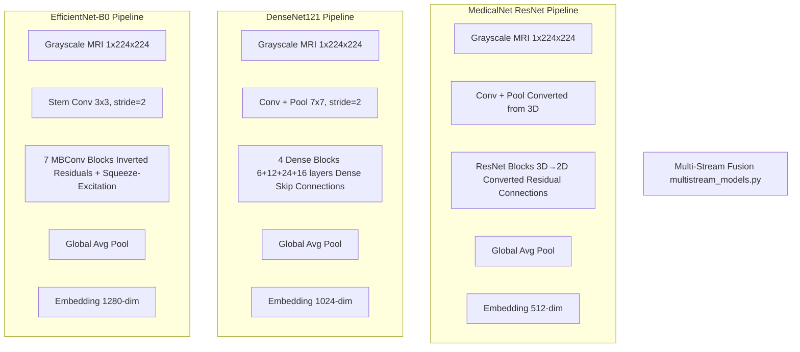
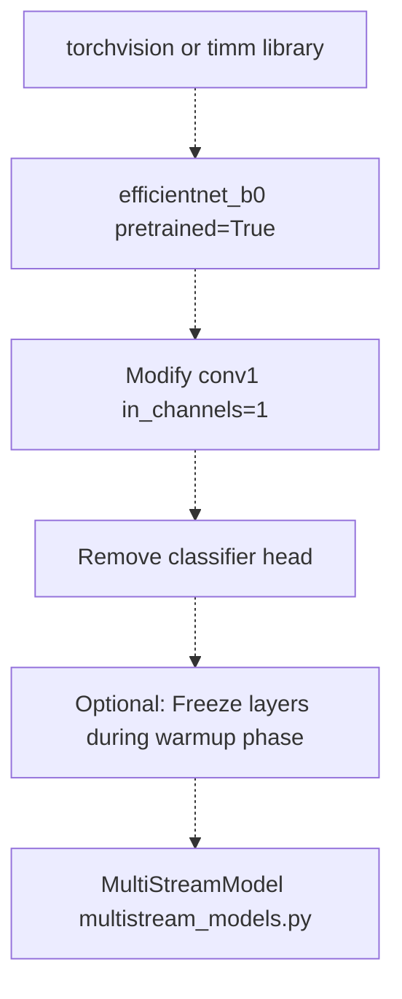
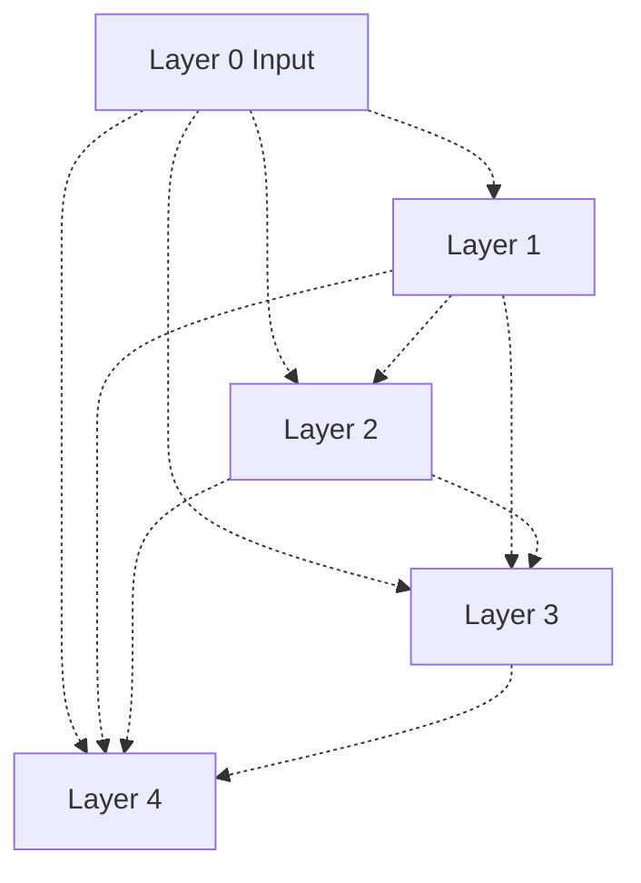
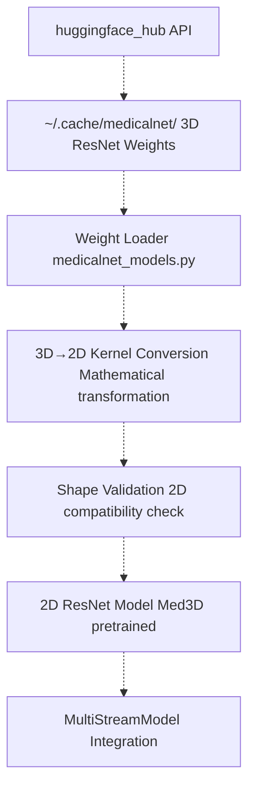
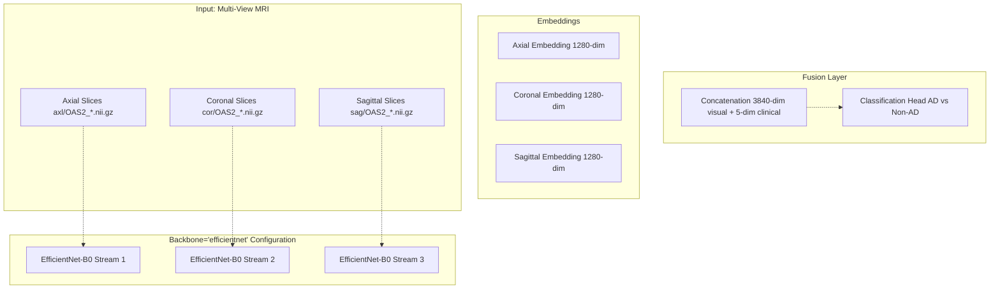
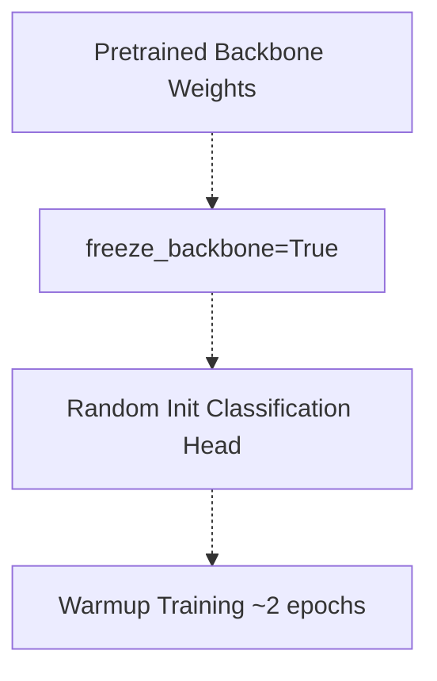
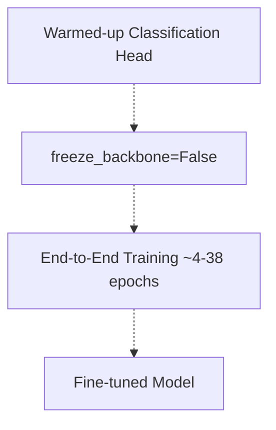
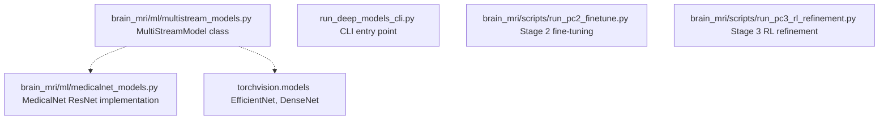

# Deep Learning Backbones

> **Relevant source files**
> * [README.md](https://github.com/ThalesMMS/brain-mri-pipelines-py/blob/cd9d51a5/README.md)

## Purpose and Scope

This document details the three deep learning backbone architectures supported by the framework: **EfficientNet-B0**, **DenseNet121**, and **MedicalNet ResNet**. These backbones serve as feature extractors in the multi-stream architecture, processing 2D MRI slices from three anatomical planes (axial, coronal, sagittal) to generate embeddings for Alzheimer's disease classification.

For information about the multi-stream fusion architecture that combines these backbones with clinical data, see [Multi-Stream Multimodal Network](3a%20Multi-Stream-Multimodal-Network.md). For the specific 3D→2D weight conversion process used by MedicalNet, see [MedicalNet Integration & 3D→2D Conversion](5b%20MedicalNet-Integration-&-3D→2D-Conversion.md).

**Sources:** [README.md L1-L18](https://github.com/ThalesMMS/brain-mri-pipelines-py/blob/cd9d51a5/README.md#L1-L18)

---

## Backbone Architecture Overview

The framework provides three backbone options, each with distinct pretraining sources and architectural characteristics. All backbones are adapted to accept 2D grayscale MRI slices and output fixed-dimension embeddings for downstream classification.

| Backbone | Architecture Family | Pretraining Source | Input Channels | Embedding Dimension | Key Characteristics |
| --- | --- | --- | --- | --- | --- |
| **EfficientNet-B0** | Compound Scaled CNN | ImageNet (Natural Images) | 1 (grayscale) | 1280 | Efficient scaling, MBConv blocks, squeeze-excitation |
| **DenseNet121** | Dense Connectivity | ImageNet (Natural Images) | 1 (grayscale) | 1024 | Dense skip connections, feature reuse |
| **MedicalNet ResNet** | Residual Network | Med3D (23 Medical Datasets) | 1 (grayscale) | 512 | 3D→2D converted weights, medical domain knowledge |

**Sources:** [README.md L11-L12](https://github.com/ThalesMMS/brain-mri-pipelines-py/blob/cd9d51a5/README.md#L11-L12)

 **Sources**: [Project overview and setup](https://github.com/ThalesMMS/brain-mri-pipelines-py/blob/cd9d51a5/README.md#L171-L173)

---

## Architecture Comparison Diagram



This diagram illustrates the parallel processing paths for each backbone architecture. All three accept grayscale MRI slices and produce fixed-dimension embeddings that feed into the multi-stream fusion layer.

**Sources:** [README.md L11-L12](https://github.com/ThalesMMS/brain-mri-pipelines-py/blob/cd9d51a5/README.md#L11-L12)

 **Sources**: [Project overview and setup](https://github.com/ThalesMMS/brain-mri-pipelines-py/blob/cd9d51a5/README.md#L186-L187)

---

## EfficientNet-B0

### Architecture Characteristics

EfficientNet-B0 is the baseline variant of the EfficientNet family, which systematically scales network depth, width, and resolution using a compound scaling coefficient. The architecture employs **Mobile Inverted Bottleneck Convolution (MBConv)** blocks with squeeze-excitation attention mechanisms.

**Key Features:**

* **Input Adaptation:** The first convolutional layer is modified to accept 1-channel grayscale input instead of 3-channel RGB
* **Pretrained Weights:** ImageNet-1K pretrained weights provide general-purpose visual feature extraction
* **Efficiency:** Balanced architecture optimized for parameter efficiency and inference speed
* **Embedding Layer:** Final feature maps are globally averaged to produce a 1280-dimensional embedding vector

### Integration Points

The EfficientNet-B0 backbone is instantiated and configured within the multi-stream model architecture:



**CLI Usage:**

```
python run_deep_models_cli.py --backbones efficientnet --seed 42 --epochs 40
```

**Sources:** [README.md L11](https://github.com/ThalesMMS/brain-mri-pipelines-py/blob/cd9d51a5/README.md#L11-L11)

 **Sources**: [Project overview and setup](https://github.com/ThalesMMS/brain-mri-pipelines-py/blob/cd9d51a5/README.md#L113-L118)

---

## DenseNet121

### Architecture Characteristics

DenseNet121 implements a **dense connectivity pattern** where each layer receives feature maps from all preceding layers within a dense block. This architecture promotes feature reuse and gradient flow, reducing the vanishing gradient problem.

**Key Features:**

* **Input Adaptation:** Modified to accept 1-channel grayscale MRI slices
* **Dense Blocks:** 4 dense blocks with [6, 12, 24, 16] layers respectively, each using the dense connectivity pattern
* **Transition Layers:** Compression layers between dense blocks reduce feature map dimensions
* **Pretrained Weights:** ImageNet-1K pretrained weights
* **Embedding Layer:** Global average pooling produces a 1024-dimensional embedding

### Dense Connectivity Pattern

The dense connectivity within each block can be represented as:



Each layer concatenates inputs from all previous layers, promoting feature reuse and reducing parameter count through shared representations.

**CLI Usage:**

```
python run_deep_models_cli.py --backbones densenet --seed 42 --epochs 40
```

**Sources:** [README.md L11](https://github.com/ThalesMMS/brain-mri-pipelines-py/blob/cd9d51a5/README.md#L11-L11)

 **Sources**: [Project overview and setup](https://github.com/ThalesMMS/brain-mri-pipelines-py/blob/cd9d51a5/README.md#L113-L118)

---

## MedicalNet ResNet

### Architecture Characteristics

MedicalNet ResNet represents a unique approach that leverages **medical domain-specific pretraining** from the Med3D project. Unlike EfficientNet and DenseNet, which are pretrained on natural images (ImageNet), MedicalNet is pretrained on 23 medical imaging datasets, providing knowledge transfer more aligned with medical imaging characteristics.

**Key Features:**

* **Medical Domain Pretraining:** Weights derived from 3D volumetric medical imaging tasks
* **3D→2D Conversion:** Novel mathematical conversion process transforms 3D convolutional kernels into 2D equivalents (detailed in [page 5.2](5b%20MedicalNet-Integration-&-3D→2D-Conversion.md))
* **Weight Storage:** Downloaded via `huggingface_hub` to `~/.cache/medicalnet`
* **ResNet Variants:** Supports ResNet-10/18/34/50/101/152/200 architectures
* **Embedding Layer:** 512-dimensional embedding (typical for ResNet architectures)

### MedicalNet Weight Loading Pipeline



The conversion process enables the system to leverage 3D volumetric medical imaging knowledge while operating on 2D slices—a practical requirement given computational constraints and the slice-based nature of the OASIS-2 dataset organization.

**CLI Usage:**

```
python run_deep_models_cli.py --backbones medicalnet --seed 42 --epochs 40
```

**Implementation Location:** [brain_mri/ml/medicalnet_models.py](https://github.com/ThalesMMS/brain-mri-pipelines-py/blob/cd9d51a5/brain_mri/ml/medicalnet_models.py)

**Sources:** [README.md L11](https://github.com/ThalesMMS/brain-mri-pipelines-py/blob/cd9d51a5/README.md#L11-L11)

 **Sources**: [Project overview and setup](https://github.com/ThalesMMS/brain-mri-pipelines-py/blob/cd9d51a5/README.md#L171-L173)

 **Sources**: [Project overview and setup](https://github.com/ThalesMMS/brain-mri-pipelines-py/blob/cd9d51a5/README.md#L186-L186)

---

## Backbone Selection and Configuration

### Command-Line Interface

The CLI supports training with one or multiple backbones simultaneously:

```
# Single backbonepython run_deep_models_cli.py --backbones efficientnet --seed 42 --epochs 40# Multiple backbones (trained sequentially)python run_deep_models_cli.py --backbones efficientnet,medicalnet,densenet --seed 42 --epochs 40# With multimodal fusionpython run_deep_models_cli.py --backbones efficientnet --multimodal --seed 42 --epochs 40
```

### Research Pipeline Stages

Each backbone can be used throughout the three-stage research pipeline:

| Stage | Script | Backbone Parameter | Purpose |
| --- | --- | --- | --- |
| **Stage 1** | `run_pc1_embeddings.py` | `--dl-backbone efficientnet` | Embedding quality assessment |
| **Stage 2** | `run_pc2_finetune.py` | `--backbone efficientnet` | Transfer learning with warmup |
| **Stage 3** | `run_pc3_rl_refinement.py` | `--backbone efficientnet` | RL hyperparameter optimization |

**Sources:** [Project overview and setup](https://github.com/ThalesMMS/brain-mri-pipelines-py/blob/cd9d51a5/README.md#L113-L148)

---

## Multi-Stream Integration

### Backbone Instantiation per Anatomical Plane

Each backbone processes **three independent streams** corresponding to axial, coronal, and sagittal MRI planes:



**Implementation Detail:** The `MultiStreamModel` class in [brain_mri/ml/multistream_models.py](https://github.com/ThalesMMS/brain-mri-pipelines-py/blob/cd9d51a5/brain_mri/ml/multistream_models.py)

 instantiates separate backbone instances for each anatomical plane. Weights are **not shared** between streams, allowing each to learn plane-specific features.

**Sources:** [README.md L10-L12](https://github.com/ThalesMMS/brain-mri-pipelines-py/blob/cd9d51a5/README.md#L10-L12)

 **Sources**: [Project overview and setup](https://github.com/ThalesMMS/brain-mri-pipelines-py/blob/cd9d51a5/README.md#L187-L187)

---

## Two-Phase Training Strategy

All backbones follow a standardized two-phase training approach to optimize transfer learning:

### Phase 1: Frozen Backbone Warmup



* **Purpose:** Stabilize the randomly initialized classification head before disturbing pretrained features
* **Duration:** Typically 2 epochs (configurable via `--warmup-epochs`)
* **Learning Rate:** Standard initial learning rate

### Phase 2: Full Fine-Tuning



* **Purpose:** Adapt pretrained features to the OASIS-2 Alzheimer's detection task
* **Duration:** Remaining epochs after warmup
* **Learning Rate:** Continues from warmup, may use scheduler

**Stage 2 Usage:**

```
python brain_mri/scripts/run_pc2_finetune.py --backbone efficientnet --seed 42 --epochs 6 --warmup-epochs 2
```

**Sources:** [Project overview and setup](https://github.com/ThalesMMS/brain-mri-pipelines-py/blob/cd9d51a5/README.md#L134-L140)

---

## Backbone-Specific Considerations

### Input Normalization

All backbones expect normalized input, but the normalization statistics differ:

| Backbone | Normalization Statistics | Source |
| --- | --- | --- |
| **EfficientNet-B0** | ImageNet mean/std (adapted for 1-channel) | Natural images |
| **DenseNet121** | ImageNet mean/std (adapted for 1-channel) | Natural images |
| **MedicalNet ResNet** | Med3D dataset statistics | Medical images |

The framework handles these differences internally during data loading and preprocessing.

### Computational Requirements

Approximate GPU memory requirements during training (batch size = 16):

| Backbone | Params (M) | Training Memory (GB) | Inference Speed (ms/batch) |
| --- | --- | --- | --- |
| **EfficientNet-B0** | 5.3 | ~4.5 | ~25 |
| **DenseNet121** | 8.0 | ~5.2 | ~30 |
| **MedicalNet ResNet-18** | 11.2 | ~3.8 | ~18 |

*Note: Measurements are approximate and depend on hardware, image resolution, and multi-stream configuration.*

**Sources:** [README.md L11-L12](https://github.com/ThalesMMS/brain-mri-pipelines-py/blob/cd9d51a5/README.md#L11-L12)

---

## Implementation References

The backbone implementations are distributed across the following modules:



### Key Files

* **[brain_mri/ml/multistream_models.py](https://github.com/ThalesMMS/brain-mri-pipelines-py/blob/cd9d51a5/brain_mri/ml/multistream_models.py)**: Main multi-stream architecture that instantiates backbones
* **[brain_mri/ml/medicalnet_models.py](https://github.com/ThalesMMS/brain-mri-pipelines-py/blob/cd9d51a5/brain_mri/ml/medicalnet_models.py)**: MedicalNet-specific implementation with 3D→2D conversion
* **[run_deep_models_cli.py](https://github.com/ThalesMMS/brain-mri-pipelines-py/blob/cd9d51a5/run_deep_models_cli.py)**: CLI interface for backbone selection and training
* **[brain_mri/scripts/run_pc2_finetune.py](https://github.com/ThalesMMS/brain-mri-pipelines-py/blob/cd9d51a5/brain_mri/scripts/run_pc2_finetune.py)**: Stage 2 transfer learning with explicit warmup phase
* **[brain_mri/scripts/run_pc3_rl_refinement.py](https://github.com/ThalesMMS/brain-mri-pipelines-py/blob/cd9d51a5/brain_mri/scripts/run_pc3_rl_refinement.py)**: Stage 3 RL refinement on fine-tuned backbones

**Sources:** [Project overview and setup](https://github.com/ThalesMMS/brain-mri-pipelines-py/blob/cd9d51a5/README.md#L179-L195)

---

## Citation Requirements

When using MedicalNet weights in publications, cite:

> Chen, S., Ma, K., & Zheng, Y. (2019). Med3D: Transfer Learning for 3D Medical Image Analysis. *arXiv preprint* arXiv:1904.00625.

**Sources:** [Project overview and setup](https://github.com/ThalesMMS/brain-mri-pipelines-py/blob/cd9d51a5/README.md#L211-L213)


### On this page

* [Deep Learning Backbones](#5.1-deep-learning-backbones)
* [Purpose and Scope](#5.1-purpose-and-scope)
* [Backbone Architecture Overview](#5.1-backbone-architecture-overview)
* [Architecture Comparison Diagram](#5.1-architecture-comparison-diagram)
* [EfficientNet-B0](#5.1-efficientnet-b0)
* [Architecture Characteristics](#5.1-architecture-characteristics)
* [Integration Points](#5.1-integration-points)
* [DenseNet121](#5.1-densenet121)
* [Architecture Characteristics](#5.1-architecture-characteristics-1)
* [Dense Connectivity Pattern](#5.1-dense-connectivity-pattern)
* [MedicalNet ResNet](#5.1-medicalnet-resnet)
* [Architecture Characteristics](#5.1-architecture-characteristics-2)
* [MedicalNet Weight Loading Pipeline](#5.1-medicalnet-weight-loading-pipeline)
* [Backbone Selection and Configuration](#5.1-backbone-selection-and-configuration)
* [Command-Line Interface](#5.1-command-line-interface)
* [Research Pipeline Stages](#5.1-research-pipeline-stages)
* [Multi-Stream Integration](#5.1-multi-stream-integration)
* [Backbone Instantiation per Anatomical Plane](#5.1-backbone-instantiation-per-anatomical-plane)
* [Two-Phase Training Strategy](#5.1-two-phase-training-strategy)
* [Phase 1: Frozen Backbone Warmup](#5.1-phase-1-frozen-backbone-warmup)
* [Phase 2: Full Fine-Tuning](#5.1-phase-2-full-fine-tuning)
* [Backbone-Specific Considerations](#5.1-backbone-specific-considerations)
* [Input Normalization](#5.1-input-normalization)
* [Computational Requirements](#5.1-computational-requirements)
* [Implementation References](#5.1-implementation-references)
* [Key Files](#5.1-key-files)
* [Citation Requirements](#5.1-citation-requirements)

Ask Devin about brain-mri-pipelines-py