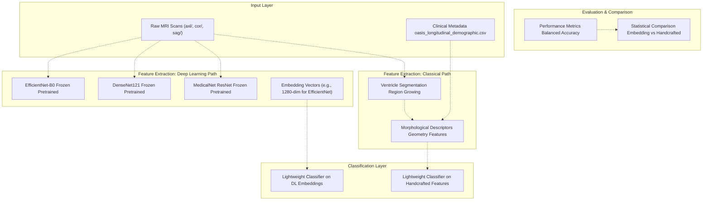
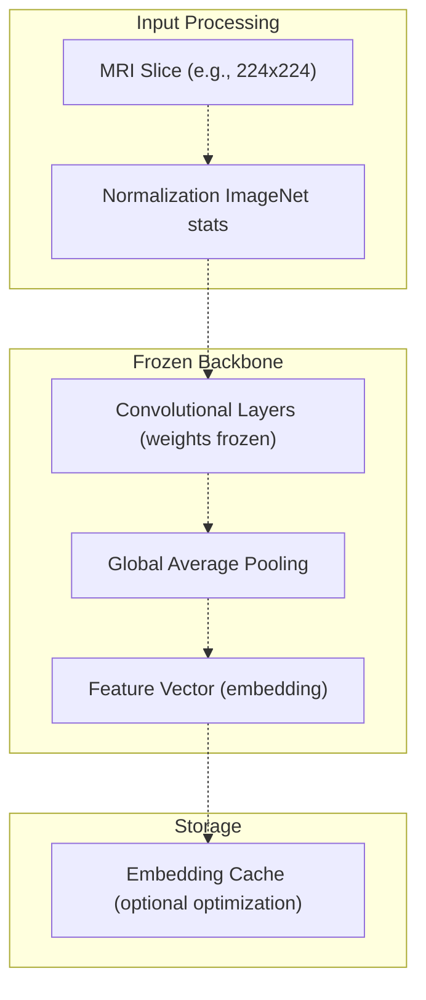
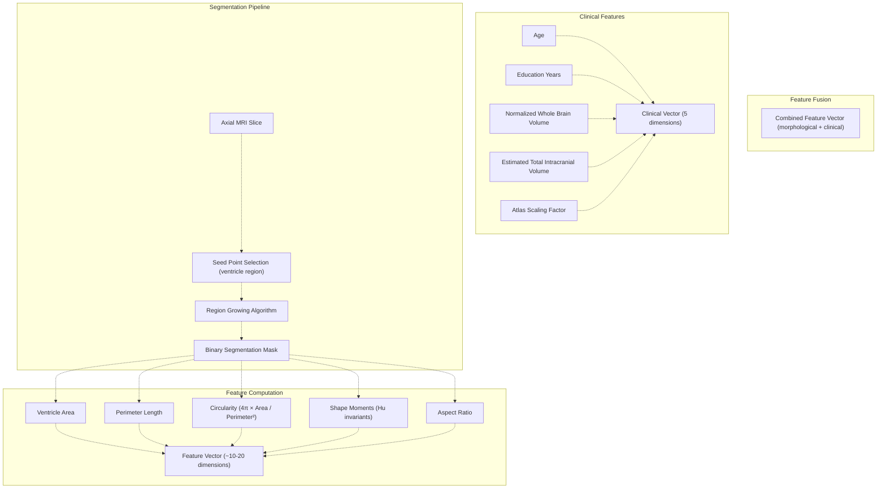
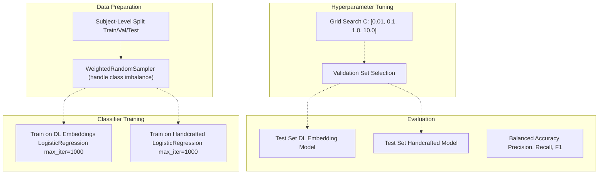
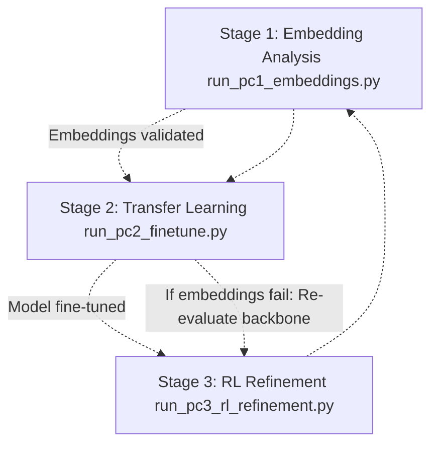

# Stage 1: Embedding Analysis (run_pc1_embeddings.py)

> **Relevant source files**
> * [README.md](https://github.com/ThalesMMS/brain-mri-pipelines-py/blob/cd9d51a5/README.md)

## Purpose and Scope

Stage 1 of the three-stage research pipeline validates the quality of deep learning embeddings before proceeding to full model fine-tuning. This stage compares pretrained backbone embeddings against handcrafted morphological descriptors using lightweight classifiers to determine whether learned representations capture meaningful information for Alzheimer's disease classification.

This page documents the embedding analysis methodology. For information about the backbone architectures themselves, see [Deep Learning Backbones](#5.1). For the subsequent transfer learning stage, see [Stage 2: Transfer Learning & Fine-Tuning](6b%20Baselines-CLI-%28run_baselines_cli.py%29.md). For classical baseline implementation details, see [Classical Machine Learning Baselines](5c%20Stage-3-RL-Hyperparameter-Refinement-%28run_pc3_rl_refinement.py%29.md).

Sources: [Project overview and setup](https://github.com/ThalesMMS/brain-mri-pipelines-py/blob/cd9d51a5/README.md#L126-L132)

---

## Overview

Stage 1 implements a **feature quality assessment** methodology that answers the question: "Do pretrained deep learning backbones extract better representations than traditional feature engineering for AD detection?" This validation step justifies the computational expense of full fine-tuning in Stage 2.

The stage follows this workflow:

1. **Extract embeddings** from frozen pretrained backbones (EfficientNet-B0, DenseNet121, MedicalNet ResNet)
2. **Extract handcrafted features** (morphological descriptors based on ventricle geometry)
3. **Train lightweight classifiers** (e.g., logistic regression, SVM) on both feature types
4. **Compare performance** using balanced accuracy as the primary metric

Sources: [Project overview and setup](https://github.com/ThalesMMS/brain-mri-pipelines-py/blob/cd9d51a5/README.md#L126-L132)

---

## Stage 1 Pipeline Architecture



**Pipeline Flow**: The dual-path architecture enables direct comparison between learned representations and engineered features. Both paths use the same subject-level train/validation/test splits to ensure fair comparison.

Sources: [Project overview and setup](https://github.com/ThalesMMS/brain-mri-pipelines-py/blob/cd9d51a5/README.md#L126-L132)

---

## Embedding Extraction Process

### Frozen Backbone Configuration

Stage 1 uses **frozen pretrained backbones** to extract embeddings without any task-specific training. This isolates the quality of the pretrained representations from the classification task.



**Backbone Selection**: The `--dl-backbone` argument specifies which pretrained model to use:

* `efficientnet`: EfficientNet-B0 (1280-dimensional embeddings)
* `densenet`: DenseNet121 (1024-dimensional embeddings)
* `medicalnet`: MedicalNet ResNet (512-dimensional embeddings for ResNet-18)

Sources: [Project overview and setup](https://github.com/ThalesMMS/brain-mri-pipelines-py/blob/cd9d51a5/README.md#L131-L131)

### Multi-View Embedding Aggregation

When multiple anatomical planes are available, embeddings from each plane can be aggregated:

| Aggregation Strategy | Description | Dimensionality |
| --- | --- | --- |
| **Concatenation** | Stack embeddings from axial, coronal, sagittal | 3 × embedding_dim |
| **Average Pooling** | Element-wise mean across planes | embedding_dim |
| **Max Pooling** | Element-wise maximum across planes | embedding_dim |
| **Single Plane** | Use only one plane (typically axial) | embedding_dim |

Stage 1 typically uses **single plane** (axial) extraction for simplicity and computational efficiency.

Sources: [README.md L10-L12](https://github.com/ThalesMMS/brain-mri-pipelines-py/blob/cd9d51a5/README.md#L10-L12)

---

## Handcrafted Feature Baseline

### Morphological Descriptor Extraction

The classical feature path extracts **geometry-based descriptors** from ventricle segmentation masks. These features represent traditional neuroimaging analysis approaches.



**Key Insight**: Handcrafted features are **low-dimensional** (typically 15-25 dimensions) compared to deep learning embeddings (512-1280 dimensions), yet may capture domain-specific geometric properties that pretrained networks don't emphasize.

Sources: [README.md L14-L15](https://github.com/ThalesMMS/brain-mri-pipelines-py/blob/cd9d51a5/README.md#L14-L15)

 [README.md L36](https://github.com/ThalesMMS/brain-mri-pipelines-py/blob/cd9d51a5/README.md#L36-L36)

### Feature Vector Composition

The handcrafted feature vector combines:

1. **Ventricle Geometry** (10-20 dimensions): * Area, perimeter, circularity * Shape moments (Hu invariants) * Aspect ratio, compactness * Centroid coordinates
2. **Clinical Covariates** (5 dimensions): * Age * Education (years) * nWBV (normalized whole brain volume) * eTIV (estimated total intracranial volume) * ASF (atlas scaling factor)

**Warning**: Stage 1 should **not** include MMSE or CDR scores in the feature vector, as these are strong proxies for the target label and would create methodological issues (see [Classical Machine Learning Baselines](5c%20Stage-3-RL-Hyperparameter-Refinement-%28run_pc3_rl_refinement.py%29.md) for discussion of target leakage).

Sources: [README.md L12](https://github.com/ThalesMMS/brain-mri-pipelines-py/blob/cd9d51a5/README.md#L12-L12)

 [README.md L36](https://github.com/ThalesMMS/brain-mri-pipelines-py/blob/cd9d51a5/README.md#L36-L36)

 **Sources**: [Project overview and setup](https://github.com/ThalesMMS/brain-mri-pipelines-py/blob/cd9d51a5/README.md#L168-L168)

---

## Lightweight Classifier Training

### Classifier Selection

Stage 1 uses **simple, non-parametric classifiers** to isolate embedding quality from classifier complexity:

| Classifier | Configuration | Rationale |
| --- | --- | --- |
| **Logistic Regression** | L2 regularization, C=1.0 | Linear baseline, interpretable coefficients |
| **Linear SVM** | C=1.0, balanced class weights | Robust to outliers, handles imbalance |
| **k-Nearest Neighbors** | k=5, distance weighting | Non-parametric, no training required |

The primary classifier is typically **Logistic Regression** for simplicity and interpretability.

Sources: [README.md L14](https://github.com/ThalesMMS/brain-mri-pipelines-py/blob/cd9d51a5/README.md#L14-L14)

### Training Configuration



**Key Configuration Choices**:

* **Class weights**: Set to `'balanced'` to handle AD/Non-AD imbalance
* **Regularization**: L2 penalty with C=1.0 as default, tuned via grid search
* **Convergence**: `max_iter=1000` ensures convergence on small datasets
* **Metric**: Balanced accuracy (see [Evaluation Metrics](#5.6))

Sources: [Project overview and setup](https://github.com/ThalesMMS/brain-mri-pipelines-py/blob/cd9d51a5/README.md#L164-L167)

---

## Command-Line Interface

### Basic Usage

```
python brain_mri/scripts/run_pc1_embeddings.py --dl-backbone efficientnet
```

### Available Arguments

| Argument | Type | Default | Description |
| --- | --- | --- | --- |
| `--dl-backbone` | str | `efficientnet` | Backbone for embedding extraction: `efficientnet`, `densenet`, `medicalnet` |
| `--seed` | int | `42` | Random seed for reproducibility |
| `--plane` | str | `axl` | Anatomical plane to use: `axl`, `cor`, `sag` |
| `--split-csv` | str | `output/subject_split.csv` | Path to subject-level split file |
| `--output-dir` | str | `output/stage1/` | Directory for results |

### Example Commands

```
# Compare EfficientNet embeddings vs handcrafted featurespython brain_mri/scripts/run_pc1_embeddings.py --dl-backbone efficientnet --seed 42# Compare DenseNet embeddingspython brain_mri/scripts/run_pc1_embeddings.py --dl-backbone densenet --seed 42# Compare MedicalNet embeddingspython brain_mri/scripts/run_pc1_embeddings.py --dl-backbone medicalnet --seed 42
```

Sources: [Project overview and setup](https://github.com/ThalesMMS/brain-mri-pipelines-py/blob/cd9d51a5/README.md#L130-L132)

---

## Outputs and Interpretation

### Generated Artifacts

Stage 1 produces the following outputs in `output/stage1/`:

| File | Description |
| --- | --- |
| `embedding_results_{backbone}.json` | Performance metrics for DL embeddings |
| `handcrafted_results.json` | Performance metrics for morphological features |
| `comparison_plot.png` | Bar chart comparing balanced accuracy |
| `confusion_matrices.png` | Confusion matrices for both approaches |
| `feature_importance.png` | (For handcrafted) Feature importance scores |

### Interpretation Guidelines

**Successful Validation Criteria**:

1. **DL embeddings should outperform handcrafted features** on balanced accuracy
2. **Performance gap should be substantial** (e.g., >5% improvement)
3. **Both approaches should exceed random baseline** (50% balanced accuracy)

**Example Results**:

```yaml
Deep Learning Embeddings (EfficientNet):
  Balanced Accuracy: 0.72
  Precision: 0.68
  Recall: 0.75
  F1 Score: 0.71

Handcrafted Morphological Features:
  Balanced Accuracy: 0.64
  Precision: 0.61
  Recall: 0.68
  F1 Score: 0.64

Conclusion: EfficientNet embeddings provide 8% improvement over
handcrafted features, justifying full fine-tuning in Stage 2.
```

**Decision Logic**:

* **If DL embeddings win**: Proceed to [Stage 2: Transfer Learning & Fine-Tuning](6b%20Baselines-CLI-%28run_baselines_cli.py%29.md)
* **If handcrafted features win**: Re-evaluate backbone choice or pretrained weights
* **If both perform poorly**: Check data quality, splits, and preprocessing

Sources: [Project overview and setup](https://github.com/ThalesMMS/brain-mri-pipelines-py/blob/cd9d51a5/README.md#L126-L132)

---

## Implementation Flow Diagram

```mermaid
flowchart TD

ARGS["Parse CLI Arguments"]
SEED["Set Random Seed"]
LOAD_SPLIT["Load subject_split.csv"]
LOAD_IMAGES["Load MRI Images per subject"]
LOAD_META["Load Clinical Metadata from CSV"]
INIT_BACKBONE["Initialize Frozen Backbone from brain_mri.ml"]
EXTRACT_EMB["Extract Embeddings for all subjects"]
CACHE_EMB["Cache Embeddings (optional)"]
SEGMENT["Run Ventricle Segmentation from brain_mri.ui"]
COMPUTE_MORPH["Compute Morphological Descriptors"]
MERGE_CLIN["Merge Clinical Covariates"]
TRAIN_LR_DL["Train LogisticRegression on DL embeddings"]
TRAIN_LR_HC["Train LogisticRegression on handcrafted features"]
GRID_SEARCH["Hyperparameter Tuning via GridSearchCV"]
PREDICT_DL["Predict on Test Set (DL model)"]
PREDICT_HC["Predict on Test Set (handcrafted model)"]
COMPUTE_METRICS["Compute Metrics balanced_accuracy_score"]
PLOT["Generate Comparison Plots"]
SAVE_JSON["Save Metrics to JSON"]
LOG["Log to Console"]

subgraph Results ["Results"]
    PLOT
    SAVE_JSON
    LOG
end

subgraph Evaluation ["Evaluation"]
    PREDICT_DL
    PREDICT_HC
    COMPUTE_METRICS
end

subgraph subGraph4 ["Classifier Training"]
    TRAIN_LR_DL
    TRAIN_LR_HC
    GRID_SEARCH
end

subgraph subGraph3 ["Feature Extraction: Classical Path"]
    SEGMENT
    COMPUTE_MORPH
    MERGE_CLIN
    SEGMENT -.-> COMPUTE_MORPH
end

subgraph subGraph2 ["Feature Extraction: DL Path"]
    INIT_BACKBONE
    EXTRACT_EMB
    CACHE_EMB
end

subgraph subGraph1 ["Data Loading"]
    LOAD_IMAGES
    LOAD_META
end

subgraph Initialization ["Initialization"]
    ARGS
    SEED
    LOAD_SPLIT
    ARGS -.-> SEED
    SEED -.-> LOAD_SPLIT
end
```



**Code Entities Referenced**:

* Backbone models: `brain_mri/ml/medicalnet_models.py`, `brain_mri/ml/multistream_models.py`
* Segmentation: `brain_mri/ui/` (GUI segmentation mixins)
* Metrics: `sklearn.metrics.balanced_accuracy_score`
* Split loading: `output/subject_split.csv`

Sources: [Project overview and setup](https://github.com/ThalesMMS/brain-mri-pipelines-py/blob/cd9d51a5/README.md#L180-L196)

---

## Integration with Research Pipeline

Stage 1 serves as the **validation gate** for the three-stage pipeline:



**Sequential Dependency**: Stage 2 should only be executed if Stage 1 demonstrates that the chosen backbone extracts meaningful features. This prevents wasting computational resources on ineffective architectures.

**Iterative Refinement**: If Stage 1 results are unsatisfactory, iterate by:

1. Trying different backbones (`efficientnet`, `densenet`, `medicalnet`)
2. Adjusting preprocessing (normalization, augmentation)
3. Verifying data quality and split integrity

Sources: [Project overview and setup](https://github.com/ThalesMMS/brain-mri-pipelines-py/blob/cd9d51a5/README.md#L122-L156)

---

## Methodological Considerations

### Why Lightweight Classifiers?

Stage 1 intentionally uses **simple classifiers** to:

1. **Isolate embedding quality** from classifier capacity
2. **Reduce computational cost** (no GPU needed for training)
3. **Enable fair comparison** between DL and handcrafted features
4. **Prevent overfitting** on small medical datasets

A complex classifier (e.g., deep neural network) could mask poor embeddings by learning task-specific transformations.

### Subject-Level Splitting Critical

Stage 1 inherits the subject-aware split from the data preparation phase (see [Subject-Level Splitting & Leakage Prevention](3d%20Subject-Level-Splitting-&-Leakage-Prevention.md)). This ensures:

* **No data leakage**: Multiple scans from the same patient don't appear in both train and test
* **Realistic performance**: Test metrics reflect generalization to unseen patients
* **Fair comparison**: Both DL and handcrafted paths use identical splits

Sources: [README.md L23](https://github.com/ThalesMMS/brain-mri-pipelines-py/blob/cd9d51a5/README.md#L23-L23)

 **Sources**: [Project overview and setup](https://github.com/ThalesMMS/brain-mri-pipelines-py/blob/cd9d51a5/README.md#L164-L167)

### Balanced Accuracy as Primary Metric

Stage 1 uses **balanced accuracy** rather than standard accuracy because:

* The OASIS-2 dataset has **class imbalance** (fewer AD cases than controls)
* Standard accuracy would reward predicting the majority class
* Balanced accuracy averages recall across classes, penalizing imbalanced predictions

See [Evaluation Metrics](#5.6) for detailed explanation.

Sources: [Project overview and setup](https://github.com/ThalesMMS/brain-mri-pipelines-py/blob/cd9d51a5/README.md#L164-L164)

---

## Troubleshooting

### Low Performance on Both Paths

**Symptom**: Both DL embeddings and handcrafted features achieve <60% balanced accuracy.

**Possible Causes**:

1. **Data leakage in split**: Verify `subject_split.csv` has no duplicate subjects across partitions
2. **Label noise**: Check `oasis_longitudinal_demographic.csv` for missing or incorrect CDR labels
3. **Insufficient data**: OASIS-2 has limited AD-positive cases
4. **Preprocessing issues**: Verify image normalization matches backbone expectations

### DL Embeddings Underperform Handcrafted Features

**Symptom**: Handcrafted features achieve higher balanced accuracy than DL embeddings.

**Possible Causes**:

1. **Wrong normalization**: ImageNet-pretrained models expect specific normalization
2. **Domain mismatch**: 2D slices may not leverage 3D pretrained weights effectively
3. **Feature dimensionality**: High-dimensional embeddings may require more regularization

**Solutions**:

* Try different backbones (e.g., switch from ImageNet to MedicalNet)
* Reduce embedding dimensionality via PCA
* Increase regularization strength (decrease C parameter)

### Memory Issues

**Symptom**: Out-of-memory errors during embedding extraction.

**Solutions**:

1. **Reduce batch size** for embedding extraction
2. **Process embeddings incrementally** and save to disk
3. **Use embedding caching** to avoid re-extraction

---

## Summary

Stage 1 provides a **lightweight validation mechanism** that determines whether pretrained deep learning backbones extract meaningful representations for AD classification. By comparing embeddings against handcrafted morphological features using simple classifiers, Stage 1 establishes a performance baseline and justifies the computational expense of full fine-tuning in subsequent stages.

**Key Takeaways**:

* Stage 1 is a **feature quality assessment**, not a full training pipeline
* Simple classifiers isolate embedding quality from model complexity
* Subject-level splitting prevents data leakage
* Balanced accuracy accounts for class imbalance
* Results inform the choice of backbone for Stage 2

**Next Steps**: If Stage 1 validates the embeddings, proceed to [Stage 2: Transfer Learning & Fine-Tuning](6b%20Baselines-CLI-%28run_baselines_cli.py%29.md) for full end-to-end training.

Sources: [Project overview and setup](https://github.com/ThalesMMS/brain-mri-pipelines-py/blob/cd9d51a5/README.md#L122-L156)


### On this page

* [Stage 1: Embedding Analysis (run_pc1_embeddings.py)](6a%20Graphical-User-Interface-%28main.py%29.md)
* [Purpose and Scope](6a%20Graphical-User-Interface-%28main.py%29.md)
* [Overview](6a%20Graphical-User-Interface-%28main.py%29.md)
* [Stage 1 Pipeline Architecture](6a%20Graphical-User-Interface-%28main.py%29.md)
* [Embedding Extraction Process](6a%20Graphical-User-Interface-%28main.py%29.md)
* [Frozen Backbone Configuration](6a%20Graphical-User-Interface-%28main.py%29.md)
* [Multi-View Embedding Aggregation](6a%20Graphical-User-Interface-%28main.py%29.md)
* [Handcrafted Feature Baseline](6a%20Graphical-User-Interface-%28main.py%29.md)
* [Morphological Descriptor Extraction](6a%20Graphical-User-Interface-%28main.py%29.md)
* [Feature Vector Composition](6a%20Graphical-User-Interface-%28main.py%29.md)
* [Lightweight Classifier Training](6a%20Graphical-User-Interface-%28main.py%29.md)
* [Classifier Selection](6a%20Graphical-User-Interface-%28main.py%29.md)
* [Training Configuration](6a%20Graphical-User-Interface-%28main.py%29.md)
* [Command-Line Interface](6a%20Graphical-User-Interface-%28main.py%29.md)
* [Basic Usage](6a%20Graphical-User-Interface-%28main.py%29.md)
* [Available Arguments](6a%20Graphical-User-Interface-%28main.py%29.md)
* [Example Commands](6a%20Graphical-User-Interface-%28main.py%29.md)
* [Outputs and Interpretation](6a%20Graphical-User-Interface-%28main.py%29.md)
* [Generated Artifacts](6a%20Graphical-User-Interface-%28main.py%29.md)
* [Interpretation Guidelines](6a%20Graphical-User-Interface-%28main.py%29.md)
* [Implementation Flow Diagram](6a%20Graphical-User-Interface-%28main.py%29.md)
* [Integration with Research Pipeline](6a%20Graphical-User-Interface-%28main.py%29.md)
* [Methodological Considerations](6a%20Graphical-User-Interface-%28main.py%29.md)
* [Why Lightweight Classifiers?](6a%20Graphical-User-Interface-%28main.py%29.md)
* [Subject-Level Splitting Critical](6a%20Graphical-User-Interface-%28main.py%29.md)
* [Balanced Accuracy as Primary Metric](6a%20Graphical-User-Interface-%28main.py%29.md)
* [Troubleshooting](6a%20Graphical-User-Interface-%28main.py%29.md)
* [Low Performance on Both Paths](6a%20Graphical-User-Interface-%28main.py%29.md)
* [DL Embeddings Underperform Handcrafted Features](6a%20Graphical-User-Interface-%28main.py%29.md)
* [Memory Issues](6a%20Graphical-User-Interface-%28main.py%29.md)
* [Summary](6a%20Graphical-User-Interface-%28main.py%29.md)

Ask Devin about brain-mri-pipelines-py