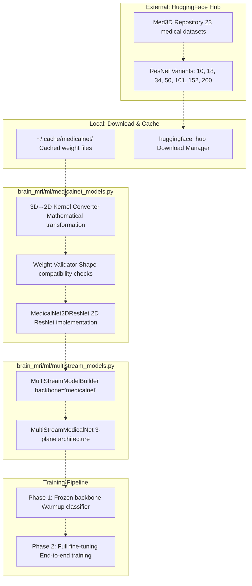
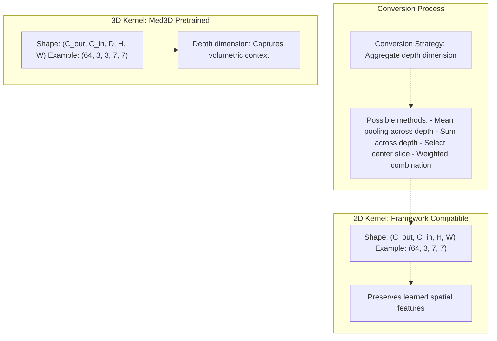
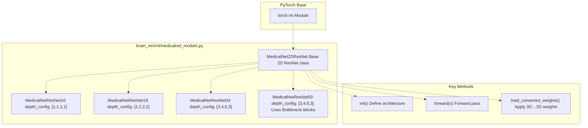
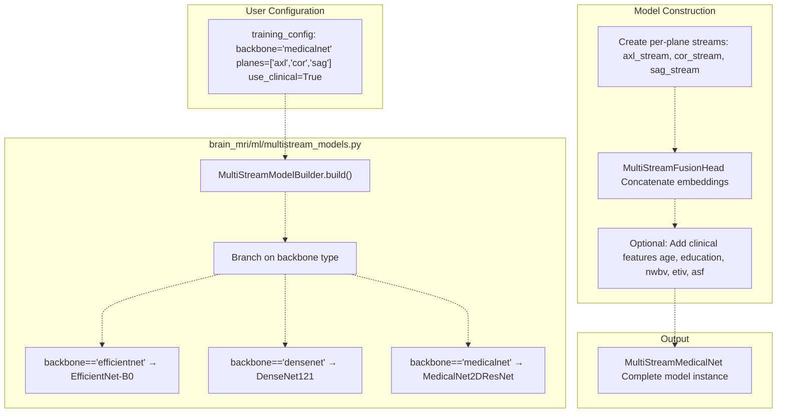
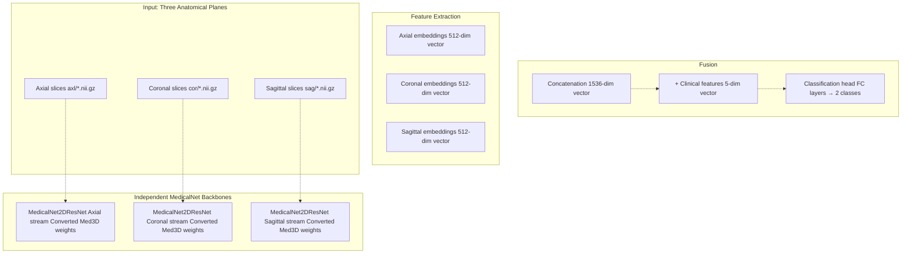
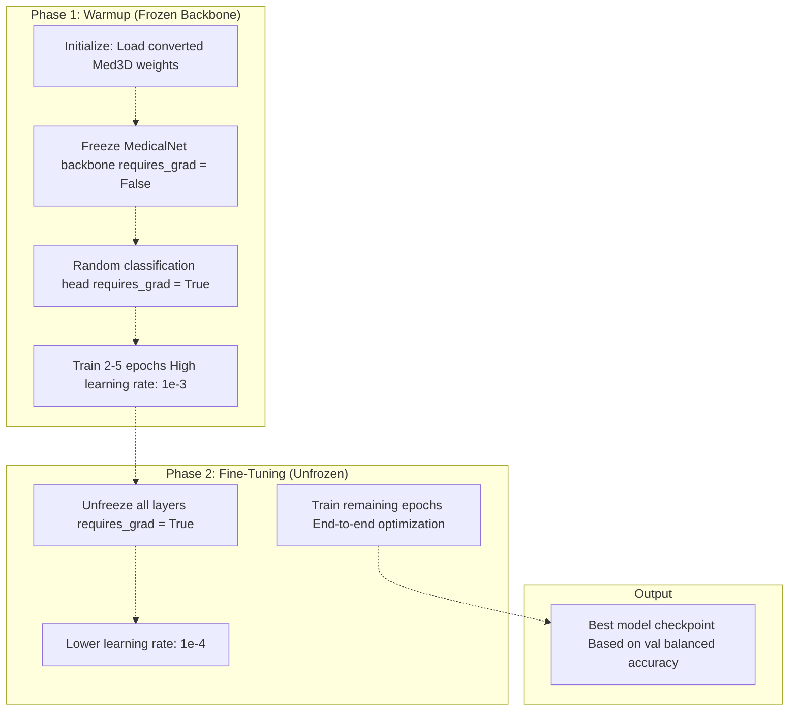
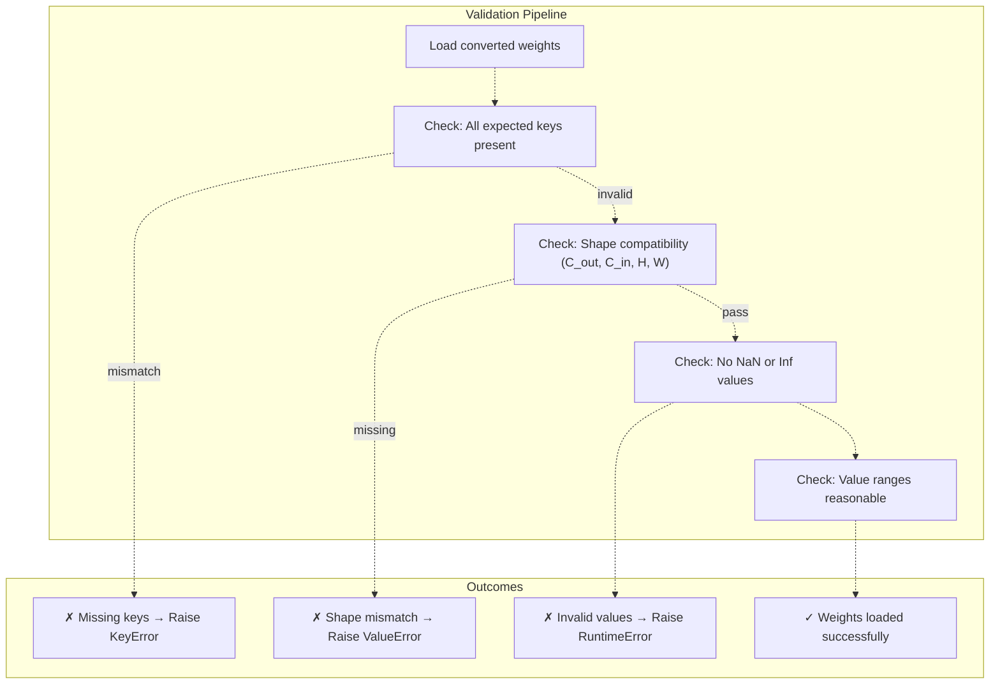

# MedicalNet Integration & 3D→2D Conversion

> **Relevant source files**
> * [README.md](https://github.com/ThalesMMS/brain-mri-pipelines-py/blob/cd9d51a5/README.md)

## Purpose & Scope

This document explains the integration of MedicalNet (Med3D) pretrained weights into the brain-mri-pipelines framework. It covers the technical process of downloading 3D volumetric weights from HuggingFace Hub, mathematically converting 3D convolutional kernels to 2D equivalents, and integrating the resulting models into the multi-stream architecture.

For information about the overall deep learning backbone options (EfficientNet, DenseNet, MedicalNet), see [Deep Learning Backbones](#5.1). For details on how MedicalNet models are used within the multi-stream architecture, see [Multi-Stream Multimodal Network](#3.1). For training configuration and fine-tuning strategies, see [Training Configuration](#5.4) and [Stage 2: Transfer Learning & Fine-Tuning](#6.2).

**Sources:** [README.md L1-L218](https://github.com/ThalesMMS/brain-mri-pipelines-py/blob/cd9d51a5/README.md#L1-L218)

---

## MedicalNet Background

### What is Med3D?

MedicalNet refers to pretrained ResNet architectures from the **Med3D project** (Chen et al., 2019), which trained 3D convolutional neural networks on 23 medical imaging datasets. These models were designed for volumetric medical image analysis and provide domain-specific knowledge that is more relevant to medical imaging than ImageNet pretraining.

### Why 3D→2D Conversion?

The framework processes 2D slices from three anatomical planes (axial, coronal, sagittal) rather than full 3D volumes. This approach offers several advantages:

| Aspect | 3D Volumetric | 2D Slice-Based (This Framework) |
| --- | --- | --- |
| **Memory Requirements** | High (entire volume in GPU) | Lower (individual slices) |
| **Computational Cost** | Expensive (3D convolutions) | Efficient (2D convolutions) |
| **Multi-View Fusion** | Not applicable | Native support for 3 planes |
| **Batch Size** | Limited by GPU memory | Larger batches possible |

To leverage Med3D's pretrained knowledge while maintaining 2D slice processing, the framework implements a mathematical conversion that transforms 3D convolutional kernels into 2D equivalents.

**Sources:** [README.md L11](https://github.com/ThalesMMS/brain-mri-pipelines-py/blob/cd9d51a5/README.md#L11-L11)

 [README.md L171-L173](https://github.com/ThalesMMS/brain-mri-pipelines-py/blob/cd9d51a5/README.md#L171-L173)

---

## Architecture Overview



**Diagram: MedicalNet Integration Pipeline**

This diagram shows the complete flow from external pretrained weights to integrated model training. The process begins with Med3D weights hosted on HuggingFace Hub, proceeds through local caching and kernel conversion, and culminates in integration with the multi-stream architecture.

**Sources:** [README.md L171-L173](https://github.com/ThalesMMS/brain-mri-pipelines-py/blob/cd9d51a5/README.md#L171-L173)

 [README.md L185-L189](https://github.com/ThalesMMS/brain-mri-pipelines-py/blob/cd9d51a5/README.md#L185-L189)

---

## Download & Caching System

### HuggingFace Hub Integration

The framework uses the `huggingface_hub` library to download pretrained weights automatically. The download process is managed transparently, with weights cached locally to avoid repeated downloads.


**Diagram: Weight Download and Caching Flow**

### Cache Directory Structure

The caching system organizes downloaded weights by model variant:

```
~/.cache/medicalnet/
├── resnet_10_23dataset.pth
├── resnet_18_23dataset.pth
├── resnet_34_23dataset.pth
├── resnet_50_23dataset.pth
├── resnet_101_23dataset.pth
├── resnet_152_23dataset.pth
└── resnet_200_23dataset.pth
```

Each file contains the state dictionary of the corresponding 3D ResNet variant trained on the Med3D dataset collection.

**Sources:** [README.md L171-L173](https://github.com/ThalesMMS/brain-mri-pipelines-py/blob/cd9d51a5/README.md#L171-L173)

---

## 3D→2D Kernel Conversion Process

### Mathematical Foundation

The core challenge is converting 3D convolutional kernels of shape `(out_channels, in_channels, depth, height, width)` to 2D kernels of shape `(out_channels, in_channels, height, width)`. The framework implements a mathematical transformation that preserves the learned feature representations.



**Diagram: 3D to 2D Kernel Conversion Concept**

### Conversion Implementation

The conversion process is implemented in [brain_mri/ml/medicalnet_models.py](https://github.com/ThalesMMS/brain-mri-pipelines-py/blob/cd9d51a5/brain_mri/ml/medicalnet_models.py)

 The key steps are:

1. **Load 3D State Dict**: Read pretrained weights from cached file
2. **Identify Conv3D Layers**: Parse state dictionary for 3D convolutional parameters
3. **Apply Dimensional Reduction**: Transform `(C_out, C_in, D, H, W)` → `(C_out, C_in, H, W)`
4. **Validate Shapes**: Ensure converted weights match 2D architecture
5. **Load into 2D Model**: Apply converted weights to 2D ResNet implementation

### Layer Mapping

The conversion maps 3D ResNet components to 2D equivalents:

| 3D Med3D Layer | 3D Kernel Shape | 2D Framework Layer | 2D Kernel Shape |
| --- | --- | --- | --- |
| `conv1` | `(64, 3, 7, 7, 7)` | `conv1` | `(64, 3, 7, 7)` |
| `layer1.0.conv1` | `(64, 64, 3, 3, 3)` | `layer1.0.conv1` | `(64, 64, 3, 3)` |
| `layer2.0.conv1` | `(128, 64, 3, 3, 3)` | `layer2.0.conv1` | `(128, 64, 3, 3)` |
| `layer3.0.conv1` | `(256, 128, 3, 3, 3)` | `layer3.0.conv1` | `(256, 128, 3, 3)` |
| `layer4.0.conv1` | `(512, 256, 3, 3, 3)` | `layer4.0.conv1` | `(512, 256, 3, 3)` |

**Sources:** [README.md L171-L173](https://github.com/ThalesMMS/brain-mri-pipelines-py/blob/cd9d51a5/README.md#L171-L173)

 [README.md L185-L189](https://github.com/ThalesMMS/brain-mri-pipelines-py/blob/cd9d51a5/README.md#L185-L189)

---

## MedicalNet2DResNet Architecture

### Model Class Hierarchy



**Diagram: MedicalNet Model Class Structure**

### ResNet Variants

The framework supports multiple ResNet depths, each optimized for different compute/accuracy tradeoffs:

| Variant | Layers | Parameters | Recommended Use Case |
| --- | --- | --- | --- |
| ResNet-10 | 10 | ~5M | Fast prototyping, limited GPU memory |
| ResNet-18 | 18 | ~11M | Standard baseline, good balance |
| ResNet-34 | 34 | ~21M | Higher capacity, more training time |
| ResNet-50 | 50 | ~23M | Bottleneck architecture, best performance |

The default configuration uses **ResNet-18** as it provides a good balance between model capacity and computational efficiency.

**Sources:** [README.md L11](https://github.com/ThalesMMS/brain-mri-pipelines-py/blob/cd9d51a5/README.md#L11-L11)

 [README.md L185-L189](https://github.com/ThalesMMS/brain-mri-pipelines-py/blob/cd9d51a5/README.md#L185-L189)

---

## Integration with Multi-Stream Architecture

### Multi-Stream Builder Integration

The `MultiStreamModelBuilder` class in [brain_mri/ml/multistream_models.py](https://github.com/ThalesMMS/brain-mri-pipelines-py/blob/cd9d51a5/brain_mri/ml/multistream_models.py)

 provides a unified interface for constructing multi-stream models with different backbones, including MedicalNet.



**Diagram: MedicalNet Integration in Multi-Stream Builder**

### Per-Plane Stream Architecture

Each anatomical plane (axial, coronal, sagittal) has an independent MedicalNet backbone:



**Diagram: Three-Stream MedicalNet Architecture**

Each stream processes one anatomical plane independently through its own MedicalNet backbone (with identical architecture but separate parameters). The resulting 512-dimensional embeddings are concatenated, optionally augmented with clinical features, and passed to the classification head.

**Sources:** [README.md L9-L15](https://github.com/ThalesMMS/brain-mri-pipelines-py/blob/cd9d51a5/README.md#L9-L15)

 [README.md L185-L189](https://github.com/ThalesMMS/brain-mri-pipelines-py/blob/cd9d51a5/README.md#L185-L189)

---

## Training Pipeline with MedicalNet

### Two-Phase Training Strategy

The framework implements a two-phase approach to fine-tuning MedicalNet backbones, following transfer learning best practices:



**Diagram: Two-Phase MedicalNet Fine-Tuning Process**

### Phase 1: Frozen Backbone Warmup

During the warmup phase, the converted MedicalNet weights remain frozen while the classification head learns to interpret the pretrained features:

* **Duration**: 2-5 epochs (configurable via `--warmup-epochs`)
* **Learning Rate**: Higher rate (e.g., 1e-3) for classifier
* **Frozen Layers**: All MedicalNet backbone layers
* **Trainable Layers**: Only the classification head and fusion layers
* **Purpose**: Prevent catastrophic forgetting of pretrained features

### Phase 2: Full Fine-Tuning

After warmup, all layers are unfrozen for end-to-end fine-tuning:

* **Duration**: Remaining epochs (e.g., 35-40 total - 2-5 warmup)
* **Learning Rate**: Lower rate (e.g., 1e-4) for entire model
* **Trainable Layers**: All parameters
* **Purpose**: Adapt pretrained features to Alzheimer's detection task

### Training Configuration Example

From [run_deep_models_cli.py](https://github.com/ThalesMMS/brain-mri-pipelines-py/blob/cd9d51a5/run_deep_models_cli.py)

 and [brain_mri/scripts/run_pc2_finetune.py](https://github.com/ThalesMMS/brain-mri-pipelines-py/blob/cd9d51a5/brain_mri/scripts/run_pc2_finetune.py)

:

```
# Standard MedicalNet trainingpython run_deep_models_cli.py --seed 42 --epochs 40 --backbones medicalnet# With explicit warmup configurationpython brain_mri/scripts/run_pc2_finetune.py \    --backbone medicalnet \    --seed 42 \    --epochs 40 \    --warmup-epochs 3
```

**Sources:** [README.md L111-L118](https://github.com/ThalesMMS/brain-mri-pipelines-py/blob/cd9d51a5/README.md#L111-L118)

 [README.md L134-L148](https://github.com/ThalesMMS/brain-mri-pipelines-py/blob/cd9d51a5/README.md#L134-L148)

---

## Usage & Configuration

### Command-Line Interface

#### Basic MedicalNet Training

```
# Single-stream (axial only)python run_deep_models_cli.py --backbones medicalnet --epochs 40# Multi-stream (all three planes)python run_deep_models_cli.py --backbones medicalnet --epochs 40 --planes axl,cor,sag# With multimodal fusion (images + clinical data)python run_deep_models_cli.py --backbones medicalnet --multimodal --epochs 40
```

#### Research Pipeline Integration

```
# Stage 1: Embedding analysis with MedicalNetpython brain_mri/scripts/run_pc1_embeddings.py --dl-backbone medicalnet# Stage 2: Transfer learning with warmuppython brain_mri/scripts/run_pc2_finetune.py \    --backbone medicalnet \    --seed 42 \    --epochs 40 \    --warmup-epochs 3# Stage 3: RL refinement of MedicalNet modelpython brain_mri/scripts/run_pc3_rl_refinement.py \    --backbone medicalnet \    --seed 42 \    --episodes 10 \    --horizon 5
```

### Model Selection Criteria

| Consideration | Recommendation |
| --- | --- |
| **Medical domain specificity** | Use MedicalNet (trained on medical images) |
| **Natural image pretraining** | Use EfficientNet or DenseNet |
| **Limited GPU memory** | MedicalNet ResNet-10 or ResNet-18 |
| **Maximum performance** | MedicalNet ResNet-50 with multi-stream |
| **Fast prototyping** | EfficientNet-B0 (fewer parameters) |

MedicalNet is particularly recommended when:

* Medical imaging domain knowledge is critical
* Working with grayscale MRI data (no RGB bias from ImageNet)
* Seeking better transfer learning from medical to medical tasks
* Requiring interpretability from medically-relevant features

**Sources:** [README.md L111-L118](https://github.com/ThalesMMS/brain-mri-pipelines-py/blob/cd9d51a5/README.md#L111-L118)

 [README.md L126-L148](https://github.com/ThalesMMS/brain-mri-pipelines-py/blob/cd9d51a5/README.md#L126-L148)

---

## Weight Validation & Debugging

### Shape Compatibility Checks

The conversion process includes validation steps to ensure weight compatibility:



**Diagram: Weight Validation Process**

### Common Issues & Solutions

| Issue | Symptom | Solution |
| --- | --- | --- |
| **Cache corruption** | Download fails or loads incorrectly | Delete `~/.cache/medicalnet` and re-download |
| **Shape mismatch** | RuntimeError during weight loading | Verify ResNet variant matches expected architecture |
| **Poor initial performance** | Random accuracy after loading | Ensure conversion preserved feature representations |
| **OOM during training** | CUDA out of memory | Use smaller ResNet variant (10 or 18) or reduce batch size |

### Debugging Conversion Quality

To verify that the 3D→2D conversion preserves learned features:

1. **Embedding visualization**: Compare MedicalNet embeddings to EfficientNet/DenseNet
2. **Activation statistics**: Check that layer activations have reasonable distributions
3. **Gradient flow**: Verify gradients propagate through all layers during fine-tuning
4. **Feature visualization**: Examine what features early layers detect

**Sources:** [README.md L171-L173](https://github.com/ThalesMMS/brain-mri-pipelines-py/blob/cd9d51a5/README.md#L171-L173)

---

## Performance Considerations

### Computational Requirements

| ResNet Variant | Params | FLOPs (per image) | GPU Memory | Training Time (40 epochs) |
| --- | --- | --- | --- | --- |
| ResNet-10 | ~5M | ~0.5 GFLOPs | ~2 GB | ~3 hours |
| ResNet-18 | ~11M | ~1.8 GFLOPs | ~4 GB | ~5 hours |
| ResNet-34 | ~21M | ~3.6 GFLOPs | ~6 GB | ~8 hours |
| ResNet-50 | ~23M | ~4.1 GFLOPs | ~7 GB | ~10 hours |

*Estimates based on single NVIDIA RTX 3090 GPU with batch size 32*

### Multi-Stream Memory Scaling

When using multi-stream architecture with MedicalNet:

```
Total Memory ≈ (Backbone Memory × Number of Planes) + Fusion Head + Batch Data

Example (ResNet-18, 3 planes, batch=32):
≈ (4 GB × 3) + 0.5 GB + 2 GB ≈ 14.5 GB
```

For limited GPU memory, consider:

* Using single-stream (one plane only)
* Reducing batch size
* Using ResNet-10 instead of ResNet-18
* Gradient checkpointing (if implemented)

**Sources:** [README.md L9-L15](https://github.com/ThalesMMS/brain-mri-pipelines-py/blob/cd9d51a5/README.md#L9-L15)

---

## Citation & Attribution

When using MedicalNet weights in research, cite the original Med3D paper:

> Chen, S., Ma, K., & Zheng, Y. (2019). Med3D: Transfer Learning for 3D Medical Image Analysis. *arXiv preprint* arXiv:1904.00625.

The 3D→2D conversion methodology is specific to this framework and should be cited accordingly if adapted for other projects.

**Sources:** [README.md L211-L213](https://github.com/ThalesMMS/brain-mri-pipelines-py/blob/cd9d51a5/README.md#L211-L213)

---

## Summary

This page documented the MedicalNet integration system, covering:

1. **Background**: Med3D pretrained weights and rationale for 3D→2D conversion
2. **Download**: HuggingFace Hub integration and local caching
3. **Conversion**: Mathematical transformation of 3D kernels to 2D
4. **Architecture**: MedicalNet2DResNet implementation and variants
5. **Integration**: Multi-stream architecture with per-plane backbones
6. **Training**: Two-phase warmup and fine-tuning strategy
7. **Usage**: Command-line interface and configuration options
8. **Validation**: Weight compatibility checks and debugging

The MedicalNet backbone provides medically-informed pretraining as an alternative to ImageNet initialization, leveraging knowledge from 23 medical imaging datasets while maintaining compatibility with the framework's 2D slice-based processing pipeline.

**Sources:** [README.md L1-L218](https://github.com/ThalesMMS/brain-mri-pipelines-py/blob/cd9d51a5/README.md#L1-L218)

Refresh this wiki

Last indexed: 5 January 2026 ([cd9d51](https://github.com/ThalesMMS/brain-mri-pipelines-py/commit/cd9d51a5))

### On this page

* [MedicalNet Integration & 3D→2D Conversion](#5.2-medicalnet-integration-3d2d-conversion)
* [Purpose & Scope](#5.2-purpose-scope)
* [MedicalNet Background](#5.2-medicalnet-background)
* [What is Med3D?](#5.2-what-is-med3d)
* [Why 3D→2D Conversion?](#5.2-why-3d2d-conversion)
* [Architecture Overview](#5.2-architecture-overview)
* [Download & Caching System](#5.2-download-caching-system)
* [HuggingFace Hub Integration](#5.2-huggingface-hub-integration)
* [Cache Directory Structure](#5.2-cache-directory-structure)
* [3D→2D Kernel Conversion Process](#5.2-3d2d-kernel-conversion-process)
* [Mathematical Foundation](#5.2-mathematical-foundation)
* [Conversion Implementation](#5.2-conversion-implementation)
* [Layer Mapping](#5.2-layer-mapping)
* [MedicalNet2DResNet Architecture](#5.2-medicalnet2dresnet-architecture)
* [Model Class Hierarchy](#5.2-model-class-hierarchy)
* [ResNet Variants](#5.2-resnet-variants)
* [Integration with Multi-Stream Architecture](#5.2-integration-with-multi-stream-architecture)
* [Multi-Stream Builder Integration](#5.2-multi-stream-builder-integration)
* [Per-Plane Stream Architecture](#5.2-per-plane-stream-architecture)
* [Training Pipeline with MedicalNet](#5.2-training-pipeline-with-medicalnet)
* [Two-Phase Training Strategy](#5.2-two-phase-training-strategy)
* [Phase 1: Frozen Backbone Warmup](#5.2-phase-1-frozen-backbone-warmup)
* [Phase 2: Full Fine-Tuning](#5.2-phase-2-full-fine-tuning)
* [Training Configuration Example](#5.2-training-configuration-example)
* [Usage & Configuration](#5.2-usage-configuration)
* [Command-Line Interface](#5.2-command-line-interface)
* [Model Selection Criteria](#5.2-model-selection-criteria)
* [Weight Validation & Debugging](#5.2-weight-validation-debugging)
* [Shape Compatibility Checks](#5.2-shape-compatibility-checks)
* [Common Issues & Solutions](#5.2-common-issues-solutions)
* [Debugging Conversion Quality](#5.2-debugging-conversion-quality)
* [Performance Considerations](#5.2-performance-considerations)
* [Computational Requirements](#5.2-computational-requirements)
* [Multi-Stream Memory Scaling](#5.2-multi-stream-memory-scaling)
* [Citation & Attribution](#5.2-citation-attribution)
* [Summary](#5.2-summary)

Ask Devin about brain-mri-pipelines-py