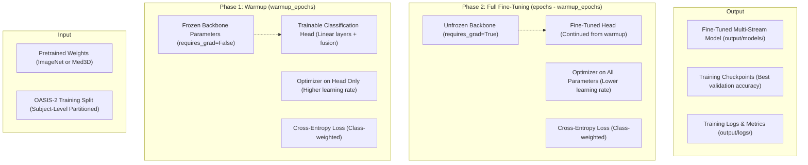
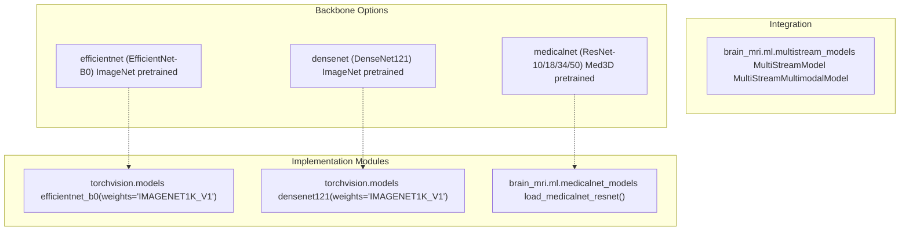
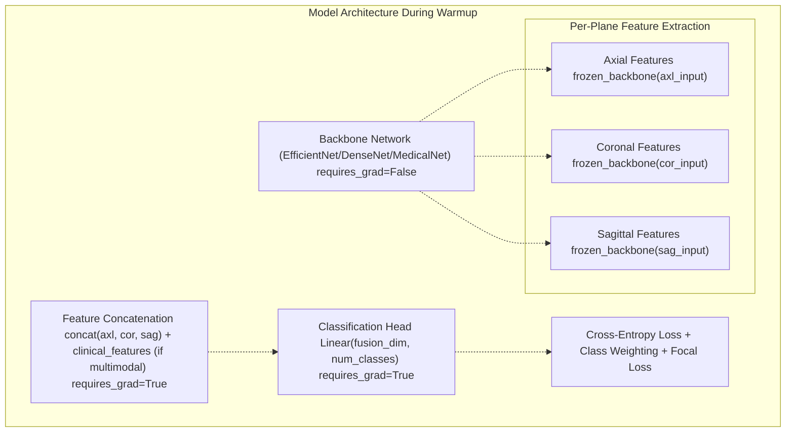
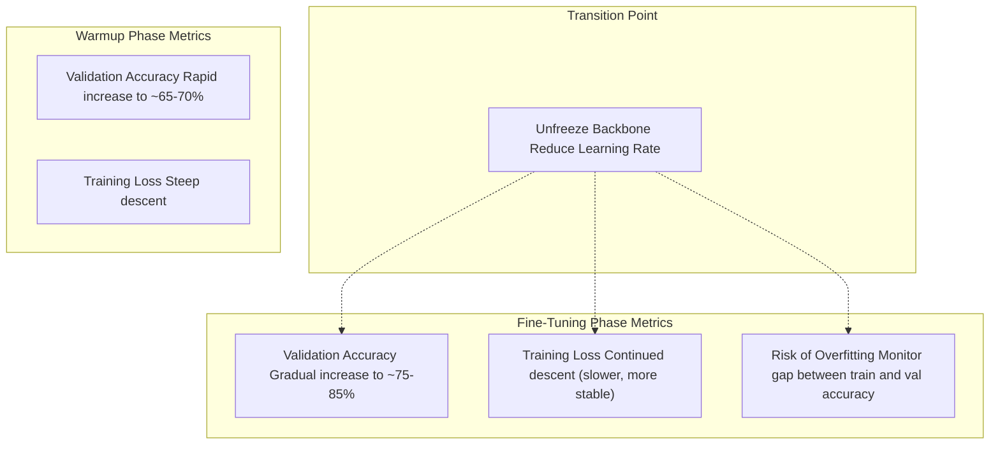
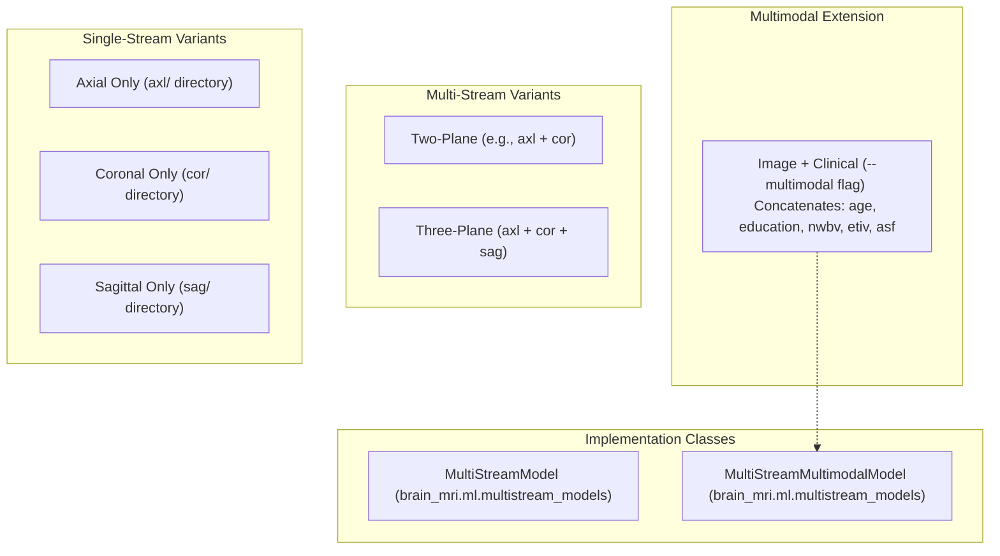
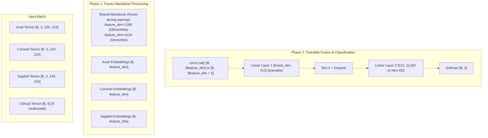
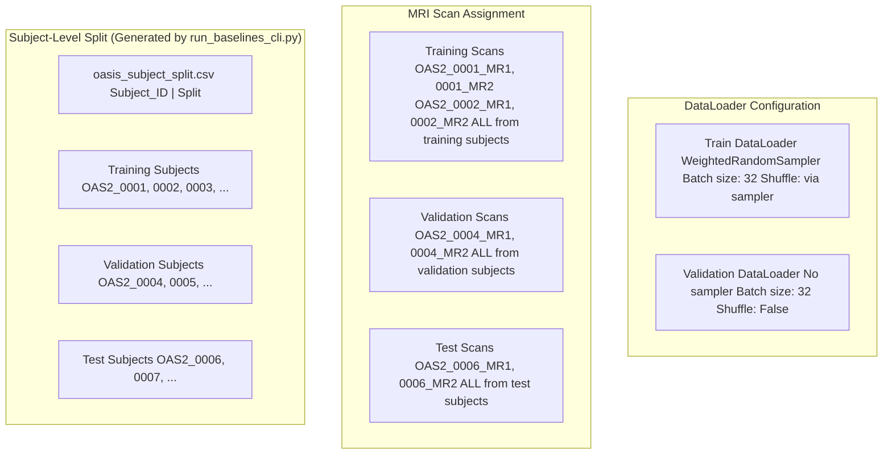
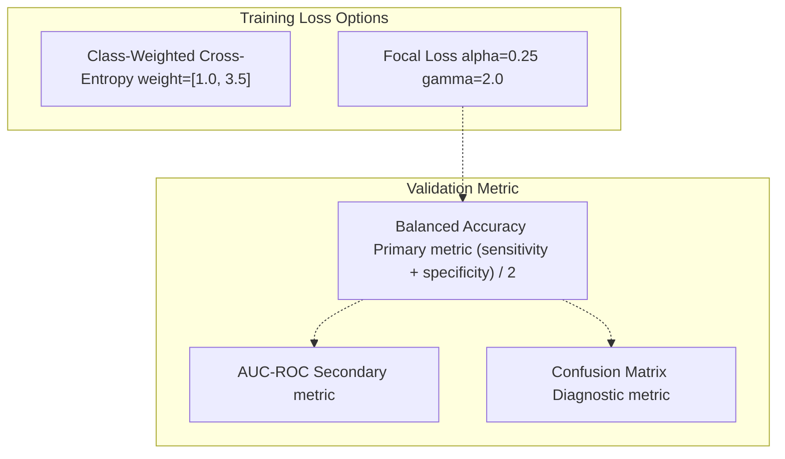
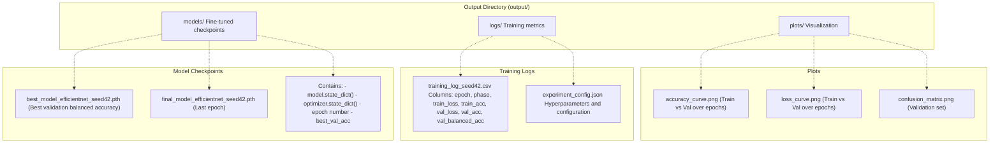
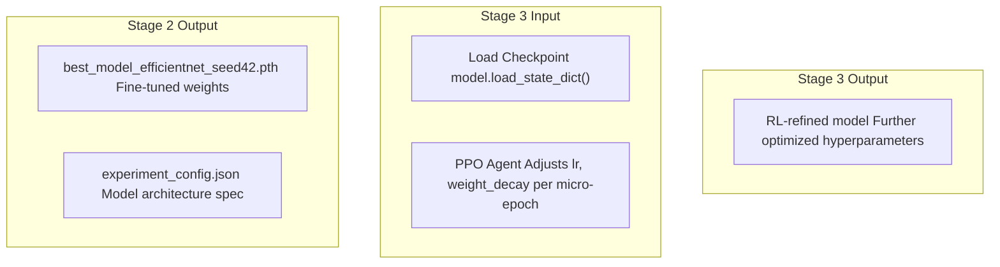

# Stage 2: Transfer Learning & Fine-Tuning (run_pc2_finetune.py)

> **Relevant source files**
> * [README.md](https://github.com/ThalesMMS/brain-mri-pipelines-py/blob/cd9d51a5/README.md)

## Purpose and Scope

This document describes **Stage 2** of the three-stage research pipeline, which implements a two-phase transfer learning approach for training multi-stream deep learning models on the OASIS-2 dataset. This stage takes pretrained backbone networks (EfficientNet-B0, DenseNet121, or MedicalNet ResNet) and adapts them for Alzheimer's disease classification through a structured fine-tuning process.

**Relationship to other stages:**

* For embedding quality assessment (Stage 1), see [Stage 1: Embedding Analysis](#6.1)
* For RL-based hyperparameter optimization (Stage 3), see [Stage 3: RL Hyperparameter Refinement](#6.3)
* For backbone architecture details, see [Deep Learning Backbones](#5.1)
* For the multi-stream architecture, see [Multi-Stream Multimodal Network](#3.1)

The script `brain_mri/scripts/run_pc2_finetune.py` orchestrates this stage, implementing an explicit warmup phase with frozen backbone weights followed by full end-to-end fine-tuning.

**Sources:** [README.md L122-L149](https://github.com/ThalesMMS/brain-mri-pipelines-py/blob/cd9d51a5/README.md#L122-L149)

---

## Two-Phase Training Methodology

Stage 2 implements a progressive training strategy that prevents catastrophic forgetting of pretrained features while allowing the model to adapt to the specific domain of brain MRI-based Alzheimer's detection.



**Phase 1: Frozen Backbone Warmup**

* Duration: `--warmup-epochs` (typically 2-3 epochs)
* Only the classification head is trainable
* Prevents early gradient updates from corrupting pretrained features
* Uses higher learning rate for rapid head adaptation

**Phase 2: Full End-to-End Fine-Tuning**

* Duration: `--epochs - warmup-epochs` (e.g., 6 total - 2 warmup = 4 fine-tuning epochs)
* All layers become trainable (backbone + head)
* Uses lower learning rate for careful feature adaptation
* Allows domain-specific feature refinement

**Sources:** [README.md L134-L140](https://github.com/ThalesMMS/brain-mri-pipelines-py/blob/cd9d51a5/README.md#L134-L140)

---

## Script Invocation and Configuration

### Basic Usage

The `run_pc2_finetune.py` script is located in `brain_mri/scripts/` and provides a CLI for configuring the two-phase training process.

```
python brain_mri/scripts/run_pc2_finetune.py \    --backbone efficientnet \    --seed 42 \    --epochs 6 \    --warmup-epochs 2
```

### Command-Line Arguments

| Argument | Type | Default | Description |
| --- | --- | --- | --- |
| `--backbone` | str | `efficientnet` | Backbone architecture: `efficientnet`, `densenet`, `medicalnet` |
| `--seed` | int | `42` | Random seed for reproducibility |
| `--epochs` | int | `6` | Total training epochs (warmup + fine-tuning) |
| `--warmup-epochs` | int | `2` | Number of epochs with frozen backbone |
| `--batch-size` | int | `32` | Training batch size |
| `--lr` | float | `1e-3` | Initial learning rate for warmup phase |
| `--lr-finetune` | float | `1e-4` | Learning rate for fine-tuning phase (typically 10x lower) |
| `--weight-decay` | float | `1e-4` | L2 regularization strength |
| `--multimodal` | flag | `False` | Enable clinical feature fusion |

### Backbone Selection



**Sources:** [README.md L134-L140](https://github.com/ThalesMMS/brain-mri-pipelines-py/blob/cd9d51a5/README.md#L134-L140)

---

## Phase 1: Frozen Backbone Warmup

### Rationale

Pretrained weights encode rich visual representations learned from ImageNet (natural images) or Med3D (medical imaging datasets). Immediately fine-tuning all layers with random classification head weights can lead to:

* **Catastrophic forgetting**: Large gradients from untrained head corrupt pretrained features
* **Unstable training**: Divergent updates across layers with different initialization scales
* **Suboptimal convergence**: Head fails to learn meaningful combination of frozen features

The warmup phase addresses these issues by allowing the classification head to stabilize before modifying backbone features.

### Implementation Details



### Parameter Freezing Mechanism

During warmup, the system sets `requires_grad=False` for all backbone parameters:

```
# Conceptual implementation (actual code in brain_mri.ml.multistream_models)for param in model.backbone.parameters():    param.requires_grad = False# Only head parameters receive gradientsoptimizer = torch.optim.Adam(    filter(lambda p: p.requires_grad, model.parameters()),    lr=args.lr  # Higher learning rate (e.g., 1e-3))
```

This ensures:

* Backward pass computes gradients only for trainable layers
* Memory savings from not storing backbone gradients
* Faster training iterations during warmup

### Training Characteristics

| Metric | Warmup Phase Behavior |
| --- | --- |
| **Learning Rate** | Higher (e.g., 1e-3) for rapid head convergence |
| **Trainable Parameters** | ~1-5% of total (head only) |
| **Iteration Speed** | Faster (no backbone gradient computation) |
| **Validation Accuracy** | Initial rapid increase, then plateau |
| **Risk of Overfitting** | Lower (fewer trainable parameters) |

**Sources:** [README.md L134-L140](https://github.com/ThalesMMS/brain-mri-pipelines-py/blob/cd9d51a5/README.md#L134-L140)

---

## Phase 2: Full End-to-End Fine-Tuning

### Backbone Unfreezing

After warmup epochs, the script transitions to full fine-tuning by unfreezing all parameters:

```
# Conceptual implementationfor param in model.backbone.parameters():    param.requires_grad = True# New optimizer includes all parametersoptimizer = torch.optim.Adam(    model.parameters(),    lr=args.lr_finetune  # Lower learning rate (e.g., 1e-4))
```

### Discriminative Learning Rates

While the script uses a single learning rate for all unfrozen parameters, best practices in transfer learning suggest differential rates:

| Layer Group | Suggested LR | Rationale |
| --- | --- | --- |
| **Early Backbone Layers** | 1e-5 | Low-level features (edges, textures) transfer well; minimal adaptation needed |
| **Late Backbone Layers** | 5e-5 | Mid-level features (object parts) require moderate adaptation |
| **Classification Head** | 1e-4 | Task-specific; requires most adaptation |

The current implementation uses `--lr-finetune` uniformly, trading simplicity for fine-grained control.

### Training Dynamics



### Checkpoint Selection

The system saves model checkpoints based on validation performance:

* **Metric**: Balanced Accuracy (primary metric for imbalanced datasets)
* **Trigger**: Save when validation balanced accuracy improves
* **Location**: `output/models/` directory
* **Naming**: Includes backbone type, seed, timestamp

**Sources:** [README.md L134-L140](https://github.com/ThalesMMS/brain-mri-pipelines-py/blob/cd9d51a5/README.md#L134-L140)

 [README.md L162-L169](https://github.com/ThalesMMS/brain-mri-pipelines-py/blob/cd9d51a5/README.md#L162-L169)

---

## Multi-Stream Architecture Integration

### Supported Configurations

Stage 2 training supports multiple architectural variants:



### Data Flow Through Multi-Stream Model



**Key Implementation Details:**

* Backbone is shared across all three planes (parameter efficiency)
* During Phase 1, gradients stop at embedding layer
* During Phase 2, gradients flow back through backbone
* Clinical features bypass backbone, concatenated at fusion layer

**Sources:** [README.md L10-L16](https://github.com/ThalesMMS/brain-mri-pipelines-py/blob/cd9d51a5/README.md#L10-L16)

---

## Subject-Level Splitting and Data Loading

### Leakage Prevention

Stage 2 training relies on the subject-aware splitting mechanism to ensure methodological validity:



**Critical Property**: All MRI scans from `OAS2_0001` (e.g., `OAS2_0001_MR1`, `OAS2_0001_MR2`) remain in the same split. This prevents data leakage where the model sees similar brain anatomy from the same patient in both training and validation.

**Sources:** [README.md L23-L24](https://github.com/ThalesMMS/brain-mri-pipelines-py/blob/cd9d51a5/README.md#L23-L24)

 [README.md L42-L50](https://github.com/ThalesMMS/brain-mri-pipelines-py/blob/cd9d51a5/README.md#L42-L50)

---

## Loss Functions and Class Imbalance Handling

### Multi-Mechanism Approach

Stage 2 employs multiple strategies to prevent model collapse to majority class prediction:

| Mechanism | Purpose | Implementation |
| --- | --- | --- |
| **WeightedRandomSampler** | Resamples training data to balance class frequencies per batch | `torch.utils.data.WeightedRandomSampler` |
| **Class-Weighted Loss** | Assigns higher loss penalty to minority class errors | `nn.CrossEntropyLoss(weight=class_weights)` |
| **Focal Loss** | Down-weights easy examples, focuses on hard misclassifications | Custom implementation with γ=2 |
| **Balanced Accuracy** | Primary evaluation metric, equally weights class accuracies | `(sensitivity + specificity) / 2` |

### Loss Function Selection



**Balanced Accuracy Justification**: In the OASIS-2 dataset, the class distribution is imbalanced (more non-demented than demented subjects). Standard accuracy can be misleading:

* Model predicting all "Non-AD" achieves ~70% accuracy
* Balanced accuracy would be 50% (random chance)
* Forces model to learn discriminative features for both classes

**Sources:** [README.md L162-L169](https://github.com/ThalesMMS/brain-mri-pipelines-py/blob/cd9d51a5/README.md#L162-L169)

---

## Output Artifacts

### File Structure



### Checkpoint Contents

Each saved checkpoint contains:

```
{    'epoch': int,    'model_state_dict': OrderedDict,    'optimizer_state_dict': dict,    'best_val_balanced_acc': float,    'train_loss': float,    'val_loss': float,    'train_acc': float,    'val_acc': float,    'config': {        'backbone': str,        'seed': int,        'warmup_epochs': int,        'total_epochs': int,        'multimodal': bool,        'lr_warmup': float,        'lr_finetune': float    }}
```

This enables:

* Resuming training from any epoch
* Transferring to Stage 3 (RL refinement)
* Reproducibility verification
* Ablation studies by loading and evaluating different checkpoints

**Sources:** [README.md L37-L38](https://github.com/ThalesMMS/brain-mri-pipelines-py/blob/cd9d51a5/README.md#L37-L38)

---

## Integration with Stage 3 (RL Refinement)

### Model Handoff

The output of Stage 2 serves as the initialization for Stage 3:



**Key Point**: Stage 2 provides a strong initialization that has already adapted to the OASIS-2 domain. Stage 3 then applies RL-based hyperparameter search to squeeze out additional performance gains without retraining from scratch.

**Sources:** [README.md L142-L149](https://github.com/ThalesMMS/brain-mri-pipelines-py/blob/cd9d51a5/README.md#L142-L149)

---

## Comparison with Standard Deep Learning CLI

### run_deep_models_cli.py vs run_pc2_finetune.py

Both scripts train deep models, but with different methodologies:

| Aspect | `run_deep_models_cli.py` | `run_pc2_finetune.py` |
| --- | --- | --- |
| **Warmup Phase** | Optional, not explicit | Mandatory, controlled by `--warmup-epochs` |
| **Purpose** | General deep model training | Research pipeline Stage 2 |
| **Flexibility** | More configuration options | Focused on two-phase approach |
| **Output** | Standard checkpoints | Structured for Stage 3 handoff |
| **Use Case** | Production training, hyperparameter search | Reproducible research experiments |

### Example Invocations

**Standard Training:**

```
python run_deep_models_cli.py \    --seed 42 \    --epochs 40 \    --backbones efficientnet,medicalnet,densenet \    --multimodal
```

**Stage 2 Research Pipeline:**

```
python brain_mri/scripts/run_pc2_finetune.py \    --backbone efficientnet \    --seed 42 \    --epochs 6 \    --warmup-epochs 2
```

**Sources:** [README.md L110-L140](https://github.com/ThalesMMS/brain-mri-pipelines-py/blob/cd9d51a5/README.md#L110-L140)

---

## Reproducibility Considerations

### Seed Management

The `--seed` argument controls:

* Random number generator initialization (`torch.manual_seed(seed)`)
* NumPy random state (`np.random.seed(seed)`)
* Python random module (`random.seed(seed)`)
* CUDA determinism (`torch.cuda.manual_seed_all(seed)`)

### Determinism Caveats

Even with fixed seeds, complete determinism is not guaranteed due to:

* Non-deterministic CUDA operations (e.g., `atomicAdd` in certain convolutions)
* CPU vs GPU differences
* CuDNN algorithm selection

To maximize reproducibility:

```
torch.backends.cudnn.deterministic = Truetorch.backends.cudnn.benchmark = False
```

However, this disables performance optimizations. The codebase prioritizes speed over absolute determinism.

### Experiment Tracking

All hyperparameters are logged to `experiment_config.json`:

* Enables exact experiment replication
* Facilitates hyperparameter sensitivity analysis
* Supports statistical comparison across runs

**Sources:** [README.md L134-L140](https://github.com/ThalesMMS/brain-mri-pipelines-py/blob/cd9d51a5/README.md#L134-L140)

---

## Typical Training Timeline

### Expected Duration

For a typical configuration:

* **Hardware**: NVIDIA RTX 3090 (24GB VRAM)
* **Batch Size**: 32
* **Dataset**: ~150 OASIS-2 subjects (~450 scans across 3 planes)
* **Configuration**: 6 epochs (2 warmup + 4 fine-tuning)

| Phase | Duration per Epoch | Total Phase Time |
| --- | --- | --- |
| **Warmup (frozen)** | ~3 minutes | ~6 minutes |
| **Fine-tuning (unfrozen)** | ~8 minutes | ~32 minutes |
| **Total** | - | **~38 minutes** |

### Performance Trajectory

| Epoch | Phase | Val Balanced Accuracy (Typical) |
| --- | --- | --- |
| 1 | Warmup | 62-68% |
| 2 | Warmup | 68-72% |
| 3 | Fine-tuning | 72-76% |
| 4 | Fine-tuning | 75-79% |
| 5 | Fine-tuning | 76-81% |
| 6 | Fine-tuning | 77-82% |

**Note**: Exact performance depends on:

* Backbone choice (MedicalNet often outperforms ImageNet models)
* Random seed (±3-5% variance)
* Hyperparameter settings
* Data split (subject distribution affects difficulty)

**Sources:** [README.md L134-L140](https://github.com/ThalesMMS/brain-mri-pipelines-py/blob/cd9d51a5/README.md#L134-L140)

---

## Summary

Stage 2 implements a principled transfer learning approach that:

1. **Preserves pretrained knowledge** through frozen backbone warmup
2. **Adapts to medical imaging domain** through careful fine-tuning
3. **Prevents overfitting** via regularization and early stopping
4. **Handles class imbalance** through multiple complementary mechanisms
5. **Ensures reproducibility** through comprehensive logging and checkpointing
6. **Integrates seamlessly** with the three-stage research pipeline

The two-phase methodology balances training efficiency (short warmup) with model quality (careful fine-tuning), producing robust models suitable for downstream RL optimization in Stage 3.

**Sources:** [README.md L122-L149](https://github.com/ThalesMMS/brain-mri-pipelines-py/blob/cd9d51a5/README.md#L122-L149)

Refresh this wiki

Last indexed: 5 January 2026 ([cd9d51](https://github.com/ThalesMMS/brain-mri-pipelines-py/commit/cd9d51a5))

### On this page

* [Stage 2: Transfer Learning & Fine-Tuning (run_pc2_finetune.py)](#6.2-stage-2-transfer-learning-fine-tuning-run_pc2_finetunepy)
* [Purpose and Scope](#6.2-purpose-and-scope)
* [Two-Phase Training Methodology](#6.2-two-phase-training-methodology)
* [Script Invocation and Configuration](#6.2-script-invocation-and-configuration)
* [Basic Usage](#6.2-basic-usage)
* [Command-Line Arguments](#6.2-command-line-arguments)
* [Backbone Selection](#6.2-backbone-selection)
* [Phase 1: Frozen Backbone Warmup](#6.2-phase-1-frozen-backbone-warmup)
* [Rationale](#6.2-rationale)
* [Implementation Details](#6.2-implementation-details)
* [Parameter Freezing Mechanism](#6.2-parameter-freezing-mechanism)
* [Training Characteristics](#6.2-training-characteristics)
* [Phase 2: Full End-to-End Fine-Tuning](#6.2-phase-2-full-end-to-end-fine-tuning)
* [Backbone Unfreezing](#6.2-backbone-unfreezing)
* [Discriminative Learning Rates](#6.2-discriminative-learning-rates)
* [Training Dynamics](#6.2-training-dynamics)
* [Checkpoint Selection](#6.2-checkpoint-selection)
* [Multi-Stream Architecture Integration](#6.2-multi-stream-architecture-integration)
* [Supported Configurations](#6.2-supported-configurations)
* [Data Flow Through Multi-Stream Model](#6.2-data-flow-through-multi-stream-model)
* [Subject-Level Splitting and Data Loading](#6.2-subject-level-splitting-and-data-loading)
* [Leakage Prevention](#6.2-leakage-prevention)
* [Loss Functions and Class Imbalance Handling](#6.2-loss-functions-and-class-imbalance-handling)
* [Multi-Mechanism Approach](#6.2-multi-mechanism-approach)
* [Loss Function Selection](#6.2-loss-function-selection)
* [Output Artifacts](#6.2-output-artifacts)
* [File Structure](#6.2-file-structure)
* [Checkpoint Contents](#6.2-checkpoint-contents)
* [Integration with Stage 3 (RL Refinement)](#6.2-integration-with-stage-3-rl-refinement)
* [Model Handoff](#6.2-model-handoff)
* [Comparison with Standard Deep Learning CLI](#6.2-comparison-with-standard-deep-learning-cli)
* [run_deep_models_cli.py vs run_pc2_finetune.py](#6.2-run_deep_models_clipy-vs-run_pc2_finetunepy)
* [Example Invocations](#6.2-example-invocations)
* [Reproducibility Considerations](#6.2-reproducibility-considerations)
* [Seed Management](#6.2-seed-management)
* [Determinism Caveats](#6.2-determinism-caveats)
* [Experiment Tracking](#6.2-experiment-tracking)
* [Typical Training Timeline](#6.2-typical-training-timeline)
* [Expected Duration](#6.2-expected-duration)
* [Performance Trajectory](#6.2-performance-trajectory)
* [Summary](#6.2-summary)

Ask Devin about brain-mri-pipelines-py