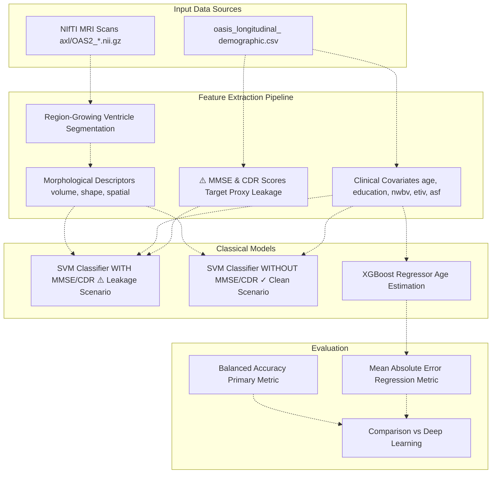
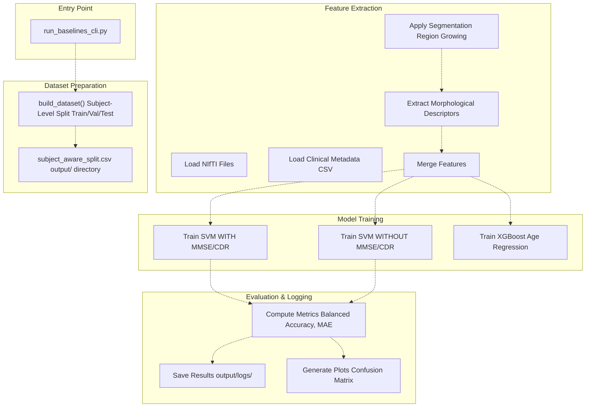
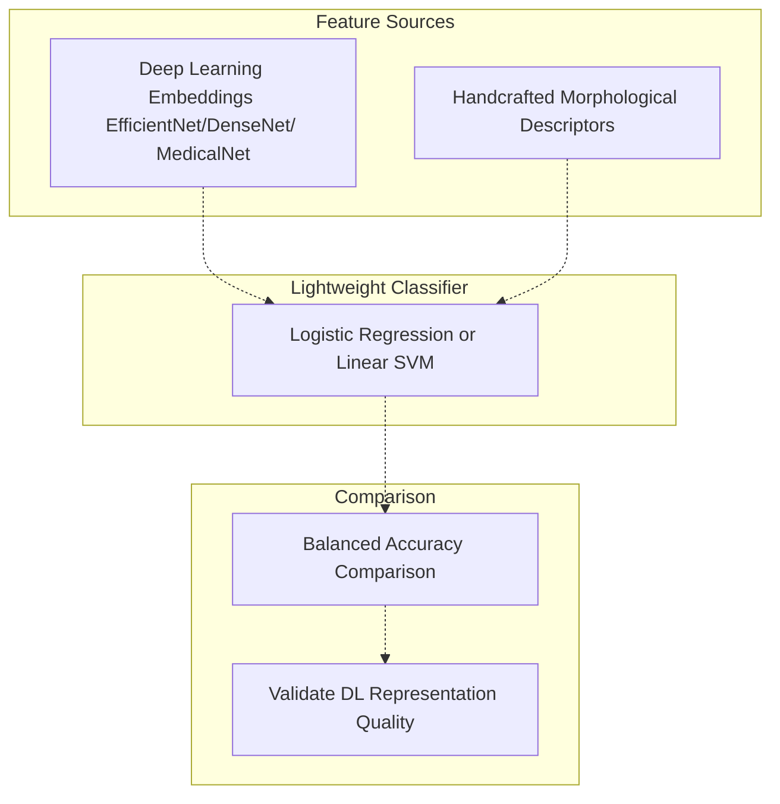

# Classical Machine Learning Baselines

> **Relevant source files**
> * [README.md](https://github.com/ThalesMMS/brain-mri-pipelines-py/blob/cd9d51a5/README.md)

## Purpose and Scope

This document describes the classical machine learning baseline models implemented in the system for Alzheimer's disease detection. These baselines serve as performance benchmarks to validate that deep learning embeddings provide meaningful improvements over handcrafted features. The page covers Support Vector Machine (SVM) classifiers operating on morphological descriptors and clinical covariates, as well as XGBoost models for age estimation regression tasks.

For information about deep learning model architectures, see [Deep Learning Backbones](5a%20Stage-1-Embedding-Analysis-%28run_pc1_embeddings.py%29.md). For details on how these baselines integrate into the embedding analysis stage, see [Stage 1: Embedding Analysis](6a%20Graphical-User-Interface-%28main.py%29.md).

---

## Overview of Classical Baselines

The classical machine learning pipeline provides two complementary approaches that operate without requiring deep neural networks:

1. **SVM Classification**: Binary classification (AD vs. Non-AD) using handcrafted morphological descriptors extracted from ventricle geometry, combined with demographic and neuroanatomical clinical covariates
2. **XGBoost Regression**: Age estimation as a regression baseline task to validate feature quality

These baselines are critical for establishing whether learned deep representations genuinely capture disease-relevant patterns beyond what can be achieved through traditional feature engineering.

**Sources**: [README.md L13-L15](https://github.com/ThalesMMS/brain-mri-pipelines-py/blob/cd9d51a5/README.md#L13-L15)

---

## Feature Types and Extraction

Classical baselines rely on two distinct feature sources that differ fundamentally from deep learning embeddings.

### Morphological Descriptors

Morphological descriptors are handcrafted geometric features extracted from brain ventricles through semi-automatic segmentation. The system employs region-growing algorithms to segment ventricular structures, then computes geometric properties:

| Feature Type | Description | Extraction Method |
| --- | --- | --- |
| **Ventricle Volume** | Total volumetric measurement | Region-growing segmentation |
| **Ventricle Shape** | Geometric shape descriptors | Morphological analysis post-segmentation |
| **Spatial Distribution** | Ventricular positioning metrics | Coordinate-based analysis |

The GUI provides interactive tools for ventricle segmentation and descriptor extraction through the segmentation mixin. Users can manually initiate region-growing from seed points within ventricular areas.

**Sources**: README.md

### Clinical Covariates

Clinical features from the OASIS-2 demographic metadata provide complementary information:

| Covariate | Variable | Description |
| --- | --- | --- |
| **Age** | `age` | Patient age at scan time |
| **Education** | `education` | Years of formal education |
| **nWBV** | `nwbv` | Normalized whole brain volume |
| **eTIV** | `etiv` | Estimated total intracranial volume |
| **ASF** | `asf` | Atlas scaling factor |

These features are loaded from `oasis_longitudinal_demographic.csv` and merged with imaging-based descriptors for training.

**Sources**: [README.md L12](https://github.com/ThalesMMS/brain-mri-pipelines-py/blob/cd9d51a5/README.md#L12-L12)

### MMSE and CDR Scores: Target Leakage Warning

The dataset includes Mini-Mental State Examination (MMSE) and Clinical Dementia Rating (CDR) scores. **However, these are strong proxies for dementia diagnosis** and create methodological target leakage when used as input features. The system explicitly implements two SVM scenarios:

1. **`svm_with_mmse_cdr`**: Includes cognitive scores (demonstrates upper-bound performance but leaks information)
2. **`svm_without_mmse_cdr`**: Clean imaging-only scenario (recommended for valid research conclusions)

The codebase documentation warns users about this distinction and recommends the clean scenario for methodologically sound analysis.

**Sources**: Project overview and setup

---

## Classical Baseline Architecture



**Diagram**: Classical Machine Learning Baseline Architecture

This diagram illustrates the dual-path approach for classical baselines. The red-highlighted path shows the leakage scenario that includes cognitive test scores, while the green-highlighted path shows the methodologically clean approach using only imaging-derived and demographic features.

**Sources**: [README.md L13-L15](https://github.com/ThalesMMS/brain-mri-pipelines-py/blob/cd9d51a5/README.md#L13-L15)

 **Sources**: [Project overview and setup](https://github.com/ThalesMMS/brain-mri-pipelines-py/blob/cd9d51a5/README.md#L168-L168)

---

## SVM Classification Pipeline

Support Vector Machines serve as the primary classical classification baseline. The SVM implementation uses scikit-learn's `SVC` class with a Radial Basis Function (RBF) kernel, which provides non-linear decision boundaries suitable for complex medical imaging features.

### Feature Vector Construction

The SVM operates on concatenated feature vectors with the following structure:

**Clean Scenario** (recommended):

```
[morph_1, morph_2, ..., morph_n, age, education, nwbv, etiv, asf]
```

**Leakage Scenario** (for analysis only):

```
[morph_1, morph_2, ..., morph_n, age, education, nwbv, etiv, asf, mmse, cdr]
```

### Hyperparameter Configuration

The SVM training pipeline typically employs:

| Parameter | Value | Rationale |
| --- | --- | --- |
| **Kernel** | RBF | Handles non-linear relationships in morphological features |
| **C** | Grid-searched | Regularization parameter balanced via cross-validation |
| **Gamma** | Grid-searched | Kernel coefficient optimized for feature scale |
| **Class Weight** | Balanced | Compensates for AD/Non-AD imbalance |

**Sources**: [README.md L14](https://github.com/ThalesMMS/brain-mri-pipelines-py/blob/cd9d51a5/README.md#L14-L14)

---

## XGBoost Regression for Age Estimation

XGBoost serves as a regression baseline to validate that extracted features contain meaningful signal beyond disease classification. Age estimation is a proxy task that tests whether clinical covariates capture genuine neuroanatomical patterns.

### Task Formulation

* **Input**: Clinical covariates (`age`, `education`, `nwbv`, `etiv`, `asf`)
* **Target**: Patient age (continuous variable)
* **Metric**: Mean Absolute Error (MAE)
* **Purpose**: Verify feature quality through orthogonal prediction task

Age can be reliably estimated from brain volume measurements due to natural atrophy patterns, making it an effective sanity check for feature extraction quality.

**Sources**: [README.md L15](https://github.com/ThalesMMS/brain-mri-pipelines-py/blob/cd9d51a5/README.md#L15-L15)

---

## CLI Execution Pipeline



**Diagram**: Baseline CLI Execution Flow from Entry Point to Results

This diagram maps the command-line execution flow, showing how `run_baselines_cli.py` orchestrates dataset splitting, feature extraction, model training, and result logging.

**Sources**: Project overview and setup

---

## Running Baselines via Command Line

The `run_baselines_cli.py` script provides the primary interface for executing classical baseline experiments. This script automates the complete pipeline from data splitting through result generation.

### Basic Execution

```
python run_baselines_cli.py
```

This command performs the following sequence:

1. Generates subject-aware train/validation/test splits
2. Saves split information to `subject_aware_split.csv` in the output directory
3. Extracts morphological descriptors from segmented ventricles
4. Loads clinical covariates from demographic CSV
5. Trains SVM classifiers in both leakage and clean scenarios
6. Trains XGBoost age estimation model
7. Evaluates all models and logs results

### Output Artifacts

The CLI generates the following artifacts in the `output/` directory:

| Artifact | Location | Description |
| --- | --- | --- |
| **Split CSV** | `output/subject_aware_split.csv` | Subject-level train/val/test assignments |
| **Model Checkpoints** | `output/models/svm_*.pkl` | Trained SVM classifiers |
| **Logs** | `output/logs/baseline_results.json` | Performance metrics and hyperparameters |
| **Visualizations** | `output/plots/confusion_matrix_svm.png` | Confusion matrices and metric plots |

**Sources**: Project overview and setup

---

## Integration with Research Pipeline

Classical baselines integrate into the three-stage research pipeline primarily through **Stage 1: Embedding Analysis**. This stage explicitly compares deep learning embeddings against handcrafted morphological descriptors.

### Stage 1 Integration

The embedding analysis script (`run_pc1_embeddings.py`) performs direct comparison:



**Diagram**: Feature Comparison Framework in Stage 1

By training the same lightweight classifier on both deep embeddings and handcrafted features, Stage 1 isolates the representation quality from classifier complexity. Superior performance with deep embeddings validates their use in subsequent stages.

**Sources**: Project overview and setup

### Baseline as Performance Floor

Classical baselines establish the **performance floor** that deep learning models must surpass to justify their computational complexity:

| Model Type | Purpose | Expected Performance |
| --- | --- | --- |
| **SVM (Clean)** | Methodologically sound baseline | Performance floor for valid comparison |
| **SVM (Leakage)** | Upper-bound demonstration | Shows maximum achievable with domain knowledge features |
| **Deep Models** | Target approach | Must exceed clean SVM to validate learned representations |

**Sources**: Project overview and setup

---

## Feature Engineering vs. Learned Representations

The contrast between classical and deep learning approaches highlights the fundamental trade-off in medical imaging analysis:

### Classical Approach Characteristics

**Advantages**:

* Interpretable features (ventricle volume has clinical meaning)
* Requires less training data
* Faster training and inference
* No GPU requirements
* Aligned with clinical domain knowledge

**Limitations**:

* Manual feature engineering required
* May miss complex patterns not captured by handcrafted features
* Segmentation quality directly impacts performance
* Limited to pre-specified feature types

### Deep Learning Approach Characteristics

**Advantages**:

* Automatic feature learning from raw data
* Can discover non-obvious patterns
* Scales with data availability
* Multi-view fusion capabilities

**Limitations**:

* Requires large datasets
* Computationally expensive
* Black-box representations
* Risk of overfitting without proper regularization

The baseline comparison quantifies whether the advantages of deep learning outweigh its costs for this specific medical imaging task.

**Sources**: [README.md L13-L15](https://github.com/ThalesMMS/brain-mri-pipelines-py/blob/cd9d51a5/README.md#L13-L15)

---

## Methodological Considerations

### Subject-Level Splitting Critical for Baselines

Classical baselines use the same subject-aware splitting mechanism as deep learning models to prevent data leakage. Since patients may have multiple longitudinal scans, all scans from a single subject must remain in the same partition (train, validation, or test).

The `build_dataset()` function enforces this constraint by:

1. Extracting `Subject_ID` from filenames (`OAS2_XXXX`)
2. Grouping all MRI scans by subject
3. Splitting at subject level, not scan level
4. Saving assignments to `subject_aware_split.csv`

This ensures that morphological descriptors and clinical features extracted from different time points of the same patient do not leak across train/test boundaries.

**Sources**: [README.md L23](https://github.com/ThalesMMS/brain-mri-pipelines-py/blob/cd9d51a5/README.md#L23-L23)

### Balanced Accuracy as Primary Metric

Both classical baselines and deep learning models use **Balanced Accuracy** as the primary evaluation metric due to class imbalance in the OASIS-2 dataset:

```
Balanced Accuracy = (Sensitivity + Specificity) / 2
```

This metric ensures that model evaluation is not biased toward the majority class, which is critical in medical diagnosis where false negatives and false positives have different clinical implications.

**Sources**: Project overview and setup

---

## Summary

Classical machine learning baselines provide essential performance benchmarks for validating deep learning approaches in Alzheimer's disease detection. The system implements two distinct baseline types:

1. **SVM Classification**: Uses morphological descriptors and clinical covariates, with explicit handling of target leakage through dual scenarios (with/without MMSE/CDR)
2. **XGBoost Regression**: Validates feature quality through age estimation

These baselines integrate into the research pipeline through the `run_baselines_cli.py` entry point and directly inform Stage 1 embedding analysis. The clean SVM scenario (without cognitive scores) establishes the performance floor that deep learning models must exceed to justify their complexity.

**Sources**: [README.md L13-L15](https://github.com/ThalesMMS/brain-mri-pipelines-py/blob/cd9d51a5/README.md#L13-L15)

 **Sources**: [Project overview and setup](https://github.com/ThalesMMS/brain-mri-pipelines-py/blob/cd9d51a5/README.md#L101-L108)

 **Sources**: [Project overview and setup](https://github.com/ThalesMMS/brain-mri-pipelines-py/blob/cd9d51a5/README.md#L126-L132)

 **Sources**: [Project overview and setup](https://github.com/ThalesMMS/brain-mri-pipelines-py/blob/cd9d51a5/README.md#L164-L168)


### On this page

* [Classical Machine Learning Baselines](#5.3-classical-machine-learning-baselines)
* [Purpose and Scope](#5.3-purpose-and-scope)
* [Overview of Classical Baselines](#5.3-overview-of-classical-baselines)
* [Feature Types and Extraction](#5.3-feature-types-and-extraction)
* [Morphological Descriptors](#5.3-morphological-descriptors)
* [Clinical Covariates](#5.3-clinical-covariates)
* [MMSE and CDR Scores: Target Leakage Warning](#5.3-mmse-and-cdr-scores-target-leakage-warning)
* [Classical Baseline Architecture](#5.3-classical-baseline-architecture)
* [SVM Classification Pipeline](#5.3-svm-classification-pipeline)
* [Feature Vector Construction](#5.3-feature-vector-construction)
* [Hyperparameter Configuration](#5.3-hyperparameter-configuration)
* [XGBoost Regression for Age Estimation](#5.3-xgboost-regression-for-age-estimation)
* [Task Formulation](#5.3-task-formulation)
* [CLI Execution Pipeline](#5.3-cli-execution-pipeline)
* [Running Baselines via Command Line](#5.3-running-baselines-via-command-line)
* [Basic Execution](#5.3-basic-execution)
* [Output Artifacts](#5.3-output-artifacts)
* [Integration with Research Pipeline](#5.3-integration-with-research-pipeline)
* [Stage 1 Integration](#5.3-stage-1-integration)
* [Baseline as Performance Floor](#5.3-baseline-as-performance-floor)
* [Feature Engineering vs. Learned Representations](#5.3-feature-engineering-vs-learned-representations)
* [Classical Approach Characteristics](#5.3-classical-approach-characteristics)
* [Deep Learning Approach Characteristics](#5.3-deep-learning-approach-characteristics)
* [Methodological Considerations](#5.3-methodological-considerations)
* [Subject-Level Splitting Critical for Baselines](#5.3-subject-level-splitting-critical-for-baselines)
* [Balanced Accuracy as Primary Metric](#5.3-balanced-accuracy-as-primary-metric)
* [Summary](#5.3-summary)

Ask Devin about brain-mri-pipelines-py