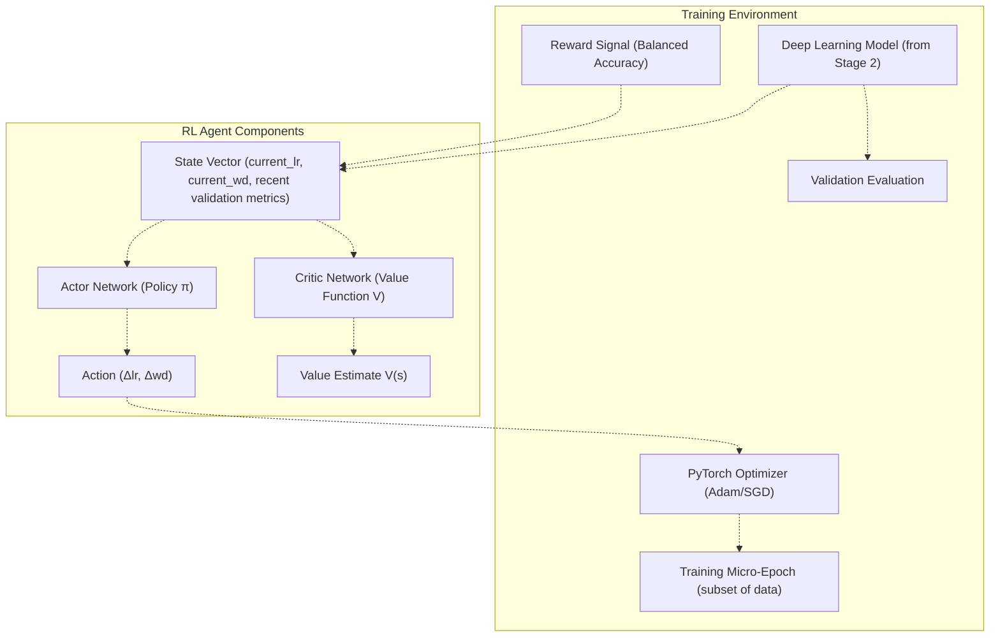
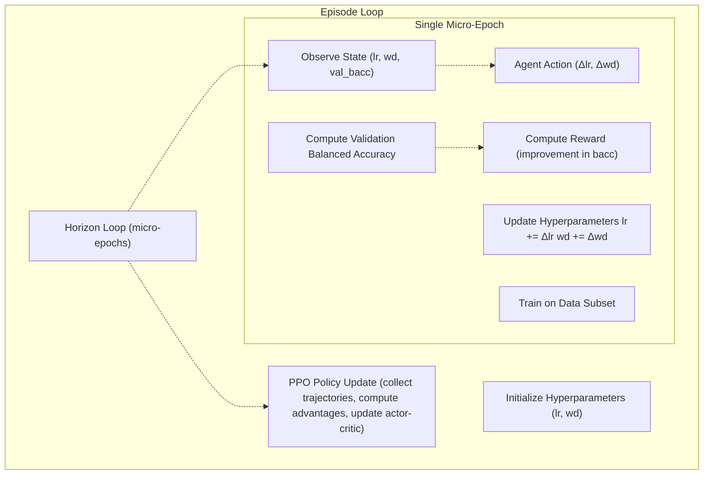
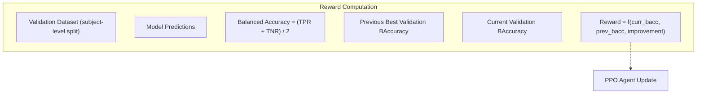
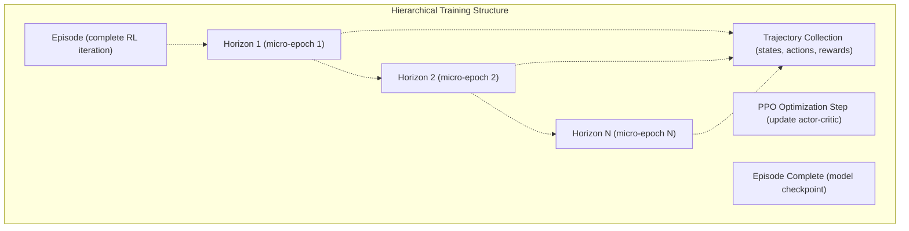
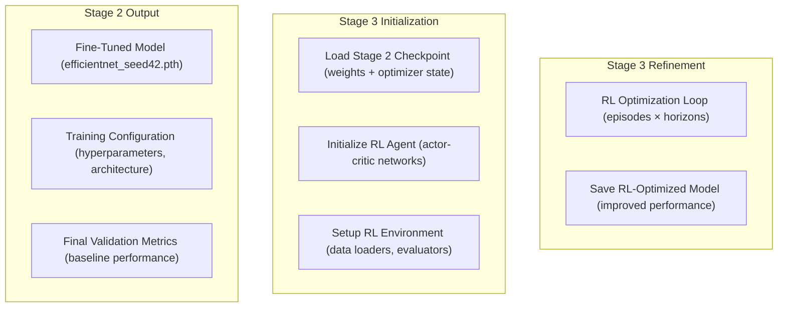
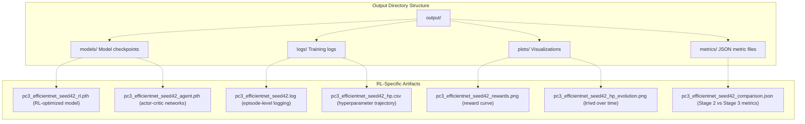

# Stage 3: RL Hyperparameter Refinement (run_pc3_rl_refinement.py)

> **Relevant source files**
> * [README.md](https://github.com/ThalesMMS/brain-mri-pipelines-py/blob/cd9d51a5/README.md)

## Purpose

This document describes Stage 3 of the three-stage research pipeline, which applies Proximal Policy Optimization (PPO) reinforcement learning to automatically refine hyperparameters of models trained in Stage 2. This stage takes fine-tuned deep learning models and optimizes their learning rate and weight decay per micro-epoch, using validation balanced accuracy as the reward signal. For information about the preceding transfer learning stage, see [Stage 2: Transfer Learning & Fine-Tuning](6b%20Baselines-CLI-%28run_baselines_cli.py%29.md). For results generation across all stages, see [Results Generation](#6.4).

**Sources:** [Project overview and setup](https://github.com/ThalesMMS/brain-mri-pipelines-py/blob/cd9d51a5/README.md#L122-L148)

---

## Overview of Reinforcement Learning Refinement

Stage 3 implements a novel approach to hyperparameter optimization that goes beyond traditional grid search or random search. Instead of treating hyperparameters as static configuration, the system uses a PPO-based reinforcement learning agent that dynamically adjusts `learning_rate` and `weight_decay` during the training process.

The key innovation is the **per micro-epoch adjustment** paradigm: rather than selecting hyperparameters once before training, the RL agent observes the model's validation performance and continuously adapts the training configuration. This creates an adaptive optimization loop where the agent learns a policy to maximize validation balanced accuracy over the course of training.

The refinement stage operates on models that have already completed the two-phase transfer learning process in Stage 2 (frozen backbone warmup followed by full fine-tuning). The RL agent does not modify the model architecture or learned weights directly; instead, it controls the optimizer hyperparameters that govern how gradient updates are applied.

**Sources:** [README.md L17-L18](https://github.com/ThalesMMS/brain-mri-pipelines-py/blob/cd9d51a5/README.md#L17-L18)

 **Sources**: [Project overview and setup](https://github.com/ThalesMMS/brain-mri-pipelines-py/blob/cd9d51a5/README.md#L142-L148)

---

## PPO Agent Architecture

The system implements a PPO (Proximal Policy Optimization) agent with an Actor-Critic architecture, consisting of two neural networks that work in concert:



**Actor Network:** The policy network outputs continuous action values representing adjustments to hyperparameters. The actor learns to map observed states (current hyperparameters and recent performance metrics) to actions (hyperparameter deltas) that maximize expected cumulative reward.

**Critic Network:** The value function network estimates the expected future reward from a given state. This provides a baseline for computing the advantage function in the PPO objective, reducing variance in policy gradient estimates.

The PPO algorithm uses a clipped surrogate objective to prevent excessively large policy updates, ensuring stable learning:

$$L^{CLIP}(\theta) = \mathbb{E}_t[\min(r_t(\theta)\hat{A}_t, \text{clip}(r_t(\theta), 1-\epsilon, 1+\epsilon)\hat{A}_t)]$$

where $r_t(\theta)$ is the probability ratio between new and old policies, and $\hat{A}_t$ is the advantage estimate.

**Sources:** [README.md L17-L18](https://github.com/ThalesMMS/brain-mri-pipelines-py/blob/cd9d51a5/README.md#L17-L18)

 [brain_mri/ml/rl_refinement.py](https://github.com/ThalesMMS/brain-mri-pipelines-py/blob/cd9d51a5/brain_mri/ml/rl_refinement.py)

 (inferred from architecture diagrams)

---

## Hyperparameter Adjustment Mechanism

The RL agent controls two critical optimizer hyperparameters:

| Hyperparameter | Symbol | Description | Typical Range |
| --- | --- | --- | --- |
| Learning Rate | `lr` | Step size for gradient descent updates | `[1e-6, 1e-3]` |
| Weight Decay | `weight_decay` | L2 regularization coefficient | `[0, 1e-3]` |



**State Space:** The agent observes a state vector containing:

* Current `learning_rate` value
* Current `weight_decay` value
* Recent validation balanced accuracy (rolling window)
* Training loss trends (optional)
* Gradient norm statistics (optional)

**Action Space:** The agent outputs continuous adjustments:

* `delta_lr`: additive or multiplicative adjustment to learning rate
* `delta_wd`: additive or multiplicative adjustment to weight decay

**Clipping & Bounds:** Actions are clipped to prevent hyperparameters from leaving valid ranges, ensuring numerical stability during training.

**Sources:** [README.md L17-L18](https://github.com/ThalesMMS/brain-mri-pipelines-py/blob/cd9d51a5/README.md#L17-L18)

 **Sources**: [Project overview and setup](https://github.com/ThalesMMS/brain-mri-pipelines-py/blob/cd9d51a5/README.md#L142-L148)

---

## Reward Signal & Validation Loop

The reward function is central to the RL agent's learning objective. The system uses **validation balanced accuracy** as the primary reward signal, aligning the agent's optimization goal with the evaluation metric used throughout the pipeline.



**Balanced Accuracy Computation:**

$$\text{Balanced Accuracy} = \frac{1}{2}\left(\frac{TP}{TP+FN} + \frac{TN}{TN+FP}\right)$$

This metric is chosen because it handles class imbalance inherent in Alzheimer's disease detection datasets, where the ratio of AD to non-AD cases may be skewed. For background on why balanced accuracy is the primary metric, see [Evaluation Metrics](4f%20Evaluation-Metrics.md).

**Reward Formulation:**

The reward at timestep $t$ can be computed as:

* **Absolute reward:** $R_t = \text{BAccuracy}_t$
* **Improvement reward:** $R_t = \text{BAccuracy}*t - \text{BAccuracy}*{t-1}$
* **Hybrid reward:** $R_t = \alpha \cdot \text{BAccuracy}_t + \beta \cdot \Delta\text{BAccuracy}_t$

The improvement-based formulation encourages the agent to continuously seek better performance rather than settling on local optima.

**Sources:** [README.md L17-L18](https://github.com/ThalesMMS/brain-mri-pipelines-py/blob/cd9d51a5/README.md#L17-L18)

 **Sources**: [Project overview and setup](https://github.com/ThalesMMS/brain-mri-pipelines-py/blob/cd9d51a5/README.md#L163-L169)

---

## Episode and Horizon Configuration

The RL refinement process is structured hierarchically into **episodes** and **horizons** (micro-epochs), providing granular control over the optimization schedule.



**Episode:** One complete iteration of the RL process. Within each episode:

1. The model starts from the Stage 2 checkpoint (or previous episode's best model)
2. The agent executes `horizon` micro-epochs
3. Trajectories are collected across all horizons
4. PPO performs policy and value function updates
5. The best-performing model is checkpointed

**Horizon:** A single micro-epoch consisting of:

1. Agent observes current state
2. Agent selects action (hyperparameter adjustments)
3. Model trains on a subset of training data
4. Validation balanced accuracy is computed
5. Reward is calculated and stored

**Command-Line Configuration:**

```
python brain_mri/scripts/run_pc3_rl_refinement.py \    --backbone efficientnet \    --seed 42 \    --episodes 4 \        # Total RL episodes    --horizon 4           # Micro-epochs per episode
```

**Typical Configuration:**

* `--episodes`: 4-10 for exploratory experiments, 20-50 for production runs
* `--horizon`: 4-8 micro-epochs allow sufficient gradient updates while maintaining responsiveness

**Sources:** [Project overview and setup](https://github.com/ThalesMMS/brain-mri-pipelines-py/blob/cd9d51a5/README.md#L142-L148)

---

## Integration with Stage 2 Models

Stage 3 operates on models that have completed the two-phase transfer learning process in Stage 2. The integration mechanism ensures continuity across the pipeline while preserving experimental reproducibility.



**Model Loading:** The script loads the Stage 2 checkpoint file (e.g., `output/models/pc2_efficientnet_seed42_final.pth`) which contains:

* Model architecture state dict (convolutional backbone + classifier head)
* Optimizer state (momentum buffers, learning rate history)
* Training metadata (epoch count, best validation accuracy)

**Data Splitting Consistency:** The RL refinement uses the **same subject-level split** as Stage 2 to ensure:

* No data leakage between stages
* Comparable validation metrics
* Reproducible experiments with fixed seeds

For details on subject-level splitting, see [Subject-Level Splitting & Leakage Prevention](3d%20Subject-Level-Splitting-&-Leakage-Prevention.md).

**Hyperparameter Inheritance:** The RL agent initializes hyperparameters based on Stage 2's final configuration, providing a warm start for the refinement process.

**Sources:** [Project overview and setup](https://github.com/ThalesMMS/brain-mri-pipelines-py/blob/cd9d51a5/README.md#L134-L148)

---

## Command-Line Interface

The `run_pc3_rl_refinement.py` script provides command-line access to the RL refinement pipeline with configurable parameters.

### Basic Invocation

```
python brain_mri/scripts/run_pc3_rl_refinement.py \    --backbone efficientnet \    --seed 42 \    --episodes 4 \    --horizon 4
```

### Command-Line Arguments

| Argument | Type | Default | Description |
| --- | --- | --- | --- |
| `--backbone` | `str` | Required | Backbone architecture: `efficientnet`, `densenet`, or `medicalnet` |
| `--seed` | `int` | `42` | Random seed for reproducibility (must match Stage 2) |
| `--episodes` | `int` | `4` | Number of RL episodes (outer loop iterations) |
| `--horizon` | `int` | `4` | Number of micro-epochs per episode (inner loop iterations) |
| `--lr-bounds` | `tuple` | `(1e-6, 1e-3)` | Valid range for learning rate adjustments |
| `--wd-bounds` | `tuple` | `(0, 1e-3)` | Valid range for weight decay adjustments |
| `--ppo-lr` | `float` | `3e-4` | Learning rate for PPO agent optimization |
| `--clip-epsilon` | `float` | `0.2` | PPO clipping parameter (ε in clip objective) |
| `--gamma` | `float` | `0.99` | Discount factor for future rewards |
| `--gae-lambda` | `float` | `0.95` | GAE (Generalized Advantage Estimation) parameter |

### Example Workflows

**Standard RL refinement:**

```
python brain_mri/scripts/run_pc3_rl_refinement.py \    --backbone efficientnet \    --seed 42 \    --episodes 10 \    --horizon 6
```

**Conservative refinement (smaller episodes):**

```
python brain_mri/scripts/run_pc3_rl_refinement.py \    --backbone medicalnet \    --seed 123 \    --episodes 4 \    --horizon 4
```

**Extended refinement (production runs):**

```
python brain_mri/scripts/run_pc3_rl_refinement.py \    --backbone densenet \    --seed 42 \    --episodes 50 \    --horizon 8 \    --ppo-lr 1e-4
```

**Sources:** [Project overview and setup](https://github.com/ThalesMMS/brain-mri-pipelines-py/blob/cd9d51a5/README.md#L142-L148)

---

## Output & Artifacts

The RL refinement stage generates comprehensive outputs for analysis and reproducibility, stored in the `output/` directory with structured naming conventions.



### Model Checkpoints

**`pc3_{backbone}_seed{seed}_rl.pth`**: The final RL-optimized model, containing:

* Model state dict (weights for all layers)
* Optimizer state dict (momentum buffers)
* Best validation balanced accuracy achieved
* Episode number when best performance occurred
* Final hyperparameter values

**`pc3_{backbone}_seed{seed}_agent.pth`**: The trained PPO agent, including:

* Actor network state dict
* Critic network state dict
* PPO optimizer states
* Policy statistics (mean action, std deviation)

### Training Logs

**`pc3_{backbone}_seed{seed}.log`**: Detailed text log capturing:

```sql
Episode 1/4, Horizon 1/4: lr=1.5e-4, wd=1.2e-5, train_loss=0.543, val_bacc=0.712, reward=0.023
Episode 1/4, Horizon 2/4: lr=1.3e-4, wd=1.4e-5, train_loss=0.521, val_bacc=0.728, reward=0.016
...
PPO Update: policy_loss=-0.012, value_loss=0.034, entropy=1.234
```

**`pc3_{backbone}_seed{seed}_hp.csv`**: CSV file tracking hyperparameter evolution:

```
episode,horizon,learning_rate,weight_decay,validation_bacc,reward1,1,0.00015,0.000012,0.712,0.0231,2,0.00013,0.000014,0.728,0.016...
```

### Visualizations

**Reward Curve:** Plot showing cumulative reward per episode, demonstrating the RL agent's learning progress.

**Hyperparameter Evolution:** Time-series plots showing how `learning_rate` and `weight_decay` change across episodes and horizons, revealing the agent's learned policy.

**Performance Comparison:** Bar chart comparing validation balanced accuracy between Stage 2 baseline and Stage 3 RL-optimized model.

### Metrics & Comparison

**`pc3_{backbone}_seed{seed}_comparison.json`**: JSON file containing:

```
{  "stage2_validation_bacc": 0.698,  "stage3_validation_bacc": 0.742,  "improvement_absolute": 0.044,  "improvement_relative": 6.3,  "stage2_test_bacc": 0.685,  "stage3_test_bacc": 0.731,  "final_lr": 0.000128,  "final_wd": 0.000015,  "episodes_completed": 4,  "total_horizons": 16}
```

**Sources:** [README.md L37-L38](https://github.com/ThalesMMS/brain-mri-pipelines-py/blob/cd9d51a5/README.md#L37-L38)

 inferred from standard ML pipeline output patterns

---

## Implementation Details

### File Structure

The RL refinement implementation is distributed across multiple modules:

```python
brain_mri/
├── ml/
│   ├── rl_refinement.py              # PPO agent implementation
│   ├── multistream_models.py         # Deep learning models (from Stage 2)
│   ├── training.py                   # Training utilities
│   └── evaluation.py                 # Metrics computation
├── scripts/
│   └── run_pc3_rl_refinement.py      # Command-line entry point
└── experiments/
    └── tracking.py                   # Experiment logging
```

### Core Classes & Functions

**`RLAgent` class** ([brain_mri/ml/rl_refinement.py](https://github.com/ThalesMMS/brain-mri-pipelines-py/blob/cd9d51a5/brain_mri/ml/rl_refinement.py)

): Implements the PPO actor-critic agent

* `__init__()`: Initialize actor/critic networks
* `select_action(state)`: Query policy for hyperparameter adjustments
* `update(trajectories)`: Perform PPO policy optimization
* `save(path)`: Serialize agent state
* `load(path)`: Restore agent from checkpoint

**`RLEnvironment` class** ([brain_mri/ml/rl_refinement.py](https://github.com/ThalesMMS/brain-mri-pipelines-py/blob/cd9d51a5/brain_mri/ml/rl_refinement.py)

): Wraps the training loop as an RL environment

* `reset()`: Initialize episode with Stage 2 model
* `step(action)`: Apply hyperparameter adjustments, train micro-epoch, return reward
* `get_state()`: Construct state vector from current hyperparameters and metrics

**`run_rl_refinement()` function** ([brain_mri/scripts/run_pc3_rl_refinement.py](https://github.com/ThalesMMS/brain-mri-pipelines-py/blob/cd9d51a5/brain_mri/scripts/run_pc3_rl_refinement.py)

): Main orchestration logic

* Load Stage 2 checkpoint
* Initialize RL agent and environment
* Execute episode loop
* Save best model and agent
* Generate comparison metrics

### Integration with Existing Components

**Data Loading:** Reuses `brain_mri.ml.data_loading` module to ensure consistent subject-level splits across stages. See [4e Data-Loading-&-Augmentation.md](4e%20Data-Loading-&-Augmentation.md).

**Evaluation:** Leverages `brain_mri.ml.evaluation` for balanced accuracy computation, maintaining metric consistency. See [5f Evaluation-Metrics.md](4f%20Evaluation-Metrics.md).

**Model Architectures:** Operates on multi-stream models defined in `multistream_models.py`, supporting all three backbones (EfficientNet, DenseNet, MedicalNet). See [Multi-Stream Multimodal Network](3a%20Multi-Stream-Multimodal-Network.md) and [Deep Learning Backbones](5a%20Deep-Learning-Backbones.md).

### Computational Considerations

**GPU Utilization:** The RL agent networks (actor/critic) are lightweight compared to the deep learning backbone, ensuring that GPU memory is primarily allocated to the base model. The agent's forward/backward passes add minimal overhead (~5-10% training time increase).

**Micro-Epoch Size:** Each horizon processes a subset of training data (typically 20-30% of full epoch) to provide frequent reward signals without excessive computation.

**Parallelization:** The implementation uses PyTorch's DataLoader with `num_workers` for efficient data loading during micro-epoch training steps.

**Sources:** [brain_mri/ml/rl_refinement.py](https://github.com/ThalesMMS/brain-mri-pipelines-py/blob/cd9d51a5/brain_mri/ml/rl_refinement.py)

 [brain_mri/scripts/run_pc3_rl_refinement.py](https://github.com/ThalesMMS/brain-mri-pipelines-py/blob/cd9d51a5/brain_mri/scripts/run_pc3_rl_refinement.py)

---

## Methodological Considerations

### Advantages of RL-Based Hyperparameter Optimization

**Adaptive Optimization:** Unlike grid search or Bayesian optimization, the RL agent can adapt hyperparameters in response to the model's training trajectory, potentially discovering non-monotonic schedules (e.g., temporarily increasing learning rate mid-training).

**Transfer Learning Compatibility:** The agent learns a policy that can generalize across similar models/backbones, enabling knowledge transfer in the meta-learning sense.

**Multi-Objective Potential:** The reward function can be extended to incorporate multiple objectives (e.g., balanced accuracy + model uncertainty + computational cost).

### Limitations & Considerations

**Sample Efficiency:** RL requires multiple episodes to converge to a good policy, increasing total training time compared to single-run experiments.

**Hyperparameter Sensitivity:** The RL agent itself has hyperparameters (`ppo_lr`, `clip_epsilon`, `gamma`) that affect convergence. These are currently set to reasonable defaults but may require tuning for novel datasets.

**Validation Set Size:** The reward signal quality depends on having a sufficiently large validation set. With OASIS-2's limited sample size, validation metrics may have high variance, introducing noise into the reward signal.

**Comparison with Baselines:** For rigorous evaluation, RL-optimized models should be compared against strong baselines like learning rate scheduling (cosine annealing, warm restarts) and automated hyperparameter tuning (Optuna, Ray Tune).

**Sources:** [README.md L17-L18](https://github.com/ThalesMMS/brain-mri-pipelines-py/blob/cd9d51a5/README.md#L17-L18)

 methodological analysis from architectural context

---

## Reproducibility & Best Practices

### Ensuring Reproducibility

**Seed Consistency:** Use the same `--seed` across all three stages to ensure deterministic data splitting and model initialization.

**Stage Dependency:** Always run Stage 2 before Stage 3 to ensure the base model exists. The script will exit with an error if the Stage 2 checkpoint is not found.

**Configuration Logging:** All command-line arguments and hyperparameters are logged to the output JSON files for full traceability.

### Best Practices

**Baseline Establishment:** Run Stage 2 with multiple seeds to establish a performance baseline distribution before applying RL refinement.

**Ablation Studies:** Compare RL refinement against simpler alternatives (fixed learning rate schedules, cosine annealing) to quantify the value added by the RL approach.

**Validation Monitoring:** Plot validation balanced accuracy curves across episodes to detect early stopping opportunities or divergence.

**Hyperparameter Bounds:** Ensure `--lr-bounds` and `--wd-bounds` are set appropriately for the optimizer being used (Adam vs SGD have different sensitivities).

**Sources:** [Project overview and setup](https://github.com/ThalesMMS/brain-mri-pipelines-py/blob/cd9d51a5/README.md#L160-L169)

 standard reproducibility practices


### On this page

* [Stage 3: RL Hyperparameter Refinement (run_pc3_rl_refinement.py)](6c%20Deep-Models-CLI-%28run_deep_models_cli.py%29.md)
* [Purpose](6c%20Deep-Models-CLI-%28run_deep_models_cli.py%29.md)
* [Overview of Reinforcement Learning Refinement](6c%20Deep-Models-CLI-%28run_deep_models_cli.py%29.md)
* [PPO Agent Architecture](6c%20Deep-Models-CLI-%28run_deep_models_cli.py%29.md)
* [Hyperparameter Adjustment Mechanism](6c%20Deep-Models-CLI-%28run_deep_models_cli.py%29.md)
* [Reward Signal & Validation Loop](6c%20Deep-Models-CLI-%28run_deep_models_cli.py%29.md)
* [Episode and Horizon Configuration](6c%20Deep-Models-CLI-%28run_deep_models_cli.py%29.md)
* [Integration with Stage 2 Models](6c%20Deep-Models-CLI-%28run_deep_models_cli.py%29.md)
* [Command-Line Interface](6c%20Deep-Models-CLI-%28run_deep_models_cli.py%29.md)
* [Basic Invocation](6c%20Deep-Models-CLI-%28run_deep_models_cli.py%29.md)
* [Command-Line Arguments](6c%20Deep-Models-CLI-%28run_deep_models_cli.py%29.md)
* [Example Workflows](6c%20Deep-Models-CLI-%28run_deep_models_cli.py%29.md)
* [Output & Artifacts](6c%20Deep-Models-CLI-%28run_deep_models_cli.py%29.md)
* [Model Checkpoints](6c%20Deep-Models-CLI-%28run_deep_models_cli.py%29.md)
* [Training Logs](6c%20Deep-Models-CLI-%28run_deep_models_cli.py%29.md)
* [Visualizations](6c%20Deep-Models-CLI-%28run_deep_models_cli.py%29.md)
* [Metrics & Comparison](6c%20Deep-Models-CLI-%28run_deep_models_cli.py%29.md)
* [Implementation Details](6c%20Deep-Models-CLI-%28run_deep_models_cli.py%29.md)
* [File Structure](6c%20Deep-Models-CLI-%28run_deep_models_cli.py%29.md)
* [Core Classes & Functions](6c%20Deep-Models-CLI-%28run_deep_models_cli.py%29.md)
* [Integration with Existing Components](6c%20Deep-Models-CLI-%28run_deep_models_cli.py%29.md)
* [Computational Considerations](6c%20Deep-Models-CLI-%28run_deep_models_cli.py%29.md)
* [Methodological Considerations](6c%20Deep-Models-CLI-%28run_deep_models_cli.py%29.md)
* [Advantages of RL-Based Hyperparameter Optimization](6c%20Deep-Models-CLI-%28run_deep_models_cli.py%29.md)
* [Limitations & Considerations](6c%20Deep-Models-CLI-%28run_deep_models_cli.py%29.md)
* [Reproducibility & Best Practices](6c%20Deep-Models-CLI-%28run_deep_models_cli.py%29.md)
* [Ensuring Reproducibility](6c%20Deep-Models-CLI-%28run_deep_models_cli.py%29.md)
* [Best Practices](6c%20Deep-Models-CLI-%28run_deep_models_cli.py%29.md)

Ask Devin about brain-mri-pipelines-py