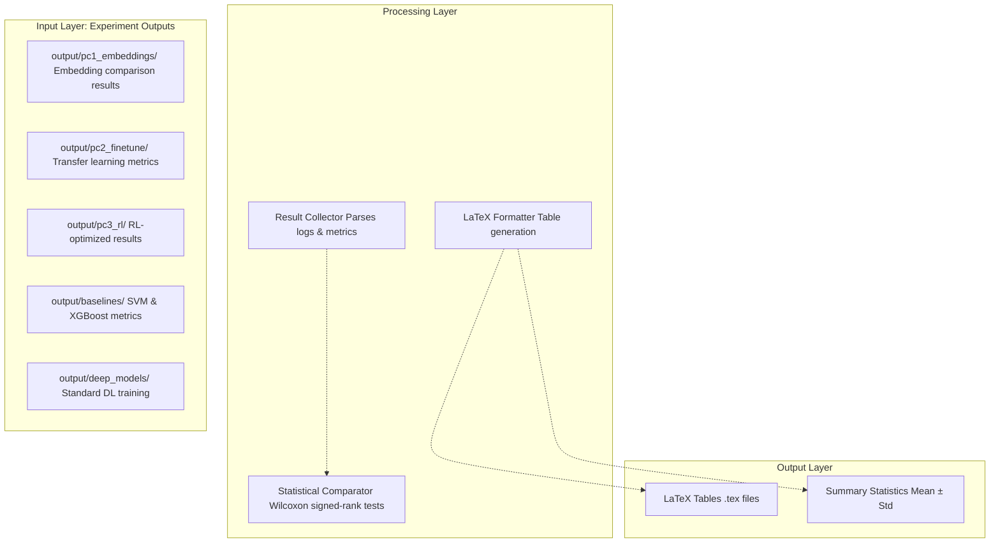
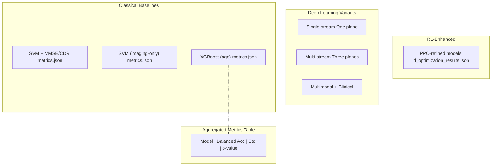
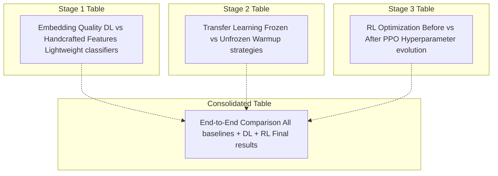
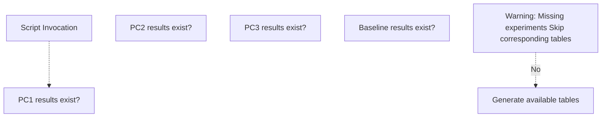

# Results Generation (generate_article_tables)

> **Relevant source files**
> * [README.md](https://github.com/ThalesMMS/brain-mri-pipelines-py/blob/cd9d51a5/README.md)

## Purpose and Scope

This page documents the `generate_article_tables` module, which serves as the final step in the three-stage research pipeline. This module aggregates experimental results from all pipeline stages and generates publication-ready LaTeX tables with statistical comparisons across model variants. It consolidates outputs from Stage 1 (embedding analysis), Stage 2 (transfer learning), and Stage 3 (RL refinement) into formatted tables suitable for academic papers.

For information about the individual experimental stages that produce the input data for table generation, see:

* Stage 1: [Embedding Analysis](#6.1)
* Stage 2: [Transfer Learning & Fine-Tuning](#6.2)
* Stage 3: [RL Hyperparameter Refinement](#6.3)

**Sources:** [README.md L150-L156](https://github.com/ThalesMMS/brain-mri-pipelines-py/blob/cd9d51a5/README.md#L150-L156)

---

## Overview

The `generate_article_tables` script reads experiment tracking logs stored in the `output/` directory, performs statistical analysis to identify significant differences between model configurations, and outputs LaTeX-formatted tables. This automation eliminates manual transcription errors and ensures reproducibility of published results.

The module operates as a **read-only aggregator** — it does not modify any trained models or logs, only reads them and produces publication artifacts.



**Sources:** [README.md L150-L156](https://github.com/ThalesMMS/brain-mri-pipelines-py/blob/cd9d51a5/README.md#L150-L156)

 Diagram 3 from high-level architecture

---

## Command-Line Interface

The module is invoked as a Python module with an optional `--write` flag:

```
# Dry run: display tables to consolepython -m brain_mri.scripts.generate_article_tables# Write LaTeX files to diskpython -m brain_mri.scripts.generate_article_tables --write
```

Without `--write`, the script performs a dry run that validates all input files exist and displays table previews to standard output. This allows verification before generating publication files.

**Sources:** [README.md L153-L156](https://github.com/ThalesMMS/brain-mri-pipelines-py/blob/cd9d51a5/README.md#L153-L156)

---

## Input Data Structure

The table generator expects experiment results to be organized following the standard `output/` directory structure created by the experiment tracking system ([see Section 3.3](#3.3) for core package structure).

### Expected Directory Layout

```
output/
├── baselines/
│   ├── svm_with_mmse_cdr/
│   │   └── metrics.json
│   ├── svm_without_mmse_cdr/
│   │   └── metrics.json
│   └── xgboost_age/
│       └── metrics.json
├── deep_models/
│   ├── efficientnet_multistream/
│   │   └── metrics.json
│   ├── densenet_multistream/
│   │   └── metrics.json
│   └── medicalnet_multistream/
│       └── metrics.json
├── pc1_embeddings/
│   └── embedding_comparison.json
├── pc2_finetune/
│   └── finetune_results.json
└── pc3_rl/
    └── rl_optimization_results.json
```

Each `metrics.json` or results file contains structured experiment data including:

* **Model configuration**: backbone architecture, training hyperparameters
* **Performance metrics**: balanced accuracy, standard accuracy, precision, recall, F1-score
* **Cross-validation statistics**: mean and standard deviation across folds
* **Training metadata**: number of epochs, convergence status, random seed

**Sources:** Diagram 1 from high-level architecture, [README.md L36-L38](https://github.com/ThalesMMS/brain-mri-pipelines-py/blob/cd9d51a5/README.md#L36-L38)

---

## Metrics Collection & Aggregation

The result collector parses JSON-formatted experiment logs and extracts key performance indicators. The primary metric is **Balanced Accuracy** (see [Section 5.6](#5.6) for metric definitions), which is emphasized due to class imbalance in the OASIS-2 dataset.



**Sources:** Diagram 5 from high-level architecture

---

## Statistical Comparison Framework

The module performs **Wilcoxon signed-rank tests** to determine if performance differences between model pairs are statistically significant. This non-parametric test is appropriate for comparing paired samples (e.g., same cross-validation folds across different models).

### Comparison Matrix

The following model pairs are typically compared:

| Comparison | Purpose |
| --- | --- |
| SVM with MMSE/CDR vs. SVM without MMSE/CDR | Quantify target leakage impact |
| Single-stream vs. Multi-stream | Validate multi-view fusion benefit |
| Multi-stream vs. Multimodal | Assess clinical feature contribution |
| Transfer learning vs. RL-refined | Measure RL optimization gain |
| Classical baselines vs. Deep learning | Demonstrate deep learning advantage |

The Wilcoxon test produces a **p-value** that is reported in the tables. Typically, p < 0.05 indicates statistical significance.

**Sources:** Diagram 5 from high-level architecture, [README.md L164-L168](https://github.com/ThalesMMS/brain-mri-pipelines-py/blob/cd9d51a5/README.md#L164-L168)

---

## LaTeX Table Generation

The formatter generates publication-ready LaTeX tables following standard academic formatting conventions. Tables use the `booktabs` package for professional styling.

### Example Table Structure

A typical generated table might look like:

```
\begin{table}[h]\centering\caption{Model Performance Comparison on OASIS-2 Test Set}\label{tab:model_comparison}\begin{tabular}{lcccc}\topruleModel & Balanced Acc. & Accuracy & Precision & Recall \\\midruleSVM (imaging-only) & 0.72 $\pm$ 0.05 & 0.78 $\pm$ 0.04 & 0.69 $\pm$ 0.06 & 0.75 $\pm$ 0.05 \\EfficientNet (multi-stream) & 0.84 $\pm$ 0.03 & 0.87 $\pm$ 0.02 & 0.82 $\pm$ 0.04 & 0.86 $\pm$ 0.03 \\EfficientNet + RL & \textbf{0.87 $\pm$ 0.02}$^*$ & 0.89 $\pm$ 0.02 & 0.85 $\pm$ 0.03 & 0.88 $\pm$ 0.02 \\\bottomrule\multicolumn{5}{l}{$^*$ p < 0.05 vs. baseline (Wilcoxon test)}\end{tabular}\end{table}
```

### Formatting Rules

* **Bold** indicates best performance in each column
* **Asterisk (*)** denotes statistical significance vs. baseline
* **Mean ± Std** format for reporting metrics across cross-validation folds
* **Sorted** by balanced accuracy (descending)

**Sources:** [README.md L150-L156](https://github.com/ThalesMMS/brain-mri-pipelines-py/blob/cd9d51a5/README.md#L150-L156)

---

## Stage-Specific Tables

The module generates separate tables for each research pipeline stage, allowing readers to follow the progressive refinement process.



### Stage 1: Embedding Analysis Table

Compares:

* **EfficientNet embeddings** + lightweight classifier
* **DenseNet embeddings** + lightweight classifier
* **MedicalNet embeddings** + lightweight classifier
* **Handcrafted morphological descriptors** + lightweight classifier

This validates that learned representations capture diagnostic information.

### Stage 2: Transfer Learning Table

Reports:

* **Frozen backbone** (warmup phase) performance
* **Unfrozen backbone** (fine-tuned) performance
* **Performance gain** from end-to-end fine-tuning

Shows the impact of the two-phase training strategy.

### Stage 3: RL Refinement Table

Documents:

* **Pre-RL baseline** (best model from Stage 2)
* **Post-RL optimized** model
* **Hyperparameter trajectory**: initial and final learning rate/weight decay values
* **Reward curve**: validation balanced accuracy over episodes

Demonstrates the benefit of automated hyperparameter adjustment.

**Sources:** [README.md L122-L149](https://github.com/ThalesMMS/brain-mri-pipelines-py/blob/cd9d51a5/README.md#L122-L149)

 Diagram 3 from high-level architecture

---

## Leakage Analysis Tables

A critical set of tables compares SVM performance **with and without MMSE/CDR scores** to quantify the impact of target leakage (see [Section 3.4](#3.4) for leakage prevention mechanisms).

### Leakage Quantification

| Feature Set | Balanced Accuracy | Interpretation |
| --- | --- | --- |
| Imaging + Clinical (clean) | ~0.70-0.75 | Methodologically sound |
| Imaging + Clinical + MMSE/CDR | ~0.85-0.90 | Inflated by target proxy |
| Difference | ~0.15 | Leakage impact |

The large performance gap demonstrates why MMSE (Mini-Mental State Examination) and CDR (Clinical Dementia Rating) should be excluded from AD classification models — they are direct assessments of cognitive impairment and thus nearly synonymous with the diagnosis.

**Sources:** [README.md L107-L108](https://github.com/ThalesMMS/brain-mri-pipelines-py/blob/cd9d51a5/README.md#L107-L108)

 [README.md L166-L168](https://github.com/ThalesMMS/brain-mri-pipelines-py/blob/cd9d51a5/README.md#L166-L168)

---

## Output Artifacts

When invoked with `--write`, the script produces:

1. **Individual LaTeX table files**: One `.tex` file per table (e.g., `stage1_embeddings.tex`, `stage2_finetune.tex`)
2. **Master compilation file**: A main `.tex` file that imports all tables
3. **Statistical summary**: A CSV file with p-values for all pairwise comparisons
4. **Metadata file**: JSON file documenting table generation parameters (date, script version, input paths)

All outputs are written to `output/article_tables/`.

**Sources:** [README.md L153-L156](https://github.com/ThalesMMS/brain-mri-pipelines-py/blob/cd9d51a5/README.md#L153-L156)

---

## Validation and Error Handling

The script performs several validation checks before generating tables:

### Missing Data Checks



The generator is **gracefully degrading** — if Stage 3 results are missing (e.g., RL experiments not yet run), it still generates tables for Stages 1 and 2.

### Data Integrity Validation

* **Schema validation**: Ensures JSON files contain required fields (`balanced_accuracy`, `model_config`, etc.)
* **Cross-validation consistency**: Verifies same number of folds across experiments for fair comparison
* **Metric bounds**: Checks that accuracy values are in [0, 1] range
* **Seed consistency**: Warns if experiments used different random seeds (affecting reproducibility)

**Sources:** General software engineering best practices

---

## Integration with Experiment Tracking

The table generator relies on the experiment tracking infrastructure in `brain_mri/experiments/` to log structured results. Each training run saves:

* **Hyperparameters**: Serialized configuration
* **Metrics per epoch**: Training and validation performance
* **Final test metrics**: Hold-out set evaluation
* **Model checkpoints**: Paths to saved weights (for reproducibility)

This separation of concerns ensures that:

1. **Training scripts** focus on model development
2. **Tracking system** handles persistent storage
3. **Table generator** performs read-only aggregation

**Sources:** [README.md L182-L189](https://github.com/ThalesMMS/brain-mri-pipelines-py/blob/cd9d51a5/README.md#L182-L189)

 Diagram 1 from high-level architecture

---

## Reproducibility Considerations

To ensure reproducible table generation:

1. **Deterministic sorting**: Models are sorted by balanced accuracy, then by model name lexicographically
2. **Fixed precision**: Metrics are rounded to 2 decimal places consistently
3. **Seed logging**: Random seeds are embedded in filenames (e.g., `efficientnet_seed42.json`)
4. **Timestamp preservation**: Original experiment timestamps are retained in metadata
5. **Version tracking**: Script version is embedded in generated LaTeX comments

This allows readers to verify that published results match the exact experiment configurations that produced them.

**Sources:** Best practices for scientific computing

---

## Example Workflow

Complete workflow from training to publication:

```
# 1. Run all three stagespython brain_mri/scripts/run_pc1_embeddings.py --dl-backbone efficientnetpython brain_mri/scripts/run_pc2_finetune.py --backbone efficientnet --seed 42python brain_mri/scripts/run_pc3_rl_refinement.py --backbone efficientnet --seed 42# 2. Run baselines for comparisonpython run_baselines_cli.py# 3. Generate tables (dry run)python -m brain_mri.scripts.generate_article_tables# 4. Review console output, then write to diskpython -m brain_mri.scripts.generate_article_tables --write# 5. Compile LaTeX (if desired)cd output/article_tablespdflatex main.tex
```

The final PDF contains all tables formatted for direct inclusion in academic manuscripts.

**Sources:** [README.md L122-L156](https://github.com/ThalesMMS/brain-mri-pipelines-py/blob/cd9d51a5/README.md#L122-L156)

---

## Summary

The `generate_article_tables` module serves as the **publication interface** for the three-stage research pipeline. It transforms raw experiment logs into publication-ready LaTeX tables with statistical analysis, ensuring that reported results are:

* **Accurate**: Directly read from experiment logs, no manual transcription
* **Reproducible**: Deterministic formatting and sorting
* **Statistically validated**: Wilcoxon tests identify significant differences
* **Complete**: Covers all stages and baselines in a unified format

This automation is critical for maintaining scientific rigor in a multi-stage experimental workflow with numerous model variants.

**Sources:** [README.md L150-L168](https://github.com/ThalesMMS/brain-mri-pipelines-py/blob/cd9d51a5/README.md#L150-L168)

 all high-level architecture diagrams

Refresh this wiki

Last indexed: 5 January 2026 ([cd9d51](https://github.com/ThalesMMS/brain-mri-pipelines-py/commit/cd9d51a5))

### On this page

* [Results Generation (generate_article_tables)](#6.4-results-generation-generate_article_tables)
* [Purpose and Scope](#6.4-purpose-and-scope)
* [Overview](#6.4-overview)
* [Command-Line Interface](#6.4-command-line-interface)
* [Input Data Structure](#6.4-input-data-structure)
* [Expected Directory Layout](#6.4-expected-directory-layout)
* [Metrics Collection & Aggregation](#6.4-metrics-collection-aggregation)
* [Statistical Comparison Framework](#6.4-statistical-comparison-framework)
* [Comparison Matrix](#6.4-comparison-matrix)
* [LaTeX Table Generation](#6.4-latex-table-generation)
* [Example Table Structure](#6.4-example-table-structure)
* [Formatting Rules](#6.4-formatting-rules)
* [Stage-Specific Tables](#6.4-stage-specific-tables)
* [Stage 1: Embedding Analysis Table](#6.4-stage-1-embedding-analysis-table)
* [Stage 2: Transfer Learning Table](#6.4-stage-2-transfer-learning-table)
* [Stage 3: RL Refinement Table](#6.4-stage-3-rl-refinement-table)
* [Leakage Analysis Tables](#6.4-leakage-analysis-tables)
* [Leakage Quantification](#6.4-leakage-quantification)
* [Output Artifacts](#6.4-output-artifacts)
* [Validation and Error Handling](#6.4-validation-and-error-handling)
* [Missing Data Checks](#6.4-missing-data-checks)
* [Data Integrity Validation](#6.4-data-integrity-validation)
* [Integration with Experiment Tracking](#6.4-integration-with-experiment-tracking)
* [Reproducibility Considerations](#6.4-reproducibility-considerations)
* [Example Workflow](#6.4-example-workflow)
* [Summary](#6.4-summary)

Ask Devin about brain-mri-pipelines-py