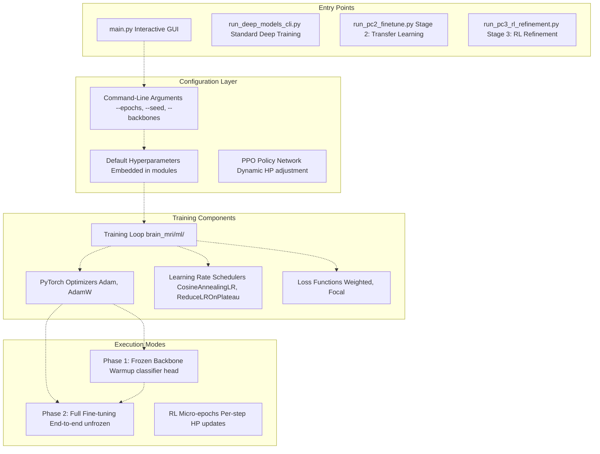
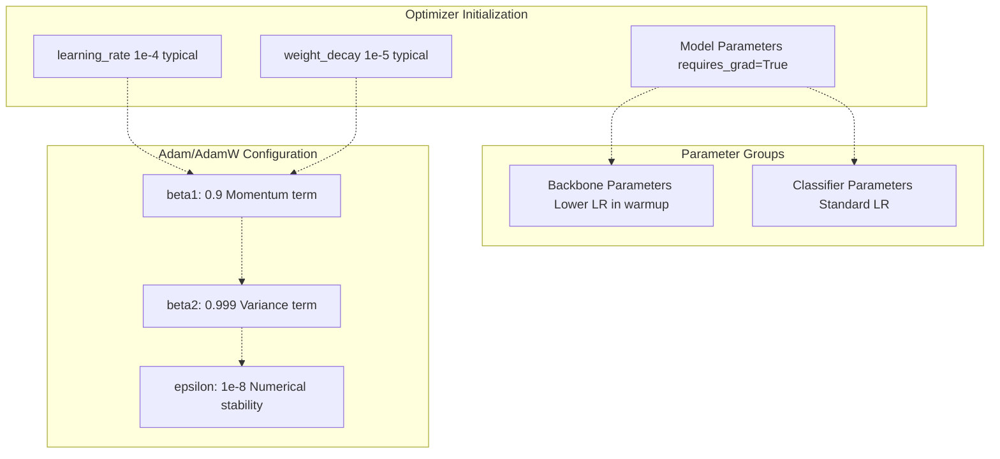
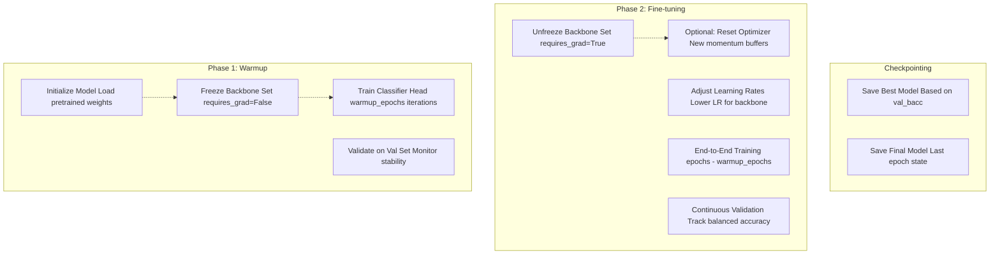
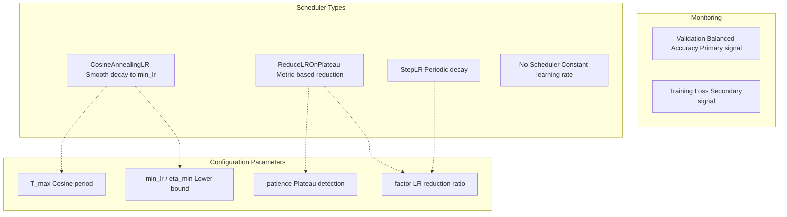
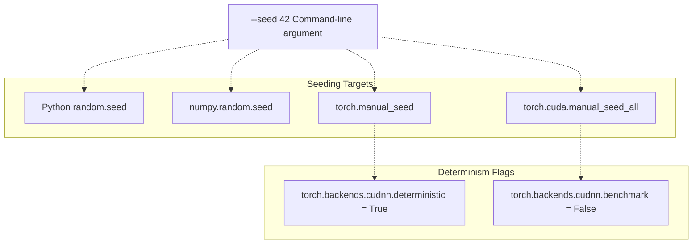
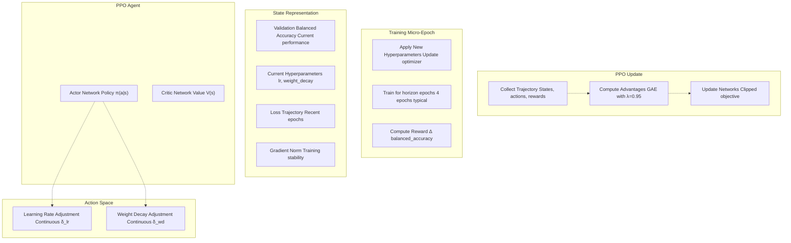

# Training Configuration

> **Relevant source files**
> * [README.md](https://github.com/ThalesMMS/brain-mri-pipelines-py/blob/cd9d51a5/README.md)

## Purpose and Scope

This page documents the training configuration system used throughout the deep learning pipelines in the brain-mri-pipelines-py framework. It covers hyperparameter definitions, optimization strategies, learning rate schedules, and the two-phase warmup/fine-tuning training approach.

For information about the model architectures being trained, see [Deep Learning Backbones](#5.1). For loss function configuration and class imbalance handling, see [Loss Functions & Class Imbalance](#5.5). For evaluation metrics used during training, see [Evaluation Metrics](#5.6).

---

## Configuration Architecture

The training configuration system spans multiple entry points and configuration layers, each serving different use cases from interactive experimentation to reproducible research pipelines.



**Diagram: Training Configuration Flow from Entry Points to Execution**

Sources: [README.md L81-L157](https://github.com/ThalesMMS/brain-mri-pipelines-py/blob/cd9d51a5/README.md#L81-L157)

 [brain_mri/ml/](https://github.com/ThalesMMS/brain-mri-pipelines-py/blob/cd9d51a5/brain_mri/ml/)

 [brain_mri/scripts/](https://github.com/ThalesMMS/brain-mri-pipelines-py/blob/cd9d51a5/brain_mri/scripts/)

---

## Core Hyperparameters

The system uses a standardized set of hyperparameters across all training modes. These parameters control optimization behavior, regularization, and training duration.

### Hyperparameter Reference Table

| Parameter | Type | Default | Description | Configurable Via |
| --- | --- | --- | --- | --- |
| `epochs` | int | 40 | Total training epochs for standard runs | CLI: `--epochs` |
| `warmup_epochs` | int | 2 | Epochs with frozen backbone (Stage 2 only) | CLI: `--warmup-epochs` |
| `batch_size` | int | 16-32 | Samples per training batch | Code defaults |
| `learning_rate` | float | 1e-4 to 1e-3 | Initial learning rate | Code defaults, RL-adjusted |
| `weight_decay` | float | 1e-4 to 1e-5 | L2 regularization strength | Code defaults, RL-adjusted |
| `seed` | int | 42 | Random seed for reproducibility | CLI: `--seed` |
| `backbones` | str | All | Comma-separated backbone list | CLI: `--backbones` |
| `multimodal` | bool | False | Enable clinical feature fusion | CLI: `--multimodal` |
| `episodes` | int | 4 | Number of RL training episodes (Stage 3) | CLI: `--episodes` |
| `horizon` | int | 4 | RL micro-epochs per episode | CLI: `--horizon` |

Sources: [README.md L112-L148](https://github.com/ThalesMMS/brain-mri-pipelines-py/blob/cd9d51a5/README.md#L112-L148)

 [run_deep_models_cli.py](https://github.com/ThalesMMS/brain-mri-pipelines-py/blob/cd9d51a5/run_deep_models_cli.py)

 [brain_mri/scripts/run_pc2_finetune.py](https://github.com/ThalesMMS/brain-mri-pipelines-py/blob/cd9d51a5/brain_mri/scripts/run_pc2_finetune.py)

 [brain_mri/scripts/run_pc3_rl_refinement.py](https://github.com/ThalesMMS/brain-mri-pipelines-py/blob/cd9d51a5/brain_mri/scripts/run_pc3_rl_refinement.py)

---

## Optimization Strategy

### Optimizer Configuration

The framework uses adaptive optimizers from PyTorch's `torch.optim` module. The primary optimizer is **Adam** or **AdamW** (Adam with decoupled weight decay regularization).



**Diagram: Optimizer Configuration Structure**

**Key Implementation Details:**

* **Parameter Groups:** During the warmup phase, the backbone parameters may be excluded from optimization (frozen), while classifier head parameters receive full updates
* **Gradient Clipping:** Applied to prevent exploding gradients in deep networks
* **Mixed Precision:** Support for automatic mixed precision (AMP) training to reduce memory usage and accelerate computation

Sources: [brain_mri/ml/](https://github.com/ThalesMMS/brain-mri-pipelines-py/blob/cd9d51a5/brain_mri/ml/)

---

## Two-Phase Training Approach

The system implements a **two-phase transfer learning strategy** explicitly in Stage 2 of the research pipeline. This approach is designed to stabilize training when using pretrained backbones.



**Diagram: Two-Phase Training Flow in Stage 2 (run_pc2_finetune.py)**

### Phase 1: Warmup (Frozen Backbone)

**Purpose:** Allow the randomly initialized classifier head to adapt to the pretrained feature representations without disrupting the backbone's learned weights.

**Configuration:**

* **Duration:** Controlled by `--warmup-epochs` parameter (default: 2 epochs)
* **Frozen Layers:** All backbone layers in `efficientnet_backbone`, `densenet_backbone`, or `medicalnet_backbone` modules
* **Active Layers:** Only the final classification layers and fusion layers (in multimodal mode)
* **Learning Rate:** Standard rate applied only to active layers

**Rationale:** Prevents the large gradients from an untrained classifier from corrupting pretrained features during early training.

Sources: [README.md L136-L140](https://github.com/ThalesMMS/brain-mri-pipelines-py/blob/cd9d51a5/README.md#L136-L140)

 [brain_mri/scripts/run_pc2_finetune.py](https://github.com/ThalesMMS/brain-mri-pipelines-py/blob/cd9d51a5/brain_mri/scripts/run_pc2_finetune.py)

### Phase 2: Full Fine-tuning (Unfrozen Backbone)

**Purpose:** Adapt the entire model end-to-end to the specific task of Alzheimer's disease detection on OASIS-2 data.

**Configuration:**

* **Duration:** `epochs - warmup_epochs` (e.g., 40 - 2 = 38 epochs for default settings)
* **Unfrozen Layers:** All model parameters, including backbone convolutional layers
* **Learning Rate:** Potentially uses differential learning rates (lower for backbone, higher for head)
* **Regularization:** Full weight decay applied to prevent overfitting

**Transition Behavior:**

* Optimizer state may be reset or preserved depending on implementation
* Learning rate scheduler typically resets to initial values or continues from warmup state
* Best model checkpoint from warmup phase serves as initialization for fine-tuning

Sources: [README.md L136-L140](https://github.com/ThalesMMS/brain-mri-pipelines-py/blob/cd9d51a5/README.md#L136-L140)

 [brain_mri/scripts/run_pc2_finetune.py](https://github.com/ThalesMMS/brain-mri-pipelines-py/blob/cd9d51a5/brain_mri/scripts/run_pc2_finetune.py)

---

## Learning Rate Scheduling

Learning rate schedules control the adjustment of the learning rate throughout training to improve convergence and final performance.

### Supported Schedulers



**Diagram: Learning Rate Scheduler Options and Configuration**

### CosineAnnealingLR

Implements a cosine annealing schedule that smoothly decreases the learning rate from the initial value to a minimum value over a specified number of epochs.

**Formula:**

```
η_t = η_min + (η_max - η_min) × (1 + cos(πt/T_max)) / 2
```

**Usage Pattern:**

* Common in modern deep learning for smooth convergence
* `T_max` typically set to total number of epochs
* `eta_min` (minimum LR) often set to 1e-6 or 1e-7

### ReduceLROnPlateau

Reduces learning rate when a monitored metric (validation balanced accuracy) plateaus.

**Parameters:**

* `mode='max'` for balanced accuracy (higher is better)
* `patience=5-10` epochs to wait before reducing
* `factor=0.5` typical reduction ratio
* `min_lr=1e-7` minimum learning rate floor

**Advantage:** Adapts dynamically to training progress without requiring a fixed schedule.

Sources: [brain_mri/ml/](https://github.com/ThalesMMS/brain-mri-pipelines-py/blob/cd9d51a5/brain_mri/ml/)

---

## Configuration in Different Interfaces

### CLI: Standard Deep Training

The `run_deep_models_cli.py` script provides the primary interface for configuring standard deep learning experiments.

**Example Command:**

```
python run_deep_models_cli.py \    --seed 42 \    --epochs 40 \    --backbones efficientnet,medicalnet,densenet \    --multimodal
```

**Key Arguments:**

* `--seed`: Sets random seed for PyTorch, NumPy, and Python random module
* `--epochs`: Total training epochs
* `--backbones`: Comma-separated list from {`efficientnet`, `densenet`, `medicalnet`}
* `--multimodal`: Flag to enable clinical feature fusion

Sources: [README.md L112-L118](https://github.com/ThalesMMS/brain-mri-pipelines-py/blob/cd9d51a5/README.md#L112-L118)

 [run_deep_models_cli.py](https://github.com/ThalesMMS/brain-mri-pipelines-py/blob/cd9d51a5/run_deep_models_cli.py)

### CLI: Stage 2 Fine-tuning

The `run_pc2_finetune.py` script adds explicit control over the two-phase training process.

**Example Command:**

```
python brain_mri/scripts/run_pc2_finetune.py \    --backbone efficientnet \    --seed 42 \    --epochs 6 \    --warmup-epochs 2
```

**Additional Arguments:**

* `--backbone`: Single backbone selection (required for stage-based experiments)
* `--warmup-epochs`: Number of epochs for frozen backbone warmup
* Validation metrics tracked separately for warmup and fine-tuning phases

Sources: [README.md L136-L140](https://github.com/ThalesMMS/brain-mri-pipelines-py/blob/cd9d51a5/README.md#L136-L140)

 [brain_mri/scripts/run_pc2_finetune.py](https://github.com/ThalesMMS/brain-mri-pipelines-py/blob/cd9d51a5/brain_mri/scripts/run_pc2_finetune.py)

### CLI: Stage 3 RL Refinement

The `run_pc3_rl_refinement.py` script introduces dynamic hyperparameter adjustment using PPO.

**Example Command:**

```
python brain_mri/scripts/run_pc3_rl_refinement.py \    --backbone efficientnet \    --seed 42 \    --episodes 4 \    --horizon 4
```

**RL-Specific Arguments:**

* `--episodes`: Number of PPO training episodes
* `--horizon`: Micro-epochs per episode (granularity of HP updates)
* Learning rate and weight decay become **continuous action spaces** controlled by the PPO agent

**PPO Configuration:**

* **State Space:** Validation metrics, current hyperparameters, training loss trajectory
* **Action Space:** Adjustments to learning rate and weight decay (continuous)
* **Reward Signal:** Validation balanced accuracy improvement

Sources: [README.md L143-L148](https://github.com/ThalesMMS/brain-mri-pipelines-py/blob/cd9d51a5/README.md#L143-L148)

 [brain_mri/scripts/run_pc3_rl_refinement.py](https://github.com/ThalesMMS/brain-mri-pipelines-py/blob/cd9d51a5/brain_mri/scripts/run_pc3_rl_refinement.py)

 [brain_mri/ml/rl_refinement.py](https://github.com/ThalesMMS/brain-mri-pipelines-py/blob/cd9d51a5/brain_mri/ml/rl_refinement.py)

### GUI: Interactive Training

The Tkinter GUI (`main.py`) provides a simplified interface for single-run experiments with visual feedback.

**Configuration Options:**

* Backbone selection via dropdown menu
* Epoch count via numeric input
* Multimodal toggle via checkbox
* Training progress displayed in real-time with loss/accuracy plots

**Limitations:**

* Does not expose warmup phase configuration
* Primarily for exploration and quick experiments
* Full reproducibility requires CLI scripts

Sources: [README.md L83-L96](https://github.com/ThalesMMS/brain-mri-pipelines-py/blob/cd9d51a5/README.md#L83-L96)

 [main.py](https://github.com/ThalesMMS/brain-mri-pipelines-py/blob/cd9d51a5/main.py)

 [brain_mri/ui/](https://github.com/ThalesMMS/brain-mri-pipelines-py/blob/cd9d51a5/brain_mri/ui/)

---

## Training Configuration by Execution Context

Different stages of the research pipeline use distinct training configurations optimized for their specific purposes.

| Execution Context | Typical Epochs | Warmup Epochs | Learning Rate | Key Features |
| --- | --- | --- | --- | --- |
| **GUI Single Run** | 10-20 | N/A | 1e-4 | Interactive, quick feedback |
| **CLI Standard Training** | 40 | N/A | 1e-4 | Reproducible, full convergence |
| **Stage 1: Embeddings** | N/A | N/A | N/A | Uses frozen pretrained features only |
| **Stage 2: Fine-tuning** | 6 | 2 | 1e-4 → 1e-5 | Two-phase explicit warmup |
| **Stage 3: RL Refinement** | 4 episodes × 4 horizon | N/A | PPO-controlled | Dynamic HP adjustment |

Sources: [README.md L122-L157](https://github.com/ThalesMMS/brain-mri-pipelines-py/blob/cd9d51a5/README.md#L122-L157)

 [brain_mri/scripts/](https://github.com/ThalesMMS/brain-mri-pipelines-py/blob/cd9d51a5/brain_mri/scripts/)

---

## Reproducibility Mechanisms

### Random Seed Control

**Seeding Operations:**



**Diagram: Random Seed Propagation for Reproducibility**

**Implementation Notes:**

* All random operations (data splitting, augmentation, weight initialization, dropout) controlled by seed
* Subject-level splitting uses deterministic subject ordering before applying seed-based shuffle
* Same seed guarantees identical train/val/test splits and training trajectories

Sources: [brain_mri/ml/](https://github.com/ThalesMMS/brain-mri-pipelines-py/blob/cd9d51a5/brain_mri/ml/)

### Checkpoint Management

**Saved Artifacts:**

* **Best Model:** Model state dict with highest validation balanced accuracy
* **Final Model:** Model state dict from last epoch
* **Optimizer State:** For resuming training (not typically used across stages)
* **Training History:** JSON logs with per-epoch metrics

**Checkpoint Location:**

```
output/
├── models/
│   ├── best_model_efficientnet_seed42.pth
│   └── final_model_efficientnet_seed42.pth
├── logs/
│   └── training_log_efficientnet_seed42.json
└── plots/
    └── training_curves_efficientnet_seed42.png
```

Sources: [README.md L37-L38](https://github.com/ThalesMMS/brain-mri-pipelines-py/blob/cd9d51a5/README.md#L37-L38)

 [brain_mri/experiments/](https://github.com/ThalesMMS/brain-mri-pipelines-py/blob/cd9d51a5/brain_mri/experiments/)

---

## Integration with Other Components

### Connection to Loss Functions

Training configuration directly influences loss function behavior through hyperparameter settings:

**Class Weights:** Derived from training set class distribution, applied in loss computation. See [Loss Functions & Class Imbalance](#5.5) for details on class-weighted and focal loss variants.

**Loss Scaling:** Focal loss gamma parameter (typically 2.0) controls focus on hard examples. May be tuned as part of configuration.

### Connection to Evaluation Metrics

**Validation Monitoring:** The primary training loop evaluates balanced accuracy on the validation set after each epoch. This metric determines:

* Best model checkpoint selection
* Learning rate plateau detection
* Early stopping triggers (if implemented)
* RL reward signal in Stage 3

See [Evaluation Metrics](#5.6) for details on balanced accuracy computation and statistical testing.

### Connection to Backbone Architectures

Training configuration varies by backbone choice:

**EfficientNet-B0:**

* Smaller model, faster training
* Higher learning rate acceptable (1e-4)
* Less prone to overfitting

**DenseNet121:**

* Dense connections increase memory usage
* May require lower learning rate (5e-5)
* Longer warmup beneficial

**MedicalNet ResNet:**

* Pretrained on medical data (domain-aligned)
* Often converges faster than ImageNet backbones
* May use shorter warmup period

See [Deep Learning Backbones](#5.1) and [MedicalNet Integration & 3D→2D Conversion](#5.2) for architectural details.

Sources: [README.md L10-L12](https://github.com/ThalesMMS/brain-mri-pipelines-py/blob/cd9d51a5/README.md#L10-L12)

 [brain_mri/ml/medicalnet_models.py](https://github.com/ThalesMMS/brain-mri-pipelines-py/blob/cd9d51a5/brain_mri/ml/medicalnet_models.py)

 [brain_mri/ml/multistream_models.py](https://github.com/ThalesMMS/brain-mri-pipelines-py/blob/cd9d51a5/brain_mri/ml/multistream_models.py)

---

## Advanced: RL Hyperparameter Refinement Details

The Stage 3 RL refinement system represents a novel approach to hyperparameter optimization that goes beyond traditional grid search or Bayesian optimization.



**Diagram: PPO-Based Hyperparameter Refinement Loop (Stage 3)**

### PPO Algorithm Details

**Proximal Policy Optimization Configuration:**

* **Clip Ratio:** ε = 0.2 (standard PPO clipping)
* **GAE Lambda:** λ = 0.95 for advantage estimation
* **Entropy Coefficient:** Encourages exploration of hyperparameter space
* **Value Loss Coefficient:** Balances policy and value updates

**Action Bounds:**

* Learning rate: [1e-6, 1e-3] with log-scale discretization
* Weight decay: [0, 1e-3] linear scale
* Actions applied as multiplicative factors to current values

**Reward Shaping:**

* Primary: Improvement in validation balanced accuracy
* Penalty: Large hyperparameter jumps (smoothness constraint)
* Bonus: Maintaining training stability (no gradient explosions)

Sources: [README.md L17-L18](https://github.com/ThalesMMS/brain-mri-pipelines-py/blob/cd9d51a5/README.md#L17-L18)

 [README.md L143-L148](https://github.com/ThalesMMS/brain-mri-pipelines-py/blob/cd9d51a5/README.md#L143-L148)

 [brain_mri/ml/rl_refinement.py](https://github.com/ThalesMMS/brain-mri-pipelines-py/blob/cd9d51a5/brain_mri/ml/rl_refinement.py)

---

## Configuration File Reference

While the system primarily uses command-line arguments, configuration can also be specified programmatically when using the framework as a library.

### Programmatic Configuration Example Pattern

**Expected Code Pattern:**

```css
# Location: brain_mri/ml/# Configuration dictionary structuretraining_config = {    'epochs': 40,    'batch_size': 32,    'learning_rate': 1e-4,    'weight_decay': 1e-5,    'optimizer': 'adam',    'scheduler': 'cosine',    'warmup_epochs': 0,  # 0 disables warmup phase    'gradient_clip': 1.0,    'mixed_precision': True}
```

**Usage Context:** This pattern would be used internally by CLI scripts to pass configuration to training loop implementations.

Sources: [brain_mri/ml/](https://github.com/ThalesMMS/brain-mri-pipelines-py/blob/cd9d51a5/brain_mri/ml/)

---

## Summary

The training configuration system provides flexibility across multiple execution contexts while maintaining reproducibility through careful seed management and checkpoint saving. Key configuration dimensions include:

1. **Temporal:** Epoch count, warmup phases, RL episodes/horizons
2. **Optimization:** Learning rates, weight decay, optimizer choice, schedulers
3. **Architecture:** Backbone selection, multimodal fusion toggle
4. **Regularization:** Weight decay, dropout (architecture-dependent), data augmentation
5. **Advanced:** PPO-based dynamic hyperparameter adjustment

The two-phase warmup/fine-tuning approach in Stage 2 and the RL refinement in Stage 3 represent progressive sophistication in training strategies, building on standard supervised learning in Stage 1 and CLI-based training.

Sources: [README.md L81-L157](https://github.com/ThalesMMS/brain-mri-pipelines-py/blob/cd9d51a5/README.md#L81-L157)

 [brain_mri/ml/](https://github.com/ThalesMMS/brain-mri-pipelines-py/blob/cd9d51a5/brain_mri/ml/)

 [brain_mri/scripts/](https://github.com/ThalesMMS/brain-mri-pipelines-py/blob/cd9d51a5/brain_mri/scripts/)

Refresh this wiki

Last indexed: 5 January 2026 ([cd9d51](https://github.com/ThalesMMS/brain-mri-pipelines-py/commit/cd9d51a5))

### On this page

* [Training Configuration](#5.4-training-configuration)
* [Purpose and Scope](#5.4-purpose-and-scope)
* [Configuration Architecture](#5.4-configuration-architecture)
* [Core Hyperparameters](#5.4-core-hyperparameters)
* [Hyperparameter Reference Table](#5.4-hyperparameter-reference-table)
* [Optimization Strategy](#5.4-optimization-strategy)
* [Optimizer Configuration](#5.4-optimizer-configuration)
* [Two-Phase Training Approach](#5.4-two-phase-training-approach)
* [Phase 1: Warmup (Frozen Backbone)](#5.4-phase-1-warmup-frozen-backbone)
* [Phase 2: Full Fine-tuning (Unfrozen Backbone)](#5.4-phase-2-full-fine-tuning-unfrozen-backbone)
* [Learning Rate Scheduling](#5.4-learning-rate-scheduling)
* [Supported Schedulers](#5.4-supported-schedulers)
* [CosineAnnealingLR](#5.4-cosineannealinglr)
* [ReduceLROnPlateau](#5.4-reducelronplateau)
* [Configuration in Different Interfaces](#5.4-configuration-in-different-interfaces)
* [CLI: Standard Deep Training](#5.4-cli-standard-deep-training)
* [CLI: Stage 2 Fine-tuning](#5.4-cli-stage-2-fine-tuning)
* [CLI: Stage 3 RL Refinement](#5.4-cli-stage-3-rl-refinement)
* [GUI: Interactive Training](#5.4-gui-interactive-training)
* [Training Configuration by Execution Context](#5.4-training-configuration-by-execution-context)
* [Reproducibility Mechanisms](#5.4-reproducibility-mechanisms)
* [Random Seed Control](#5.4-random-seed-control)
* [Checkpoint Management](#5.4-checkpoint-management)
* [Integration with Other Components](#5.4-integration-with-other-components)
* [Connection to Loss Functions](#5.4-connection-to-loss-functions)
* [Connection to Evaluation Metrics](#5.4-connection-to-evaluation-metrics)
* [Connection to Backbone Architectures](#5.4-connection-to-backbone-architectures)
* [Advanced: RL Hyperparameter Refinement Details](#5.4-advanced-rl-hyperparameter-refinement-details)
* [PPO Algorithm Details](#5.4-ppo-algorithm-details)
* [Configuration File Reference](#5.4-configuration-file-reference)
* [Programmatic Configuration Example Pattern](#5.4-programmatic-configuration-example-pattern)
* [Summary](#5.4-summary)

Ask Devin about brain-mri-pipelines-py