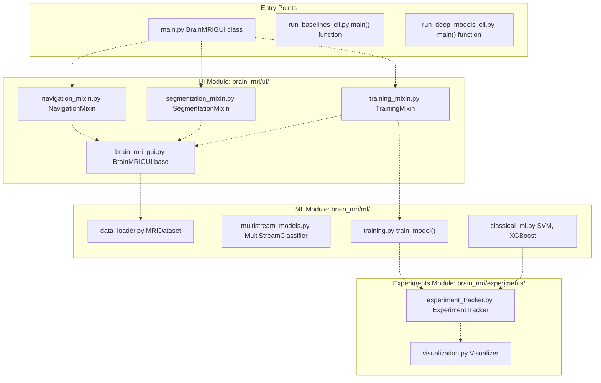
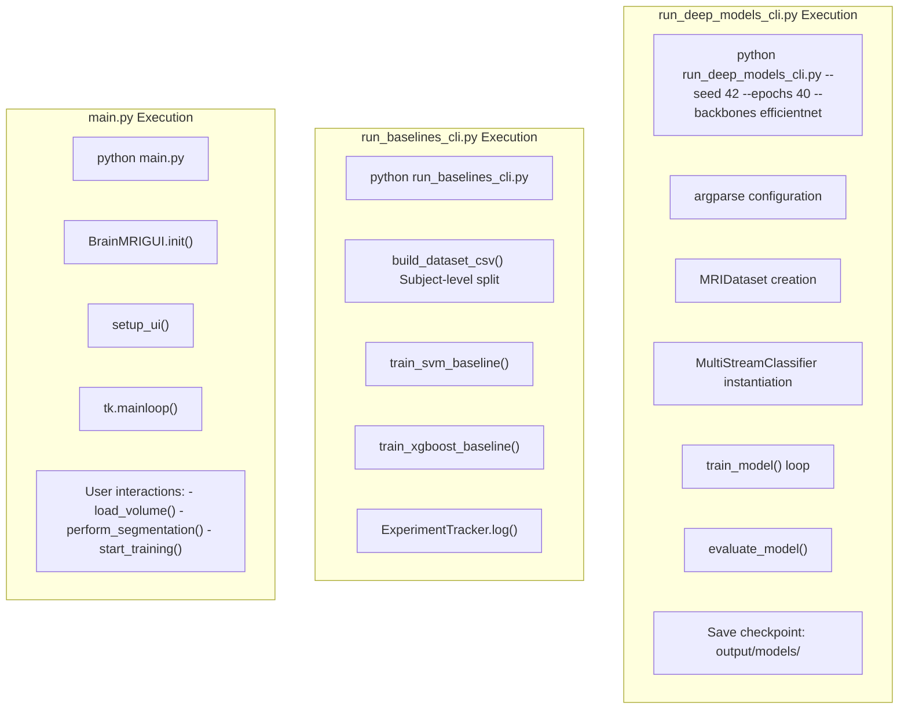

# User Interfaces

> **Relevant source files**
> * [README.md](https://github.com/ThalesMMS/brain-mri-pipelines-py/blob/cd9d51a5/README.md)

## Purpose and Scope

This document provides an overview of the three user-facing interfaces for interacting with the brain-mri-pipelines-py system. The codebase offers multiple access patterns to accommodate different use cases: an interactive graphical interface for data exploration and prototyping, and two command-line interfaces for reproducible headless execution of experiments.

This page introduces the architecture and interaction patterns common to all interfaces. For detailed usage instructions and specific capabilities of each interface, see:

* [Graphical User Interface (main.py)](7a%20Git-Configuration.md)
* [Baselines CLI (run_baselines_cli.py)](7b%20Output-Directory-Structure.md)
* [Deep Models CLI (run_deep_models_cli.py)](7c%20License-&-Usage-Terms.md)

For information about the underlying model architectures and training procedures accessed through these interfaces, see [Models & Training](5%20Models-&-Training.md).

**Sources:** README.md

---

## Interface Comparison Matrix

The system provides three distinct entry points, each optimized for different workflows:

| Interface | Entry Point | Primary Use Case | Interactive | Reproducibility | Parallelization |
| --- | --- | --- | --- | --- | --- |
| **GUI** | `main.py` | Data exploration, visual segmentation, quick prototyping | Yes | Low | No |
| **Baselines CLI** | `run_baselines_cli.py` | Classical ML training (SVM, XGBoost), dataset generation | No | High | Compatible |
| **Deep Models CLI** | `run_deep_models_cli.py` | Deep learning training, multi-backbone experiments | No | High | Compatible |

**Key Differences:**

* **GUI** requires Tkinter and operates on the `axl/` directory only. It provides real-time slice navigation and region-growing segmentation tools.
* **Baselines CLI** generates the subject-aware split CSV file and trains classical models in both leakage and clean scenarios.
* **Deep Models CLI** supports all three anatomical planes (`axl/`, `cor/`, `sag/`) and provides extensive hyperparameter configuration.

**Sources:** README.md

---

## User Interface Layer Architecture



**Diagram: Entry Points and Module Dependencies**

This diagram illustrates how the three entry points connect to the underlying system modules:

* **`main.py`** instantiates the `BrainMRIGUI` class, which inherits from three mixin classes (`NavigationMixin`, `SegmentationMixin`, `TrainingMixin`) that provide specialized functionality for different GUI panels.
* **`run_baselines_cli.py`** directly invokes classical ML functions from `brain_mri/ml/classical_ml.py` and dataset utilities from `brain_mri/ml/data_loader.py`.
* **`run_deep_models_cli.py`** orchestrates deep learning training by calling `train_model()` from `brain_mri/ml/training.py`, which in turn uses `MultiStreamClassifier` from `brain_mri/ml/multistream_models.py`.

All three interfaces converge on the `ExperimentTracker` for logging results and generating visualizations.

**Sources:** [Project overview and setup](https://github.com/ThalesMMS/brain-mri-pipelines-py/blob/cd9d51a5/README.md#L179-L196)

 README.md

---

## Execution Flow from Entry Points



**Diagram: Command Flow Through Entry Points**

This diagram maps the execution sequence for each interface:

* **GUI flow** follows the event-driven Tkinter paradigm: initialization sets up the UI components, then `mainloop()` handles user events asynchronously.
* **Baselines CLI flow** is linear: first builds the subject-aware split CSV using `build_dataset_csv()`, then trains SVM and XGBoost models sequentially.
* **Deep Models CLI flow** parses command-line arguments, creates dataset and model instances, executes the training loop, evaluates on the test set, and persists checkpoints.

**Sources:** README.md

---

## Common Interface Patterns

All three interfaces share the following underlying mechanisms:

### Subject-Level Data Splitting

Regardless of the interface used, the system enforces **subject-level splitting** to prevent data leakage. This is implemented in `brain_mri/ml/data_loader.py` and ensures that all MRI scans from a single patient (identified by `Subject_ID` extracted from the `OAS2_XXXX_MRY_plane.nii.gz` filename pattern) remain strictly within one partition (Train, Validation, or Test).

For details on the splitting mechanism, see [Subject-Level Splitting & Leakage Prevention](3d%20Subject-Level-Splitting-&-Leakage-Prevention.md).

### Experiment Tracking

All interfaces utilize the `ExperimentTracker` class from `brain_mri/experiments/experiment_tracker.py` to log:

* Training and validation metrics (loss, accuracy, balanced accuracy)
* Model hyperparameters and configuration
* Timestamp and random seed for reproducibility
* Output artifacts (plots, confusion matrices, ROC curves)

Results are persisted to the `output/` directory in a structured format.

### Configuration Sources

| Interface | Configuration Method | Flexibility | Reproducibility |
| --- | --- | --- | --- |
| **GUI** | Interactive widgets (dropdowns, sliders) | High (real-time changes) | Low (manual recording) |
| **Baselines CLI** | Hardcoded in script | Low | High (version controlled) |
| **Deep Models CLI** | Command-line arguments (`argparse`) | Medium (runtime flags) | High (command logged) |

The CLIs are recommended for production experiments requiring reproducibility, while the GUI is suited for exploratory analysis and visualization.

**Sources:** [README.md L23](https://github.com/ThalesMMS/brain-mri-pipelines-py/blob/cd9d51a5/README.md#L23-L23)

 README.md

---

## Interface Selection Guide

### Use the GUI (main.py) when:

* Exploring the OASIS-2 dataset for the first time
* Performing visual quality control (marking non-viable studies)
* Conducting semi-automatic ventricle segmentation via region growing
* Prototyping model architectures with immediate visual feedback
* Presenting or demonstrating the system to non-technical stakeholders

**Limitations:**

* Only processes `axl/` (axial) images
* Single-threaded execution (no parallel training)
* Requires X11/display server (not suitable for remote servers)
* Manual configuration not automatically logged

### Use the Baselines CLI (run_baselines_cli.py) when:

* Generating the initial subject-aware split CSV file
* Establishing classical ML baselines (SVM, XGBoost) for comparison
* Analyzing the impact of MMSE/CDR target proxy leakage
* Running experiments on headless compute nodes
* Reproducing baseline results from the research pipeline

**Outputs:**

* `output/dataset_split.csv`: Subject-level train/val/test assignments
* Model performance metrics logged to `ExperimentTracker`
* Automatically handles both leakage and clean scenarios

### Use the Deep Models CLI (run_deep_models_cli.py) when:

* Training deep learning models on all three anatomical planes
* Conducting hyperparameter sweeps (learning rate, weight decay, batch size)
* Comparing multiple backbones (EfficientNet, DenseNet, MedicalNet)
* Enabling multimodal fusion (images + clinical features)
* Running long-duration training jobs with checkpointing
* Integrating with job schedulers (SLURM, PBS) on HPC clusters

**Advanced Capabilities:**

* Supports `--multimodal` flag for clinical feature fusion
* `--backbones` argument accepts comma-separated list for multi-model training
* Configurable early stopping and learning rate scheduling
* Automatic GPU detection and mixed-precision training (if available)

**Sources:** README.md

 README.md

---

## System Requirements by Interface

| Component | GUI | Baselines CLI | Deep Models CLI |
| --- | --- | --- | --- |
| **Python Version** | 3.11+ | 3.11+ | 3.11+ |
| **Tkinter** | Required | Not required | Not required |
| **Display Server** | Required (X11 on Linux) | Not required | Not required |
| **GPU** | Optional | Optional | Recommended |
| **Data Directories** | `axl/` only | `axl/` + `oasis_longitudinal_demographic.csv` | `axl/`, `cor/`, `sag/` + CSV |
| **Minimum RAM** | 4 GB | 8 GB | 16 GB (32 GB for multimodal) |

**Installation Note:** On Linux systems, Tkinter must be installed separately:

```
sudo apt-get install python3-tk
```

On macOS with Homebrew:

```
brew install python-tk@3.11
```

**Sources:** README.md

---

## Output Directory Structure

All three interfaces write to the `output/` directory, which is automatically created if it does not exist. The structure is standardized:

```markdown
output/
├── models/                    # Saved model checkpoints (.pth files)
├── logs/                      # Training logs and metrics (.json files)
├── plots/                     # Visualizations (confusion matrices, ROC curves)
├── segmentations/             # GUI-generated segmentation masks (.npy files)
└── dataset_split.csv          # Subject-level train/val/test assignments
```

The `dataset_split.csv` file is created by `run_baselines_cli.py` and consumed by all subsequent training runs to ensure consistent data partitioning.

For details on the output directory organization, see [Output Directory Structure](8b%20Dataset-Coverage.md).

**Sources:** [README.md L27-L38](https://github.com/ThalesMMS/brain-mri-pipelines-py/blob/cd9d51a5/README.md#L27-L38)

---

## Interface Invocation Examples

### GUI Quick Start

```
# Launch interactive interface (requires X11)python main.py
```

### Baselines CLI Quick Start

```
# Generate dataset split and train classical baselinespython run_baselines_cli.py
```

### Deep Models CLI Quick Start

```
# Standard training with single backbonepython run_deep_models_cli.py --seed 42 --epochs 40 --backbones efficientnet# Multi-backbone trainingpython run_deep_models_cli.py --seed 42 --epochs 40 --backbones efficientnet,medicalnet,densenet# Multimodal training (images + clinical features)python run_deep_models_cli.py --seed 42 --epochs 40 --backbones efficientnet --multimodal# Full configuration examplepython run_deep_models_cli.py \    --seed 42 \    --epochs 50 \    --batch-size 16 \    --lr 0.0001 \    --weight-decay 0.01 \    --backbones efficientnet,densenet \    --multimodal \    --early-stopping \    --patience 10
```

**Note:** For advanced research pipeline stages (embedding analysis, fine-tuning, RL refinement), use the scripts in `brain_mri/scripts/`. See [Three-Stage Research Pipeline](6%20User-Interfaces.md) for details.

**Sources:** README.md

 **Sources**: [Project overview and setup](https://github.com/ThalesMMS/brain-mri-pipelines-py/blob/cd9d51a5/README.md#L122-L156)


### On this page

* [User Interfaces](7%20Development-&-Configuration.md)
* [Purpose and Scope](7%20Development-&-Configuration.md)
* [Interface Comparison Matrix](7%20Development-&-Configuration.md)
* [User Interface Layer Architecture](7%20Development-&-Configuration.md)
* [Execution Flow from Entry Points](7%20Development-&-Configuration.md)
* [Common Interface Patterns](7%20Development-&-Configuration.md)
* [Subject-Level Data Splitting](7%20Development-&-Configuration.md)
* [Experiment Tracking](7%20Development-&-Configuration.md)
* [Configuration Sources](7%20Development-&-Configuration.md)
* [Interface Selection Guide](7%20Development-&-Configuration.md)
* [Use the GUI ( main.py ) when:](7%20Development-&-Configuration.md)
* [Use the Baselines CLI ( run_baselines_cli.py ) when:](7%20Development-&-Configuration.md)
* [Use the Deep Models CLI ( run_deep_models_cli.py ) when:](7%20Development-&-Configuration.md)
* [System Requirements by Interface](7%20Development-&-Configuration.md)
* [Output Directory Structure](7%20Development-&-Configuration.md)
* [Interface Invocation Examples](7%20Development-&-Configuration.md)
* [GUI Quick Start](7%20Development-&-Configuration.md)
* [Baselines CLI Quick Start](7%20Development-&-Configuration.md)
* [Deep Models CLI Quick Start](7%20Development-&-Configuration.md)

Ask Devin about brain-mri-pipelines-py