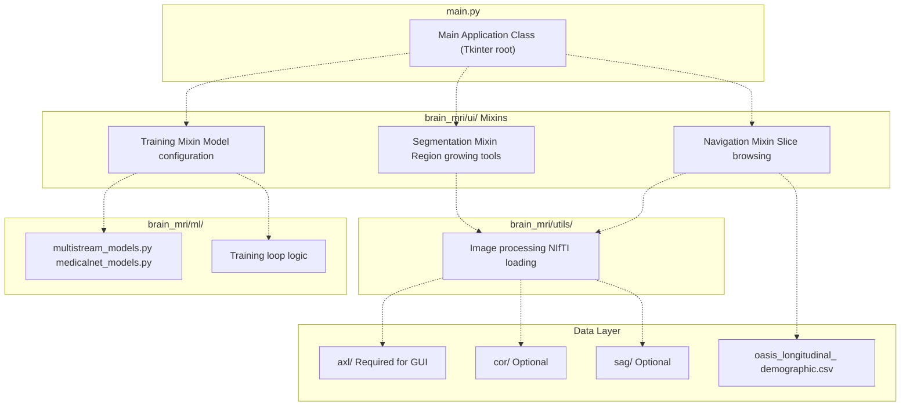
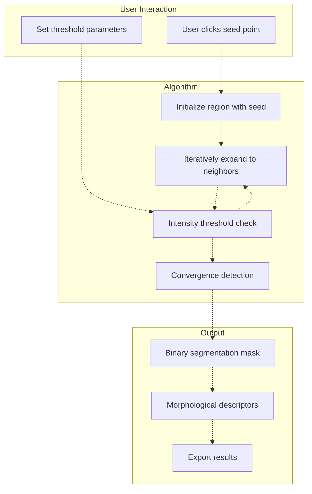
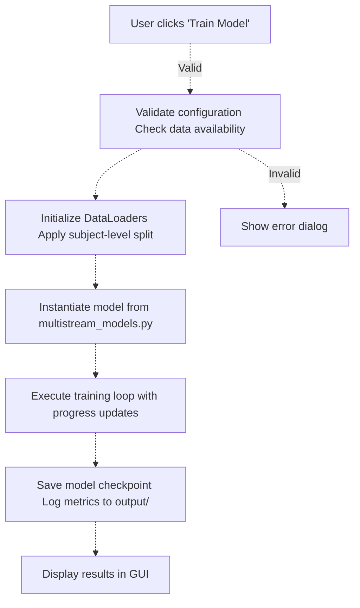
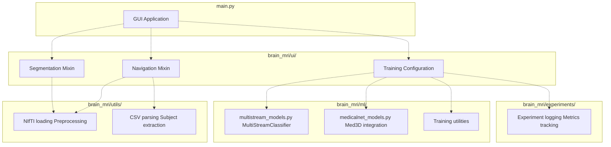

# Graphical User Interface (main.py)

> **Relevant source files**
> * [README.md](https://github.com/ThalesMMS/brain-mri-pipelines-py/blob/cd9d51a5/README.md)

## Purpose & Scope

This page documents the Tkinter-based graphical user interface (GUI) provided by `main.py`, which serves as an interactive entry point for data exploration, visualization, and single-run training experiments. The GUI is designed for researchers who need to visually inspect MRI data, perform semi-automatic segmentation, and quickly prototype model configurations before committing to full-scale headless training runs.

For automated, reproducible training workflows, see [Baselines CLI](7b%20Output-Directory-Structure.md) and [Deep Models CLI](7c%20License-&-Usage-Terms.md). For the underlying UI component implementations, see [Core Package Structure](3c%20Core-Package-Structure-%28brain_mri-%29.md).

**Sources:** README.md

---

## Overview

The GUI application is the primary interactive interface for the brain-mri-pipelines-py framework. It provides a visual workspace for navigating the OASIS-2 dataset, performing exploratory analysis, and configuring training experiments without requiring command-line arguments or configuration files.

### Key Capabilities

| Feature Category | Capabilities |
| --- | --- |
| **Data Navigation** | Browse MRI volumes slice-by-slice, mark non-viable studies, view patient metadata |
| **Segmentation Tools** | Semi-automatic region-growing algorithm for ventricle segmentation, morphological descriptor extraction |
| **Model Training** | Configure deep learning experiments, select backbones, adjust hyperparameters, launch single training runs |
| **Visualization** | Real-time slice rendering, segmentation overlay, basic image processing |

**Sources:** README.md

---

## Application Architecture

The GUI follows a modular mixin-based architecture, where specialized UI components from `brain_mri/ui/` are composed into the main application class.



**Diagram: GUI Component Architecture**

The main application inherits behavior from multiple UI mixins, each responsible for a distinct functional domain. This separation allows for modular development and testing of individual features.

**Sources:** [Project overview and setup](https://github.com/ThalesMMS/brain-mri-pipelines-py/blob/cd9d51a5/README.md#L182-L183)

---

## Launching the Application

### Prerequisites

Before launching the GUI, ensure:

1. **Tkinter is installed** on your system: * **Linux:** `sudo apt-get install python3-tk` * **macOS:** `brew install python-tk@3.11` * **Windows:** Typically bundled with Python
2. **Data is organized** with at minimum the `axl/` directory present in the repository root (see [Directory Organization](4c%20Directory-Organization-&-File-Naming.md))
3. **Dependencies are installed** via `pip install -r requirements.txt`

### Starting the GUI

```
python main.py
```

This launches the Tkinter application window with the full feature set enabled.

**Sources:** README.md

 README.md

---

## Navigation Features

The navigation system allows researchers to browse through the MRI dataset, inspect individual volumes, and manage data quality annotations.

### Dataset Browser

The GUI provides controls for:

* **Subject Selection:** Dropdown or list widget to choose from available `OAS2_XXXX` subjects
* **MRI ID Selection:** For subjects with longitudinal scans (e.g., `MR1`, `MR2`), select specific timepoints
* **Plane Selection:** Switch between axial, coronal, and sagittal views (if available)
* **Slice Navigation:** Scroll through the 3D volume slice-by-slice

### Data Quality Management

Users can mark studies as **non-viable** for exclusion from training datasets. This is useful for identifying:

* Motion artifacts
* Acquisition errors
* Incomplete scans
* Other quality issues

**Sources:** README.md

---

## Segmentation Tools

The GUI implements a semi-automatic segmentation workflow based on **region-growing** algorithms, specifically designed for ventricle segmentation in brain MRI.

### Region-Growing Algorithm



**Diagram: Segmentation Workflow**

### Morphological Descriptor Extraction

After segmentation, the GUI computes geometric features from the ventricle regions:

* **Volume:** Total voxel count
* **Surface area:** Boundary extent
* **Shape metrics:** Circularity, elongation
* **Position:** Centroid coordinates

These descriptors feed into classical baseline models (see [Classical Machine Learning Baselines](5c%20Stage-3-RL-Hyperparameter-Refinement-%28run_pc3_rl_refinement.py%29.md)).

**Sources:** README.md

---

## Model Training Configuration

The sidebar training panel provides a graphical interface for configuring and launching deep learning experiments.

### Training Configuration Panel

The GUI exposes the following configuration options:

| Parameter | Options | Description |
| --- | --- | --- |
| **Backbone** | `efficientnet`, `densenet`, `medicalnet` | Deep learning architecture (see [Deep Learning Backbones](5a%20Stage-1-Embedding-Analysis-%28run_pc1_embeddings.py%29.md)) |
| **Planes** | `axl`, `cor`, `sag` (multi-select) | Which anatomical views to use |
| **Multimodal** | Checkbox | Enable fusion with clinical features |
| **Epochs** | Integer input | Training duration |
| **Batch Size** | Integer input | Samples per batch |
| **Learning Rate** | Float input | Initial optimizer learning rate |
| **Seed** | Integer input | Random seed for reproducibility |

### Execution Flow

When the user initiates training via the GUI:



**Diagram: GUI Training Execution Flow**

The training process runs in the main thread with periodic UI updates to display progress. For long-running experiments, the CLI interfaces are recommended.

**Sources:** README.md

---

## Integration with Core Package

The GUI serves as a lightweight orchestrator that delegates specialized tasks to the core `brain_mri/` package modules.

### Module Dependencies



**Diagram: GUI Integration with brain_mri Package**

This architecture ensures that the GUI remains a thin presentation layer, with all business logic residing in testable, reusable modules.

**Sources:** [Project overview and setup](https://github.com/ThalesMMS/brain-mri-pipelines-py/blob/cd9d51a5/README.md#L180-L196)

---

## Data Requirements

The GUI has specific data directory requirements that differ slightly from the CLI interfaces.

### Required Directory

The **`axl/` directory is mandatory** for GUI operation. The application uses axial slices as the default view for navigation and visualization.

### Optional Directories

If `cor/` and `sag/` directories are present, the GUI enables multi-plane viewing and multi-stream model training. Without these directories, only single-stream models using axial data can be trained.

### File Format Support

While the deep learning pipelines require NIfTI format (`.nii` or `.nii.gz`), the GUI may support additional formats for visualization:

* `.png`
* `.jpg`

All files must follow the naming convention: `OAS2_XXXX_MRY_plane.ext`

**Sources:** README.md

---

## Comparison with CLI Interfaces

The GUI and CLI interfaces serve complementary purposes in the workflow:

| Aspect | GUI (`main.py`) | Baselines CLI | Deep Models CLI |
| --- | --- | --- | --- |
| **Use Case** | Exploration, prototyping, visualization | Classical ML experiments | Full-scale deep learning |
| **Reproducibility** | Single-run, interactive | Fully scriptable | Fully scriptable |
| **Configuration** | Point-and-click | Command-line arguments | Command-line arguments |
| **Progress Tracking** | Real-time UI updates | Console output | Console output + logs |
| **Batch Experiments** | Not supported | Supported | Supported |
| **Segmentation** | Interactive region-growing | N/A | N/A |
| **Typical Duration** | Minutes (quick experiments) | Hours (SVM/XGBoost) | Hours to days (deep learning) |

### Recommended Workflow

1. **Use GUI for:** Initial data exploration, quality assessment, segmentation tasks, hyperparameter prototyping
2. **Use CLI for:** Final experiments, hyperparameter sweeps, multi-seed runs, automated pipelines

**Sources:** README.md

---

## Limitations & Considerations

### Single-Threading

The GUI runs training in the main thread, which means the interface becomes unresponsive during model training. For experiments longer than a few minutes, use the CLI interfaces instead.

### Limited Batch Operations

Unlike the CLI, the GUI does not support:

* Multi-seed runs
* Cross-validation folds
* Hyperparameter grid search
* Automatic result aggregation

### Memory Constraints

Loading and displaying large MRI volumes in the GUI can consume significant memory. The application loads entire volumes into memory for smooth slice navigation.

### Platform Dependencies

Tkinter behavior and appearance vary across operating systems. The GUI has been tested on:

* Ubuntu 20.04+ with `python3-tk`
* macOS 11+ with `python-tk@3.11`
* Windows 10+ with bundled Tkinter

**Sources:** README.md

---

## Technical Implementation Notes

### Mixin-Based Architecture

The GUI leverages Python's multiple inheritance to compose functionality from specialized mixins located in `brain_mri/ui/`. This design pattern allows:

* **Separation of Concerns:** Each mixin handles one domain (navigation, segmentation, training)
* **Reusability:** Mixins can be tested independently
* **Extensibility:** New features can be added as additional mixins

Example mixin structure referenced in the codebase:

* **Navigation Mixin:** Handles file browsing, slice selection, metadata display
* **Segmentation Mixin:** Implements region-growing, descriptor calculation, visualization
* **Training Mixin:** Manages model configuration, training execution, result display

### Event-Driven Updates

The GUI uses Tkinter's event loop to handle user interactions. Key events include:

* Slice navigation (keyboard/mouse)
* Seed point selection (mouse clicks)
* Training progress updates (periodic polling)

**Sources:** [Project overview and setup](https://github.com/ThalesMMS/brain-mri-pipelines-py/blob/cd9d51a5/README.md#L182-L183)

---

## Summary

The `main.py` GUI provides an essential interactive layer for the brain-mri-pipelines-py framework. It excels at exploratory tasks—data inspection, quality control, segmentation—and enables rapid prototyping of model configurations. However, for production experiments requiring reproducibility and batch processing, researchers should transition to the [Baselines CLI](7b%20Output-Directory-Structure.md) and [Deep Models CLI](7c%20License-&-Usage-Terms.md) interfaces.

The mixin-based architecture ensures that GUI-specific code remains isolated from core machine learning logic, maintaining the framework's modularity and testability.

**Sources:** README.md


### On this page

* [Graphical User Interface (main.py)](7a%20Git-Configuration.md)
* [Purpose & Scope](7a%20Git-Configuration.md)
* [Overview](7a%20Git-Configuration.md)
* [Key Capabilities](7a%20Git-Configuration.md)
* [Application Architecture](7a%20Git-Configuration.md)
* [Launching the Application](7a%20Git-Configuration.md)
* [Prerequisites](7a%20Git-Configuration.md)
* [Starting the GUI](7a%20Git-Configuration.md)
* [Navigation Features](7a%20Git-Configuration.md)
* [Dataset Browser](7a%20Git-Configuration.md)
* [Data Quality Management](7a%20Git-Configuration.md)
* [Segmentation Tools](7a%20Git-Configuration.md)
* [Region-Growing Algorithm](7a%20Git-Configuration.md)
* [Morphological Descriptor Extraction](7a%20Git-Configuration.md)
* [Model Training Configuration](7a%20Git-Configuration.md)
* [Training Configuration Panel](7a%20Git-Configuration.md)
* [Execution Flow](7a%20Git-Configuration.md)
* [Integration with Core Package](7a%20Git-Configuration.md)
* [Module Dependencies](7a%20Git-Configuration.md)
* [Data Requirements](7a%20Git-Configuration.md)
* [Required Directory](7a%20Git-Configuration.md)
* [Optional Directories](7a%20Git-Configuration.md)
* [File Format Support](7a%20Git-Configuration.md)
* [Comparison with CLI Interfaces](7a%20Git-Configuration.md)
* [Recommended Workflow](7a%20Git-Configuration.md)
* [Limitations & Considerations](7a%20Git-Configuration.md)
* [Single-Threading](7a%20Git-Configuration.md)
* [Limited Batch Operations](7a%20Git-Configuration.md)
* [Memory Constraints](7a%20Git-Configuration.md)
* [Platform Dependencies](7a%20Git-Configuration.md)
* [Technical Implementation Notes](7a%20Git-Configuration.md)
* [Mixin-Based Architecture](7a%20Git-Configuration.md)
* [Event-Driven Updates](7a%20Git-Configuration.md)
* [Summary](7a%20Git-Configuration.md)

Ask Devin about brain-mri-pipelines-py