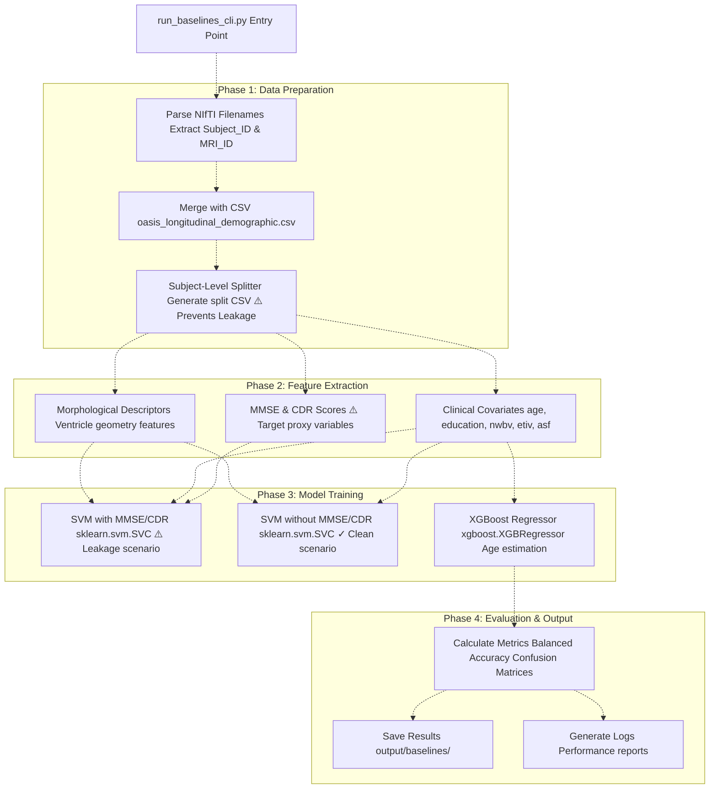
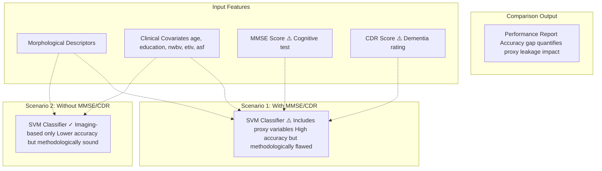
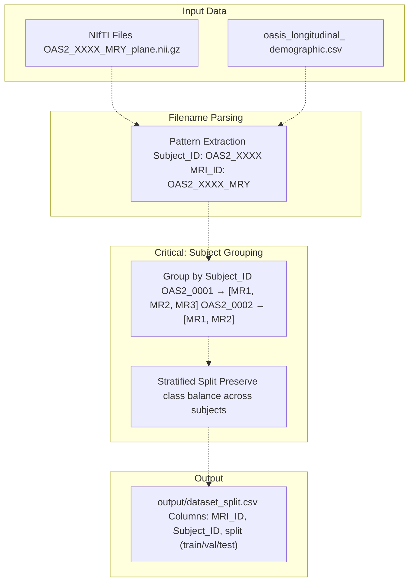
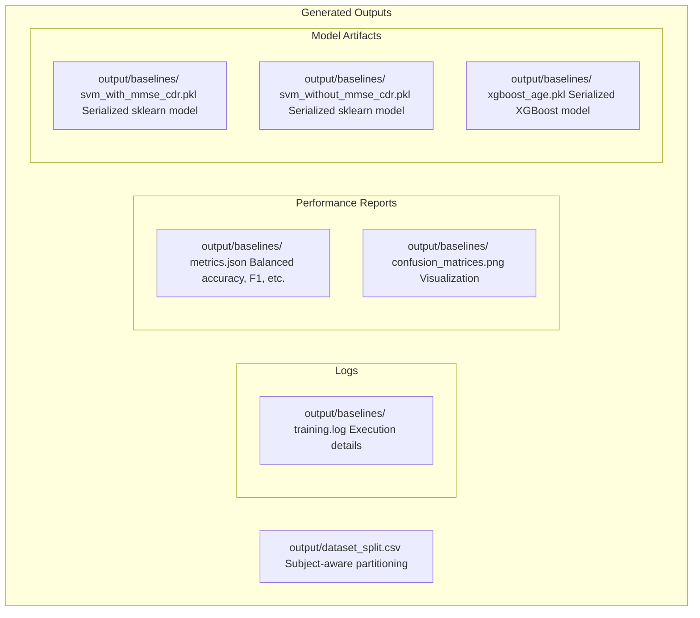
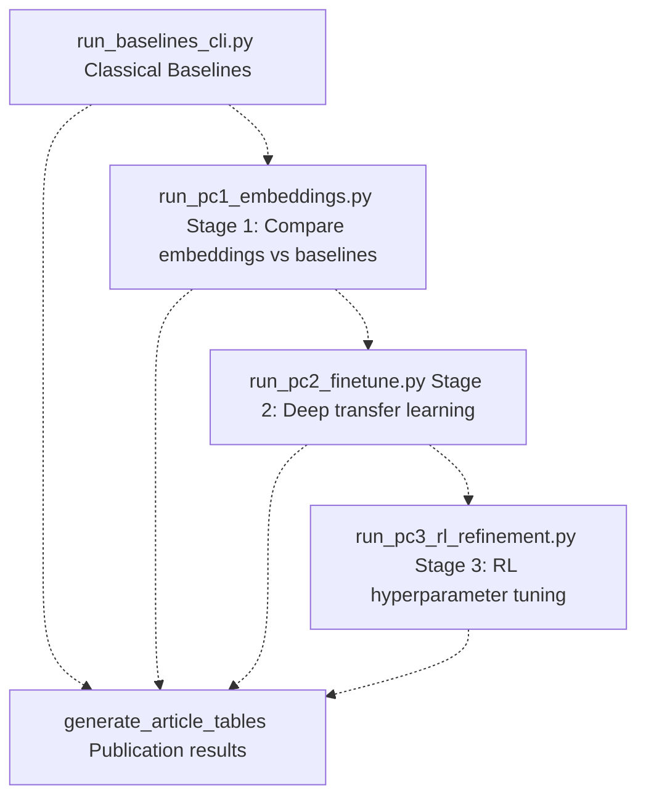

# Baselines CLI (run_baselines_cli.py)

> **Relevant source files**
> * [README.md](https://github.com/ThalesMMS/brain-mri-pipelines-py/blob/cd9d51a5/README.md)

## Purpose and Scope

The Baselines CLI provides a command-line interface for training classical machine learning models on the OASIS-2 dataset. This script serves as the primary entry point for executing SVM-based classification and XGBoost-based regression baselines in a headless, reproducible manner. It generates the subject-aware data split and trains models using both handcrafted morphological features and clinical covariates.

For deep learning model training, see [Deep Models CLI](#7.3). For the graphical interface, see [Graphical User Interface](#7.1). For detailed baseline model architectures and theoretical background, see [Classical Machine Learning Baselines](#5.3).

**Sources:** [README.md L1-L218](https://github.com/ThalesMMS/brain-mri-pipelines-py/blob/cd9d51a5/README.md#L1-L218)

---

## Overview

The `run_baselines_cli.py` script orchestrates the complete classical machine learning pipeline. It performs three primary functions:

1. **Dataset Preparation**: Generates the subject-aware train/validation/test split CSV to prevent data leakage
2. **SVM Classification**: Trains Support Vector Machines in two scenarios (with and without MMSE/CDR scores) for Alzheimer's disease detection
3. **XGBoost Regression**: Trains gradient boosting models for age estimation from brain imaging features

The script is designed for reproducible research workflows and is particularly useful for establishing baseline performance metrics before evaluating more complex deep learning architectures.

**Sources:** [README.md L101-L109](https://github.com/ThalesMMS/brain-mri-pipelines-py/blob/cd9d51a5/README.md#L101-L109)

 [README.md L13-L15](https://github.com/ThalesMMS/brain-mri-pipelines-py/blob/cd9d51a5/README.md#L13-L15)

---

## Execution Flow



**Diagram: Baselines CLI Execution Pipeline** - This diagram illustrates the four-phase workflow from data preparation through model training to result generation. The subject-level splitter prevents data leakage by ensuring all scans from a single patient remain in one partition.

**Sources:** [README.md L101-L109](https://github.com/ThalesMMS/brain-mri-pipelines-py/blob/cd9d51a5/README.md#L101-L109)

 [README.md L161-L169](https://github.com/ThalesMMS/brain-mri-pipelines-py/blob/cd9d51a5/README.md#L161-L169)

---

## Command-Line Usage

### Basic Execution

The simplest invocation runs all baseline experiments with default parameters:

```
python run_baselines_cli.py
```

This single command performs the complete baseline pipeline, including:

* Subject-aware data split generation
* SVM training (both scenarios)
* XGBoost training
* Metric computation and result saving

### Script Location

The baseline CLI is located at the repository root: [run_baselines_cli.py](https://github.com/ThalesMMS/brain-mri-pipelines-py/blob/cd9d51a5/run_baselines_cli.py)

**Sources:** [README.md L101-L109](https://github.com/ThalesMMS/brain-mri-pipelines-py/blob/cd9d51a5/README.md#L101-L109)

---

## Classical Baseline Models

### SVM Classification Architecture

The script trains Support Vector Machine classifiers using the `sklearn.svm.SVC` class with the following configuration:

| Configuration | Value | Purpose |
| --- | --- | --- |
| **Kernel** | RBF (Radial Basis Function) | Handles non-linear decision boundaries |
| **Input Features** | Morphological descriptors + Clinical covariates | Combines ventricle geometry with demographic data |
| **Task** | Binary classification | AD vs Non-AD detection |
| **Class Weighting** | Balanced | Addresses class imbalance in OASIS-2 |

The SVM models operate on handcrafted features extracted from brain MRI scans, specifically focusing on ventricle morphology as a key biomarker for Alzheimer's disease progression.

### XGBoost Regression Architecture

The XGBoost component (`xgboost.XGBRegressor`) performs age estimation as a complementary baseline task:

| Configuration | Value | Purpose |
| --- | --- | --- |
| **Objective** | Regression | Continuous age prediction |
| **Input Features** | Clinical covariates | Demographics and brain volumetrics |
| **Evaluation Metric** | MAE (Mean Absolute Error) | Interpretable age prediction error |
| **Task** | Auxiliary regression | Validates feature quality independently |

Age estimation serves as a sanity check for feature extraction quality, as brain atrophy patterns correlate with biological age.

**Sources:** [README.md L13-L15](https://github.com/ThalesMMS/brain-mri-pipelines-py/blob/cd9d51a5/README.md#L13-L15)

---

## Data Leakage Analysis: Two SVM Scenarios

A critical feature of the baselines CLI is its explicit comparison of two SVM training scenarios to demonstrate the impact of target proxy leakage.



**Diagram: SVM Scenario Comparison** - The dual-scenario design quantifies how much performance gain comes from using MMSE/CDR scores (which are themselves diagnostic measures of dementia) versus purely imaging-based features.

### Why This Matters

**MMSE (Mini-Mental State Examination)** and **CDR (Clinical Dementia Rating)** are cognitive assessment scores directly used by clinicians to diagnose dementia. Including them as features creates a form of **target leakage** where the model learns to rely on diagnostic proxies rather than imaging biomarkers.

The CLI trains both scenarios to demonstrate:

* **Scenario 1 (with MMSE/CDR)**: Achieves higher accuracy but conflates diagnosis with imaging features
* **Scenario 2 (without MMSE/CDR)**: Represents true imaging-based classification capability

The README explicitly recommends the clean scenario for methodologically sound research: *"While the codebase supports using them, we recommend the `svm_without_mmse_cdr` scenario for methodologically cleaner imaging-based analysis."*

**Sources:** [README.md L161-L169](https://github.com/ThalesMMS/brain-mri-pipelines-py/blob/cd9d51a5/README.md#L161-L169)

---

## Subject-Level Data Splitting

The baselines CLI generates the subject-aware split CSV that all subsequent experiments use. This critical step prevents data leakage by ensuring **all MRI scans from a single patient remain strictly within one partition** (Train, Validation, or Test).

### Split Generation Process



**Diagram: Subject-Level Split Generation** - The filename parser extracts `Subject_ID` and `MRI_ID`, groups scans by subject, and performs stratified splitting at the subject level (not the scan level) to prevent temporal scans from the same patient leaking across partitions.

### Naming Convention Requirements

The split generation relies on the OASIS-2 naming convention:

```
OAS2_0001_MR1_axl.nii.gz
     ↓     ↓
Subject_ID MRI_ID
```

Where:

* **Subject_ID**: `OAS2_XXXX` identifies a unique patient
* **MRI_ID**: `OAS2_XXXX_MRY` identifies a specific imaging session (patients may have multiple sessions over time)

**Sources:** [README.md L22-L23](https://github.com/ThalesMMS/brain-mri-pipelines-py/blob/cd9d51a5/README.md#L22-L23)

 [README.md L40-L50](https://github.com/ThalesMMS/brain-mri-pipelines-py/blob/cd9d51a5/README.md#L40-L50)

---

## Feature Extraction for Classical Models

### Morphological Descriptors

The SVM classifiers use handcrafted morphological features focused on ventricle geometry:

| Feature Category | Description | Rationale |
| --- | --- | --- |
| **Ventricle Volume** | Total volume of lateral ventricles | Ventricle enlargement is a key AD biomarker |
| **Ventricle Shape** | Geometric shape descriptors | Shape changes indicate atrophy patterns |
| **Spatial Distribution** | Position and symmetry metrics | Asymmetric atrophy can indicate pathology |

These features are extracted through semi-automatic segmentation available in the GUI (see [Graphical User Interface](#7.1)).

### Clinical Covariates

Both SVM and XGBoost models incorporate clinical features from `oasis_longitudinal_demographic.csv`:

| Feature | Description | Type |
| --- | --- | --- |
| `age` | Patient age at scan time | Continuous |
| `education` | Years of education | Continuous |
| `nwbv` | Normalized Whole Brain Volume | Continuous (0-1 range) |
| `etiv` | Estimated Total Intracranial Volume | Continuous (cm³) |
| `asf` | Atlas Scaling Factor | Continuous |

**Sources:** [README.md L13-L15](https://github.com/ThalesMMS/brain-mri-pipelines-py/blob/cd9d51a5/README.md#L13-L15)

---

## Output Artifacts

The baselines CLI generates structured outputs in the `output/` directory:



**Diagram: Baselines Output Directory Structure** - All artifacts are organized under `output/baselines/` for easy tracking and comparison with deep learning results.

### Key Output Files

| File | Format | Contents |
| --- | --- | --- |
| `dataset_split.csv` | CSV | Subject-level train/val/test assignments |
| `svm_with_mmse_cdr.pkl` | Pickle | Trained SVM including proxy variables |
| `svm_without_mmse_cdr.pkl` | Pickle | Trained SVM imaging-only scenario |
| `xgboost_age.pkl` | Pickle | Trained XGBoost age regressor |
| `metrics.json` | JSON | Performance metrics for all models |
| `confusion_matrices.png` | PNG | Visual comparison of classifier performance |
| `training.log` | Text | Detailed execution log with timestamps |

**Sources:** [README.md L37-L38](https://github.com/ThalesMMS/brain-mri-pipelines-py/blob/cd9d51a5/README.md#L37-L38)

---

## Integration with Research Pipeline

The baselines CLI serves as the foundation for the three-stage research pipeline:



**Diagram: Baselines in Research Workflow** - The classical baselines establish performance benchmarks that subsequent deep learning stages aim to exceed. Stage 1 specifically compares deep learning embeddings against the handcrafted features used here.

The subject-aware split CSV generated by this script is consumed by all downstream stages to ensure consistent evaluation.

**Sources:** [README.md L122-L157](https://github.com/ThalesMMS/brain-mri-pipelines-py/blob/cd9d51a5/README.md#L122-L157)

---

## Comparison with Deep Models CLI

| Aspect | `run_baselines_cli.py` | `run_deep_models_cli.py` |
| --- | --- | --- |
| **Models** | SVM, XGBoost | EfficientNet, DenseNet, MedicalNet |
| **Features** | Handcrafted morphology + clinical | Learned embeddings + clinical |
| **Architecture** | Single-stream | Multi-stream (axial/coronal/sagittal) |
| **Training Time** | Minutes | Hours (GPU recommended) |
| **Parameters** | Minimal (auto-configured) | Extensive (epochs, learning rate, etc.) |
| **Purpose** | Baseline benchmarks | State-of-the-art performance |
| **Output Location** | `output/baselines/` | `output/deep_models/` |

For deep learning training workflows, see [Deep Models CLI](#7.3).

**Sources:** [README.md L110-L118](https://github.com/ThalesMMS/brain-mri-pipelines-py/blob/cd9d51a5/README.md#L110-L118)

---

## Methodological Recommendations

The baselines CLI embodies several methodological best practices:

1. **Prefer Clean Scenario**: Use `svm_without_mmse_cdr` results for publication to avoid target leakage concerns
2. **Subject-Level Evaluation**: All metrics are computed at the subject level, not the scan level, to reflect real-world diagnostic scenarios
3. **Balanced Accuracy**: The primary metric accounts for class imbalance inherent in OASIS-2 (more non-demented than demented subjects)
4. **Reproducibility**: Fixed random seeds and deterministic splitting ensure consistent results across runs

The dual-scenario design allows researchers to quantify exactly how much performance gain comes from controversial features (MMSE/CDR) versus legitimate imaging biomarkers.

**Sources:** [README.md L161-L169](https://github.com/ThalesMMS/brain-mri-pipelines-py/blob/cd9d51a5/README.md#L161-L169)

Refresh this wiki

Last indexed: 5 January 2026 ([cd9d51](https://github.com/ThalesMMS/brain-mri-pipelines-py/commit/cd9d51a5))

### On this page

- [Baselines CLI (run\_baselines\_cli.py)](#baselines-cli-run_baselines_clipy)
  - [Purpose and Scope](#purpose-and-scope)
  - [Overview](#overview)
  - [Execution Flow](#execution-flow)
  - [Command-Line Usage](#command-line-usage)
    - [Basic Execution](#basic-execution)
    - [Script Location](#script-location)
  - [Classical Baseline Models](#classical-baseline-models)
    - [SVM Classification Architecture](#svm-classification-architecture)
    - [XGBoost Regression Architecture](#xgboost-regression-architecture)
  - [Data Leakage Analysis: Two SVM Scenarios](#data-leakage-analysis-two-svm-scenarios)
    - [Why This Matters](#why-this-matters)
  - [Subject-Level Data Splitting](#subject-level-data-splitting)
    - [Split Generation Process](#split-generation-process)
    - [Naming Convention Requirements](#naming-convention-requirements)
  - [Feature Extraction for Classical Models](#feature-extraction-for-classical-models)
    - [Morphological Descriptors](#morphological-descriptors)
    - [Clinical Covariates](#clinical-covariates)
  - [Output Artifacts](#output-artifacts)
    - [Key Output Files](#key-output-files)
  - [Integration with Research Pipeline](#integration-with-research-pipeline)
  - [Comparison with Deep Models CLI](#comparison-with-deep-models-cli)
  - [Methodological Recommendations](#methodological-recommendations)
    - [On this page](#on-this-page)

Ask Devin about brain-mri-pipelines-py