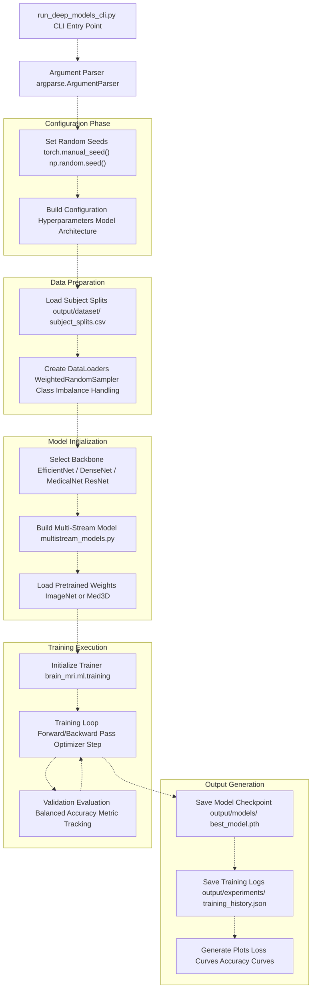
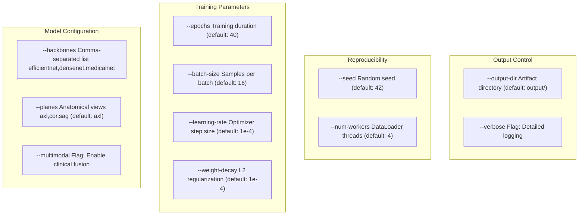
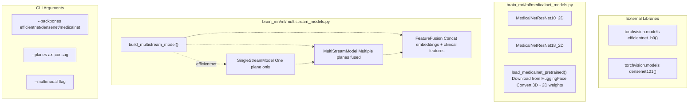
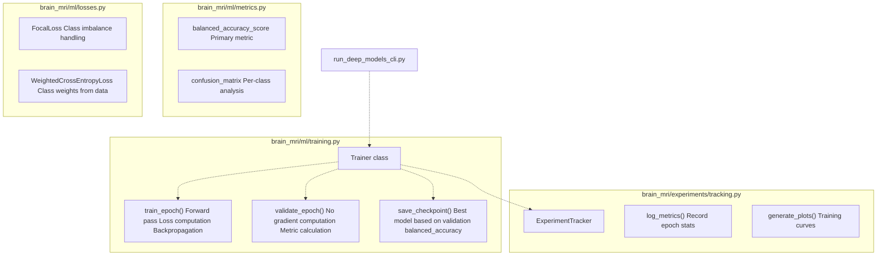
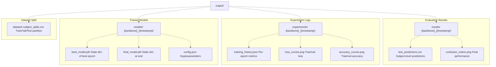
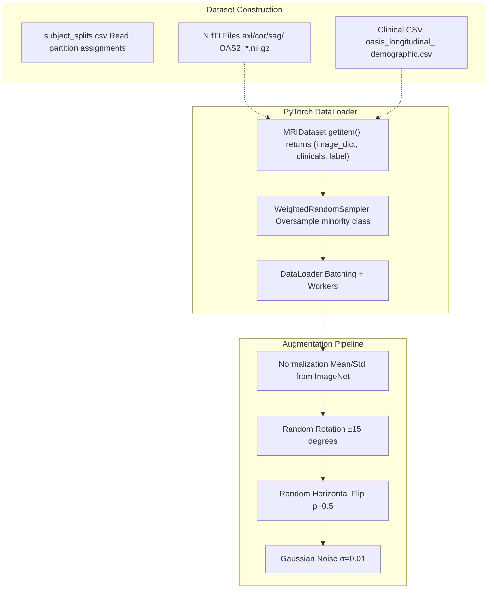

# Deep Models CLI (run_deep_models_cli.py)

> **Relevant source files**
> * [README.md](https://github.com/ThalesMMS/brain-mri-pipelines-py/blob/cd9d51a5/README.md)

## Purpose and Scope

This page documents `run_deep_models_cli.py`, the command-line interface for training deep learning models in headless mode. This CLI provides a production-ready, reproducible way to train multi-stream deep neural networks for Alzheimer's disease detection using various backbone architectures and configuration options.

For interactive training with visual feedback, see [Graphical User Interface (main.py)](7a%20Git-Configuration.md). For training classical machine learning baselines, see [Baselines CLI (run_baselines_cli.py)](7b%20Output-Directory-Structure.md). For the three-stage research pipeline scripts with specialized functionality (embedding analysis, explicit warmup phases, RL refinement), see [Three-Stage Research Pipeline](6%20User-Interfaces.md).

**Sources:** README.md

---

## Overview

The `run_deep_models_cli.py` script serves as the primary entry point for training deep learning models in batch mode without graphical interface dependencies. It orchestrates the complete training workflow including data loading, model instantiation, training execution, and artifact persistence. The CLI is designed for reproducible experiments on compute clusters and automated hyperparameter sweeps.

### Key Capabilities

| Capability | Description |
| --- | --- |
| **Multi-Backbone Support** | Train with EfficientNet-B0, DenseNet121, or MedicalNet ResNet backbones |
| **Multi-Stream Architecture** | Process 1-3 anatomical planes (axial, coronal, sagittal) simultaneously |
| **Multimodal Fusion** | Optionally integrate clinical tabular features with imaging data |
| **Reproducibility** | Fixed random seeds across PyTorch, NumPy, and Python's random module |
| **Subject-Level Splitting** | Enforces leakage prevention via subject-aware train/val/test partitioning |
| **Configurable Training** | Customize epochs, batch size, learning rate, weight decay, and other hyperparameters |
| **Artifact Management** | Automatically saves models, training logs, and performance metrics to `output/` |

**Sources:** [Project overview and setup](https://github.com/ThalesMMS/brain-mri-pipelines-py/blob/cd9d51a5/README.md#L110-L118)

---

## Execution Flow

The following diagram illustrates the high-level execution flow from CLI invocation to trained model artifacts:



**Sources:** [Project overview and setup](https://github.com/ThalesMMS/brain-mri-pipelines-py/blob/cd9d51a5/README.md#L110-L118)

---

## Command-Line Arguments

The CLI exposes a comprehensive set of arguments for controlling every aspect of the training process. Arguments are organized into logical groups for ease of use.

### Core Arguments



### Argument Reference Table

| Argument | Type | Default | Description |
| --- | --- | --- | --- |
| `--backbones` | str | `"efficientnet"` | Comma-separated backbone names. Valid: `efficientnet`, `densenet`, `medicalnet` |
| `--planes` | str | `"axl"` | Comma-separated anatomical planes. Valid: `axl`, `cor`, `sag` |
| `--multimodal` | flag | `False` | Enable fusion of clinical features (`age`, `education`, `nwbv`, `etiv`, `asf`) |
| `--epochs` | int | `40` | Total training epochs |
| `--batch-size` | int | `16` | Batch size for training and validation |
| `--learning-rate` | float | `1e-4` | Initial learning rate for Adam optimizer |
| `--weight-decay` | float | `1e-4` | L2 regularization coefficient |
| `--seed` | int | `42` | Random seed for reproducibility |
| `--num-workers` | int | `4` | Number of DataLoader worker processes |
| `--output-dir` | str | `"output"` | Root directory for saving artifacts |
| `--verbose` | flag | `False` | Enable detailed console output |

**Sources:** [Project overview and setup](https://github.com/ThalesMMS/brain-mri-pipelines-py/blob/cd9d51a5/README.md#L110-L118)

---

## Usage Examples

### Basic Training

Train a single-stream EfficientNet model on axial slices:

```
python run_deep_models_cli.py --seed 42 --epochs 40 --backbones efficientnet
```

This invocation:

* Uses only axial plane images (default: `--planes axl`)
* Trains for 40 epochs
* Uses imaging features only (no `--multimodal` flag)
* Produces reproducible results with seed 42

### Multi-Stream Training

Train a multi-stream model processing all three anatomical planes:

```
python run_deep_models_cli.py \    --seed 42 \    --epochs 40 \    --backbones efficientnet \    --planes axl,cor,sag
```

This configuration creates three independent feature extraction streams (one per anatomical plane) that are concatenated before classification. See [Multi-Stream Multimodal Network](3a%20Multi-Stream-Multimodal-Network.md) for architectural details.

### Multimodal Fusion

Train with both imaging and clinical features:

```
python run_deep_models_cli.py \    --seed 42 \    --epochs 40 \    --backbones efficientnet \    --multimodal
```

The `--multimodal` flag concatenates clinical features (`age`, `education`, `nwbv`, `etiv`, `asf`) extracted from `oasis_longitudinal_demographic.csv` with the visual embeddings before the final classification layer.

### Backbone Comparison

Train multiple backbones in a single run for comparison:

```
python run_deep_models_cli.py \    --seed 42 \    --epochs 40 \    --backbones efficientnet,medicalnet,densenet
```

This trains three separate models sequentially, each using a different backbone architecture:

* **EfficientNet-B0**: ImageNet pretrained, efficient compound scaling
* **DenseNet121**: ImageNet pretrained, dense skip connections
* **MedicalNet ResNet**: Med3D pretrained on medical imaging data

For detailed backbone comparisons, see [Deep Learning Backbones](5a%20Stage-1-Embedding-Analysis-%28run_pc1_embeddings.py%29.md).

### Full Configuration Example

A comprehensive training run with all major options:

```
python run_deep_models_cli.py \    --seed 42 \    --epochs 50 \    --batch-size 32 \    --learning-rate 5e-5 \    --weight-decay 1e-5 \    --backbones medicalnet \    --planes axl,cor,sag \    --multimodal \    --num-workers 8 \    --verbose
```

**Sources:** [Project overview and setup](https://github.com/ThalesMMS/brain-mri-pipelines-py/blob/cd9d51a5/README.md#L110-L118)

---

## Model Configuration Mapping

The following diagram shows how CLI arguments map to the model architecture and training components in code:



**Key Code Entities:**

* `build_multistream_model()`: Factory function in `brain_mri/ml/multistream_models.py` that instantiates the appropriate model based on configuration
* `SingleStreamModel`: Wraps a single backbone for one anatomical plane
* `MultiStreamModel`: Combines multiple `SingleStreamModel` instances for multi-view processing
* `FeatureFusion`: Concatenation layer that optionally includes clinical features when `--multimodal` is enabled
* `load_medicalnet_pretrained()`: Downloads and converts Med3D weights in `brain_mri/ml/medicalnet_models.py`

**Sources:** [README.md L10-L15](https://github.com/ThalesMMS/brain-mri-pipelines-py/blob/cd9d51a5/README.md#L10-L15)

 **Sources**: [Project overview and setup](https://github.com/ThalesMMS/brain-mri-pipelines-py/blob/cd9d51a5/README.md#L171-L173)

---

## Training Workflow Integration

The CLI integrates with core training infrastructure in the `brain_mri/ml/` module:



### Training Loop Sequence

The training process follows this sequence per epoch:

1. **Training Phase** (`train_epoch()`): * Iterate through training batches with `WeightedRandomSampler` for class balance * Forward pass through multi-stream model * Compute loss using Focal Loss or Weighted Cross-Entropy * Backpropagate gradients * Update model parameters with Adam optimizer * Track training loss and accuracy
2. **Validation Phase** (`validate_epoch()`): * Disable gradient computation (`torch.no_grad()`) * Iterate through validation batches * Forward pass to obtain predictions * Compute validation loss * Calculate balanced accuracy (primary metric) * Generate confusion matrix for per-class analysis
3. **Checkpoint Management** (`save_checkpoint()`): * Compare current validation balanced accuracy to best seen so far * Save model state if new best performance achieved * Persist optimizer state for potential resumption
4. **Experiment Tracking** (`ExperimentTracker`): * Log metrics to JSON file in `output/experiments/` * Generate training/validation loss curves * Generate accuracy progression plots * Save configuration metadata

**Sources:** [Project overview and setup](https://github.com/ThalesMMS/brain-mri-pipelines-py/blob/cd9d51a5/README.md#L164-L167)

---

## Output Artifacts

The CLI generates a structured set of output artifacts in the `output/` directory:



### Artifact Descriptions

| Path Pattern | Content | Purpose |
| --- | --- | --- |
| `output/dataset/subject_splits.csv` | Subject-level train/val/test partition | Ensures reproducible splits preventing data leakage |
| `output/models/{backbone}_{timestamp}/best_model.pth` | PyTorch state dict of best performing model | Checkpoint with highest validation balanced accuracy |
| `output/models/{backbone}_{timestamp}/config.json` | Serialized training configuration | Hyperparameters, architecture settings for reproducibility |
| `output/experiments/{backbone}_{timestamp}/training_history.json` | Per-epoch metrics (loss, accuracy, balanced accuracy) | Enables analysis of training dynamics |
| `output/experiments/{backbone}_{timestamp}/loss_curves.png` | Plot of training/validation loss over epochs | Visual inspection of convergence |
| `output/experiments/{backbone}_{timestamp}/accuracy_curves.png` | Plot of training/validation accuracy over epochs | Visual inspection of overfitting |
| `output/results/{backbone}_{timestamp}/test_predictions.csv` | Per-subject predictions on test set | Final model evaluation |
| `output/results/{backbone}_{timestamp}/confusion_matrix.png` | Visualization of true vs predicted labels | Per-class performance analysis |

**Sources:** [README.md L37-L38](https://github.com/ThalesMMS/brain-mri-pipelines-py/blob/cd9d51a5/README.md#L37-L38)

---

## Data Loading and Augmentation

The CLI leverages the data loading pipeline described in [Data Loading & Augmentation](4e%20Loss-Functions-&-Class-Imbalance.md), with specific configurations for production training:



### Class Imbalance Handling

The OASIS-2 dataset exhibits class imbalance (more non-demented than demented subjects). The CLI employs multiple strategies to prevent model collapse:

1. **WeightedRandomSampler**: Oversamples minority class during training
2. **Class-Weighted Loss**: Inversely weights loss contribution by class frequency
3. **Focal Loss**: Down-weights easy examples to focus on hard cases
4. **Balanced Accuracy**: Primary metric that accounts for class imbalance

See [Loss Functions & Class Imbalance](#5.5) for implementation details.

**Sources:** [Project overview and setup](https://github.com/ThalesMMS/brain-mri-pipelines-py/blob/cd9d51a5/README.md#L164-L167)

---

## Comparison with Other Interfaces

Understanding when to use each interface:

| Interface | Use Case | Key Differences |
| --- | --- | --- |
| **run_deep_models_cli.py(This Page)** | Production training, hyperparameter sweeps, batch experiments | Headless, reproducible, supports multiple backbones in one run |
| **main.py(GUI)** | Interactive exploration, visual debugging, quick prototyping | Tkinter interface, live visualization, single model training |
| **run_baselines_cli.py(Baselines CLI)** | Classical ML baselines (SVM, XGBoost) | Handcrafted features, target leakage analysis scenarios |
| **run_pc2_finetune.py(Stage 2 Pipeline)** | Transfer learning with explicit warmup phase | Two-phase training (frozen → unfrozen backbone) |
| **run_pc3_rl_refinement.py(Stage 3 Pipeline)** | Hyperparameter optimization via RL | PPO agent adjusts learning rate/weight decay dynamically |

### When to Use This CLI

**Recommended scenarios:**

* Running experiments on compute clusters without display servers
* Hyperparameter sweeps or grid searches
* Comparing multiple backbone architectures systematically
* Reproducible research requiring fixed random seeds
* Training production models for deployment

**Alternative scenarios:**

* **Use GUI** if you need visual feedback during training or want to explore the dataset interactively
* **Use Stage 2 script** if you specifically need the warmup/fine-tuning phase separation for ablation studies
* **Use Stage 3 script** if you want to apply RL-based hyperparameter refinement on top of a trained model

**Sources:** README.md

---

## Advanced Configuration

### Custom Output Directory

Override the default `output/` directory:

```
python run_deep_models_cli.py \    --output-dir /path/to/custom/output \    --backbones efficientnet
```

This is useful when running multiple experiments in parallel or organizing results by experimental condition.

### Verbose Logging

Enable detailed console output for debugging:

```
python run_deep_models_cli.py \    --backbones efficientnet \    --verbose
```

Verbose mode logs:

* Per-batch loss and accuracy during training
* Detailed validation metrics per epoch
* Model architecture summary
* Data loader statistics

### Integration with Experiment Tracking

The CLI automatically integrates with the experiment tracking system in `brain_mri/experiments/tracking.py`. Each training run generates:

* Unique experiment ID based on configuration hash
* JSON logs compatible with pandas for post-processing
* Plots saved as PNG for inclusion in publications

For generating publication-ready LaTeX tables from multiple experiments, use the results generation pipeline:

```
python -m brain_mri.scripts.generate_article_tables --write
```

See [Results Generation (generate_article_tables)](#6.4) for details.

**Sources:** [Project overview and setup](https://github.com/ThalesMMS/brain-mri-pipelines-py/blob/cd9d51a5/README.md#L152-L156)

---

## Technical Notes

### Reproducibility Guarantees

The CLI sets multiple random seeds to ensure reproducibility:

```
# Pseudocode based on typical implementationtorch.manual_seed(args.seed)np.random.seed(args.seed)random.seed(args.seed)torch.backends.cudnn.deterministic = Truetorch.backends.cudnn.benchmark = False
```

**Note:** Complete determinism on GPU requires `torch.backends.cudnn.deterministic = True`, which may reduce performance. For non-critical experiments, omitting this flag can improve throughput.

### Memory Considerations

Multi-stream models with all three planes and clinical fusion can be memory-intensive. Guidelines:

| Configuration | Approximate GPU Memory (Batch Size 16) |
| --- | --- |
| Single plane, EfficientNet | ~4 GB |
| Three planes, EfficientNet | ~8 GB |
| Three planes + multimodal, DenseNet | ~10 GB |
| Three planes + multimodal, MedicalNet | ~12 GB |

For GPU memory constraints, reduce `--batch-size` or use fewer planes with `--planes axl`.

### Performance Optimization

The `--num-workers` argument controls DataLoader parallelism. Optimal values:

* **CPU training:** 4-8 workers
* **Single GPU:** 4-8 workers
* **Multi-GPU:** 8-16 workers per GPU

Too many workers can cause CPU bottlenecks or excessive memory usage. Monitor CPU utilization to find the optimal setting for your hardware.

**Sources:** [Project overview and setup](https://github.com/ThalesMMS/brain-mri-pipelines-py/blob/cd9d51a5/README.md#L110-L118)

---

## Summary

The `run_deep_models_cli.py` script provides a robust, configurable command-line interface for training deep learning models in the brain MRI analysis pipeline. It supports:

* Multiple backbone architectures (EfficientNet, DenseNet, MedicalNet)
* Multi-stream processing of anatomical planes
* Multimodal fusion with clinical features
* Comprehensive hyperparameter control
* Reproducible experiments with fixed seeds
* Automatic artifact generation and experiment tracking

This CLI is the recommended entry point for production training workflows, enabling systematic model comparison and reproducible research without graphical interface dependencies.

For specialized training scenarios, see the three-stage research pipeline scripts ([Stage 1](6a%20Graphical-User-Interface-%28main.py%29.md), [Stage 2](6b%20Baselines-CLI-%28run_baselines_cli.py%29.md), [Stage 3](#6.3)) which build upon this foundation with additional capabilities.

**Sources:** README.md


### On this page

* [Deep Models CLI (run_deep_models_cli.py)](7c%20License-&-Usage-Terms.md)
* [Purpose and Scope](7c%20License-&-Usage-Terms.md)
* [Overview](7c%20License-&-Usage-Terms.md)
* [Key Capabilities](7c%20License-&-Usage-Terms.md)
* [Execution Flow](7c%20License-&-Usage-Terms.md)
* [Command-Line Arguments](7c%20License-&-Usage-Terms.md)
* [Core Arguments](7c%20License-&-Usage-Terms.md)
* [Argument Reference Table](7c%20License-&-Usage-Terms.md)
* [Usage Examples](7c%20License-&-Usage-Terms.md)
* [Basic Training](7c%20License-&-Usage-Terms.md)
* [Multi-Stream Training](7c%20License-&-Usage-Terms.md)
* [Multimodal Fusion](7c%20License-&-Usage-Terms.md)
* [Backbone Comparison](7c%20License-&-Usage-Terms.md)
* [Full Configuration Example](7c%20License-&-Usage-Terms.md)
* [Model Configuration Mapping](7c%20License-&-Usage-Terms.md)
* [Training Workflow Integration](7c%20License-&-Usage-Terms.md)
* [Training Loop Sequence](7c%20License-&-Usage-Terms.md)
* [Output Artifacts](7c%20License-&-Usage-Terms.md)
* [Artifact Descriptions](7c%20License-&-Usage-Terms.md)
* [Data Loading and Augmentation](7c%20License-&-Usage-Terms.md)
* [Class Imbalance Handling](7c%20License-&-Usage-Terms.md)
* [Comparison with Other Interfaces](7c%20License-&-Usage-Terms.md)
* [When to Use This CLI](7c%20License-&-Usage-Terms.md)
* [Advanced Configuration](7c%20License-&-Usage-Terms.md)
* [Custom Output Directory](7c%20License-&-Usage-Terms.md)
* [Verbose Logging](7c%20License-&-Usage-Terms.md)
* [Integration with Experiment Tracking](7c%20License-&-Usage-Terms.md)
* [Technical Notes](7c%20License-&-Usage-Terms.md)
* [Reproducibility Guarantees](7c%20License-&-Usage-Terms.md)
* [Memory Considerations](7c%20License-&-Usage-Terms.md)
* [Performance Optimization](7c%20License-&-Usage-Terms.md)
* [Summary](7c%20License-&-Usage-Terms.md)

Ask Devin about brain-mri-pipelines-py