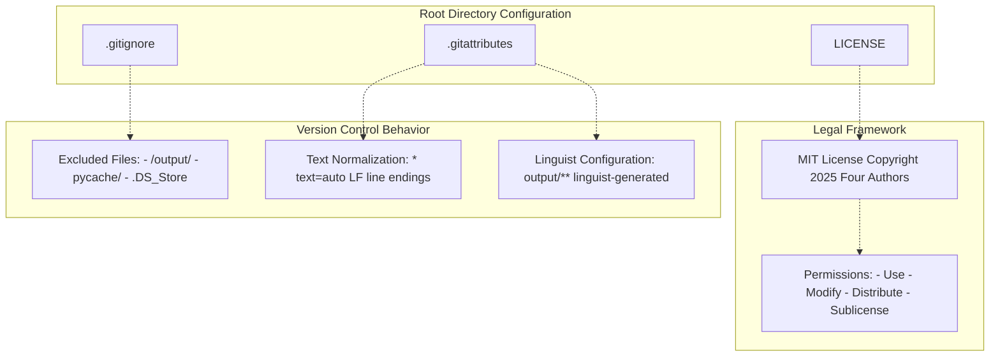
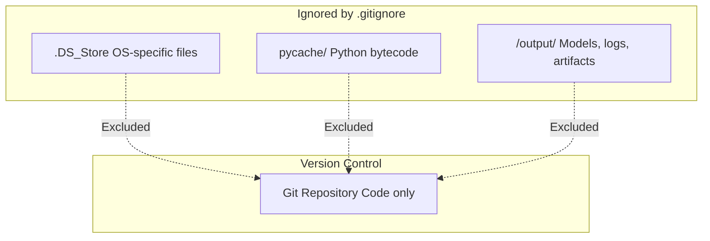
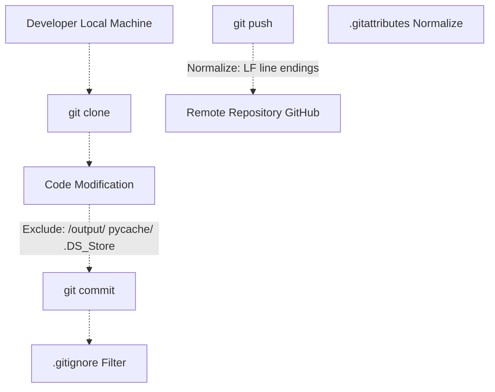
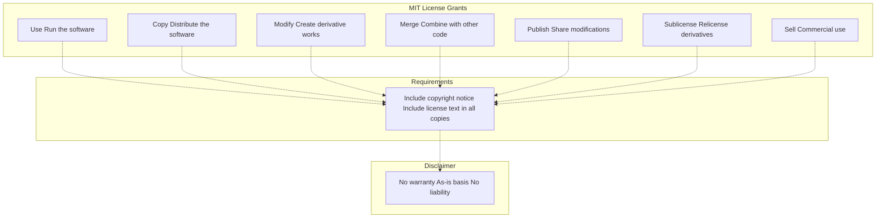
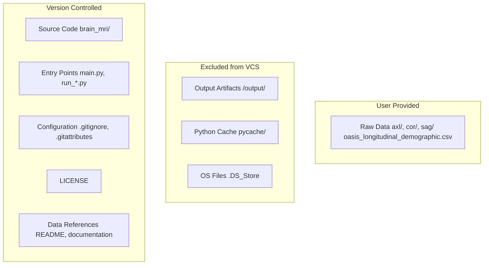
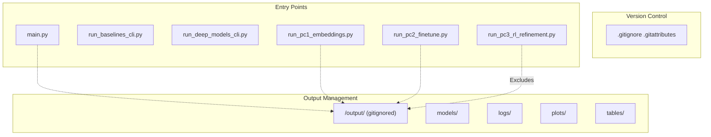

# Development & Configuration

> **Relevant source files**
> * [.gitattributes](https://github.com/ThalesMMS/brain-mri-pipelines-py/blob/cd9d51a5/.gitattributes)
> * [.gitignore](https://github.com/ThalesMMS/brain-mri-pipelines-py/blob/cd9d51a5/.gitignore)
> * [LICENSE](https://github.com/ThalesMMS/brain-mri-pipelines-py/blob/cd9d51a5/LICENSE)

## Purpose and Scope

This page provides an overview of the development environment setup, configuration files, and project organization for contributors and developers working with the brain-mri-pipelines-py codebase. It covers version control configuration, output directory management, and licensing information.

For specific details about:

* Git configuration files and version control practices, see [Git Configuration](#8.1)
* Output directory structure and artifact storage, see [Output Directory Structure](#8.2)
* License terms and usage permissions, see [License & Usage Terms](#8.3)

For general installation and environment setup for end-users, see [Installation & Dependencies](#2.1).

## Development Environment Overview

The project follows standard Python development practices with explicit configuration for version control, output management, and licensing. The development configuration prioritizes:

1. **Reproducibility**: Consistent line endings and text file handling across platforms
2. **Storage Efficiency**: Exclusion of large output artifacts from version control
3. **Clarity**: Clear licensing and attribution for academic use

## Configuration Files Structure

The repository contains three primary configuration files at the root level that govern development workflow:

### Configuration Files Diagram



**Sources:** [.gitignore L1-L9](https://github.com/ThalesMMS/brain-mri-pipelines-py/blob/cd9d51a5/.gitignore#L1-L9)

 [.gitattributes L1-L4](https://github.com/ThalesMMS/brain-mri-pipelines-py/blob/cd9d51a5/.gitattributes#L1-L4)

 [LICENSE L1-L22](https://github.com/ThalesMMS/brain-mri-pipelines-py/blob/cd9d51a5/LICENSE#L1-L22)

## Version Control Configuration

The project uses two Git configuration files to ensure consistent behavior across different development environments:

| Configuration File | Purpose | Key Settings |
| --- | --- | --- |
| `.gitattributes` | Text file handling, line ending normalization | `* text=auto`, `output/** linguist-generated` |
| `.gitignore` | Exclude files from version control | `/output/`, `__pycache__/`, `.DS_Store` |

### Text File Normalization

The [.gitattributes L1-L2](https://github.com/ThalesMMS/brain-mri-pipelines-py/blob/cd9d51a5/.gitattributes#L1-L2)

 file enforces automatic line ending normalization:

```
* text=auto
```

This ensures that:

* Text files use LF line endings in the repository
* Files are automatically converted to the appropriate line endings for the local platform
* Cross-platform collaboration remains consistent regardless of developer OS

### Linguist Configuration

The [.gitattributes L3](https://github.com/ThalesMMS/brain-mri-pipelines-py/blob/cd9d51a5/.gitattributes#L3-L3)

 file marks the output directory as generated content:

```
output/** linguist-generated
```

This designation:

* Excludes generated files from GitHub's language statistics
* Prevents large output files from affecting repository language classification
* Clearly identifies machine-generated vs. human-authored code

**Sources:** [.gitattributes L1-L4](https://github.com/ThalesMMS/brain-mri-pipelines-py/blob/cd9d51a5/.gitattributes#L1-L4)

## Excluded Files and Directories

The `.gitignore` file prevents large or environment-specific files from entering version control:

### Ignored File Categories



**Sources:** [.gitignore L1-L9](https://github.com/ThalesMMS/brain-mri-pipelines-py/blob/cd9d51a5/.gitignore#L1-L9)

### Output Directory Exclusion Strategy

The [.gitignore L8](https://github.com/ThalesMMS/brain-mri-pipelines-py/blob/cd9d51a5/.gitignore#L8-L8)

 excludes the entire `/output/` directory:

```
/output/
```

This exclusion is critical because the output directory contains:

* Trained model weights (potentially hundreds of MB to GB)
* Experiment logs and TensorBoard events
* Generated plots and visualizations
* LaTeX tables for publication
* Intermediate embeddings and feature extractions

These artifacts are:

* **Too large** for version control (model weights can exceed 100MB)
* **Reproducible** from the source code and training scripts
* **Environment-specific** (tied to specific hardware, random seeds, and data splits)

For detailed information about what the output directory contains and how it's organized, see [Output Directory Structure](#8.2).

**Sources:** [.gitignore L7-L9](https://github.com/ThalesMMS/brain-mri-pipelines-py/blob/cd9d51a5/.gitignore#L7-L9)

## Development Workflow Integration

The configuration files integrate with the development workflow as follows:

### Git Workflow with Configuration



**Sources:** [.gitignore L1-L9](https://github.com/ThalesMMS/brain-mri-pipelines-py/blob/cd9d51a5/.gitignore#L1-L9)

 [.gitattributes L1-L4](https://github.com/ThalesMMS/brain-mri-pipelines-py/blob/cd9d51a5/.gitattributes#L1-L4)

### Practical Implications

| Development Task | Configuration Impact |
| --- | --- |
| Training a model | Output saved to `/output/`, automatically excluded from commits |
| Editing Python code | Line endings normalized to LF, `__pycache__/` ignored |
| Sharing experiments | Share code and configuration, not trained weights |
| Cross-platform collaboration | Text files normalized automatically, no CRLF/LF conflicts |
| GitHub repository stats | Output directory marked as generated, doesn't skew language percentages |

**Sources:** [.gitignore L1-L9](https://github.com/ThalesMMS/brain-mri-pipelines-py/blob/cd9d51a5/.gitignore#L1-L9)

 [.gitattributes L1-L4](https://github.com/ThalesMMS/brain-mri-pipelines-py/blob/cd9d51a5/.gitattributes#L1-L4)

## Licensing Framework

The project is released under the MIT License, one of the most permissive open-source licenses. This choice aligns with academic research practices and encourages widespread adoption.

### License Attribution

The [LICENSE L3](https://github.com/ThalesMMS/brain-mri-pipelines-py/blob/cd9d51a5/LICENSE#L3-L3)

 file specifies four copyright holders:

```
Copyright (c) 2025 Antônio Soares Couto Neto, Giovanna Naves Ribeiro, 
                   Julia Rodrigues Vasconcellos Melo, Thales Matheus Mendonça Santos
```

### MIT License Permissions



**Sources:** [LICENSE L1-L22](https://github.com/ThalesMMS/brain-mri-pipelines-py/blob/cd9d51a5/LICENSE#L1-L22)

### License Requirements

The MIT License [LICENSE L5-L10](https://github.com/ThalesMMS/brain-mri-pipelines-py/blob/cd9d51a5/LICENSE#L5-L10)

 grants permission to:

* Use the software for any purpose, including commercial applications
* Modify the source code
* Distribute original or modified versions
* Sublicense derivative works

The only requirement is to include the copyright notice and license text in all copies or substantial portions of the software.

### Warranty Disclaimer

The [LICENSE L14-L21](https://github.com/ThalesMMS/brain-mri-pipelines-py/blob/cd9d51a5/LICENSE#L14-L21)

 includes a standard warranty disclaimer:

* The software is provided "as-is"
* No warranties of merchantability or fitness for purpose
* Authors are not liable for damages arising from use

This is standard for academic research software and protects the authors while allowing free use.

For complete license text and usage terms, see [License & Usage Terms](#8.3).

**Sources:** [LICENSE L1-L22](https://github.com/ThalesMMS/brain-mri-pipelines-py/blob/cd9d51a5/LICENSE#L1-L22)

## Development Best Practices

Based on the configuration files, developers should follow these practices:

### Repository Hygiene

| Practice | Rationale | Configuration |
| --- | --- | --- |
| Never commit `/output/` | Large files, reproducible artifacts | [.gitignore L8](https://github.com/ThalesMMS/brain-mri-pipelines-py/blob/cd9d51a5/.gitignore#L8-L8) |
| Let Git normalize line endings | Cross-platform consistency | [.gitattributes L1-L2](https://github.com/ThalesMMS/brain-mri-pipelines-py/blob/cd9d51a5/.gitattributes#L1-L2) |
| Regenerate models from source | Version control code, not weights | [.gitignore L8](https://github.com/ThalesMMS/brain-mri-pipelines-py/blob/cd9d51a5/.gitignore#L8-L8) |
| Include license in derivatives | MIT License requirement | [LICENSE L12-L13](https://github.com/ThalesMMS/brain-mri-pipelines-py/blob/cd9d51a5/LICENSE#L12-L13) |

### File Organization



**Sources:** [.gitignore L1-L9](https://github.com/ThalesMMS/brain-mri-pipelines-py/blob/cd9d51a5/.gitignore#L1-L9)

 [.gitattributes L1-L4](https://github.com/ThalesMMS/brain-mri-pipelines-py/blob/cd9d51a5/.gitattributes#L1-L4)

### Reproducibility Guidelines

To ensure reproducibility:

1. **Commit code changes**, not outputs
2. **Document random seeds** in experiment scripts
3. **Track hyperparameters** in configuration files or logs
4. **Share trained models** through external storage (not Git)
5. **Reference data sources** without committing large datasets

The three-stage research pipeline ([Stage 1: Embedding Analysis](#6.1), [Stage 2: Transfer Learning](#6.2), [Stage 3: RL Refinement](#6.3)) generates substantial output artifacts that should never be committed to the repository.

## Integration with System Architecture

The development configuration supports the overall system architecture:

### Configuration Support for System Components



**Sources:** [.gitignore L7-L9](https://github.com/ThalesMMS/brain-mri-pipelines-py/blob/cd9d51a5/.gitignore#L7-L9)

All system entry points ([GUI](#7.1), [Baselines CLI](#7.2), [Deep Models CLI](#7.3), [Research Pipeline](#6)) write output to the `/output/` directory, which is excluded from version control by design. This separation ensures that the Git repository contains only source code and configuration, while experiment artifacts are managed locally.

## Summary

The development configuration implements three key principles:

1. **Separation of Code and Artifacts**: Source code is version controlled, while large output files are excluded
2. **Cross-Platform Consistency**: Text file normalization ensures consistent behavior across different operating systems
3. **Permissive Licensing**: MIT License encourages academic and commercial use with minimal restrictions

For detailed information about specific aspects of the development configuration:

* Git configuration details: [Git Configuration](#8.1)
* Output directory organization: [Output Directory Structure](#8.2)
* Complete license text: [License & Usage Terms](#8.3)

**Sources:** [.gitignore L1-L9](https://github.com/ThalesMMS/brain-mri-pipelines-py/blob/cd9d51a5/.gitignore#L1-L9)

 [.gitattributes L1-L4](https://github.com/ThalesMMS/brain-mri-pipelines-py/blob/cd9d51a5/.gitattributes#L1-L4)

 [LICENSE L1-L22](https://github.com/ThalesMMS/brain-mri-pipelines-py/blob/cd9d51a5/LICENSE#L1-L22)

Refresh this wiki

Last indexed: 5 January 2026 ([cd9d51](https://github.com/ThalesMMS/brain-mri-pipelines-py/commit/cd9d51a5))

### On this page

* [Development & Configuration](#8-development-configuration)
* [Purpose and Scope](#8-purpose-and-scope)
* [Development Environment Overview](#8-development-environment-overview)
* [Configuration Files Structure](#8-configuration-files-structure)
* [Configuration Files Diagram](#8-configuration-files-diagram)
* [Version Control Configuration](#8-version-control-configuration)
* [Text File Normalization](#8-text-file-normalization)
* [Linguist Configuration](#8-linguist-configuration)
* [Excluded Files and Directories](#8-excluded-files-and-directories)
* [Ignored File Categories](#8-ignored-file-categories)
* [Output Directory Exclusion Strategy](#8-output-directory-exclusion-strategy)
* [Development Workflow Integration](#8-development-workflow-integration)
* [Git Workflow with Configuration](#8-git-workflow-with-configuration)
* [Practical Implications](#8-practical-implications)
* [Licensing Framework](#8-licensing-framework)
* [License Attribution](#8-license-attribution)
* [MIT License Permissions](#8-mit-license-permissions)
* [License Requirements](#8-license-requirements)
* [Warranty Disclaimer](#8-warranty-disclaimer)
* [Development Best Practices](#8-development-best-practices)
* [Repository Hygiene](#8-repository-hygiene)
* [File Organization](#8-file-organization)
* [Reproducibility Guidelines](#8-reproducibility-guidelines)
* [Integration with System Architecture](#8-integration-with-system-architecture)
* [Configuration Support for System Components](#8-configuration-support-for-system-components)
* [Summary](#8-summary)

Ask Devin about brain-mri-pipelines-py