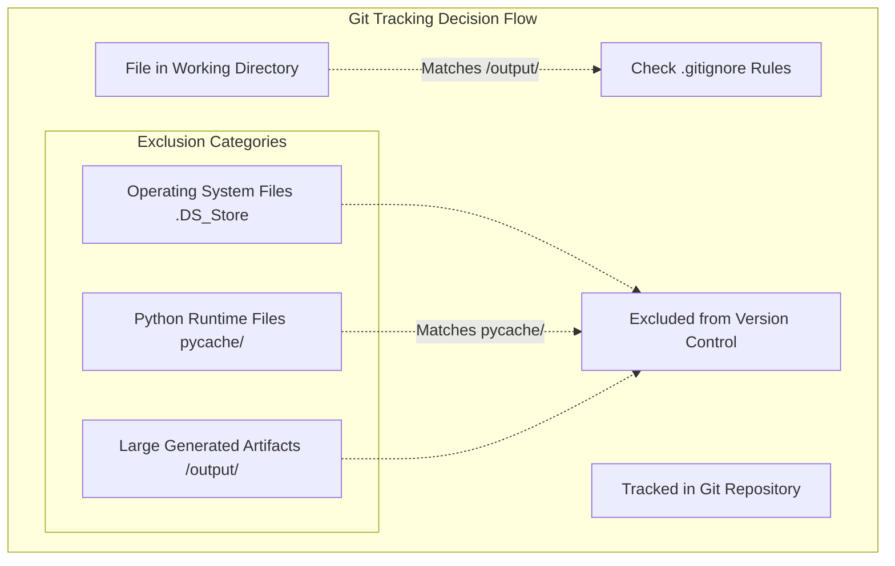
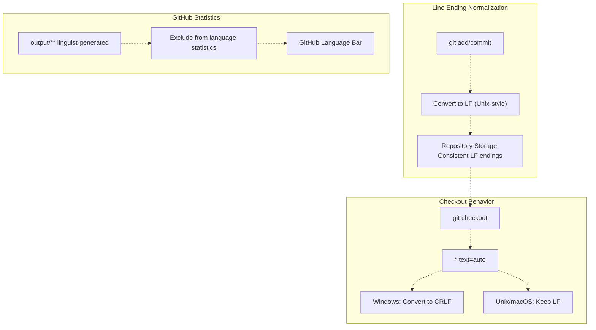
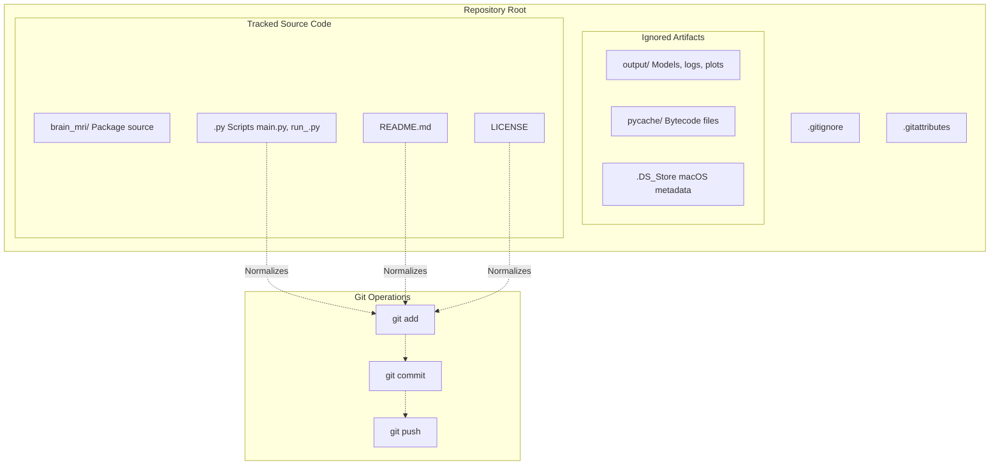
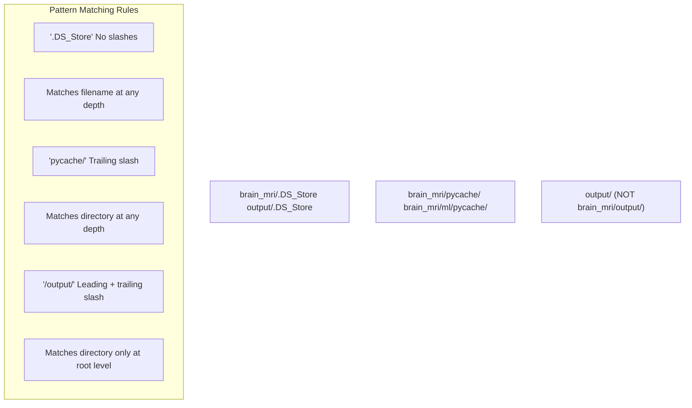
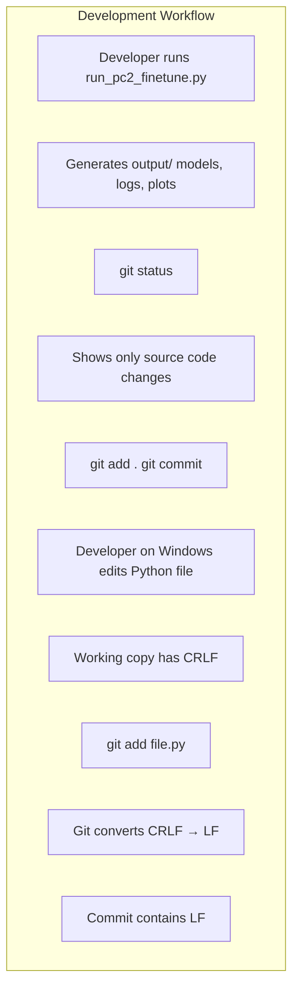

# Git Configuration

> **Relevant source files**
> * [.gitattributes](https://github.com/ThalesMMS/brain-mri-pipelines-py/blob/cd9d51a5/.gitattributes)
> * [.gitignore](https://github.com/ThalesMMS/brain-mri-pipelines-py/blob/cd9d51a5/.gitignore)

## Purpose & Scope

This document describes the Git version control configuration for the brain-mri-pipelines-py repository, specifically the `.gitignore` and `.gitattributes` files. These files control which files are tracked in version control, how text files are normalized, and how GitHub displays repository statistics. This configuration ensures that large model outputs, system files, and generated artifacts are excluded from version control while maintaining proper line ending handling across different operating systems.

For information about the output directory that is excluded from version control, see [Output Directory Structure](8b%20Dataset-Coverage.md).

## Git Configuration Files

The repository contains two Git configuration files at the root level:

| File | Purpose | Lines of Code |
| --- | --- | --- |
| `.gitignore` | Specifies files and directories to exclude from version control | 9 |
| `.gitattributes` | Configures text normalization and repository statistics | 4 |

These files work together to maintain a clean repository that excludes large binary artifacts while ensuring consistent text file handling across different development environments (Windows, macOS, Linux).

**Sources:** [.gitignore L1-L9](https://github.com/ThalesMMS/brain-mri-pipelines-py/blob/cd9d51a5/.gitignore#L1-L9)

 [.gitattributes L1-L4](https://github.com/ThalesMMS/brain-mri-pipelines-py/blob/cd9d51a5/.gitattributes#L1-L4)

## Version Control Exclusions (.gitignore)

The `.gitignore` file defines three categories of exclusions:



**Sources:** [.gitignore L1-L9](https://github.com/ThalesMMS/brain-mri-pipelines-py/blob/cd9d51a5/.gitignore#L1-L9)

### Operating System Files

```markdown
# OS
.DS_Store
```

The `.DS_Store` file is a macOS-specific metadata file created by Finder to store folder display preferences (icon positions, view settings, background images). This file is system-specific and not relevant to the codebase, so it is excluded from version control.

**Sources:** [.gitignore L1-L2](https://github.com/ThalesMMS/brain-mri-pipelines-py/blob/cd9d51a5/.gitignore#L1-L2)

### Python Runtime Artifacts

```markdown
# Python
__pycache__/
```

The `__pycache__/` directory contains Python bytecode compiled files (`.pyc` files) generated when Python modules are imported. These files:

* Are automatically regenerated by the Python interpreter
* Vary based on Python version
* Are binary files not suitable for version control
* Do not represent source code changes

The trailing slash (`/`) indicates this is a directory pattern that will match `__pycache__/` directories at any level in the repository tree.

**Sources:** [.gitignore L4-L5](https://github.com/ThalesMMS/brain-mri-pipelines-py/blob/cd9d51a5/.gitignore#L4-L5)

### Generated Output Directory

```markdown
# Output/Models (large)
/output/
```

The `/output/` directory exclusion is the most critical entry, as it prevents large generated artifacts from being committed to the repository. The leading slash (`/`) indicates this pattern matches only the top-level `output/` directory at the repository root.

This directory contains:

* Trained model weights (`.pth` files, can be hundreds of MB to several GB)
* Training logs and metrics (`.csv` files)
* Generated plots and visualizations (`.png`, `.pdf` files)
* Experiment tracking data
* LaTeX tables for publications

The comment `(large)` emphasizes that these files would significantly inflate repository size if tracked. Users are expected to regenerate these artifacts by running the training pipelines on their local machines.

**Sources:** [.gitignore L7-L8](https://github.com/ThalesMMS/brain-mri-pipelines-py/blob/cd9d51a5/.gitignore#L7-L8)

## Text Normalization & Repository Attributes (.gitattributes)

The `.gitattributes` file configures two aspects of repository behavior:



**Sources:** [.gitattributes L1-L4](https://github.com/ThalesMMS/brain-mri-pipelines-py/blob/cd9d51a5/.gitattributes#L1-L4)

### Automatic Line Ending Normalization

```markdown
# Auto detect text files and perform LF normalization
* text=auto
```

This directive instructs Git to:

1. **Auto-detect text files** based on file content (vs. binary files)
2. **Normalize line endings to LF** (Line Feed, `\n`) when committing to the repository
3. **Convert on checkout** based on platform: * Windows: Convert LF to CRLF (Carriage Return + Line Feed, `\r\n`) * Unix/macOS: Keep LF as-is

This ensures:

* **Consistent repository storage**: All text files stored with Unix-style LF endings
* **Platform-appropriate working copies**: Developers on Windows get CRLF in their working directory, while Unix developers get LF
* **Prevention of spurious diffs**: Changes to line endings don't appear as content changes

The `text=auto` strategy is the recommended approach for cross-platform repositories, as it handles both source code (Python files) and data files (CSV) appropriately.

**Sources:** [.gitattributes L1-L2](https://github.com/ThalesMMS/brain-mri-pipelines-py/blob/cd9d51a5/.gitattributes#L1-L2)

### GitHub Linguist Configuration

```
output/** linguist-generated
```

This pattern marks all files under the `output/` directory as "generated" for GitHub's Linguist tool, which analyzes repository languages. This directive:

* **Excludes generated files from language statistics**: The GitHub repository language bar won't count files in `output/` when calculating the percentage of Python, LaTeX, or other languages
* **Improves repository metrics accuracy**: Since `output/` contains LaTeX tables (generated by [generate_article_tables](#6.4)) and other generated artifacts, excluding them ensures language statistics reflect actual source code composition
* **Works with .gitignore**: While `.gitignore` prevents `output/` from being tracked at all, this `linguist-generated` directive provides defense-in-depth in case any generated files are accidentally committed

The `**` glob pattern matches all files and subdirectories recursively under `output/`.

**Sources:** [.gitattributes L3](https://github.com/ThalesMMS/brain-mri-pipelines-py/blob/cd9d51a5/.gitattributes#L3-L3)

## Integration with Repository Structure

The following diagram shows how Git configuration interacts with the repository's directory structure and development workflow:



**Sources:** [.gitignore L1-L9](https://github.com/ThalesMMS/brain-mri-pipelines-py/blob/cd9d51a5/.gitignore#L1-L9)

 [.gitattributes L1-L4](https://github.com/ThalesMMS/brain-mri-pipelines-py/blob/cd9d51a5/.gitattributes#L1-L4)

### Key Integration Points

| Component | Git Configuration Impact | Related Documentation |
| --- | --- | --- |
| `output/` directory | Excluded via `.gitignore`, marked `linguist-generated` in `.gitattributes` | [Output Directory Structure](8b%20Dataset-Coverage.md) |
| Python source files | Line endings normalized by `.gitattributes` | [Core Package Structure](3c%20Core-Package-Structure-%28brain_mri-%29.md) |
| Training scripts | Line endings normalized by `.gitattributes` | [Deep Models CLI](7c%20License-&-Usage-Terms.md), [Baselines CLI](7b%20Output-Directory-Structure.md) |
| Generated LaTeX tables | Excluded from version control and language stats | [Results Generation](#6.4) |
| Model checkpoints (`.pth`) | Excluded via `output/` pattern | [Stage 2: Transfer Learning](6b%20Baselines-CLI-%28run_baselines_cli.py%29.md), [Stage 3: RL Refinement](6c%20Deep-Models-CLI-%28run_deep_models_cli.py%29.md) |

**Sources:** [.gitignore L7-L8](https://github.com/ThalesMMS/brain-mri-pipelines-py/blob/cd9d51a5/.gitignore#L7-L8)

 [.gitattributes L3](https://github.com/ThalesMMS/brain-mri-pipelines-py/blob/cd9d51a5/.gitattributes#L3-L3)

## File Pattern Matching Details

The `.gitignore` file uses different pattern syntaxes with specific semantics:



**Sources:** [.gitignore L2-L8](https://github.com/ThalesMMS/brain-mri-pipelines-py/blob/cd9d51a5/.gitignore#L2-L8)

### Pattern Semantics

1. **`.DS_Store`** (no slashes): Matches the filename at any directory level * Matches: `./DS_Store`, `brain_mri/.DS_Store`, `output/.DS_Store`
2. **`__pycache__/`** (trailing slash): Matches directories with this name at any level * Matches: `__pycache__/`, `brain_mri/__pycache__/`, `brain_mri/ml/__pycache__/` * Does not match: A file named `__pycache__` (without trailing slash)
3. **`/output/`** (leading + trailing slash): Matches only the top-level directory * Matches: `output/` at repository root * Does not match: `brain_mri/output/` or any subdirectory named `output/`

This specificity is intentional—the repository only has one designated output directory at the root level, so the pattern is anchored to prevent accidentally excluding source directories with similar names.

**Sources:** [.gitignore L1-L9](https://github.com/ThalesMMS/brain-mri-pipelines-py/blob/cd9d51a5/.gitignore#L1-L9)

## Cross-Platform Compatibility

The `.gitattributes` configuration ensures consistent behavior across development platforms:

| Platform | Line Ending in Working Directory | Line Ending in Repository | Configured By |
| --- | --- | --- | --- |
| Windows | CRLF (`\r\n`) | LF (`\n`) | `* text=auto` |
| macOS | LF (`\n`) | LF (`\n`) | `* text=auto` |
| Linux | LF (`\n`) | LF (`\n`) | `* text=auto` |

This configuration is critical for collaborative development where contributors may use different operating systems. Without it, every file touched by a Windows developer might show spurious line ending changes when viewed by Unix developers, creating noise in commit history and merge conflicts.

**Sources:** [.gitattributes L1-L2](https://github.com/ThalesMMS/brain-mri-pipelines-py/blob/cd9d51a5/.gitattributes#L1-L2)

## Developer Workflow Impact

The Git configuration affects common development tasks:



**Sources:** [.gitignore L1-L9](https://github.com/ThalesMMS/brain-mri-pipelines-py/blob/cd9d51a5/.gitignore#L1-L9)

 [.gitattributes L1-L4](https://github.com/ThalesMMS/brain-mri-pipelines-py/blob/cd9d51a5/.gitattributes#L1-L4)

### Scenario: Training Experiment Output

1. Developer runs `python run_pc2_finetune.py --backbone efficientnet --epochs 50`
2. System generates artifacts in `output/pc2_finetune/`: * Model checkpoint: `best_model.pth` (~90 MB) * Training logs: `training_metrics.csv` (~500 KB) * Loss curves: `loss_plot.png` (~200 KB)
3. Developer runs `git status`
4. **Result**: Git shows no untracked files from `output/` directory due to `.gitignore` exclusion
5. Developer can commit source code changes without accidentally including large binary artifacts

**Sources:** [.gitignore L7-L8](https://github.com/ThalesMMS/brain-mri-pipelines-py/blob/cd9d51a5/.gitignore#L7-L8)

### Scenario: Cross-Platform Collaboration

1. Developer A (Windows) modifies `brain_mri/ml/models/multistream_models.py`
2. Working directory file has CRLF line endings (Windows default)
3. Developer A commits changes
4. Git converts CRLF → LF before storing in repository (per `.gitattributes`)
5. Developer B (Linux) pulls changes
6. Git keeps LF endings in Developer B's working directory
7. **Result**: Both developers see consistent diffs without spurious line ending changes

**Sources:** [.gitattributes L1-L2](https://github.com/ThalesMMS/brain-mri-pipelines-py/blob/cd9d51a5/.gitattributes#L1-L2)

## Maintenance Considerations

The current Git configuration is minimal and appropriate for this research codebase. Potential future additions could include:

| Addition | Purpose | Example Pattern |
| --- | --- | --- |
| IDE-specific files | Exclude editor configurations | `.vscode/`, `.idea/`, `*.swp` |
| Virtual environment | Exclude Python virtual environments | `venv/`, `env/`, `.conda/` |
| Jupyter checkpoints | Exclude notebook checkpoints | `.ipynb_checkpoints/` |
| Data files | Exclude large datasets if stored locally | `data/*.nii.gz` (if not using external storage) |

However, the current configuration is sufficient because:

* The OASIS-2 dataset is expected to be stored separately (as documented in [Data Preparation](2b%20Data-Preparation.md))
* IDE configurations are typically user-specific and not standardized across contributors
* The focus is on reproducible scientific code, not specific development environment setups

**Sources:** [.gitignore L1-L9](https://github.com/ThalesMMS/brain-mri-pipelines-py/blob/cd9d51a5/.gitignore#L1-L9)

## Verification

Developers can verify Git configuration is working correctly:

```
# Check what files are being ignoredgit status --ignored# Verify .gitattributes is affecting line endingsgit ls-files --eol# Test if a specific file would be ignoredgit check-ignore -v output/models/best_model.pth
```

Expected output for the last command:

```
.gitignore:8:/output/    output/models/best_model.pth
```

This confirms that the pattern on line 8 of `.gitignore` (the `/output/` rule) is excluding the file.

**Sources:** [.gitignore L8](https://github.com/ThalesMMS/brain-mri-pipelines-py/blob/cd9d51a5/.gitignore#L8-L8)


### On this page

* [Git Configuration](8a%20Longitudinal-Scans-%28Same-Subject,-Multiple-Timepoints%29.md)
* [Purpose & Scope](8a%20Longitudinal-Scans-%28Same-Subject,-Multiple-Timepoints%29.md)
* [Git Configuration Files](8a%20Longitudinal-Scans-%28Same-Subject,-Multiple-Timepoints%29.md)
* [Version Control Exclusions (.gitignore)](8a%20Longitudinal-Scans-%28Same-Subject,-Multiple-Timepoints%29.md)
* [Operating System Files](8a%20Longitudinal-Scans-%28Same-Subject,-Multiple-Timepoints%29.md)
* [Python Runtime Artifacts](8a%20Longitudinal-Scans-%28Same-Subject,-Multiple-Timepoints%29.md)
* [Generated Output Directory](8a%20Longitudinal-Scans-%28Same-Subject,-Multiple-Timepoints%29.md)
* [Text Normalization & Repository Attributes (.gitattributes)](8a%20Longitudinal-Scans-%28Same-Subject,-Multiple-Timepoints%29.md)
* [Automatic Line Ending Normalization](8a%20Longitudinal-Scans-%28Same-Subject,-Multiple-Timepoints%29.md)
* [GitHub Linguist Configuration](8a%20Longitudinal-Scans-%28Same-Subject,-Multiple-Timepoints%29.md)
* [Integration with Repository Structure](8a%20Longitudinal-Scans-%28Same-Subject,-Multiple-Timepoints%29.md)
* [Key Integration Points](8a%20Longitudinal-Scans-%28Same-Subject,-Multiple-Timepoints%29.md)
* [File Pattern Matching Details](8a%20Longitudinal-Scans-%28Same-Subject,-Multiple-Timepoints%29.md)
* [Pattern Semantics](8a%20Longitudinal-Scans-%28Same-Subject,-Multiple-Timepoints%29.md)
* [Cross-Platform Compatibility](8a%20Longitudinal-Scans-%28Same-Subject,-Multiple-Timepoints%29.md)
* [Developer Workflow Impact](8a%20Longitudinal-Scans-%28Same-Subject,-Multiple-Timepoints%29.md)
* [Scenario: Training Experiment Output](8a%20Longitudinal-Scans-%28Same-Subject,-Multiple-Timepoints%29.md)
* [Scenario: Cross-Platform Collaboration](8a%20Longitudinal-Scans-%28Same-Subject,-Multiple-Timepoints%29.md)
* [Maintenance Considerations](8a%20Longitudinal-Scans-%28Same-Subject,-Multiple-Timepoints%29.md)
* [Verification](8a%20Longitudinal-Scans-%28Same-Subject,-Multiple-Timepoints%29.md)

Ask Devin about brain-mri-pipelines-py