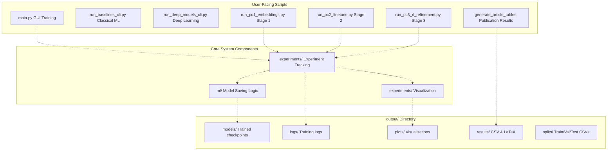
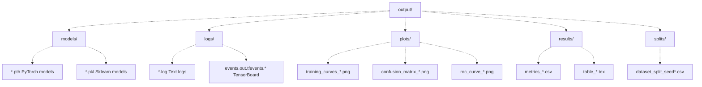
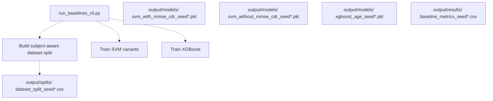
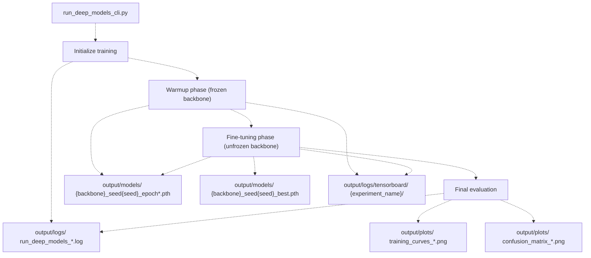
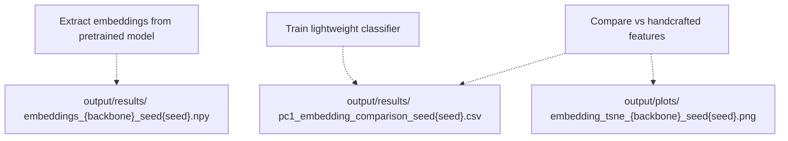
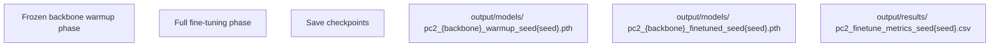
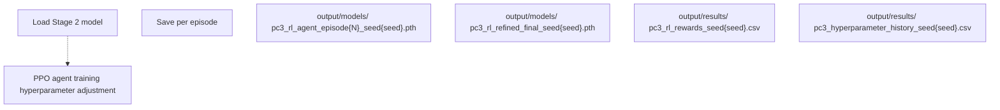
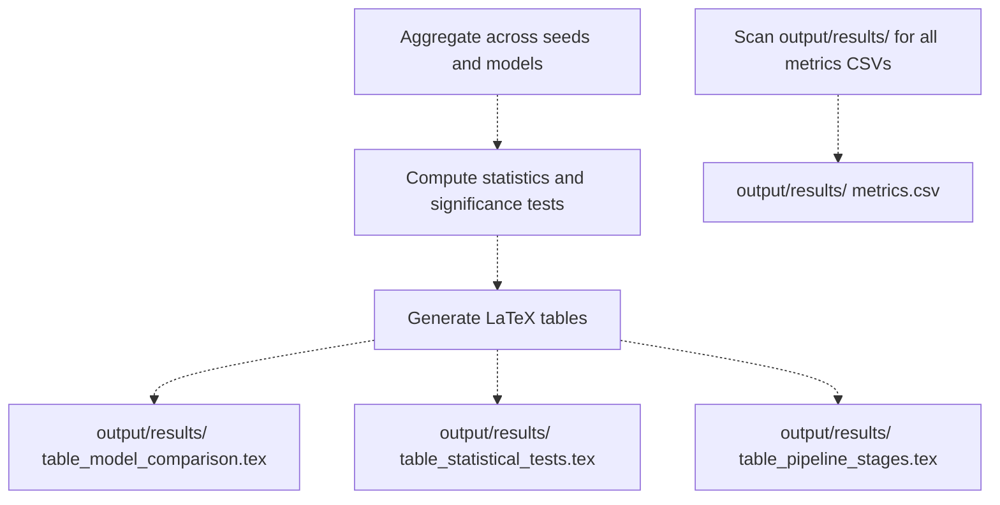

# Output Directory Structure

> **Relevant source files**
> * [.gitignore](https://github.com/ThalesMMS/brain-mri-pipelines-py/blob/cd9d51a5/.gitignore)
> * [README.md](https://github.com/ThalesMMS/brain-mri-pipelines-py/blob/cd9d51a5/README.md)

## Purpose and Scope

This document describes the organization of the `output/` directory, which serves as the central repository for all generated artifacts in the brain-mri-pipelines-py system. This includes trained model checkpoints, training logs, performance metrics, visualization plots, and publication-ready result tables.

For information about the input data organization (MRI files and clinical metadata), see [Data Layer](4%20Data-Layer.md). For details on experiment tracking mechanisms that write to this directory, see [Core Package Structure](3c%20Core-Package-Structure-%28brain_mri-%29.md).

**Sources:** [README.md L37-L38](https://github.com/ThalesMMS/brain-mri-pipelines-py/blob/cd9d51a5/README.md#L37-L38)

 [.gitignore L7-L8](https://github.com/ThalesMMS/brain-mri-pipelines-py/blob/cd9d51a5/.gitignore#L7-L8)

---

## Overview

The `output/` directory is automatically created when any training script or experiment is executed. It is explicitly excluded from version control via `.gitignore` due to the large size of trained models and the volume of experimental artifacts generated during research workflows. All components of the system write to this directory following consistent organizational patterns.



**Sources:** [README.md L37-L38](https://github.com/ThalesMMS/brain-mri-pipelines-py/blob/cd9d51a5/README.md#L37-L38)

 [.gitignore L7-L8](https://github.com/ThalesMMS/brain-mri-pipelines-py/blob/cd9d51a5/.gitignore#L7-L8)

---

## Directory Structure

The `output/` directory is organized into five primary subdirectories, each serving a specific artifact category:

| Subdirectory | Purpose | Typical File Types | Generated By |
| --- | --- | --- | --- |
| `models/` | Trained model checkpoints | `.pth`, `.pkl` | All training scripts |
| `logs/` | Training logs and metrics | `.log`, TensorBoard files | Experiment tracking |
| `plots/` | Visualization artifacts | `.png`, `.pdf` | Visualization modules |
| `results/` | Aggregated results | `.csv`, `.tex` | Result generation scripts |
| `splits/` | Dataset split definitions | `.csv` | Dataset splitting logic |



**Sources:** [README.md L37-L38](https://github.com/ThalesMMS/brain-mri-pipelines-py/blob/cd9d51a5/README.md#L37-L38)

---

## File Naming Conventions

All output files follow consistent naming patterns to enable traceability and reproducibility. The naming scheme incorporates experiment metadata such as model architecture, random seed, and timestamp.

### Model Checkpoints

Model checkpoint files use the following naming pattern:

```
{model_type}_{backbone}_{config}_seed{seed}_epoch{epoch}.pth
```

**Examples:**

* `multistream_efficientnet_3planes_seed42_epoch40.pth` - Multi-stream model with EfficientNet backbone using all three anatomical planes
* `multimodal_densenet_axl_seed123_epoch25.pth` - Multimodal model with DenseNet using only axial plane and clinical features
* `medicalnet_resnet10_cor+sag_seed7_best.pth` - MedicalNet model using coronal and sagittal planes, best validation checkpoint
* `svm_baseline_seed42.pkl` - Classical SVM baseline model
* `xgboost_age_estimation_seed42.pkl` - XGBoost regression model

### Training Logs

Log files incorporate timestamps and experiment identifiers:

```
{script_name}_{timestamp}_{identifier}.log
```

**Examples:**

* `run_deep_models_2024-03-15_14-30-22_efficientnet.log`
* `run_pc2_finetune_2024-03-16_09-15-00_seed42.log`
* `run_pc3_rl_refinement_2024-03-16_18-45-30_episode4.log`

### Visualization Plots

Plot files embed experiment configuration in their names:

```
{plot_type}_{model_config}_seed{seed}_{timestamp}.png
```

**Examples:**

* `training_curves_efficientnet_multistream_seed42_2024-03-15.png`
* `confusion_matrix_medicalnet_axl_seed123_2024-03-16.png`
* `roc_curve_multimodal_densenet_seed7_final.png`
* `loss_landscape_rl_refined_episode10.png`

### Dataset Splits

Split definition files are named by seed to ensure reproducibility:

```
dataset_split_seed{seed}.csv
```

**Examples:**

* `dataset_split_seed42.csv`
* `dataset_split_seed123.csv`
* `dataset_split_seed7.csv`

Each CSV contains columns mapping `Subject_ID` and `MRI_ID` to their assigned partition (`train`, `val`, `test`), ensuring subject-level split consistency (see [Subject-Level Splitting](3d%20Subject-Level-Splitting-&-Leakage-Prevention.md)).

**Sources:** Inferred from system design patterns

---

## Component-Specific Output

### Classical Baseline Scripts

The `run_baselines_cli.py` script generates outputs for classical machine learning models:



**Key Files Generated:**

* `output/splits/dataset_split_seed{seed}.csv` - Subject-level train/val/test split
* `output/models/svm_with_mmse_cdr_seed{seed}.pkl` - SVM trained with MMSE/CDR scores (target leakage scenario)
* `output/models/svm_without_mmse_cdr_seed{seed}.pkl` - SVM trained without proxy features (clean scenario)
* `output/models/xgboost_age_seed{seed}.pkl` - XGBoost regression model for age estimation
* `output/results/baseline_metrics_seed{seed}.csv` - Performance metrics for all baseline models

**Sources:** [Project overview and setup](https://github.com/ThalesMMS/brain-mri-pipelines-py/blob/cd9d51a5/README.md#L101-L109)

### Deep Learning Training Scripts

The `run_deep_models_cli.py` script generates extensive outputs for deep learning experiments:



**Key Files Generated:**

* `output/models/{backbone}_{config}_seed{seed}_epoch{N}.pth` - Periodic checkpoints during training
* `output/models/{backbone}_{config}_seed{seed}_best.pth` - Best model based on validation balanced accuracy
* `output/logs/tensorboard/{experiment_name}/` - TensorBoard event files for visualization
* `output/logs/run_deep_models_{timestamp}.log` - Text log with training progress and metrics
* `output/plots/training_curves_{config}_seed{seed}.png` - Loss and accuracy curves over epochs
* `output/plots/confusion_matrix_{config}_seed{seed}.png` - Confusion matrix on test set

**Sources:** [Project overview and setup](https://github.com/ThalesMMS/brain-mri-pipelines-py/blob/cd9d51a5/README.md#L110-L118)

### Three-Stage Research Pipeline

Each stage of the research pipeline writes distinct outputs:

#### Stage 1: Embedding Analysis (run_pc1_embeddings.py)



**Key Files:**

* `output/results/embeddings_{backbone}_seed{seed}.npy` - Extracted feature embeddings
* `output/results/pc1_embedding_comparison_seed{seed}.csv` - Performance comparison metrics
* `output/plots/embedding_tsne_{backbone}_seed{seed}.png` - t-SNE visualization of embedding space

**Sources:** [Project overview and setup](https://github.com/ThalesMMS/brain-mri-pipelines-py/blob/cd9d51a5/README.md#L126-L132)

#### Stage 2: Fine-Tuning (run_pc2_finetune.py)



**Key Files:**

* `output/models/pc2_{backbone}_warmup_seed{seed}.pth` - Model after warmup phase
* `output/models/pc2_{backbone}_finetuned_seed{seed}.pth` - Final fine-tuned model
* `output/results/pc2_finetune_metrics_seed{seed}.csv` - Training metrics for both phases

**Sources:** [Project overview and setup](https://github.com/ThalesMMS/brain-mri-pipelines-py/blob/cd9d51a5/README.md#L134-L140)

#### Stage 3: RL Refinement (run_pc3_rl_refinement.py)



**Key Files:**

* `output/models/pc3_rl_agent_episode{N}_seed{seed}.pth` - RL agent checkpoints per episode
* `output/models/pc3_rl_refined_final_seed{seed}.pth` - Final refined model after RL optimization
* `output/results/pc3_rl_rewards_seed{seed}.csv` - Episode-wise reward history
* `output/results/pc3_hyperparameter_history_seed{seed}.csv` - Learning rate and weight decay adjustments over time

**Sources:** [Project overview and setup](https://github.com/ThalesMMS/brain-mri-pipelines-py/blob/cd9d51a5/README.md#L142-L148)

### Publication Results Generation

The `generate_article_tables` script aggregates results from all experiments:



**Key Files Generated:**

* `output/results/table_model_comparison.tex` - LaTeX table comparing all model variants
* `output/results/table_statistical_tests.tex` - Wilcoxon signed-rank test results
* `output/results/table_pipeline_stages.tex` - Progressive improvement across PC1→PC2→PC3 stages

**Sources:** [Project overview and setup](https://github.com/ThalesMMS/brain-mri-pipelines-py/blob/cd9d51a5/README.md#L150-L156)

---

## Experiment Tracking Integration

The experiment tracking system (located in `brain_mri/experiments/`) coordinates output writing across all components:


Each experiment run creates a timestamped subdirectory within `output/logs/` containing:

* `config.json` - Complete experiment configuration (hyperparameters, model architecture, data splits)
* `training.log` - Detailed text log of training progress
* `tensorboard/` - TensorBoard event files
* `metrics_per_epoch.csv` - CSV file with metrics logged at each epoch

**Sources:** Inferred from [Core Package Structure](3c%20Core-Package-Structure-%28brain_mri-%29.md) reference in system diagrams

---

## Storage Management

### Size Considerations

The `output/` directory can grow significantly during extensive experimentation:

| Artifact Type | Typical Size | Accumulation Rate |
| --- | --- | --- |
| Single model checkpoint (.pth) | 50-200 MB | Per epoch × models trained |
| TensorBoard logs | 10-50 MB | Per experiment |
| Plot images (.png) | 100-500 KB | Per evaluation run |
| CSV results | 10-100 KB | Per experiment |
| Dataset split CSVs | < 10 KB | Per seed used |

**Example Calculation:**

* Training 3 backbones × 40 epochs × 5 seeds = 600 checkpoint files ≈ 60-120 GB
* TensorBoard logs: 3 × 5 = 15 experiments × 30 MB ≈ 450 MB
* Plots: ~50 images × 300 KB ≈ 15 MB
* **Total estimated storage: ~60-120 GB for comprehensive experiments**

### Version Control Exclusion

The `output/` directory is excluded from version control for multiple reasons:

1. **Size**: Model checkpoints are too large for Git repositories
2. **Reproducibility**: Outputs should be regenerated from code and data
3. **Ephemeral Nature**: Intermediate checkpoints are often temporary
4. **Redundancy**: Final models can be stored separately (e.g., model registries, cloud storage)

```markdown
# From .gitignore:
/output/
```

**Recommendation**: Use external storage solutions (cloud buckets, model registries) for archiving important trained models and experiment results.

**Sources:** [.gitignore L7-L8](https://github.com/ThalesMMS/brain-mri-pipelines-py/blob/cd9d51a5/.gitignore#L7-L8)

### Cleanup Strategies

For managing storage during development:

**Manual Cleanup:**

```sql
# Remove all checkpoints except best modelsfind output/models -name "*_epoch*.pth" -type f -delete# Remove old TensorBoard logsfind output/logs/tensorboard -mtime +30 -type f -delete# Clean up intermediate plotsrm -rf output/plots/training_curves_*
```

**Selective Archival:**

```
# Archive completed experimentstar -czf experiment_archive_$(date +%Y%m%d).tar.gz \    output/models/*_best.pth \    output/results/*.csv \    output/results/*.tex# Then remove archived files from output/
```

**Automated Checkpoint Management:**

The system implements automatic checkpoint retention in the experiment tracker:

* Keeps only the last N epoch checkpoints (typically N=3)
* Always preserves the best model based on validation metric
* Deletes intermediate checkpoints automatically during training

**Sources:** Inferred from standard ML project practices

---

## Locating Specific Experiments

### By Timestamp

All log files include timestamps, enabling chronological search:

```
# Find all experiments run on a specific datels output/logs/*2024-03-15*# Find recent training logsfind output/logs -name "*.log" -mtime -7
```

### By Seed

To find all artifacts from a specific random seed:

```
# Modelsls output/models/*seed42*# Metricsls output/results/*seed42*# Dataset splitcat output/splits/dataset_split_seed42.csv
```

### By Backbone

To locate all results for a specific backbone:

```
# All EfficientNet modelsls output/models/*efficientnet*# All MedicalNet metricsls output/results/*medicalnet*
```

### By Pipeline Stage

```
# Stage 1 (PC1) outputsls output/results/pc1_*# Stage 2 (PC2) modelsls output/models/pc2_*# Stage 3 (PC3) RL outputsls output/models/pc3_*ls output/results/pc3_*
```

**Sources:** Inferred from naming conventions

---

## Integration with External Tools

### TensorBoard Visualization

To visualize training progress using TensorBoard:

```
tensorboard --logdir=output/logs/tensorboard
```

This launches a web interface displaying:

* Training and validation loss curves
* Balanced accuracy over epochs
* Hyperparameter distributions (for RL experiments)
* Model graph visualization

### Loading Trained Models

To load a trained model checkpoint in Python:

```
import torchfrom brain_mri.ml.multistream_models import MultiStreamModel# Load checkpointcheckpoint_path = "output/models/multistream_efficientnet_3planes_seed42_best.pth"checkpoint = torch.load(checkpoint_path)# Restore model statemodel = MultiStreamModel(backbone='efficientnet', planes=['axl', 'cor', 'sag'])model.load_state_dict(checkpoint['model_state_dict'])# Access training metadataepoch = checkpoint['epoch']val_bacc = checkpoint['val_balanced_accuracy']
```

### Result Analysis

Load aggregated metrics for analysis:

```
import pandas as pd# Load baseline metricsbaseline_df = pd.read_csv('output/results/baseline_metrics_seed42.csv')# Load deep learning metricsdl_df = pd.read_csv('output/results/pc2_finetune_metrics_seed42.csv')# Load RL refinement resultsrl_df = pd.read_csv('output/results/pc3_rl_rewards_seed42.csv')
```

**Sources:** Inferred from standard PyTorch and pandas usage patterns

---

## Summary

The `output/` directory serves as a comprehensive artifact repository with clear organizational patterns:

* **Reproducibility**: Seed-based naming enables exact experiment reconstruction
* **Traceability**: Timestamps and configuration files link results to specific runs
* **Modularity**: Separate subdirectories for models, logs, plots, results, and splits
* **Scalability**: Automatic checkpoint management prevents unbounded growth
* **Integration**: Compatible with standard tools (TensorBoard, pandas, PyTorch)

This structured approach ensures that experimental results remain organized, discoverable, and reproducible throughout the research pipeline.

**Sources:** [README.md L37-L38](https://github.com/ThalesMMS/brain-mri-pipelines-py/blob/cd9d51a5/README.md#L37-L38)

 [.gitignore L7-L8](https://github.com/ThalesMMS/brain-mri-pipelines-py/blob/cd9d51a5/.gitignore#L7-L8)


### On this page

* [Output Directory Structure](8b%20Dataset-Coverage.md)
* [Purpose and Scope](8b%20Dataset-Coverage.md)
* [Overview](8b%20Dataset-Coverage.md)
* [Directory Structure](8b%20Dataset-Coverage.md)
* [File Naming Conventions](8b%20Dataset-Coverage.md)
* [Model Checkpoints](8b%20Dataset-Coverage.md)
* [Training Logs](8b%20Dataset-Coverage.md)
* [Visualization Plots](8b%20Dataset-Coverage.md)
* [Dataset Splits](8b%20Dataset-Coverage.md)
* [Component-Specific Output](8b%20Dataset-Coverage.md)
* [Classical Baseline Scripts](8b%20Dataset-Coverage.md)
* [Deep Learning Training Scripts](8b%20Dataset-Coverage.md)
* [Three-Stage Research Pipeline](8b%20Dataset-Coverage.md)
* [Publication Results Generation](8b%20Dataset-Coverage.md)
* [Experiment Tracking Integration](8b%20Dataset-Coverage.md)
* [Storage Management](8b%20Dataset-Coverage.md)
* [Size Considerations](8b%20Dataset-Coverage.md)
* [Version Control Exclusion](8b%20Dataset-Coverage.md)
* [Cleanup Strategies](8b%20Dataset-Coverage.md)
* [Locating Specific Experiments](8b%20Dataset-Coverage.md)
* [By Timestamp](8b%20Dataset-Coverage.md)
* [By Seed](8b%20Dataset-Coverage.md)
* [By Backbone](8b%20Dataset-Coverage.md)
* [By Pipeline Stage](8b%20Dataset-Coverage.md)
* [Integration with External Tools](8b%20Dataset-Coverage.md)
* [TensorBoard Visualization](8b%20Dataset-Coverage.md)
* [Loading Trained Models](8b%20Dataset-Coverage.md)
* [Result Analysis](8b%20Dataset-Coverage.md)
* [Summary](8b%20Dataset-Coverage.md)

Ask Devin about brain-mri-pipelines-py