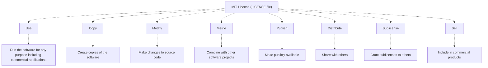
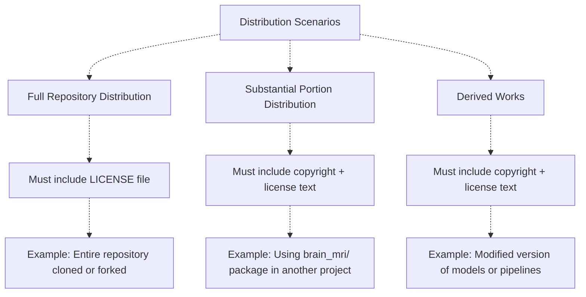
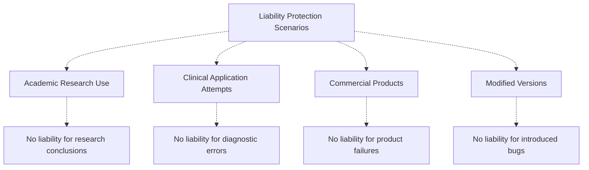
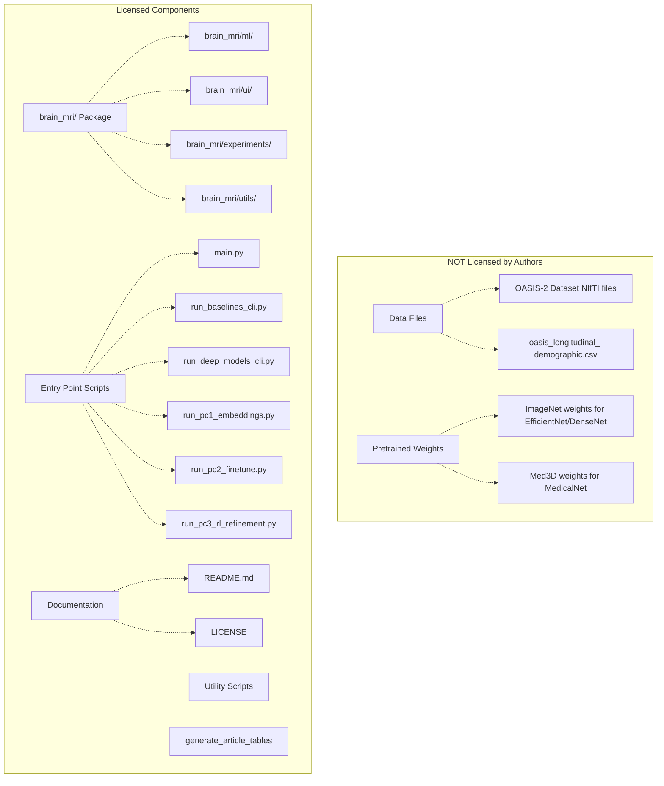

# License & Usage Terms

> **Relevant source files**
> * [LICENSE](https://github.com/ThalesMMS/brain-mri-pipelines-py/blob/cd9d51a5/LICENSE)

This page documents the licensing terms, copyright information, and usage permissions for the brain-mri-pipelines-py repository. The codebase is distributed under the MIT License, which grants broad permissions for use, modification, and distribution. For information about project configuration and development practices, see [8.1](#8.1) (Git Configuration) and [8.2](#8.2) (Output Directory Structure).

**Sources:** [LICENSE L1-L22](https://github.com/ThalesMMS/brain-mri-pipelines-py/blob/cd9d51a5/LICENSE#L1-L22)

---

## License Type

The repository is licensed under the **MIT License**, a permissive open-source license that allows for commercial and private use with minimal restrictions. The full license text is contained in the `LICENSE` file at the repository root.

**Sources:** [LICENSE L1](https://github.com/ThalesMMS/brain-mri-pipelines-py/blob/cd9d51a5/LICENSE#L1-L1)

---

## Copyright Holders

The copyright for this software is held jointly by four authors:

| Copyright Holder | Role |
| --- | --- |
| Antônio Soares Couto Neto | Co-author |
| Giovanna Naves Ribeiro | Co-author |
| Julia Rodrigues Vasconcellos Melo | Co-author |
| Thales Matheus Mendonça Santos | Co-author |

The copyright year is 2025, as specified in [LICENSE L3](https://github.com/ThalesMMS/brain-mri-pipelines-py/blob/cd9d51a5/LICENSE#L3-L3)

**Sources:** [LICENSE L3](https://github.com/ThalesMMS/brain-mri-pipelines-py/blob/cd9d51a5/LICENSE#L3-L3)

---

## Permissions Granted

The MIT License grants the following permissions to any person obtaining a copy of the software:



These permissions are granted "without restriction" as stated in [LICENSE L6-L8](https://github.com/ThalesMMS/brain-mri-pipelines-py/blob/cd9d51a5/LICENSE#L6-L8)

 This means users can:

* **Use** the software in academic research, commercial applications, or personal projects
* **Modify** any component, including models, data processing pipelines, and user interfaces
* **Distribute** modified or unmodified versions through any channel
* **Sublicense** the software under different terms (though the original MIT License must still apply)
* **Sell** commercial products that incorporate this software

**Sources:** [LICENSE L5-L10](https://github.com/ThalesMMS/brain-mri-pipelines-py/blob/cd9d51a5/LICENSE#L5-L10)

---

## Conditions and Requirements

The MIT License imposes two simple conditions:

### 1. Copyright Notice Inclusion

The copyright notice from [LICENSE L3](https://github.com/ThalesMMS/brain-mri-pipelines-py/blob/cd9d51a5/LICENSE#L3-L3)

 must be included in all copies or substantial portions of the software.

### 2. License Text Inclusion

The full permission text from [LICENSE L5-L10](https://github.com/ThalesMMS/brain-mri-pipelines-py/blob/cd9d51a5/LICENSE#L5-L10)

 and the disclaimer text from [LICENSE L15-L21](https://github.com/ThalesMMS/brain-mri-pipelines-py/blob/cd9d51a5/LICENSE#L15-L21)

 must be included in all copies or substantial portions of the software.

These conditions apply to:



The term "substantial portions" typically means any component that could be independently useful, including individual modules from the `brain_mri/` package, model implementations, or data processing utilities.

**Sources:** [LICENSE L10-L14](https://github.com/ThalesMMS/brain-mri-pipelines-py/blob/cd9d51a5/LICENSE#L10-L14)

---

## Warranty Disclaimer

The software is provided "AS IS" without any warranties. This disclaimer is legally required and protects the copyright holders from liability.

### Warranties Excluded

| Warranty Type | Description | Implication |
| --- | --- | --- |
| **MERCHANTABILITY** | Fitness for general use | No guarantee the software works correctly |
| **FITNESS FOR PARTICULAR PURPOSE** | Suitability for specific applications | No guarantee for medical diagnosis use |
| **NONINFRINGEMENT** | Freedom from third-party rights | No guarantee of patent/IP freedom |

### Liability Limitations

The authors and copyright holders are **not liable** for:

* Claims arising from software use
* Damages (direct, indirect, incidental, or consequential)
* Issues arising from use in medical or clinical settings
* Data loss or corruption
* Model prediction errors
* Any other liability related to the software

This is specified in [LICENSE L18-L21](https://github.com/ThalesMMS/brain-mri-pipelines-py/blob/cd9d51a5/LICENSE#L18-L21)

 and applies to all usage scenarios, including:



**Important Note:** This software is a research tool for Alzheimer's disease detection and is **not approved for clinical use**. Users attempting to deploy this system in medical settings assume all responsibility and risk.

**Sources:** [LICENSE L15-L21](https://github.com/ThalesMMS/brain-mri-pipelines-py/blob/cd9d51a5/LICENSE#L15-L21)

---

## License Application Scope

The MIT License applies to all original code and documentation in the repository:



### Components Subject to MIT License

All Python source code, documentation, and configuration files created by the authors are licensed under MIT terms. This includes:

* **Core Package:** All modules in `brain_mri/` including models, training logic, UI components, and utilities
* **Entry Points:** All CLI and GUI scripts (`main.py`, `run_*_cli.py`, `run_pc*.py`)
* **Utility Scripts:** Table generation and other helper scripts
* **Documentation:** README files and inline code documentation

### Components NOT Subject to MIT License

Several components used by this software have **separate licenses**:

| Component | License | Source |
| --- | --- | --- |
| **OASIS-2 Dataset** | OASIS Data Use Agreement | Washington University |
| **ImageNet Pretrained Weights** | ImageNet Terms of Access | Stanford Vision Lab |
| **Med3D Pretrained Weights** | Med3D Project License | Med3D Repository |
| **PyTorch Framework** | BSD License | PyTorch Contributors |
| **Scikit-learn Library** | BSD License | Scikit-learn Developers |

Users must comply with the respective licenses of these dependencies when using the software.

**Sources:** [LICENSE L1-L22](https://github.com/ThalesMMS/brain-mri-pipelines-py/blob/cd9d51a5/LICENSE#L1-L22)

---

## Practical Usage Guidelines

### Attribution Requirements

When using this software in academic publications, commercial products, or derived works:

1. **Include License File:** Copy the `LICENSE` file to any distribution
2. **Cite Copyright Holders:** Include the copyright notice from [LICENSE L3](https://github.com/ThalesMMS/brain-mri-pipelines-py/blob/cd9d51a5/LICENSE#L3-L3)  in documentation
3. **Academic Citations:** Consider citing relevant publications from the authors (if applicable)

### Modification and Distribution

Users are free to:

* Fork the repository on GitHub
* Modify any component for their needs
* Distribute modified versions
* Incorporate code into proprietary products

The only requirement is maintaining the copyright notice and license text in distributed versions.

### Example Attribution

For substantial portions or derived works, include:

```python
Portions of this software are derived from brain-mri-pipelines-py
Copyright (c) 2025 Antônio Soares Couto Neto, Giovanna Naves Ribeiro,
Julia Rodrigues Vasconcellos Melo, Thales Matheus Mendonça Santos
Licensed under the MIT License
```

**Sources:** [LICENSE L1-L22](https://github.com/ThalesMMS/brain-mri-pipelines-py/blob/cd9d51a5/LICENSE#L1-L22)

---

## License File Location

The license is stored at the repository root:

```markdown
brain-mri-pipelines-py/
├── LICENSE                    # MIT License text
├── main.py
├── run_baselines_cli.py
├── brain_mri/
│   ├── ml/
│   ├── ui/
│   ├── experiments/
│   └── utils/
└── ...
```

This placement ensures the license is visible in all standard repository interactions (GitHub browsing, git clones, package distributions).

**Sources:** [LICENSE L1-L22](https://github.com/ThalesMMS/brain-mri-pipelines-py/blob/cd9d51a5/LICENSE#L1-L22)

Refresh this wiki

Last indexed: 5 January 2026 ([cd9d51](https://github.com/ThalesMMS/brain-mri-pipelines-py/commit/cd9d51a5))

### On this page

* [License & Usage Terms](#8.3-license-usage-terms)
* [License Type](#8.3-license-type)
* [Copyright Holders](#8.3-copyright-holders)
* [Permissions Granted](#8.3-permissions-granted)
* [Conditions and Requirements](#8.3-conditions-and-requirements)
* [1. Copyright Notice Inclusion](#8.3-1-copyright-notice-inclusion)
* [2. License Text Inclusion](#8.3-2-license-text-inclusion)
* [Warranty Disclaimer](#8.3-warranty-disclaimer)
* [Warranties Excluded](#8.3-warranties-excluded)
* [Liability Limitations](#8.3-liability-limitations)
* [License Application Scope](#8.3-license-application-scope)
* [Components Subject to MIT License](#8.3-components-subject-to-mit-license)
* [Components NOT Subject to MIT License](#8.3-components-not-subject-to-mit-license)
* [Practical Usage Guidelines](#8.3-practical-usage-guidelines)
* [Attribution Requirements](#8.3-attribution-requirements)
* [Modification and Distribution](#8.3-modification-and-distribution)
* [Example Attribution](#8.3-example-attribution)
* [License File Location](#8.3-license-file-location)

Ask Devin about brain-mri-pipelines-py