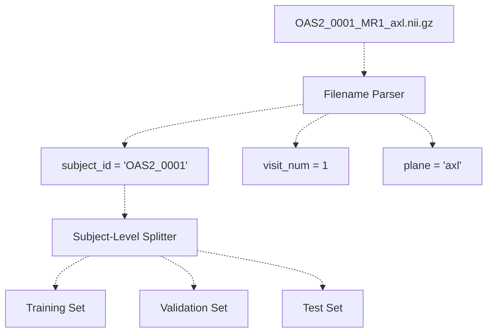
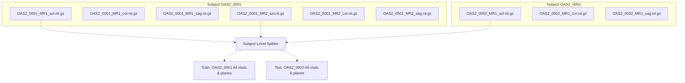
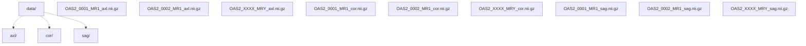
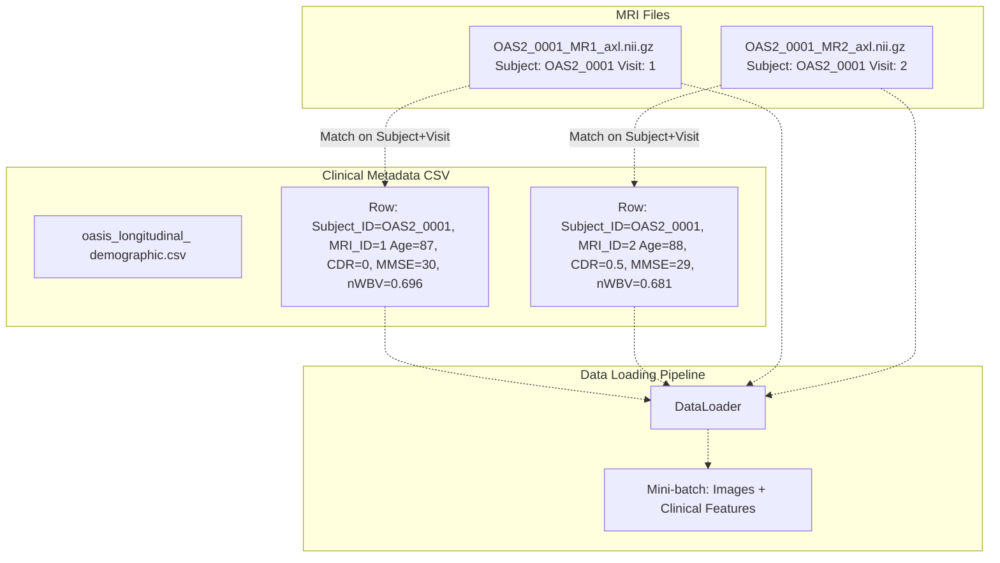
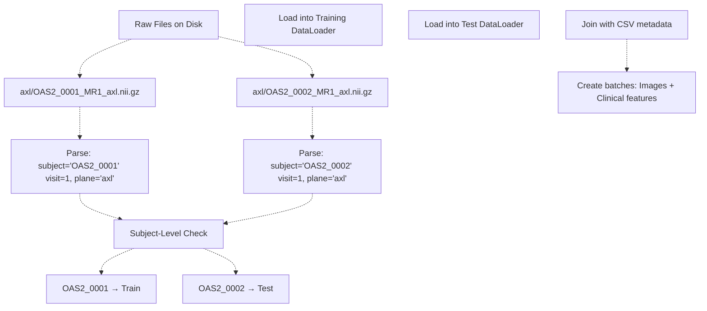

# Example Data Files

> **Relevant source files**
> * [axl/OAS2_0001_MR1_axl.nii.gz](https://github.com/ThalesMMS/brain-mri-pipelines-py/blob/cd9d51a5/axl/OAS2_0001_MR1_axl.nii.gz)
> * [axl/OAS2_0002_MR1_axl.nii.gz](https://github.com/ThalesMMS/brain-mri-pipelines-py/blob/cd9d51a5/axl/OAS2_0002_MR1_axl.nii.gz)
> * [axl/OAS2_0004_MR1_axl.nii.gz](https://github.com/ThalesMMS/brain-mri-pipelines-py/blob/cd9d51a5/axl/OAS2_0004_MR1_axl.nii.gz)

## Purpose and Scope

This page provides concrete examples of actual NIfTI files from the OASIS-2 dataset used in the brain-mri-pipelines-py system. It demonstrates the file naming conventions, directory structure, and how to interpret the information encoded in filenames. This serves as a reference for understanding the raw data inputs to the pipeline.

For detailed information about the NIfTI file format specification, see [NIfTI File Format](4b%20NIfTI-File-Format.md). For the overall directory organization principles, see [Directory Organization & File Naming](4c%20Directory-Organization-%26-File-Naming.md). For examples showing why subject-level splitting matters, see [Longitudinal Scans](8a%20Longitudinal-Scans-%28Same-Subject,-Multiple-Timepoints%29.md).

---

## File Naming Convention & Structure

The OASIS-2 dataset uses a systematic naming convention that encodes subject identity, visit number, and anatomical plane in each filename. Understanding this structure is critical for proper data handling and leakage prevention.

### Naming Pattern

All MRI scan files follow this pattern:

```
OAS2_<SubjectID>_MR<VisitNumber>_<Plane>.nii.gz
```

Where:

* **SubjectID**: Four-digit identifier (e.g., `0001`, `0002`)
* **VisitNumber**: Sequential visit number (e.g., `1`, `2`, `3`)
* **Plane**: Anatomical plane (`axl`, `cor`, or `sag`)
* Extension: `.nii.gz` (gzipped NIfTI format)

### Example Filenames Dissected

| Filename | Subject ID | Visit | Plane | Interpretation |
| --- | --- | --- | --- | --- |
| `OAS2_0001_MR1_axl.nii.gz` | `OAS2_0001` | `1` | Axial | Subject 0001, first visit, axial slice |
| `OAS2_0001_MR2_axl.nii.gz` | `OAS2_0001` | `2` | Axial | Subject 0001, second visit, axial slice |
| `OAS2_0002_MR1_cor.nii.gz` | `OAS2_0002` | `1` | Coronal | Subject 0002, first visit, coronal slice |
| `OAS2_0150_MR3_sag.nii.gz` | `OAS2_0150` | `3` | Sagittal | Subject 0150, third visit, sagittal slice |

### Filename Parsing in Code



**Sources:** File paths in repository structure: `axl/OAS2_0001_MR1_axl.nii.gz`, `axl/OAS2_0002_MR1_axl.nii.gz`

---

## Example Files in Repository

The repository includes representative example files demonstrating the data structure:

### Axial Plane Examples

**File: `axl/OAS2_0001_MR1_axl.nii.gz`**

* **Subject**: OAS2_0001
* **Visit**: First MRI session (MR1)
* **Plane**: Axial (horizontal slices)
* **Format**: Gzipped NIfTI-1
* **Purpose**: Demonstrates axial plane imaging from first subject

**File: `axl/OAS2_0002_MR1_axl.nii.gz`**

* **Subject**: OAS2_0002
* **Visit**: First MRI session (MR1)
* **Plane**: Axial (horizontal slices)
* **Format**: Gzipped NIfTI-1
* **Purpose**: Demonstrates different subject, enabling cross-subject comparison

### File Properties

Each `.nii.gz` file contains:

1. **NIfTI header** (348 bytes): Metadata including dimensions, voxel size, data type
2. **Image data**: 3D volume of voxel intensities
3. **Affine transformation**: Maps voxel coordinates to anatomical space

The gzip compression significantly reduces file size while preserving all medical imaging information.

**Sources:** `axl/OAS2_0001_MR1_axl.nii.gz`, `axl/OAS2_0002_MR1_axl.nii.gz`

---

## Subject-to-File Mapping

Understanding how files map to subjects is critical for preventing data leakage through proper train/validation/test splitting.



### Key Principle: Subject-Level Splitting

All files belonging to the same subject (identified by the `OAS2_XXXX` portion) **must** remain in the same data split. This prevents leakage where:

* Training set contains `OAS2_0001_MR1_axl.nii.gz`
* Test set contains `OAS2_0001_MR2_axl.nii.gz`

This would artificially inflate performance since the model has seen scans from the same brain during training.

**Sources:** Directory structure in repository, high-level architecture diagrams showing subject-aware splitting

---

## Anatomical Plane Organization

Files are organized into three directories corresponding to the three standard anatomical planes used in neuroimaging:



### Plane Descriptions

| Directory | Plane | Orientation | Use in Pipeline |
| --- | --- | --- | --- |
| `axl/` | Axial | Horizontal slices (top-to-bottom) | Stream 1 in multi-stream architecture |
| `cor/` | Coronal | Vertical slices (front-to-back) | Stream 2 in multi-stream architecture |
| `sag/` | Sagittal | Vertical slices (left-to-right) | Stream 3 in multi-stream architecture |

Each plane provides complementary information about brain structure. The multi-stream architecture processes all three planes independently before fusion.

**Sources:** Directory organization from repository structure

---

## File-to-Metadata Integration

Each NIfTI file links to clinical metadata through the subject ID and visit number:



### Metadata Mapping

The system joins imaging files with clinical data using:

1. **Subject_ID**: Extracted from filename prefix (e.g., `OAS2_0001`)
2. **MRI_ID**: Extracted from visit number (e.g., `MR1` → `1`)

These keys link to columns in `oasis_longitudinal_demographic.csv` containing:

* Age at scan
* Clinical Dementia Rating (CDR)
* Mini-Mental State Examination (MMSE) score
* Normalized whole brain volume (nWBV)
* Estimated total intracranial volume (eTIV)
* Atlas scaling factor (ASF)

**Sources:** High-level architecture showing data integration, CSV metadata structure

---

## Data Loading Example Flow

The following diagram shows how example files flow through the data loading pipeline:



### Step-by-Step Process

1. **File Discovery**: System scans `axl/`, `cor/`, `sag/` directories
2. **Filename Parsing**: Extracts subject ID, visit number, and plane from each filename
3. **Subject Grouping**: Groups all files by subject ID
4. **Subject-Level Split**: Assigns entire subjects to train/val/test sets
5. **Metadata Join**: Links files to corresponding rows in demographic CSV
6. **Data Loading**: Creates batches combining imaging data and clinical features
7. **Augmentation**: Applies transformations to training images

**Sources:** Data processing pipeline architecture, subject-level splitting mechanism

---

## File Count and Coverage

The OASIS-2 dataset contains approximately **150 subjects** with longitudinal follow-up:

### Expected File Structure

For a dataset with full coverage:

* **150 subjects** × **3 planes** × **~1-4 visits per subject** ≈ **450-1800 files**

### Example File Distribution

| Subject ID Range | Example Files | Typical Visits |
| --- | --- | --- |
| OAS2_0001 - 0050 | `OAS2_0001_MR1_axl.nii.gz` through `OAS2_0001_MR3_axl.nii.gz` | 1-3 visits |
| OAS2_0051 - 0100 | `OAS2_0075_MR1_cor.nii.gz` through `OAS2_0075_MR2_cor.nii.gz` | 1-2 visits |
| OAS2_0101 - 0150 | `OAS2_0125_MR1_sag.nii.gz` through `OAS2_0125_MR4_sag.nii.gz` | 1-4 visits |

### Data Split Example

With subject-level splitting:

* **Training**: 105 subjects (70%) → ~315-1260 files
* **Validation**: 22 subjects (15%) → ~66-270 files
* **Test**: 23 subjects (15%) → ~69-270 files

**Sources:** OASIS-2 dataset documentation, repository file structure

---

## Verification Checklist

When working with these files, verify:

✓ **Filename Format**: All files match `OAS2_XXXX_MRY_<plane>.nii.gz` pattern  

✓ **Subject Consistency**: All planes for a given subject/visit exist  

✓ **Split Integrity**: No subject appears in multiple splits  

✓ **Metadata Linkage**: Every file has corresponding CSV row  

✓ **File Integrity**: All `.nii.gz` files are valid and readable  

✓ **Plane Coverage**: Each subject/visit has axial, coronal, and sagittal scans

**Sources:** Data validation requirements from pipeline architecture


### On this page

* [Example Data Files](#9-example-data-files)
* [Purpose and Scope](#9-purpose-and-scope)
* [File Naming Convention & Structure](#9-file-naming-convention-structure)
* [Naming Pattern](#9-naming-pattern)
* [Example Filenames Dissected](#9-example-filenames-dissected)
* [Filename Parsing in Code](#9-filename-parsing-in-code)
* [Example Files in Repository](#9-example-files-in-repository)
* [Axial Plane Examples](#9-axial-plane-examples)
* [File Properties](#9-file-properties)
* [Subject-to-File Mapping](#9-subject-to-file-mapping)
* [Key Principle: Subject-Level Splitting](#9-key-principle-subject-level-splitting)
* [Anatomical Plane Organization](#9-anatomical-plane-organization)
* [Plane Descriptions](#9-plane-descriptions)
* [File-to-Metadata Integration](#9-file-to-metadata-integration)
* [Metadata Mapping](#9-metadata-mapping)
* [Data Loading Example Flow](#9-data-loading-example-flow)
* [Step-by-Step Process](#9-step-by-step-process)
* [File Count and Coverage](#9-file-count-and-coverage)
* [Expected File Structure](#9-expected-file-structure)
* [Example File Distribution](#9-example-file-distribution)
* [Data Split Example](#9-data-split-example)
* [Verification Checklist](#9-verification-checklist)

Ask Devin about brain-mri-pipelines-py