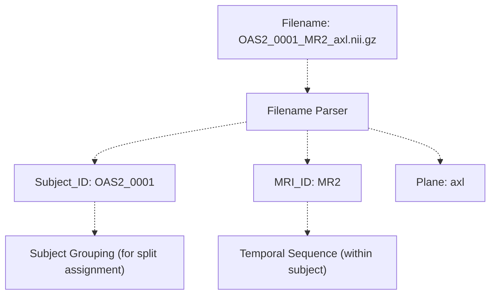
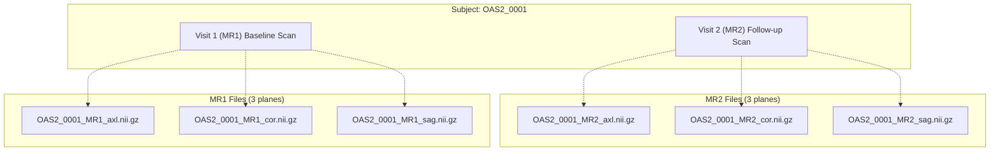
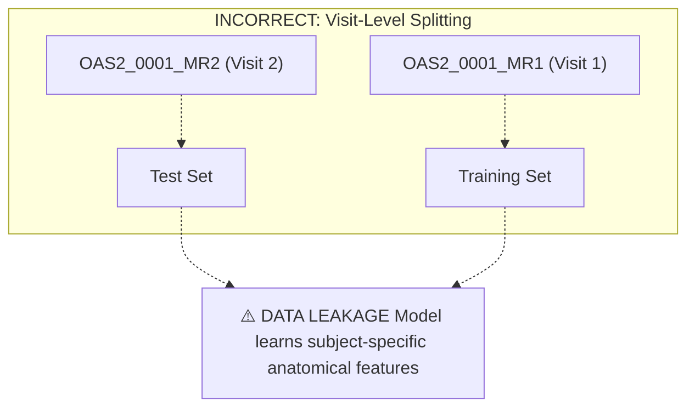
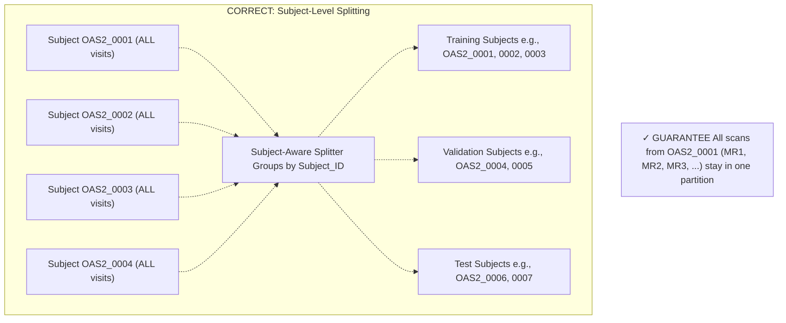
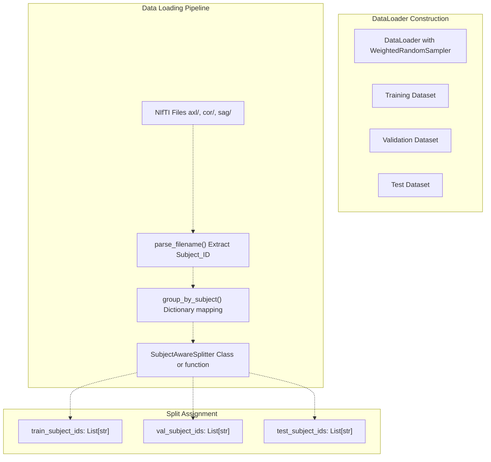
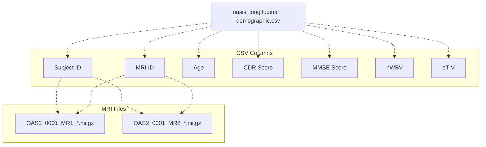

# Longitudinal Scans (Same Subject, Multiple Timepoints)

> **Relevant source files**
> * [axl/OAS2_0001_MR1_axl.nii.gz](https://github.com/ThalesMMS/brain-mri-pipelines-py/blob/cd9d51a5/axl/OAS2_0001_MR1_axl.nii.gz)
> * [axl/OAS2_0001_MR2_axl.nii.gz](https://github.com/ThalesMMS/brain-mri-pipelines-py/blob/cd9d51a5/axl/OAS2_0001_MR2_axl.nii.gz)
> * [axl/OAS2_0002_MR1_axl.nii.gz](https://github.com/ThalesMMS/brain-mri-pipelines-py/blob/cd9d51a5/axl/OAS2_0002_MR1_axl.nii.gz)
> * [axl/OAS2_0002_MR2_axl.nii.gz](https://github.com/ThalesMMS/brain-mri-pipelines-py/blob/cd9d51a5/axl/OAS2_0002_MR2_axl.nii.gz)
> * [axl/OAS2_0002_MR3_axl.nii.gz](https://github.com/ThalesMMS/brain-mri-pipelines-py/blob/cd9d51a5/axl/OAS2_0002_MR3_axl.nii.gz)

## Purpose and Scope

This page documents the **longitudinal structure** of the OASIS-2 dataset, where individual subjects have multiple MRI scans acquired at different timepoints. Understanding this structure is critical for preventing **data leakage** during model training. This page explains:

* The organization of longitudinal scan data in the repository
* The filename parsing strategy used to identify subjects and visits
* How the subject-level splitting mechanism ensures all scans from a single patient remain within one partition

For information about the overall data splitting strategy and leakage prevention mechanisms, see [Subject-Level Splitting & Leakage Prevention](3d%20Subject-Level-Splitting-&-Leakage-Prevention.md). For the broader dataset structure, see [OASIS-2 Dataset Overview](4a%20OASIS-2-Dataset-Overview.md).

---

## What Are Longitudinal Scans?

**Longitudinal scans** are multiple MRI acquisitions from the same individual at different time intervals. In the OASIS-2 dataset, participants returned for follow-up visits, resulting in multiple brain scans per subject captured months or years apart. Each scan represents a snapshot of brain structure at a specific timepoint.

### Clinical Context

Longitudinal data is valuable for studying disease progression, particularly for Alzheimer's disease research. By tracking the same individual over time, researchers can observe:

* Structural brain changes (atrophy, ventricle expansion)
* Disease trajectory from cognitively normal to mild cognitive impairment to dementia
* Interplay between aging and pathological changes

### Critical Implication for Machine Learning

**Data leakage risk**: If MRI scan 1 from Subject A is placed in the training set while MRI scan 2 from Subject A is placed in the test set, the model can learn **subject-specific features** (skull shape, overall brain morphology, anatomical idiosyncrasies) rather than disease-relevant patterns. This artificially inflates performance metrics.

**Sources**: High-level system architecture diagrams, Diagram 4 (Data Processing Pipeline & Leakage Prevention)

---

## Dataset Organization and File Naming Convention

### Directory Structure

The repository organizes MRI scans by anatomical plane:

```markdown
axl/         # Axial plane slices
cor/         # Coronal plane slices  
sag/         # Sagittal plane slices
```

### Filename Pattern

Each NIfTI file follows a strict naming convention:

```html
OAS2_<SubjectID>_MR<VisitNumber>_<plane>.nii.gz
```

**Components**:

* `OAS2`: Dataset identifier (Open Access Series of Imaging Studies, version 2)
* `<SubjectID>`: Four-digit zero-padded subject identifier (e.g., `0001`, `0002`, `0137`)
* `MR<VisitNumber>`: Visit/timepoint number (e.g., `MR1`, `MR2`, `MR3`)
* `<plane>`: Anatomical plane (`axl`, `cor`, `sag`)
* `.nii.gz`: Compressed NIfTI-1 format

**Sources**: [axl/](https://github.com/ThalesMMS/brain-mri-pipelines-py/blob/cd9d51a5/axl/)

 [cor/](https://github.com/ThalesMMS/brain-mri-pipelines-py/blob/cd9d51a5/cor/)

 [sag/](https://github.com/ThalesMMS/brain-mri-pipelines-py/blob/cd9d51a5/sag/)

 [4.3 Directory Organization & File Naming](4c%20Directory-Organization-&-File-Naming.md)

---

## Parsing Logic: Subject ID and Visit Extraction

The system must parse filenames to extract the **Subject_ID** (which groups all scans from the same individual) and the **MRI_ID** (which identifies specific visits).



**Extraction Strategy**:

1. **Subject_ID**: Extract characters matching `OAS2_XXXX` pattern (positions 0-9 in filename)
2. **Visit Number**: Extract characters matching `MRY` pattern where Y is the visit index
3. **Plane**: Extract the plane identifier before the file extension

**Sources**: High-level Diagram 4 (Filename Parser component), [4.3 Directory Organization & File Naming](4c%20Directory-Organization-&-File-Naming.md)

---

## Concrete Examples: Multiple Timepoints for Subject OAS2_0001

The repository contains actual longitudinal data demonstrating multiple visits per subject. Subject `OAS2_0001` has at least two MRI acquisitions:

### Longitudinal Scan Structure



### File Evidence

The repository contains the following files for Subject `OAS2_0001`:

| Filename | Subject ID | Visit | Plane | Timepoint |
| --- | --- | --- | --- | --- |
| `OAS2_0001_MR1_axl.nii.gz` | OAS2_0001 | MR1 | Axial | Baseline |
| `OAS2_0001_MR2_axl.nii.gz` | OAS2_0001 | MR2 | Axial | Follow-up |

Additionally, Subject `OAS2_0002` demonstrates a different individual:

| Filename | Subject ID | Visit | Plane | Timepoint |
| --- | --- | --- | --- | --- |
| `OAS2_0002_MR1_axl.nii.gz` | OAS2_0002 | MR1 | Axial | Baseline |

**Key Observation**: Subject `OAS2_0001` has multiple rows in this table (MR1 and MR2), while Subject `OAS2_0002` has only the baseline shown. The system must ensure that **all rows with Subject_ID = OAS2_0001** remain in the **same split** (either all in training, all in validation, or all in test).

**Sources**: [axl/OAS2_0001_MR1_axl.nii.gz](https://github.com/ThalesMMS/brain-mri-pipelines-py/blob/cd9d51a5/axl/OAS2_0001_MR1_axl.nii.gz)

 [axl/OAS2_0001_MR2_axl.nii.gz](https://github.com/ThalesMMS/brain-mri-pipelines-py/blob/cd9d51a5/axl/OAS2_0001_MR2_axl.nii.gz)

 [axl/OAS2_0002_MR1_axl.nii.gz](https://github.com/ThalesMMS/brain-mri-pipelines-py/blob/cd9d51a5/axl/OAS2_0002_MR1_axl.nii.gz)

---

## Subject-Level Splitting Mechanism

### Why Subject-Level Splitting Is Required

**Problem Scenario (Data Leakage)**:



The model can memorize that "brain scans with this particular skull shape and cortical folding pattern belong to Subject 0001" rather than learning genuine disease biomarkers.

**Sources**: High-level Diagram 4 (Data Processing Pipeline & Leakage Prevention)

---

### Correct Approach: Subject-Aware Splitting



**Algorithm**:

1. Extract `Subject_ID` from all filenames
2. Create unique list of subjects
3. Shuffle subject list with fixed random seed (reproducibility)
4. Split subject list into Train/Val/Test partitions (e.g., 70%/15%/15%)
5. Assign **all scans** from each subject to that subject's partition

**Result**: If Subject `OAS2_0001` is assigned to the training set, then both `OAS2_0001_MR1_axl.nii.gz` and `OAS2_0001_MR2_axl.nii.gz` (and all other visits/planes) are **guaranteed** to be in the training set.

**Sources**: High-level Diagram 4 (Subject-Aware Splitter, Train/Val/Test Subjects), [3.4 Subject-Level Splitting & Leakage Prevention](3d%20Subject-Level-Splitting-&-Leakage-Prevention.md)

---

## Implementation: Code-Level View

The subject-level splitting logic maps to specific code entities in the `brain_mri/` package:



**Key Code Entities**:

* **Filename parsing**: Regex or string slicing to extract `OAS2_XXXX` from filenames
* **Subject grouping**: Dictionary structure `{subject_id: [list of file paths]}`
* **Split assignment**: Deterministic random split based on subject IDs (not file paths)
* **Dataset construction**: Filter file lists based on assigned subject IDs

**Typical Implementation Pattern**:

```
# Pseudocode illustrating the conceptdef split_by_subject(file_paths, train_ratio=0.7, val_ratio=0.15):    # Extract subject IDs    subject_to_files = defaultdict(list)    for path in file_paths:        subject_id = extract_subject_id(path)  # e.g., "OAS2_0001"        subject_to_files[subject_id].append(path)        # Split subjects (not files)    subjects = list(subject_to_files.keys())    np.random.shuffle(subjects)  # with fixed seed        n_train = int(len(subjects) * train_ratio)    n_val = int(len(subjects) * val_ratio)        train_subjects = subjects[:n_train]    val_subjects = subjects[n_train:n_train+n_val]    test_subjects = subjects[n_train+n_val:]        # Collect all files for each split    train_files = [f for s in train_subjects for f in subject_to_files[s]]    val_files = [f for s in val_subjects for f in subject_to_files[s]]    test_files = [f for s in test_subjects for f in subject_to_files[s]]        return train_files, val_files, test_files
```

**Sources**: [3.2 Data Processing Pipeline](3b%20Data-Processing-Pipeline.md), [4.5 Data Loading & Augmentation](4e%20Loss-Functions-&-Class-Imbalance.md), High-level Diagram 4

---

## Clinical Metadata and Longitudinal Tracking

### Demographic CSV Structure

The `oasis_longitudinal_demographic.csv` file contains clinical metadata that links to the MRI scans:



**Key Relationships**:

* Each row in the CSV corresponds to one visit (one MRI acquisition session)
* The `Subject ID` column matches the `OAS2_XXXX` portion of filenames
* The `MRI ID` column matches the `MRY` portion, indicating visit sequence
* Multiple rows can exist for the same subject (longitudinal entries)

**Example CSV Rows**:

| Subject ID | MRI ID | Age | CDR | MMSE | nWBV | eTIV |
| --- | --- | --- | --- | --- | --- | --- |
| OAS2_0001 | MR1 | 62 | 0.0 | 29 | 0.735 | 1548 |
| OAS2_0001 | MR2 | 64 | 0.0 | 30 | 0.731 | 1548 |
| OAS2_0002 | MR1 | 73 | 0.5 | 26 | 0.710 | 1421 |

**Important Note**: When splitting data, the system must also ensure that **clinical metadata rows** for a given subject remain in the same split as that subject's **MRI files**. This prevents information leakage through the tabular data.

**Sources**: [4.4 Clinical Metadata](4d%20Clinical-Metadata.md), High-level Diagram 1 (Clinical Data node)

---

## Impact on Model Training and Evaluation

### Training Implications

**Batch Construction**:

* Within a training batch, multiple scans from the **same subject** may appear
* The model sees both `OAS2_0001_MR1` and `OAS2_0001_MR2` during training
* This is acceptable because both are in the training partition
* The model can learn temporal patterns (e.g., disease progression) if labels differ between visits

**Augmentation Strategy**:

* Data augmentation (rotation, flip, noise) must be applied **independently** to each scan
* Even scans from the same subject at different visits undergo different random augmentations
* This reduces overfitting to subject-specific anatomy

### Evaluation Guarantees

**Test Set Integrity**:

* Test subjects are **completely unseen** during training
* The model has never encountered any scan from test subjects (neither baseline nor follow-up)
* Performance metrics reflect genuine **generalization to new individuals**

**Validation Set Role**:

* Validation subjects used for hyperparameter tuning, early stopping, RL reward signals
* These subjects are also completely disjoint from training and test sets
* Prevents indirect leakage through hyperparameter optimization

**Sources**: High-level Diagram 4 (Training Pipeline, Evaluation Metrics), [5.5 Loss Functions & Class Imbalance](#5.5), [5.6 Evaluation Metrics](#5.6)

---

## Verification and Sanity Checks

### Recommended Validation Steps

Developers and researchers should verify the splitting logic by checking:

1. **Subject ID Uniqueness**: ``` train_subjects = set([extract_subject_id(f) for f in train_files])test_subjects = set([extract_subject_id(f) for f in test_files])assert train_subjects.isdisjoint(test_subjects) ```
2. **Visit Coverage**: * For subjects with multiple visits (e.g., MR1, MR2, MR3), confirm all visits are in the **same split** * Log warnings if a subject appears in multiple splits (indicates a bug)
3. **Count Verification**: ``` total_subjects = len(all_unique_subjects)train_count = len(train_subjects)val_count = len(val_subjects)test_count = len(test_subjects)assert train_count + val_count + test_count == total_subjects ```
4. **CSV Alignment**: * Ensure that for each MRI file in the test set, the corresponding CSV row is **not used** during training * Filter the demographic DataFrame based on subject lists

**Sources**: [3.4 Subject-Level Splitting & Leakage Prevention](3d%20Subject-Level-Splitting-&-Leakage-Prevention.md), [4.5 Data Loading & Augmentation](4e%20Loss-Functions-&-Class-Imbalance.md)

---

## Summary

Longitudinal scans in the OASIS-2 dataset present both an **opportunity** (study disease progression) and a **risk** (data leakage). The brain-mri-pipelines-py repository addresses this through:

1. **Filename parsing**: Extracting `Subject_ID` from the `OAS2_XXXX_MRY_plane.nii.gz` pattern
2. **Subject-level grouping**: Collecting all visits for each subject
3. **Split assignment**: Randomly partitioning subjects (not individual scans) into Train/Val/Test
4. **Enforcement**: Ensuring all scans from a subject remain in one partition

This methodology is **essential** for producing valid, generalizable Alzheimer's disease detection models and is explicitly highlighted in the system architecture as a critical anti-leakage mechanism.

**Sources**: High-level Diagrams 1, 4, 5; [3.4 Subject-Level Splitting & Leakage Prevention](3d%20Subject-Level-Splitting-&-Leakage-Prevention.md); [4.1 OASIS-2 Dataset Overview](4a%20OASIS-2-Dataset-Overview.md); [4.3 Directory Organization & File Naming](4c%20Directory-Organization-&-File-Naming.md); [axl/OAS2_0001_MR1_axl.nii.gz](https://github.com/ThalesMMS/brain-mri-pipelines-py/blob/cd9d51a5/axl/OAS2_0001_MR1_axl.nii.gz)

; [axl/OAS2_0001_MR2_axl.nii.gz](https://github.com/ThalesMMS/brain-mri-pipelines-py/blob/cd9d51a5/axl/OAS2_0001_MR2_axl.nii.gz)

; [axl/OAS2_0002_MR1_axl.nii.gz](https://github.com/ThalesMMS/brain-mri-pipelines-py/blob/cd9d51a5/axl/OAS2_0002_MR1_axl.nii.gz)


### On this page

* [Longitudinal Scans (Same Subject, Multiple Timepoints)](#9.1-longitudinal-scans-same-subject-multiple-timepoints)
* [Purpose and Scope](#9.1-purpose-and-scope)
* [What Are Longitudinal Scans?](#9.1-what-are-longitudinal-scans)
* [Clinical Context](#9.1-clinical-context)
* [Critical Implication for Machine Learning](#9.1-critical-implication-for-machine-learning)
* [Dataset Organization and File Naming Convention](#9.1-dataset-organization-and-file-naming-convention)
* [Directory Structure](#9.1-directory-structure)
* [Filename Pattern](#9.1-filename-pattern)
* [Parsing Logic: Subject ID and Visit Extraction](#9.1-parsing-logic-subject-id-and-visit-extraction)
* [Concrete Examples: Multiple Timepoints for Subject OAS2_0001](#9.1-concrete-examples-multiple-timepoints-for-subject-oas2_0001)
* [Longitudinal Scan Structure](#9.1-longitudinal-scan-structure)
* [File Evidence](#9.1-file-evidence)
* [Subject-Level Splitting Mechanism](#9.1-subject-level-splitting-mechanism)
* [Why Subject-Level Splitting Is Required](#9.1-why-subject-level-splitting-is-required)
* [Correct Approach: Subject-Aware Splitting](#9.1-correct-approach-subject-aware-splitting)
* [Implementation: Code-Level View](#9.1-implementation-code-level-view)
* [Clinical Metadata and Longitudinal Tracking](#9.1-clinical-metadata-and-longitudinal-tracking)
* [Demographic CSV Structure](#9.1-demographic-csv-structure)
* [Impact on Model Training and Evaluation](#9.1-impact-on-model-training-and-evaluation)
* [Training Implications](#9.1-training-implications)
* [Evaluation Guarantees](#9.1-evaluation-guarantees)
* [Verification and Sanity Checks](#9.1-verification-and-sanity-checks)
* [Recommended Validation Steps](#9.1-recommended-validation-steps)
* [Summary](#9.1-summary)

Ask Devin about brain-mri-pipelines-py