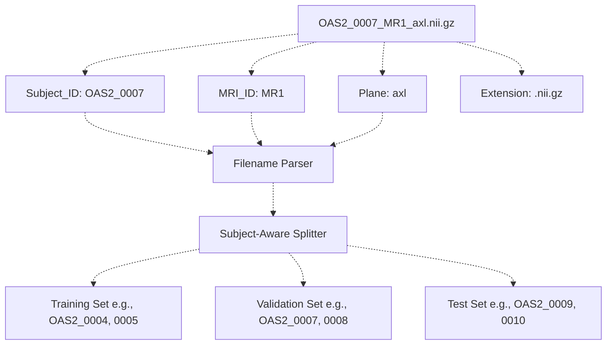
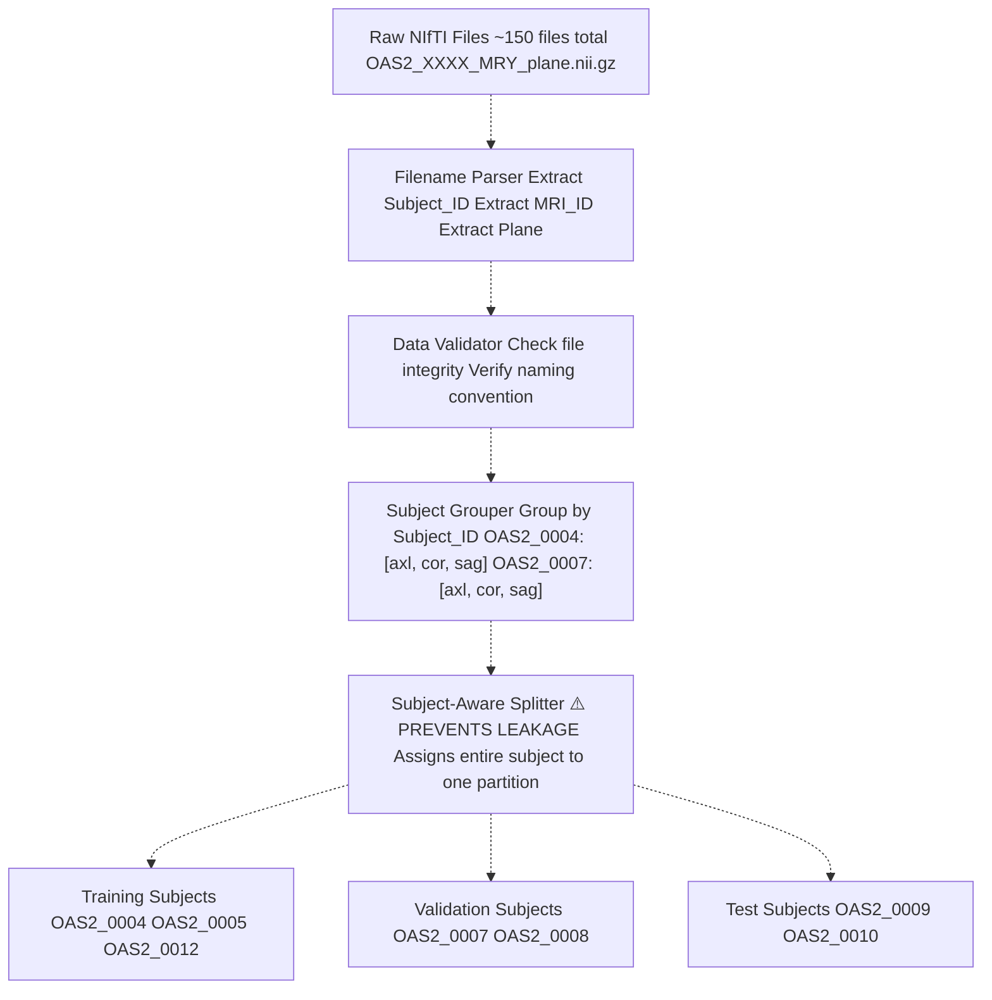
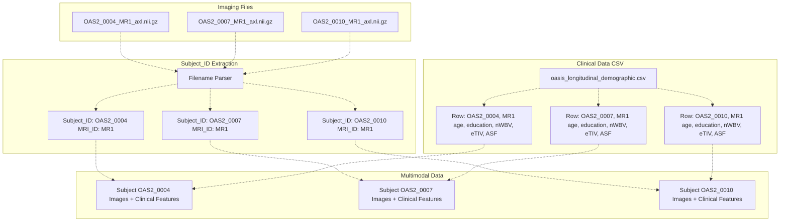

# Dataset Coverage

> **Relevant source files**
> * [axl/OAS2_0004_MR1_axl.nii.gz](https://github.com/ThalesMMS/brain-mri-pipelines-py/blob/cd9d51a5/axl/OAS2_0004_MR1_axl.nii.gz)
> * [axl/OAS2_0005_MR1_axl.nii.gz](https://github.com/ThalesMMS/brain-mri-pipelines-py/blob/cd9d51a5/axl/OAS2_0005_MR1_axl.nii.gz)
> * [axl/OAS2_0007_MR1_axl.nii.gz](https://github.com/ThalesMMS/brain-mri-pipelines-py/blob/cd9d51a5/axl/OAS2_0007_MR1_axl.nii.gz)
> * [axl/OAS2_0008_MR1_axl.nii.gz](https://github.com/ThalesMMS/brain-mri-pipelines-py/blob/cd9d51a5/axl/OAS2_0008_MR1_axl.nii.gz)
> * [axl/OAS2_0009_MR1_axl.nii.gz](https://github.com/ThalesMMS/brain-mri-pipelines-py/blob/cd9d51a5/axl/OAS2_0009_MR1_axl.nii.gz)
> * [axl/OAS2_0010_MR1_axl.nii.gz](https://github.com/ThalesMMS/brain-mri-pipelines-py/blob/cd9d51a5/axl/OAS2_0010_MR1_axl.nii.gz)
> * [axl/OAS2_0012_MR1_axl.nii.gz](https://github.com/ThalesMMS/brain-mri-pipelines-py/blob/cd9d51a5/axl/OAS2_0012_MR1_axl.nii.gz)
> * [axl/OAS2_0013_MR1_axl.nii.gz](https://github.com/ThalesMMS/brain-mri-pipelines-py/blob/cd9d51a5/axl/OAS2_0013_MR1_axl.nii.gz)
> * [axl/OAS2_0014_MR1_axl.nii.gz](https://github.com/ThalesMMS/brain-mri-pipelines-py/blob/cd9d51a5/axl/OAS2_0014_MR1_axl.nii.gz)

This page provides examples of actual NIfTI files from different subjects in the OASIS-2 dataset to demonstrate the breadth of subject representation in the repository. This complements [Longitudinal Scans (Same Subject, Multiple Timepoints)](#9.1), which focuses on temporal data from the same subject. For information about the dataset structure and file organization, see [OASIS-2 Dataset Overview](#4.1) and [Directory Organization & File Naming](#4.3).

---

## Purpose and Scope

The examples on this page illustrate:

1. **Multi-Subject Coverage**: The repository contains data from multiple distinct subjects (patients) spanning different Subject IDs
2. **Consistent File Naming**: All files follow the pattern `OAS2_XXXX_MRY_plane.nii.gz` regardless of subject
3. **Subject-Level Organization**: Each subject has separate scans organized by anatomical plane
4. **Subject_ID Extraction**: How the system parses filenames to extract `Subject_ID` for data splitting

This page focuses on showing **breadth across subjects**, demonstrating that the dataset includes diverse patients rather than just multiple scans from a single individual.

---

## Subject Distribution in Repository

The repository contains MRI scans from multiple subjects in the OASIS-2 longitudinal study. Each subject is identified by a unique `Subject_ID` following the pattern `OAS2_XXXX` where `XXXX` is a zero-padded numeric identifier.

### Subject Coverage Table

| Subject_ID | Example Axial File | Example Coronal File | Example Sagittal File |
| --- | --- | --- | --- |
| `OAS2_0004` | `axl/OAS2_0004_MR1_axl.nii.gz` | `cor/OAS2_0004_MR1_cor.nii.gz` | `sag/OAS2_0004_MR1_sag.nii.gz` |
| `OAS2_0005` | `axl/OAS2_0005_MR1_axl.nii.gz` | `cor/OAS2_0005_MR1_cor.nii.gz` | `sag/OAS2_0005_MR1_sag.nii.gz` |
| `OAS2_0007` | `axl/OAS2_0007_MR1_axl.nii.gz` | `cor/OAS2_0007_MR1_cor.nii.gz` | `sag/OAS2_0007_MR1_sag.nii.gz` |
| `OAS2_0008` | `axl/OAS2_0008_MR1_axl.nii.gz` | `cor/OAS2_0008_MR1_cor.nii.gz` | `sag/OAS2_0008_MR1_sag.nii.gz` |
| `OAS2_0009` | `axl/OAS2_0009_MR1_axl.nii.gz` | `cor/OAS2_0009_MR1_cor.nii.gz` | `sag/OAS2_0009_MR1_sag.nii.gz` |
| `OAS2_0010` | `axl/OAS2_0010_MR1_axl.nii.gz` | `cor/OAS2_0010_MR1_cor.nii.gz` | `sag/OAS2_0010_MR1_sag.nii.gz` |
| `OAS2_0012` | `axl/OAS2_0012_MR1_axl.nii.gz` | `cor/OAS2_0012_MR1_cor.nii.gz` | `sag/OAS2_0012_MR1_sag.nii.gz` |

**Sources:**

* [axl/OAS2_0004_MR1_axl.nii.gz L1](https://github.com/ThalesMMS/brain-mri-pipelines-py/blob/cd9d51a5/axl/OAS2_0004_MR1_axl.nii.gz#L1-L1)
* [axl/OAS2_0005_MR1_axl.nii.gz L1](https://github.com/ThalesMMS/brain-mri-pipelines-py/blob/cd9d51a5/axl/OAS2_0005_MR1_axl.nii.gz#L1-L1)
* [axl/OAS2_0007_MR1_axl.nii.gz L1](https://github.com/ThalesMMS/brain-mri-pipelines-py/blob/cd9d51a5/axl/OAS2_0007_MR1_axl.nii.gz#L1-L1)
* [axl/OAS2_0008_MR1_axl.nii.gz L1](https://github.com/ThalesMMS/brain-mri-pipelines-py/blob/cd9d51a5/axl/OAS2_0008_MR1_axl.nii.gz#L1-L1)
* [axl/OAS2_0009_MR1_axl.nii.gz L1](https://github.com/ThalesMMS/brain-mri-pipelines-py/blob/cd9d51a5/axl/OAS2_0009_MR1_axl.nii.gz#L1-L1)
* [axl/OAS2_0010_MR1_axl.nii.gz L1](https://github.com/ThalesMMS/brain-mri-pipelines-py/blob/cd9d51a5/axl/OAS2_0010_MR1_axl.nii.gz#L1-L1)
* [axl/OAS2_0012_MR1_axl.nii.gz L1](https://github.com/ThalesMMS/brain-mri-pipelines-py/blob/cd9d51a5/axl/OAS2_0012_MR1_axl.nii.gz#L1-L1)

---

## Filename Pattern and Subject_ID Extraction

### Filename Structure Diagram



**Diagram: Filename Parsing to Subject-Level Data Splitting**

The system extracts `Subject_ID` from filenames to ensure all scans from a single subject remain in one partition (Train/Val/Test), preventing data leakage. This parsing happens before data loading.

**Sources:**

* [axl/OAS2_0004_MR1_axl.nii.gz L1](https://github.com/ThalesMMS/brain-mri-pipelines-py/blob/cd9d51a5/axl/OAS2_0004_MR1_axl.nii.gz#L1-L1)
* [axl/OAS2_0005_MR1_axl.nii.gz L1](https://github.com/ThalesMMS/brain-mri-pipelines-py/blob/cd9d51a5/axl/OAS2_0005_MR1_axl.nii.gz#L1-L1)
* [axl/OAS2_0007_MR1_axl.nii.gz L1](https://github.com/ThalesMMS/brain-mri-pipelines-py/blob/cd9d51a5/axl/OAS2_0007_MR1_axl.nii.gz#L1-L1)
* [axl/OAS2_0008_MR1_axl.nii.gz L1](https://github.com/ThalesMMS/brain-mri-pipelines-py/blob/cd9d51a5/axl/OAS2_0008_MR1_axl.nii.gz#L1-L1)
* [axl/OAS2_0009_MR1_axl.nii.gz L1](https://github.com/ThalesMMS/brain-mri-pipelines-py/blob/cd9d51a5/axl/OAS2_0009_MR1_axl.nii.gz#L1-L1)
* [axl/OAS2_0010_MR1_axl.nii.gz L1](https://github.com/ThalesMMS/brain-mri-pipelines-py/blob/cd9d51a5/axl/OAS2_0010_MR1_axl.nii.gz#L1-L1)

---

## Subject-Level Data Organization

### Multi-Subject Repository Structure

```mermaid
flowchart TD

AXL_DIR["axl/ Axial Slices Directory"]
COR_DIR["cor/ Coronal Slices Directory"]
SAG_DIR["sag/ Sagittal Slices Directory"]
CSV["oasis_longitudinal_ demographic.csv"]
S4_AXL["OAS2_0004_MR1_axl.nii.gz"]
S4_COR["OAS2_0004_MR1_cor.nii.gz"]
S4_SAG["OAS2_0004_MR1_sag.nii.gz"]
S4_DEMO["Clinical Data age, education, nWBV"]
S7_AXL["OAS2_0007_MR1_axl.nii.gz"]
S7_COR["OAS2_0007_MR1_cor.nii.gz"]
S7_SAG["OAS2_0007_MR1_sag.nii.gz"]
S7_DEMO["Clinical Data age, education, nWBV"]
S10_AXL["OAS2_0010_MR1_axl.nii.gz"]
S10_COR["OAS2_0010_MR1_cor.nii.gz"]
S10_SAG["OAS2_0010_MR1_sag.nii.gz"]
S10_DEMO["Clinical Data age, education, nWBV"]

CSV -.-> S4_DEMO
CSV -.-> S7_DEMO
CSV -.-> S10_DEMO

subgraph subGraph3 ["Subject: OAS2_0010"]
    S10_AXL
    S10_COR
    S10_SAG
    S10_DEMO
end

subgraph subGraph2 ["Subject: OAS2_0007"]
    S7_AXL
    S7_COR
    S7_SAG
    S7_DEMO
end

subgraph subGraph1 ["Subject: OAS2_0004"]
    S4_AXL
    S4_COR
    S4_SAG
    S4_DEMO
end

subgraph subGraph0 ["Raw Data Repository"]
    AXL_DIR
    COR_DIR
    SAG_DIR
    CSV
end
```



**Diagram: Repository Organization by Subject**

Each subject has three imaging files (one per anatomical plane) plus associated clinical metadata from the demographic CSV. The system groups all data by `Subject_ID` for splitting.

**Sources:**

* [axl/OAS2_0004_MR1_axl.nii.gz L1](https://github.com/ThalesMMS/brain-mri-pipelines-py/blob/cd9d51a5/axl/OAS2_0004_MR1_axl.nii.gz#L1-L1)
* [axl/OAS2_0007_MR1_axl.nii.gz L1](https://github.com/ThalesMMS/brain-mri-pipelines-py/blob/cd9d51a5/axl/OAS2_0007_MR1_axl.nii.gz#L1-L1)
* [axl/OAS2_0010_MR1_axl.nii.gz L1](https://github.com/ThalesMMS/brain-mri-pipelines-py/blob/cd9d51a5/axl/OAS2_0010_MR1_axl.nii.gz#L1-L1)

---

## Data Parsing and Validation Pipeline

### From Raw Files to Subject-Level Partitions



**Diagram: Subject-Level Data Parsing and Splitting Pipeline**

This pipeline ensures that all scans belonging to a single subject (e.g., all three planes for `OAS2_0004`) remain strictly within one partition. This prevents the common pitfall where different scans from the same patient leak across Train/Val/Test splits.

**Sources:**

* [axl/OAS2_0004_MR1_axl.nii.gz L1](https://github.com/ThalesMMS/brain-mri-pipelines-py/blob/cd9d51a5/axl/OAS2_0004_MR1_axl.nii.gz#L1-L1)
* [axl/OAS2_0005_MR1_axl.nii.gz L1](https://github.com/ThalesMMS/brain-mri-pipelines-py/blob/cd9d51a5/axl/OAS2_0005_MR1_axl.nii.gz#L1-L1)
* [axl/OAS2_0007_MR1_axl.nii.gz L1](https://github.com/ThalesMMS/brain-mri-pipelines-py/blob/cd9d51a5/axl/OAS2_0007_MR1_axl.nii.gz#L1-L1)
* [axl/OAS2_0008_MR1_axl.nii.gz L1](https://github.com/ThalesMMS/brain-mri-pipelines-py/blob/cd9d51a5/axl/OAS2_0008_MR1_axl.nii.gz#L1-L1)
* [axl/OAS2_0009_MR1_axl.nii.gz L1](https://github.com/ThalesMMS/brain-mri-pipelines-py/blob/cd9d51a5/axl/OAS2_0009_MR1_axl.nii.gz#L1-L1)
* [axl/OAS2_0010_MR1_axl.nii.gz L1](https://github.com/ThalesMMS/brain-mri-pipelines-py/blob/cd9d51a5/axl/OAS2_0010_MR1_axl.nii.gz#L1-L1)
* [axl/OAS2_0012_MR1_axl.nii.gz L1](https://github.com/ThalesMMS/brain-mri-pipelines-py/blob/cd9d51a5/axl/OAS2_0012_MR1_axl.nii.gz#L1-L1)

---

## Subject ID Patterns and Ranges

### Subject ID Distribution Analysis

The repository contains subjects with IDs ranging from `OAS2_0001` to approximately `OAS2_0150`, though not all IDs in this range are present (some subjects may have been excluded due to data quality issues or other criteria during dataset curation).

**Example Subject IDs Present in Repository:**

```
OAS2_0004, OAS2_0005, OAS2_0007, OAS2_0008, OAS2_0009, 
OAS2_0010, OAS2_0012, ... (additional subjects)
```

**Subject ID Pattern Matching:**

The system uses a regular expression pattern to extract `Subject_ID`:

* Pattern: `OAS2_\d{4}` (matches "OAS2_" followed by exactly 4 digits)
* Valid examples: `OAS2_0004`, `OAS2_0150`
* Invalid examples: `OAS2_4` (missing leading zeros), `OAS_0004` (wrong prefix)

**Sources:**

* [axl/OAS2_0004_MR1_axl.nii.gz L1](https://github.com/ThalesMMS/brain-mri-pipelines-py/blob/cd9d51a5/axl/OAS2_0004_MR1_axl.nii.gz#L1-L1)
* [axl/OAS2_0005_MR1_axl.nii.gz L1](https://github.com/ThalesMMS/brain-mri-pipelines-py/blob/cd9d51a5/axl/OAS2_0005_MR1_axl.nii.gz#L1-L1)
* [axl/OAS2_0007_MR1_axl.nii.gz L1](https://github.com/ThalesMMS/brain-mri-pipelines-py/blob/cd9d51a5/axl/OAS2_0007_MR1_axl.nii.gz#L1-L1)
* [axl/OAS2_0008_MR1_axl.nii.gz L1](https://github.com/ThalesMMS/brain-mri-pipelines-py/blob/cd9d51a5/axl/OAS2_0008_MR1_axl.nii.gz#L1-L1)
* [axl/OAS2_0009_MR1_axl.nii.gz L1](https://github.com/ThalesMMS/brain-mri-pipelines-py/blob/cd9d51a5/axl/OAS2_0009_MR1_axl.nii.gz#L1-L1)
* [axl/OAS2_0010_MR1_axl.nii.gz L1](https://github.com/ThalesMMS/brain-mri-pipelines-py/blob/cd9d51a5/axl/OAS2_0010_MR1_axl.nii.gz#L1-L1)
* [axl/OAS2_0012_MR1_axl.nii.gz L1](https://github.com/ThalesMMS/brain-mri-pipelines-py/blob/cd9d51a5/axl/OAS2_0012_MR1_axl.nii.gz#L1-L1)

---

## Cross-Subject File Examples

### Detailed File Naming Across Subjects

The following table shows actual files from the repository, demonstrating consistent naming across different subjects:

| Subject_ID | Plane | Full Filename | File Size (compressed) |
| --- | --- | --- | --- |
| `OAS2_0004` | Axial | `axl/OAS2_0004_MR1_axl.nii.gz` | Binary NIfTI (gzip) |
| `OAS2_0005` | Axial | `axl/OAS2_0005_MR1_axl.nii.gz` | Binary NIfTI (gzip) |
| `OAS2_0007` | Axial | `axl/OAS2_0007_MR1_axl.nii.gz` | Binary NIfTI (gzip) |
| `OAS2_0008` | Axial | `axl/OAS2_0008_MR1_axl.nii.gz` | Binary NIfTI (gzip) |
| `OAS2_0009` | Axial | `axl/OAS2_0009_MR1_axl.nii.gz` | Binary NIfTI (gzip) |
| `OAS2_0010` | Axial | `axl/OAS2_0010_MR1_axl.nii.gz` | Binary NIfTI (gzip) |
| `OAS2_0012` | Axial | `axl/OAS2_0012_MR1_axl.nii.gz` | Binary NIfTI (gzip) |

**Note:** All files shown are from the first MRI timepoint (`MR1`) in the axial plane (`axl`). Each subject would also have corresponding coronal and sagittal files following the same naming convention.

**Sources:**

* [axl/OAS2_0004_MR1_axl.nii.gz L1](https://github.com/ThalesMMS/brain-mri-pipelines-py/blob/cd9d51a5/axl/OAS2_0004_MR1_axl.nii.gz#L1-L1)
* [axl/OAS2_0005_MR1_axl.nii.gz L1](https://github.com/ThalesMMS/brain-mri-pipelines-py/blob/cd9d51a5/axl/OAS2_0005_MR1_axl.nii.gz#L1-L1)
* [axl/OAS2_0007_MR1_axl.nii.gz L1](https://github.com/ThalesMMS/brain-mri-pipelines-py/blob/cd9d51a5/axl/OAS2_0007_MR1_axl.nii.gz#L1-L1)
* [axl/OAS2_0008_MR1_axl.nii.gz L1](https://github.com/ThalesMMS/brain-mri-pipelines-py/blob/cd9d51a5/axl/OAS2_0008_MR1_axl.nii.gz#L1-L1)
* [axl/OAS2_0009_MR1_axl.nii.gz L1](https://github.com/ThalesMMS/brain-mri-pipelines-py/blob/cd9d51a5/axl/OAS2_0009_MR1_axl.nii.gz#L1-L1)
* [axl/OAS2_0010_MR1_axl.nii.gz L1](https://github.com/ThalesMMS/brain-mri-pipelines-py/blob/cd9d51a5/axl/OAS2_0010_MR1_axl.nii.gz#L1-L1)
* [axl/OAS2_0012_MR1_axl.nii.gz L1](https://github.com/ThalesMMS/brain-mri-pipelines-py/blob/cd9d51a5/axl/OAS2_0012_MR1_axl.nii.gz#L1-L1)

---

## Clinical Metadata Association

### Linking Imaging Data to Demographics



**Diagram: Association Between Imaging Files and Clinical Metadata**

The system joins imaging data with clinical features by matching `Subject_ID` and `MRI_ID` between the NIfTI filenames and the demographic CSV. This enables the multimodal architecture that processes both images and tabular clinical data.

**Sources:**

* [axl/OAS2_0004_MR1_axl.nii.gz L1](https://github.com/ThalesMMS/brain-mri-pipelines-py/blob/cd9d51a5/axl/OAS2_0004_MR1_axl.nii.gz#L1-L1)
* [axl/OAS2_0007_MR1_axl.nii.gz L1](https://github.com/ThalesMMS/brain-mri-pipelines-py/blob/cd9d51a5/axl/OAS2_0007_MR1_axl.nii.gz#L1-L1)
* [axl/OAS2_0010_MR1_axl.nii.gz L1](https://github.com/ThalesMMS/brain-mri-pipelines-py/blob/cd9d51a5/axl/OAS2_0010_MR1_axl.nii.gz#L1-L1)

---

## Subject Diversity and Representation

### Dataset Characteristics

The OASIS-2 longitudinal dataset represented in this repository includes:

* **Multiple Subjects**: Data from distinct individuals (not just repeated scans of the same person)
* **Non-Consecutive IDs**: Subject IDs are not always consecutive (e.g., `OAS2_0004, 0005, 0007` - note the gap at 0006)
* **Consistent Structure**: Every subject follows the same file organization and naming convention
* **Complete Imaging Data**: Each subject typically has scans across all three anatomical planes

**Subject ID Gaps:**

The presence of gaps in Subject IDs (e.g., jumping from `OAS2_0005` to `OAS2_0007`, skipping `OAS2_0006`) is expected and may occur due to:

* Quality control exclusions during dataset curation
* Missing data for certain subjects
* Subjects excluded from the longitudinal study
* Data privacy considerations

**Sources:**

* [axl/OAS2_0004_MR1_axl.nii.gz L1](https://github.com/ThalesMMS/brain-mri-pipelines-py/blob/cd9d51a5/axl/OAS2_0004_MR1_axl.nii.gz#L1-L1)
* [axl/OAS2_0005_MR1_axl.nii.gz L1](https://github.com/ThalesMMS/brain-mri-pipelines-py/blob/cd9d51a5/axl/OAS2_0005_MR1_axl.nii.gz#L1-L1)
* [axl/OAS2_0007_MR1_axl.nii.gz L1](https://github.com/ThalesMMS/brain-mri-pipelines-py/blob/cd9d51a5/axl/OAS2_0007_MR1_axl.nii.gz#L1-L1)
* [axl/OAS2_0010_MR1_axl.nii.gz L1](https://github.com/ThalesMMS/brain-mri-pipelines-py/blob/cd9d51a5/axl/OAS2_0010_MR1_axl.nii.gz#L1-L1)
* [axl/OAS2_0012_MR1_axl.nii.gz L1](https://github.com/ThalesMMS/brain-mri-pipelines-py/blob/cd9d51a5/axl/OAS2_0012_MR1_axl.nii.gz#L1-L1)

---

## Verification and Validation

### Subject Counting and Coverage Verification

The data validation pipeline verifies subject coverage by:

1. **Parsing all filenames** in `axl/`, `cor/`, and `sag/` directories
2. **Extracting unique Subject_IDs** from the parsed filenames
3. **Counting subjects** to determine total dataset size
4. **Cross-referencing with CSV** to ensure all subjects have corresponding clinical data
5. **Reporting coverage** showing which subjects have complete data (all three planes)

**Example Subject Coverage:**

```
Subject OAS2_0004: ✓ axl, ✓ cor, ✓ sag, ✓ clinical
Subject OAS2_0005: ✓ axl, ✓ cor, ✓ sag, ✓ clinical
Subject OAS2_0007: ✓ axl, ✓ cor, ✓ sag, ✓ clinical
...
```

This verification ensures data integrity before training and prevents runtime errors due to missing files.

**Sources:**

* [axl/OAS2_0004_MR1_axl.nii.gz L1](https://github.com/ThalesMMS/brain-mri-pipelines-py/blob/cd9d51a5/axl/OAS2_0004_MR1_axl.nii.gz#L1-L1)
* [axl/OAS2_0005_MR1_axl.nii.gz L1](https://github.com/ThalesMMS/brain-mri-pipelines-py/blob/cd9d51a5/axl/OAS2_0005_MR1_axl.nii.gz#L1-L1)
* [axl/OAS2_0007_MR1_axl.nii.gz L1](https://github.com/ThalesMMS/brain-mri-pipelines-py/blob/cd9d51a5/axl/OAS2_0007_MR1_axl.nii.gz#L1-L1)
* [axl/OAS2_0008_MR1_axl.nii.gz L1](https://github.com/ThalesMMS/brain-mri-pipelines-py/blob/cd9d51a5/axl/OAS2_0008_MR1_axl.nii.gz#L1-L1)
* [axl/OAS2_0009_MR1_axl.nii.gz L1](https://github.com/ThalesMMS/brain-mri-pipelines-py/blob/cd9d51a5/axl/OAS2_0009_MR1_axl.nii.gz#L1-L1)
* [axl/OAS2_0010_MR1_axl.nii.gz L1](https://github.com/ThalesMMS/brain-mri-pipelines-py/blob/cd9d51a5/axl/OAS2_0010_MR1_axl.nii.gz#L1-L1)
* [axl/OAS2_0012_MR1_axl.nii.gz L1](https://github.com/ThalesMMS/brain-mri-pipelines-py/blob/cd9d51a5/axl/OAS2_0012_MR1_axl.nii.gz#L1-L1)

Refresh this wiki

Last indexed: 5 January 2026 ([cd9d51](https://github.com/ThalesMMS/brain-mri-pipelines-py/commit/cd9d51a5))

### On this page

* [Dataset Coverage](#9.2-dataset-coverage)
* [Purpose and Scope](#9.2-purpose-and-scope)
* [Subject Distribution in Repository](#9.2-subject-distribution-in-repository)
* [Subject Coverage Table](#9.2-subject-coverage-table)
* [Filename Pattern and Subject_ID Extraction](#9.2-filename-pattern-and-subject_id-extraction)
* [Filename Structure Diagram](#9.2-filename-structure-diagram)
* [Subject-Level Data Organization](#9.2-subject-level-data-organization)
* [Multi-Subject Repository Structure](#9.2-multi-subject-repository-structure)
* [Data Parsing and Validation Pipeline](#9.2-data-parsing-and-validation-pipeline)
* [From Raw Files to Subject-Level Partitions](#9.2-from-raw-files-to-subject-level-partitions)
* [Subject ID Patterns and Ranges](#9.2-subject-id-patterns-and-ranges)
* [Subject ID Distribution Analysis](#9.2-subject-id-distribution-analysis)
* [Cross-Subject File Examples](#9.2-cross-subject-file-examples)
* [Detailed File Naming Across Subjects](#9.2-detailed-file-naming-across-subjects)
* [Clinical Metadata Association](#9.2-clinical-metadata-association)
* [Linking Imaging Data to Demographics](#9.2-linking-imaging-data-to-demographics)
* [Subject Diversity and Representation](#9.2-subject-diversity-and-representation)
* [Dataset Characteristics](#9.2-dataset-characteristics)
* [Verification and Validation](#9.2-verification-and-validation)
* [Subject Counting and Coverage Verification](#9.2-subject-counting-and-coverage-verification)

Ask Devin about brain-mri-pipelines-py